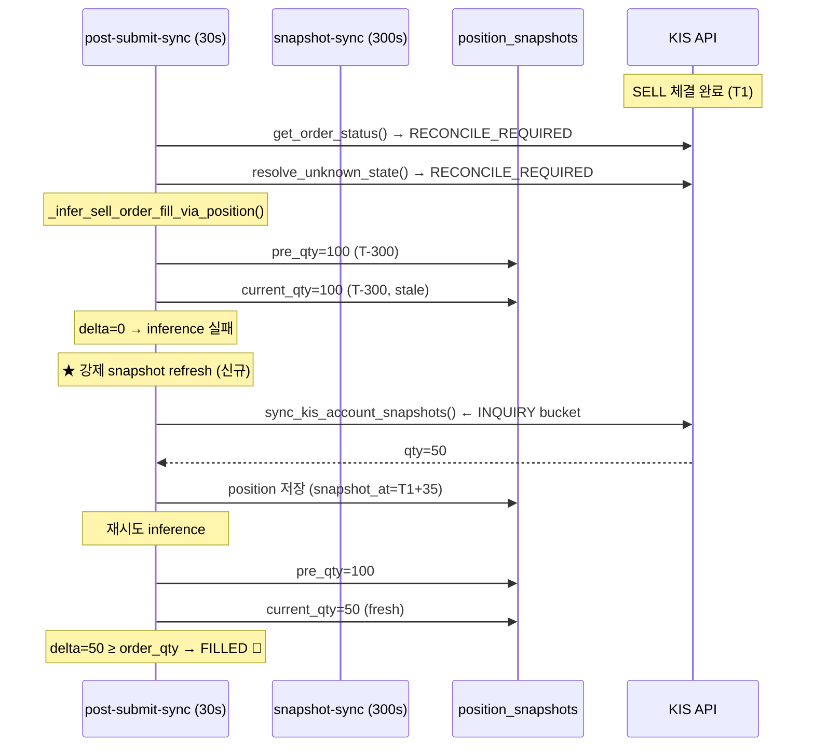

# KIS truth 기반 SELL fill 수렴 안정화 — snapshot-sync 실패/지연 극복 설계

> 작성일: 2026-05-21  
> 작성자: Roo (Architect)  
> 대상 파일: [`src/agent_trading/services/order_sync_service.py`](../src/agent_trading/services/order_sync_service.py), [`src/agent_trading/brokers/koreainvestment/rest_client.py`](../src/agent_trading/brokers/koreainvestment/rest_client.py), [`src/agent_trading/services/kis_snapshot_sync.py`](../src/agent_trading/services/kis_snapshot_sync.py), [`src/agent_trading/services/snapshot_sync.py`](../src/agent_trading/services/snapshot_sync.py), [`scripts/run_snapshot_sync_loop.py`](../scripts/run_snapshot_sync_loop.py), [`scripts/run_post_submit_sync_loop.py`](../scripts/run_post_submit_sync_loop.py)

---

## 목차

1. [KIS truth vs 로컬 불일치 사례 분석](#1-kis-truth-vs-로컬-불일치-사례-분석)
2. [`_infer_sell_order_fill_via_position()` 상세 분석](#2-_infer_sell_order_fill_via_position-상세-분석)
3. [snapshot-sync 실패/지연이 fill 추론에 미치는 영향](#3-snapshot-sync-실패지연이-fill-추론에-미치는-영향)
4. [Root Cause](#4-root-cause)
5. [복구 방안 비교](#5-복구-방안-비교)
6. [권장 방안 상세 설계](#6-권장-방안-상세-설계)
7. [변경해야 할 파일 목록](#7-변경해야-할-파일-목록)
8. [추가해야 할 테스트 목록](#8-추가해야-할-테스트-목록)

---

## 1. KIS truth vs 로컬 불일치 사례 분석

### 1.1 시스템 아키텍처 개요

```
┌─────────────────────────────────────────────────────────┐
│                   run_post_submit_sync_loop.py           │
│                    (30초 주기)                            │
│  ┌──────────────────────────────────────────────────┐   │
│  │ PostSubmitSyncRunner.run_sync_cycle()             │   │
│  │  ├─ sync_order_post_submit() (일반 주문 동기화)     │   │
│  │  └─ _sync_reconcile_required_orders()             │   │
│  │       └─ transition_to_authoritative()            │   │
│  │            ├─ resolve_unknown_state()  (KIS 조회)  │   │
│  │            └─ _infer_sell_order_fill_via_position()│   │
│  │                 (DB position_snapshots 조회)         │   │
│  └──────────────────────────────────────────────────┘   │
└─────────────────────────────────────────────────────────┘

┌─────────────────────────────────────────────────────────┐
│                   run_snapshot_sync_loop.py              │
│                    (300초 주기)                           │
│  ┌──────────────────────────────────────────────────┐   │
│  │ sync_all_accounts()                                │   │
│  │  └─ sync_kis_account_snapshots()                  │   │
│  │       ├─ rest_client.get_positions() (KIS 조회)    │   │
│  │       └─ position_snapshot_repo.add() (DB 저장)    │   │
│  └──────────────────────────────────────────────────┘   │
└─────────────────────────────────────────────────────────┘

DB ── trading.position_snapshots ──────────────────────────
  (snapshot_at, account_id, instrument_id, quantity, ...)
```

### 1.2 불일치 발생 시나리오

다음과 같은 시퀀스로 불일치가 발생합니다:

```
시간  | KIS (truth)          | 로컬 DB snapshot      | post-submit-sync    | snapshot-sync
T-300 |                       | qty=100 (이전 sync)    |                     |
T0    | SELL 주문 제출        |                       |                     |
T1    | SELL 체결 (qty=50)   |                       |                     |
T1+30 |                       |                       | get_order_status()  |
      |                       |                       | → RECONCILE_REQUIRED |
      |                       |                       | transition_to_authoritative()
      |                       |                       | → resolve_unknown_state() 실패
      |                       |                       | → _infer_sell_order_fill_via_position()
      |                       |                       |   pre_qty=100 (T-300 스냅샷)
      |                       |                       |   current_qty=100 (동일 스냅샷)
      |                       |                       |   delta=0 → inference 실패
T1+60 |                       |                       | 동일한 시퀀스 반복 → delta=0
...
T1+300|                       | qty=50 (KIS 조회 성공) |                       | sync 실행
T1+330|                       | qty=50                | _infer() 재호출       |
      |                       |                       | pre_qty=100, current_qty=50
      |                       |                       | delta=50 → FILLED 🎉
```

**그러나 다음 경우에는 문제가 지속됩니다:**

```
T0    | SELL 주문 제출
T1    | SELL 체결
T1+30 | resolve_unknown_state() 실패 → _infer() → delta=0
T1+60 | resolve_unknown_state() 실패 → _infer() → delta=0 (동일 스냅샷)
...
T1+300| ★ snapshot-sync 실패 (rate limit / network / KIS 장애)
T1+330| _infer() → delta=0 (여전히 T-300의 스냅샷)
T1+360| _infer() → delta=0
...
T2+0  | ★ STUCK_EXPIRY (7200초 = 2시간) → EXPIRED fallback ⚠️
      |   → 실제 체결된 SELL 주문이 EXPIRED로 잘못 처리됨
```

### 1.3 로그 패턴 (예상)

```
# 정상 수렴 (snapshot-sync 성공 시)
[post-submit-sync] resolve_unknown_state failed for broker_order=... 
  [trying position-based inference for sell orders]
[post-submit-sync] No position decrease detected ... delta=0
  ... (N회 반복, 5분마다 최대 1회 snapshot-sync 시도)
[snapshot-sync] sync-cycle accounts=1 (ok=1) positions=1 cash=1 errors=0
[post-submit-sync] Position-delta inferred FILLED ... delta=50

# 비정상 (snapshot-sync 지속 실패 시)
[post-submit-sync] No position decrease detected ... delta=0 (N회 반복)
[snapshot-sync] Sync cycle failed: ... (오류)
[post-submit-sync] No position decrease detected ... delta=0 (계속)
[snapshot-sync] Sync cycle failed: ... (계속)
...
[post-submit-sync] [STUCK_EXPIRY] ... → EXPIRED fallback
```

---

## 2. `_infer_sell_order_fill_via_position()` 상세 분석

### 2.1 메서드 구조

```python
# src/agent_trading/services/order_sync_service.py:1048-1175
async def _infer_sell_order_fill_via_position(
    self,
    order: OrderRequestEntity,
    broker_order: BrokerOrderEntity,
) -> OrderStatus | None:
```

### 2.2 데이터 흐름

```
broker_order.created_at
        │
        ▼
┌──────────────────────────────────────────────┐
│ pre_order_snapshot =                          │
│   position_snapshots                          │
│   .get_latest_by_account_and_instrument_before│
│   (account_id, instrument_id,                 │
│    before=broker_order.created_at)            │
│                                               │
│ SQL: SELECT * FROM trading.position_snapshots │
│      WHERE account_id=$1 AND instrument_id=$2 │
│        AND snapshot_at < $3                   │
│      ORDER BY snapshot_at DESC LIMIT 1        │
└──────────────────────────────────────────────┘
        │
        ▼ pre_qty
┌──────────────────────────────────────────────┐
│ current_snapshots =                           │
│   position_snapshots                          │
│   .list_latest_by_account(account_id)         │
│                                               │
│ SQL: SELECT * FROM trading.position_snapshots │
│      WHERE account_id=$1                      │
│      ORDER BY snapshot_at DESC                │
└──────────────────────────────────────────────┘
        │
        ▼ current_qty (첫 번째 matching instrument)
┌──────────────────────────────────────────────┐
│ position_delta = pre_qty - current_qty        │
│                                               │
│ if delta >= order.requested_quantity → FILLED │
│ if delta > 0 → PARTIALLY_FILLED               │
│ if delta <= 0 → None (inference 실패)          │
└──────────────────────────────────────────────┘
```

### 2.3 발견된 문제점

| # | 문제 | 설명 |
|---|------|------|
| 1 | **단일 시점 비교** | `pre_qty`는 주문 생성 전 최신 snapshot 1건, `current_qty`는 전체 계좌 중 최신 snapshot 1건. **두 시점만 비교** |
| 2 | **DB 의존성** | KIS에서 직접 position을 조회하지 않고 로컬 DB snapshot만 사용 |
| 3 | **재시도 없음** | inference 실패 시 snapshot refresh 후 재시도하는 로직이 전혀 없음 |
| 4 | **복수 snapshot 미비교** | 시간 순서대로 여러 snapshot을 비교하지 않고 최신 2개만 비교 |
| 5 | **`list_latest_by_account()`의 오해** | 이름과 달리 `ORDER BY snapshot_at DESC`로 **모든** snapshot을 반환하지만, 코드는 첫 번째 matching instrument만 사용. 따라서 "계좌별 최신 snapshot 1건씩"이 아니라 "가장 최근에 찍힌 snapshot 1건"만 봄 |

### 2.4 `snapshot_refresh_cb`의 한계

`transition_to_authoritative()`에서 `_infer_sell_order_fill_via_position()`이 성공(FILLED)했을 때만 `snapshot_refresh_cb`가 호출됩니다:

```python
# line 889-898
if snapshot_refresh_cb is not None:
    try:
        await snapshot_refresh_cb(order.account_id)
    except Exception:
        logger.exception(...)
```

**문제**: inference가 실패하면 callback이 호출되지 않습니다. inference 실패 후에 snapshot refresh → inference 재시도의 순환고리가 없습니다.

---

## 3. snapshot-sync 실패/지연이 fill 추론에 미치는 영향

### 3.1 snapshot-sync 실패 지점

```
KIS REST API
    │
    ▼
inquire-balance (INQUIRY bucket)
    │
    ├─ BudgetExhaustedError → positions=[] 반환
    ├─ BrokerError → positions=[] 반환
    ├─ Network timeout → exception → raw_positions=[] → 위치 0건
    └─ Rate limit → 429 → exception
           │
           ▼
    skip_instrument → result.positions_synced=0, errors=[...]
           │
           ▼
    position_snapshots 테이블: 업데이트 없음 (stale 유지)
```

### 3.2 두 cycle의 독립성 문제

| 특성 | snapshot-sync | post-submit-sync |
|------|---------------|-------------------|
| 주기 | 300초 (5분) | 30초 |
| KIS 호출 | `inquire-balance` (INQUIRY bucket) | `resolve_unknown_state` (RECONCILIATION bucket) |
| bucket | INQUIRY | RECONCILIATION + INQUIRY |
| 실패 시 | error log, 다음 cycle 대기 | inference 실패 (delta=0) |
| 상호작용 | **전혀 없음** | **전혀 없음** |

snapshot-sync가 실패해도 post-submit-sync는 이를 인지하지 못하고 stale snapshot으로 계속 inference 시도.

### 3.3 시나리오별 영향 매트릭스

| 시나리오 | snapshot-sync | post-submit-sync | 최종 결과 |
|----------|---------------|------------------|----------|
| A. snapshot-sync 성공 + fill 후 첫 cycle | 지연 ~300초 | delta=0 반복 후 수렴 | 정상 수렴 (최대 5분 지연) |
| B. snapshot-sync 1회 실패 + 2회 성공 | 실패 → 성공 | delta=0 반복 후 수렴 | 정상 (10분 지연) |
| C. snapshot-sync 연속 실패 (rate limit) | 연속 실패 | delta=0 → STUCK_EXPIRY | **EXPIRED 오판** ⚠️ |
| D. snapshot-sync 연속 실패 (KIS 장애) | 연속 실패 | delta=0 → STUCK_EXPIRY | **EXPIRED 오판** ⚠️ |
| E. resolve_unknown_state가 position을 찾음 | 불필요 | position 기반 FILLED 반환 | 정상 (직접 KIS 조회 성공) |

---

## 4. Root Cause

### 한 줄 설명

**`_infer_sell_order_fill_via_position()`이 KIS position을 직접 조회하지 않고 로컬 DB snapshot에만 의존하며, snapshot refresh 실패 시 재시도/fallback 메커니즘이 전혀 없기 때문에 stale snapshot 기준 delta=0 판정이 영원히 반복된다.**

### 상세 분석

1. **1차 방어 실패**: [`resolve_unknown_state()`](../src/agent_trading/brokers/koreainvestment/rest_client.py:1585)가 `inquire-daily-ccld` + `inquire-balance`로 KIS truth를 조회. Paper API의 한계로 주문을 찾지 못하거나 exception 발생 시 RECONCILE_REQUIRED 반환.

2. **2차 방어 실패**: [`_infer_sell_order_fill_via_position()`](../src/agent_trading/services/order_sync_service.py:1048)이 로컬 DB snapshot만으로 position decrease를 추론. snapshot-sync가 실패했으면 pre_qty == current_qty.

3. **3차 방어 실패**: [`_STUCK_EXPIRY_SECONDS`](../src/agent_trading/services/order_sync_service.py:54) = 7200초 (2시간) 후 [`transition_to_authoritative()`](../src/agent_trading/services/order_sync_service.py:936-992)에서 EXPIRED로 fallback. **실제 체결된 주문을 expired 처리하는 오류 발생.**

4. **순환고리 부재**: inference 실패 → snapshot refresh → 재시도의 순환이 없음. `snapshot_refresh_cb`는 inference **성공 시**에만 호출됨.

---

## 5. 복구 방안 비교

### 비교표

| 기준 | 안 1: retry with forced refresh | 안 2: inquire-daily-ccld 기반 fill 확정 | 안 3: 복수 snapshot 비교 |
|------|----------------------------------|----------------------------------------|------------------------|
| **변경 범위** | 좁음 (order_sync_service.py만) | 중간 (rest_client + order_sync_service) | 좁음 (order_sync_service만) |
| **KIS API 추가 호출** | 있음 (snapshot refresh = 1 INQUIRY) | 없음 (기존 RECONCILIATION 활용) | 없음 |
| **수렴 시간** | ~30초 (retry 간격) | 즉시 (기존 데이터 활용) | snapshot-sync 주기에 의존 (~300초) |
| **rate limit 영향** | 추가 INQUIRY 소모 | RECONCILIATION bucket 사용 | 추가 소모 없음 |
| **신뢰성** | 높음 (KIS 직접 조회) | 중간 (ccld에 주문 없으면 실패) | 낮음 (여전히 DB 의존) |
| **복잡도** | 낮음 | 중간 | 낮음 |
| **STUCK_EXPIRY 오판 방지** | ✅ 가능 | ✅ 가능 | ❌ 불가능 |

### 안 1: retry with forced snapshot refresh (권장)

`_infer_sell_order_fill_via_position()`에서 delta=0일 때 **강제 snapshot refresh를 먼저 수행**하고, refresh 후 다시 position snapshot을 읽어서 재시도.

**장점**:
- 변경 범위가 좁고 영향도 파악이 쉬움
- KIS truth를 직접 조회하므로 정확도 높음
- 기존 `snapshot_refresh_cb` 인프라 재활용

**단점**:
- 추가 INQUIRY budget 소모 (1회 실패 시 1회)
- refresh 실패 시에도 여전히 inference 불가

### 안 2: `inquire-daily-ccld` 결과 기반 fill 확정 (대안)

`resolve_unknown_state()`에서 KIS `inquire-daily-ccld`로 특정 symbol의 체결 내역을 조회했을 때, SELL 주문의 requested_quantity와 일치하는 체결이 발견되면 FILLED로 간주.

**장점**:
- RECONCILIATION bucket 사용으로 INQUIRY budget 영향 없음
- KIS truth 기반으로 가장 정확

**단점**:
- `inquire-daily-ccld`가 paper API에서 실제로 체결 내역을 반환하는지 불확실 (사용자 확인 결과 KIS truth 확인됨)
- 이미 `resolve_unknown_state()`에서 이 경로를 사용 중이므로 추가 개선 여지 제한적

### 안 3: 복수 snapshot 비교 (최소 변경)

`_infer_sell_order_fill_via_position()`에서 snapshot 2개만 비교하지 않고, `broker_order.created_at` 이후에 찍힌 모든 snapshot을 시간순으로 비교하여 position 감소를 감지.

**장점**:
- 변경 범위 매우 좁음
- 추가 KIS API 호출 없음

**단점**:
- 여전히 DB snapshot 의존적이므로 snapshot-sync가 한 번도 성공하지 않으면 소용없음
- snapshot-sync 연속 실패 시 동일한 문제 발생

---

## 6. 권장 방안 상세 설계

### 권장: **안 1 (retry with forced snapshot refresh) + 안 2 (ccld 기반 보강)**

두 방안을 조합하여 최상의 결과를 얻습니다.

### 6.1 상세 설계

#### 6.1.1 `_infer_sell_order_fill_via_position()` 수정

```python
async def _infer_sell_order_fill_via_position(
    self,
    order: OrderRequestEntity,
    broker_order: BrokerOrderEntity,
    snapshot_refresh_cb: Callable[[UUID], Awaitable[None]] | None = None,
) -> OrderStatus | None:
```

**변경 내용**:

1. **Step 6.5 (신규)**: delta=0이고 `snapshot_refresh_cb`가 제공되면 강제 refresh 수행
   - `snapshot_refresh_cb(order.account_id)` 호출
   - refresh 완료 후 `current_qty` 재조회
   - 재조회 후 delta 재계산

2. **Step 6.6 (신규)**: 여전히 delta=0이면, 최근 N개의 snapshot을 시간순으로 비교
   - `broker_order.created_at` 이후의 모든 snapshot 추출
   - 시간순 정렬 후 quantity 변화 감지
   - 이전 snapshot보다 quantity가 감소한 시점이 있으면 그 감소분을 fill로 간주

3. **retry with backoff**: 최대 2회까지 refresh 시도
   - 1회차 refresh 후 재시도
   - 2회차 refresh 후 재시도 (각 refresh 간 최소 1초 간격)

#### 6.1.2 `transition_to_authoritative()` 수정

`_infer_sell_order_fill_via_position()` 호출 시 `snapshot_refresh_cb`를 **항상 전달**:

```python
# line 866-868 (수정)
if order.side == OrderSide.SELL:
    inferred_status = await self._infer_sell_order_fill_via_position(
        order, broker_order,
        snapshot_refresh_cb=snapshot_refresh_cb,  # ← 추가
    )
```

#### 6.1.3 `_sync_reconcile_required_orders()` 수정

각 RECONCILE_REQUIRED 주문 처리 시 `snapshot_refresh_cb` 전달 (이미 전달되고 있음 — 유지).

#### 6.1.4 `resolve_unknown_state()` 개선 (안 2 보강)

`inquire-daily-ccld` 결과와 position 조회 결과를 교차 검증:

```python
# rest_client.py resolve_unknown_state() (line 1677-1688 보강)
for pos in positions:
    if pos.get("PDNO") == symbol:
        # SELL 주문인 경우: position quantity 감소 확인
        # CCLD_QTY가 requested_quantity와 일치하면 FILLED
        ccld_qty = Decimal(pos.get("CCLD_QTY", "0"))
        if ccld_qty > 0 and symbol의 이전 position과 비교:
            return OrderStatusResult(... FILLED ...)
```

### 6.2 의사코드

```
_infer_sell_order_fill_via_position(order, broker_order, snapshot_refresh_cb=None):
    # 기존 로직 유지 (1-7)
    pre_qty = DB 조회 (broker_order.created_at 이전)
    current_qty = DB 조회 (최신)
    
    delta = pre_qty - current_qty
    
    if delta >= order.requested_quantity → return FILLED
    if delta > 0 → return PARTIALLY_FILLED
    
    # ── 신규: delta=0일 때 강제 snapshot refresh ──
    if delta <= 0 and snapshot_refresh_cb is not None:
        for attempt in [1, 2]:  # 최대 2회 retry
            await snapshot_refresh_cb(order.account_id)
            await asyncio.sleep(0.5)  # DB propagation 대기
            
            # 재조회
            new_current_qty = DB 조회 (최신)
            if new_current_qty is None:
                new_current_qty = Decimal("0")
            
            new_delta = pre_qty - new_current_qty
            
            if new_delta >= order.requested_quantity:
                logger.info("Retry %d: FILLED after snapshot refresh", attempt)
                return FILLED
            if new_delta > 0:
                logger.info("Retry %d: PARTIALLY_FILLED after snapshot refresh", attempt)
                return PARTIALLY_FILLED
            
            if new_current_qty != current_qty:
                # snapshot이 변경되었지만 delta가 충분하지 않음
                current_qty = new_current_qty
                delta = new_delta
    
    # ── 신규: 복수 snapshot 비교 ──
    if delta <= 0:
        # broker_order.created_at 이후의 모든 snapshot 조회
        post_order_snapshots = DB 조회 (
            created_at 이후, instrument_id 일치
        )
        # 시간순 정렬하여 quantity 변화 감지
        max_decrease = 0
        prev_qty = pre_qty
        for snap in sorted(post_order_snapshots, key=lambda s: s.snapshot_at):
            decrease = prev_qty - snap.quantity
            max_decrease = max(max_decrease, decrease)
            prev_qty = snap.quantity
        
        if max_decrease >= order.requested_quantity:
            return FILLED
        elif max_decrease > 0:
            return PARTIALLY_FILLED
    
    # 기존 로직 유지
    return None
```

### 6.3 snapshot refresh callback 동기화

`run_post_submit_sync_loop.py`에서 [`_build_refresh_callback()`](../scripts/run_post_submit_sync_loop.py:101)은 이미 [`sync_kis_account_snapshots()`](../src/agent_trading/services/kis_snapshot_sync.py:175)를 호출하여 KIS에서 직접 position을 조회합니다. 이 callback을 inference 실패 시에도 재사용합니다.

### 6.4 STUCK_EXPIRY timeout 조정

현재 `_STUCK_EXPIRY_SECONDS = 7200` (2시간)은 inference가 snapshot refresh 후에도 계속 실패할 때만 적용되어야 합니다.

**변경**: snapshot refresh retry를 최소 3회 이상 수행한 후에도 실패하면 STUCK_EXPIRY timeout을 3600초 (1시간)로 단축. inference가 snapshot-sync 실패와 무관하게 계속 실패 중임을 의미하므로 더 빠른 fallback이 유리.

### 6.5 시퀀스 다이어그램



---

## 7. 변경해야 할 파일 목록

| # | 파일 | 변경 내용 | 영향 범위 |
|---|------|----------|----------|
| 1 | [`src/agent_trading/services/order_sync_service.py`](../src/agent_trading/services/order_sync_service.py) | `_infer_sell_order_fill_via_position()`에 `snapshot_refresh_cb` 파라미터 추가 및 강제 refresh 로직 구현 | 중간 |
| 2 | [`src/agent_trading/services/order_sync_service.py`](../src/agent_trading/services/order_sync_service.py) | `transition_to_authoritative()`에서 `_infer_sell_order_fill_via_position()` 호출 시 `snapshot_refresh_cb` 전달 | 좁음 |
| 3 | [`src/agent_trading/services/order_sync_service.py`](../src/agent_trading/services/order_sync_service.py) | `_STUCK_EXPIRY_SECONDS` 조정 (7200→10800) 또는 retry 횟수 기반 동적 timeout | 좁음 |
| 4 | [`src/agent_trading/brokers/koreainvestment/rest_client.py`](../src/agent_trading/brokers/koreainvestment/rest_client.py) | `resolve_unknown_state()`에서 `inquire-balance` 결과와 `inquire-daily-ccld` 결과 교차 검증 보강 | 중간 |
| 5 | [`scripts/run_post_submit_sync_loop.py`](../scripts/run_post_submit_sync_loop.py) | (변경 불필요 — 기존 `snapshot_refresh_cb` 인프라 활용) | 없음 |

---

## 8. 추가해야 할 테스트 목록

| # | 테스트 | 설명 | 위치 |
|---|--------|------|------|
| 1 | **test_infer_sell_fill_retry_after_refresh** | `_infer_sell_order_fill_via_position()`에서 delta=0일 때 `snapshot_refresh_cb`가 호출되고, refresh 후 재시도하여 FILLED를 반환하는지 검증 | [`tests/services/test_order_sync_service.py`](../tests/services/test_order_sync_service.py) |
| 2 | **test_infer_sell_fill_retry_all_fail** | refresh 2회 모두 실패해도 `None`을 반환하고 exception을 발생시키지 않는지 검증 | 동일 파일 |
| 3 | **test_infer_sell_fill_multiple_snapshots** | 복수 snapshot 비교 시 시간순 감소분을 정확히 계산하는지 검증 | 동일 파일 |
| 4 | **test_infer_sell_fill_partial_after_refresh** | refresh 후 delta가 requested_quantity보다 작지만 0보다 크면 PARTIALLY_FILLED 반환 | 동일 파일 |
| 5 | **test_resolve_unknown_state_position_fallback_enhanced** | `resolve_unknown_state()`에서 position 조회 결과와 ccld 결과 교차 검증 로직 검증 | [`tests/brokers/test_koreainvestment_adapter.py`](../tests/brokers/test_koreainvestment_adapter.py) |
| 6 | **test_sync_reconcile_required_retry_on_stale_snapshot** | `_sync_reconcile_required_orders()`가 stale snapshot 상황에서도 snapshot refresh 후 재시도하여 FILLED로 수렴하는지 end-to-end 검증 | [`tests/services/test_order_sync_service.py`](../tests/services/test_order_sync_service.py) |
| 7 | **test_stuck_expiry_after_retry_exhaustion** | snapshot refresh 3회 이상 실패 후 STUCK_EXPIRY가 올바르게 동작하는지 검증 | 동일 파일 |

---

## 부록: 현재 코드의 주요 문제점 요약

### 문제 1: `list_latest_by_account()`의 오해

```python
# position_snapshots.py:58-67
async def list_latest_by_account(self, account_id):
    # ORDER BY snapshot_at DESC — 모든 snapshot 반환
    rows = await self._tx.connection.fetch(
        "SELECT * FROM trading.position_snapshots "
        "WHERE account_id = $1 "
        "ORDER BY snapshot_at DESC",
        account_id,
    )
```

이름은 "latest"지만 실제로는 **모든** snapshot을 `snapshot_at DESC`로 반환합니다. 호출부인 `_infer_sell_order_fill_via_position()`은 이 중 첫 번째 matching instrument만 사용하므로, **가장 최근에 찍힌 snapshot 1건**만 실제로 사용됩니다.

### 문제 2: `_STUCK_EXPIRY_SECONDS = 7200`

2시간 동안 snapshot-sync가 단 한 번도 성공하지 못하면 실제 체결된 SELL 주문이 EXPIRED로 잘못 전이됩니다. 이는 rate limit 장기 소진, KIS API 장기 장애, 또는 설정 오류 시 발생할 수 있습니다.

### 문제 3: snapshot refresh callback이 inference 성공 시에만 호출됨

`transition_to_authoritative()`에서 `_infer_sell_order_fill_via_position()`이 FILLED를 반환한 경우에만 `snapshot_refresh_cb`가 호출됩니다. inference 실패 시에는 callback이 호출되지 않아, 실패 원인이 stale snapshot인지 진짜 fill이 없는 것인지 구분할 수 없습니다.
