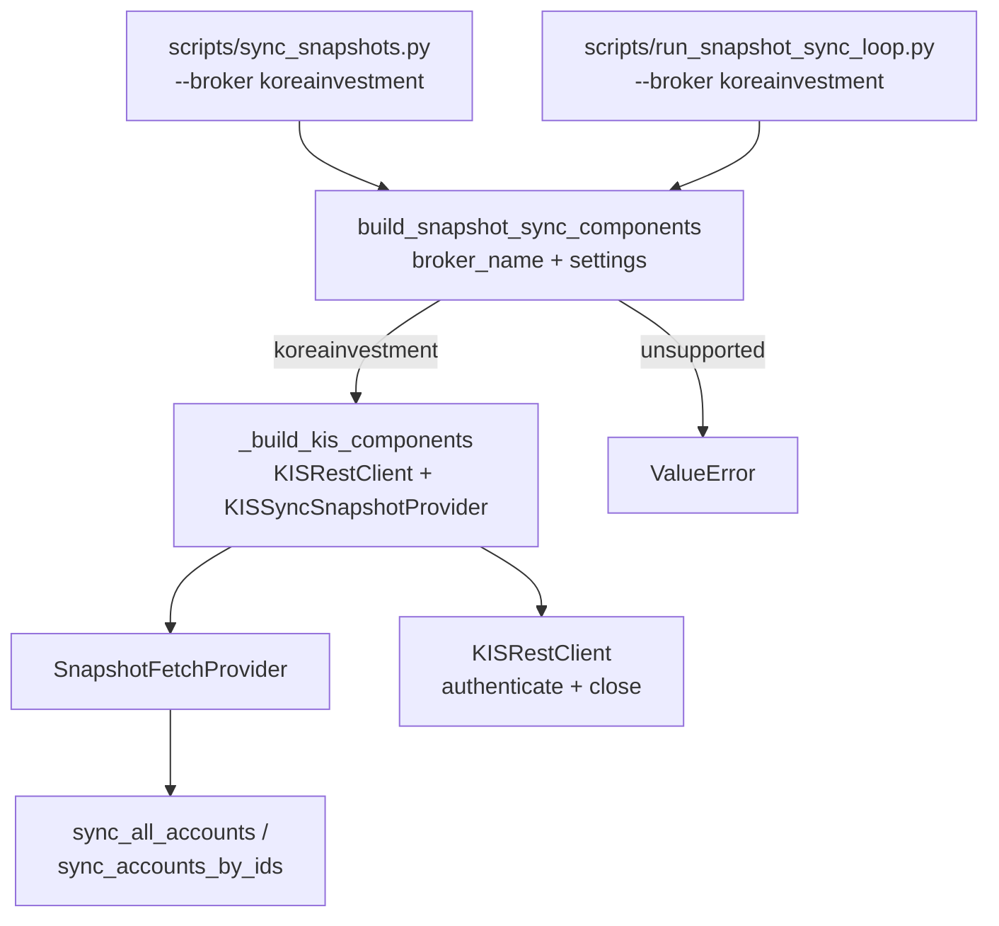

# Broker-Aware Snapshot Factory — SnapshotSyncComponents 조립 계층 도입

## 목표

CLI(`sync_snapshots.py`)와 Scheduler(`run_snapshot_sync_loop.py`)에서 broker-specific 구현체(현재는 `KISRestClient` + `KISSyncSnapshotProvider`)를 직접 import/조립하는 중복 코드를 **factory 계층**으로 추출한다.

## 현재 문제

두 스크립트 모두 동일한 KIS wiring 패턴을 중복 보유:

| 스크립트 | 위치 | 중복 내용 |
|----------|------|-----------|
| `sync_snapshots.py` | `_build_provider()` (line 314) | `KISRestClient` 생성, `build_kis_budget_manager`, `KISSyncSnapshotProvider` 조립 |
| `run_snapshot_sync_loop.py` | `_run_one_cycle()` (line 163) | 동일한 `KISRestClient` 생성 + budget_manager + provider 조립 + `authenticate()` |
| `sync_kis_snapshots.py` | `_run()` (line 383) | **세 번째** 중복 — 동일한 KIS wiring (deprecated wrapper이므로 변경 최소화) |

## 설계

### Factory 위치

```
src/agent_trading/brokers/snapshot_factory.py
```

`services/snapshot_sync.py`가 아니라 `brokers/snapshot_factory.py`인 이유:
- factory는 broker-specific 구현체(`KISRestClient`, `KISSyncSnapshotProvider`)를 조립 — `brokers` 패키지 소속이 적절
- `SnapshotFetchProvider` Protocol은 이미 `services/snapshot_sync.py`에 있음 — factory는 이를 구현체와 연결

### SnapshotSyncComponents dataclass

```python
@dataclass(slots=True, frozen=True)
class SnapshotSyncComponents:
    """Broker-specific snapshot sync components assembled by the factory."""
    provider: SnapshotFetchProvider
    client: Any          # Broker-specific client (KISRestClient for KIS).
                         # The scheduler calls .authenticate() and .close() on this.
    broker_name: str     # Normalized broker name
```

### build_snapshot_sync_components()

```python
def build_snapshot_sync_components(
    broker_name: str,
    settings: AppSettings,
) -> SnapshotSyncComponents:
```

- `broker_name == "koreainvestment"` → `_build_kis_components(settings)`
- Otherwise → `raise ValueError(f"Unsupported broker: {broker_name!r}")`

### _build_kis_components() (내부 함수)

기존 `_build_provider()` 로직을 그대로 가져오되 `SnapshotSyncComponents`로 감싸 반환:

```python
def _build_kis_components(settings: AppSettings) -> SnapshotSyncComponents:
    from agent_trading.brokers.koreainvestment.rest_client import KISRestClient
    from agent_trading.brokers.koreainvestment.snapshot import KISSyncSnapshotProvider
    from agent_trading.brokers.rate_limit import build_kis_budget_manager

    budget_manager = build_kis_budget_manager(
        kis_env=settings.kis_env,
        real_rest_rps=settings.kis_real_rest_rps,
        paper_rest_rps=settings.kis_paper_rest_rps,
    )
    rest_client = KISRestClient(
        api_key=settings.kis_api_key,
        api_secret=settings.kis_api_secret,
        account_number=settings.kis_account_number,
        account_product_code=settings.kis_account_product_code,
        env=settings.kis_env,
        base_url=settings.kis_base_url,
        budget_manager=budget_manager,
    )
    return SnapshotSyncComponents(
        provider=KISSyncSnapshotProvider(rest_client),
        client=rest_client,
        broker_name="koreainvestment",
    )
```

### 실행 흐름 비교

**Before (sync_snapshots.py):**
```
parse --broker → _build_provider(broker, settings) → KISRestClient + KISSyncSnapshotProvider
                 (직접 KIS import, 직접 settings field 참조)
```

**After:**
```
parse --broker → build_snapshot_sync_components(broker, settings).provider
                 (factory 호출, KIS import 없음)
```

**Before (run_snapshot_sync_loop.py):**
```
_run_one_cycle(settings, broker):
    from agent_trading.brokers.koreainvestment.rest_client import KISRestClient
    from agent_trading.brokers.koreainvestment.snapshot import KISSyncSnapshotProvider
    from agent_trading.brokers.rate_limit import build_kis_budget_manager
    rest_client = KISRestClient(...)
    await rest_client.authenticate()
    provider = KISSyncSnapshotProvider(rest_client)
    ...
    await rest_client.close()
```

**After:**
```
_run_one_cycle(settings, broker):
    components = build_snapshot_sync_components(broker, settings)
    rest_client = components.client
    await rest_client.authenticate()
    provider = components.provider
    ...
    await rest_client.close()
```

## 변경 사항

### 신규 파일

| 파일 | 내용 |
|------|------|
| `src/agent_trading/brokers/snapshot_factory.py` | `SnapshotSyncComponents` dataclass + `build_snapshot_sync_components()` + `_build_kis_components()` |
| `tests/brokers/test_snapshot_factory.py` | Factory 테스트 (koreainvestment 성공, unsupported 실패) |

### 수정 파일

| 파일 | 변경 내용 |
|------|----------|
| `scripts/sync_snapshots.py` | `_build_provider()` 제거 → `build_snapshot_sync_components()` 호출로 대체. KIS import 제거 |
| `scripts/run_snapshot_sync_loop.py` | `_run_one_cycle()`에서 KIS 직접 wiring → factory 호출로 대체. KIS import 제거 |

### 변경 불필요

| 파일 | 이유 |
|------|------|
| `scripts/sync_kis_snapshots.py` | Deprecated wrapper. 자체 KIS wiring 유지 (회귀 방지, 최소 변경 원칙) |
| `src/agent_trading/services/snapshot_sync.py` | Runner는 이미 broker-agnostic — 변경 불필요 |
| `src/agent_trading/brokers/koreainvestment/snapshot.py` | KIS provider 구현체 — 변경 불필요 |
| `src/agent_trading/config/settings.py` | 이전 단계에서 완료 |
| Admin UI / broker submit semantics / guardrail / reconciliation | 경계 변경 금지 조건에 해당 |

## Mermaid: Factory 호출 흐름



## 테스트 계획

| # | 테스트 | 내용 |
|---|--------|------|
| 1 | `test_koreainvestment_returns_kis_components` | `build_snapshot_sync_components("koreainvestment", settings)` → provider는 `KISSyncSnapshotProvider`, client는 `KISRestClient` |
| 2 | `test_unsupported_broker_raises_error` | `build_snapshot_sync_components("unknown", settings)` → `ValueError` |
| 3 | `test_factory_provider_is_snapshot_fetch_provider` | 반환된 provider가 `SnapshotFetchProvider` protocol을 만족하는지 structural subtyping 검증 |
| 4 | Full regression | 기존 113개 테스트 회귀 없음 확인 |

## 구현 순서

1. `src/agent_trading/brokers/snapshot_factory.py` 신규 생성
2. `scripts/sync_snapshots.py` — `_build_provider()` 제거, factory 사용
3. `scripts/run_snapshot_sync_loop.py` — `_run_one_cycle()` KIS wiring → factory 사용
4. `tests/brokers/test_snapshot_factory.py` 신규 생성
5. 전체 회귀 테스트 실행
6. [BACKLOG] backlog.md 업데이트

## 아직 broker-specific으로 남는 항목

1. `scripts/sync_kis_snapshots.py` — deprecated wrapper, 자체 KIS wiring 유지
2. `src/agent_trading/brokers/koreainvestment/snapshot.py` — `KISSyncSnapshotProvider`는 KIS 전용
3. `KISRestClient` 자체 — KIS API 전용 REST client (1267 lines)

## 다음 후속 작업 (제안)

`sync_kis_snapshots.py` deprecated wrapper가 내부적으로 `build_snapshot_sync_components()` + 공통 CLI `sync_snapshots.py` main()을 재사용하도록 리팩터링. 단, 현재는 충분히 동작 중이므로 회귀 리스크 대비 필요.
