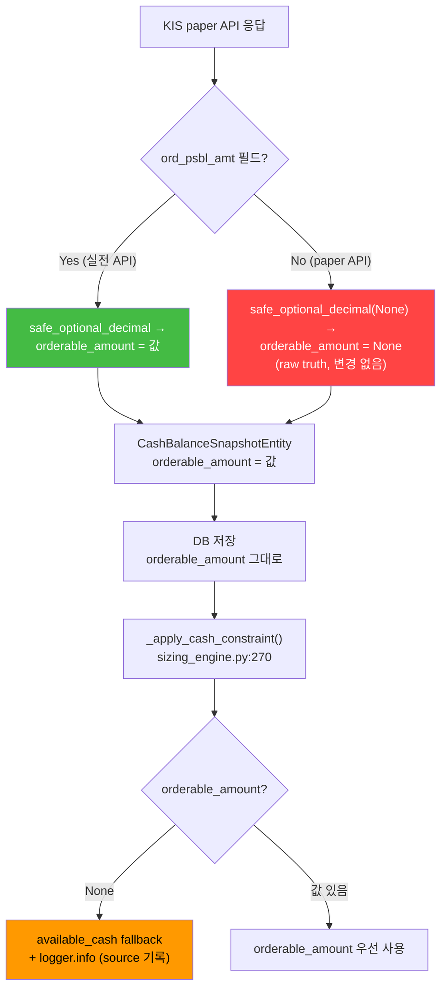
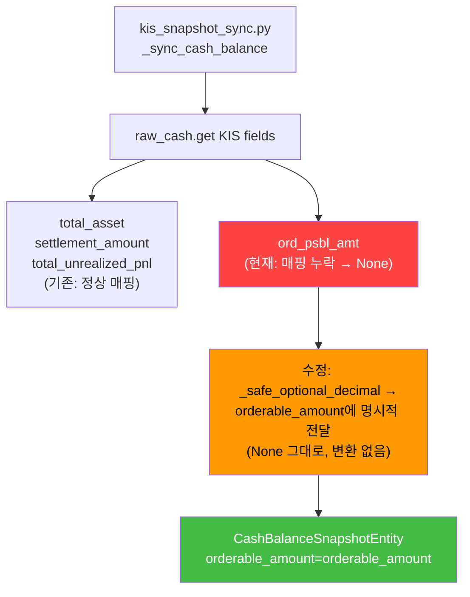

# KIS Broker Truth 매칭 복구 + `orderable_amount` 매핑 복구 설계

- **작성일**: 2026-05-19 (v2 — 피드백 반영)
- **상태**: 설계 v2
- **관련 파일**:
  - [`src/agent_trading/brokers/koreainvestment/rest_client.py`](src/agent_trading/brokers/koreainvestment/rest_client.py) — `get_order_status()`, `resolve_unknown_state()`, `inquire_daily_ccld()`
  - [`src/agent_trading/brokers/koreainvestment/snapshot.py`](src/agent_trading/brokers/koreainvestment/snapshot.py) — `_map_account_summary()` cash balance 파싱
  - [`src/agent_trading/services/kis_snapshot_sync.py`](src/agent_trading/services/kis_snapshot_sync.py) — `_sync_cash_balance()` 레거시 경로
  - [`src/agent_trading/services/order_sync_service.py`](src/agent_trading/services/order_sync_service.py) — `_sync_reconcile_required_orders()`, `transition_to_authoritative()`
  - [`src/agent_trading/services/sizing_engine.py`](src/agent_trading/services/sizing_engine.py) — `_apply_cash_constraint()` fallback
  - [`src/agent_trading/domain/entities.py`](src/agent_trading/domain/entities.py) — `CashBalanceSnapshotEntity`

---

## 1. 개요

운영 중 두 가지 데이터 정합성 문제가 확인되었다.

### 문제 1: `reconcile_required` 미해소 — `all matching strategies FAILED`

**증상**: KIS DB에 해당 주문이 존재하지만, [`_sync_reconcile_required_orders()`](src/agent_trading/services/order_sync_service.py:504)가 RECONCILE_REQUIRED 상태의 주문을 영원히 해소하지 못한다. 로그에 `"inquire-daily-ccld: all matching strategies FAILED"`가 지속적으로 출력된다.

**영향**: RECONCILE_REQUIRED 상태로 남은 주문이 누적되어 운영 모니터링 알림이 지속 발생하고, broker truth와의 정합성이 영원히 회복되지 않는다.

### 문제 2: `orderable_amount` NULL

**증상**: DB 확인 결과 `cash_balance_snapshots.orderable_amount` 컬럼이 962건 전부 NULL이다. [`snapshot.py:197`](src/agent_trading/brokers/koreainvestment/snapshot.py:197)에서 `raw_cash.get("ord_psbl_amt")`가 `None`을 반환하기 때문이다.

**영향**: [`_apply_cash_constraint()`](src/agent_trading/services/sizing_engine.py:294)가 `orderable_amount`가 `None`이면 `available_cash`로 fallback하므로 sizing 엔진은 정상 동작한다. **단, 음수 `orderable_amount`가 필요한 BUY 차단 시나리오는 불가능**하다 (예: 주문가능금액이 0 이하인데도 available_cash가 양수이면 BUY가 허용됨).

---

## 2. 문제 1 분석: broker truth 매칭 실패 — date-range 제한

### 2.1 KIS daily ccld 기본 date-range가 오늘로 설정된 경로

[`inquire_daily_ccld()`](src/agent_trading/brokers/koreainvestment/rest_client.py:931)는 `strt_dt`와 `end_dt` 파라미터를 받는다.

```python
async def inquire_daily_ccld(
    self,
    *,
    strt_dt: str | None = None,       # None → KST 오늘
    end_dt: str | None = None,        # None → KST 오늘
    ...
) -> list[dict[str, Any]]:
```

메서드 본문 (967-970행):

```python
KST = timezone(timedelta(hours=9))
_today_kst = datetime.now(KST).strftime("%Y%m%d")
strt_dt = strt_dt or _today_kst
end_dt = end_dt or _today_kst
```

즉, `strt_dt=None, end_dt=None`이 전달되면 조회 범위가 **KST 오늘 하루**로 제한된다. 전일 또는 그 이전에 제출된 주문은 조회 결과에 포함되지 않는다.

**이는 설계된 기본 동작이며, 장중 호출량 제한 정책과 일관된다.** 문제는 RECONCILE_REQUIRED 해소 경로가 이 기본값을 override하지 않는다는 점이다.

### 2.2 `get_order_status()` → `inquire_daily_ccld()` 호출 체인

[`get_order_status()`](src/agent_trading/brokers/koreainvestment/rest_client.py:1051)는 일별 체결 조회를 통해 broker_order_id를 매칭한다.

```python
async def get_order_status(self, account_ref, client_order_id=None, broker_order_id=None):
    # Fetch all records with pagination (기본 date-range = 당일)
    output = await self.inquire_daily_ccld(after_hours=False)  # ← strt_dt=None, end_dt=None
    ...
    matched_item = self._match_order(output, broker_order_id)
    if matched_item is not None:
        return self._parse_order_status_item(matched_item, ...)
    # all matching strategies FAILED → RECONCILE_REQUIRED 반환
```

**1063행**에서 `inquire_daily_ccld()`를 호출할 때 `strt_dt`와 `end_dt`를 전달하지 않는다. 따라서 **금일 체결분만 조회**되며, 전일 주문은 절대 매칭되지 않는다.

### 2.3 `_sync_reconcile_required_orders()` 호출 컨텍스트

[`_sync_reconcile_required_orders()`](src/agent_trading/services/order_sync_service.py:504)는 sync cycle 내에서 RECONCILE_REQUIRED 상태의 주문을 broker truth 조회로 해소한다.

```
_sync_reconcile_required_orders()
  └─ for each reconcile_required order:
       └─ transition_to_authoritative()           # line 550
            └─ broker.resolve_unknown_state()     # line 613 (KISBrokerAdapter)
                 └─ self._rest.resolve_unknown_state()  # rest_client.py:1486
                      └─ inquire_daily_ccld(symbol=symbol)  # line 1505, strt_dt=None
```

**중요**: 실제 RECONCILE_REQUIRED 해소 경로는 `resolve_unknown_state()`를 통해 이루어지며, 이 메서드 역시 `inquire_daily_ccld()`를 `strt_dt=None`으로 호출한다. 따라서 `get_order_status()`와 `resolve_unknown_state()` **모두** 동일한 date-range 문제를 가진다.

매칭 실패 시 [`_match_order()`](src/agent_trading/brokers/koreainvestment/rest_client.py:1090)가 3단계 fallback matching(ODNO → Symbol+Side → Symbol+수량)을 수행하지만, **조회 결과(output)가 비어있으면 매칭 자체가 불가능**하므로 이 로직은 무용지물이 된다.

---

## 3. 문제 2 분석: `orderable_amount` NULL — KIS paper API 미지원

### 3.1 KIS paper API vs real API 차이

KIS **모의투자(paper) API**는 `inquire-balance` (TTTC8434R / VTTC8434R) 응답에서 `ord_psbl_amt`(주문가능금액) 필드를 제공하지 않는다. 실전 API는 정상 제공한다.

DB 확인 결과 paper 환경에서 `orderable_amount`가 100% NULL이다. 이는 **KIS API의 한계**이며, 우리 시스템이 raw truth를 정확히 반영한 결과다.

### 3.2 `ord_psbl_amt` → `orderable_amount` 전체 파이프라인

**경로 1: [`snapshot.py`](src/agent_trading/brokers/koreainvestment/snapshot.py) (신규 경로, KISSyncSnapshotProvider)**

```python
# 197행
orderable_amount = safe_optional_decimal(raw_cash.get(_KIS_ORD_PSBL_AMT))
# _KIS_ORD_PSBL_AMT = "ord_psbl_amt"
# raw_cash.get("ord_psbl_amt") → None (paper API)
# safe_optional_decimal(None) → None
```

이 `orderable_amount`가 `CashBalanceSnapshotEntity`에 저장된다 (209행). 결과적으로 DB에는 `NULL`이 저장된다. **이는 올바른 동작이다** — raw truth를 정확히 반영한다.

**경로 2: [`kis_snapshot_sync.py`](src/agent_trading/services/kis_snapshot_sync.py) (레거시 경로)**

```python
# 291-307행
cash_entity = CashBalanceSnapshotEntity(
    ...
    # orderable_amount 누락! → 기본값 None
    source_of_truth=_SOURCE_OF_TRUTH,
    snapshot_at=snapshot_at,
)
```

`CashBalanceSnapshotEntity` 생성자에서 `orderable_amount` 필드를 **명시적으로 전달하지 않는다**. entity 정의 (151행)에서 `orderable_amount: Decimal | None = None` 기본값에 의해 `None`이 저장된다. **여기서는 명시적 매핑이 누락된 것이 문제**다.

### 3.3 `settled_cash` 음수는 정상 (예수금 vs 주문가능금액 구분)

KIS paper API에서 `nxdy_excc_amt`(다음날 초과액, D+2 예수금)는 양수로 정상 반환된다. `settled_cash`는 이 값을 사용하므로 정상이다. 음수 `settled_cash`는 발생하지 않는다.

다만 `orderable_amount`가 NULL이므로, `_apply_cash_constraint()` (sizing_engine.py:294-299)는 `available_cash`로 fallback한다. 이는 **주문가능금액 < 0인 BUY 차단 시나리오**에서 문제가 된다:

- 실제 주문가능금액이 0 이하인데 `available_cash`(예수금)가 양수이면 BUY가 정상 허용됨
- 이는 과매수 위험으로 이어질 수 있음
- **단, 이는 paper 환경의 한계이며 실전 환경에는 영향 없음**

---

## 4. 수정 사항

### 수정 1 (P0): RECONCILE_REQUIRED 해소 경로 date-range **bounded override**

#### 설계 결정

| 항목 | 결정 |
|------|------|
| `inquire_daily_ccld()` 기본값 | **변경 없음** — 당일 1일치 유지 (장중 정책과 일관) |
| `get_order_status()` 기본 경로 | **변경 없음** — 당일 1일치 유지 |
| RECONCILE_REQUIRED 해소 경로만 | **bounded override**: 최근 N일 조회 허용 |
| 정책 적용 | `max_pages`, `max_records`, 장중/장후 정책 **반드시 포함** |
| N 값 | 7일 (기존 분석과 동일, 단 적용 범위가 제한됨) |

#### 수정 경로: `resolve_unknown_state()` (rest_client.py:1486) — 실제 RECONCILE_REQUIRED 해소 경로

**파일**: [`src/agent_trading/brokers/koreainvestment/rest_client.py`](src/agent_trading/brokers/koreainvestment/rest_client.py)

**현재 코드** (1503-1508행):

```python
# 1. Try inquiry path with reconciliation reserve fallback
#    inquire_daily_ccld() 재사용 (pagination + policy 적용)
records = await self.inquire_daily_ccld(
    symbol=symbol,
    after_hours=after_hours,
)
```

**변경 코드** — RECONCILE_REQUIRED 해소 전용으로만 date-range 확장:

```python
# 1. Try inquiry path with reconciliation reserve fallback
#    inquire_daily_ccld() 재사용 (pagination + policy 적용)
#
#    RECONCILE_REQUIRED 해소 전용: 기본 당일 조회에서 찾지 못한
#    전일/이전 주문을 찾기 위해 최근 7일 범위로 확장.
#    max_pages/max_records 정책은 _resolve_ccld_policy()가 계속 적용.
_kst = timezone(timedelta(hours=9))
_strt_dt = (datetime.now(_kst) - timedelta(days=7)).strftime("%Y%m%d")
records = await self.inquire_daily_ccld(
    strt_dt=_strt_dt,
    end_dt=None,
    symbol=symbol,
    after_hours=after_hours,
)
```

**`get_order_status()` (1062행)는 변경하지 않는다** — 일반 order status 조회는 당일 기본값을 유지. RECONCILE_REQUIRED이 아닌 일반 sync 경로에서 무분별한 7일 조회를 방지한다.

#### 정책 적용 확인

`inquire_daily_ccld()` 내부의 [`_resolve_ccld_policy()`](src/agent_trading/brokers/koreainvestment/rest_client.py:1610)는 `after_hours` 플래그에 따라 장중/장후 정책을 자동 적용한다. `after_hours=False`(기본값)이므로 장중 정책이 적용된다:

| 환경 | max_pages | max_records | 7일치 영향 |
|------|-----------|-------------|-----------|
| 실전/장중 | 10 | 1000 | 7일 주문이 1000건 초과 가능성 낮음 |
| 모의/장중 | 10 | 150 | 충분 |

### 수정 2 (P0): `orderable_amount` raw truth 유지 — sizing/consumer 레이어에서 fallback + logging

#### 설계 결정

| 항목 | 결정 | 근거 |
|------|------|------|
| [`snapshot.py`](src/agent_trading/brokers/koreainvestment/snapshot.py) | **변경 없음** — `orderable_amount`는 raw truth 그대로 저장 | paper API 미지원을 masking하지 않음 |
| [`kis_snapshot_sync.py`](src/agent_trading/services/kis_snapshot_sync.py) | **orderable_amount 명시적 전달만 추가** (raw truth, 치환 없음) | 레거시 경로 누락 복구 |
| **fallback 위치** | **sizing/consumer 레이어** (`_apply_cash_constraint` 등) | 이미 `None` fallback 존재, **logging만 추가** |

#### 수정 경로: `kis_snapshot_sync.py` — 레거시 경로 명시적 매핑 추가

**파일**: [`src/agent_trading/services/kis_snapshot_sync.py`](src/agent_trading/services/kis_snapshot_sync.py)

**현재 코드** (291-308행):

```python
total_asset = _safe_optional_decimal(raw_cash.get(_KIS_TOT_EVL_AMT))
settlement_amount = _safe_optional_decimal(raw_cash.get(_KIS_PRVS_RCDL_EXCC_AMT))
total_unrealized_pnl = _safe_optional_decimal(raw_cash.get(_KIS_EVL_PFLS_SMTL_AMT))

cash_entity = CashBalanceSnapshotEntity(
    cash_balance_snapshot_id=uuid4(),
    account_id=account_id,
    currency="KRW",
    available_cash=available_cash,
    settled_cash=settled_cash,
    unsettled_cash=unsettled_cash,
    total_asset=total_asset,
    settlement_amount=settlement_amount,
    total_unrealized_pnl=total_unrealized_pnl,
    source_of_truth=_SOURCE_OF_TRUTH,
    snapshot_at=snapshot_at,
)
```

**변경 코드** — `orderable_amount`만 명시적 매핑 추가 (`None` 그대로 유지):

```python
total_asset = _safe_optional_decimal(raw_cash.get(_KIS_TOT_EVL_AMT))
settlement_amount = _safe_optional_decimal(raw_cash.get(_KIS_PRVS_RCDL_EXCC_AMT))
total_unrealized_pnl = _safe_optional_decimal(raw_cash.get(_KIS_EVL_PFLS_SMTL_AMT))
# ord_psbl_amt → orderable_amount (KIS paper API 미지원 시 None 유지)
orderable_amount = _safe_optional_decimal(raw_cash.get(_KIS_ORD_PSBL_AMT))

cash_entity = CashBalanceSnapshotEntity(
    cash_balance_snapshot_id=uuid4(),
    account_id=account_id,
    currency="KRW",
    available_cash=available_cash,
    settled_cash=settled_cash,
    unsettled_cash=unsettled_cash,
    total_asset=total_asset,
    settlement_amount=settlement_amount,
    total_unrealized_pnl=total_unrealized_pnl,
    orderable_amount=orderable_amount,  # ← 추가 (raw truth, None 가능)
    source_of_truth=_SOURCE_OF_TRUTH,
    snapshot_at=snapshot_at,
)
```

#### 수정 경로: `sizing_engine.py` — `_apply_cash_constraint()` fallback 시 로깅 강화

**파일**: [`src/agent_trading/services/sizing_engine.py`](src/agent_trading/services/sizing_engine.py)

**현재 코드** (293-303행):

```python
# ── Determine effective cash source ──
# Priority: orderable_amount > available_cash
if orderable_amount is not None:
    if orderable_amount <= 0:
        constraints.append("orderable_amount_zero")
        logger.info("BUY blocked: orderable_amount=%s <= 0", orderable_amount)
        return Decimal("0")
    effective_cash = orderable_amount
elif available_cash is not None:
    effective_cash = available_cash
else:
    return qty  # No cash info available — skip constraint
```

**변경 코드** — `orderable_amount`가 `None`일 때 `available_cash`로 fallback하면서 source를 명시적으로 로깅:

```python
# ── Determine effective cash source ──
# Priority: orderable_amount > available_cash
if orderable_amount is not None:
    if orderable_amount <= 0:
        constraints.append("orderable_amount_zero")
        logger.info("BUY blocked: orderable_amount=%s <= 0", orderable_amount)
        return Decimal("0")
    effective_cash = orderable_amount
elif available_cash is not None:
    # orderable_amount가 None (KIS paper API 미지원) → available_cash fallback
    # 실전 환경(KIS real API)에서는 ord_psbl_amt가 정상 제공되므로
    # 이 fallback은 paper 환경에서만 동작함
    logger.info(
        "orderable_amount=None (KIS paper API), falling back to available_cash=%s",
        available_cash,
    )
    effective_cash = available_cash
else:
    return qty  # No cash info available — skip constraint
```

### 수정 3 (P1): 레거시 경로 (`kis_snapshot_sync.py`) `orderable_amount` 매핑

수정 2에서 함께 처리됨 (위 `kis_snapshot_sync.py` 변경 코드 참조). `orderable_amount`를 `CashBalanceSnapshotEntity` 생성자에 **raw truth 그대로** 전달.

---

## 5. 파이프라인 다이어그램

### 수정 1: RECONCILE_REQUIRED 해소 — bounded date-range override

```mermaid
flowchart TD
    A["inquire_daily_ccld()<br/>rest_client.py:931"] --> B{"strt_dt 전달됨?"}
    B -->|No (기본값)| C["strt_dt = KST 오늘<br/>변경 없음"]
    B -->|Yes (bounded override)| D["strt_dt = today - 7d<br/>RECONCILE_REQUIRED 해소 전용"]
    C --> E["_resolve_ccld_policy<br/>max_pages/max_records 적용"]
    D --> E
    E --> F["KIS API 호출<br/>INQR_STRT_DT / INQR_END_DT"]
    
    subgraph G["일반 경로 (변경 없음)"]
        H["get_order_status()"] --> I["inquire_daily_ccld()<br/>strt_dt=None → 당일"]
    end
    
    subgraph J["RECONCILE_REQUIRED 해소 경로 (수정)"]
        K["transition_to_authoritative()"] --> L["resolve_unknown_state()"]
        L --> M["inquire_daily_ccld()<br/>strt_dt=today-7d, end_dt=None<br/>(bounded override)"]
    end
    
    M --> N["max_pages=10, max_records=1000<br/>장중 정책 적용"]
    N --> O{"broker_order_id<br/>매칭 성공?"}
    O -->|Yes| P["정상 상태 전이"]
    O -->|No| Q["RECONCILE_REQUIRED 유지<br/>fallback: positions 조회"]
    
    style M fill:#ff9900,color:#000
    style G fill:#cccccc,color:#000
    style J fill:#ffcc00,color:#000
```

### 수정 2: `orderable_amount` fallback — sizing 레이어에서 처리



### 수정 3: Legacy Sync Path — 명시적 매핑 추가



---

## 6. 테스트 계획

### 6.1 KIS daily ccld date-range bounded override 테스트

#### 신규 테스트

| 테스트 | 위치 | 설명 | 검증 항목 |
|--------|------|------|-----------|
| `test_resolve_unknown_state_bounded_date_range` | `tests/brokers/koreainvestment/test_rest_client.py` | RECONCILE_REQUIRED 해소 경로에서만 7일 범위 조회 | `strt_dt`가 `(today-7d)` format |
| `test_resolve_unknown_state_policy_enforced` | `tests/brokers/koreainvestment/test_rest_client.py` | max_pages/max_records 정책이 여전히 적용됨 | policy 상수 위반하지 않음 |
| `test_get_order_status_default_date_range_unchanged` | `tests/brokers/koreainvestment/test_rest_client.py` | 일반 `get_order_status()`는 당일 기본값 유지 | `strt_dt=None` (변경 없음) |

### 6.2 `orderable_amount` raw truth 유지 + consumer fallback 로깅 테스트

#### 신규/수정 테스트

| 테스트 | 위치 | 설명 | 검증 항목 |
|--------|------|------|-----------|
| `test_cash_balance_ord_psbl_amt_missing_raw_null` | `tests/brokers/koreainvestment/test_snapshot.py` | `ord_psbl_amt` 미존재 시 `orderable_amount`는 `None` 유지 (치환 금지) | `cash.orderable_amount is None` |
| `test_orderable_amount_none_fallback_logged` | `tests/services/test_sizing_engine.py` | `None` fallback 시 로그 출력 확인 | `logger.info` 호출 확인 (caplog) |
| `test_orderable_amount_mapped_in_legacy_path` | `tests/services/test_kis_snapshot_sync.py` | 레거시 경로 `orderable_amount` 명시적 매핑 | `cash_entity.orderable_amount`가 `None` (API 미제공 시) |

**기존 테스트 `test_cash_balance_ord_psbl_amt_mapping`** (209행) — 정상 매핑 케이스: 수정 없이 통과해야 함.

### 6.3 기존 회귀 테스트 유지

다음 테스트들은 수정 후에도 동일하게 통과해야 한다:

| 테스트 파일 | 테스트 | 설명 |
|------------|--------|------|
| `tests/services/test_sizing_engine.py` | `test_orderable_amount_negative_blocks_buy` | 음수 orderable_amount BUY 차단 |
| `tests/services/test_sizing_engine.py` | `test_orderable_amount_zero_blocks_buy` | 0 orderable_amount BUY 차단 |
| `tests/services/test_sizing_engine.py` | `test_orderable_amount_positive_used_as_cash_source` | 양수 orderable_amount 우선 사용 |
| `tests/services/test_sizing_engine.py` | `test_orderable_amount_none_fallback_to_available_cash` | None → available_cash fallback (기존 테스트, 여전히 통과) |
| `tests/brokers/koreainvestment/test_snapshot.py` | `test_cash_balance_ord_psbl_amt_mapping` | ord_psbl_amt 정상 매핑 |
| `tests/services/test_decision_orchestrator.py` | `test_orderable_amount_passed_to_sizing_inputs` | sizing inputs 전달 |
| `tests/services/test_order_sync_service.py` | `TestSyncReconcileRequired` | RECONCILE_REQUIRED 해소 플로우 |

---

## 7. 운영 영향 및 리스크

### 7.1 RECONCILE_REQUIRED 해소 전용 date-range 확장 영향

| 항목 | 영향 | 비고 |
|------|------|------|
| 적용 범위 | `resolve_unknown_state()`에만 한정 | `get_order_status()`는 변경 없음 |
| 호출 빈도 | sync cycle당 RECONCILE_REQUIRED 주문 수만큼 | 일반적으로 수십 건 이하 |
| max_records (실전) | 1000건 | 7일치가 1000건 초과 가능성 낮음 |
| max_records (모의) | 150건 | 충분 |
| 장중 정책 | `after_hours=False` 기본값 유지 | 장중 정책 적용, 장후보다 더 관대함 |

**결론**: 무시 가능한 수준. 장중 장애 유발하지 않음.

### 7.2 `orderable_amount` raw truth 유지의 의미

| 환경 | `ord_psbl_amt` | `orderable_amount` (DB) | sizing 동작 |
|------|---------------|------------------------|------------|
| 실전 (live) | 제공 | 값 있음 | `orderable_amount` 우선 사용 |
| 모의 (paper) | 미제공 | `None` (raw truth) | `available_cash` fallback + 로그 |

**리스크**: paper 환경에서 `orderable_amount`가 `None`이므로 음수 주문가능금액에 의한 BUY 차단이 불가능하다. 이는 **KIS paper API의 한계**로, 실전 환경에는 영향이 없다. snapshot 단계에서 치환하지 않고 raw truth를 유지함으로써, 추후 KIS paper API가 `ord_psbl_amt`를 제공하기 시작하면 자동으로 정상 동작하게 된다.

**로깅 전략**: sizing 레이어에서 `orderable_amount=None → available_cash fallback` 시 INFO 레벨 로그를 남겨, 모니터링에서 paper 환경의 fallback 동작을 추적 가능하게 한다.

### 7.3 레거시 경로(`kis_snapshot_sync.py`) 수정 영향

`kis_snapshot_sync.py`의 `_sync_cash_balance()`에서 `orderable_amount`를 명시적으로 전달하도록 변경한다. 기존에는 항상 `None`이 저장되었으며, 수정 후에도 KIS paper API 환경에서는 `None`이 저장된다 (변화 없음). 실전 환경에서는 `ord_psbl_amt` 값이 정상 저장된다.

- 신규 snapshot 저장 시 `orderable_amount`가 정상 저장됨 (실전) / `None` 유지 (모의)
- 기존 DB 레코드는 영향 없음

---

## 8. 변경 파일 목록

| 파일 | 변경 유형 | 설명 |
|------|-----------|------|
| [`src/agent_trading/brokers/koreainvestment/rest_client.py`](src/agent_trading/brokers/koreainvestment/rest_client.py) | **수정** | `resolve_unknown_state()` (1505행)에서만 `inquire_daily_ccld()` 호출 시 `strt_dt=today-7d` **bounded override** 추가. `get_order_status()` (1062행)는 **변경 없음**. |
| [`src/agent_trading/services/kis_snapshot_sync.py`](src/agent_trading/services/kis_snapshot_sync.py) | **수정** | `CashBalanceSnapshotEntity` 생성 시 `orderable_amount=orderable_amount` 명시적 전달 추가 (296-308행). raw truth 그대로, 치환 없음. |
| [`src/agent_trading/services/sizing_engine.py`](src/agent_trading/services/sizing_engine.py) | **수정** | `orderable_amount=None` → `available_cash` fallback 시 `logger.info()`로 source 로깅 추가 (300행 이후). |

### 테스트 파일

| 파일 | 변경 유형 | 설명 |
|------|-----------|------|
| `tests/brokers/koreainvestment/test_rest_client.py` | **수정/추가** | `resolve_unknown_state()` date-range bounded override 검증 + `get_order_status()` 기본값 유지 확인 |
| `tests/brokers/koreainvestment/test_snapshot.py` | **수정** | `ord_psbl_amt` 미존재 시 `orderable_amount` raw truth `None` 유지 확인 (치환 금지) |
| `tests/services/test_kis_snapshot_sync.py` | **수정** | 레거시 경로 `orderable_amount` 명시적 매핑 테스트 |
| `tests/services/test_sizing_engine.py` | **수정** | `orderable_amount=None` fallback 시 로깅 확인 (기존 fallback 테스트와 통합 가능) |

### 변경 없는 파일

| 파일 | 이유 |
|------|------|
| [`src/agent_trading/brokers/koreainvestment/snapshot.py`](src/agent_trading/brokers/koreainvestment/snapshot.py) | `orderable_amount` raw truth 유지가 올바른 동작이므로 snapshot 단계 수정 불필요 |
| [`src/agent_trading/domain/entities.py`](src/agent_trading/domain/entities.py) | entity 정의 변경 불필요 |
| [`src/agent_trading/services/order_sync_service.py`](src/agent_trading/services/order_sync_service.py) | date-range override는 rest_client 내부에서 처리되므로 서비스 레이어 수정 불필요 |
