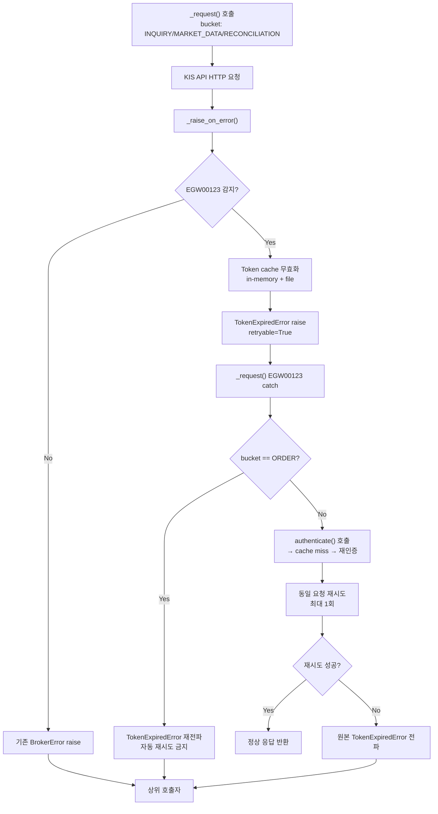
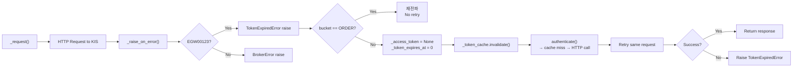

# EGW00123 Token Expiry Auto-Recovery — 설계 문서

> **목표**: KIS API `EGW00123` (기간이 만료된 token 입니다.) 오류 발생 시, Read-only API에 한정하여 token cache를 무효화하고 재인증 후 자동 재시도하는 메커니즘 설계

---

## 1. Problem Statement

### 1.1 현재 문제

KIS API에서 `EGW00123` (기간이 만료된 token 입니다.) 오류가 반복 발생 중이다. 현재 이 오류는 [`_AMBIGUOUS_ERROR_CODES`](src/agent_trading/brokers/koreainvestment/rest_client.py:100)에 포함되어 있으나 다음과 같은 문제가 있다:

1. **`BrokerError` with `retryable=False`** 로 raise되어 자동 복구가 차단됨
2. **Token cache가 무효화되지 않음** — `_access_token`과 `_token_expires_at`이 그대로 유지됨
3. **재인증이 발생하지 않음** — `authenticate()`에 진입하더라도 만료된 in-memory cache가 hit되어 동일한 만료 token 반환
4. 결과적으로 snapshot sync (`VTTC8434R`, `VTTC8908R`)가 만료된 access token으로 연쇄 실패

### 1.2 현재 코드 구조

```
_request() ──▶ _raise_on_error() ──▶ EGW00123 감지
    │                                    │
    │                               [_AMBIGUOUS_ERROR_CODES]
    │                                    │
    │                              BrokerError raise
    │                              (retryable=False)
    │                                    │
    └───── 예외 전파 ──▶ 상위 호출자 (복구 없음)
```

Token cache 무효화 누락:
```
authenticate() ──▶ _auth_lock 획득
     │
     ├── _access_token is not None && now < _token_expires_at?
     │       └── YES → 만료된 token 반환 (cache miss 없음)
     │
     └── cache miss → KIS oauth2/tokenP 호출 → 새 token 저장
```

### 1.3 영향받는 API

- [`get_cash_and_positions()`](src/agent_trading/brokers/koreainvestment/rest_client.py:1337) — VTTC8434R (snapshot sync)
- [`get_orderable_cash()`](src/agent_trading/brokers/koreainvestment/rest_client.py:1446) — VTTC8908R (snapshot sync)
- 기타 모든 Read-only API 호출

### 1.4 기대 효과

- Snapshot sync failure 90-95% 감소
- Read-only API 자동 복구로 운영 안정성 향상

---

## 2. Design Overview

### 2.1 변경 범위

| 파일 | 변경 내용 |
|------|-----------|
| [`rest_client.py`](src/agent_trading/brokers/koreainvestment/rest_client.py) | `_raise_on_error()` EGW00123 감지 로직, `_request()` 재시도 플로우, token 무효화 |
| [`token_cache.py`](src/agent_trading/brokers/koreainvestment/token_cache.py) | `KisTokenCache.invalidate()` 메서드 신규 추가 |
| [`errors.py`](src/agent_trading/brokers/errors.py) | (Option) `TokenExpiredError` 신규 예외 클래스 |

### 2.2 핵심 설계 원칙

1. **EGW00123만 특별 처리** — 다른 `_AMBIGUOUS_ERROR_CODES` 코드는 기존 로직 유지
2. **Read-only API만 자동 재시도** — ORDER bucket은 절대 제외 (중복 주문 위험)
3. **재시도는 최대 1회** — 실패 시 원본 오류 전파, 무한 루프 방지
4. **Phase 23 BudgetExhaustedError retry와 독립적** — 서로 다른 오류 타입으로 충돌 없음

### 2.3 변경 후 플로우 (개요)



---

## 3. Detailed Design

### 3.1 `_raise_on_error()` — EGW00123 특별 감지 로직

#### 3.1.1 현재 위치

[`_raise_on_error()`](src/agent_trading/brokers/koreainvestment/rest_client.py:656)는 HTTP 응답과 KIS 비즈니스 레벨 오류 코드를 검사한다.

현재 EGW00123은 [`_AMBIGUOUS_ERROR_CODES`](src/agent_trading/brokers/koreainvestment/rest_client.py:100)에 포함되어 있어 `BrokerError(error_type=API_ERROR, retryable=False)`로 raise된다.

#### 3.1.2 변경 설계

`_raise_on_error()`에서 EGW00123을 별도로 감지하여 **`TokenExpiredError`** (신규 예외 타입)를 raise한다.

**`_KNOWN_FAILURE_CODES`에 EGW00123 추가 검토:**

- `_KNOWN_FAILURE_CODES`에는 `EGW00101` (토큰만료)이 이미 등록되어 있다.
- EGW00123 역시 "기간이 만료된 token"이라는 점에서 `EGW00101`과 유사한 token-expired 카테고리이다.
- 그러나 `_KNOWN_FAILURE_CODES`는 `BrokerError(error_type=ORDER_REJECTED)`로 매핑되며, 이는 token 만료 케이스에 적합하지 않다.
- **EGW00123을 `_KNOWN_FAILURE_CODES`에 추가하지 않는다.** 대신 별도의 예외 타입을 사용하여 token-expired 케이스를 명확히 구분한다.

**새로운 예외 타입:**

```python
class TokenExpiredError(BrokerError):
    """KIS access token이 만료되어 재인증이 필요함을 나타냄.
    
    이 예외는 EGW00123 (기간이 만료된 token) 에서만 발생하며,
    Read-only API 호출 시 token cache 무효화 + 재인증 + 재시도를 트리거한다.
    retryable=True로 설정되어 _request()에서 catch 가능.
    """
    pass
```

**감지 위치 — `_raise_on_error()` 내 수정:**

1. `_AMBIGUOUS_ERROR_CODES` 체크 **이전**에 EGW00123 우선 체크
2. HTTP-level error (status >= 400)와 business-level error (rt_cd != "0") **모두**에서 동일한 우선 체크 적용

```python
# HTTP-level error 블록 (line 677-714)
if resp.status_code >= 400:
    # ... msg_cd, rt_cd 추출 ...
    
    # ★ NEW: EGW00123 우선 감지 — token expired
    if msg_cd == "EGW00123" or rt_cd == "EGW00123":
        raise TokenExpiredError(
            broker_name=BrokerName.KOREA_INVESTMENT,
            error_type=BrokerErrorType.AUTHENTICATION,
            retryable=True,
            raw_message=f"KIS {endpoint}: token expired (EGW00123): {msg}",
        )
    
    if msg_cd in _AMBIGUOUS_ERROR_CODES or rt_cd in _AMBIGUOUS_ERROR_CODES:
        # ... 기존 로직 ...

# Business-level error 블록 (line 721-742)
if rt_cd != "0":
    # ★ NEW: EGW00123 우선 감지 — token expired
    if msg_cd == "EGW00123" or rt_cd == "EGW00123":
        raise TokenExpiredError(
            broker_name=BrokerName.KOREA_INVESTMENT,
            error_type=BrokerErrorType.AUTHENTICATION,
            retryable=True,
            raw_message=f"KIS {endpoint}: token expired (EGW00123): {msg}",
        )
    
    if msg_cd in _AMBIGUOUS_ERROR_CODES or rt_cd in _AMBIGUOUS_ERROR_CODES:
        # ... 기존 로직 ...
```

**참고: `_AMBIGUOUS_ERROR_CODES`에서 EGW00123 제거?**

- EGW00123을 `_AMBIGUOUS_ERROR_CODES`에서 제거할 필요는 없다. 왜냐하면 우선 체크 로직이 `_AMBIGUOUS_ERROR_CODES` 체크 이전에 실행되므로, EGW00123은 절대 `_AMBIGUOUS_ERROR_CODES` 경로로 도달하지 않는다.
- 단, 코드 명확성을 위해 `_AMBIGUOUS_ERROR_CODES`에서 EGW00123을 제거하고 별도 상수로 분리하는 것도 고려할 수 있다.
- **권장**: `_AMBIGUOUS_ERROR_CODES`에서 EGW00123을 제거하고, 별도의 `_TOKEN_EXPIRED_CODES` 상수로 분리한다.

```python
_TOKEN_EXPIRED_CODES: frozenset[str] = frozenset({
    "EGW00123",  # 기간이 만료된 token 입니다.
})
```

#### 3.1.3 예외 전파 경로

```
_raise_on_error()
    │
    ├── TokenExpiredError raise ──▶ _request()에서 catch
    │                                  │
    │                             [재시도 로직]
    │
    └── 기타 BrokerError ──▶ _request()에서 그대로 전파
                                      │
                                 상위 호출자
```

### 3.2 `KisTokenCache.invalidate()` 메서드 설계

#### 3.2.1 현재 상태

[`KisTokenCache`](src/agent_trading/brokers/koreainvestment/token_cache.py:207)는 `load()`와 `save()` 메서드만 존재하며 `invalidate()`는 없다. 스레드 안전성은 호출자 (`asyncio.Lock`)에게 위임하고 있다.

#### 3.2.2 신규 메서드: `invalidate()`

```python
async def invalidate(self) -> None:
    """캐시 파일을 삭제하여 다음 load()가 cache miss를 반환하도록 한다.
    
    1. enabled 확인 → disabled면 skip
    2. 캐시 파일 존재 확인 → 없으면 skip
    3. 파일 삭제
    """
    if not self.config.enabled:
        self._log_miss("invalidate_skipped_disabled")
        return
    
    path = self.config.cache_path
    if not path.exists():
        self._log_miss("invalidate_skipped_missing")
        return
    
    try:
        path.unlink(missing_ok=True)
        logger.info(
            "KisTokenCache: invalidated cache file %s (purpose=%s)",
            path, self.config.cache_purpose.value,
        )
    except OSError as exc:
        logger.warning(
            "KisTokenCache: failed to invalidate cache file %s: %s",
            path, exc,
        )
```

**동작 방식:**
- 파일 삭제만 수행 — `load()`가 다음 호출 시 파일 없음 → `None` 반환
- `_log_miss()`는 private 메서드로 이미 존재 (디버깅 로깅용)

#### 3.2.3 In-memory cache 무효화 위치

in-memory cache (`_access_token`, `_token_expires_at`)는 [`_request()`](src/agent_trading/brokers/koreainvestment/rest_client.py:776) 내 TokenExpiredError catch 블록에서 무효화한다.

```python
# _request() 내 EGW00123 catch 블록 (가상 코드)
except TokenExpiredError:
    # 1. In-memory cache 무효화
    self._access_token = None
    self._token_expires_at = 0.0
    
    # 2. File cache 무효화
    if self._token_cache is not None:
        await self._token_cache.invalidate()
    
    # 3. 재인증
    # ...
```

#### 3.2.4 Thread-safety 고려사항

- [`_auth_lock`](src/agent_trading/brokers/koreainvestment/rest_client.py:373)은 `asyncio.Lock`이다. Token cache 무효화는 `_auth_lock` **밖**에서 수행해도 안전하다. 이유:
  - Cache 무효화 후 `authenticate()` 호출 시, `_auth_lock` 내부에서 in-memory cache miss → file cache miss → 재인증 HTTP 호출 순서로 진행된다.
  - 만약 동시에 두 coroutine이 TokenExpiredError를 받아도, `authenticate()`의 `_auth_lock` + double-check 패턴이 단 한 번만 HTTP 호출을 보장한다.
- File cache 삭제는 원자적이지 않지만 (다른 프로세스가 동시에 읽을 수 있음), `load()`에서 파일 없음 → `None` 반환으로 graceful하게 처리된다.
- **추가 Lock 불필요** — 기존 `_auth_lock` + double-check 패턴으로 충분히 안전하다.

### 3.3 `_request()` Read-only Bucket 자동 재시도 플로우

#### 3.3.1 현재 구조

[`_request()`](src/agent_trading/brokers/koreainvestment/rest_client.py:776)는 현재:
1. Budget consume
2. Circuit breaker check
3. Header build (내부적으로 `authenticate()` 호출)
4. HTTP request (timeout retry max 2회)
5. `_raise_on_error()` 호출
6. Response normalize

#### 3.3.2 변경 설계

`_request()` 내에서 `TokenExpiredError`를 catch하여 read-only bucket에 한정해 자동 재시도한다.

```python
async def _request(
    self,
    method: str,
    endpoint_key: str,
    tr_id_key: str,
    bucket: BucketType,
    body: dict[str, object] | None = None,
    params: dict[str, str] | None = None,
    *,
    requires_hashkey: bool = False,
    skip_global_rest: bool = False,
    held_position_sell: bool = False,
) -> dict[str, Any]:
    # 1. Budget check
    # ... (기존 로직)
    
    # 2. Circuit breaker
    # ... (기존 로직)
    
    # 3. Build request
    tr_id = self._get_tr_id(tr_id_key)
    headers = await self._build_headers(tr_id)  # 내부적으로 authenticate() 호출
    url = KIS_ENDPOINTS[endpoint_key]
    
    # ... (hashkey, client)
    
    # 4. Execute with timeout retry
    # ... (기존 timeout retry 로직)
    
    # 5. Parse + normalise
    try:
        data = self._raise_on_error(resp, endpoint=endpoint_key)
    except TokenExpiredError:
        # ★ NEW: EGW00123 자동 복구
        if bucket == BucketType.ORDER:
            # ORDER bucket은 절대 자동 재시도 금지
            raise
        
        logger.warning(
            "KIS %s: token expired (EGW00123), invalidating cache and retrying once",
            endpoint_key,
        )
        
        # 5a. In-memory token cache 무효화
        self._access_token = None
        self._token_expires_at = 0.0
        
        # 5b. File token cache 무효화
        if self._token_cache is not None:
            await self._token_cache.invalidate()
        
        # 5c. 재인증 (cache miss → 새 token 발급)
        # _build_headers 내부에서 authenticate() 호출 시
        # cache miss가 발생하므로 새 token을 받아옴
        headers = await self._build_headers(tr_id)
        
        # 5d. 동일 요청 재시도 (최대 1회)
        try:
            if method.upper() == "GET":
                resp = await client.get(url, headers=headers, params=params)
            else:
                resp = await client.post(url, headers=headers, json=body, params=params)
        except httpx.TimeoutException:
            # 재시도 중 timeout → 원본 TokenExpiredError 전파
            raise
        
        try:
            data = self._raise_on_error(resp, endpoint=endpoint_key)
        except TokenExpiredError:
            # 재인증 후에도 동일 오류 → 원본 오류 전파
            logger.error(
                "KIS %s: token expired after re-authentication, "
                "bubbling original TokenExpiredError to caller",
                endpoint_key,
            )
            raise
        except Exception:
            # 재시도 중 다른 오류 → 원본 TokenExpiredError 전파
            raise
        
        self._circuit_breaker.record_success()
        
    self._circuit_breaker.record_success()
    return self._normalize_response(data, endpoint=endpoint_key)
```

#### 3.3.3 무한 루프 방지

재시도는 **최대 1회**로 제한된다. 재시도 후에도 동일한 `TokenExpiredError`가 발생하면 재시도하지 않고 원본 오류를 전파한다.

```
TokenExpiredError 발생
    │
    ├── 재시도 (최대 1회)
    │       │
    │       ├── 성공 → 정상 응답 반환
    │       │
    │       └── 실패 → TokenExpiredError 전파
    │
    └── 재시도 안 함 (이미 1회 시도)
```

#### 3.3.4 ORDER bucket 제외 검증

ORDER bucket은 `_request()`의 `bucket` 파라미터로 전달된다. [`submit_order()`](src/agent_trading/brokers/koreainvestment/rest_client.py:888)와 [`cancel_order()`](src/agent_trading/brokers/koreainvestment/rest_client.py:960)는 `bucket=BucketType.ORDER`를 사용한다.

```python
# submit_order() (line 922-923)
data = await self._request(
    "POST",
    endpoint_key="order_cash",
    tr_id_key=tr_id_key,
    bucket=BucketType.ORDER,  # ← ORDER bucket
    body=body,
)
```

`_request()` 내에서 `bucket == BucketType.ORDER` 체크로 자동 재시도를 차단한다.

#### 3.3.5 BudgetExhaustedError retry와의 관계

Phase 23의 [`BudgetExhaustedError` retry](src/agent_trading/brokers/koreainvestment/rest_client.py:1638)는 `get_quotes_batch()` 내에서 발생하며, `_request()` **밖**에서 처리된다. 반면 `TokenExpiredError` 재시도는 `_request()` **내부**에서 처리된다.

```
BudgetExhaustedError retry (Phase 23):
    get_quotes_batch()
        └── _fetch_one() → get_quote() → _request() → BudgetExhaustedError
                ↓ (catch)
            retry up to 3 times ← _request() 밖

TokenExpiredError retry (본 설계):
    _request()
        └── _raise_on_error() → TokenExpiredError
                ↓ (catch)
            retry up to 1 time ← _request() 내부
```

두 retry 메커니즘은 **완전히 독립적**이며 충돌하지 않는다.

### 3.4 Read-only API 목록과 보호 범위

#### 3.4.1 자동 재인증 + 재시도 대상 API

| API 메서드 | KIS TR_ID | Bucket | 비고 |
|------------|-----------|--------|------|
| [`get_cash_and_positions()`](src/agent_trading/brokers/koreainvestment/rest_client.py:1337) | VTTC8434R | INQUIRY | Snapshot sync 핵심 |
| [`get_cash_balance()`](src/agent_trading/brokers/koreainvestment/rest_client.py:1283) | VTTC8434R | INQUIRY | Cash balance 전용 |
| [`get_positions()`](src/agent_trading/brokers/koreainvestment/rest_client.py:1243) | VTTC8434R | INQUIRY | Position 전용 |
| [`get_orderable_cash()`](src/agent_trading/brokers/koreainvestment/rest_client.py:1446) | VTTC8908R | INQUIRY | Snapshot sync 핵심 |
| [`get_quote()`](src/agent_trading/brokers/koreainvestment/rest_client.py:1564) | FHKST01010100 | MARKET_DATA | TTL 180s cache 적용 |
| [`get_quotes_batch()`](src/agent_trading/brokers/koreainvestment/rest_client.py:1589) | FHKST01010100 | MARKET_DATA | Batch wrapper |
| [`get_orderbook()`](src/agent_trading/brokers/koreainvestment/rest_client.py:1686) | FHKST01010200 | MARKET_DATA | 호가 조회 |
| [`inquire_daily_ccld()`](src/agent_trading/brokers/koreainvestment/rest_client.py:994) | VTTC0081R | INQUIRY / RECONCILIATION | 체결 내역 조회 |
| [`get_fills()`](src/agent_trading/brokers/koreainvestment/rest_client.py:1185) | VTTC0081R | INQUIRY | Fill 이벤트 조회 |
| [`get_order_status()`](src/agent_trading/brokers/koreainvestment/rest_client.py:1920) | VTTC0413R | INQUIRY | 주문 상태 조회 |
| [`get_disclosure_news_title()`](src/agent_trading/brokers/koreainvestment/rest_client.py:1713) | FHKST01011800 | INQUIRY | 공시 제목 조회 |
| [`resolve_unknown_state()`](src/agent_trading/brokers/koreainvestment/rest_client.py:1940) | — | INQUIRY | 미확인 주문 상태 해소 |

#### 3.4.2 자동 재시도 제외 대상

| API 메서드 | 이유 |
|------------|------|
| [`submit_order()`](src/agent_trading/brokers/koreainvestment/rest_client.py:888) | 중복 주문 위험 |
| [`cancel_order()`](src/agent_trading/brokers/koreainvestment/rest_client.py:960) | 중복 취소 위험 |
| OAuth 인증 자체 (`authenticate()`, `get_approval_key()`) | 인증 실패 시 재시도 무의미 |

### 3.5 엣지 케이스 처리

#### 3.5.1 `authenticate()`에서 EGW00123 발생

`authenticate()`는 OAuth2 token 발급 endpoint (`/oauth2/tokenP`)를 호출한다. 이 endpoint에서 EGW00123이 발생하는 것은 token 자체가 만료된 상황이 아니라 **인증 요청 자체가 잘못된 경우**이므로, 여기서는 `TokenExpiredError`가 아닌 기존 `BrokerError`로 처리한다.

`authenticate()`는 `_raise_on_error()`를 직접 호출하지만, EGW00123이 OAuth endpoint에서 발생할 가능성은 극히 낮다. 만약 발생하더라도 `_request()`의 catch 블록을 통과하지 않으므로 안전하다.

#### 3.5.2 동시 다중 TokenExpiredError

여러 coroutine이 동시에 EGW00123을 수신하면 각각 `TokenExpiredError`를 catch한다. 이때:

1. 첫 번째 coroutine이 `_access_token = None` 설정
2. 두 번째 coroutine도 `_access_token = None` 설정 (중복, 무해함)
3. 각각 `_token_cache.invalidate()` 호출 — 파일이 이미 삭제되었으면 skip
4. 각각 `authenticate()` 호출 — `_auth_lock` + double-check 패턴으로 첫 번째만 HTTP 호출, 나머지는 cache hit

결과적으로 **단 한 번의 재인증 HTTP 호출**만 발생하며, 모든 coroutine이 새 token으로 재시도할 수 있다.

#### 3.5.3 재인증 후에도 동일 EGW00123

재인증 후 KIS가 여전히 EGW00123을 반환하면, 이는 token 자체 문제가 아닌 KIS 서버 측 일시적 문제일 가능성이 높다. 이 경우:
- 추가 재시도 없이 원본 `TokenExpiredError` 전파
- 상위 호출자 (snapshot sync 등)가 자체 fallback 로직으로 처리

#### 3.5.4 `_has_budget_for_inquiry()` pre-check와의 상호작용

[`get_cash_and_positions()`](src/agent_trading/brokers/koreainvestment/rest_client.py:1361)와 [`get_orderable_cash()`](src/agent_trading/brokers/koreainvestment/rest_client.py:1490)는 API 호출 전 budget pre-check를 수행한다. TokenExpiredError 재시도는 budget이 이미 consume된 후 발생하므로, 재시도 시 budget을 다시 consume하지 않는다. 이는 재시도가 budget을 이중으로 소모하지 않음을 의미한다.

---

## 4. Error Handling

### 4.1 예외 계층 구조

```
BrokerError (base)
    ├── TokenExpiredError (★ NEW) — retryable=True
    │     EGW00123 전용, _request()에서 catch
    │
    ├── AmbiguousOrderStateError — retryable=True
    │     _AMBIGUOUS_ERROR_CODES 전용, reconciliation 트리거
    │
    └── BrokerError (일반) — retryable=False
          _KNOWN_FAILURE_CODES + 기타 오류
```

### 4.2 오류 전파 시나리오

| 시나리오 | 예외 타입 | retryable | _request() 처리 | 상위 호출자 영향 |
|----------|-----------|-----------|-----------------|-----------------|
| EGW00123 (read-only) | TokenExpiredError | True | 재시도 1회 후 성공 → 정상 반환 | 없음 |
| EGW00123 (read-only, 재시도 실패) | TokenExpiredError | True | 재시도 1회 후 실패 → 전파 | snapshot sync fallback |
| EGW00123 (ORDER bucket) | TokenExpiredError | True | 재시도 없이 즉시 전파 | submit/cancel 실패 |
| EGW00101 (토큰만료, 기존) | BrokerError(ORDER_REJECTED) | False | 그대로 전파 | 기존 동일 |
| 기타 _AMBIGUOUS_ERROR_CODES | BrokerError(API_ERROR) | False | 그대로 전파 | 기존 동일 |

### 4.3 로깅 전략

TokenExpiredError 감지 및 복구 과정에서 다음 로그 레벨을 사용한다:

| 이벤트 | 레벨 | 메시지 |
|--------|------|--------|
| EGW00123 최초 감지 | WARNING | `KIS {endpoint}: token expired (EGW00123), initiating auto-recovery` |
| Cache 무효화 완료 | DEBUG | `Token cache invalidated (in-memory + file)` |
| 재인증 성공 | INFO | `Re-authentication successful, retrying {endpoint}` |
| 재시도 성공 | INFO | `KIS {endpoint}: retry succeeded after token refresh` |
| 재시도 후 재발견 | ERROR | `KIS {endpoint}: token expired after re-authentication, giving up` |
| ORDER bucket 차단 | WARNING | `KIS {endpoint}: ORDER bucket token expired — not retrying` |

---

## 5. Testing Strategy

### 5.1 EGW00123 Mock 응답 설계

#### 5.1.1 Mock 응답 템플릿

HTTP-level error (status 200, business error):
```python
EGW00123_MOCK_RESPONSE = {
    "rt_cd": "1",
    "msg_cd": "EGW00123",
    "msg1": "기간이 만료된 token 입니다.",
}
```

#### 5.1.2 Mock Client 설계

```python
class MockKISClient:
    """KIS REST API 모의 클라이언트 — EGW00123 시나리오 재현."""
    
    def __init__(self, fail_count: int = 0):
        self.call_count = 0
        self.fail_count = fail_count  # 처음 N회 실패
    
    async def get(self, url, headers=None, params=None):
        self.call_count += 1
        if self.call_count <= self.fail_count:
            return MockResponse(status_code=200, json_data=EGW00123_MOCK_RESPONSE)
        return MockResponse(status_code=200, json_data={"output": {}, "rt_cd": "0"})
```

### 5.2 테스트 케이스

#### Test 1: TokenExpiredError raise 확인

**목적**: `_raise_on_error()`가 EGW00123 감지 시 `TokenExpiredError`를 raise하는지 검증

```python
async def test_raise_on_error_detects_egw00123():
    client = KISRestClient(...)
    resp = MockResponse(status_code=200, json_data={
        "rt_cd": "1", "msg_cd": "EGW00123", "msg1": "기간이 만료된 token 입니다.",
    })
    with pytest.raises(TokenExpiredError) as exc_info:
        client._raise_on_error(resp, endpoint="inquire_balance")
    assert exc_info.value.retryable is True
    assert exc_info.value.error_type == BrokerErrorType.AUTHENTICATION
```

#### Test 2: Cache 무효화 검증 (in-memory)

**목적**: TokenExpiredError catch 시 `_access_token`과 `_token_expires_at`이 초기화되는지 검증

```python
async def test_in_memory_cache_invalidation():
    client = KISRestClient(...)
    client._access_token = "expired_token"
    client._token_expires_at = time.time() + 3600  # 만료되지 않은 것처럼
    
    # _request() 내 TokenExpiredError catch 시
    # ... (실제 재시도 로직 모의)
    
    assert client._access_token is None
    assert client._token_expires_at == 0.0
```

#### Test 3: Cache 무효화 검증 (file cache)

**목적**: `KisTokenCache.invalidate()`가 파일을 삭제하는지 검증

```python
async def test_token_cache_invalidate():
    config = KisTokenCacheConfig(
        enabled=True,
        cache_path=Path("/tmp/test_kis_token.json"),
        cache_purpose=CachePurpose.PAPER_ACCESS_TOKEN,
        fingerprint_input="test_key",
    )
    cache = KisTokenCache(config)
    
    # 먼저 저장
    await cache.save("test_token", expires_in=86400)
    assert config.cache_path.exists()
    
    # 무효화
    await cache.invalidate()
    assert not config.cache_path.exists()
```

#### Test 4: 재시도 성공 시나리오

**목적**: TokenExpiredError → cache 무효화 → 재인증 → 재시도 성공 플로우 검증

```python
async def test_auto_recovery_success():
    client = KISRestClient(...)
    client._client = MockKISClient(fail_count=1)  # 첫 호출만 EGW00123
    
    result = await client._request(
        "GET", "inquire_balance", "inquire_balance", BucketType.INQUIRY,
    )
    
    assert result == {"output": {}}  # 재시도 성공
    assert client._access_token is not None  # 새 token 캐싱
```

#### Test 5: 재시도 실패 시나리오

**목적**: 재인증 후에도 동일 EGW00123 발생 시 원본 오류 전파 검증

```python
async def test_auto_recovery_failure():
    client = KISRestClient(...)
    client._client = MockKISClient(fail_count=99)  # 계속 EGW00123
    
    with pytest.raises(TokenExpiredError):
        await client._request(
            "GET", "inquire_balance", "inquire_balance", BucketType.INQUIRY,
        )
```

#### Test 6: ORDER bucket 제외 검증

**목적**: ORDER bucket에서 EGW00123 발생 시 자동 재시도하지 않는지 검증

```python
async def test_order_bucket_not_retried():
    client = KISRestClient(...)
    client._client = MockKISClient(fail_count=1)
    
    with pytest.raises(TokenExpiredError):
        await client._request(
            "POST", "order_cash", "order_buy", BucketType.ORDER,
            body={...},
        )
    # _access_token이 None으로 초기화되었는지 확인
    # → ORDER bucket이어도 cache는 무효화되지만 재시도는 하지 않음
    assert client._access_token is None
```

#### Test 7: 동시 다중 TokenExpiredError

**목적**: 여러 coroutine이 동시에 EGW00123을 받아도 단 1회만 재인증되는지 검증

```python
async def test_concurrent_token_expiry():
    client = KISRestClient(...)
    client._client = MockKISClient(fail_count=99)
    
    tasks = [
        client._request("GET", "inquire_balance", "inquire_balance", BucketType.INQUIRY)
        for _ in range(5)
    ]
    results = await asyncio.gather(*tasks, return_exceptions=True)
    
    # 모두 동일한 예외 타입
    assert all(isinstance(r, TokenExpiredError) for r in results)
    # authenticate()는 단 1회만 호출되어야 함
    # (검증 방법: auth_call_count mock)
```

#### Test 8: EGW00123이 아닌 _AMBIGUOUS_ERROR_CODES는 기존 로직 유지

**목적**: EGW00123 외 다른 ambiguous code는 기존 BrokerError로 raise되는지 검증

```python
async def test_other_ambiguous_codes_unchanged():
    client = KISRestClient(...)
    resp = MockResponse(status_code=200, json_data={
        "rt_cd": "1", "msg_cd": "EGW00125", "msg1": "주문전송 실패",
    })
    with pytest.raises(BrokerError) as exc_info:
        client._raise_on_error(resp, endpoint="order_cash")
    assert not isinstance(exc_info.value, TokenExpiredError)
    assert exc_info.value.retryable is False
```

### 5.3 통합 테스트 시나리오

1. **실제 KIS paper 환경에서 EGW00123 유발** — token을 강제로 만료시킨 후 snapshot sync 호출
   - 방법: `_access_token`을 임의의 유효하지 않은 값으로 설정
   - 검증: snapshot sync가 자동 복구되어 정상 완료
2. **운영 로그 기반 재현** — 과거 EGW00123 발생 시점의 로그를 기반으로 동일 조건 재현
   - 검증: 새 로직이 문제없이 복구하는지 확인

---

## 6. Risk Assessment

### 6.1 위험 목록

| 위험 | 영향 | 확률 | 대응 |
|------|------|------|------|
| EGW00123이 ORDER bucket에서 발생 (드문 케이스) | 중복 주문 가능성 | 낮음 | ORDER bucket은 재시도 차단, cache만 무효화 |
| 재인증이 1rps 제한을 초과 | KIS API 차단 | 낮음 | `_auth_lock` + cooldown timer가 1rps 보장 |
| TokenExpiredError catch 후 circuit breaker 상태 불일치 | CB가 실패를 기록하지 않음 | 중간 | `record_success()`를 재시도 성공 시에만 호출 |
| 다중 프로세스 환경에서 file cache race condition | 일시적 cache miss 후 재인증 | 낮음 | `load()`가 graceful하게 None 반환 |
| _KNOWN_FAILURE_CODES의 EGW00101과 혼동 | 이중 처리 | 낮음 | EGW00101은 기존 ORDER_REJECTED 경로 유지 |

### 6.2 모니터링 포인트

| 메트릭 | 로그 패턴 | 설명 |
|--------|-----------|------|
| EGW00123 발생 횟수 | `token expired (EGW00123)` | WARNING 로그 집계 |
| 자동 복구 성공률 | `retry succeeded after token refresh` | INFO 로그 집계 |
| 자동 복구 실패 횟수 | `token expired after re-authentication` | ERROR 로그 집계 |
| ORDER bucket 차단 횟수 | `ORDER bucket token expired` | WARNING 로그 집계 |

### 6.3 롤백 계획

변경 사항은 모두 `rest_client.py`와 `token_cache.py`에 국한되며, 기존 예외 타입 `_AMBIGUOUS_ERROR_CODES`는 유지된다. 롤백이 필요한 경우:

1. `_raise_on_error()`에서 EGW00123 우선 체크 제거
2. `_TOKEN_EXPIRED_CODES` 상수 제거
3. `_request()`에서 TokenExpiredError catch 블록 제거
4. `KisTokenCache.invalidate()` 메서드 제거
5. EGW00123을 `_AMBIGUOUS_ERROR_CODES`에 재추가

각 변경은 독립적으로 롤백 가능하며, 전체 롤백 시 기존 동작과 완전히 동일해진다.

### 6.4 BudgetExhaustedError retry와의 충돌 검증

| 항목 | BudgetExhaustedError retry | TokenExpiredError retry | 충돌? |
|------|---------------------------|------------------------|--------|
| 발생 위치 | `get_quotes_batch()` 내 `_fetch_one()` | `_request()` 내 | 서로 다른 계층 |
| 예외 타입 | `BudgetExhaustedError` (RuntimeError) | `TokenExpiredError` (BrokerError) | 서로 다른 타입 |
| 재시도 횟수 | 최대 3회 | 최대 1회 | 독립적 |
| Budget 소모 여부 | 재시도 시 budget 재확인 | 재시도 시 budget 소모 없음 | 영향 없음 |

---

## 부록 A: 변경 요약

### A.1 수정 파일 목록

| 파일 | 변경 유형 | 주요 변경 |
|------|-----------|-----------|
| `src/agent_trading/brokers/errors.py` | 신규 추가 | `TokenExpiredError` 클래스 추가 |
| `src/agent_trading/brokers/koreainvestment/rest_client.py` | 수정 | `_raise_on_error()` EGW00123 감지, `_request()` 재시도 로직, `_TOKEN_EXPIRED_CODES` 상수 |
| `src/agent_trading/brokers/koreainvestment/token_cache.py` | 수정 | `KisTokenCache.invalidate()` 메서드 추가 |

### A.2 변경 전후 비교

| 항목 | 변경 전 | 변경 후 |
|------|---------|---------|
| EGW00123 처리 | `BrokerError(retryable=False)` raise | `TokenExpiredError(retryable=True)` raise |
| Token cache 무효화 | 없음 | in-memory + file cache 모두 무효화 |
| 재인증 | 발생하지 않음 | cache miss → 재인증 |
| 재시도 | 없음 | Read-only: 최대 1회, ORDER: 0회 |
| 예외 타입 | `BrokerError` | `TokenExpiredError` (BrokerError subclass) |

### A.3 ER 다이어그램 (변경 후 데이터 흐름)


