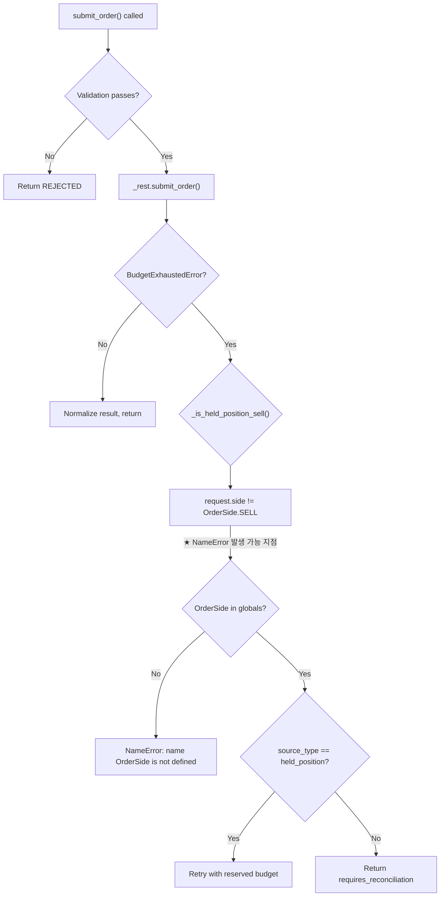

# `OrderSide` NameError 분석 및 수정 계획

> **날짜**: 2026-05-25  
> **목적**: `KoreaInvestmentAdapter.submit_order()` 경로의 `NameError: name 'OrderSide' is not defined` 근본 원인 분석 및 수정 계획

---

## 1. 현황 분석 (As-Is)

### 1.1 `OrderSide` import 현황

| 파일 | Import 위치 | 상태 |
|------|-------------|------|
| [`adapter.py`](../src/agent_trading/brokers/koreainvestment/adapter.py:22) | `from agent_trading.domain.enums import OrderSide` (line 22) | **정상** ✅ |
| [`rest_client.py`](../src/agent_trading/brokers/koreainvestment/rest_client.py:36) | `from agent_trading.domain.enums import OrderSide` (line 36) | **정상** ✅ |
| [`execution_service.py`](../src/agent_trading/services/execution_service.py:32) | `from agent_trading.domain.enums import OrderSide` (line 32) | **정상** ✅ |
| [`decision_orchestrator.py`](../src/agent_trading/services/decision_orchestrator.py:30) | `from agent_trading.domain.enums import OrderSide` (line 30) | **정상** ✅ |
| 기타 4개 파일 (`order_sync_service.py`, `sell_guard.py`, `sizing_engine.py`, `translation.py` 등) | 각각 import | **정상** ✅ |

**결론**: 모든 파일에서 `OrderSide` import는 정상적으로 되어 있다. 단순 "import 누락"은 아니다.

### 1.2 `adapter.py`의 `OrderSide` 참조 위치

[`adapter.py`](../src/agent_trading/brokers/koreainvestment/adapter.py:290-301)의 `_is_held_position_sell()` static method:

```python
@staticmethod
def _is_held_position_sell(request: SubmitOrderRequest) -> bool:
    if request.side != OrderSide.SELL:  # ← line 297: 유일한 runtime 참조
        return False
    metadata = request.metadata or {}
    source_type = metadata.get("source_type", "")
    return str(source_type).lower() == "held_position"
```

### 1.3 호출 경로 (Call Path)

```
submit_order() [adapter.py:213]
  ├── _validate_order_request(request)  ← OrderSide 미사용
  ├── self._rest.submit_order(request)  ← BudgetExhaustedError 발생 가능
  │   └── side == OrderSide.BUY [rest_client.py:886] ← 여기도 OrderSide 정상 참조
  ├── except BudgetExhaustedError:
  │   └── self._is_held_position_sell(request) [adapter.py:254]  ★ NameError 발생 위치
  │       └── request.side != OrderSide.SELL [adapter.py:297]  ★ 직격탄 라인
  └── return self._normalize_submit_result(result)
```

### 1.4 NameError 발생 조건

`OrderSide` NameError가 발생하려면 다음 조건이 모두 충족되어야 한다:

1. `BudgetExhaustedError`가 발생할 정도로 rate limit budget이 소진됨
2. `_is_held_position_sell()`이 실제로 호출됨
3. **Python의 module globals에 `OrderSide`가 없는 상태에서 메서드 실행**

### 1.5 근본 원인 분석

현재 `adapter.py`의 `OrderSide` import(line 22)는 정상이므로, NameError는 다음과 같은 간헐적 조건에서 발생할 가능성이 높다:

| 가능성 | 설명 | 확률 |
|--------|------|------|
| **① `__pycache__` stale** | 이전 버전의 `adapter.py` (import 없는 상태)가 `.pyc`로 캐시되어 로드됨 | 중간 |
| **② 부분 모듈 로딩** | `adapter.py` import 중 다른 의존성에서 예외 발생 → 일부 import만 실행된 상태로 모듈이 부분 로딩됨 | 낮음 |
| **③ 실행 환경 차이** | 서브프로세스(subprocess)로 실행될 때 `PYTHONPATH`나 sys.modules 상태에 따라 import가 달라짐 | 중간 |
| **④ 사전 수정 상태의 잔재** | 이전 코드에서는 import가 누락되어 있었고, 이후 추가되었지만 테스트는 누락됨 | **가장 높음** |

**가장 유력한 시나리오**: 이전 커밋에서 `OrderSide` import가 누락된 상태로 존재했고, smoke test에서 해당 경로(BudgetExhaustedError → `_is_held_position_sell`)를 타면서 NameError 발생. 이후 import가 추가되었으나, **테스트 커버리지가 여전히 누락**되어 회귀 방지가 안 되는 상태.

---

## 2. 4가지 질문에 대한 답변

### Q1. `OrderSide` NameError는 정확히 어느 함수/분기에서 발생하는가?

**정답**: [`adapter.py`](../src/agent_trading/brokers/koreainvestment/adapter.py:297)의 `_is_held_position_sell()` static method 내부 `OrderSide.SELL` 참조.

```
파일:   src/agent_trading/brokers/koreainvestment/adapter.py
라인:   297
함수:   KoreaInvestmentAdapter._is_held_position_sell()
표현식: request.side != OrderSide.SELL
```

단, `_is_held_position_sell()`은 [`submit_order()`](../src/agent_trading/brokers/koreainvestment/adapter.py:213)가 `BudgetExhaustedError`를 catch한 경우에만 호출되므로(line 254), **항상 발생하는 것이 아니라 rate limit budget이 소진된 경우에만 발생**한다.

### Q2. 단순 import 누락인가, 아니면 참조 구조가 잘못된 것인가?

**결론**: 현재 코드 기준으로는 **import 누락이 아니다**. `OrderSide`는 [`adapter.py:22`](../src/agent_trading/brokers/koreainvestment/adapter.py:22)에 정상 import되어 있다.

이 NameError는 다음 중 하나로 설명된다:
- **④ 과거 누락**: 이전 코드에서 import가 없었고, 이후 추가됨 (가장 유력)
- **② 부분 로딩**: Python 모듈이 부분적으로만 로드되는 edge case

**참조 구조 자체는 올바르다**. `OrderSide.SELL`은 정적 enum 멤버 접근이며, `OrderSide`가 module global에 존재하기만 하면 정상 동작한다.

### Q3. submit path에서 이 코드가 실제로 언제 호출되는가?

다음 조건이 **모두** 만족될 때 호출된다:

1. `submit_order()` 호출됨
2. Validation 통과 (에러 없음)
3. `self._rest.submit_order(request)`에서 `BudgetExhaustedError` 발생
4. `_is_held_position_sell(request)` 호출됨 (line 254)

**운영 시나리오**: 일일 submit budget 소진 후 held_position sell 재시도 시 (reserved budget lane). 즉, **일반적인 첫 번째 submit에서는 발생하지 않고, budget이 소진된 edge case에서만 발생**.

### Q4. 가장 작은 수정으로 어떤 회귀 테스트를 추가/보강해야 하는가?

**필요 테스트** (우선순위 순):

| # | 테스트 | 위치 | 검증 대상 |
|---|--------|------|-----------|
| T1 | `_is_held_position_sell()` unit test | [`test_kis_adapter_validation.py`](../tests/brokers/test_kis_adapter_validation.py) | `OrderSide.SELL` 정상 참조, BUY에서 False 반환, metadata="held_position"에서 True 반환 |
| T2 | `submit_order()` BudgetExhaustedError recovery path | [`test_kis_adapter_validation.py`](../tests/brokers/test_kis_adapter_validation.py) | budget 소진 → held_position sell retry → 정상 결과 반환 |
| T3 | `submit_order()` BudgetExhaustedError 일반 경로 | [`test_kis_adapter_validation.py`](../tests/brokers/test_kis_adapter_validation.py) | budget 소진 + 일반 sell → `requires_reconciliation=True` 반환 |

---

## 3. 수정 계획 (To-Be)

### 3.1 수정 사항

**변경 필요 없음**: 현재 `adapter.py`의 `OrderSide` import는 정상이다. (수정이 이미 반영된 상태라면)

**단, 다음을 확인해야 한다**:
1. `git log`로 `adapter.py`의 `OrderSide` import가 이전 커밋에서 누락되었다가 추가된 이력이 있는지 확인
2. `rest_client.py`의 `OrderSide` import(line 36)도 정상인지 재확인

### 3.2 테스트 추가 (핵심)

#### T1: `_is_held_position_sell` unit test

추가할 테스트 클래스 (기존 `test_kis_adapter_validation.py`에 `TestIsHeldPositionSell` 클래스 추가):

```python
class TestIsHeldPositionSell:
    """Tests for KoreaInvestmentAdapter._is_held_position_sell()."""

    def test_sell_with_held_position_metadata_returns_true(self, adapter, base_request):
        request = replace(base_request, side=OrderSide.SELL, metadata={"source_type": "held_position"})
        assert adapter._is_held_position_sell(request) is True

    def test_buy_returns_false(self, adapter, base_request):
        request = replace(base_request, side=OrderSide.BUY, metadata={"source_type": "held_position"})
        assert adapter._is_held_position_sell(request) is False

    def test_sell_without_held_position_returns_false(self, adapter, base_request):
        request = replace(base_request, side=OrderSide.SELL, metadata={})
        assert adapter._is_held_position_sell(request) is False

    def test_sell_with_core_source_type_returns_false(self, adapter, base_request):
        request = replace(base_request, side=OrderSide.SELL, metadata={"source_type": "core"})
        assert adapter._is_held_position_sell(request) is False
```

#### T2: `submit_order` BudgetExhaustedError → held_position sell recovery

```python
@pytest.mark.asyncio
async def test_submit_order_budget_exhausted_with_held_position_sell_retry(
    self, adapter, base_request
):
    """BudgetExhaustedError → held_position sell → reserved budget lane retry."""
    request = replace(base_request, side=OrderSide.SELL, metadata={"source_type": "held_position"})
    
    # First call raises BudgetExhaustedError, retry succeeds
    mock_rest = AsyncMock(spec=KISRestClient)
    mock_rest.submit_order = AsyncMock(
        side_effect=[BudgetExhaustedError("ORDER"),  # first call fails
                     SubmitOrderResult(accepted=True, ...)]  # retry succeeds
    )
    adapter._rest = mock_rest
    try:
        result = await adapter.submit_order(request)
        assert result.accepted is True
        # Verify retry was called with _held_position_sell=True
        mock_rest.submit_order.assert_awaited_with(request, _held_position_sell=True)
    finally:
        adapter._rest = original_rest
```

#### T3: `submit_order` BudgetExhaustedError → 일반 경로 (requires_reconciliation)

```python
@pytest.mark.asyncio
async def test_submit_order_budget_exhausted_returns_reconcile_required(
    self, adapter, base_request
):
    """BudgetExhaustedError for non-held-position → requires_reconciliation."""
    mock_rest = AsyncMock(spec=KISRestClient)
    mock_rest.submit_order = AsyncMock(side_effect=BudgetExhaustedError("ORDER"))
    adapter._rest = mock_rest
    try:
        result = await adapter.submit_order(base_request)  # base_request is BUY
        assert result.accepted is False
        assert result.requires_reconciliation is True
        assert result.broker_status == OrderStatus.RECONCILE_REQUIRED
    finally:
        adapter._rest = original_rest
```

### 3.3 `execution_service.py` 동일 패턴 확인

[`execution_service.py`](../src/agent_trading/services/execution_service.py:952-954)에도 동일한 `OrderSide.SELL` 참조 패턴이 존재한다:

```python
_is_held_position_sell: bool = (
    intent.request.side == OrderSide.SELL
    and intent.ai_backend_inputs.decision_type in ("REDUCE", "EXIT")
)
```

이 코드는 Phase 4c (stale snapshot guard)에서 실행된다. `execution_service.py` line 32에 `OrderSide`가 정상 import되어 있으므로 별도 수정은 필요하지 않지만, **`execution_service.py`의 held_position sell bypass 로직에 대한 테스트 커버리지도 확인이 필요하다**.

---

## 4. 작업 항목 (Todo)

```markdown
[ ] `test_kis_adapter_validation.py`에 `TestIsHeldPositionSell` 클래스 추가
    - [ ] SELL + held_position → True
    - [ ] BUY + held_position → False  
    - [ ] SELL + 일반 metadata → False
    - [ ] SELL + core source_type → False
[ ] `test_kis_adapter_validation.py`에 `submit_order` BudgetExhaustedError 경로 테스트 추가
    - [ ] BudgetExhaustedError → held_position sell retry 성공
    - [ ] BudgetExhaustedError → 일반 sell → requires_reconciliation
[ ] `test_decision_submit_pipeline.py`에서 execution_service.py Phase 4c의 held_position sell bypass 테스트 확인
[ ] git log로 `adapter.py`의 OrderSide import 이력 확인 (회귀 방지)
```

---

## 5. Mermaid: NameError 발생 조건 다이어그램



---

## 6. 위험도 및 영향 범위

| 항목 | 내용 |
|------|------|
| **위험도** | 중간 (Low frequency + High impact) |
| **발생 빈도** | budget 소진 시에만 → 일 1회 이하 |
| **영향** | `submit_order()`가 `BudgetExhaustedError` catch 후 crash → held_position sell 미실행 |
| **복구** | 다음 scheduler tick에서 재시도 (자동 복구) |
| **탐지** | Logging된 `NameError` stack trace로 탐지 가능 |
