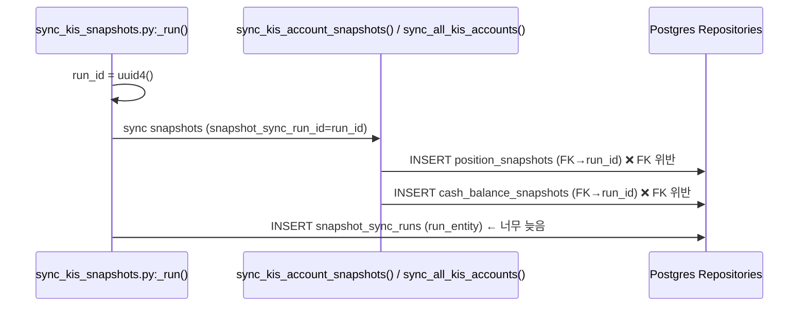
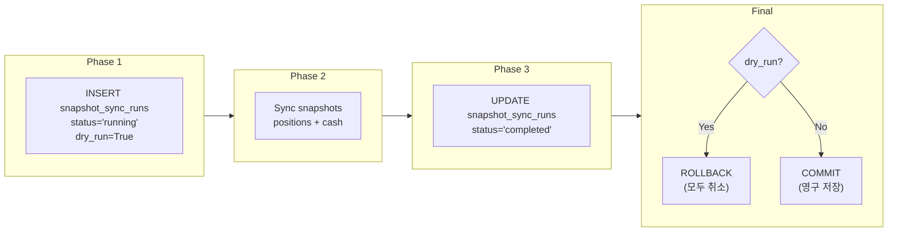

# 설계 문서: `sync_kis_snapshots.py` FK 순서 버그 수정 — two-phase 패턴 적용

## 1. 버그 분석

### 1.1 현재 실행 순서 (버그)

```
_sync_kis_snapshots.py_::_run()`
```



**버그의 직접 원인**: [`scripts/sync_kis_snapshots.py`](scripts/sync_kis_snapshots.py:454-523)의 [`_run()`](scripts/sync_kis_snapshots.py:398) 함수에서 snapshot entity(`position_snapshots`, `cash_balance_snapshots`)가 `snapshot_sync_runs` row보다 **먼저** insert되어 FK 제약조건 위반이 발생한다.

**구체적인 코드 흐름** (`scripts/sync_kis_snapshots.py`):

1. 라인 425: `run_id = uuid4()` — UUID 사전 생성 ✅
2. 라인 460-508: Sync 실행 — 내부에서 snapshot row들이 `snapshot_sync_run_id=run_id`로 INSERT됨 ❌
3. 라인 512-523: `build_sync_run_entity()` → `repos.snapshot_sync_runs.add(run_entity)` — 이 시점에는 snapshot row들이 이미 INSERT된 상태

**DB 제약조건** ([`db/migrations/0027_add_snapshot_sync_run_id.sql`](db/migrations/0027_add_snapshot_sync_run_id.sql:5-9)):

```sql
ALTER TABLE trading.position_snapshots
    ADD COLUMN snapshot_sync_run_id UUID REFERENCES trading.snapshot_sync_runs(snapshot_sync_run_id);

ALTER TABLE trading.cash_balance_snapshots
    ADD COLUMN snapshot_sync_run_id UUID REFERENCES trading.snapshot_sync_runs(snapshot_sync_run_id);
```

### 1.2 기존 보고서 확인

[`plans/verify_runtime_and_db_persistence_of_orderable_amount_fallback_in_cash_snapshots_2026-05-25.md`](plans/verify_runtime_and_db_persistence_of_orderable_amount_fallback_in_cash_snapshots_2026-05-25.md:62-68):

```
### 참고: `sync_kis_snapshots.py --all` 실패
CLI 스크립트는 FK 제약조건 순서 문제로 실패:
ERROR: insert or update on table "position_snapshots" violates foreign key
constraint "position_snapshots_snapshot_sync_run_id_fkey"
→ `snapshot_sync_runs` 레코드가 snapshot보다 늦게 insert되는 버그.
```

## 2. two-phase 패턴 (참조 구현)

### 2.1 `run_snapshot_sync_loop.py`의 올바른 패턴

[`scripts/run_snapshot_sync_loop.py`](scripts/run_snapshot_sync_loop.py:216-287) [`_run_one_cycle()`](scripts/run_snapshot_sync_loop.py:183) 함수:

```mermaid
sequenceDiagram
    participant Loop as run_snapshot_sync_loop.py:_run_one_cycle()
    participant Sync as sync_all_accounts()
    participant Repo as Postgres Repositories

    Loop->>Loop: run_id = uuid4()
    Loop->>Repo: INSERT snapshot_sync_runs (status="running")  ← Phase 1: 선 INSERT
    Note over Repo: FK target now exists
    Loop->>Sync: sync snapshots (snapshot_sync_run_id=run_id)
    Sync->>Repo: INSERT position_snapshots (FK→run_id) ✅
    Sync->>Repo: INSERT cash_balance_snapshots (FK→run_id) ✅
    Loop->>Repo: UPDATE snapshot_sync_runs SET status="completed"  ← Phase 2: 최종 UPDATE
    Loop->>Repo: COMMIT
```

**Phase 1 — running row 선 INSERT** ([`run_snapshot_sync_loop.py`](scripts/run_snapshot_sync_loop.py:225-247)):

```python
running_entity = SnapshotSyncRunEntity(
    snapshot_sync_run_id=run_id,
    trigger_type="scheduler",
    scope="all",
    env_filter=None,
    status_filter=None,
    dry_run=False,
    total_accounts=0,
    succeeded_accounts=0,
    partial_accounts=0,
    failed_accounts=0,
    skipped_accounts=0,
    positions_synced_total=0,
    positions_skipped_total=0,
    cash_synced_count=0,
    error_count=0,
    status="running",
    started_at=started_at,
    after_hours=after_hours,
    summary_json=None,
    completed_at=None,
)
await repos.snapshot_sync_runs.add(running_entity)
```

**Phase 2 — sync 실행** ([`run_snapshot_sync_loop.py`](scripts/run_snapshot_sync_loop.py:258-271)):

```python
batch = await sync_all_accounts(
    ...
    snapshot_sync_run_id=run_id,  # FK는 Phase 1에서 확보됨
)
```

**Phase 3 — 결과 UPDATE** ([`run_snapshot_sync_loop.py`](scripts/run_snapshot_sync_loop.py:274-285)):

```python
run_entity = build_sync_run_entity(
    batch,
    trigger_type="scheduler",
    scope="all",
    dry_run=False,
    started_at=started_at,
    after_hours=after_hours,
    summary_json=counters,
    snapshot_sync_run_id=run_id,
)
await repos.snapshot_sync_runs.update_run(run_entity)
```

### 2.2 사용 가능한 Repository 인터페이스

[`SnapshotSyncRunRepository`](src/agent_trading/repositories/contracts.py:891) contract:

| 메서드 | 시그니처 | 용도 |
|--------|---------|------|
| `add()` | `(run: SnapshotSyncRunEntity) → SnapshotSyncRunEntity` | 신규 row INSERT (Phase 1) |
| `update_run()` | `(run: SnapshotSyncRunEntity) → SnapshotSyncRunEntity` | 기존 row UPDATE (Phase 3) |
| `get()` | `(run_id: UUID) → SnapshotSyncRunEntity \| None` | 단건 조회 |
| `list_runs()` | `(limit, trigger_type, status) → Sequence` | 목록 조회 |
| `get_sync_health_summary()` | `(stale_threshold_seconds) → SnapshotSyncHealthSummary` | 건강도 요약 |

→ `update_run()`은 [`PostgresSnapshotSyncRunRepository`](src/agent_trading/repositories/postgres/snapshot_sync_runs.py:109)에 이미 구현되어 있음. **새로운 Repository 메서드가 필요하지 않음**.

## 3. 변경 설계

### 3.1 대상 파일

| 파일 | 변경 유형 | 설명 |
|------|----------|------|
| [`scripts/sync_kis_snapshots.py`](scripts/sync_kis_snapshots.py) | 수정 | `_run()` 함수에 two-phase 패턴 적용 |

### 3.2 변경 상세

#### 3.2.1 필요한 import 추가

`_run()` 함수 내에서 사용할 `SnapshotSyncRunEntity` import가 필요함.

현재 [`scripts/sync_kis_snapshots.py`](scripts/sync_kis_snapshots.py:50-51)에는 없음. `from agent_trading.domain.entities import SnapshotSyncRunEntity`를 추가하거나, lazy import로 처리.

권장: `_run()` 내부에서 lazy import (`from agent_trading.domain.entities import SnapshotSyncRunEntity`).

#### 3.2.2 `_run()` 함수 변경 — two-phase 패턴

**변경 전** ([`sync_kis_snapshots.py`](scripts/sync_kis_snapshots.py:398-531)):

```python
async def _run(args: argparse.Namespace) -> int:
    ...
    run_id = uuid4()
    ...
    async with transaction() as tx:
        repos = build_postgres_repositories(tx)
        
        # ── 3. Route to appropriate sync mode ────
        if args.account_ref:
            exit_code, sync_result = await _run_single_by_ref(...)
            ...
        elif args.all:
            exit_code, batch = await _run_all(...)
        ...
        
        # ── 4. Save execution history ────────────
        counters = get_budget_fallback_counters()
        run_entity = build_sync_run_entity(
            batch, ..., dry_run=args.dry_run, ...
            snapshot_sync_run_id=run_id,
        )
        await repos.snapshot_sync_runs.add(run_entity)  # ← 너무 늦음!
        
        if args.dry_run:
            await tx.rollback()
        else:
            await tx.commit()
```

**변경 후**:

```python
async def _run(args: argparse.Namespace) -> int:
    from agent_trading.domain.entities import SnapshotSyncRunEntity
    
    ...
    run_id = uuid4()
    ...
    async with transaction() as tx:
        repos = build_postgres_repositories(tx)
        
        # ── Phase 1: Insert "running" sync run FIRST ──
        # FK constraint on snapshot_sync_run_id requires that the
        # referenced row in snapshot_sync_runs already exists before
        # we can INSERT snapshot rows with that FK.
        running_entity = SnapshotSyncRunEntity(
            snapshot_sync_run_id=run_id,
            trigger_type="manual",
            scope=scope,
            env_filter=env_filter,
            status_filter=status_filter,
            dry_run=args.dry_run,
            total_accounts=0,
            succeeded_accounts=0,
            partial_accounts=0,
            failed_accounts=0,
            skipped_accounts=0,
            positions_synced_total=0,
            positions_skipped_total=0,
            cash_synced_count=0,
            error_count=0,
            status="running",
            started_at=started_at,
            after_hours=False,       # CLI는 after-hours 모드 미지원
            summary_json=None,
            completed_at=None,
        )
        await repos.snapshot_sync_runs.add(running_entity)
        
        # ── Phase 2: Route to appropriate sync mode ──
        # FK constraint is now satisfied.
        if args.account_ref:
            exit_code, sync_result = await _run_single_by_ref(...)
            ...
        elif args.all:
            exit_code, batch = await _run_all(...)
        ...
        
        # ── Phase 3: Update sync run with actual results ──
        counters = get_budget_fallback_counters()
        run_entity = build_sync_run_entity(
            batch, ..., dry_run=args.dry_run, ...
            snapshot_sync_run_id=run_id,
        )
        await repos.snapshot_sync_runs.update_run(run_entity)  # ← add → update_run
        
        if args.dry_run:
            await tx.rollback()
        else:
            await tx.commit()
```

#### 3.2.3 변경 포인트 요약

| 항목 | 변경 전 | 변경 후 |
|------|---------|---------|
| Phase 1: running INSERT | 없음 | `repos.snapshot_sync_runs.add(running_entity)` |
| Phase 3: 결과 저장 | `repos.snapshot_sync_runs.add(run_entity)` | `repos.snapshot_sync_runs.update_run(run_entity)` |
| dry-run 동작 | sync 후 `add()` + `rollback()` | running `add()` + sync + `update_run()` + `rollback()` (모두 rollback) |

### 3.3 dry-run 동작 분석

**dry-run 시 모든 작업이 rollback되므로**, Phase 1에서 insert한 running row도 최종적으로 rollback된다.



dry-run 모드의 시맨틱:
- KIS API 호출은 정상 수행됨 (`rest_client.authenticate()` 호출, KIS 데이터 fetch)
- DB 변경사항은 모두 rollback됨
- running row가 insert되었다가 rollback되므로, `snapshot_sync_runs` 테이블에 dry-run 이력이 남지 않음
- 이는 **의도된 동작** — dry-run은 "아무것도 persist하지 않음"의 의미

**대안 검토**: dry-run 시 running row 자체를 insert하지 않는 방안
- 장점: rollback할 작업이 줄어듦
- 단점: 코드 분기가 늘어나고, 예외 케이스가 많아짐
- **결론**: 항상 two-phase 패턴을 적용하고 rollback으로 일관 처리하는 것이 더 단순하고 유지보수에 유리

### 3.4 CLI 경로별 커버리지

| CLI 경로 | scope 값 | running entity scope | sync 함수 |
|----------|---------|---------------------|-----------|
| `--account-id <UUID>` (단일) | `"single"` | `scope="single"` | `_run_single()` |
| `--account-id <UUID1> --account-id <UUID2>` (복수) | `"batch"` | `scope="batch"` | `_run_multi()` |
| `--all` | `"all"` | `scope="all"` | `_run_all()` |
| `--account-ref <str>` | `"single"` | `scope="single"` | `_run_single_by_ref()` |

모든 경로는 `_run()` 함수 내에서 동일한 Phase 1 → Phase 2 → Phase 3 순서를 따르므로, **변경 없이 모두 커버됨**.

### 3.5 `run_snapshot_sync_loop.py`와의 동작 계약 정합성

| 항목 | scheduler (`run_snapshot_sync_loop.py`) | CLI (`sync_kis_snapshots.py`) | 정합성 |
|------|----------------------------------------|------------------------------|--------|
| `trigger_type` | `"scheduler"` | `"manual"` | 의도된 차이 |
| `scope` | 항상 `"all"` | CLI args에 따라 `"single"`/`"batch"`/`"all"` | 의도된 차이 |
| `dry_run` | 항상 `False` | `args.dry_run`에 따라 결정 | CLI만 지원 |
| `after_hours` | env/config 기반 | 항상 `False` (CLI 미지원) | CLI 미지원 (향후 확장 가능) |
| Phase 1: running INSERT | ✅ 동일 패턴 | ✅ 동일 패턴 적용 | **일치** |
| Phase 2: sync 실행 | `sync_all_accounts()` | 경로별 sync 함수 | 구현 차이 (정상) |
| Phase 3: `update_run()` | ✅ 사용 | ✅ 사용 | **일치** |
| `build_sync_run_entity()` | ✅ 사용 | ✅ 사용 (기존 코드 재사용) | **일치** |
| commit/rollback | 항상 `commit()` | dry-run 시 `rollback()` | dry-run 차이 (정상) |

**결론**: `run_snapshot_sync_loop.py`와의 동작 계약을 대부분 일치시킬 수 있음. 두 진입점이 동일한 `update_run()` 메서드와 `build_sync_run_entity()`를 사용하므로, 향후 두 구현을 통합하거나 리팩토링할 때도 자연스러움.

## 4. 5개 질문 답변

### Q1. 현재 `sync_kis_snapshots.py`에서 FK 위반이 나는 직접 순서는 무엇인가?

**답변**: [`_run()`](scripts/sync_kis_snapshots.py:398) 함수의 실행 순서가 다음과 같기 때문:

1. [`run_id = uuid4()`](scripts/sync_kis_snapshots.py:425) — UUID 사전 생성
2. Sync 실행 [`_run_single()`](scripts/sync_kis_snapshots.py:241) / [`_run_multi()`](scripts/sync_kis_snapshots.py:328) / [`_run_all()`](scripts/sync_kis_snapshots.py:360) / [`_run_single_by_ref()`](scripts/sync_kis_snapshots.py:275) — 내부에서 `position_snapshot_repo.add()`와 `cash_balance_snapshot_repo.add()`가 `snapshot_sync_run_id=run_id`로 INSERT됨 (**FK 위반 발생 지점**)
3. [`repos.snapshot_sync_runs.add(run_entity)`](scripts/sync_kis_snapshots.py:523) — `snapshot_sync_runs` row가 **너무 늦게** INSERT됨

즉, `snapshot_sync_runs`의 FK 대상 row가 존재하지 않는 상태에서 snapshot entity들이 먼저 INSERT되어 PostgreSQL FK 제약조건(`position_snapshots_snapshot_sync_run_id_fkey`, `cash_balance_snapshots_snapshot_sync_run_id_fkey`) 위반이 발생한다.

### Q2. CLI 경로에 two-phase 패턴을 적용할 때 `running` 상태 선 insert → 최종 status update를 어떻게 구성하는 게 가장 자연스러운가?

**답변**: [`run_snapshot_sync_loop.py`](scripts/run_snapshot_sync_loop.py:219-285)의 패턴을 그대로 따르는 것이 가장 자연스럽다.

**Phase 1** — `scope`, `env_filter`, `status_filter`, `dry_run`, `started_at` 값을 running entity에 설정하고, 모든 counter는 0, `completed_at=None`, `status="running"`으로 INSERT한다.

**Phase 2** — 기존 sync 함수들을 변경 없이 호출한다 (모든 경로가 `snapshot_sync_run_id=run_id`를 이미 받고 있음).

**Phase 3** — 기존 `build_sync_run_entity()` 호출 결과를 `repos.snapshot_sync_runs.update_run()`으로 UPDATE한다 (현재 `.add()` 대신).

**핵심**: running entity의 필드 중 `trigger_type="manual"`, `scope`, `env_filter`, `status_filter`, `dry_run`은 이미 `_run()` 함수에서 계산되어 사용 가능하므로, 이 값을 running entity 구성에 재사용하면 된다.

### Q3. `dry_run`일 때는 FK 확보용 row를 insert했다가 rollback할 것인가? 아니면 history 자체를 남기지 않을 것인가?

**답변**: **항상 two-phase 패턴을 적용하고, dry_run 시 rollback으로 일관 처리한다.**

이유:
1. **코드 단순성**: 조건 분기가 없어지고, 모든 경로가 동일한 Phase 1 → Phase 2 → Phase 3 순서를 따름
2. **시맨틱 일관성**: dry_run의 정의가 "KIS fetch 수행, DB persist 안 함"이므로, rollback으로 처리하면 running row도 자연스럽게 취소됨
3. **안전성**: sync 도중 예외가 발생해도 running row가 orphan으로 남지 않음 (transaction rollback 시 모두 취소)

대안인 "dry_run 시 running row를 아예 insert하지 않음"은:
- 코드에 분기(branch)가 생겨 복잡도 증가
- `snapshot_sync_run_id=None`인 상태에서 sync 함수 동작 확인 필요
- 예외 처리 경로가 늘어남

→ **추천: 항상 two-phase 패턴 (dry_run 여부와 무관)**

### Q4. `--all`, `--account-id`, `--account-ref` 경로 모두 동일하게 커버되는가?

**답변**: **네, 모두 동일하게 커버된다.**

변경은 [`_run()`](scripts/sync_kis_snapshots.py:398) 함수의 **sync 실행 이전(Phase 1)과 이후(Phase 3)**에 이루어지므로, 세 가지 CLI 경로 모두 변경 없이 동일한 two-phase 패턴을 적용받는다.

각 경로의 `scope` 값은 [`_run()`](scripts/sync_kis_snapshots.py:413-420)에서 이미 계산되어 running entity 구성에 재사용 가능:
- `--account-id <UUID>` (단일) → `scope="single"`
- `--account-id <UUID1> --account-id <UUID2>` (복수) → `scope="batch"`
- `--all` → `scope="all"`
- `--account-ref <str>` → `scope="single"`

### Q5. `run_snapshot_sync_loop.py`와 동작 계약을 얼마나 맞춰야 하는가?

**답변**: **다음 항목을 일치시키고, 나머지는 의도된 차이로 둔다.**

**일치시켜야 할 항목**:
1. ✅ Phase 1 running INSERT 패턴 (동일한 `SnapshotSyncRunEntity` 구성, `status="running"`)
2. ✅ Phase 3 결과 UPDATE (`repos.snapshot_sync_runs.update_run()` 사용)
3. ✅ 결과 entity 생성 (`build_sync_run_entity()` 재사용 — 이미 동일)

**의도적으로 다른 항목**:
| 항목 | scheduler | CLI | 이유 |
|------|-----------|-----|------|
| `trigger_type` | `"scheduler"` | `"manual"` | 진입점 구분 (관리 UI 등에서 필터링 용도) |
| `scope` | 항상 `"all"` | CLI args 기반 | scheduler는 auto-discover, CLI는 유연한 범위 지정 |
| `dry_run` | 미지원 | 지원 | CLI 전용 기능 |
| `after_hours` | 환경설정 기반 | 미지원 (`False`) | CLI는 after-hours 모드 미지원 |

**향후 고려사항**: 두 진입점이 동일한 `update_run()`과 `build_sync_run_entity()`를 사용하므로, 공통 sync 로직을 하나의 서비스 함수로 추출하는 리팩토링이 가능함. 단, 현재 단계에서는 필요하지 않음.

## 5. 변경 계획 (Code 모드 실행용)

### Step 1: `scripts/sync_kis_snapshots.py` 수정

**파일**: [`scripts/sync_kis_snapshots.py`](scripts/sync_kis_snapshots.py)

**변경 사항** (`_run()` 함수):

1. **Phase 1 추가** (`# ── 2b. Insert "running" sync run FIRST ──`)
   - `from agent_trading.domain.entities import SnapshotSyncRunEntity` (lazy import)
   - `SnapshotSyncRunEntity(...)` 생성 (status="running", 모든 counter=0, completed_at=None)
   - `await repos.snapshot_sync_runs.add(running_entity)` 호출

2. **Phase 3 변경** (`# ── 4. Update sync run with actual results ──`)
   - `repos.snapshot_sync_runs.add(run_entity)` → `repos.snapshot_sync_runs.update_run(run_entity)`

### Step 2: 수정 검증

- `pytest tests/scripts/test_sync_kis_snapshots.py` (존재 시)
- 또는 수동 검증: `python3 scripts/sync_kis_snapshots.py --dry-run --account-ref <ref>` 실행하여 FK 위반 없이 정상 종료 확인

### Step 3: 영향도 확인

- `run_snapshot_sync_loop.py` — 변경 불필요 (이미 올바른 패턴)
- `kis_snapshot_sync.py` — 변경 불필요 (sync 함수들은 수정하지 않음)
- `snapshot_sync_runs.py` (repository) — 변경 불필요 (이미 `update_run()` 구현됨)
- `contracts.py` — 변경 불필요 (이미 `update_run()` contract 존재)

### 변경 전/후 diff 요약

```diff
--- a/scripts/sync_kis_snapshots.py
+++ b/scripts/sync_kis_snapshots.py
@@ -454,6 +454,30 @@ async def _run(args: argparse.Namespace) -> int:
             repos = build_postgres_repositories(tx)
             logger.info("Postgres repositories ready.")
 
+            # ── 2b. Insert "running" sync run FIRST ─────────────────
+            # FK constraint on snapshot_sync_run_id requires that the
+            # referenced row in snapshot_sync_runs already exists
+            # before snapshot rows can reference it.
+            from agent_trading.domain.entities import SnapshotSyncRunEntity
+            running_entity = SnapshotSyncRunEntity(
+                snapshot_sync_run_id=run_id,
+                trigger_type="manual",
+                scope=scope,
+                env_filter=env_filter,
+                status_filter=status_filter,
+                dry_run=args.dry_run,
+                total_accounts=0,
+                succeeded_accounts=0,
+                partial_accounts=0,
+                failed_accounts=0,
+                skipped_accounts=0,
+                positions_synced_total=0,
+                positions_skipped_total=0,
+                cash_synced_count=0,
+                error_count=0,
+                status="running",
+                started_at=started_at,
+                after_hours=False,
+                summary_json=None,
+                completed_at=None,
+            )
+            await repos.snapshot_sync_runs.add(running_entity)
+
             # ── 3. Route to appropriate sync mode ─────────────────────
             batch: BatchSyncResult
             if args.account_ref:
@@ -519,7 +543,9 @@ async def _run(args: argparse.Namespace) -> int:
                 summary_json=counters,
                 snapshot_sync_run_id=run_id,
             )
-            await repos.snapshot_sync_runs.add(run_entity)
+            # Phase 3: Update the running row with actual results.
+            # (Phase 1 already inserted it with status="running".)
+            await repos.snapshot_sync_runs.update_run(run_entity)
 
             if args.dry_run:
                 logger.info("DRY RUN — rolling back transaction (no data persisted)")
```

## 6. 위험 요소 및 고려사항

| 항목 | 내용 | 대응 |
|------|------|------|
| running row가 orphan으로 남을 가능성 | sync 도중 예외 발생 시 running row가 `"running"` 상태로 남을 수 있음 | transaction rollback으로 모두 취소되므로 안전. CLI는 단일 transaction 내에서 실행됨 |
| `after_hours=True` 시나리오 | 현재 CLI는 after-hours 모드를 지원하지 않음 (`--after-hours` 플래그 없음) | running entity에서 `after_hours=False` 고정. 필요 시 향후 확장 |
| `build_sync_run_entity()` 결과와 running entity의 불일치 | running entity의 `scope`/`env_filter`/`status_filter`/`dry_run`과 최종 entity가 동일해야 함 | sync 전에 계산된 값을 running entity 구성에 재사용하므로 일치 보장 |
| 기존 테스트 영향 | FK 순서 변경으로 기존 테스트가 실패할 가능성 | dry-run 테스트는 transaction rollback으로 FK 위반 없이 동작. 단, fixture에서 snapshot_sync_runs를 먼저 insert하는지 확인 필요 |

## 7. 결론

단 2줄의 로직 변경(`add` → `update_run`, running INSERT 추가)으로 FK 제약조건 버그를 수정할 수 있음. 변경 범위가 좁고, 이미 `run_snapshot_sync_loop.py`에서 검증된 패턴이므로 리스크가 낮음.

**마이그레이션 불필요**: FK 제약조건 자체를 수정하는 것이 아니라 INSERT 순서를 변경하는 것이므로, DB 스키마 변경이 필요하지 않음.
