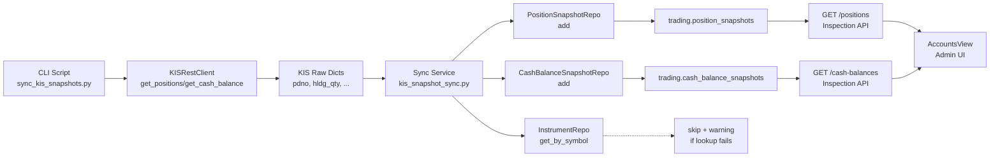

# KIS Account Snapshot Sync

## 목적

KIS `inquire-balance` API로 계좌의 포지션/예수금을 조회하여 기존 Snapshot 테이블
([`PositionSnapshotEntity`](src/agent_trading/domain/entities.py:116),
[`CashBalanceSnapshotEntity`](src/agent_trading/domain/entities.py:129))에 저장한다.

저장된 데이터는 기존 Inspection API
([`GET /positions`](src/agent_trading/api/routes/positions.py:18),
[`GET /cash-balances`](src/agent_trading/api/routes/positions.py:41))를 통해
[`AccountsView`](admin_ui/src/components/AccountsView.tsx)에 실시간 KIS 데이터가 표시된다.

---

## 현재 상태 분석 (Step 1 완료)

### Snapshot 저장 경로 (이미 구현 완료)

| 계층 | 파일 | 설명 |
|------|------|------|
| Entity | [`entities.py:116-126`](src/agent_trading/domain/entities.py:116) | `PositionSnapshotEntity` (frozen dataclass) |
| Entity | [`entities.py:129-139`](src/agent_trading/domain/entities.py:129) | `CashBalanceSnapshotEntity` (frozen dataclass) |
| Contract | [`contracts.py:151-159`](src/agent_trading/repositories/contracts.py:151) | `PositionSnapshotRepository.add()`, `list_latest_by_account()` |
| Contract | [`contracts.py:162-170`](src/agent_trading/repositories/contracts.py:162) | `CashBalanceSnapshotRepository.add()`, `get_latest_by_account()` |
| Postgres | [`position_snapshots.py:25-45`](src/agent_trading/repositories/postgres/position_snapshots.py:25) | `INSERT INTO trading.position_snapshots (...)` |
| Postgres | [`cash_balance_snapshots.py:24-43`](src/agent_trading/repositories/postgres/cash_balance_snapshots.py:24) | `INSERT INTO trading.cash_balance_snapshots (...)` |
| In-Memory | [`memory.py:218-232`](src/agent_trading/repositories/memory.py:218) | `InMemoryPositionSnapshotRepository` |
| In-Memory | [`memory.py:235-251`](src/agent_trading/repositories/memory.py:235) | `InMemoryCashBalanceSnapshotRepository` |
| Schema | [`schemas.py:201-223`](src/agent_trading/api/schemas.py:201) | `PositionSnapshotView` (response model) |
| Schema | [`schemas.py:226-246`](src/agent_trading/api/schemas.py:226) | `CashBalanceSnapshotView` (response model) |
| Route | [`positions.py:18-38`](src/agent_trading/api/routes/positions.py:18) | `GET /positions` → `position_snapshots.list_latest_by_account()` |
| Route | [`positions.py:41-63`](src/agent_trading/api/routes/positions.py:41) | `GET /cash-balances` → `cash_balance_snapshots.get_latest_by_account()` |
| Container | [`container.py:30-52`](src/agent_trading/repositories/container.py:30) | `RepositoryContainer` with all repos wired |

### KIS REST Client (KIS 조회 — 이미 구현 완료)

| 메서드 | 위치 | 반환값 |
|--------|------|--------|
| `get_positions()` | [`rest_client.py:879-917`](src/agent_trading/brokers/koreainvestment/rest_client.py:879) | `Sequence[dict[str, Any]]` — raw KIS `output` array |
| `get_cash_balance()` | [`rest_client.py:919-965`](src/agent_trading/brokers/koreainvestment/rest_client.py:919) | `dict[str, Any]` — raw KIS `output2` dict |

### 누락된 부분 (이번 구현 대상)

Snapshot 테이블에 **데이터를 쓰는 코드**가 없다. 현재는 empty snapshot → API가 빈 배열 반환 → Accounts 화면에 아무것도 표시되지 않음.

---

## 설계 결정 사항

### 1. Account ID Resolution

`PositionSnapshotEntity.account_id`는 `AccountEntity.account_id` (UUID)이다.

**결정**: Sync 서비스는 `account_id: UUID`를 직접 파라미터로 받는다.
CLI 스크립트는 `--account-id` 플래그로 UUID를 직접 입력받는다.
따라서 `AccountLookup`/`AccountRepository` 변경 불필요.

### 2. KIS Raw Field → Snapshot Entity 매핑

#### PositionSnapshotEntity 매핑

| KIS Raw 필드 | Entity 필드 | 변환 | 비고 |
|-------------|------------|------|------|
| `pdno` (종목코드) | → `instrument_id` | `InstrumentRepository.get_by_symbol(pdno, "KRX")` | **실패 시 해당 position만 skip + warning** |
| `hldg_qty` (보유수량) | `quantity` | `Decimal(str(item.get("hldg_qty", "0")))` | KIS 문자열 숫자 |
| `pchs_avg_pric` (매입평균가) | `average_price` | `Decimal(str(item.get("pchs_avg_pric", "0")))` | |
| `prpr` (현재가) | `market_price` | `Decimal(str(item.get("prpr", "0")))` if present else None | |
| `evlu_pfls_amt` (평가손익) | `unrealized_pnl` | `Decimal(str(item.get("evlu_pfls_amt", "0")))` if present else None | |
| (고정) | `source_of_truth` | `"broker"` | |
| (조회 시각) | `snapshot_at` | `datetime.now(tz=timezone.utc)` | |
| (신규 생성) | `position_snapshot_id` | `uuid4()` | |
| (파라미터) | `account_id` | `account_id` 파라미터 | |

#### CashBalanceSnapshotEntity 매핑

KIS `output2` (예수금 총괄) 필드:

| KIS Raw 필드 (`output2`) | Entity 필드 | 변환 | 비고 |
|--------------------------|-------------|------|------|
| `dnca_tot_amt` (예수금총액) | `available_cash` | `Decimal(str(raw.get("dnca_tot_amt", "0")))` | **Primary source** |
| `nxdy_excc_amt` (익일초과액) or `dnca_tot_amt` | `settled_cash` | `Decimal(str(raw.get("nxdy_excc_amt", "0")))` | **Fallback**: `dnca_tot_amt` if `nxdy_excc_amt` absent |
| (차액 계산) | `unsettled_cash` | `available_cash - settled_cash` if both positive | **Fallback**: `None` if insufficient fields |
| (고정) | `currency` | `"KRW"` | |
| (고정) | `source_of_truth` | `"broker"` | |
| (조회 시각) | `snapshot_at` | `datetime.now(tz=timezone.utc)` | |
| (신규 생성) | `cash_balance_snapshot_id` | `uuid4()` | |
| (파라미터) | `account_id` | `account_id` 파라미터 | |

### 3. Snapshot 저장 전략

- **append-only**: 기존 snapshot을 삭제하지 않고 매번 INSERT
- `list_latest_by_account()`가 `snapshot_at DESC LIMIT 1`로 최신만 조회하므로 문제 없음
- `source_of_truth = "broker"`로 설정

### 4. Rate Limit 고려

- `inquire-balance`는 `INQUIRY` bucket 사용 (이미 `KISRestClient`에서 `bucket=BucketType.INQUIRY`)
- Sync 호출은 기존 Order/Reconciliation 트래픽과 별도로 budget을 소비
- **Sync 호출 전용 budget 고려는 v1 범위 밖** — 현재는 `INQUIRY` bucket 공유

### 5. 오류 처리

- `InstrumentRepository.get_by_symbol(pdno, "KRX")` 실패 → 해당 position row **skip + warning 로그**
- 전체 sync 실패 X, partial success 허용
- `SyncResult.errors`에 skip된 건수와 사유 누적

---

## 변경 파일 목록

### 신규 파일

| 파일 | 설명 |
|------|------|
| [`src/agent_trading/services/kis_snapshot_sync.py`](src/agent_trading/services/kis_snapshot_sync.py) | Sync 서비스 함수 |
| [`scripts/sync_kis_snapshots.py`](scripts/sync_kis_snapshots.py) | CLI 진입점 스크립트 |

### 변경 금지 (User Constraint)

- [`rest_client.py`](src/agent_trading/brokers/koreainvestment/rest_client.py) — KIS REST 클라이언트 변경 금지
- [`adapter.py`](src/agent_trading/brokers/koreainvestment/adapter.py) — Broker submit semantics 변경 금지
- [`api/routes/positions.py`](src/agent_trading/api/routes/positions.py) — API routes 변경 금지
- [`api/schemas.py`](src/agent_trading/api/schemas.py) — Response models 변경 금지
- [`domain/entities.py`](src/agent_trading/domain/entities.py) — Entity contracts 변경 금지
- [`repositories/contracts.py`](src/agent_trading/repositories/contracts.py) — Repository protocols 변경 금지
- [`repositories/filters.py`](src/agent_trading/repositories/filters.py) — AccountLookup 변경 불필요 (account_id 직접 전달)
- [`admin_ui/src/components/AccountsView.tsx`](admin_ui/src/components/AccountsView.tsx) — **반드시 read-only 유지**

---

## 구현 세부

### Step 2: Sync Service (`src/agent_trading/services/kis_snapshot_sync.py`)

```python
@dataclass(slots=True, frozen=True)
class SyncResult:
    positions_synced: int
    positions_skipped: int
    cash_balance_synced: bool
    errors: list[str]


async def sync_kis_account_snapshots(
    rest_client: KISRestClient,
    instrument_repo: InstrumentRepository,
    position_snapshot_repo: PositionSnapshotRepository,
    cash_balance_snapshot_repo: CashBalanceSnapshotRepository,
    account_id: UUID,
) -> SyncResult:
    """KIS 계좌의 포지션/예수금을 조회하여 Snapshot 테이블에 저장한다.
    
    Parameters
    ----------
    rest_client: KIS REST 클라이언트 (인증 완료 상태)
    instrument_repo: 종목 lookup용
    position_snapshot_repo: 포지션 snapshot 저장
    cash_balance_snapshot_repo: 예수금 snapshot 저장
    account_id: AccountEntity.account_id (UUID)
    
    Returns
    -------
    SyncResult: sync 결과 (저장 건수, skip 건수, 오류 목록)
    """
```

### Step 3: CLI Script (`scripts/sync_kis_snapshots.py`)

```
python scripts/sync_kis_snapshots.py --account-id <UUID>
```

구현 상세:
1. `AppSettings` 로드 (환경변수 기반)
2. `KISRestClient` 생성
3. `authenticate()` 호출 (토큰 발급)
4. Postgres `TransactionManager` 생성 → `build_postgres_repositories(tx)`
5. `sync_kis_account_snapshots()` 호출
6. 결과 출력

### Step 4: 검증

1. KIS Paper 환경에서 `scripts/sync_kis_snapshots.py` 실행
2. `curl http://localhost:8000/positions?account_id=<UUID>` 응답 확인
3. `curl http://localhost:8000/cash-balances?account_id=<UUID>` 응답 확인
4. Admin UI Accounts 화면에서 포지션/예수금 데이터 표시 확인
5. `pytest tests/` regression (기존 테스트 통과 유지)

---

## Mermaid: Data Flow



---

## 검증 조건

| 조건 | 방법 |
|------|------|
| KIS 조회 성공 | Script 실행 시 positions/cash_balance fetch 확인 |
| Snapshot 저장 성공 | DB 직접 조회 또는 API 응답 확인 |
| Instrument lookup 실패 시 skip + warning | 로그에서 warning 메시지 확인 |
| API 응답 일치 | `GET /positions`에 synced 데이터 반환 |
| 기존 테스트 회귀 없음 | `pytest tests/` (Postgres 의존 테스트 제외) |
| Admin UI 표시 | Accounts 화면에서 포지션 데이터 표시 확인 |
