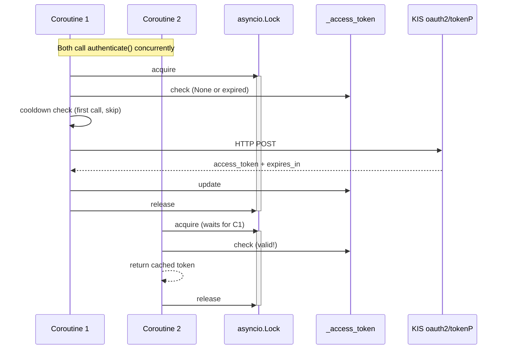

# KIS Auth/Approval strict 1 rps cap 구현 계획 (2026-05-07)

## 문제

KIS 공식 공지 (2026-04-20)에 따르면:
- Auth token (`/oauth2/tokenP`): 1 rps
- Approval key (`/oauth2/Approval`): 1 rps

그러나 현재 `KISRestClient.authenticate()`와 `get_approval_key()`는:
1. Budget manager / rate limit 시스템을 **전혀 사용하지 않음** (직접 `client.post()` 호출)
2. Cache는 있지만 **동시성 제어 없음** — cache miss 시 여러 coroutine이 동시에 HTTP 호출 가능
3. **1 rps strict cap 미적용** — 연속 호출 시 KIS 거절(EGW00133) 위험

특히 KIS Paper 환경은 1 token/min 제한이 있어, 프로세스 내 중복/연속 호출이 발생할 경우 smoke 테스트에서도 EGW00133이 실제로 발생한 이력이 있음.

## 설계 결정: Option A — Inline Lock + Monotonic Cooldown (선택)

### 왜 Option B (bucket 확장)를 선택하지 않았나?

| 항목 | Option A: Inline lock+cooldown | Option B: BucketType 세분화 |
|------|-------------------------------|---------------------------|
| 변경 범위 | rest_client.py만 | rate_limit.py enum + bucket + budget manager + rest_client.py 모두 |
| 구조적 충돌 | 없음 (auth 경로는 기존 budget 시스템과 무관) | budget 시스템 재설계 필요 |
| KIS 특수성 반영 | 쉬움 (KIS endpoint 동작에 특화) | generic bucket 확장은 KIS 특수성과 거리 있음 |
| 유지보수 | auth 동작이 rest_client에 국한되어 추적 쉬움 | bucket 확장이 rate_limit.py 전반에 영향 |
| Concurrency handling | asyncio.Lock으로 자연스럽게 해결 | bucket 확장만으로는 concurrency 해결 불가 |

### 구현 방식

`KISRestClient` dataclass에 4개의 새로운 내부 상태 필드 추가:

```python
# --- auth strict cap (1 rps per KIS notice 2026-04-20) ---
_auth_lock: asyncio.Lock = field(default_factory=asyncio.Lock, init=False, repr=False)
_approval_lock: asyncio.Lock = field(default_factory=asyncio.Lock, init=False, repr=False)
_last_auth_call_time: float = field(default=0.0, init=False, repr=False)
_last_approval_call_time: float = field(default=0.0, init=False, repr=False)
```

### authenticate() 수정 로직

```
async def authenticate(self) -> str:
    async with self._auth_lock:
        # 1. Double-check cache (standard lock pattern)
        now_wall = time.time()
        if self._access_token is not None and now_wall < self._token_expires_at:
            return self._access_token
        
        # 2. Strict 1 rps: enforce minimum 1s between actual HTTP calls
        now_mono = time.monotonic()
        elapsed = now_mono - self._last_auth_call_time
        if self._last_auth_call_time > 0 and elapsed < 1.0:
            await asyncio.sleep(1.0 - elapsed)
            now_mono = time.monotonic()
        
        # 3. HTTP call (기존 로직 유지)
        client = await self._get_client()
        body = { ... }
        resp = await client.post(KIS_ENDPOINTS["oauth2_token"], json=body)
        data = self._raise_on_error(resp, endpoint="oauth2_token")
        
        # 4. Update cache + cooldown timestamp
        self._access_token = data["access_token"]
        self._token_expires_at = now_wall + int(data.get("expires_in", 86400)) - 300
        self._last_auth_call_time = now_mono  # only on success
        return self._access_token
```

### get_approval_key() — 동일 패턴

`_approval_lock` + `_last_approval_call_time`으로 동일한 패턴 적용.

### 핵심 설계 결정 사항

1. **`_last_*_call_time`은 성공한 HTTP 호출 시에만 갱신** — 실패 시 cooldown 리셋되지 않아 재시도 가능
2. **`_last_*_call_time == 0.0`이면 cooldown 미적용** — 첫 호출은 항상 즉시 진행
3. **Wall clock (`time.time()`) vs Monotonic clock (`time.monotonic()`)** — cache expiry는 wall clock(절대 시간), cooldown은 monotonic clock(상대 간격, 시스템 시간 변경 영향 없음) 사용
4. **Lock + Double-check 캐싱** — 동시 호출 시 1번만 HTTP 호출, 나머지는 캐시 반환
5. **Budget manager와 무관** — auth/approval 경로는 budget manager를 거치지 않음 (기존 설계 유지)

### 변경 파일 목록

| 파일 | 변경 |
|------|------|
| `src/agent_trading/brokers/koreainvestment/rest_client.py` | Lock + cooldown 구현 (import `asyncio` 추가, 4개 field 추가, 2개 method 수정) |
| `tests/brokers/test_kis_auth_strict_cap.py` | 신규 unit test 파일 (아래 테스트 항목 참조) |
| `plan_docs/detailed_design/10_broker_rate_limit_and_capacity_policy.md` | §12 enforcement status 업데이트 |
| `plans/kis_capability_followup.md` | 후속 #1 완료 처리 |

### 추가/수정 테스트

신규 파일: `tests/brokers/test_kis_auth_strict_cap.py`

1. **test_authenticate_returns_cached_token** — lock 없이 캐시된 토큰 반환
2. **test_get_approval_key_returns_cached_key** — lock 없이 캐시된 approval key 반환
3. **test_concurrent_authenticate_single_http_call** — 동시 authenticate() 호출 시 1번만 HTTP 요청
4. **test_concurrent_get_approval_key_single_http_call** — 동시 get_approval_key() 호출 시 1번만 HTTP 요청
5. **test_authenticate_enforces_1s_cooldown** — 1초 이내 재호출 시 sleep 적용
6. **test_get_approval_key_independent_cooldown** — auth/approval 각각 독립적 cooldown

### Smoke 영향

- `test_authentication` — fixture에서 이미 eager authenticate() 실행, 토큰 캐시됨 → lock+cooldown 추가해도 동일하게 cached path 탑승
- `test_approval_key` — authenticate() 먼저 호출(캐시) 후 get_approval_key() 호출 → approval key는 별도 cache이므로 첫 HTTP 호출, cooldown 미적용 (0.0)
- 영향 없음. 오히려 불필요한 중복 호출 방지 효과.

### Constraints 확인

- ✅ Broker submit semantics 변경 없음
- ✅ Hard guardrail/reconciliation boundary 변경 없음
- ✅ Admin UI 변경 없음
- ✅ Rate limit engine 재설계 없음 (inline lock으로 최소 수정)
- ✅ WS 41 strict cap은 이번 범위 아님

### Mermaid: 동시 호출 처리 흐름


