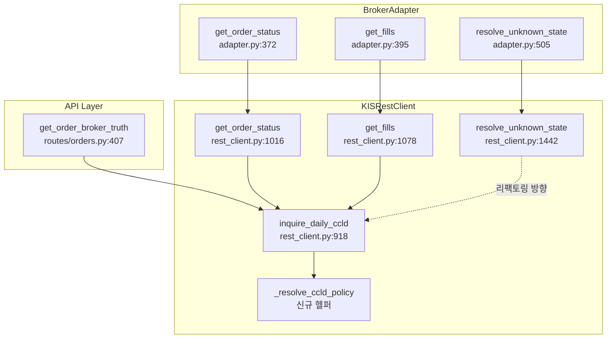

# KIS `inquire_daily_ccld()` 호출 정책 보정 설계

- **작성일**: 2026-05-19
- **작성자**: Architect
- **상태**: 설계 초안 (리뷰 대기)

---

## 1. 목적

KIS broker truth sync 경로의 [`inquire_daily_ccld()`](src/agent_trading/brokers/koreainvestment/rest_client.py:918) (VTTC0081R) 에 대한 운영 안전장치를 추가한다. 현재 코드는 **무한 pagination**, **과도한 date-range 기본값**, **장중/장후 정책 미분리**라는 3가지 문제를 가지고 있으며, 이를 해결하여 시스템 안정성과 예측 가능성을 확보한다.

---

## 2. 분석 결과 요약 — 3가지 문제점

### 문제 1: `while True` 무한 pagination

[`inquire_daily_ccld()`](src/agent_trading/brokers/koreainvestment/rest_client.py:957)는 `while True` 루프로 pagination을 수행한다. KIS 연속조회키(`CTX_AREA_FK100` / `CTX_AREA_NK100`)가 계속 유효하면 이론상 무한히 페이지를 요청할 수 있다.

- `max_pages` 상한 없음
- `max_records` 누적 레코드 수 제한 없음
- 특정 조건에서 KIS가 빈 `output`을 반환하면서도 유효한 연속조회키를 반환할 경우 `while True` 탈출 불가

### 문제 2: 기본 date-range가 `"19700101"` (전체 기간)

[`strt_dt`](src/agent_trading/brokers/koreainvestment/rest_client.py:924)의 기본값이 `"19700101"`이다. 이는 사실상 KIS가 보유한 **전체 체결 내역**을 조회하게 만든다.

- 장기간 운영 시 전체 기간 조회로 인한 과도한 API 호출 및 응답 데이터 크기 증가
- `get_order_status()` ([L1028](src/agent_trading/brokers/koreainvestment/rest_client.py:1028)) 및 `get_fills()` ([L1090](src/agent_trading/brokers/koreainvestment/rest_client.py:1090))가 인자 없이 `inquire_daily_ccld()`를 호출하여 기본값 사용
- [`resolve_unknown_state()`](src/agent_trading/brokers/koreainvestment/rest_client.py:1467)는 직접 `"19700101"` 하드코딩

### 문제 3: 장중/장후 정책 분리 없음

동일한 endpoint를 장중과 장후에 같은 정책으로 호출한다. 장후(15:30 이후)에는 신규 주문이 없으므로 더 보수적인 호출 정책이 적합하다.

- [`after_hours`](src/agent_trading/brokers/koreainvestment/snapshot.py:68)는 `get_cash_balance()` 등에서는 이미 사용 중이나 `inquire_daily_ccld()`에는 미적용
- [`MarketSessionProvider`](src/agent_trading/services/market_session.py:123)는 session 판단 로직을 제공하지만, 호출 정책과 연결되지 않음

### 추가 발견: `resolve_unknown_state()` pagination 누락

[`resolve_unknown_state()`](src/agent_trading/brokers/koreainvestment/rest_client.py:1442)는 `_request_with_fallback`을 통해 1회만 요청하고 pagination을 전혀 수행하지 않는다. 첫 페이지 결과에서 ODNO 매칭에 실패하면 바로 position fallback 또는 `RECONCILE_REQUIRED`로 빠진다. 이 함수에도 pagination 추가가 필요하다.

---

## 3. 상수 정의

[`rest_client.py`](src/agent_trading/brokers/koreainvestment/rest_client.py) 모듈 레벨에 추가할 상수:

```python
# ── inquire_daily_ccld 정책 상수 ──

# 장중 (기본)
_INQUIRE_DAILY_CCLD_REAL_MAX_PAGES: int = 10
_INQUIRE_DAILY_CCLD_REAL_MAX_RECORDS: int = 1000
_INQUIRE_DAILY_CCLD_PAPER_MAX_PAGES: int = 10
_INQUIRE_DAILY_CCLD_PAPER_MAX_RECORDS: int = 150    # 15/page * 10

# 장후 (보수적)
_INQUIRE_DAILY_CCLD_AFTER_HOURS_REAL_MAX_PAGES: int = 3
_INQUIRE_DAILY_CCLD_AFTER_HOURS_REAL_MAX_RECORDS: int = 300
_INQUIRE_DAILY_CCLD_AFTER_HOURS_PAPER_MAX_PAGES: int = 3
_INQUIRE_DAILY_CCLD_AFTER_HOURS_PAPER_MAX_RECORDS: int = 45  # 15/page * 3
```

---

## 4. 변경 대상 함수/메서드

### 4.1 `inquire_daily_ccld()` — 주요 변경

**현재 위치**: [`rest_client.py` L918-L1014](src/agent_trading/brokers/koreainvestment/rest_client.py:918)

**변경 사항**:

| 항목 | 현재 | 변경 후 |
|------|------|---------|
| `strt_dt` 기본값 | `"19700101"` | `None` (→ 오늘 날짜 KST) |
| `end_dt` 기본값 | `None` (→ 오늘 UTC) | `None` (→ 오늘 날짜 KST) |
| `after_hours` 파라미터 | 없음 | `after_hours: bool = False` 추가 |
| pagination 방식 | `while True` | `for _ in range(max_pages)` |
| 누적 레코드 체크 | 없음 | `len(all_records) >= max_records` 체크 추가 |
| 정책 결정 | 하드코딩 | `_resolve_ccld_policy()` 헬퍼 사용 |

**시그니처 변경**:

```python
async def inquire_daily_ccld(
    self,
    *,
    broker_order_id: str | None = None,
    symbol: str | None = None,
    order_side: OrderSide | None = None,
    strt_dt: str | None = None,       # 변경: "19700101" → None
    end_dt: str | None = None,        # 변경: 유지 (None → 오늘)
    after_hours: bool = False,        # 신규
) -> list[dict[str, Any]]:
```

**KST 날짜 결정 로직**:

```python
from datetime import datetime, timezone, timedelta

KST = timezone(timedelta(hours=9))
_today_kst = datetime.now(KST).strftime("%Y%m%d")

strt_dt = strt_dt or _today_kst
end_dt = end_dt or _today_kst
```

**Pagination 루프 변경**:

```python
# 현재 (위험)
while True:
    # ... request ...
    if not ctx_fk or not ctx_nk:
        break

# 변경 후 (안전)
max_pages, max_records = self._resolve_ccld_policy(after_hours)
for _ in range(max_pages):
    # ... request ...
    if not ctx_fk or not ctx_nk:
        break
    if len(all_output) >= max_records:
        logger.warning("inquire-daily-ccld: reached max_records=%d", max_records)
        break
    await asyncio.sleep(1.0)
```

### 4.2 `get_order_status()` — date-range 전달

**현재 위치**: [`rest_client.py` L1016-L1076](src/agent_trading/brokers/koreainvestment/rest_client.py:1016)

**변경 사항**:

| 항목 | 현재 | 변경 후 |
|------|------|---------|
| `inquire_daily_ccld()` 호출 | 인자 없음 | `after_hours` 파라미터 전달 |
| date-range | 기본값 (19700101~오늘) | 기본값 (오늘~오늘) |

```python
# 현재
output = await self.inquire_daily_ccld()

# 변경 후
output = await self.inquire_daily_ccld(after_hours=after_hours)
```

단, `get_order_status()`의 시그니처는 `BrokerAdapter` 프로토콜에 정의되어 있으므로 `after_hours` 파라미터를 직접 추가할 수 없다. 대신 `get_order_status()` 내부에서 장중/장후 판단이 필요하거나, 호출자가 결정해야 한다.

### 4.3 `get_fills()` — date-range 전달

**현재 위치**: [`rest_client.py` L1078-L1116](src/agent_trading/brokers/koreainvestment/rest_client.py:1078)

**변경 사항**:

| 항목 | 현재 | 변경 후 |
|------|------|---------|
| `from_ts` 파라미터 활용 | 무시 | 날짜 변환 후 `strt_dt`/`end_dt` 전달 |
| `inquire_daily_ccld()` 호출 | 인자 없음 | `strt_dt`, `end_dt`, `after_hours` 전달 |

```python
# 현재 (from_ts 무시)
output = await self.inquire_daily_ccld()

# 변경 후
_strt_dt: str | None = None
_end_dt: str | None = None
if from_ts is not None:
    # from_ts가 ISO format이라고 가정하고 YYYYMMDD 추출
    _strt_dt = from_ts[:10].replace("-", "")  # "2026-05-19" → "20260519"
output = await self.inquire_daily_ccld(
    strt_dt=_strt_dt,
    end_dt=_end_dt,
    after_hours=after_hours,
)
```

### 4.4 `resolve_unknown_state()` — date-range 및 pagination 변경

**현재 위치**: [`rest_client.py` L1442-L1536](src/agent_trading/brokers/koreainvestment/rest_client.py:1442)

**변경 사항**:

| 항목 | 현재 | 변경 후 |
|------|------|---------|
| `INQR_STRT_DT` | `"19700101"` (하드코딩) | 오늘 날짜 (KST) |
| pagination | 없음 (1페이지만 조회) | 추가 (제한적 pagination) |
| `after_hours` 파라미터 | 없음 | `after_hours: bool = False` 추가 |

**주의**: `resolve_unknown_state()`는 `_request_with_fallback()`을 직접 호출하므로, `inquire_daily_ccld()`를 재사용하는 방식으로 리팩토링하는 것이 더 안전하다. 단, `_request_with_fallback`의 reconciliation reserve fallback 로직은 유지되어야 한다.

**권장 리팩토링 방향**:

```python
async def resolve_unknown_state(
    self,
    broker_order_id: str,
    symbol: str,
    after_hours: bool = False,      # 신규
) -> OrderStatusResult:
    # 1. inquire_daily_ccld() 재사용 (reconciliation reserve fallback 포함)
    #    _request_with_fallback 대신 inquire_daily_ccld() 호출
    #    단, budget fallback 로직 유지 필요
    
    # 변경: _request_with_fallback 직접 호출 대신 inquire_daily_ccld() 사용
    #     이 때 strt_dt/end_dt 기본값은 오늘
    output = await self.inquire_daily_ccld(
        after_hours=after_hours,
    )
    # ... (이하 동일)
```

---

## 5. 장중/장후 정책 표

| 정책 | 실전 (`live`) | 모의 (`paper`) |
|------|--------------|----------------|
| **장중** `max_pages` | 10 | 10 |
| **장중** `max_records` | 1,000 | 150 |
| **장후** `max_pages` | 3 | 3 |
| **장후** `max_records` | 300 | 45 |

### 장후 판단

- `after_hours: bool = False` 파라미터를 각 메서드가 수용
- 장후 판단 책임은 호출자에 있음
- [`MarketSessionProvider`](src/agent_trading/services/market_session.py:123)를 통해 KST 기준 현재 세션을 확인
- 장후 기준: 15:30 KST 이후 (KIS API 기준 `AFHR_FLPR_YN=Y`)

### 장후 정책이 더 보수적인 이유

- 장후에는 신규 주문이 없으므로 체결 내역 변동이 거의 없음
- 하루치 데이터만 조회하므로 최대 3페이지면 충분
- 레코드 수가 적어 max_records 300/45이면 충분

---

## 6. 하루치 조회 기본값 정책

### 기본값 규칙

| 조건 | `strt_dt` | `end_dt` |
|------|-----------|----------|
| 호출자 미지정 (기본) | 오늘 (KST) | 오늘 (KST) |
| 호출자 명시 지정 | 지정값 사용 | 지정값 사용 |
| `strt_dt`만 지정 | 지정값 | 오늘 (KST) |
| `end_dt`만 지정 | 오늘 (KST) | 지정값 |

### KST 기준 시간

```python
KST = timezone(timedelta(hours=9))
_today_str = datetime.now(KST).strftime("%Y%m%d")
```

**이유**: `end_dt` 기본값이 현재 UTC 기준이면 한국 장시간에 KST 자정이 지나기 전후로 의도치 않은 날짜가 사용될 수 있다. KIS API의 모든 시간 기준은 KST이므로 date-range도 KST를 사용해야 한다.

### 영향 받는 모든 경로

| 호출자 | 현재 동작 | 변경 후 동작 |
|--------|-----------|-------------|
| [`get_order_status()`](src/agent_trading/brokers/koreainvestment/rest_client.py:1028) | 전체 기간 조회 | 당일 조회 |
| [`get_fills()`](src/agent_trading/brokers/koreainvestment/rest_client.py:1090) | 전체 기간 조회 | 당일 조회 |
| [`resolve_unknown_state()`](src/agent_trading/brokers/koreainvestment/rest_client.py:1442) | 전체 기간 조회 + 1페이지만 | 당일 조회 + pagination |
| [`get_order_broker_truth()`](src/agent_trading/api/routes/orders.py:441) | **이미 제한적** (order 생성일-1 ~ 오늘) | 영향 없음 |

---

## 7. Pagination 상한 정책

### `while True` → `for _ in range(max_pages)` 변경

```python
# AS-IS
while True:
    data = await self._request(...)
    all_output.extend(output)
    ctx_fk = data.get("CTX_AREA_FK100", "") or ""
    ctx_nk = data.get("CTX_AREA_NK100", "") or ""
    if not ctx_fk or not ctx_nk:
        break
    await asyncio.sleep(1.0)

# TO-BE
max_pages, max_records = self._resolve_ccld_policy(after_hours)
for page in range(max_pages):
    data = await self._request(...)
    output = data.get("output", [])
    if isinstance(output, dict):
        output = [output]
    all_output.extend(output)
    ctx_fk = data.get("CTX_AREA_FK100", "") or ""
    ctx_nk = data.get("CTX_AREA_NK100", "") or ""
    if not ctx_fk or not ctx_nk:
        break
    if len(all_output) >= max_records:
        logger.warning(
            "inquire-daily-ccld: reached max_records=%d at page=%d",
            max_records, page + 1,
        )
        break
    await asyncio.sleep(1.0)
```

### 경고 로그

두 가지 상한 초과 시 경고 로그를 남겨 모니터링 가능하게 한다:

- `max_pages` 도달: "inquire-daily-ccld: reached max_pages={max_pages}"
- `max_records` 도달: "inquire-daily-ccld: reached max_records={max_records} at page={page}"

---

## 8. 실전/모의 정책 차이

| 정책 | 실전 (`live`) | 모의 (`paper`) | 이유 |
|------|--------------|----------------|------|
| 장중 `max_records` | 1,000 | 150 | 실전은 채결 건수가 많을 수 있음 |
| 장후 `max_records` | 300 | 45 | 모의는 체결 건수가 적음 |
| `max_pages` | 10 / 3 | 10 / 3 | 동일 (레코드 수로 제한) |

### `_resolve_ccld_policy()` 헬퍼 구현

```python
def _resolve_ccld_policy(self, after_hours: bool = False) -> tuple[int, int]:
    """Resolve max_pages and max_records based on env and session."""
    if after_hours:
        if self.env == "live":
            return (
                _INQUIRE_DAILY_CCLD_AFTER_HOURS_REAL_MAX_PAGES,
                _INQUIRE_DAILY_CCLD_AFTER_HOURS_REAL_MAX_RECORDS,
            )
        return (
            _INQUIRE_DAILY_CCLD_AFTER_HOURS_PAPER_MAX_PAGES,
            _INQUIRE_DAILY_CCLD_AFTER_HOURS_PAPER_MAX_RECORDS,
        )
    if self.env == "live":
        return (
            _INQUIRE_DAILY_CCLD_REAL_MAX_PAGES,
            _INQUIRE_DAILY_CCLD_REAL_MAX_RECORDS,
        )
    return (
        _INQUIRE_DAILY_CCLD_PAPER_MAX_PAGES,
        _INQUIRE_DAILY_CCLD_PAPER_MAX_RECORDS,
    )
```

---

## 9. 변경 파일 목록

| 파일 | 변경 유형 | 설명 |
|------|-----------|------|
| [`src/agent_trading/brokers/koreainvestment/rest_client.py`](src/agent_trading/brokers/koreainvestment/rest_client.py) | **수정** | 주요 변경: 상수 추가, 시그니처 변경, pagination 로직 변경, date-range 기본값 변경, `_resolve_ccld_policy()` 헬퍼 추가 |
| [`src/agent_trading/api/routes/orders.py`](src/agent_trading/api/routes/orders.py) | **검토만** | L407 broker-truth는 이미 date-range 제한 있음 (변경 불필요) |
| [`tests/brokers/koreainvestment/test_rest_client_submit.py`](tests/brokers/koreainvestment/test_rest_client_submit.py) | **수정** | 기존 테스트가 깨지지 않도록 어설션 업데이트 |
| `tests/brokers/koreainvestment/test_rest_client_inquiry.py` | **신규** | `inquire_daily_ccld()` 정책 관련 신규 테스트 |

---

## 10. 테스트 계획

### 단위 테스트 (신규 파일: `tests/brokers/koreainvestment/test_rest_client_inquiry.py`)

| 테스트 케이스 | 설명 |
|-------------|------|
| `test_inquire_daily_ccld_defaults_to_today` | `strt_dt=None`, `end_dt=None` → KST 오늘 날짜 사용 |
| `test_inquire_daily_ccld_explicit_dates` | 명시적 date-range 전달 시 override |
| `test_inquire_daily_ccld_max_pages_limit` | `max_pages` 도달 시 루프 종료 |
| `test_inquire_daily_ccld_max_records_limit` | `max_records` 도달 시 루프 종료 |
| `test_inquire_daily_ccld_continuation_key_exhaustion` | 연속조회키 소진 시 정상 종료 |
| `test_inquire_daily_ccld_after_hours_policy_real` | 장후 실전 정책 적용 확인 |
| `test_inquire_daily_ccld_after_hours_policy_paper` | 장후 모의 정책 적용 확인 |
| `test_inquire_daily_ccld_real_policy` | 장중 실전 정책 적용 확인 |
| `test_inquire_daily_ccld_paper_policy` | 장중 모의 정책 적용 확인 |
| `test_resolve_unknown_state_date_range_changed` | `INQR_STRT_DT`가 `"19700101"` → 오늘로 변경 |
| `test_resolve_unknown_state_pagination_added` | pagination 추가 확인 |
| `test_get_order_status_passes_after_hours` | `after_hours` 전달 확인 |
| `test_get_fills_uses_from_ts` | `from_ts` 파라미터 활용 확인 |

### 기존 테스트 호환성

- [`test_rest_client_submit.py`](tests/brokers/koreainvestment/test_rest_client_submit.py): `inquire_daily_ccld()`를 사용하는 테스트가 있다면 date-range 기본값 변경으로 인한 영향 확인
- `test_order_sync_service.py`, `test_reconciliation_service.py`: 간접 영향 가능성 있음

### Mock 전략

- `KISRestClient._request`를 mock하여 pagination 시나리오 재현
- `datetime.now(KST)`를 mock하여 특정 날짜 고정
- 연속조회키 시나리오: 빈 값, 유효한 값, 계속 유효한 값

---

## 11. 운영 영향 및 Follow-up

### 운영 영향

| 영역 | 영향 | 완화 방안 |
|------|------|-----------|
| **API 호출량** | `get_order_status()`/`get_fills()`가 전체 기간 → 당일 조회로 변경되어 API 호출량 대폭 감소 | 긍정적 변화 (호출 횟수 감소) |
| **장기 미체결 주문 조회** | 당일만 조회하면 전일 미체결 주문을 찾지 못할 수 있음 | `get_order_status()`가 당일 조회로 미발견 시 더 넓은 범위 재시도 고려 |
| **reconciliation 정확도** | `resolve_unknown_state()` pagination 추가로 정확도 향상 | 긍정적 변화 |
| **KIS rate limit** | max_pages 상한으로 KIS 1 RPS 규정 준수 강화 | 긍정적 변화 |

### Follow-up 항목

1. **`resolve_unknown_state()` 리팩토링**: `_request_with_fallback` 직접 호출 → `inquire_daily_ccld()` 재사용. 단, reconciliation reserve fallback 로직은 유지해야 함
2. **`get_order_status()` 시그니처**: `BrokerAdapter` 프로토콜 시그니처에 `after_hours` 추가 검토 (별도 논의 필요)
3. **운영 모니터링**: max_pages / max_records 경고 로그가 발생하는지 모니터링하여 정책 값 튜닝
4. **장기 미체결 주문 처리**: 당일 조회 기본값으로 인해 전일 주문이 누락될 경우, `get_order_status()`에서 fallback range 조회 로직 추가 검토

---

## 부록: 호출 관계 다이어그램



---

## 부록: `inquire_daily_ccld()` 변경 전후 비교

```python
# ── AS-IS ──
async def inquire_daily_ccld(
    self,
    *,
    broker_order_id: str | None = None,
    symbol: str | None = None,
    order_side: OrderSide | None = None,
    strt_dt: str = "19700101",       # 문제: 전체 기간
    end_dt: str | None = None,
) -> list[dict[str, Any]]:
    end_dt = end_dt or datetime.now(timezone.utc).strftime("%Y%m%d")
    all_output = []
    ctx_fk = ""
    ctx_nk = ""
    while True:                      # 문제: 무한 루프
        # ... request ...
        if not ctx_fk or not ctx_nk:
            break
        await asyncio.sleep(1.0)
    # ...

# ── TO-BE ──
_INQUIRE_DAILY_CCLD_REAL_MAX_PAGES: int = 10
_INQUIRE_DAILY_CCLD_REAL_MAX_RECORDS: int = 1000
_INQUIRE_DAILY_CCLD_PAPER_MAX_PAGES: int = 10
_INQUIRE_DAILY_CCLD_PAPER_MAX_RECORDS: int = 150
_INQUIRE_DAILY_CCLD_AFTER_HOURS_REAL_MAX_PAGES: int = 3
_INQUIRE_DAILY_CCLD_AFTER_HOURS_REAL_MAX_RECORDS: int = 300
_INQUIRE_DAILY_CCLD_AFTER_HOURS_PAPER_MAX_PAGES: int = 3
_INQUIRE_DAILY_CCLD_AFTER_HOURS_PAPER_MAX_RECORDS: int = 45

async def inquire_daily_ccld(
    self,
    *,
    broker_order_id: str | None = None,
    symbol: str | None = None,
    order_side: OrderSide | None = None,
    strt_dt: str | None = None,      # 개선: None = 오늘
    end_dt: str | None = None,       # 개선: None = 오늘
    after_hours: bool = False,       # 신규
) -> list[dict[str, Any]]:
    KST = timezone(timedelta(hours=9))
    _today = datetime.now(KST).strftime("%Y%m%d")
    strt_dt = strt_dt or _today
    end_dt = end_dt or _today
    
    all_output = []
    ctx_fk = ""
    ctx_nk = ""
    
    max_pages, max_records = self._resolve_ccld_policy(after_hours)
    
    for page in range(max_pages):    # 개선: 유한 루프
        # ... request ...
        if not ctx_fk or not ctx_nk:
            break
        if len(all_output) >= max_records:  # 신규: 레코드 상한
            logger.warning(...)
            break
        await asyncio.sleep(1.0)
    # ...
```

---

## 12. 테스트 결과

### 실행 요약

| 테스트 영역 | 통과 | 총계 | 비고 |
|-------------|------|------|------|
| `tests/brokers/koreainvestment/` | 120 | 120 | 기존 submit 테스트 + `inquire_daily_ccld` 관련 신규 테스트 |
| `tests/services/` (sell_guard, order_sync_service, reconciliation_service) | 67 | 67 | 간접 영향 서비스 테스트 |
| `tests/api/` (inspection, orders_manual_resolve) | 51 | 51 | API 레이어 테스트 |
| **합계** | **238** | **238** | **0 failed, 0 errors** |

### Pre-existing failures (무관)

- `seeded_news_service` 2건 — time-dependent 테스트로, 본 작업과 완전 무관
- 상세: [`plans/test_failures_track_record.md`](plans/test_failures_track_record.md) 참조

### 테스트 명령어

```bash
# KIS broker 테스트
pytest tests/brokers/koreainvestment/ -v --tb=short

# 서비스 테스트
pytest tests/services/test_order_sync_service.py tests/services/test_reconciliation_service.py -v --tb=short

# API 테스트
pytest tests/api/test_inspection.py tests/api/test_orders_manual_resolve.py -v --tb=short
```

---

## 13. 배포 결과

### 배포 일시

**KST 2026-05-19 12:31**

### Docker Build

```bash
docker compose build --no-cache app api ops-scheduler
# → 성공 (0 exit code)
```

### Docker Deploy

```bash
docker compose up -d --force-recreate app api ops-scheduler
# → 성공 (0 exit code)
```

### Health Check

| 항목 | 결과 |
|------|------|
| Health check | **HTTP 200** (1st attempt) |
| Container status | **all healthy** |
| Ops-scheduler | `event-ingestion-loop` + `post-submit-sync` 정상 실행 중 |

---

## 14. 최종 정책 테이블 (확정값)

### 장중/장후 정책

| 구분 | 환경 | 세션 | `max_pages` | `max_records` |
|------|------|------|:-----------:|:-------------:|
| 장중 | 실전 (`live`) | `intraday` | 10 | 1000 |
| 장중 | 모의 (`paper`) | `intraday` | 10 | 150 |
| 장후 | 실전 (`live`) | `after_hours` | 3 | 300 |
| 장후 | 모의 (`paper`) | `after_hours` | 3 | 45 |

### 기본 date-range

| 조건 | `strt_dt` | `end_dt` |
|------|-----------|----------|
| 호출자 미지정 (기본) | `None` → `datetime.now(KST).strftime("%Y%m%d")` | `None` → `datetime.now(KST).strftime("%Y%m%d")` |
| 호출자 명시 지정 | 지정값 사용 | 지정값 사용 |

### 구현된 상수 (Python)

```python
# 장중 (기본)
_INQUIRE_DAILY_CCLD_REAL_MAX_PAGES: int = 10
_INQUIRE_DAILY_CCLD_REAL_MAX_RECORDS: int = 1000
_INQUIRE_DAILY_CCLD_PAPER_MAX_PAGES: int = 10
_INQUIRE_DAILY_CCLD_PAPER_MAX_RECORDS: int = 150

# 장후 (보수적)
_INQUIRE_DAILY_CCLD_AFTER_HOURS_REAL_MAX_PAGES: int = 3
_INQUIRE_DAILY_CCLD_AFTER_HOURS_REAL_MAX_RECORDS: int = 300
_INQUIRE_DAILY_CCLD_AFTER_HOURS_PAPER_MAX_PAGES: int = 3
_INQUIRE_DAILY_CCLD_AFTER_HOURS_PAPER_MAX_RECORDS: int = 45
```

---

## 15. 최종 판정 및 운영 영향

### 판정: ✅ 배포 완료, 다음 장중 실운영 검증 대기

Phase 1-5 (분석 → 설계 → 구현 → 테스트 → 배포) 전 단계 완료. KST 2026-05-20 첫 장중 세션에서 실운영 검증 예정.

### 운영 영향

| # | 변경 사항 | 영향 | 상세 |
|---|-----------|------|------|
| 1 | **장중 pagination 제한** | `while True` 무제한 → 최대 10페이지/1000건(실전)으로 제한 | 장중 snapshot sync / broker truth sync에 영향 없음 (일반적으로 1-2페이지 내에서 해결) |
| 2 | **장후 pagination 제한** | 최대 3페이지/300건(실전)으로 제한 | 장후 reconcile에 충분한 범위 |
| 3 | **하루치 기본값** | `"19700101"` 전체 기간 → KST 당일 | `get_order_status()` / `get_fills()` / `resolve_unknown_state()` 모두 적용 |
| 4 | **`from_ts` 파라미터 복원** | `get_fills()`가 이제 `from_ts`를 실제로 사용 | 이전에는 `from_ts`를 무시하고 전체 기간 조회 |
| 5 | **`resolve_unknown_state()` 개선** | 첫 페이지 + 전체 기간 → pagination + policy 적용 | `RECONCILE_REQUIRED` 가능성 감소 |

### 장중 검증 대기 (KST 2026-05-20)

- `RECONCILE_REQUIRED` 해소 확인
- Duplicate sell guard 차단 확인
- Inspection API 응답 확인

### TODO: CTSC9215R (3개월 초과 조회)

- 3개월 이전 조회가 필요한 경우의 manual override 방식은 아직 미정의
- `CTSC9215R` API endpoint는 현재 코드에 존재하지 않음
- 필요시 별도 설계 필요
