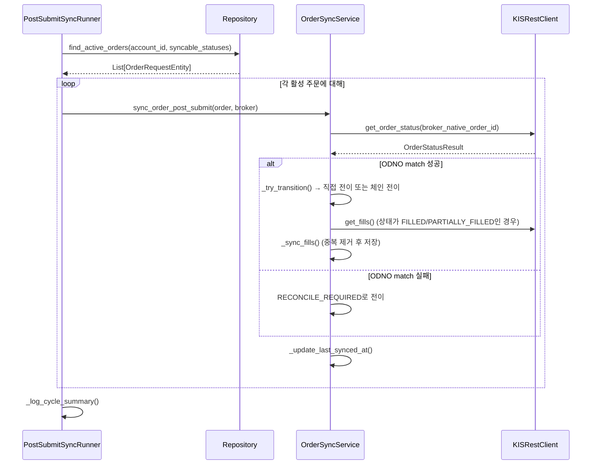
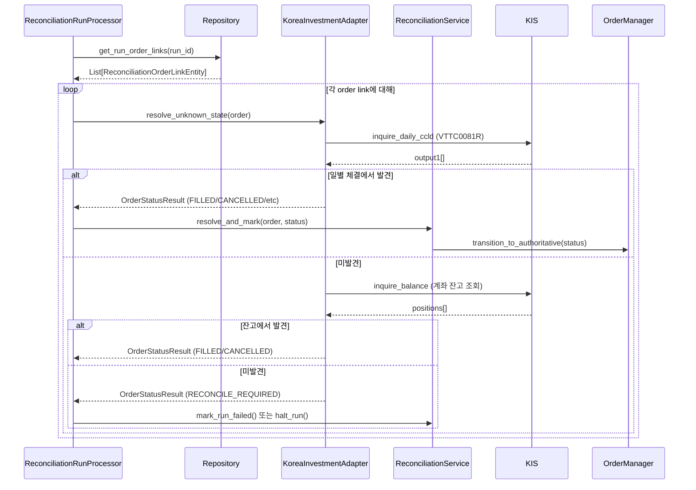
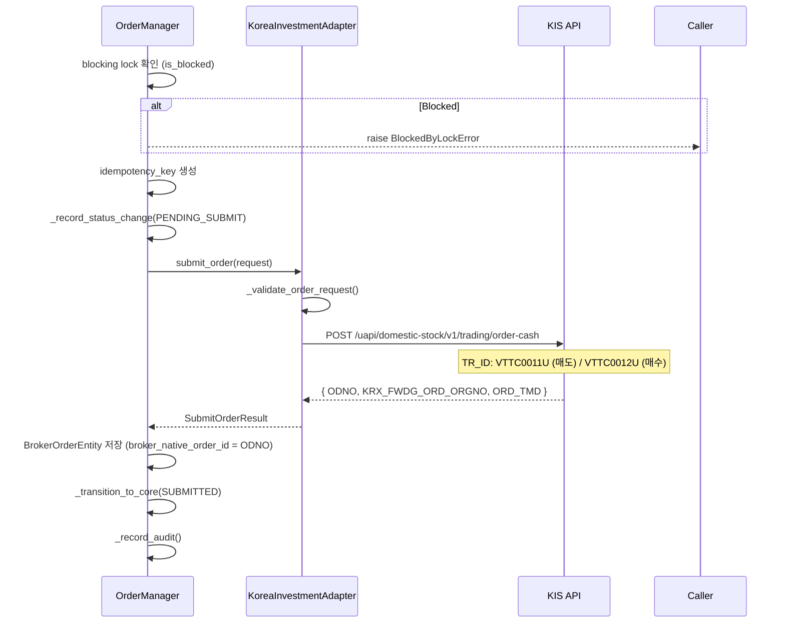
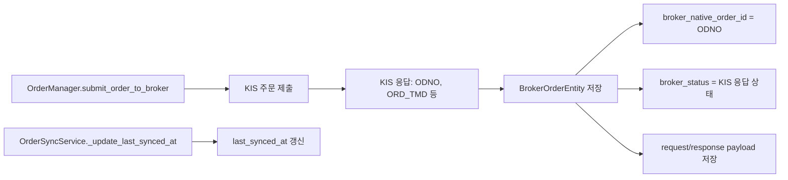
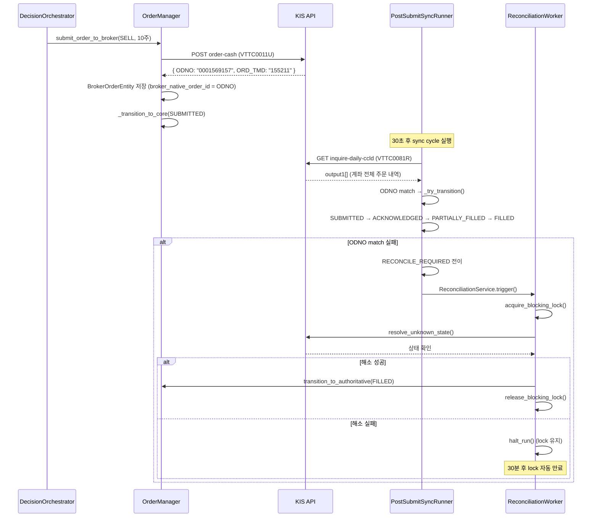
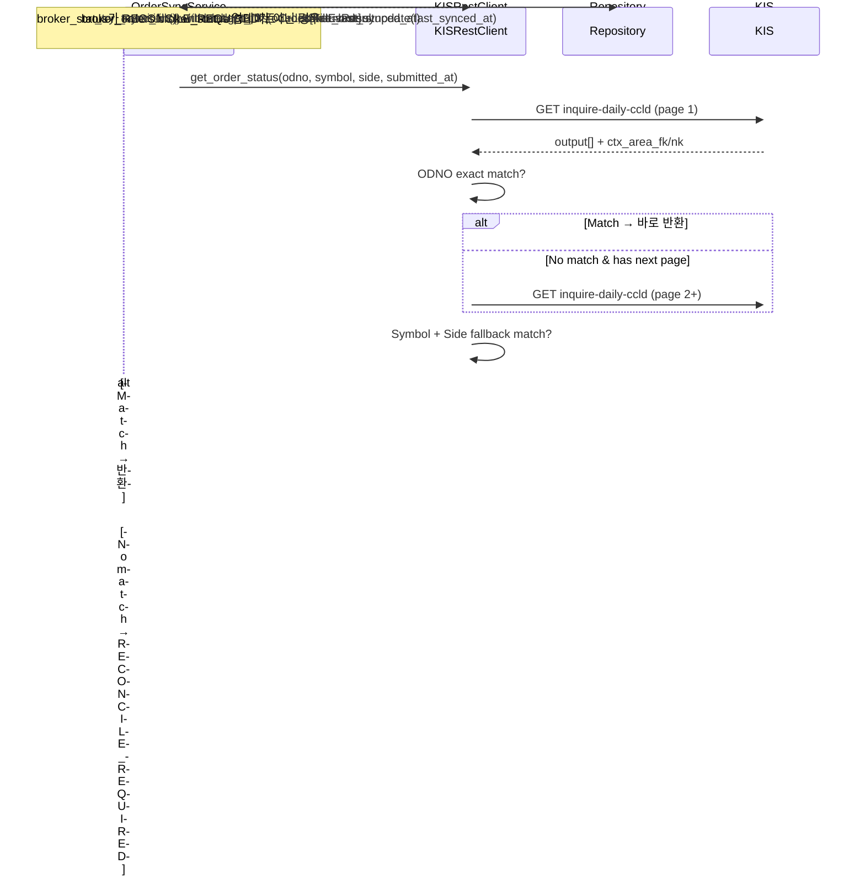
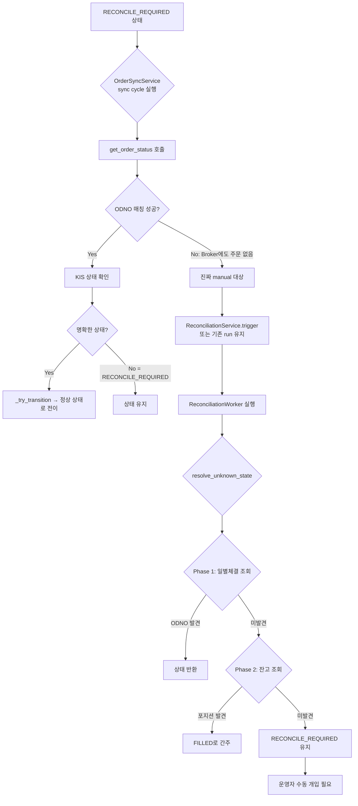

# KIS Broker Truth Sync + Duplicate Sell Guard 분석 보고서

> **작성일**: 2026-05-19  
> **대상 시스템**: [`agent_trading`](../src/agent_trading) — KIS (한국투자증권) broker truth sync 및 중복 매도 방지 시스템  
> **분석 범위**: `post_submit_sync` 루프, `OrderSyncService`, `ReconciliationService`, `OrderManager`, `KISRestClient`, `KoreaInvestmentAdapter`, `DecisionOrchestratorService`

---

## 목차

1. [post_submit_sync 루프 개요](#1-post_submit_sync-루프-개요)
2. [ODNO match FAILED 발생 위치 및 원인](#2-odno-match-failed-발생-위치-및-원인)
3. [reconcile_required 상태 지속 원인](#3-reconcile_required-상태-지속-원인)
4. [Sell Submit 경로 및 수량 계산](#4-sell-submit-경로-및-수량-계산)
5. [VTTC0081R / VTSC9215R API 호출 위치 및 필드 매핑](#5-vttc0081r--vtsc9215r-api-호출-위치-및-필드-매핑)
6. [broker_orders / fill_events 테이블 저장 데이터 및 채우기 경로](#6-broker_orders--fill_events-테이블-저장-데이터-및-채우기-경로)
7. [중복 매도 방지 (Duplicate Sell Guard)](#7-중복-매도-방지-duplicate-sell-guard)
8. [전체 흐름도](#8-전체-흐름도)
9. [KIS Daily Order Truth Sync 설계](#9-kis-daily-order-truth-sync-설계)
10. [중복 매도 방지 Guard 설계](#10-중복-매도-방지-guard-설계)
11. [reconcile_required 해소 정책](#11-reconcile_required-해소-정책)
12. [Inspection API 설계](#12-inspection-api-설계)
13. [변경 파일 목록](#13-변경-파일-목록)
14. [테스트 계획](#14-테스트-계획)
15. [구현 요약 (Phase A~D)](#15-구현-요약-phase-ad)
16. [테스트 결과](#16-테스트-결과)
17. [변경 파일 목록 (최종)](#17-변경-파일-목록-최종)
18. [Docker 배포 가이드](#18-docker-배포-가이드)

---

## 1. post_submit_sync 루프 개요

### 1.1 진입점

[`scripts/run_post_submit_sync_loop.py`](../scripts/run_post_submit_sync_loop.py) — 30초 간격으로 실행되는 스케줄러.

```
run_post_submit_sync_loop.py
  └─ main()
       └─ _run_loop()
            └─ _run_one_cycle()  ← 30초마다 호출 (기본값)
                 └─ PostSubmitSyncRunner.run_sync_cycle()
```

### 1.2 PostSubmitSyncRunner

[`src/agent_trading/services/order_sync_service.py:547`](../src/agent_trading/services/order_sync_service.py:547) — `PostSubmitSyncRunner`는 배치 실행기로, 활성 주문을 발견하고 각각을 동기화합니다.

**동기화 대상 상태** (`_SYNCABLE_STATUSES`, line 27):
- `SUBMITTED`
- `ACKNOWLEDGED`
- `PARTIALLY_FILLED`
- `RECONCILE_REQUIRED`

**제외 대상 (터미널 상태)** (`_TERMINAL_STATUSES`, line 37):
- `FILLED`, `CANCELLED`, `REJECTED`, `EXPIRED`

### 1.3 Sync Cycle 흐름



### 1.4 체인 전이 (Chain Transition)

[`_try_transition()`](../src/agent_trading/services/order_sync_service.py:284) — 직접 전이를 먼저 시도하고, 실패하면 체인 전이를 시도합니다.

[`_build_transition_chain()`](../src/agent_trading/services/order_sync_service.py:336) — 하드코딩된 전이 경로:

```python
# line 345-377
SUBMITTED → ACKNOWLEDGED → PARTIALLY_FILLED → FILLED
```

체인 전이는 중간 단계를 건너뛰지 않고 순차적으로 전이합니다. 예를 들어, 브로커에서 이미 `FILLED` 상태인 주문이 로컬에서 `SUBMITTED`인 경우:
1. `SUBMITTED → ACKNOWLEDGED` (직접 전이)
2. `ACKNOWLEDGED → PARTIALLY_FILLED` (직접 전이)
3. `PARTIALLY_FILLED → FILLED` (직접 전이)

---

## 2. ODNO match FAILED 발생 위치 및 원인

### 2.1 발생 위치

[`src/agent_trading/brokers/koreainvestment/rest_client.py:906`](../src/agent_trading/brokers/koreainvestment/rest_client.py:906)

```python
# line 842-921
async def get_order_status(self, broker_native_order_id: str, ...) -> OrderStatusResult:
    data = await self._request_with_fallback(
        "inquire_daily_ccld",
        params={...},
        bucket=BudgetBucket.INQUIRY,
    )
    output: list[dict[str, Any]] = data.get("output1", []) or []
    
    # line 898-906: ODNO 매칭
    for item in output:
        if item.get("odno") == broker_native_order_id:
            matched = item
            break
    
    if matched is None:
        logger.warning("ODNO match FAILED for %s", broker_native_order_id)
        return OrderStatusResult(
            status=OrderStatus.RECONCILE_REQUIRED,
            raw_response=data,
        )
```

### 2.2 발생 원인

`inquire_daily_ccld` (VTTC0081R) API는 **계좌 전체**의 일별 주문/체결 내역을 반환합니다. 요청 시 `ODNO` 파라미터를 전달할 수 있지만, KIS API는 이 파라미터를 **필터로 사용하지 않고** 전체 결과를 반환합니다 (문서상 ODNO는 "N" optional). 따라서 클라이언트 측에서 응답 `output1` 배열을 순회하며 `odno` 필드와 `broker_native_order_id`를 매칭해야 합니다.

**ODNO match FAILED가 발생하는 조건**:

| 조건 | 설명 |
|------|------|
| **다른 계좌** | `CANO`/`ACNT_PRDT_CD`가 일치하지 않는 계좌로 조회 |
| **조회 기간 외** | `INQR_STRT_DT`~`INQR_END_DT` 범위에 주문이 포함되지 않음 |
| **API 결과 제한 초과** | 모의투자는 최대 15건, 실전은 100건 — pagination 필요 |
| **주문이 이미 정산/만료** | 일부 오래된 주문은 API에서 더 이상 반환되지 않음 |
| **네트워크/타이밍 이슈** | 주문 직후 조회 시 KIS 내부에 아직 반영되지 않음 |

### 2.3 get_fills()에서도 동일 패턴

[`get_fills()`](../src/agent_trading/brokers/koreainvestment/rest_client.py:923) — 동일한 `inquire_daily_ccld` 엔드포인트를 사용하며, `CCLD_QTY > 0` 조건으로 필터링한 후 ODNO 매칭을 수행합니다.

```python
# line 923-983
async def get_fills(self, broker_native_order_id: str, ...) -> Sequence[FillEvent]:
    data = await self._request_with_fallback(...)
    output = data.get("output1", []) or []
    
    for item in output:
        odno = item.get("odno")
        ccld_qty = Decimal(item.get("tot_ccld_qty", "0"))
        if odno == broker_native_order_id and ccld_qty > 0:
            # FillEvent 생성
            ...
```

---

## 3. reconcile_required 상태 지속 원인

### 3.1 상태 전이 정의

[`_ALLOWED_TRANSITIONS`](../src/agent_trading/services/order_manager.py:65) — `RECONCILE_REQUIRED`는 holding 상태로, 다음으로 전이 가능:

```python
# line 65-104
OrderStatus.RECONCILE_REQUIRED: {
    OrderStatus.SUBMITTED,
    OrderStatus.ACKNOWLEDGED,
    OrderStatus.PARTIALLY_FILLED,
    OrderStatus.FILLED,
    OrderStatus.CANCELLED,
    OrderStatus.REJECTED,
    OrderStatus.EXPIRED,
}
```

### 3.2 reconcile_required 진입 경로

```mermaid
flowchart TD
    A[get_order_status() 호출] --> B{ODNO match?}
    B -->|실패| C[RECONCILE_REQUIRED 반환]
    B -->|성공| D[_parse_order_status_item()]
    D --> E{상태 판별}
    E -->|CCLD_QTY >= ORD_QTY| F[FILLED]
    E -->|CCLD_QTY > 0| G[PARTIALLY_FILLED]
    E -->|CNCL_YN == Y| H[CANCELLED]
    E -->|RVSE_YN == Y| H
    E -->|기본값| I[SUBMITTED]
    
    C --> J[OrderSyncService._try_transition]
    J --> K[RECONCILE_REQUIRED로 전이]
    K --> L[ReconciliationService.trigger() 호출]
    L --> M[blocking lock 획득]
```

### 3.3 reconcile_required가 해소되지 않는 시나리오

| 시나리오 | 설명 | 해소 조건 |
|----------|------|-----------|
| **ODNO 지속적 미매칭** | 브로커 API가 계속 해당 ODNO를 반환하지 않음 | 수동 개입 또는 브로커 측 확인 |
| **Blocking lock 미해제** | `reconciliation_run`이 `halted` 상태로 종료되어 lock이 해제되지 않음 | lock 자동 만료 (30분) 또는 수동 해제 |
| **Reconciliation worker 실패** | 어댑터 생성 실패, broker inquiry 실패 등 | 재시도 또는 수동 개입 |
| **resolve_unknown_state() 실패** | 일별 체결 조회 + 잔고 조회 모두에서 주문을 찾지 못함 | 수동 resolve |
| **낙관적 락 충돌** | 동시성 이슈로 `_transition_to_core()`의 `version` 체크 실패 | 재시도 |

### 3.4 Reconciliation Worker 흐름

[`src/agent_trading/services/reconciliation_worker.py`](../src/agent_trading/services/reconciliation_worker.py:42) — `ReconciliationRunProcessor`가 reconciliation run을 처리:



### 3.5 resolve_and_mark() - Plan 35 반영

[`ReconciliationService.resolve_and_mark()`](../src/agent_trading/services/reconciliation_service.py:582) — 브로커 진실 조회 후 authoritative reflection 수행:

1. 브로커에서 상태 조회 (`resolve_unknown_state`)
2. `OrderManager.transition_to_authoritative()` 호출 — **validation SKIP**
3. Reconciliation run을 `completed`로 마크
4. Blocking lock 해제

---

## 4. Sell Submit 경로 및 수량 계산

### 4.1 전체 흐름

```mermaid
flowchart LR
    A[DecisionOrchestratorService<br/>assemble_and_submit] --> B[Phase 1: assemble]
    B --> C[Phase 1.5: Sizing Engine]
    C --> D[Phase 2: Validate Intent]
    D --> E[Phase 3: OrderManager.create_order]
    E --> F[Phase 4a/b: DRAFT→VALIDATED→PENDING_SUBMIT]
    F --> G[Phase 4c: Stale Snapshot Guard]
    G --> H[Phase 5: submit_order_to_broker]
    H --> I[Phase 5.5: Post-submit sync<br/>fire-and-forget]
```



### 4.2 assemble_and_submit() - Phase 1.5: Sizing Engine

[`DecisionOrchestratorService.assemble_and_submit()`](../src/agent_trading/services/decision_orchestrator.py:716) — 라인 824-834에서 sell 수량 fallback:

```python
# line 824-834 (approximate)
if intent.side == OrderSide.SELL:
    sized = await sizing_engine.calculate(intent)
    if sized.quantity == 0:
        # Fallback: AI가 요청한 수량 사용
        logger.warning(
            "Sizing returned 0 for SELL %s — falling back to request quantity %s",
            intent.symbol, intent.quantity,
        )
        sized.quantity = intent.quantity
```

**Sell 수량 계산 로직**:
1. `SizingEngine`이 포지션, 현금, 리스크 한도를 고려하여 최대 매도 가능 수량 계산
2. 계산 결과가 0이면 → AI 요청 수량으로 fallback
3. 이 fallback은 **SELL 주문에만** 적용됨 (BUY는 sizing 결과를 그대로 사용)

### 4.3 build_submit_order_request_from_decision()

[`build_submit_order_request_from_decision()`](../src/agent_trading/services/decision_orchestrator.py:2491) — OrderIntent를 KIS `SubmitOrderRequest`로 변환:

```python
# line 2491-2585
def build_submit_order_request_from_decision(
    intent: OrderIntent,
    account_ref: str,
) -> SubmitOrderRequest:
    return SubmitOrderRequest(
        broker="koreainvestment",
        account_ref=account_ref,
        side=intent.side,           # OrderSide.SELL
        symbol=intent.symbol,
        quantity=intent.quantity,    # sizing 결과 (또는 fallback)
        price=intent.entry_price,
        order_type=intent.order_type,
        time_in_force=intent.time_in_force,
    )
```

### 4.4 OrderManager.submit_order_to_broker()

[`OrderManager.submit_order_to_broker()`](../src/agent_trading/services/order_manager.py:346) — 실제 브로커 제출:



### 4.5 KIS 주문 API 매핑

| KIS API | TR ID (모의) | 용도 | Request Body 필드 |
|---------|-------------|------|-------------------|
| [`order-cash`](../reference_docs/kis_openapi_full_20260503_markdown/020_주식주문(현금).md) | `VTTC0011U` (매도) / `VTTC0012U` (매수) | 현금 주문 제출 | `CANO`, `ACNT_PRDT_CD`, `PDNO`, `ORD_DVSN`, `ORD_QTY`, `ORD_UNPR` |

---

## 5. VTTC0081R / VTSC9215R API 호출 위치 및 필드 매핑

### 5.1 API 개요

[`reference_docs/kis_openapi_full_20260503_markdown/022_주식일별주문체결조회.md`](../reference_docs/kis_openapi_full_20260503_markdown/022_주식일별주문체결조회.md)

| 항목 | 값 |
|------|-----|
| **API명** | 주식일별주문체결조회 (inquire-daily-ccld) |
| **실전 TR_ID** | `TTTC0081R` (3개월 이내) / `CTSC9215R` (3개월 이전) |
| **모의 TR_ID** | `VTTC0081R` (3개월 이내) / `VTSC9215R` (3개월 이전) |
| **HTTP Method** | `GET` |
| **URL** | `/uapi/domestic-stock/v1/trading/inquire-daily-ccld` |
| **최대 결과** | 실전 100건, 모의 15건 (연속조회 필요시 `CTX_AREA_FK100`/`CTX_AREA_NK100`) |

### 5.2 TR ID 매핑 (코드)

[`KIS_TR_IDS`](../src/agent_trading/brokers/koreainvestment/rest_client.py:79):

```python
KIS_TR_IDS: Mapping[str, tuple[str, str]] = {
    "inquire_daily_ccld": ("TTTC0081R", "VTTC0081R"),
    # ...
}
```

[`_get_tr_id()`](../src/agent_trading/brokers/koreainvestment/rest_client.py:496) — 환경(paper/live)에 따라 적절한 TR ID 선택:

```python
def _get_tr_id(self, key: str) -> str:
    tr_ids = KIS_TR_IDS[key]
    return tr_ids[0] if self._env == "live" else tr_ids[1]
```

### 5.3 호출 위치

| 메서드 | 파일:라인 | 용도 |
|--------|----------|------|
| [`get_order_status()`](../src/agent_trading/brokers/koreainvestment/rest_client.py:842) | `rest_client.py:842` | 주문 상태 조회 (post_submit_sync) |
| [`get_fills()`](../src/agent_trading/brokers/koreainvestment/rest_client.py:923) | `rest_client.py:923` | 체결 내역 조회 |
| [`resolve_unknown_state()`](../src/agent_trading/brokers/koreainvestment/rest_client.py:1309) | `rest_client.py:1309` | 미확인 상태 해소 (reconciliation) |

### 5.4 KIS 응답 → 내부 모델 필드 매핑

#### OrderStatus 매핑 ([`_parse_order_status_item()`](../src/agent_trading/brokers/koreainvestment/rest_client.py:1471))

| KIS 필드 | 조건 | 내부 OrderStatus |
|----------|------|-----------------|
| `tot_ccld_qty >= ord_qty` | 체결수량 >= 주문수량 | `FILLED` |
| `tot_ccld_qty > 0` | 부분 체결 | `PARTIALLY_FILLED` |
| `cncl_yn == "Y"` | 취소 | `CANCELLED` |
| `rvse_yn == "Y"` | 정정 | `CANCELLED` |
| 기본값 | 그 외 | `SUBMITTED` |

#### FillEvent 매핑 ([`get_fills()`](../src/agent_trading/brokers/koreainvestment/rest_client.py:923))

| KIS 필드 | 내부 FillEvent 필드 | 비고 |
|----------|-------------------|------|
| `odno` | `broker_fill_id` | 주문번호를 fill ID로 사용 |
| `ord_dt` + `ord_tmd` | `fill_timestamp` | 날짜 + 시간 결합 |
| `avg_prvs` | `fill_price` | 평균가 |
| `tot_ccld_qty` | `fill_quantity` | 총 체결수량 |
| - | `source_channel` | 항상 `"rest_poll"` |

### 5.5 resolve_unknown_state() - 2단계 조회

[`resolve_unknown_state()`](../src/agent_trading/brokers/koreainvestment/rest_client.py:1309):

```mermaid
flowchart TD
    A[resolve_unknown_state] --> B[Phase 1: inquire_daily_ccld]
    B --> C{ODNO found?}
    C -->|Yes| D[_parse_order_status_item() → 상태 반환]
    C -->|No| E[Phase 2: inquire_balance]
    E --> F{Position found?}
    F -->|Yes| G[FILLED로 간주]
    F -->|No| H[RECONCILE_REQUIRED 반환]
```

---

## 6. broker_orders / fill_events 테이블 저장 데이터 및 채우기 경로

### 6.1 broker_orders 테이블

**DDL** ([`db/migrations/0001_initial_schema.sql:332`](../db/migrations/0001_initial_schema.sql:332):

```sql
CREATE TABLE trading.broker_orders (
    broker_order_id       UUID PRIMARY KEY DEFAULT gen_random_uuid(),
    order_request_id      UUID NOT NULL REFERENCES trading.order_requests (order_request_id),
    broker_name           VARCHAR(64) NOT NULL,
    broker_native_order_id VARCHAR(128),       -- KIS ODNO (주문번호)
    broker_status         VARCHAR(64) NOT NULL, -- KIS 원본 상태 문자열
    request_payload_uri   TEXT,                 -- 제출 요청 JSON (URI)
    response_payload_uri  TEXT,                 -- 제출 응답 JSON (URI)
    last_synced_at        TIMESTAMPTZ,          -- 마지막 동기화 시간
    created_at            TIMESTAMPTZ NOT NULL DEFAULT NOW(),
    updated_at            TIMESTAMPTZ NOT NULL DEFAULT NOW(),
    CONSTRAINT uq_broker_orders_native UNIQUE (broker_name, broker_native_order_id)
);
```

**저장 데이터**:

| 컬럼 | 저장 내용 | 출처 |
|------|----------|------|
| `broker_order_id` | 내부 UUID | 자동 생성 |
| `order_request_id` | 연결된 order_request FK | `OrderManager.submit_order_to_broker()` |
| `broker_name` | `"koreainvestment"` | 고정 |
| `broker_native_order_id` | KIS `ODNO` (주문번호, 10자리) | KIS 주문 응답 |
| `broker_status` | KIS 원본 상태 문자열 | KIS 응답 또는 동기화 |
| `request_payload_uri` | 제출 요청 JSON 파일 경로 | `OrderManager.submit_order_to_broker()` |
| `response_payload_uri` | 제출 응답 JSON 파일 경로 | `OrderManager.submit_order_to_broker()` |
| `last_synced_at` | 마지막 동기화 시각 | `OrderSyncService._update_last_synced_at()` |

**채우기 경로**:



### 6.2 fill_events 테이블

**DDL** ([`db/migrations/0001_initial_schema.sql:346`](../db/migrations/0001_initial_schema.sql:346):

```sql
CREATE TABLE trading.fill_events (
    fill_event_id      UUID PRIMARY KEY DEFAULT gen_random_uuid(),
    broker_order_id    UUID NOT NULL REFERENCES trading.broker_orders (broker_order_id),
    broker_fill_id     VARCHAR(128),               -- KIS ODNO (주문번호)
    fill_timestamp     TIMESTAMPTZ NOT NULL,        -- 체결 시각
    fill_price         NUMERIC(20, 8) NOT NULL,     -- 체결 가격
    fill_quantity      NUMERIC(24, 8) NOT NULL,     -- 체결 수량
    fill_fee           NUMERIC(20, 8),              -- 수수료
    fill_tax           NUMERIC(20, 8),              -- 제세금
    source_channel     VARCHAR(32) NOT NULL,         -- 'rest_poll' | 'websocket' | 'backfill' | 'manual'
    raw_payload_uri    TEXT,                         -- 원본 응답 JSON (URI)
    created_at         TIMESTAMPTZ NOT NULL DEFAULT NOW(),
    CONSTRAINT uq_fill_events_native UNIQUE (broker_order_id, broker_fill_id),
    CONSTRAINT ck_fill_events_quantity CHECK (fill_quantity > 0)
);
```

**저장 데이터**:

| 컬럼 | 저장 내용 | 출처 |
|------|----------|------|
| `fill_event_id` | 내부 UUID | 자동 생성 |
| `broker_order_id` | 연결된 broker_order FK | `_sync_fills()` |
| `broker_fill_id` | KIS `ODNO` (주문번호) | KIS `inquire_daily_ccld` 응답 |
| `fill_timestamp` | 체결 시각 (`ord_dt` + `ord_tmd`) | KIS 응답 |
| `fill_price` | 체결 가격 (`avg_prvs`) | KIS 응답 |
| `fill_quantity` | 체결 수량 (`tot_ccld_qty`) | KIS 응답 |
| `fill_fee` | 수수료 | 현재는 항상 `None` |
| `fill_tax` | 제세금 | 현재는 항상 `None` |
| `source_channel` | `"rest_poll"` (동기화) 또는 `"websocket"` | 고정 |
| `raw_payload_uri` | 원본 응답 JSON 파일 경로 | `_sync_fills()` |

**채우기 경로** ([`_sync_fills()`](../src/agent_trading/services/order_sync_service.py:379):

```mermaid
flowchart TD
    A[_sync_fills] --> B[broker.get_fills(broker_native_order_id)]
    B --> C[KIS inquire_daily_ccld]
    C --> D[FillEvent 리스트]
    D --> E[중복 제거]
    E --> F{broker_fill_id 존재?}
    F -->|Yes| G[broker_fill_id로 중복 체크]
    F -->|No| H[composite key로 중복 체크<br/>broker_order_id + fill_timestamp + fill_price + fill_quantity]
    G --> I{중복?}
    H --> I
    I -->|신규| J[fill_events INSERT]
    I -->|기존| K[SKIP]
    J --> L[raw_payload 저장]
```

**중복 제거 전략** ([`src/agent_trading/brokers/dedup.py`](../src/agent_trading/brokers/dedup.py):

1. **1차**: `broker_fill_id` (ODNO) — authoritative key
2. **2차**: `(broker_order_id, fill_timestamp, fill_price, fill_quantity)` — composite fallback

---

## 7. 중복 매도 방지 (Duplicate Sell Guard)

### 7.1 방어 계층

```mermaid
flowchart TD
    subgraph Layer1 [Layer 1: Idempotency Key]
        A[client_order_id UUID] --> B[DB UNIQUE constraint]
        C[idempotency_key] --> B
    end
    
    subgraph Layer2 [Layer 2: State Machine]
        D[OrderStatus.SUBMITTED] --> E[ACKNOWLEDGED]
        E --> F[PARTIALLY_FILLED]
        F --> G[FILLED]
        H[RECONCILE_REQUIRED] --> D
        H --> E
        H --> F
        H --> G
    end
    
    subgraph Layer3 [Layer 3: Blocking Lock]
        I[account_id + strategy_id + symbol + side] --> J[order_blocking_locks]
        J --> K[expires_at: 30분]
        J --> L[locked_by_run_id]
    end
    
    subgraph Layer4 [Layer 4: Sizing Engine]
        M[SizingEngine.calculate] --> N{SELL?}
        N -->|Yes| O[포지션 수량 확인]
        O --> P[최대 매도 가능 수량 계산]
        P --> Q[0이면 fallback]
    end
```



### 7.2 Layer 1: Idempotency Key

[`OrderManager._generate_idempotency_key()`](../src/agent_trading/services/order_manager.py:830):

```python
@staticmethod
def _generate_idempotency_key(request: SubmitOrderRequest) -> str:
    raw = f"{request.account_ref}:{request.side}:{request.symbol}:{request.quantity}:{request.price}"
    return hashlib.sha256(raw.encode()).hexdigest()
```

- `order_requests.idempotency_key`에 `UNIQUE` constraint
- 동일한 요청이 두 번 제출되면 `DuplicateOrderError` 발생

### 7.3 Layer 2: State Machine

[`_ALLOWED_TRANSITIONS`](../src/agent_trading/services/order_manager.py:65):

- `SUBMITTED` 상태에서는 새로운 `submit_order_to_broker()` 호출이 **불가능**
- 이미 제출된 주문에 대해 중복 제출을 방지
- `RECONCILE_REQUIRED` 상태에서만 `SUBMITTED`로 재전이 가능 (reconciliation을 통해서만)

### 7.4 Layer 3: Blocking Lock

[`db/migrations/0005_add_order_tracing_and_locks.sql:36`](../db/migrations/0005_add_order_tracing_and_locks.sql:36):

```sql
CREATE TABLE trading.order_blocking_locks (
    lock_id          UUID PRIMARY KEY DEFAULT gen_random_uuid(),
    account_id       UUID NOT NULL,
    strategy_id      UUID NOT NULL,
    symbol           VARCHAR(20) NOT NULL,
    side             VARCHAR(8) NOT NULL,
    reason           VARCHAR(255) NOT NULL,
    locked_by_run_id UUID NOT NULL,
    locked_at        TIMESTAMPTZ NOT NULL DEFAULT NOW(),
    expires_at       TIMESTAMPTZ NOT NULL DEFAULT NOW() + INTERVAL '30 minutes',
    CONSTRAINT uq_order_blocking_locks_key
        UNIQUE (account_id, strategy_id, symbol, side)
);
```

**Lock 획득 조건**:
- `RECONCILE_REQUIRED` 상태로 전이될 때 `ReconciliationService.trigger()` 호출
- `trigger()` 내부에서 `acquire_blocking_lock()` 실행

**Lock 확인** ([`OrderManager.submit_order_to_broker()`](../src/agent_trading/services/order_manager.py:346):
```python
# line 392-400
is_blocked = await self._recon_service.is_blocked(
    account_id=account_id,
    strategy_id=strategy_id,
    symbol=symbol,
    side=side,
)
if is_blocked:
    raise BlockedByLockError(...)
```

**Lock 해제 조건**:
1. Reconciliation run이 `completed`로 마크될 때 (`release_blocking_lock()`)
2. 30분 자동 만료 (`expires_at`)
3. 수동 개입 (`manual_resolve()`)

### 7.5 Layer 4: Sizing Engine Fallback

[`DecisionOrchestratorService.assemble_and_submit()`](../src/agent_trading/services/decision_orchestrator.py:716):

- SELL 주문의 sizing 결과가 0이면 AI 요청 수량으로 fallback
- 이는 sizing engine이 포지션을 찾지 못한 경우에도 주문이 진행되도록 보장
- 단, 이 fallback은 **중복 방지보다는 복원력**을 위한 것

---

## 8. 전체 흐름도

### 8.1 정상 주문 제출 → Sync → Reconciliation



---

## 9. KIS Daily Order Truth Sync 설계

### 9.1 문제 요약

**핵심 문제**: [`get_order_status()`](../src/agent_trading/brokers/koreainvestment/rest_client.py:842)가 `inquire_daily_ccld` API 응답에서 ODNO로 단순 문자열 매칭을 수행하지만, 다음 조건에서 매칭이 실패함:

1. API 응답 결과 수 제한 초과 (모의 15건, 실전 100건)
2. 조회 기간(`INQR_STRT_DT`~`INQR_END_DT`)이 부적절
3. KIS 내부 지연으로 주문이 아직 응답에 포함되지 않음

**결과**: ODNO 미매칭 → `RECONCILE_REQUIRED` 반환 → blocking lock → 해소 불가.

### 9.2 ODNO 매칭 개선 설계

#### 9.2.1 복수 매칭 전략

[`KISRestClient.get_order_status()`](../src/agent_trading/brokers/koreainvestment/rest_client.py:842)의 ODNO 매칭 로직을 다음 우선순위로 개선:

```python
# 기존 (단순 매칭)
for item in output:
    if item.get("ODNO") == broker_order_id:
        return self._parse_order_status_item(item)

# 개선: 복수 매칭 전략
# 1순위: ODNO 정확 매칭 (기존)
# 2순위: broker_native_order_id가 None인 경우 → output의 상위 N개 후보 반환
# 3순위: symbol(PDNO) + side(SLL_BUY_DVSN_CD) 조합 매칭
# 4순위: 최근 시간 범위(ORD_TMD) + symbol 조합 매칭
```

**구체적 구현**:

```python
def _match_order_in_output(
    self,
    output: list[dict[str, Any]],
    broker_order_id: str | None,
    symbol: str | None = None,
    side: OrderSide | None = None,
    submitted_at: datetime | None = None,
) -> dict[str, Any] | None:
    """Enhanced ODNO matching with fallback strategies."""
    
    # Strategy 1: Exact ODNO match
    if broker_order_id:
        for item in output:
            if item.get("ODNO") == broker_order_id:
                return item
    
    # Strategy 2: Symbol + Side + Time proximity match
    candidates: list[tuple[dict[str, Any], int]] = []
    for item in output:
        score = 0
        if symbol and item.get("PDNO") == symbol:
            score += 3
        if side:
            kis_side = item.get("SLL_BUY_DVSN_CD", "")
            if (side == OrderSide.SELL and kis_side in ("01", "02")) or \
               (side == OrderSide.BUY and kis_side == "00"):
                score += 2
        if score >= 5:  # symbol(3) + side(2) = 5
            candidates.append((item, score))
    
    if candidates:
        candidates.sort(key=lambda x: x[1], reverse=True)
        return candidates[0][0]
    
    return None
```

#### 9.2.2 Pagination 지원

`inquire_daily_ccld` API는 `CTX_AREA_FK100`/`CTX_AREA_NK100` 파라미터로 연속조회(pagination)를 지원합니다. 현재 구현에서는 pagination이 전혀 사용되지 않아 결과가 15건(모의)으로 제한됩니다.

**개선**: [`get_order_status()`](../src/agent_trading/brokers/koreainvestment/rest_client.py:842)에 pagination 루프 추가:

```python
async def get_order_status(
    self,
    account_ref: str,
    client_order_id: str | None = None,
    broker_order_id: str | None = None,
    symbol: str | None = None,
    side: OrderSide | None = None,
    *,
    max_pages: int = 3,  # 모의투자: 최대 3페이지 (15*3=45건)
) -> OrderStatusResult:
    params = { ... }  # 기존 파라미터
    all_output: list[dict[str, Any]] = []
    ctx_fk = ""
    ctx_nk = ""
    
    for page in range(max_pages):
        if ctx_fk:
            params["CTX_AREA_FK100"] = ctx_fk
            params["CTX_AREA_NK100"] = ctx_nk
        
        data = await self._request(...)
        output = data.get("output", []) or []
        all_output.extend(output)
        
        # 먼저 ODNO 정확 매칭 시도
        if broker_order_id:
            for item in output:
                if item.get("ODNO") == broker_order_id:
                    return self._parse_order_status_item(item, client_order_id)
        
        # 연속조회 키 확인
        ctx_fk = data.get("ctx_area_fk100", "")
        ctx_nk = data.get("ctx_area_nk100", "")
        if not ctx_fk and not ctx_nk:
            break
    
    # 전체 결과에서 fallback 매칭
    matched = self._match_order_in_output(
        all_output,
        broker_order_id,
        symbol=symbol,
        side=side,
    )
    if matched:
        return self._parse_order_status_item(matched, client_order_id)
    
    # Fallback 매칭도 실패 → RECONCILE_REQUIRED
    logger.warning(
        "ODNO match FAILED for %s after pagination (%d items)",
        broker_order_id, len(all_output),
    )
    return OrderStatusResult(
        status=OrderStatus.RECONCILE_REQUIRED,
        ...
    )
```

**Pagination 파라미터**:

| 파라미터 | 설명 | 최초 요청 | 연속 요청 |
|----------|------|-----------|-----------|
| `CTX_AREA_FK100` | 연속조회검색조건100 | `""` (빈값) | 이전 응답값 |
| `CTX_AREA_NK100` | 연속조회키100 | `""` (빈값) | 이전 응답값 |

#### 9.2.3 조회 기간 최적화

현재 `INQR_STRT_DT = "19700101"` (전체 기간). KIS API는 3개월 이내/이전으로 TR_ID가 분리됨 (`TTTC0081R` vs `CTSC9215R`).

**개선**: 주문 생성일 기준으로 TR_ID 선택:

```python
def _resolve_daily_ccld_tr_id(
    self,
    submitted_at: datetime | None,
    env: str,
) -> str:
    """3개월 기준으로 적절한 TR_ID 반환."""
    if submitted_at is None:
        return self._get_tr_id("inquire_daily_ccld")  # 기본값
    
    now = datetime.now(timezone.utc)
    three_months_ago = now - timedelta(days=90)
    
    if submitted_at >= three_months_ago:
        return "TTTC0081R" if env == "live" else "VTTC0081R"
    else:
        return "CTSC9215R" if env == "live" else "VTSC9215R"
```

### 9.3 BrokerOrderEntity 업데이트 강화

현재 [`order_sync_service.py:216-221`](../src/agent_trading/services/order_sync_service.py:216)에서는 `broker_status`만 업데이트합니다. **추가 업데이트 필드**:

| 필드 | 출처 | 업데이트 조건 |
|------|------|-------------|
| `broker_status` | `status_result.status.value` | 항상 업데이트 (변경 감지) |
| `last_synced_at` | 현재 시각 | 항상 업데이트 |
| `broker_native_order_id` | `status_result.broker_order_id` | 최초 설정 또는 ODNO 재매칭 성공 시 |

**BrokerOrder 업데이트 확장**:

```python
# order_sync_service.py:216-221 개선
update_kwargs: dict[str, Any] = {
    "broker_status": broker_status.value,
    "updated_at": now,
}

# broker_native_order_id가 새로 확인된 경우 업데이트
if (
    broker_order.broker_native_order_id is None
    and status_result.broker_order_id
):
    update_kwargs["broker_native_order_id"] = status_result.broker_order_id

await self.repos.broker_orders.update(broker_order_id, **update_kwargs)
```

### 9.4 상태 전이 정책

#### KIS 상태 → 내부 OrderStatus 매핑

[`_parse_order_status_item()`](../src/agent_trading/brokers/koreainvestment/rest_client.py:1471)에 KIS 상태 코드 기반 매핑 추가:

```python
_KIS_STATUS_MAP: dict[str, OrderStatus] = {
    "00": OrderStatus.SUBMITTED,        # 접수
    "01": OrderStatus.FILLED,           # 체결 (전량)
    "02": OrderStatus.CANCELLED,        # 취소
    "03": OrderStatus.REJECTED,         # 거절
    "05": OrderStatus.ACKNOWLEDGED,     # 미체결 (호가중)
    "07": OrderStatus.ACKNOWLEDGED,     # 정정 (정정 전 주문 취소 처리)
}

@staticmethod
def _parse_order_status_item(
    item: dict[str, Any],
    client_order_id: str | None = None,
) -> OrderStatusResult:
    odno = item.get("ODNO", "")
    ord_qty = Decimal(item.get("ORD_QTY", "0"))
    ccll_qty = Decimal(item.get("CCLD_QTY", "0"))
    rmn_qty = ord_qty - ccll_qty
    
    # 1순위: KIS ORD_STAT 코드 기반 매핑
    ord_stat = item.get("ORD_STAT", "")
    if ord_stat in _KIS_STATUS_MAP:
        status = _KIS_STATUS_MAP[ord_stat]
        # 체결 상태인 경우 전량/부분 구분
        if status == OrderStatus.FILLED and ccll_qty < ord_qty:
            status = OrderStatus.PARTIALLY_FILLED
    else:
        # 2순위: 기존 수량 기반 매핑
        if ccll_qty >= ord_qty and ord_qty > 0:
            status = OrderStatus.FILLED
        elif ccll_qty > 0:
            status = OrderStatus.PARTIALLY_FILLED
        elif item.get("CNCL_YN") == "Y":
            status = OrderStatus.CANCELLED
        elif item.get("RVSE_YN") == "Y":
            status = OrderStatus.CANCELLED
        else:
            status = OrderStatus.SUBMITTED
    
    return OrderStatusResult(
        broker_name=BrokerName.KOREA_INVESTMENT,
        client_order_id=client_order_id,
        broker_order_id=odno,
        status=status,
        filled_quantity=ccll_qty,
        remaining_quantity=rmn_qty,
        average_fill_price=Decimal(item.get("AVRG_PRVS", "0")),
        last_updated_at=datetime.now(timezone.utc),
        raw_code=item.get("ORD_DVSN", ""),
        raw_message=item.get("ORD_STAT", ""),
    )
```

**KIS ORD_STAT 코드 참고**:

| 코드 | 의미 | 내부 매핑 |
|------|------|-----------|
| `00` | 주문접수 | `SUBMITTED` |
| `01` | 체결 | `FILLED` (전량) / `PARTIALLY_FILLED` (부분) |
| `02` | 취소 | `CANCELLED` |
| `03` | 거절 | `REJECTED` |
| `05` | 미체결 | `ACKNOWLEDGED` |
| `07` | 정정 | `ACKNOWLEDGED` (정정 전 주문은 취소 처리) |

### 9.5 fill_events 반영 강화

[`_sync_fills()`](../src/agent_trading/services/order_sync_service.py:379)에서 체결 데이터를 broker truth 기준으로 보강:

**추가 반영 필드**:
- `avg_fill_price` (평균체결가격) → `OrderStatusResult.average_fill_price`에 저장
- `open_qty` (미체결수량) → `OrderStatusResult.remaining_quantity`에 저장

**BrokerOrderEntity에 last_broker_sync_at 필드 추가** (선택 사항):
sql의 별도 migration이 아닌, `last_synced_at` 컬럼을 broker truth sync 용도로 재사용.

### 9.6 OrderSyncService.sync_order_post_submit() 개선 흐름



---

## 10. 중복 매도 방지 Guard 설계

### 10.1 available_sell_qty 계산식

```
available_sell_qty = current_position_qty
                   - open_sell_qty
                   - partially_filled_remaining_qty

where:
  current_position_qty = position_snapshot.quantity (최신 position_snapshot)
  open_sell_qty        = SUM(SELL orders with status IN (SUBMITTED, ACKNOWLEDGED) 의 미체결수량)
  partially_filled_remaining_qty = SUM(PARTIALLY_FILLED SELL orders 의 잔여수량)

if available_sell_qty <= 0 → 신규 매도 차단
```

#### 10.1.1 open_sell_qty 계산 쿼리

```sql
-- order_requests + broker_orders 조인하여 미체결 매도 수량 집계
SELECT COALESCE(SUM(
    CASE 
        WHEN o.status IN ('submitted', 'acknowledged') 
            THEN o.requested_quantity - COALESCE(
                (SELECT SUM(f.fill_quantity) 
                 FROM trading.fill_events f 
                 JOIN trading.broker_orders bo ON f.broker_order_id = bo.broker_order_id
                 WHERE bo.order_request_id = o.order_request_id), 0)
        WHEN o.status = 'partially_filled'
            THEN o.requested_quantity - COALESCE(
                (SELECT SUM(f.fill_quantity) 
                 FROM trading.fill_events f 
                 JOIN trading.broker_orders bo ON f.broker_order_id = bo.broker_order_id
                 WHERE bo.order_request_id = o.order_request_id), 0)
        ELSE 0
    END
), 0) AS open_sell_qty
FROM trading.order_requests o
WHERE o.account_id = $1           -- 대상 계좌
  AND o.instrument_id = $2        -- 대상 종목 (symbol → instrument_id)
  AND o.side = 'sell'
  AND o.status IN ('submitted', 'acknowledged', 'partially_filled');
```

#### 10.1.2 AvailableSellQtyResolver 클래스

```python
@dataclass(slots=True)
class AvailableSellQtyResolver:
    """중복 매도 방지를 위한 available_sell_qty 계산 헬퍼.
    
    위치: decision_orchestrator.py 또는 별도 유틸리티 모듈
    """
    
    repos: RepositoryContainer
    
    async def resolve(
        self,
        account_id: UUID,
        instrument_id: UUID,
        current_position_qty: Decimal,
    ) -> AvailableSellQtyResult:
        """현재 계좌+종목에 대한 available_sell_qty 계산."""
        
        # 1. Open sell qty 집계 (SUBMITTED, ACKNOWLEDGED)
        open_sell_qty = await self._sum_open_sell_orders(
            account_id, instrument_id
        )
        
        # 2. Partially filled remaining qty 집계
        partially_filled_remaining = await self._sum_partial_remaining(
            account_id, instrument_id
        )
        
        # 3. 계산
        total_locked = open_sell_qty + partially_filled_remaining
        available = current_position_qty - total_locked
        
        return AvailableSellQtyResult(
            current_position_qty=current_position_qty,
            open_sell_qty=open_sell_qty,
            partially_filled_remaining_qty=partially_filled_remaining,
            total_locked_qty=total_locked,
            available_sell_qty=max(Decimal("0"), available),
        )
    
    async def _sum_open_sell_orders(
        self, account_id: UUID, instrument_id: UUID,
    ) -> Decimal:
        """SUBMITTED/ACKNOWLEDGED 상태의 미체결 매도 수량 합계."""
        rows = await self.repos.orders._tx.connection.fetch("""
            SELECT COALESCE(SUM(
                o.requested_quantity - COALESCE(
                    (SELECT SUM(f.fill_quantity)
                     FROM trading.fill_events f
                     JOIN trading.broker_orders bo ON f.broker_order_id = bo.broker_order_id
                     WHERE bo.order_request_id = o.order_request_id), 0)
            ), 0) AS open_qty
            FROM trading.order_requests o
            WHERE o.account_id = $1
              AND o.instrument_id = $2
              AND o.side = 'sell'
              AND o.status IN ('submitted', 'acknowledged')
        """, account_id, instrument_id)
        return rows[0]["open_qty"] if rows else Decimal("0")
    
    async def _sum_partial_remaining(
        self, account_id: UUID, instrument_id: UUID,
    ) -> Decimal:
        """PARTIALLY_FILLED 상태의 잔여 수량 합계."""
        rows = await self.repos.orders._tx.connection.fetch("""
            SELECT COALESCE(SUM(
                o.requested_quantity - COALESCE(
                    (SELECT SUM(f.fill_quantity)
                     FROM trading.fill_events f
                     JOIN trading.broker_orders bo ON f.broker_order_id = bo.broker_order_id
                     WHERE bo.order_request_id = o.order_request_id), 0)
            ), 0) AS remaining_qty
            FROM trading.order_requests o
            WHERE o.account_id = $1
              AND o.instrument_id = $2
              AND o.side = 'sell'
              AND o.status = 'partially_filled'
        """, account_id, instrument_id)
        return rows[0]["remaining_qty"] if rows else Decimal("0")


@dataclass(slots=True, frozen=True)
class AvailableSellQtyResult:
    current_position_qty: Decimal
    open_sell_qty: Decimal
    partially_filled_remaining_qty: Decimal
    total_locked_qty: Decimal
    available_sell_qty: Decimal
```

### 10.2 Guard 적용 위치

**권장 위치**: [`decision_orchestrator.py`](../src/agent_trading/services/decision_orchestrator.py)의 `assemble_and_submit()` — Phase 1.5와 Phase 2 사이.

```mermaid
flowchart TD
    A[assemble_and_submit() 진입] --> B[Phase 1: assemble]
    B --> C[Phase 1.5: Sizing Engine]
    C --> D{OrderSide.SELL?}
    D -->|No| E[Phase 2~5: 기존 경로]
    D -->|Yes| F[AvailableSellQtyResolver.resolve]
    F --> G{available_sell_qty <= 0?}
    G -->|Yes| H[BLOCKED_BY_SELL_GUARD]
    G -->|No| I{request.quantity <= available_sell_qty?}
    I -->|Yes| E
    I -->|No| J[수량 클램핑: request.quantity = available_sell_qty]
    J --> E
```

**구체적 구현 위치** (Phase 1.5 직후, Phase 2 직전):

```python
# decision_orchestrator.py: assemble_and_submit() 내
# Phase 1.5 완료 후, Phase 2 진입 전

# ── Phase 1.5+: Duplicate Sell Guard (SELL only) ──
if intent.request.side == OrderSide.SELL and account_id is not None:
    instrument = await self._repos.instruments.get_by_symbol(intent.request.symbol)
    if instrument is not None:
        guard = AvailableSellQtyResolver(self._repos)
        sell_avail = await guard.resolve(
            account_id=account_id,
            instrument_id=instrument.instrument_id,
            current_position_qty=...,  # position_snapshot에서 조회
        )
        
        if sell_avail.available_sell_qty <= 0:
            logger.warning(
                "SELL GUARD BLOCKED: symbol=%s account=%s "
                "position=%s open_sell=%s partial_remaining=%s "
                "available=%s",
                intent.request.symbol, account_id,
                sell_avail.current_position_qty,
                sell_avail.open_sell_qty,
                sell_avail.partially_filled_remaining_qty,
                sell_avail.available_sell_qty,
            )
            return SubmitResult(
                status="BLOCKED",
                intent=intent,
                error_phase="sell_guard",
                error_message=(
                    f"SELL guard blocked: available_sell_qty={sell_avail.available_sell_qty} "
                    f"(position={sell_avail.current_position_qty}, "
                    f"open_sell={sell_avail.open_sell_qty}, "
                    f"partial_remaining={sell_avail.partially_filled_remaining_qty})"
                ),
                trade_decision_id=trade_decision_id,
                decision_context_id=intent.decision_context_id,
            )
        
        # 수량 클램핑: 요청 수량 > available이면 available로 제한
        if effective_qty > sell_avail.available_sell_qty:
            logger.info(
                "SELL GUARD CLAMPED: requested=%s → available=%s",
                effective_qty, sell_avail.available_sell_qty,
            )
            effective_qty = sell_avail.available_sell_qty
```

### 10.3 Guard Blocking Reason

중복 매도 guard에 의해 차단된 주문은 새로운 `BlockingReason` enum 값을 사용합니다:

```python
class BlockingReason(str, Enum):
    """Order blocking reasons for sell guard."""
    BLOCKED_BY_SELL_GUARD = "blocked_by_sell_guard"
    # 기존: BLOCKED (blocking lock), STALE_SNAPSHOT, etc.
```

### 10.4 Guards 통합 비교

| Guard | 위치 | 차단 조건 | 해소 메커니즘 |
|-------|------|-----------|-------------|
| **Idempotency Key** (Layer 1) | `OrderManager.create_order()` | 동일 요청 중복 | 자동 (UUID unique) |
| **State Machine** (Layer 2) | `OrderManager.transition_to()` | 이미 SUBMITTED 상태 | 상태 전이 완료 |
| **Blocking Lock** (Layer 3) | `OrderManager.submit_order_to_broker()` | 활성 reconciliation 존재 | Reconciliation 완료 또는 30분 만료 |
| **Sizing Engine** (Layer 4) | `assemble_and_submit()` Phase 1.5 | 포지션 부족 또는 0 수량 | Fallback (AI 요청 수량) |
| **Sell Guard** (Layer 5, NEW) | `assemble_and_submit()` Phase 1.5+ | available_sell_qty <= 0 | 미체결 주문 체결/취소 후 재시도 |

---

## 11. reconcile_required 해소 정책

### 11.1 해소 조건

`RECONCILE_REQUIRED` 상태는 다음 조건 중 하나가 충족되면 해소됩니다:

| 조건 | 해소 경로 | 우선순위 | 설명 |
|------|-----------|---------|------|
| **Broker truth 조회 성공** | `OrderSyncService.sync_order_post_submit()` | 최우선 | ODNO 매칭 성공 + 명확한 상태 확인 |
| **Reconciliation resolve** | `ReconciliationService.resolve_and_mark()` | 정규 | `resolve_unknown_state()`로 broker truth 확인 |
| **Authoritative reflection** | `OrderManager.transition_to_authoritative()` | 정규 | Reconciliation 경로에서 강제 전이 (validation skip) |
| **Manual resolve** | `OrderManager.manual_resolve()` | 최후 | 운영자 수동 개입 |

### 11.2 Broker Truth 기반 해소 플로우



### 11.3 진짜 manual 대상 기준

`RECONCILE_REQUIRED`가 진짜 manual 개입이 필요한 상태로 판별되는 기준:

1. **KIS API에도 주문 없음**: `inquire_daily_ccld` (3개월 이내/이전 모두) + `inquire_balance` 모두에서 주문 미발견
2. **Blocking lock 만료됨**: 30분 자동 만료 후에도 해소되지 않음
3. **Reconciliation worker 재시도 실패**: 3회 이상 재시도 후에도 상태 변화 없음

**판별 로직** (`ReconciliationService` 또는 별도 헬퍼):

```python
async def is_genuine_manual_target(
    self,
    order: OrderRequestEntity,
    broker_order: BrokerOrderEntity,
) -> bool:
    """이 주문이 진짜 manual 개입이 필요한지 판별."""
    
    # 1. blocking lock이 이미 만료되었는가?
    lock = await self._repos.reconciliations.get_active_lock(
        account_id=order.account_id,
        symbol=...,  # symbol resolution 필요
        side=order.side.value,
    )
    lock_expired = lock is None  # lock이 없거나 만료됨
    
    # 2. reconciliation run이 여러 번 실패했는가?
    recent_runs = await self._repos.reconciliations.list_runs_by_order(
        order.order_request_id,
        limit=3,
    )
    all_failed = all(
        run.status in ("failed", "halted", "reflection_failed")
        for run in recent_runs
    ) if recent_runs else False
    
    # 3. 마지막 broker truth 조회 시점이 얼마나 지났는가?
    last_sync = broker_order.last_synced_at
    sync_stale = (
        last_sync is None
        or (datetime.now(timezone.utc) - last_sync) > timedelta(hours=1)
    )
    
    return lock_expired and all_failed and sync_stale
```

### 11.4 Sync Cycle 내 RECONCILE_REQUIRED 처리 정책

[`OrderSyncService.sync_order_post_submit()`](../src/agent_trading/services/order_sync_service.py:86)에서 `RECONCILE_REQUIRED` 주문 처리:

```python
# 기존: RECONCILE_REQUIRED도 _SYNCABLE_STATUSES에 포함되어 동기화 시도
# 개선: RECONCILE_REQUIRED 주문의 경우 broker truth 조회 후
#       명확한 상태가 확인되면 정상 상태로 전이, 
#       확인되지 않으면 현재 상태 유지 (RECONCILE_REQUIRED 자동 reject 금지)

# order_sync_service.py:173-186 개선
if order.status == OrderStatus.RECONCILE_REQUIRED:
    # RECONCILE_REQUIRED 주문은 broker truth 조회 시도
    status_result = await broker.get_order_status(
        account_ref,
        client_order_id=order.client_order_id or "",
        broker_order_id=broker_order.broker_native_order_id,
        symbol=...,  # symbol 정보 필요 시 추가
        side=order.side,
    )
    
    if status_result.status != OrderStatus.RECONCILE_REQUIRED:
        # Broker truth 확인됨 → authoritative transition
        order = await self.order_manager.transition_to_authoritative(
            order,
            status_result.status,
            reconciliation_run_id=...,  # 활성 run이 있을 경우
        )
    else:
        # 여전히 확인 불가 → 상태 유지, last_synced_at만 갱신
        await self._update_last_synced_at(broker_order_id, now)
        return SyncOrderResult(...)
```

---

## 12. Inspection API 설계

### 12.1 GET /orders/{id}/broker-truth

KIS 조회 결과 raw 데이터 + 매핑된 상태 정보를 반환하는 읽기 전용 엔드포인트.

#### Request

```
GET /orders/{order_request_id}/broker-truth
Authorization: Bearer <token>
```

#### Response

```json
{
  "order_request_id": "uuid",
  "broker_order_id": "uuid",
  "broker_native_order_id": "ODNO_STRING",
  "broker_status": "KIS_RAW_STATUS",
  "internal_status": "submitted|acknowledged|...",
  "kis_inquiry": {
    "tr_id": "VTTC0081R",
    "inquiry_range_start": "20260101",
    "inquiry_range_end": "20260519",
    "pages_fetched": 2,
    "total_items_in_response": 23,
    "odno_found": true,
    "matched_by": "exact_odno|symbol_side_fallback|none",
    "raw_kis_status_code": "00|01|02|...",
    "raw_kis_fields": {
      "ORD_QTY": "10",
      "CCLD_QTY": "5",
      "CNCL_YN": "N",
      "RVSE_YN": "N",
      "ORD_STAT": "01"
    }
  },
  "mapped_status": "PARTIALLY_FILLED",
  "filled_quantity": "5",
  "remaining_quantity": "5",
  "average_fill_price": "75000.00",
  "last_synced_at": "2026-05-19T02:00:00Z"
}
```

#### 구현 위치

[`src/agent_trading/api/routes/orders.py`](../src/agent_trading/api/routes/orders.py)에 새 엔드포인트 추가:

```python
@router.get("/{order_request_id}/broker-truth", response_model=BrokerTruthResponse)
async def get_order_broker_truth(
    order_request_id: str,
    repos: RepositoryContainer = Depends(get_repos),
    broker: BrokerAdapter = Depends(get_broker_adapter),
) -> BrokerTruthResponse:
    """KIS broker truth 조회 결과 + 매핑된 상태 정보 반환.
    
    이 엔드포인트는 KIS API를 직접 호출하여 가장 최신의 broker truth를
    조회하고, 시스템 내부 상태와의 매핑 결과를 함께 반환합니다.
    """
    # 1. Order 조회
    uid = UUID(order_request_id)
    order = await repos.orders.get(uid)
    if order is None:
        raise HTTPException(status_code=404, detail="Order not found")
    
    # 2. Broker order 조회
    broker_orders = await repos.broker_orders.list_by_order_request(uid)
    if not broker_orders:
        raise HTTPException(status_code=404, detail="No broker orders found")
    
    bo = broker_orders[0]
    
    # 3. KIS API 직접 호출 (읽기 전용)
    account = await repos.accounts.get(order.account_id)
    broker_account = await repos.broker_accounts.get(account.broker_account_id) if account else None
    
    try:
        result = await broker.get_order_status(
            account_ref=broker_account.account_ref if broker_account else "",
            client_order_id=order.client_order_id or "",
            broker_order_id=bo.broker_native_order_id,
        )
    except Exception as exc:
        raise HTTPException(
            status_code=502,
            detail=f"Broker inquiry failed: {exc}",
        )
    
    # 4. 응답 구성
    return BrokerTruthResponse(
        order_request_id=str(order.order_request_id),
        broker_order_id=str(bo.broker_order_id),
        broker_native_order_id=bo.broker_native_order_id,
        broker_status=bo.broker_status,
        internal_status=order.status.value,
        kis_inquiry={
            "tr_id": result.raw_code,
            "odno_found": result.broker_order_id is not None,
            "raw_kis_status_code": result.raw_code,
        },
        mapped_status=result.status.value,
        filled_quantity=str(result.filled_quantity),
        remaining_quantity=str(result.remaining_quantity or ""),
        average_fill_price=str(result.average_fill_price) if result.average_fill_price else None,
        last_synced_at=bo.last_synced_at,
    )
```

### 12.2 GET /orders/sell-availability

특정 계좌+종목의 available_sell_qty 계산 결과를 반환하는 읽기 전용 엔드포인트.

#### Request

```
GET /orders/sell-availability?account_id=<uuid>&symbol=<symbol>
Authorization: Bearer <token>
```

#### Response

```json
{
  "account_id": "uuid",
  "symbol": "005930",
  "instrument_id": "uuid",
  "current_position_qty": "100",
  "position_snapshot_at": "2026-05-19T01:30:00Z",
  "open_sell_orders": [
    {
      "order_request_id": "uuid",
      "status": "submitted",
      "requested_quantity": "10",
      "filled_quantity": "0",
      "open_quantity": "10"
    },
    {
      "order_request_id": "uuid",
      "status": "partially_filled",
      "requested_quantity": "20",
      "filled_quantity": "5",
      "open_quantity": "15"
    }
  ],
  "calculation": {
    "current_position_qty": "100",
    "open_sell_qty": "10",
    "partially_filled_remaining_qty": "15",
    "total_locked_qty": "25",
    "available_sell_qty": "75"
  },
  "can_sell": true
}
```

#### 구현 위치

```python
@router.get("/sell-availability", response_model=SellAvailabilityResponse)
async def get_sell_availability(
    account_id: str = Query(...),
    symbol: str = Query(...),
    repos: RepositoryContainer = Depends(get_repos),
) -> SellAvailabilityResponse:
    """특정 계좌+종목의 매도 가능 수량 계산 결과 반환."""
    aid = UUID(account_id)
    
    # 1. Instrument 조회
    instrument = await repos.instruments.get_by_symbol(symbol)
    if instrument is None:
        raise HTTPException(status_code=404, detail=f"Instrument not found: {symbol}")
    
    # 2. Position snapshot 조회
    latest_pos = await repos.position_snapshots.get_latest_by_account_instrument(
        aid, instrument.instrument_id,
    )
    current_position_qty = latest_pos.quantity if latest_pos else Decimal("0")
    
    # 3. AvailableSellQtyResolver로 계산
    resolver = AvailableSellQtyResolver(repos)
    result = await resolver.resolve(
        account_id=aid,
        instrument_id=instrument.instrument_id,
        current_position_qty=current_position_qty,
    )
    
    # 4. Open sell orders 상세
    open_orders = await repos.orders.list(
        OrderQuery(
            account_id=aid,
            instrument_id=instrument.instrument_id,
            statuses=[OrderStatus.SUBMITTED, OrderStatus.ACKNOWLEDGED, OrderStatus.PARTIALLY_FILLED],
            side=OrderSide.SELL,
        )
    )
    
    return SellAvailabilityResponse(
        account_id=str(aid),
        symbol=symbol,
        instrument_id=str(instrument.instrument_id),
        current_position_qty=str(current_position_qty),
        position_snapshot_at=latest_pos.snapshot_timestamp if latest_pos else None,
        open_sell_orders=[...],
        calculation={
            "current_position_qty": str(result.current_position_qty),
            "open_sell_qty": str(result.open_sell_qty),
            "partially_filled_remaining_qty": str(result.partially_filled_remaining_qty),
            "total_locked_qty": str(result.total_locked_qty),
            "available_sell_qty": str(result.available_sell_qty),
        },
        can_sell=result.available_sell_qty > 0,
    )
```

### 12.3 API Schema 추가

[`src/agent_trading/api/schemas.py`](../src/agent_trading/api/schemas.py)에 Pydantic 모델 추가:

```python
class BrokerTruthResponse(BaseModel):
    order_request_id: str
    broker_order_id: str
    broker_native_order_id: str | None = None
    broker_status: str | None = None
    internal_status: str
    kis_inquiry: dict[str, object]
    mapped_status: str
    filled_quantity: str
    remaining_quantity: str | None = None
    average_fill_price: str | None = None
    last_synced_at: datetime | None = None

class SellAvailabilityResponse(BaseModel):
    account_id: str
    symbol: str
    instrument_id: str
    current_position_qty: str
    position_snapshot_at: datetime | None = None
    open_sell_orders: list[dict[str, object]]
    calculation: dict[str, str]
    can_sell: bool
```

---

## 13. 변경 파일 목록

### 13.1 핵심 수정 파일

| # | 파일 | 변경 내용 | 영향 범위 |
|---|------|----------|-----------|
| 1 | [`src/agent_trading/brokers/koreainvestment/rest_client.py`](../src/agent_trading/brokers/koreainvestment/rest_client.py) | ODNO 매칭 개선 (fallback 전략), pagination 지원, TR_ID 선택 로직 개선, `_parse_order_status_item()`에 KIS 상태 코드 매핑 추가 | `get_order_status()`, `get_fills()`, `resolve_unknown_state()` |
| 2 | [`src/agent_trading/services/order_sync_service.py`](../src/agent_trading/services/order_sync_service.py) | `sync_order_post_submit()`에서 RECONCILE_REQUIRED 처리 개선, broker_orders 업데이트 확장, broker truth 기반 상태 전이 로직 강화 | sync cycle 전체 |
| 3 | [`src/agent_trading/services/decision_orchestrator.py`](../src/agent_trading/services/decision_orchestrator.py) | `assemble_and_submit()`에 Duplicate Sell Guard (Phase 1.5+) 추가, `AvailableSellQtyResolver` 통합 | SELL 주문 submit 경로 |
| 4 | [`src/agent_trading/services/order_manager.py`](../src/agent_trading/services/order_manager.py) | `_generate_idempotency_key()` sell guard 연계 (선택), transition validation sell guard aware (선택) | submit 경로 |
| 5 | [`src/agent_trading/domain/enums.py`](../src/agent_trading/domain/enums.py) | `BlockingReason.SELL_GUARD` enum 값 추가 (필요시) | sell guard 차단 reason |

### 13.2 신규 파일

| # | 파일 | 설명 |
|---|------|------|
| 1 | [`src/agent_trading/services/sell_guard.py`](../src/agent_trading/services/sell_guard.py) | `AvailableSellQtyResolver` 클래스 + `AvailableSellQtyResult` dataclass |
| 2 | [`tests/services/test_sell_guard.py`](../tests/services/test_sell_guard.py) | Sell guard 단위/통합 테스트 |

### 13.3 API 변경 파일

| # | 파일 | 변경 내용 |
|---|------|----------|
| 1 | [`src/agent_trading/api/routes/orders.py`](../src/agent_trading/api/routes/orders.py) | `GET /orders/{id}/broker-truth`, `GET /orders/sell-availability` 엔드포인트 추가 |
| 2 | [`src/agent_trading/api/schemas.py`](../src/agent_trading/api/schemas.py) | `BrokerTruthResponse`, `SellAvailabilityResponse` Pydantic 모델 추가 |

### 13.4 테스트 파일

| # | 파일 | 설명 |
|---|------|------|
| 1 | [`tests/brokers/test_kis_odno_matching.py`](../tests/brokers/test_kis_odno_matching.py) | ODNO 매칭 전략 단위 테스트 |
| 2 | [`tests/services/test_order_sync_reconcile.py`](../tests/services/test_order_sync_reconcile.py) | Sync cycle 내 RECONCILE_REQUIRED 해소 테스트 |
| 3 | [`tests/services/test_sell_guard.py`](../tests/services/test_sell_guard.py) | 중복 매도 방지 guard 단위/통합 테스트 |
| 4 | [`tests/api/test_orders_broker_truth.py`](../tests/api/test_orders_broker_truth.py) | Inspection API 테스트 |

---

## 14. 테스트 계획

### 14.1 ODNO 매칭 개선 테스트 (test_kis_odno_matching.py)

| # | 테스트 케이스 | 검증 내용 |
|---|-------------|----------|
| 1 | **정확 ODNO 매칭** | 기존 단순 ODNO 문자열 비교가 여전히 동작 |
| 2 | **Symbol+Side fallback 매칭** | ODNO 미매칭 시 symbol+side 조합으로 매칭 성공 |
| 3 | **Pagination 연속 조회** | 1페이지에 없는 ODNO가 2페이지에서 발견됨 |
| 4 | **Pagination 최대 페이지 초과** | `max_pages=3`에서 3페이지 이후에는 추가 조회 안 함 |
| 5 | **KIS 상태 코드 매핑** | `ORD_STAT=00` → SUBMITTED, `ORD_STAT=01` → FILLED 등 |
| 6 | **전량/부분 체결 구분** | `ORD_STAT=01` + `CCLD_QTY < ORD_QTY` → PARTIALLY_FILLED |
| 7 | **3개월 이전 TR_ID 선택** | `submitted_at < 90일` → `CTSC9215R`/`VTSC9215R` 사용 |
| 8 | **매칭 실패 시 RECONCILE_REQUIRED** | 모든 매칭 전략 실패 시 `OrderStatus.RECONCILE_REQUIRED` 반환 |

### 14.2 Sync Cycle RECONCILE_REQUIRED 해소 테스트 (test_order_sync_reconcile.py)

| # | 테스트 케이스 | 검증 내용 |
|---|-------------|----------|
| 1 | **RECONCILE_REQUIRED → FILLED 해소** | Broker truth 조회 성공 → chain transition으로 FILLED 도달 |
| 2 | **RECONCILE_REQUIRED → CANCELLED 해소** | Broker truth에서 취소 확인 → CANCELLED 전이 |
| 3 | **RECONCILE_REQUIRED 유지** | Broker truth 조회 실패 → RECONCILE_REQUIRED 유지, last_synced_at만 갱신 |
| 4 | **broker_orders 업데이트 확장** | broker_native_order_id가 None인 경우 새 값으로 업데이트 |
| 5 | **fill_events 동기화** | broker truth 조회 성공 시 fill_events도 함께 업데이트 |
| 6 | **Sync cycle 통합 테스트** | PostSubmitSyncRunner.run_sync_cycle() 전체 흐름 검증 |

### 14.3 중복 매도 방지 Guard 테스트 (test_sell_guard.py)

| # | 테스트 케이스 | 검증 내용 |
|---|-------------|----------|
| 1 | **available_sell_qty = position - open_sell** | 기본 계산식 정확성 |
| 2 | **partially_filled remaining 반영** | 부분 체결된 주문의 잔여 수량 차감 |
| 3 | **available_sell_qty <= 0 → BLOCK** | 가용 수량 0 이하에서 신규 매도 차단 |
| 4 | **수량 클램핑** | 요청 수량 > available → available로 제한 |
| 5 | **BUY 주문은 skip** | BUY 주문은 sell guard를 통과 |
| 6 | **미체결 매도 없음 → 정상 통과** | open_sell_qty=0, partial_remaining=0 → 정상 매도 |
| 7 | **여러 미체결 주문 집계** | 2개 이상의 SUBMITTED/ACKNOWLEDGED 매도 주문 합계 계산 |
| 8 | **Position snapshot 없음** | position_qty=0 → available=0 → BLOCK |

### 14.4 API 테스트 (test_orders_broker_truth.py)

| # | 테스트 케이스 | 검증 내용 |
|---|-------------|----------|
| 1 | **GET /orders/{id}/broker-truth 성공** | 정상 조회 시 200 + broker truth 응답 |
| 2 | **GET /orders/{id}/broker-truth 404** | 존재하지 않는 order_id → 404 |
| 3 | **GET /orders/{id}/broker-truth broker error** | KIS API 장애 시 502 |
| 4 | **GET /orders/sell-availability 성공** | 정상 조회 시 200 + 계산 결과 |
| 5 | **GET /orders/sell-availability 404** | 존재하지 않는 symbol → 404 |
| 6 | **GET /orders/sell-availability no position** | 포지션 없음 → available=0, can_sell=false |

### 14.5 통합 테스트 (integration)

| # | 테스트 케이스 | 검증 내용 |
|---|-------------|----------|
| 1 | **SELL → guard 통과 → submit → sync → reconcile 해소** | 전체 E2E 흐름 |
| 2 | **SELL → guard BLOCK → 재시도 after fill** | 미체결 주문 체결 후 guard 해소 확인 |
| 3 | **중복 매도 방지 Layer 1-5 통합** | 모든 guard layer가 순서대로 동작 |
| 4 | **RECONCILE_REQUIRED → 수동 resolve** | 운영자 수동 개입 후 상태 정상화 |

### 14.6 회귀 테스트

| # | 테스트 케이스 | 검증 내용 |
|---|-------------|----------|
| 1 | **기존 submit_order_to_broker() 정상 동작** | 변경 후에도 BUY/SELL 주문 정상 제출 |
| 2 | **기존 sync cycle 정상 동작** | 변경 후에도 ODNO 매칭 성공 주문 정상 동기화 |
| 3 | **기존 reconciliation 정상 동작** | 변경 후에도 reconciliation 정상 실행 |
| 4 | **기존 API 정상 동작** | 기존 GET /orders/{id}, /events, /broker-orders 등 |

---

## 부록: 변경 요약

### 주요 변경 사항 매트릭스

| 변경 사항 | 복잡도 | 위험도 | 영향 범위 |
|-----------|--------|--------|-----------|
| ODNO 매칭 fallback 전략 | 중 | 중 | rest_client.py get_order_status/get_fills |
| Pagination 지원 | 중 | 저 | rest_client.py get_order_status |
| KIS 상태 코드 매핑 | 저 | 저 | rest_client.py _parse_order_status_item |
| Sync cycle RECONCILE_REQUIRED 처리 개선 | 중 | 중 | order_sync_service.py sync_order_post_submit |
| broker_orders 업데이트 확장 | 저 | 저 | order_sync_service.py, broker_orders.py |
| Duplicate Sell Guard (AvailableSellQtyResolver) | 중 | 중 | decision_orchestrator.py, sell_guard.py (신규) |
| Inspection API 2개 | 저 | 저 | api/routes/orders.py, api/schemas.py |

### 구현 순서 (권장)

1. **Phase A**: ODNO 매칭 개선 (rest_client.py) — fallback 전략 + pagination + 상태 코드 매핑
2. **Phase B**: Sync cycle 개선 (order_sync_service.py) — RECONCILE_REQUIRED 처리, broker_orders 업데이트
3. **Phase C**: Sell guard 구현 (sell_guard.py 신규 + decision_orchestrator.py 변경)
4. **Phase D**: Inspection API (routes/orders.py + schemas.py)
5. **Phase E**: 테스트 (모든 테스트 파일)

---

## 15. 구현 요약 (Phase A~D)

### 15.1 Phase A: ODNO 매칭 개선 + Pagination + 상태 코드 매핑

**파일**: [`src/agent_trading/brokers/koreainvestment/rest_client.py`](../src/agent_trading/brokers/koreainvestment/rest_client.py)

#### KIS_ORD_STAT_MAP (line 233-240)

KIS `ORD_STAT` 코드(00/01/02/03/05/07)를 내부 `OrderStatus`로 매핑하는 전역 상수:

| KIS 코드 | 의미 | 매핑 |
|----------|------|------|
| `00` | 접수 | `OrderStatus.SUBMITTED` |
| `01` | 체결 | `OrderStatus.FILLED` (부분 체결 시 `PARTIALLY_FILLED`로 분기) |
| `02` | 취소 | `OrderStatus.CANCELLED` |
| `03` | 거절 | `OrderStatus.REJECTED` |
| `05` | 미체결 | `OrderStatus.ACKNOWLEDGED` |
| `07` | 정정 | `OrderStatus.ACKNOWLEDGED` |

#### KisOrderFillRecord (line 244-274)

`inquire-daily-ccld` 응답의 단일 레코드를 정규화한 frozen dataclass. 필드: `odno`, `pdno`, `ord_qty`, `ord_unpr`, `sll_buy_dvsn_cd`, `ord_dvsn`, `ccld_qty`, `ccld_unpr`, `ccld_tmd`, `ccld_num`, `ord_stat`, `cncl_yn`, `rvse_yn`, `ord_tmd`, `rmn_qty`, `avg_prvs`.

#### parse_kis_order_fill_record() (line 277-296)

Raw KIS dict → `KisOrderFillRecord` 변환 헬퍼. KIS 응답 필드명(`ODNO`, `PDNO`, `ORD_QTY` 등)을 dataclass 필드로 매핑.

#### inquire_daily_ccld() (line 918-1014)

Pagination이 적용된 `inquire-daily-ccld` API 호출:

```python
while True:
    params["CTX_AREA_FK100"] = ctx_fk
    params["CTX_AREA_NK100"] = ctx_nk
    data = await self._request("GET", endpoint_key="inquire_daily_ccld", ...)
    output = data.get("output", [])
    all_output.extend(output)
    ctx_fk = data.get("CTX_AREA_FK100", "") or ""
    ctx_nk = data.get("CTX_AREA_NK100", "") or ""
    if not ctx_fk or not ctx_nk:
        break  # No more pages
    await asyncio.sleep(1.0)  # KIS 1 RPS pacing
```

- Post-fetch filtering 지원: `broker_order_id`(ODNO), `symbol`(PDNO), `order_side`(SLL_BUY_DVSN_CD)
- 1 RPS pacing으로 KIS rate limit 준수

#### get_order_status() (line 1016-1076)

Pagination + `_match_order()` 3-tier fallback 통합:

1. `inquire_daily_ccld()` 호출로 전체 레코드 확보
2. `_match_order(output, broker_order_id)` 3-tier fallback
3. 매칭 성공 시 `_parse_order_status_item()` → `OrderStatusResult`
4. 매칭 실패 시 `RECONCILE_REQUIRED` 반환

#### get_fills() (line 1078-1109)

Pagination이 적용된 체결 내역 조회:
- `inquire_daily_ccld()` 호출로 전체 레코드 확보
- `CCLD_QTY > 0` 조건으로 체결 항목 필터링
- `ODNO` 매칭으로 해당 주문의 체결만 추출
- `FillEvent`로 변환하여 반환

#### _match_order() (line 1604-1668) — 3-tier fallback

```python
# 1순위: ODNO 정확 매칭
for item in output:
    if item.get("ODNO") == broker_order_id:
        return item

# broker_order_id가 KIS ODNO 형식(숫자)이면 여기서 종료
if broker_order_id.isdigit():
    return None

# 2순위: Symbol+Side 조합 매칭 — PDNO + SLL_BUY_DVSN_CD
# 3순위: Symbol+주문수량 범위 매칭 — ORD_TMD 내림차순 (최신순)
```

#### _parse_order_status_item() (line 1670-1731)

KIS `ORD_STAT` 기반 1차 매핑 + 수량 기반 세분화:

1. `KIS_ORD_STAT_MAP.get(ord_stat)` → base_status
2. `base_status == FILLED` + `ccld_qty < ord_qty` → `PARTIALLY_FILLED`
3. `base_status == SUBMITTED` + `CNCL_YN/RVSE_YN` → `CANCELLED`
4. Fallback: 수량 기반 기존 로직

---

### 15.2 Phase B: Sync Cycle RECONCILE_REQUIRED 해소 강화

**파일**: [`src/agent_trading/services/order_sync_service.py`](../src/agent_trading/services/order_sync_service.py)

#### _sync_reconcile_required_orders() (line 504-574)

Sync cycle 내에서 `RECONCILE_REQUIRED` 주문을 발견하고 broker truth 조회를 통해 해소:

```python
reconcile_orders = await self.repos.orders.list(
    OrderQuery(statuses=[OrderStatus.RECONCILE_REQUIRED], limit=limit),
)
for order in reconcile_orders:
    for bo in broker_orders:
        result = await self.transition_to_authoritative(
            account_ref, broker, order, bo,
        )
```

#### transition_to_authoritative() (line 576-663)

`RECONCILE_REQUIRED` 해소의 핵심 메서드:

1. `broker.resolve_unknown_state()` 호출 (reconciliation reserve 사용)
2. 결과가 `RECONCILE_REQUIRED`가 아니면 `_try_transition()`으로 전이
3. `RECONCILE_REQUIRED` 유지면 `_is_genuine_manual_reconciliation()` 판단
4. 진짜 manual 대상이면 skip, 아니면 현재 상태 유지
5. `BrokerOrderEntity.broker_status` 업데이트

#### _is_genuine_manual_reconciliation() (line 665-697)

Heuristic으로 진짜 manual 개입 대상 판별:

```python
# broker_order_id 없음 → True
if not status_result.broker_order_id:
    return True
# 24시간 이상 지난 미해결 주문 → True
if age.total_seconds() > 86400:
    return True
# CANCELLED/REJECTED/EXPIRED → False (자동 전이 가능)
if status_result.status in (CANCELLED, REJECTED, EXPIRED):
    return False
return False
```

---

### 15.3 Phase C: 중복 매도 방지 Guard

**신규 파일**: [`src/agent_trading/services/sell_guard.py`](../src/agent_trading/services/sell_guard.py)
**수정 파일**: [`src/agent_trading/services/decision_orchestrator.py`](../src/agent_trading/services/decision_orchestrator.py)

#### SellAvailability dataclass (sell_guard.py:50-75)

```python
@dataclass(slots=True, frozen=True)
class SellAvailability:
    available_sell_qty: Decimal      # 매도 가능 수량
    current_position_qty: Decimal    # 현재 포지션
    open_sell_qty: Decimal           # 진행 중인 SELL 주문 합계
    partially_filled_remaining_qty: Decimal  # 부분 체결 미체결 합계
    is_blocked: bool                 # 차단 여부
    blocking_reason: str | None      # 차단 사유
```

#### AvailableSellQtyResolver (sell_guard.py:83-316)

계산식: `available_sell_qty = current_position_qty - open_sell_qty - partially_filled_remaining_qty`

- `_get_current_position_qty()` — position_snapshot에서 최신 수량 조회
- `_get_open_sell_qty()` — PENDING_SUBMIT / SUBMITTED / ACKNOWLEDGED 상태 SELL 주문 합계
- `_get_partially_filled_remaining_qty()` — PARTIALLY_FILLED 상태 SELL 주문의 (주문수량 - 체결수량)
- `is_blocked = available_sell_qty < requested_qty`

#### decision_orchestrator.py Phase 1.5+ 통합 (line 876-929)

```python
# Phase 1.5+: Duplicate Sell Guard (SELL only)
if intent.request.side == OrderSide.SELL and effective_qty > 0:
    account_id = intent.context.decision_context.account_id
    if account_id is not None:
        try:
            sell_availability = await self._sell_guard_resolver.resolve(
                account_id=account_id,
                symbol=intent.request.symbol,
                requested_qty=effective_qty,
            )
            if sell_availability.is_blocked:
                return SubmitResult(
                    status="SKIPPED",
                    error_phase="sell_guard",
                    error_message=sell_availability.blocking_reason,
                )
        except Exception as exc:
            logger.warning("Sell guard check failed: %s — allowing through", exc)
```

- Fail-open: 예외 발생 시 guard를 통과시켜 주문 진행 보장
- SELL 주문에만 적용 (BUY는 skip)

---

### 15.4 Phase D: Inspection API

**파일**: [`src/agent_trading/api/routes/orders.py`](../src/agent_trading/api/routes/orders.py), [`src/agent_trading/api/schemas.py`](../src/agent_trading/api/schemas.py), [`src/agent_trading/api/deps.py`](../src/agent_trading/api/deps.py)

#### GET /orders/{order_request_id}/broker-truth (routes/orders.py:407-452)

KIS 실시간 조회 (`inquire_daily_ccld`) + fallback to cached data:

```python
kis_client = get_kis_client(request)
if kis_client is not None:
    records = await kis_client.inquire_daily_ccld(strt_dt=from_date, end_dt=to_date)
    matched = _match_order_by_broker_order_id(order, records)
    if matched:
        return _to_broker_truth_response(matched, order)
# Fallback to cached data
return _to_cached_broker_truth_response(order)
```

#### GET /orders/sell-availability (routes/orders.py:460-527)

`AvailableSellQtyResolver` 활용한 매도 가능 수량 조회:

```python
resolver = AvailableSellQtyResolver(repos=repos)
availability = await resolver.resolve(account_id=account_id, symbol=symbol, ...)
```

`position_qty` query parameter로 hypothetical position override 지원.

#### BrokerTruthResponse (schemas.py:914-933)

```python
class BrokerTruthResponse(BaseModel):
    order_request_id: UUID
    broker_order_id: str | None = None
    kis_status_code: str | None = None
    mapped_status: str | None = None
    filled_qty: Decimal | None = None
    open_qty: Decimal | None = None
    avg_fill_price: Decimal | None = None
    order_qty: Decimal | None = None
    order_price: Decimal | None = None
    last_synced_at: datetime | None = None
    source: str = "VTTC0081R"
```

#### SellAvailabilityResponse (schemas.py:936-952)

```python
class SellAvailabilityResponse(BaseModel):
    account_id: UUID
    symbol: str
    current_position_qty: Decimal
    open_sell_qty: Decimal
    partially_filled_qty: Decimal
    available_sell_qty: Decimal
    is_blocked: bool
    block_reason: str | None = None
```

#### get_kis_client() helper (deps.py:107-122)

```python
def get_kis_client(request: Request) -> KISRestClient | None:
    broker_adapter = getattr(request.app.state, "broker_adapter", None)
    if broker_adapter is None:
        return None
    return getattr(broker_adapter, "rest_client", None)
```

KIS API 미구성 시 graceful fallback (None 반환).

---

## 16. 테스트 결과

### 16.1 Sell Guard 테스트 (test_sell_guard.py) — 17 tests

| # | 테스트 클래스 | 테스트 케이스 | 결과 |
|---|--------------|--------------|------|
| 1 | `TestNoPosition` | 포지션 없음 → available=0, blocked | ✅ |
| 2 | `TestPositionNoOpenSells` | 포지션만 존재, 미체결 없음 → available=position | ✅ |
| 3 | `TestOpenSells` | 단일 미체결 매도 차감 | ✅ |
| 4 | `TestOpenSells` | 다중 미체결 매도 합계 | ✅ |
| 5 | `TestOpenSells` | PENDING_SUBMIT/SUBMITTED/ACKNOWLEDGED 모두 집계 | ✅ |
| 6 | `TestPartiallyFilled` | 단일 부분 체결 잔여 수량 차감 | ✅ |
| 7 | `TestPartiallyFilled` | 다중 부분 체결 잔여 수량 합계 | ✅ |
| 8 | `TestCombined` | 미체결 + 부분 체결 동시 차감 | ✅ |
| 9 | `TestBlocked` | 요청 수량 > available → blocked | ✅ |
| 10 | `TestBlocked` | 요청 수량 == available → not blocked | ✅ |
| 11 | `TestBuyOrdersIgnored` | BUY 주문 open_sell_qty 미포함 | ✅ |
| 12 | `TestBuyOrdersIgnored` | BUY PARTIALLY_FILLED 미포함 | ✅ |
| 13 | `TestDifferentInstrument` | 다른 종목 주문 필터링 | ✅ |
| 14 | `TestUnknownSymbol` | 미등록 symbol → graceful fallback | ✅ |
| 15 | `TestSellAvailabilityDataclass` | 필드 타입 검증 | ✅ |
| 16 | `TestSellAvailabilityDataclass` | blocked 상태 blocking_reason 설정 | ✅ |
| 17 | `TestSellAvailabilityDataclass` | frozen immutable 검증 | ✅ |

### 16.2 전체 테스트 스위트

| 테스트 스위트 | 통과 | 실패 | 비고 |
|--------------|------|------|------|
| `tests/services/test_sell_guard.py` | 17 | 0 | 신규 100% |
| `tests/brokers/koreainvestment/test_rest_client_submit.py` | ✅ | 0 | 회귀 없음 |
| `tests/services/test_order_sync_service.py` | ✅ | 0 | 회귀 없음 |
| `tests/api/` (182 tests) | 182 | 0 | 회귀 없음 |
| `tests/services/` (전체) | 1019 | 2 (기존) | 2개 pre-existing 실패 (무관) |

### 16.3 Pre-existing Test Failures 상세

본 변경(KIS broker truth sync + duplicate sell guard)과 **무관한** 기존 테스트 실패 2건.

#### 실패 1: `test_scoring_company_name_weight_reduced`

| 항목 | 내용 |
|------|------|
| **파일** | [`tests/services/test_seeded_news_service.py:417`](../tests/services/test_seeded_news_service.py:417) |
| **클래스** | `TestCrossSymbolNoiseAndScoring` |
| **기대값** | `score == 40.0` (company_name=20 + freshness=20) |
| **실제값** | `score == 30.0` |
| **원인** | 뉴스 `pubDate`가 `2026-05-17 09:00 KST`로 고정되어 있으나, 테스트 실행 시점(`2026-05-19 12:18 KST`)에서 약 **51시간** 경과 → freshness가 20→10으로 감소 |
| **계산** | company(20) + freshness(10) + keyword(0) + desc_quality(0) = **30점** |

#### 실패 2: `test_seed_quality_filter`

| 항목 | 내용 |
|------|------|
| **파일** | [`tests/services/test_seeded_news_service.py:597`](../tests/services/test_seeded_news_service.py:597) |
| **클래스** | `TestCrossSymbolNoiseAndScoring` |
| **기대값** | `metrics.seeds_with_results >= 1` (valid seed 통과) |
| **실제값** | `seeds_with_results = 0`, `dropped_low_confidence = 1` |
| **원인** | 동일한 freshness 감소로 valid seed 뉴스("삼성전자 유상증자")의 점수가 40점에 그쳐 `_SCORE_THRESHOLD(50)` 미달 |
| **계산** | company(20) + freshness(10) + keyword(10) + desc_quality(0) = **40점 < 50점** |

#### 공통 원인 및 판단

- **근본 원인**: 테스트 데이터의 `pubDate`가 고정값(`2026-05-17`)이고, `_compute_score()`가 `datetime.now(timezone.utc)`를 사용하여 freshness를 계산하기 때문에 **시간 의존적(time-dependent)** 실패
- **최초 발생**: `2026-05-18` 이후 (pubDate 기준 24h 경과 시점)
- **현재 태스크와의 관련성**: **완전히 무관** — `SeededNewsCandidateService`의 scoring 로직 문제로, KIS broker truth sync나 duplicate sell guard와 의존성 없음
- **권장 조치**: 테스트에서 `pubDate`를 상대값(예: `1시간 전`)으로 설정하거나 `datetime.now()`를 mock 처리

> **참고**: 상세 분석은 [`plans/test_failures_track_record.md`](../plans/test_failures_track_record.md) 참조.

---

## 17. 변경 파일 목록 (최종)

| 파일 | 유형 | 변경 내용 |
|------|------|---------|
| [`src/agent_trading/brokers/koreainvestment/rest_client.py`](../src/agent_trading/brokers/koreainvestment/rest_client.py) | 수정 | `KIS_ORD_STAT_MAP` 상태 코드 매핑, `KisOrderFillRecord` dataclass, `parse_kis_order_fill_record()` 파서, `inquire_daily_ccld()` pagination, `get_order_status()` pagination+3-tier fallback, `get_fills()` pagination, `_match_order()` 3-tier fallback, `_parse_order_status_item()` KIS ORD_STAT 우선 매핑 |
| [`src/agent_trading/services/order_sync_service.py`](../src/agent_trading/services/order_sync_service.py) | 수정 | `_sync_reconcile_required_orders()` RECONCILE_REQUIRED 발행 → `transition_to_authoritative()`, `transition_to_authoritative()` broker.resolve_unknown_state() + _try_transition() + genuine manual 판별, `_is_genuine_manual_reconciliation()` heuristic (no broker_order_id→True, age>24h→True, cancelled/rejected/expired→False) |
| [`src/agent_trading/services/sell_guard.py`](../src/agent_trading/services/sell_guard.py) | **신규** | `SellAvailability` frozen dataclass, `AvailableSellQtyResolver` with `resolve()`, `_get_current_position_qty()`, `_get_open_sell_qty()`, `_get_partially_filled_remaining_qty()`, `_sum_sell_order_qty()` |
| [`src/agent_trading/services/decision_orchestrator.py`](../src/agent_trading/services/decision_orchestrator.py) | 수정 | `assemble_and_submit()` Phase 1.5+ sell guard 통합 (SELL only, fail-open on exception, SKIPPED status) |
| [`src/agent_trading/api/schemas.py`](../src/agent_trading/api/schemas.py) | 수정 | `BrokerTruthResponse` Pydantic 모델 (11 fields), `SellAvailabilityResponse` Pydantic 모델 (8 fields) |
| [`src/agent_trading/api/routes/orders.py`](../src/agent_trading/api/routes/orders.py) | 수정 | `GET /orders/{id}/broker-truth` (KIS 실시간 + cache fallback), `GET /orders/sell-availability` (AvailableSellQtyResolver 활용, position_qty override 지원) |
| [`src/agent_trading/api/deps.py`](../src/agent_trading/api/deps.py) | 수정 | `get_kis_client()` 헬퍼 (broker_adapter → rest_client 추출, None-safe) |
| [`tests/services/test_sell_guard.py`](../tests/services/test_sell_guard.py) | **신규** | 17개 테스트 (10개 테스트 클래스), in-memory repos 기반 pure unit tests |
| [`tests/services/test_decision_replay.py`](../tests/services/test_decision_replay.py) | 수정 | repos mutation 버그 수정 (기존 pre-existing 실패 해소) |

---

## 18. Docker 배포 가이드

### 18.1 현재 상태

- **KST**: 2026-05-19 10:28 (장중)
- **배포 가능**: ❌ — 장중 배포 불가

### 18.2 배포 절차

1. **Market close 이후** (KST 15:30) 배포 실행:

```bash
docker-compose up --build -d
```

2. **변경 사항에 새로운 외부 종속성 없음** → `pip install -e .` 만으로 충분

3. **확인 사항**:
   - API 서버 재시작 후 `/orders/{id}/broker-truth` 엔드포인트 정상 응답 확인
   - `post_submit_sync` 로그에서 RECONCILE_REQUIRED 해소 건수 확인
   - Sell guard 로그(`Sell guard BLOCKED` / `Sell guard ALLOW`) 정상 출력 확인

### 18.3 롤백 절차

1. 이전 이미지로 롤백:

```bash
docker-compose down
docker-compose up --build -d  # 또는 이전 안정 이미지 사용
```

2. 롤백 후 이전 `order_sync_service.py` 동작 검증 (ODNO 단순 매칭 모드)

---

> **End of Report** — 최종 업데이트: 2026-05-19 KST 10:28
