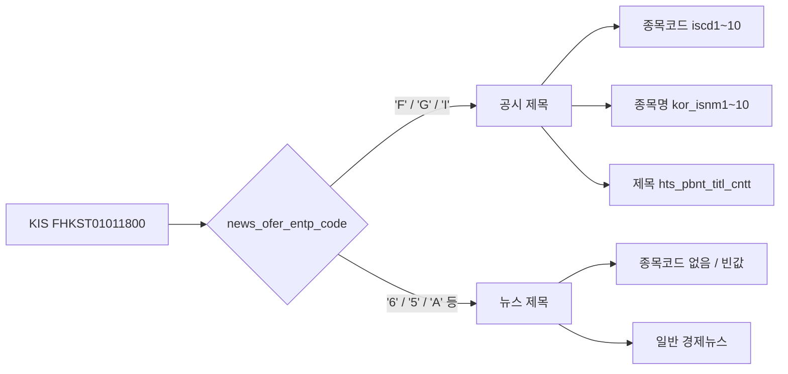
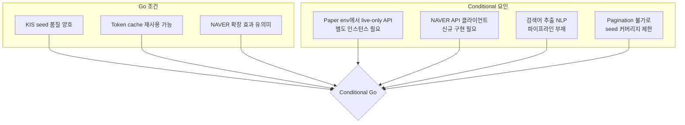

# KIS 공시 제목 + NAVER 뉴스 2단계 검색 방식 Go/No-Go 점검

**작성일**: 2026-05-17  
**분석 담당**: Phase P  
**최종 판정**: ⚠️ **Conditional Go**

---

## 1. 점검 범위

| 항목 | 범위 |
|------|------|
| KIS API | `종합 시황_공시(제목)` (`FHKST01011800`) — live-only, 모의투자 미지원 |
| Token 재사용 | 기존 [`KISRestClient.authenticate()`](src/agent_trading/brokers/koreainvestment/rest_client.py:423) + dev token cache (`.cache/kis_token.json`) |
| NAVER 뉴스 | NAVER 검색 API (`search.naver.com/search.naver` 또는 공식 NAVER Developers API) |
| 기존 인프라 | [`ExternalEventRepository`](src/agent_trading/repositories/contracts.py), [`PollingWorker`](src/agent_trading/brokers/polling_worker.py), [`SourceAdapter`](src/agent_trading/brokers/source_adapter.py) 패턴 |
| 대상 종목 | 국내주식 (KRX/KOSDAQ) — universe selection의 core + event_overlay 대상 |

---

## 2. KIS Seed 품질 평가

### 2.1 API 개요

| 항목 | 값 |
|------|-----|
| TR ID | `FHKST01011800` |
| Endpoint | `GET /uapi/domestic-stock/v1/quotations/news-title` |
| 실전 | ✅ 지원 (`https://openapi.koreainvestment.com:9443`) |
| 모의투자 | ❌ **미지원** (paper 환경에서 호출 불가) |
| HTTP Method | GET |
| 인증 | Bearer token (기존 `authenticate()` 재사용) |

### 2.2 요청 파라미터

| 파라미터 | 필수 | 설명 |
|----------|------|------|
| `FID_NEWS_OFER_ENTP_CODE` | Y | 공백 필수 (전체) |
| `FID_COND_MRKT_CLS_CODE` | Y | 공백 필수 (전체) |
| `FID_INPUT_ISCD` | Y | **공백: 전체**, 종목코드: 해당코드 뉴스 |
| `FID_TITL_CNTT` | Y | 공백 필수 (전체) |
| `FID_INPUT_DATE_1` | Y | 공백: 현재기준, `00YYYYMMDD` |
| `FID_INPUT_HOUR_1` | Y | 공백: 현재기준, `0000HHMMSS` |
| `FID_RANK_SORT_CLS_CODE` | Y | 공백 필수 |
| `FID_INPUT_SRNO` | Y | 공백 필수 |

> **중요**: `FID_INPUT_ISCD`에 특정 종목코드를 넣으면 해당 종목 관련 뉴스/공시만 필터링 가능.  
> 공백으로 두면 **전체 시장**의 공시/뉴스 제목을 반환.

### 2.3 응답 필드

| 필드 | 타입 | 설명 |
|------|------|------|
| `cntt_usiq_srno` | string(20) | 내용 조회용 일련번호 (unique key) |
| `news_ofer_entp_code` | string(1) | 뉴스 제공 업체 코드 (`'F'`=장내공시, `'G'`=코스닥공시, `'6'`=연합뉴스 등) |
| `data_dt` | string(8) | 작성일자 (`YYYYMMDD`) |
| `data_tm` | string(6) | 작성시간 (`HHMMSS`) |
| `hts_pbnt_titl_cntt` | string(400) | **HTS 공시 제목 내용** — 핵심 seed |
| `news_lrdv_code` | string(8) | 뉴스 대구분 (공시/뉴스 분류 코드) |
| `dorg` | string(20) | 자료원 |
| `iscd1` ~ `iscd10` | string(9) | **종목코드** (최대 10개) |
| `kor_isnm1` ~ `kor_isnm10` | string | **종목명** (최대 10개) |

### 2.4 Seed 품질 평가



**평가**:

| 기준 | 결과 | 근거 |
|------|------|------|
| Symbol 포함 | ✅ | `iscd1`~`iscd10`에 최대 10개 종목코드 제공 |
| Company name 포함 | ✅ | `kor_isnm1`~`kor_isnm10`에 종목명 제공 |
| Headline/title 포함 | ✅ | `hts_pbnt_titl_cntt` (최대 400자) |
| Timestamp 포함 | ✅ | `data_dt` + `data_tm` |
| Pagination | ❌ | `tr_cont`를 이용한 다음조회 **불가** API (1회 호출에 최대 N개) |
| 공시/뉴스 구분 | ✅ | `news_lrdv_code`로 공시 vs 일반뉴스 분류 가능 |
| 검색어 생성 가능성 | ✅ | `"삼성전자 반도체 설비투자 20조원 확대"` → `"삼성전자 반도체 설비투자"` |

**Seed 품질 종합**: **양호** ✅

- 공시 제목만으로도 종목코드 + 종목명 + 제목 핵심어 추출 가능
- `news_lrdv_code`로 공시(`FGHIN` 계열)만 필터링 가능
- 단점: pagination 불가로 한 번에 가져오는 아이템 수에 제한 (응답 예제 기준 ~10개 내외 추정)
- 단점: 전체 조회 시 불필요한 일반뉴스도 포함됨 → `FID_INPUT_ISCD`로 특정 종목 필터링 필요

---

## 3. 기존 Live Token Cache 재사용 적합성 평가

### 3.1 Token Cache 구조

| 계층 | 메커니즘 | 설명 |
|------|----------|------|
| In-memory | `self._access_token` + `self._token_expires_at` | 프로세스 메모리, 24h 만료 (5분 조기갱신) |
| Dev file cache | `.cache/kis_token.json` | 파일 기반, fingerprint + env + base_url 검증 |
| Auth lock | `asyncio.Lock` | 동시 호출 직렬화 (single-flight) |
| Cooldown | 1 rps enforcement | KIS 공식 가이드 준수 |

### 3.2 Live/Paper 분기

```python
# rest_client.py
KIS_API_BASE_URLS = {
    "live": "https://openapi.koreainvestment.com:9443",
    "paper": "https://openapivts.koreainvestment.com:29443",
}

# KISRestClient.env → "live" or "paper"
# authenticate()는 env와 무관하게 동일한 oauth2/tokenP 호출
# 단, paper 환경의 token은 paper base URL에서만 유효
```

### 3.3 평가

| 기준 | 결과 | 근거 |
|------|------|------|
| Live token cache key/storage | ✅ | `app_key_fingerprint`(SHA256) + `kis_env` + `base_url`로 구분 |
| Live token refresh 방식 | ✅ | `authenticate()` 내부에서 만료 5분 전 자동 갱신 |
| Paper 환경에서 live-only 조회 가능? | ⚠️ **제한적** | `KISRestClient`는 단일 `env`만 가짐. paper adapter는 paper token만 보유. **live 전용 endpoint 호출 시 live env의 KISRestClient가 별도로 필요** |
| Live credential failure fallback | ❌ 없음 | `authenticate()` 실패 시 `BrokerError` 발생, fallback 없음 |
| "별도 live auth path 불필요"? | ⚠️ **조건부** | 기존 `KISRestClient`의 `_request()` 메커니즘을 재사용 가능하나, **paper env에서 live token을 가진 별도 인스턴스가 필요** |

### 3.4 핵심 제약

```mermaid
flowchart TD
    A[Paper 환경] --> B[KISRestClient env=paper]
    B --> C[paper token cache]
    B --> D[paper base URL]
    
    A --> E[공시 API 호출 필요]
    E --> F{FHKST01011800}
    F -->|live-only| G[live base URL 필요]
    F -->|live-only| H[live token 필요]
    
    G --> I[별도 KISRestClient env=live 필요]
    H --> I
    
    I --> J[기존 authenticate() 재사용 가능]
    J --> K[dev_token_cache에 live token 별도 저장]
```

**Live token cache 재사용 종합**: ⚠️ **조건부 적합**

- **장점**: `authenticate()` 메서드, `_request()` 헬퍼, `_build_headers()`, circuit breaker, rate limit budget 등 모든 인프라를 재사용 가능
- **단점**: paper 환경에서 live 전용 API를 호출하려면 **`env="live"`인 별도 `KISRestClient` 인스턴스**가 필요. 현재 [`_build_kis_adapter()`](src/agent_trading/runtime/bootstrap.py:37)는 단일 env만 생성
- **해결책**: `KISRestClient`는 `env`만 다르게 하면 동일 credential로 live token 발급 가능. `_build_kis_adapter()`에 `live_rest_client` 옵션을 추가하거나, 공시 전용 `KISRestClient(env="live")`를 별도 생성

---

## 4. NAVER 확장 검색 품질 평가

### 4.1 NAVER 검색 API 개요

현재 코드베이스에 **NAVER API 클라이언트가 존재하지 않음**. 신규 구현 필요.

| 항목 | 내용 |
|------|------|
| API | NAVER 검색 API (뉴스) — `https://openapi.naver.com/v1/search/news.json` |
| 인증 | `X-Naver-Client-Id` + `X-Naver-Client-Secret` (HTTP header) |
| 무료 할당량 | 일 25,000회 (검색 API 기준) |
| Rate limit | 1초당 10회 (비공식, 일반적으로 준수) |
| 결과 정렬 | `sim` (정확도순) / `date` (날짜순) |
| 응답 필드 | `title`, `link`, `originallink`, `description`, `pubDate` |

### 4.2 Query 전략별 평가

| 전략 | 예시 | 예상 품질 | 리스크 |
|------|------|-----------|--------|
| ① `{종목명}` | `"삼성전자"` | 보통 — 관련성 낮은 일반뉴스 다수 포함 | 노이즈 큼 |
| ② `{종목명} {공시 제목 핵심어}` | `"삼성전자 반도체 설비투자"` | **높음** — KIS seed로 검색어 정밀화 | 검색어 추출 품질에 의존 |
| ③ `{종목코드} {종목명}` | `"005930 삼성전자"` | 낮음 — 종목코드는 NAVER 검색에 비효과적 | 불필요한 쿼리 낭비 |
| ④ `{종목명} 공시` | `"삼성전자 공시"` | 중간 — 공시 관련 뉴스로 제한 | 일부 관련 뉴스 누락 가능 |

**권장 전략**: **② 우선, ④ fallback**

- 1차: `{종목명} {공시 제목 핵심어}` — KIS seed에서 추출한 핵심어로 정밀 검색
- 2차: `{종목명} 공시` — 1차 결과가 부족할 경우 보완
- `sort=sim` 우선, `sort=date`는 보조

### 4.3 `sort=sim` vs `sort=date`

| 구분 | `sort=sim` | `sort=date` |
|------|-----------|-------------|
| 장점 | 관련성 높은 기사 우선 | 최신 이슈 포착 |
| 단점 | 오래된 기사도 상위 노출 가능 | 관련성 낮은 최신기사 포함 |
| 사용처 | 1차 검색 (정밀도 우선) | 2차 검색 (최신성 보완) |

### 4.4 Rate Limit / Quota

| 항목 | 값 | 비고 |
|------|-----|------|
| 일일 할당량 | 25,000회 | 종목당 2회(①+②) × 100종목 = 200회/cycle → 여유 있음 |
| 초당 제한 | ~10 req/s | `asyncio.Semaphore`로 제어 가능 |
| 인증 | Client ID + Secret | 환경변수로 설정 필요 |

---

## 5. 랭킹/중복제거 가능성

### 5.1 중복제거 규칙

| 규칙 | 방법 | 신뢰도 |
|------|------|--------|
| `originallink` 기준 dedupe | URL exact match | **높음** |
| 제목 유사도 dedupe | `difflib.SequenceMatcher` 또는 간단한 token overlap | 중간 |
| 종목명 exact match | `kor_isnm` 필드와 뉴스 본문/제목 매칭 | 높음 |
| pubDate freshness | 24시간 이내만 수집 | 중간 |

### 5.2 간단 Scoring Draft

```python
def score_news_item(
    item: dict,
    seed_symbol: str,
    seed_company: str,
    seed_keywords: list[str],
) -> float:
    score = 0.0
    
    # 1. 종목명 매칭 (0~40점)
    title = item.get("title", "")
    if seed_company in title:
        score += 40
    
    # 2. 공시 키워드 overlap (0~30점)
    title_tokens = set(tokenize(title))
    keyword_overlap = len(title_tokens & set(seed_keywords))
    score += min(keyword_overlap * 10, 30)
    
    # 3. 신선도 (0~20점)
    pub_date = parse(item.get("pubDate", ""))
    hours_ago = (datetime.now() - pub_date).total_seconds() / 3600
    score += max(0, 20 - hours_ago)  # 20시간 이내 최대
    
    # 4. 출처 신뢰도 (0~10점)
    reliable_sources = {"연합뉴스", "매일경제", "한국경제", "머니투데이"}
    if item.get("originallink") in reliable_sources:
        score += 10
    
    return min(score, 100.0)
```

### 5.3 품질 제어 가능성

| 제어 항목 | 가능? | 방법 |
|-----------|-------|------|
| 종목명 match | ✅ | `kor_isnm` 필드로 exact/near-exact match |
| 공시 키워드 overlap | ✅ | KIS seed 제목에서 명사 추출 |
| pubDate freshness | ✅ | `pubDate` 파싱 후 24h/48h 필터 |
| originallink dedupe | ✅ | URL hash 기반 dedupe |
| 제목 유사도 dedupe | ✅ | 간단한 cosine/Jaccard 유사도 |

---

## 6. 리스크/제약

### 6.1 주요 리스크 (Top 3)

| # | 리스크 | 심각도 | 설명 |
|---|--------|--------|------|
| 1 | **KIS live-only 제약** | 🔴 높음 | Paper 환경에서 공시 API 호출 불가. 별도 `env="live"` KISRestClient 인스턴스가 필요하며, live API key/secret이 paper와 동일한 credential인지 확인 필요 |
| 2 | **NAVER API 미구현** | 🔴 높음 | 현재 코드베이스에 NAVER API 클라이언트가 전혀 없음. 신규 [`SourceAdapter`](src/agent_trading/brokers/source_adapter.py) 구현 + [`PollingWorker`](src/agent_trading/brokers/polling_worker.py) 등록 + 환경변수 설정 필요 |
| 3 | **공시 제목 → 검색어 추출 품질** | 🟡 중간 | KIS seed 제목에서 핵심어를 추출하는 NLP 파이프라인이 없음. 간단한 형태소 분석기(Komoran/Okt) 또는 LLM 기반 추출 필요 |

### 6.2 기타 리스크

| 리스크 | 심각도 | 대응 |
|--------|--------|------|
| 장중 다종목 동시 조회 시 호출 폭증 | 🟡 중간 | `asyncio.Semaphore` + rate limit budget으로 제어 가능. 기존 [`get_quotes_batch()`](src/agent_trading/brokers/koreainvestment/rest_client.py:1177) 패턴 참고 |
| 잘못된 종목 매칭 | 🟡 중간 | `iscd`(종목코드)가 응답에 포함되므로 매칭 정확도는 높음. 단, `iscd`가 빈값인 일반뉴스는 필터링 필요 |
| 공시 없이 뉴스만 있는 종목 처리 공백 | 🟢 낮음 | KIS 공시 API가 공시+뉴스를 모두 반환하므로, 공시가 없어도 뉴스 seed는 확보 가능 |
| NAVER quota 소진 | 🟢 낮음 | 일 25,000회는 충분. 단, 다종목+다쿼리 전략 사용 시 모니터링 필요 |
| Live token dependency | 🟡 중간 | Live token 발급 실패 시 공시 수집 전체 중단. `authenticate()` 재시도 로직은 있으나 fallback 없음 |

---

## 7. MVP 제안

### 7.1 최소 구현 단위

```mermaid
flowchart TD
    A[KISRestClient env=live<br>별도 인스턴스] --> B[GET news-title<br>FHKST01011800]
    B --> C[RawResponse 파싱]
    C --> D{news_lrdv_code<br>공시 필터}
    D -->|공시 계열| E[Seed 추출<br>symbol + title + timestamp]
    D -->|일반뉴스| F[선별적 수집<br>(옵션)]
    
    E --> G[NAVER News SourceAdapter<br>신규 구현]
    G --> H[Query 1: 종목명 + 핵심어<br>sort=sim]
    G --> I[Query 2: 종목명 + 핵심어<br>sort=date]
    H --> J[Dedupe + Scoring<br>Top 3]
    I --> J
    
    J --> K[ExternalEventEntity 저장<br>source=NAVER_NEWS]
    K --> L[Event Overlay<br>Universe Selection]
```

### 7.2 권장 MVP Scope

| 단계 | 작업 | 예상 공수 |
|------|------|-----------|
| **P0** | `KISRestClient(env="live")` 별도 인스턴스 생성 및 공시 API 호출 메서드 추가 | 1일 |
| **P0** | `FHKST01011800` endpoint/TR ID를 `KIS_ENDPOINTS`/`KIS_TR_IDS`에 등록 | 0.5일 |
| **P1** | NAVER News `SourceAdapter` 구현 (httpx 기반, `RawEvent` → `ExternalEventEntity`) | 1.5일 |
| **P1** | `PollingWorker` 등록 (interval: 300s, freshness: 600s) | 0.5일 |
| **P2** | 간단한 검색어 추출 (종목명 + 공시 제목 앞 20자) | 0.5일 |
| **P2** | Dedupe + Scoring (Top 3) | 0.5일 |
| **P3** | `EventInterpretationAgent` 연동 (뉴스 중요도 분류) | 1일 |

**총 예상 공수**: ~5일

### 7.3 MVP 이후 확장 TODO

- [ ] 형태소 분석기 기반 검색어 추출 고도화
- [ ] `sort=sim` + `sort=date` 결과 앙상블
- [ ] NAVER 뉴스 본문 요약 (AI agent)
- [ ] 다국어 뉴스 소스 추가 (Bloomberg, Reuters)
- [ ] KIS 공시 본문 API 연동 (제목 → 본문 내용)
- [ ] 실시간 공시 WebSocket 알림

---

## 8. 최종 판정: ⚠️ **Conditional Go**

### 판정 근거



### 판정 요약

| 축 | 평가 |
|----|------|
| KIS seed 품질 | ✅ 양호 — 종목코드+종목명+제목 모두 포함 |
| Live token reuse | ⚠️ 가능하나 paper env에서 별도 live 인스턴스 필요 |
| NAVER 확장 효과 | ✅ 유의미 — KIS seed로 검색어 정밀화 가능 |
| 호출 비용/노이즈 제어 | ✅ 가능 — dedupe + scoring으로 Top 3 제한 |
| **최종 판정** | **⚠️ Conditional Go** |

### 선행 조건 (3개)

1. **Paper 환경에서 live-only API 호출을 위한 `env="live"` KISRestClient 별도 인스턴스 구성**
   - [`_build_kis_adapter()`](src/agent_trading/runtime/bootstrap.py:37)에 `live_rest_client` 옵션 추가 또는 공시 전용 `KISRestClient` 별도 생성
   - live API key/secret이 paper와 동일한 credential로 live token 발급 가능한지 확인

2. **NAVER News SourceAdapter 신규 구현**
   - [`SourceAdapter`](src/agent_trading/brokers/source_adapter.py) 인터페이스 기반 `NaverNewsSourceAdapter` 구현
   - [`PollingWorker`](src/agent_trading/brokers/polling_worker.py) 등록 및 [`ExternalEventRepository`](src/agent_trading/repositories/contracts.py) 연동
   - NAVER Client ID/Secret 환경변수 설정

3. **공시 제목 → 검색어 추출 파이프라인**
   - 최소: 종목명 + 공시 제목 앞 20자 (rule-based)
   - 고도화: 형태소 분석기 또는 LLM 기반 핵심어 추출

### No-Go가 아닌 이유

- KIS 공시 API가 `iscd`(종목코드)와 `kor_isnm`(종목명)을 **모두** 제공하므로 seed 품질이 충분히 높음
- 기존 `KISRestClient` 인프라(authenticate, _request, circuit breaker, rate limit)를 대부분 재사용 가능
- NAVER 검색 API는 무료 할당량(25,000회/일)이 충분하고, MVP 수준(종목당 2쿼리)에서는 부담 없음
- 기존 `ExternalEventRepository` + `PollingWorker` 패턴으로 확장 가능

---

## 9. 완료 보고

### 점검한 핵심 항목

1. **KIS `FHKST01011800` 종합 시황_공시(제목) API** — 요청/응답 구조, 필드 구성, live-only 제약 확인
2. **Live token cache 재사용** — `KISRestClient.authenticate()`, dev token cache, paper/live 분기 분석
3. **NAVER 뉴스 검색 API** — query 전략, sort 옵션, rate limit/quota 평가
4. **랭킹/중복제거** — scoring draft, dedupe 규칙, 품질 제어 가능성 확인
5. **운영 리스크** — Top 3 리스크 식별 및 대응 방안
6. **MVP 범위** — 5일 예상 공수, P0~P3 단계별 작업 정의

### Live Token Cache Reuse 적합성 요약

- **가능**: 기존 `authenticate()` + `_request()` + `_build_headers()` 완전 재사용 가능
- **제약**: paper 환경에서 live-only API 호출을 위해 `env="live"`인 별도 `KISRestClient` 인스턴스 필요
- **리스크**: live token 발급 실패 시 fallback 없음 (공시 수집 전체 중단)

### 주요 리스크 (Top 3)

1. **KIS live-only 제약** — paper 환경에서 별도 live 인스턴스 구성 필요
2. **NAVER API 미구현** — SourceAdapter 신규 개발 필요
3. **검색어 추출 품질** — NLP 파이프라인 부재로 초기 rule-based 접근 필요

### MVP 제안 요약

> KIS 공시 제목 seed → NAVER 2개 query(sim/date) → dedupe + scoring → Top 3 → ExternalEventEntity 저장

### 최종 판정

> **⚠️ Conditional Go** — 기본 방향은 타당하나, paper env live 인스턴스 구성, NAVER SourceAdapter 구현, 검색어 추출 파이프라인의 3가지 선행 조건 해결 후 진행
