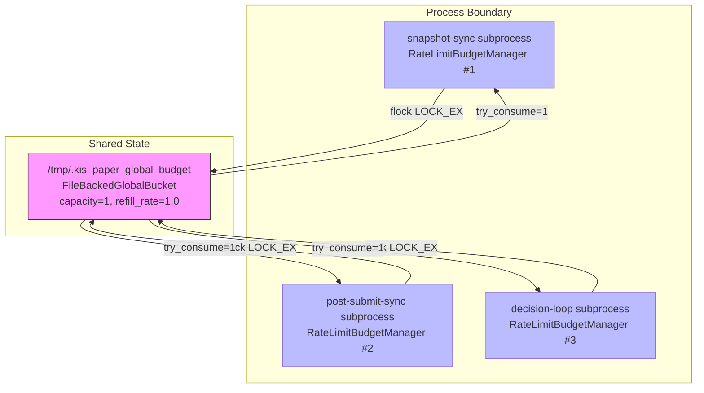
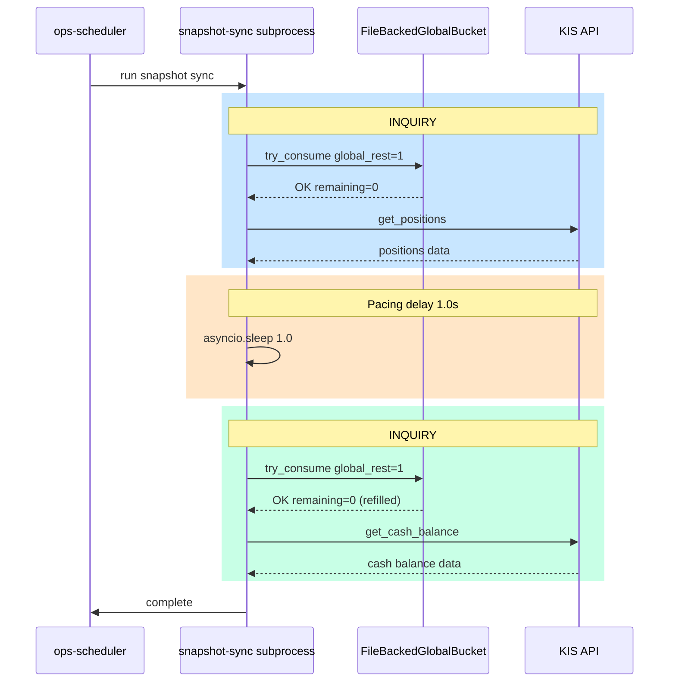
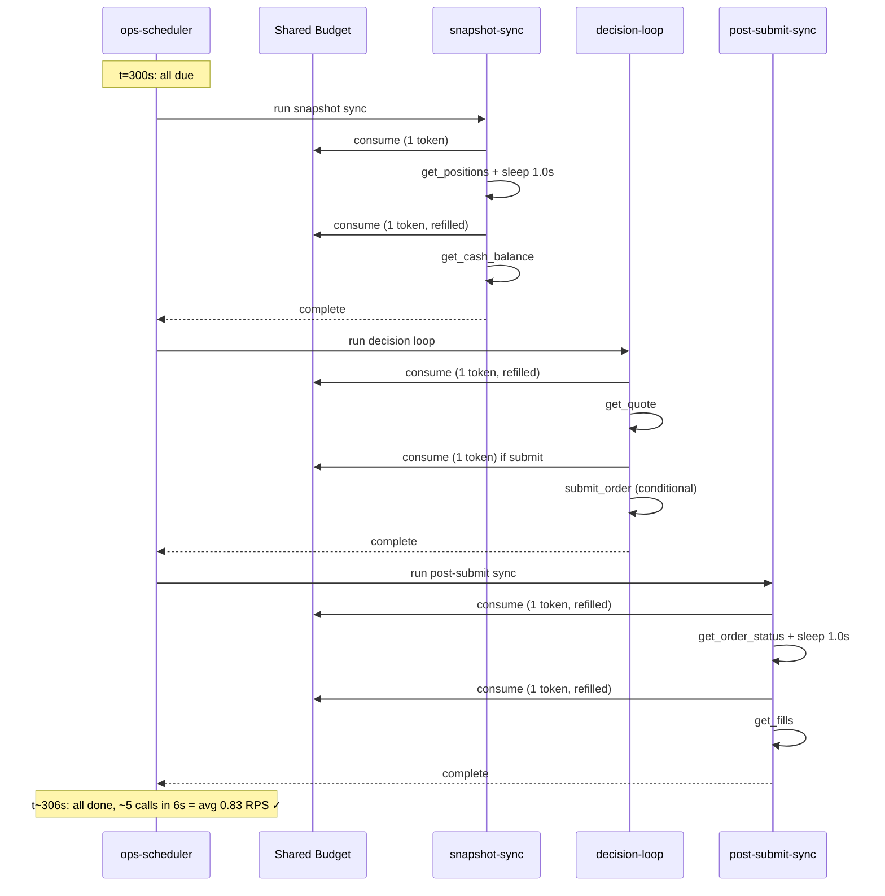
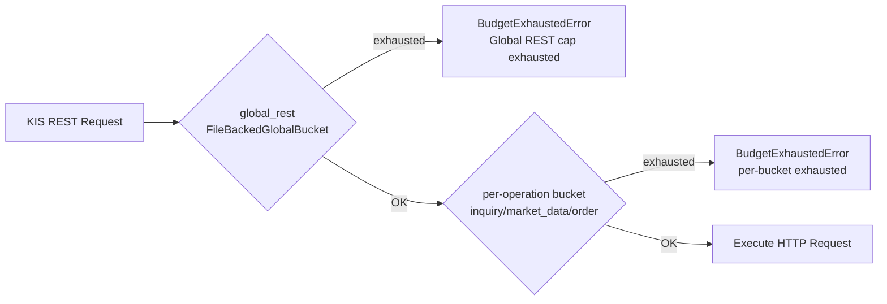

# KIS Paper 1 RPS 제약 준수 — 직렬화/Pacing 설계서

> **작성일**: 2026-05-18  
> **목적**: KIS Paper 환경 1 RPS 제약을 전역 운영 제약으로 준수  
> **원칙**: RPS 값 인위적 상향 금지, 최소 변경으로 최대 효과, 정상적인 paper 운영 경로 구축

---

## 1. Budget 공유 방식: `flock`-기반 공유 파일 (Option A)

### 선택 근거

| 옵션 | 선택 | 사유 |
|------|------|------|
| **A: `flock`-기반 공유 파일** | ✅ **선택** | 추가 인프라 불필요, 모든 subprocess 접근 가능, 원자적 RMW, asyncio 호환 |
| B: Unix Domain Socket proxy | ❌ | 별도 proxy 프로세스 필요, 단일 장애점, 과도한 복잡도 |
| C: Redis 기반 | ❌ | `docker-compose.yml`에 Redis 없음 — 신규 인프라 도입 불필요 |
| D: Scheduler 수준만 | ❌ | subprocess 단독 실행 시 무방비, intra-process 연속 호출 통제 불가 |

### 핵심 결정

각 subprocess가 독립적으로 생성하는 [`RateLimitBudgetManager`](src/agent_trading/brokers/rate_limit.py:118)의 `global_rest` 버킷을 **파일 기반 공유 버킷**으로 대체하여, 모든 subprocess가 동일한 1 RPS 제약을 공유한다.

### 설계 상세

#### 1.1 새로운 모듈: `src/agent_trading/brokers/shared_budget.py`

**`FileBackedGlobalBucket`** 클래스:

```python
@dataclass
class FileBackedGlobalBucket:
    """파일 기반 전역 REST 버킷 — `fcntl.flock`으로 프로세스 간 동기화.

    모든 subprocess가 동일한 파일을 읽고 쓰므로,
    단일 1 RPS 제약이 모든 subprocess에 전역 적용된다.
    """

    file_path: Path
    capacity: int          # paper: 1
    refill_rate: float     # paper: 1.0

    def _read_state(self) -> dict:
        """flock(LOCK_SH) → 파일 읽기 → JSON 파싱"""

    def _write_state(self, state: dict) -> None:
        """flock(LOCK_EX) → JSON 직렬화 → 파일 쓰기"""

    def try_consume(self, tokens: int = 1) -> bool:
        """flock으로 원자적 RMW:
           1. LOCK_SH로 읽기
           2. refill 계산
           3. remaining >= tokens 확인
           4. LOCK_EX로 쓰기 (실패 시 롤백)
        """

    @property
    def remaining(self) -> int:
        """flock(LOCK_SH) → 읽기 전용 조회"""
```

**핵심 구현 상세**:

- 파일 경로: `/tmp/.kis_paper_global_budget` (Docker container 내 shared filesystem)
- 파일 형식: JSON (`{"remaining": 1, "refill_at": "2026-05-18T10:00:00+00:00"}`)
- 모든 file I/O는 `asyncio.to_thread()`로 실행 — event loop 차단 방지
- `flock` 락 타임아웃: 2초 (획득 실패 시 `BudgetExhaustedError`)

#### 1.2 [`RateLimitBudgetManager`](src/agent_trading/brokers/rate_limit.py:118) 변경

```python
@dataclass(slots=True)
class RateLimitBudgetManager:
    ...
    global_rest_file: str | None = None  # NEW: shared file path

    # consume_or_raise()에서 global_rest 체크를
    # FileBackedGlobalBucket으로 위임
```

- `global_rest_file`이 설정되면 in-memory `global_rest` 대신 `FileBackedGlobalBucket` 사용
- `global_rest_file=None`이면 기존 in-memory 동작 유지 (live 환경 호환)

#### 1.3 [`build_kis_budget_manager()`](src/agent_trading/brokers/rate_limit.py:397) 변경

```python
def build_kis_budget_manager(kis_env: str, ...) -> RateLimitBudgetManager:
    if env == "paper":
        return RateLimitBudgetManager(
            ...
            global_rest_capacity=total,     # = 1
            global_rest_refill_rate=1.0 * total,  # = 1.0
            global_rest_file="/tmp/.kis_paper_global_budget",  # NEW
        )
    # live 환경은 변경 없음
```

#### 1.4 `flock` vs `fcntl.flock` 호환성

- Linux: `fcntl.flock(fd, fcntl.LOCK_EX | fcntl.LOCK_NB)` — 비차단 락 시도
- `asyncio.to_thread()`로 blocking I/O 분리
- 락 획득 실패 시 재시도 없이 즉시 `BudgetExhaustedError`

---

## 2. Subprocess 내부 Pacing 상세

### 2.1 Snapshot sync — [`sync_kis_account_snapshots()`](src/agent_trading/services/kis_snapshot_sync.py:174)

**현재**: `get_positions()` → (delay 0) → `get_cash_balance()` — **2회 연속 INQUIRY**

**변경 후**:

```python
# Line 208: positions 조회
raw_positions = await rest_client.get_positions()

# ── NEW: Pacing delay ──
await asyncio.sleep(1.0)

# Line 265: cash balance 조회
raw_cash = await rest_client.get_cash_balance()
```

**pacing 값 근거**: `X = 1.0초`
- `global_rest` refill_rate = 1.0 tokens/sec → 1초마다 1 토큰 충전
- 1.0초 대기 후 다음 호출 시 1 토큰 확보 보장
- 0.5초로 설정하면 burst 상황에서 2회 연속 소진 가능

### 2.2 Post-submit sync — [`sync_order_post_submit()`](src/agent_trading/services/order_sync_service.py:85)

**현재**: `get_order_status()` → (delay 0) → `get_fills()` — **2회 연속 INQUIRY**

**변경 후**:

```python
# Line 189: order status 조회
status_result = await broker.get_order_status(...)

# ── NEW: Pacing delay ──
await asyncio.sleep(1.0)

# Line 229: fill events 조회
fills_synced, fills_skipped = await self._sync_fills(...)
```

### 2.3 Snapshot refresh callback — [`_build_refresh_callback()`](scripts/run_post_submit_sync_loop.py:101)

FILLED 시 snapshot refresh callback(`sync_kis_account_snapshots()`) 호출 시:
- 내부적으로 `asyncio.sleep(1.0)`가 이미 `sync_kis_account_snapshots()`에 포함됨
- refresh callback 자체는 pacing delay가 내장된 함수이므로 추가 조치 불필요

### 2.4 Decision loop — [`_run_one_cycle()`](scripts/run_paper_decision_loop.py:616)

**현재**: `get_quote()` (1× MARKET_DATA) + 조건부 `submit_order()` (1× ORDER)
- 최소 1~2회 호출, 이미 budget 관리 대상
- MARKET_DATA와 ORDER는 다른 bucket → pacing 불필요
- `global_rest` 공유 버킷이 전체 1 RPS를 보장

---

## 3. Scheduler 수준 직렬화 정책

### 3.1 현재 상태 확인

[`_run_intraday_due_tasks()`](scripts/run_near_real_ops_scheduler.py:705)는 **순차 실행**:
```python
async def _run_intraday_due_tasks(state, tasks, ...):
    if tasks["snapshot"].due(now):
        await _run_and_record(...)    # ← 완료 대기
        tasks["snapshot"].mark_ran(now)
    if tasks["decision"].due(now):
        await _run_and_record(...)    # ← 완료 대기
        tasks["decision"].mark_ran(now)
    if tasks["post_submit"].due(now):
        await _run_and_record(...)    # ← 완료 대기
        tasks["post_submit"].mark_ran(now)
```

**분석**: 이미 sequential. 3개 subprocess가 동시에 실행되는 경우는 없음.

### 3.2 충돌 시나리오 분석

t=300s 경계에서 snapshot(300s) + post-submit(30s) + decision(300s)이 동시 due:

| 시점 | 실행 순서 | 예상 지속시간 | RPS |
|------|-----------|--------------|-----|
| t=300s | 1. snapshot sync (2회 INQUIRY) | ~2.2s (2×1.0s pacing) | 1 |
| t=302s | 2. decision loop (1~2회) | ~1.5s | 1 |
| t=304s | 3. post-submit (2회 INQUIRY) | ~2.2s | 1 |
| t=306s | 모두 완료 | | 총 ~3 RPS를 6초에 분산 |

**→ 공유 `global_rest` 버킷이 1 RPS를 보장하므로 추가 scheduler 수준 delay 불필요**

### 3.3 변경 사항

**Scheduler 수준 변경 없음.** 단, pacing 동작을 관찰하기 위한 로깅 추가:

```python
# _run_and_record() 완료 후 pacing 로깅
logger.debug(
    "pacing-delay task=%s completed_in=%.2fs next_global_token_at=%s",
    name,
    result.duration_seconds,
    shared_budget.next_refill_at.isoformat() if shared_budget else "N/A",
)
```

---

## 4. 변경 파일 목록 및 상세 변경 내용

### 4.1 [`src/agent_trading/brokers/shared_budget.py`](src/agent_trading/brokers/shared_budget.py) — **신규 파일**

**변경 유형**: 신규 생성

**내용**:
- `FileBackedGlobalBucket` 클래스 (전체 ~120줄)
- `fcntl.flock` 기반 원자적 RMW
- JSON 파일 I/O (`/tmp/.kis_paper_global_budget`)
- `asyncio.to_thread()` 래핑
- `PAPER_GLOBAL_BUDGET_PATH = "/tmp/.kis_paper_global_budget"` 상수

### 4.2 [`src/agent_trading/brokers/rate_limit.py`](src/agent_trading/brokers/rate_limit.py) — **수정**

| 라인 | 변경 내용 |
|------|----------|
| 35 | `from .shared_budget import FileBackedGlobalBucket, PAPER_GLOBAL_BUDGET_PATH` import 추가 |
| 163 | `global_rest_file: str \| None = None` 필드 추가 (RateLimitBudgetManager) |
| 194 | 생성자에 `global_rest_file` 파라미터 추가 |
| 221-228 | `global_rest` 초기화 로직 변경: `global_rest_file`이 있으면 `FileBackedGlobalBucket` 사용 |
| 259-268 | `consume_or_raise()`에서 `global_rest` 호출 → `FileBackedGlobalBucket.try_consume()`로 위임 |
| 487-488 | `build_kis_budget_manager()` paper 분기: `global_rest_file=PAPER_GLOBAL_BUDGET_PATH` 전달 |

### 4.3 [`src/agent_trading/services/kis_snapshot_sync.py`](src/agent_trading/services/kis_snapshot_sync.py) — **수정**

| 라인 | 변경 내용 |
|------|----------|
| 3 | `import asyncio` 추가 (이미 imports에 있음) |
| 208-209 | `get_positions()` 호출 직후 `await asyncio.sleep(1.0)` 추가 |
| 265 | `get_cash_balance()` 호출 전 1.0s pacing (이미 위에서 추가) |

### 4.4 [`src/agent_trading/services/order_sync_service.py`](src/agent_trading/services/order_sync_service.py) — **수정**

| 라인 | 변경 내용 |
|------|----------|
| 189-190 | `get_order_status()` 호출 직후 `await asyncio.sleep(1.0)` 추가 |
| 229 | `_sync_fills()` 호출 전 1.0s pacing |
| 250 | `snapshot_refresh_cb` 호출 전 pacing — **이미 `sync_kis_account_snapshots()` 내부에 sleep 포함** |

### 4.5 [`scripts/run_post_submit_sync_loop.py`](scripts/run_post_submit_sync_loop.py) — **수정 없음**

`_build_refresh_callback()`에서 호출하는 `sync_kis_account_snapshots()`가 내부 pacing을 포함하므로 별도 수정 불필요.

### 4.6 [`scripts/run_snapshot_sync_loop.py`](scripts/run_snapshot_sync_loop.py) — **수정 없음**

`sync_all_accounts()`가 내부적으로 `sync_kis_account_snapshots()`를 호출하며, 해당 함수에 pacing이 포함됨.

### 4.7 [`scripts/run_paper_decision_loop.py`](scripts/run_paper_decision_loop.py) — **수정 없음**

- `get_quote()` (MARKET_DATA) + `submit_order()` (ORDER) — budget은 `global_rest` 공유 버킷으로 관리
- 호출 빈도가 낮아(300s), 추가 pacing 불필요

### 4.8 [`scripts/run_near_real_ops_scheduler.py`](scripts/run_near_real_ops_scheduler.py) — **수정**

| 라인 | 변경 내용 |
|------|----------|
| 460-467 | `_run_command()` 완료 후 pacing-delay 로깅 추가 (디버깅 목적) |

### 4.9 [`docker-compose.yml`](docker-compose.yml) — **수정 없음**

- Redis 추가 불필요
- 기존 `KIS_PAPER_REST_RPS` 설정값 유지 (기본 1)

---

## 5. 테스트 계획

### 5.1 신규 테스트 파일: `tests/brokers/test_shared_budget.py`

```python
class TestFileBackedGlobalBucket:
    async def test_try_consume_returns_true_when_tokens_available(self):
        """초기 capacity만큼 consume 성공"""
        ...

    async def test_try_consume_returns_false_when_exhausted(self):
        """모든 토큰 소진 후 consume 실패"""
        ...

    async def test_refill_over_time(self):
        """1.0s 후 refill되어 1 토큰 복구"""
        ...

    async def test_cross_process_isolation(self):
        """파일 기반이므로 다른 프로세스와 상태 공유"""
        ...
```

### 5.2 기존 테스트 수정: `tests/brokers/test_rate_limit.py`

```python
class TestRateLimitBudgetManager:
    async def test_paper_budget_uses_shared_file(self):
        """paper 환경에서 global_rest_file이 설정되는지 확인"""
        manager = build_kis_budget_manager(kis_env="paper")
        assert manager.global_rest_file == "/tmp/.kis_paper_global_budget"
```

### 5.3 새로운 통합 테스트: `tests/brokers/test_paper_1rps_pacing.py`

```python
@pytest.mark.asyncio
class TestPaper1RPSPacing:
    async def test_snapshot_sync_intra_process_pacing(self):
        """sync_kis_account_snapshots() 내부에 1.0s sleep 확인"""
        # mock client로 get_positions(), get_cash_balance() 호출 시간 측정
        ...

    async def test_order_sync_intra_process_pacing(self):
        """sync_order_post_submit() 내부에 1.0s sleep 확인"""
        ...

    async def test_shared_budget_exhaustion_blocks_all_subprocesses(self):
        """파일 기반 budget 소진 시 모든 subprocess에서 BudgetExhaustedError 발생"""
        ...
```

### 5.4 회귀 테스트

- 기존 `tests/brokers/test_rate_limit.py` 모두 통과
- 기존 scheduler/runtime tests 통과
- `docker-compose` 재빌드 후 통합 테스트

---

## 6. Mermaid 다이어그램

### 6.1 Budget 공유 구조



### 6.2 호출 흐름 (Snapshot Sync 예시)



### 6.3 Subprocess 동시 due 시 직렬화



### 6.4 `consume_or_raise()` 2-Tier Enforcement (변경 후)



---

## 7. 구현 순서

| 단계 | 작업 | 파일 | 예상 복잡도 |
|------|------|------|-----------|
| 1 | `shared_budget.py` 신규 작성 | 신규 | 중 |
| 2 | `rate_limit.py` 수정 — `FileBackedGlobalBucket` 통합 | 기존 | 중 |
| 3 | `kis_snapshot_sync.py` — pacing delay 추가 | 기존 | 하 |
| 4 | `order_sync_service.py` — pacing delay 추가 | 기존 | 하 |
| 5 | `run_near_real_ops_scheduler.py` — pacing 로깅 추가 | 기존 | 하 |
| 6 | 신규 테스트 작성 | 신규 | 중 |
| 7 | 기존 테스트 통과 확인 | 기존 | 하 |
| 8 | Docker 재빌드/재기동 | - | 하 |

---

## 8. 리스크 및 완화

| 리스크 | 영향 | 완화 |
|--------|------|------|
| `flock` 파일 경합으로 지연 | 성능 저하 | `asyncio.to_thread()` + non-blocking lock (`LOCK_NB`) |
| 파일 시스템 권한 문제 | Budget 동작 불가 | `/tmp`는 모든 컨테이너에서 RW; fallback으로 in-memory 동작 유지 |
| `asyncio.sleep(1.0)`로 인한 1초 지연 | 동기화 1초 증가 | 300s/30s tick에 비해 무시 가능; safety가 우선 |
| Post-submit sync 지연 (FILLED 감지 늦어짐) | 거래 체결 알림 지연 | Post-submit 30s tick 내에서 처리; 1~2초 지연은 무시 가능 |

---

## 9. 결론

**선택한 접근법: Option A (`flock`-기반 공유 파일) + Intra-process Pacing**

- 3개 subprocess가 각각 독립적인 budget manager를 가지는 문제를 **파일 기반 전역 REST 버킷**으로 해결
- 각 subprocess 내 연속 호출 사이에 **1.0초 pacing delay**로 RPS 급등 방지
- Scheduler는 이미 sequential 실행 → 추가 직렬화 불필요
- **최소 변경**: 신규 파일 1개, 기존 파일 4개 수정, docker-compose 변경 없음
- **테스트**: 신규 단위 테스트 + 통합 테스트 + 기존 회귀 테스트
