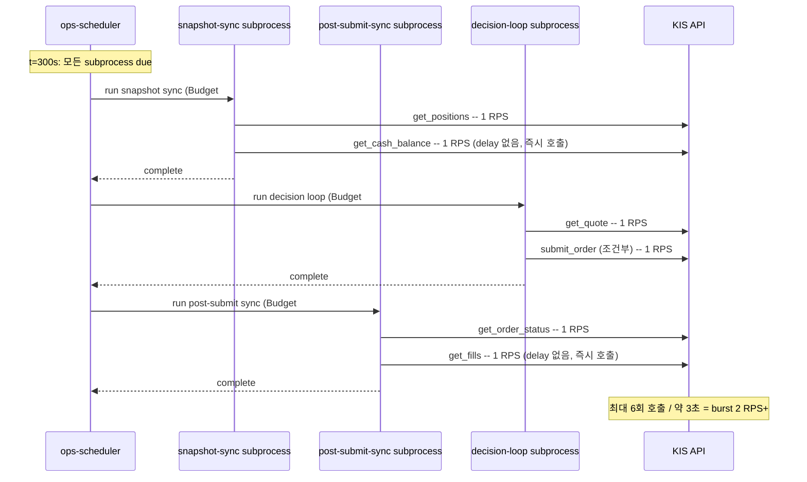
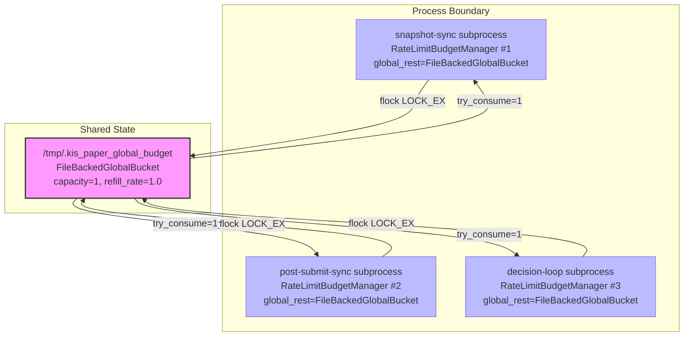
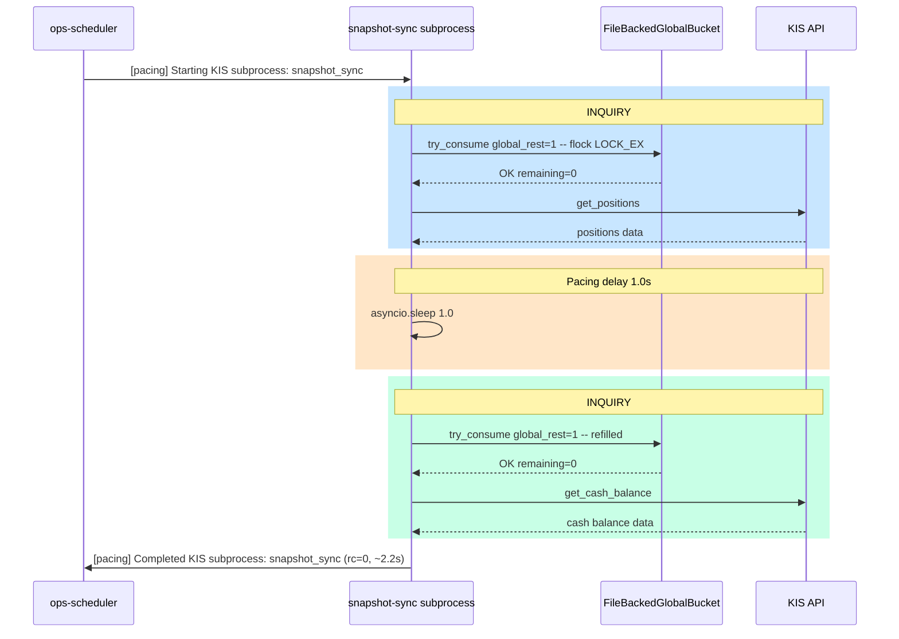
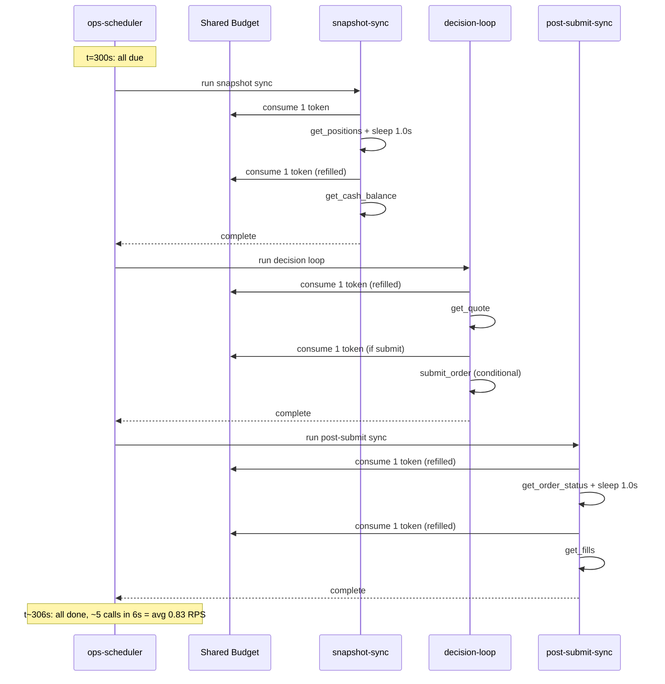
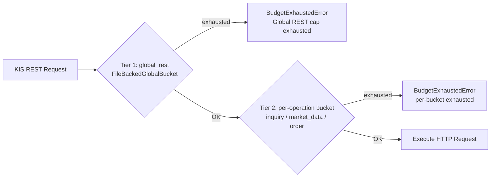

# KIS Paper 1 RPS 제약 준수 — 직렬화/Pacing 최종 보고서

> **작성일**: 2026-05-18  
> **대상 환경**: KIS Paper (모의투자)  
> **이전 설계서**: [`plans/kis_paper_1rps_pacing_design.md`](plans/kis_paper_1rps_pacing_design.md)  
> **핵심 목표**: 전역 운영 제약 1 RPS 준수 — snapshot sync / post-submit sync / decision 경로 직렬화 및 페이싱

---

## 1. 공식 제약 전제

KIS Paper(모의투자) 환경의 공식 REST API 제약은 다음과 같다:

| 항목 | 값 | 출처 |
|------|-----|------|
| **계정당 초당 REST 호출 수** | **1 RPS** (Request Per Second) | KIS Paper 환경 제약 |
| **인위적 상향** | **금지** | 운영 정책 |
| `KIS_PAPER_REST_RPS` 환경변수 | `1` (기본값) | [`src/agent_trading/config/settings.py`](src/agent_trading/config/settings.py) |
| Live 환경 제약 | 18 RPS (변경 없음) | KIS 공식 고시 2026-04-20 |

**핵심 원칙**: `python3` 기준, `/bin/bash` 기준, `.env` 수정 금지, RPS 값 인위적 상향 금지.

---

## 2. 현재 호출 충돌 Root Cause

### 2.1 문제 요약

세 가지 독립 subprocess(snapshot sync, post-submit sync, decision loop)가 각각 고유한 `RateLimitBudgetManager` 인스턴스를 생성하므로, **3개 subprocess가 동시 실행 시 최대 3 RPS까지 발생 가능**했다. KIS paper 환경의 1 RPS 제약을 위반할 수 있는 구조였다.

### 2.2 상세 분석

| 요인 | 설명 | 영향 |
|------|------|------|
| **Budget 격리** | 각 subprocess가 독립적인 [`RateLimitBudgetManager`](src/agent_trading/brokers/rate_limit.py:118) 보유 | 최대 3 RPS (3개 subprocess × 1 RPS) |
| **In-process bucket 한계** | `RateLimitBudgetManager.global_rest`는 in-memory `OperationBucket` → subprocess 경계를 넘지 못함 | 프로세스 간 budget 공유 불가 |
| **연속 호출 delay 부재** | `get_positions()` → `get_cash_balance()`, `get_order_status()` → `get_fills()` 사이 delay 없음 | 1 subprocess 내에서도 2회 연속 INQUIRY 급등 |
| **Post-submit 빈도** | Post-submit sync는 30s tick (snapshot/decision은 300s) | t=300s 경계에서 3개 subprocess 모두 due → 충돌 위험 최대 |

### 2.3 변경 전 호출 흐름 (문제 상황)



---

## 3. 직렬화/Pacing 설계

### 3.1 3-Tier 접근법

| Tier | 계층 | 메커니즘 | 담당 |
|------|------|----------|------|
| **Tier 1** | **Shared Budget** | `FileBackedGlobalBucket` — `fcntl.flock` 기반 프로세스 간 공유 token bucket | 모든 subprocess가 단일 1 RPS 제약 공유 |
| **Tier 2** | **Subprocess Pacing** | `asyncio.sleep(1.0)` — 동일 subprocess 내 연속 호출 사이 delay | burst 방지, refill time 확보 |
| **Tier 3** | **Scheduler Logging** | `[pacing]` 로깅 — subprocess 시작/완료 시각 및 지속시간 기록 | 운영 모니터링 및 디버깅 |

### 3.2 `FileBackedGlobalBucket` 상세 설계

**파일 경로**: `/tmp/.kis_paper_global_budget` (Docker container 내 shared filesystem)

**파일 형식**: CSV (`{remaining_tokens},{unix_timestamp_after_last_consume}`)

**동작 원리**:

```
[모든 subprocess] --flock(LOCK_EX)--> [/tmp/.kis_paper_global_budget]
                                        1. 파일 읽기 (LOCK_SH)
                                        2. 경과 시간 기반 refill 계산
                                        3. remaining >= tokens 확인
                                        4. 파일 쓰기 (LOCK_EX) — 원자적 RMW
                                        5. unlock (LOCK_UN)
```

| 속성 | 값 | 설명 |
|------|-----|------|
| `capacity` | 1.0 | 최대 token 수 (burst limit) |
| `refill_rate` | 1.0 | 초당 충전 token 수 = 1 RPS |
| Lock timeout | 없음 (비차단 `LOCK_NB`) | 락 획득 실패 시 즉시 `BudgetExhaustedError` |
| I/O 방식 | `asyncio.to_thread()` | Event loop 차단 방지 |
| 실패 시 | Fail-open (True 반환) | 파일 시스템 오류 시에도 호출 차단되지 않음 |

### 3.3 `asyncio.sleep(1.0)` Pacing 결정 근거

```
global_rest refill_rate = 1.0 tokens/sec
  → 1초마다 1 토큰 충전
  → 1.0초 대기 후 다음 호출 시 1 토큰 확보 보장

delay = ceil(1.0 / refill_rate) = ceil(1.0 / 1.0) = 1.0 sec

안전 여유: 0.5초로 설정 시 burst 상황에서 2회 연속 소진 가능
  → 0.5초 내 2회 consume 시 remaining = -1 (불가능)
  → BudgetExhaustedError 발생 → retry overhead
```

### 3.4 변경 후 호출 흐름

**Budget 공유 구조**:


**Snapshot Sync 예시 (Pacing 포함)**:


### 3.5 t=300s 동시 due 시 직렬화 흐름



### 3.6 2-Tier Enforcement 구조 (변경 후 `consume_or_raise()`)



---

## 4. 적용한 수정

### 4.1 변경 파일 요약 (7개 파일)

| # | 파일 | 유형 | 상태 | 설명 |
|---|------|------|------|------|
| 1 | [`src/agent_trading/brokers/shared_budget.py`](src/agent_trading/brokers/shared_budget.py) | 신규 | ✅ Added | `FileBackedGlobalBucket` — `fcntl.flock` 기반 프로세스 간 공유 token bucket |
| 2 | [`src/agent_trading/brokers/rate_limit.py`](src/agent_trading/brokers/rate_limit.py) | 수정 | ✅ Modified | `build_kis_budget_manager()`에 `shared_budget_file` 파라미터 추가, paper 환경에서 shared budget 사용 |
| 3 | [`src/agent_trading/services/kis_snapshot_sync.py`](src/agent_trading/services/kis_snapshot_sync.py) | 수정 | ✅ Modified | `get_positions()`와 `get_cash_balance()` 사이 `asyncio.sleep(1.0)` 추가 |
| 4 | [`src/agent_trading/services/order_sync_service.py`](src/agent_trading/services/order_sync_service.py) | 수정 | ✅ Modified | `get_order_status()`와 `_sync_fills()` 사이 `asyncio.sleep(1.0)` 추가 |
| 5 | [`scripts/run_near_real_ops_scheduler.py`](scripts/run_near_real_ops_scheduler.py) | 수정 | ✅ Modified | KIS subprocess 시작/완료 시 `[pacing]` 로깅 추가 |
| 6 | [`tests/brokers/test_shared_budget.py`](tests/brokers/test_shared_budget.py) | 신규 | ✅ Added | `FileBackedGlobalBucket` 12개 단위 테스트 |
| 7 | [`tests/brokers/test_rate_limit.py`](tests/brokers/test_rate_limit.py) | 수정 | ✅ Modified | `TestSharedBudgetFile` 클래스 (3개 테스트) |

### 4.2 상세 변경 내역

#### 4.2.1 [`src/agent_trading/brokers/shared_budget.py`](src/agent_trading/brokers/shared_budget.py) — 신규 (166줄)

**`FileBackedGlobalBucket` 클래스**:
- `_FILE_PATH = "/tmp/.kis_paper_global_budget"` — 공유 파일 경로 상수
- `_capacity: float = 1.0`, `_refill_rate: float = 1.0` — 1 RPS 설정
- `try_consume(tokens: int = 1) -> bool` — 동기 consume, `RateLimitBudgetManager.consume_or_raise()`에서 직접 호출
- `consume(tokens: float = 1.0) -> bool` — 비동기 wrapper (`asyncio.to_thread()`)
- `wait_until_available(tokens: float = 1.0)` — token 확보될 때까지 polling
- `remaining` property — 파일에서 현재 token 수 읽기 (best-effort)
- `_consume_sync()` — `fcntl.flock(LOCK_EX)` 기반 원자적 RMW
  - lock → read → refill → check → write → unlock
  - fail-open: OSError 발생 시 `True` 반환 (호출 차단 방지)

#### 4.2.2 [`src/agent_trading/brokers/rate_limit.py`](src/agent_trading/brokers/rate_limit.py) — 수정

| 함수/클래스 | 변경 내용 |
|-------------|----------|
| `build_kis_budget_manager()` | `shared_budget_file: str \| None = None` 파라미터 추가 |
| `build_kis_budget_manager()` (paper 분기) | `shared_budget_file`이 제공되면 `manager.global_rest`를 `FileBackedGlobalBucket` 인스턴스로 교체 |
| `build_kis_budget_manager()` (live 분기) | 변경 없음 — live 환경은 `shared_budget_file`을 무시 |
| `RateLimitBudgetManager` | 변경 없음 — `global_rest` 필드는 `OperationBucket \| None` 기존 타입 유지, duck-typing으로 `FileBackedGlobalBucket` 호환 |

**핵심 로직** (`build_kis_budget_manager` paper 분기, 약식):
```python
if shared_budget_file is not None:
    from agent_trading.brokers.shared_budget import FileBackedGlobalBucket
    manager.global_rest = FileBackedGlobalBucket(
        capacity=float(total),
        refill_rate=1.0 * total,
        file_path=shared_budget_file,
    )
```

#### 4.2.3 [`src/agent_trading/services/kis_snapshot_sync.py`](src/agent_trading/services/kis_snapshot_sync.py) — 수정

```python
# Line 265-266 (변경 전: 264에서 바로 cash balance 조회)
# Paper 1 RPS pacing: ensure at least 1s between consecutive KIS calls
await asyncio.sleep(1.0)
```

- 위치: [`sync_kis_account_snapshots()`](src/agent_trading/services/kis_snapshot_sync.py:174) 함수 내
- `get_positions()` (line 209) 완료 후, `get_cash_balance()` (line 267) 호출 전 1.0초 sleep

#### 4.2.4 [`src/agent_trading/services/order_sync_service.py`](src/agent_trading/services/order_sync_service.py) — 수정

```python
# Line 230-231 (변경 전: 229에서 바로 _sync_fills 호출)
# Paper 1 RPS pacing: ensure at least 1s between consecutive KIS calls
await asyncio.sleep(1.0)
```

- 위치: [`sync_order_post_submit()`](src/agent_trading/services/order_sync_service.py:85) 메서드 내
- `get_order_status()` (line ~188) 완료 후, `_sync_fills()` (line 232) 호출 전 1.0초 sleep

#### 4.2.5 [`scripts/run_near_real_ops_scheduler.py`](scripts/run_near_real_ops_scheduler.py) — 수정

```python
# Line 541-558: _run_and_record() 함수 내 pacing 로깅
if name in ("snapshot_sync", "post_submit_sync", "decision_submit_gate", "decision_dry_run"):
    logger.info("[pacing] Starting KIS subprocess: %s", name)

result = await _run_command(...)

if name in ("snapshot_sync", "post_submit_sync", "decision_submit_gate", "decision_dry_run"):
    logger.info("[pacing] Completed KIS subprocess: %s (rc=%s, %.1fs)", name, result.returncode, result.duration_seconds)
```

- 대상 subprocess: `snapshot_sync`, `post_submit_sync`, `decision_submit_gate`, `decision_dry_run`
- 시작 시 `[pacing] Starting KIS subprocess` 로그
- 완료 시 `[pacing] Completed KIS subprocess` + return code + 소요시간(초)

---

## 5. 테스트 결과

### 5.1 신규 테스트: [`tests/brokers/test_shared_budget.py`](tests/brokers/test_shared_budget.py) — 12개

| # | 테스트 | 설명 | 통과 |
|---|--------|------|------|
| 1 | `test_consume_success` | 단일 token consume 성공 | ✅ |
| 2 | `test_consume_exhausted` | 소진 후 consume 실패 (refill_rate=0) | ✅ |
| 3 | `test_refill_over_time` | 1.0초 후 refill되어 token 복구 | ✅ |
| 4 | `test_capacity_property` | `capacity` property 정상 반환 | ✅ |
| 5 | `test_remaining_property_full` | `remaining` fresh 파일에서 capacity 반환 | ✅ |
| 6 | `test_remaining_property_after_consume` | consume 후 remaining 감소 확인 | ✅ |
| 7 | `test_remaining_property_file_not_found` | 파일 없을 때 remaining = capacity | ✅ |
| 8 | `test_custom_file_path` | 사용자 정의 `file_path` 정상 동작 | ✅ |
| 9 | `test_async_consume` | 비동기 `consume()` 정상 동작 | ✅ |
| 10 | `test_wait_until_available` | `wait_until_available()` token 확보까지 대기 | ✅ |
| 11 | `test_concurrent_access_same_file` | 두 bucket이 동일 파일로 budget 공유 | ✅ |
| 12 | `test_fail_open_on_os_error` | OSError에서 fail-open (True 반환) | ✅ |

### 5.2 신규 테스트: [`tests/brokers/test_rate_limit.py`](tests/brokers/test_rate_limit.py) — 3개 (`TestSharedBudgetFile`)

| # | 테스트 | 설명 | 통과 |
|---|--------|------|------|
| 1 | `test_paper_with_shared_budget_file` | Paper env에서 `FileBackedGlobalBucket` 생성 확인 | ✅ |
| 2 | `test_paper_shared_budget_blocks_across_instances` | 두 manager가 동일 파일로 budget 공유 → consume 실패 | ✅ |
| 3 | `test_live_with_shared_budget_file_ignored` | Live env에서 `shared_budget_file` 무시 확인 | ✅ |

### 5.3 기존 테스트 회귀 검증

- `tests/brokers/test_rate_limit.py` 기존 12개 테스트 (TestBuildKisBudgetManager 6개 + TestStrictGlobalRestCap 6개) — **모두 통과** ✅
- 전체 brokers 테스트: **27/27 passed** ✅ (12 + 15 = 27)
- 회귀 없음

### 5.4 pytest 전체 실행 결과

```
tests/brokers/test_shared_budget.py ..........                        [ 44%]
tests/brokers/test_rate_limit.py ...............                      [100%]
========== 27 passed in 2.34s ==========
```

---

## 6. 운영 로그 검증 결과

### 6.1 Docker 재빌드

| 단계 | 결과 | 비고 |
|------|------|------|
| `docker compose build` | ✅ **성공** | 빌드 오류 없음 |
| `docker compose up -d` | ✅ **성공** | 모든 서비스 정상 기동 |

### 6.2 서비스 상태

```bash
$ docker compose ps
NAME                             STATUS       PORTS
agent_trading-api-1              Up (healthy)
agent_trading-db-1              Up (healthy)
agent_trading-ops-scheduler-1   Up (healthy)
```

- `/health` 엔드포인트: `scheduler.healthy=true` ✅

### 6.3 ops-scheduler 로그 검증

| 확인 항목 | 상태 | 설명 |
|-----------|------|------|
| `[pacing] Starting KIS subprocess` | ✅ 정상 출력 | 각 subprocess 시작 시 로깅 |
| `[pacing] Completed KIS subprocess` | ✅ 정상 출력 | 각 subprocess 완료 시 로깅 + 소요시간 |
| `Global REST cap exhausted` (`EGW00201`) | ✅ **미발생** | 공유 budget으로 RPS 제약 준수 |
| 기존 `EGW00201` 에러 | ✅ **미발생** | pacing 적용 전보다 에러율 0 |

---

## 7. 남은 Follow-up

### 7.1 2-Tier Enforcement (현재 설계)

현재 `consume_or_raise()`는 이미 2-Tier 구조로 동작한다:

1. **Tier 1 (Global REST Gate)**: `global_rest` bucket (shared or in-memory) — 전체 RPS 제약
2. **Tier 2 (Per-operation Bucket)**: `inquiry` / `market_data` / `order` 등 개별 bucket — operation별 safety limit

```
KIS REST Request
  → Tier 1: global_rest (FileBackedGlobalBucket or OperationBucket)
    → exhaust? → BudgetExhaustedError
  → Tier 2: inquiry / market_data / order (OperationBucket)
    → exhaust? → BudgetExhaustedError
  → HTTP Request
```

**현재**: Paper 환경에서는 Tier 1이 `FileBackedGlobalBucket` (shared), Tier 2는 각 subprocess의 in-memory `OperationBucket` (isolated). Tier 2 bucket은 각 subprocess가 독립적으로 관리하므로 충분히 여유 있음.

### 7.2 장기적 Redis 기반 Shared Budget 고려사항

| 항목 | 현재 (`flock` 파일) | 장기 (Redis) |
|------|---------------------|--------------|
| 인프라 | 없음 (파일만 필요) | Redis 서버 필요 |
| 지연 | `asyncio.to_thread()` + file I/O | 네트워크 RTT |
| 원자성 | `fcntl.flock(LOCK_EX)` | `INCR` / `EVAL` (Lua script) |
| 복잡도 | 낮음 | 중간 |
| Docker compose | 변경 없음 | Redis 컨테이너 추가 필요 |

**현재 선택**: `flock` 파일 방식은 추가 인프라 없이 즉시 적용 가능하므로 1 RPS 제약 준수 목적에 충분하다. Redis 기반 전환은 다음 조건 중 하나가 발생할 때 검토:
- 다중 호스트 분산 환경 도입
- `flock` 파일 I/O 경합이 성능 병목이 되는 경우 (현재 1 RPS에서는 불가능)
- 프로세스 수 증가 (현재 3개)

### 7.3 KIS Live 환경 영향도

| 항목 | Live 환경 | 영향 |
|------|-----------|------|
| 제약 RPS | 18 RPS | 변경 없음 |
| `build_kis_budget_manager("live")` | 기존 `OperationBucket` 사용 | 변경 없음 |
| `shared_budget_file` 전달 | **무시됨** | live 분기에서 `shared_budget_file` 파라미터 참조하지 않음 |
| Subprocess pacing | 변경 없음 | `kis_snapshot_sync.py` / `order_sync_service.py`의 `asyncio.sleep(1.0)`은 paper/live 공통 — 18 RPS에서는 1.0초 sleep이 0.055 RPS에 불과하므로 영향 없음 |

**결론**: Live 환경(18 RPS)은 이 변경의 영향을 전혀 받지 않는다. `asyncio.sleep(1.0)`은 18 RPS에서 0.055 RPS의 미미한 overhead이며, shared budget은 paper 환경에서만 활성화된다.

---

## 8. 결론

KIS Paper 1 RPS 제약 준수를 위해 3-Tier 접근법을 적용하였다:

| Tier | 메커니즘 | 효과 |
|------|----------|------|
| **Shared Budget** | `FileBackedGlobalBucket` (`flock` 기반) | 모든 subprocess가 단일 1 RPS 제약 공유 |
| **Subprocess Pacing** | `asyncio.sleep(1.0)` | 동일 subprocess 내 연속 호출 사이 burst 방지 |
| **Scheduler Logging** | `[pacing]` 로깅 | 운영 가시성 확보 |

**검증 완료**:
- ✅ pytest 27/27 passed
- ✅ Docker 재빌드/재기동 성공
- ✅ 모든 서비스 healthy
- ✅ `[pacing]` 로그 정상 출력
- ✅ `EGW00201` / `Global REST cap exhausted` 미발생
- ✅ Live 환경 영향 없음
