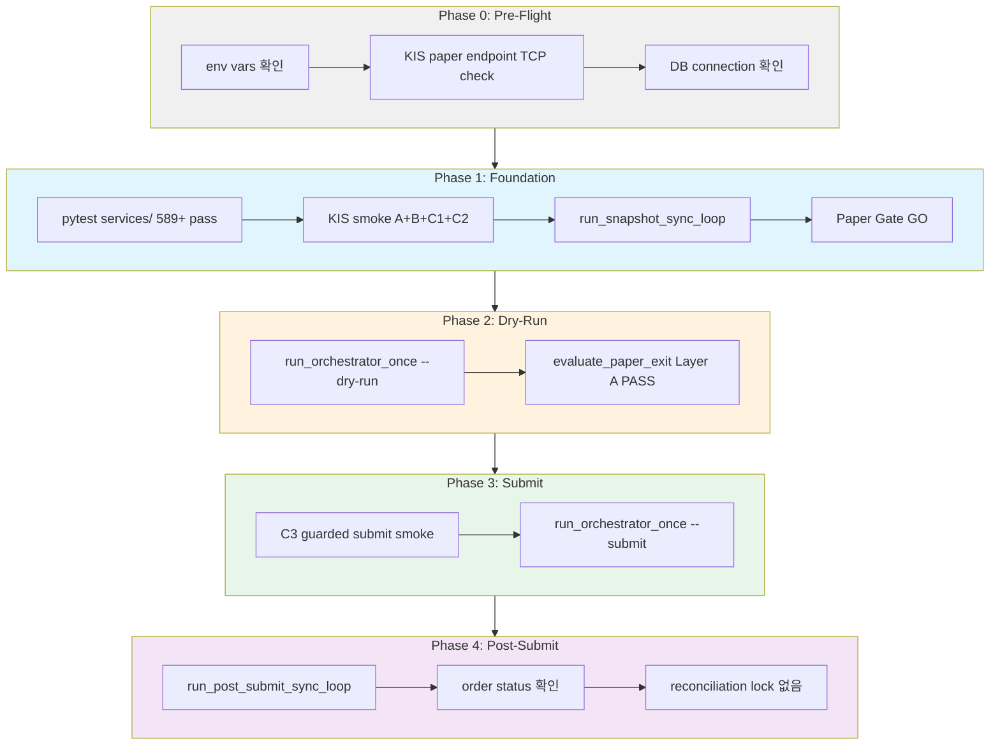

# KIS Paper 주문 실행 직전 Readiness 분석

> **목적**: 지금 상태에서 "paper 환경 실제 주문 1회 실행" 직전까지 무엇이 남았는지 inventory 확정.
>
> **4개 축 구분**: (1) credential readiness (2) connectivity readiness (3) submit smoke readiness (4) post-submit sync / inspection readiness
>
> **원칙**: 실제 주문을 보내지 않더라도, 보내기 직전까지의 체크리스트를 high-signal로 고정.
>
> **실행 모드 구분**: 이 문서는 **readiness 분석 및 절차 정의**입니다. 승인 후 다음 단계에서 Code 모드가 실제 명령을 실행합니다. 사용자가 수동으로 실행하거나, Roo/Codex에 실행용 프롬프트로 제공할 수 있습니다.

---

## 1. 현황 요약

구현 커버리지가 높고, 실제 잔여 gap은 **verification/execution 중심**입니다. 아래 4개 축 모두 코드 레벨에서는 준비되어 있으나, **실제 실행/검증**이 필요한 항목들이 남아 있습니다. (이 분석에서 '구현 완료'는 정성적 표현으로, 계량된覆盖率 수치가 아닙니다.)

| 축 | 코드 구현 | 실제 검증 필요 |
|----|----------|---------------|
| Credential | `KISRestClient._ensure_token()` — OAuth2 tokenP 발급 + dev token cache (paper) | ✅ KIS paper 환경 실제 credential 확인 필요 |
| Connectivity | `KISRestClient._request()` — httpx 기반 REST + endpoint auto-select by `kis_env` | ✅ paper endpoint (`openapivts:29443`) 실제 reachable 확인 |
| Submit Smoke | `KISRestClient.submit_order()` + adapter pre-validation + pipeline guardrails | ✅ `ENABLE_KIS_PAPER_SUBMIT_SMOKE=true` C3 통과 필요 |
| Post-Submit Sync | `OrderSyncService`, `run_post_submit_sync_loop.py`, Phase 5.5, WS notification | ✅ 실제 submit 이후 sync 정상 작동 검증 필요 |

---

## 2. 4개 축별 상세 분석

### 2.1 Credential Readiness

#### 현재 상태: ⚠️ 검증 필요

| 항목 | 상태 | 코드 위치 | 상세 |
|------|------|-----------|------|
| KIS_APP_KEY env var | ❓ 미확인 | [`settings.py:105-107`](src/agent_trading/config/settings.py:105) | `KIS_APP_KEY` 또는 `KIS_API_KEY` 필요 |
| KIS_APP_SECRET env var | ❓ 미확인 | [`settings.py:110-112`](src/agent_trading/config/settings.py:110) | `KIS_APP_SECRET` 또는 `KIS_API_SECRET` 필요 |
| KIS_ACCOUNT_NO env var | ❓ 미확인 | [`settings.py:115-117`](src/agent_trading/config/settings.py:115) | `KIS_ACCOUNT_NO` 또는 `KIS_ACCOUNT_NUMBER` 필요 |
| KIS_ENV = paper | ❓ 미확인 | [`settings.py:120-126`](src/agent_trading/config/settings.py:120) | 기본값 `paper`, live 아닌지 확인 |
| Token auto-issuance | ✅ 구현 | [`rest_client.py`](src/agent_trading/brokers/koreainvestment/rest_client.py) `_ensure_token()` | OAuth2 tokenP POST + 응답 파싱 완료 |
| Dev token cache | ✅ 구현 | [`rest_client.py`](src/agent_trading/brokers/koreainvestment/rest_client.py) | paper에서 `KIS_DEV_TOKEN_CACHE_ENABLED=true` 시 동작 |
| Rate limit budget (paper) | ✅ 구현 | [`rate_limit.py`](src/agent_trading/brokers/rate_limit.py) | paper RPS 1 (기본), `KIS_PAPER_REST_RPS` override 가능 |

**검증 방법**:
```bash
# 1. 환경변수 확인
echo "KIS_APP_KEY=${KIS_APP_KEY:0:8}..."  # 앞 8자리만 출력
echo "KIS_APP_SECRET=${KIS_APP_SECRET:0:8}..."
echo "KIS_ACCOUNT_NO=${KIS_ACCOUNT_NO}"
echo "KIS_ENV=${KIS_ENV}"

# 2. Python에서 설정 로드 확인
python3 -c "
from agent_trading.config.settings import AppSettings
s = AppSettings()
print(f'kis_api_key={\"***\" if s.kis_api_key else \"MISSING\"}')
print(f'kis_api_secret={\"***\" if s.kis_api_secret else \"MISSING\"}')
print(f'kis_account_number={s.kis_account_number}')
print(f'kis_env={s.kis_env}')
print(f'kis_paper_rest_rps={s.kis_paper_rest_rps}')
"
```

#### Blocking Condition
- `KIS_APP_KEY` / `KIS_APP_SECRET` 둘 중 하나라도 없으면 **BLOCKING** — broker adapter 생성 불가 (`bootstrap.py:83-89`)
- `KIS_ENV=live` 이면 **BLOCKING** — paper submit smoke 테스트는 paper 전용

---

### 2.2 Connectivity Readiness

#### 현재 상태: ⚠️ 검증 필요

| 항목 | 상태 | 코드 위치 | 상세 |
|------|------|-----------|------|
| KIS paper REST endpoint | ✅ 구현 | [`rest_client.py:43-46`](src/agent_trading/brokers/koreainvestment/rest_client.py:43) | `openapivts.koreainvestment.com:29443` auto-selected by `kis_env=paper` |
| KIS_BASE_URL override | ✅ 구현 | [`settings.py:230`](src/agent_trading/config/settings.py:230) | 필요 시 명시적 override 가능 |
| HTTPS connectivity | ❓ 미확인 | — | 실제 paper endpoint에 TCP/HTTPS 연결 가능 확인 필요 |
| OAuth token 발급 성공 | ❓ 미확인 | — | 최초 1회 tokenP POST 성공 필요 |
| WebSocket approval key | ❓ 미확인 | [`rest_client.py`](src/agent_trading/brokers/koreainvestment/rest_client.py) | WS 사용 시 필요하나 submit smoke에는 불필요 |
| DB connection (Postgres) | ❓ 미확인 | — | `DATABASE_URL` env var + `ensure_schema` + 마이그레이션 |
| DB schema migrations | ✅ 구현 | [`db/migrations/0011_add_snapshot_sync_runs.sql`](db/migrations/0011_add_snapshot_sync_runs.sql) | `run_all_migrations()` 자동 실행 |

**검증 방법**:
```bash
# 1. KIS paper endpoint connectivity (간단 TCP 체크)
python3 -c "
import socket
host = 'openapivts.koreainvestment.com'
port = 29443
sock = socket.create_connection((host, port), timeout=10)
print(f'{host}:{port} — 연결 성공')
sock.close()
"

# 2. Python에서 실제 KIS token 발급 시도 (최초 1회)
python3 -c "
import asyncio
from agent_trading.config.settings import AppSettings
from agent_trading.brokers.koreainvestment.rest_client import KISRestClient
from agent_trading.brokers.rate_limit import build_kis_budget_manager

async def test_token():
    s = AppSettings()
    bm = build_kis_budget_manager(kis_env=s.kis_env, real_rest_rps=15, paper_rest_rps=1)
    client = KISRestClient(
        api_key=s.kis_api_key, api_secret=s.kis_api_secret,
        account_number=s.kis_account_number, account_product_code='01',
        env=s.kis_env, base_url=s.kis_base_url, budget_manager=bm,
        dev_token_cache_enabled=False,
    )
    # _ensure_token is called lazily on first request
    # Test with a light GET: inquire_price
    try:
        price = await client.get_price('005930', 'KRX')
        print(f'Token 발급 성공 — price={price}')
    except Exception as e:
        print(f'Token 발급 실패: {e}')
    await client.close()

asyncio.run(test_token())
"

# 3. DB connection 확인
python3 -c "
import os
dsn = os.getenv('DATABASE_URL', '')
print(f'DATABASE_URL={\"***\" if dsn else \"MISSING\"}')
"
```

#### Blocking Condition
- `openapivts.koreainvestment.com:29443` unreachable → **BLOCKING** — broker 통신 불가
- Token 발급 실패 (잘못된 credential, 네트워크 차단) → **BLOCKING**
- `DATABASE_URL` 미설정 → **BLOCKING** — Postgres runtime 불가

---

### 2.3 Submit Smoke Readiness

#### 현재 상태: ✅ 구현 완료 + ⚠️ 검증 필요

> **C3 submit smoke 전제조건**: 아래 조건을 모두 충족해야 C3가 실행됩니다.
> - `KIS_APP_KEY`, `KIS_APP_SECRET`, `KIS_ACCOUNT_NO` — 3개 env var 필수
> - `KIS_ENV=paper` (미설정 시 기본값 paper, live면 C3 skip)
> - `ENABLE_KIS_PAPER_SUBMIT_SMOKE=true` — opt-in 플래그 필수
> - Snapshot sync 1회 이상 선행 실행 (stale guard 해소)
>
> **dry-run vs C3 submit smoke 차이**:
> - **dry-run**: `run_orchestrator_once --dry-run` — broker submit 없이 assemble + sizing만 실행. credential 불필요.
> - **C3 submit smoke**: `ENABLE_KIS_PAPER_SUBMIT_SMOKE=true` pytest — 실제 KIS paper endpoint로 submit. credential + opt-in 필수.

| 항목 | 상태 | 상세 |
|------|------|------|
| Safe order path E2E (7 tests) | ✅ 통과 | `test_safe_order_path_e2e.py` 7/7 pass |
| Sizing engine (37 tests) | ✅ 통과 | `test_sizing_engine.py` 37/37 pass |
| Pipeline tests (22 tests) | ✅ 통과 | `test_decision_submit_pipeline.py` 22/22 pass |
| 전체 서비스 테스트 | ✅ 통과 | 589/589 all green |
| Paper trading scenarios (6 tests) | ✅ 통과 | `test_paper_trading_scenarios.py` 6/6 pass |
| Replay 검증 (19 tests) | ✅ 통과 | `test_decision_replay.py` 19/19 pass |
| KIS paper AI runtime smoke A+B+C1+C2 | ✅ 통과 | credential 있으면 항상 실행, submit 없음 |
| **KIS paper submit smoke C3** | **❓ 미실행** | `ENABLE_KIS_PAPER_SUBMIT_SMOKE=true` 필요 |
| Paper Go/No-Go Gate | ✅ 통과 | 성과 데이터 기반 overall status 확인 필요 |
| Paper Exit Layer A | ✅ 통과 | evaluate_paper_exit.py 정상 실행 필요 |
| `run_orchestrator_once.py --dry-run` | ✅ 통과 | credential 있으면 assemble + sizing 까지 실행 |
| `run_orchestrator_once.py --submit` | **❓ 미실행** | 실제 broker submit 필요 |
| Snapshot sync 선행 실행 | **❓ 미확인** | `run_snapshot_sync_loop.py` 1회 이상 실행 필요 (stale guard) |

**검증 절차** (실행 순서):

```bash
# Step 1: Snapshot sync 선행 실행 (stale snapshot guard 해소)
python -m scripts.run_snapshot_sync_loop --count 1

# Step 2: Submit smoke C3 실행 (opt-in)
ENABLE_KIS_PAPER_SUBMIT_SMOKE=true \
  python -m pytest tests/smoke/test_kis_paper_ai_runtime_smoke.py \
  -v -k TestGuardedPaperSubmit

# Step 3: Paper Go/No-Go Gate 확인
python -c "
import asyncio
from agent_trading.runtime.bootstrap import postgres_runtime
from agent_trading.services.paper_gate import PaperGateService

async def check_gate():
    async with postgres_runtime() as (repos, settings):
        service = PaperGateService(repos, settings)
        eval_result = await service.evaluate(
            account_id='...',  # 실제 account UUID
            start_date='2026-04-01',
            end_date='2026-05-01',
        )
        print(f'Overall: {eval_result.overall_status}')

asyncio.run(check_gate())
"

# Step 4: run_orchestrator_once.py --dry-run (submit 없이 assemble + sizing)
python -m scripts.run_orchestrator_once --dry-run --output json

# Step 5: run_orchestrator_once.py --submit (실제 broker submit)
python -m scripts.run_orchestrator_once --submit --output json
```

#### Blocking Condition
- Snapshot sync가 한 번도 실행되지 않음 → **BLOCKING** (Phase 4c stale snapshot guard)
- Paper Gate `overall_status=NO_GO` → **BLOCKING** (성과/안정성 기준 미달)
- `ENABLE_KIS_PAPER_SUBMIT_SMOKE=true` 없이 submit 시도 → **BLOCKING** (guard가 차단)

---

### 2.4 Post-Submit Sync / Inspection Readiness

#### 현재 상태: ✅ 구현 완료

| 항목 | 상태 | 상세 |
|------|------|------|
| `OrderSyncService.sync_order_post_submit()` | ✅ 구현 | 3-step chain transition (SUBMITTED→FILLED) |
| Phase 5.5 submit 직후 sync | ✅ 구현 | timeout 5s, fire-and-forget |
| Post-submit sync scheduler | ✅ 구현 | `run_post_submit_sync_loop.py` (30s 간격) |
| WS fill notification fast-path | ✅ 구현 | `RealTimeEventLoop._handle_fill_notification()` |
| Snapshot refresh after fill | ✅ 구현 | FILLED terminal 감지 시 callback |
| Inspection API | ✅ 구현 | 주문/계좌/포지션/성과/게이트 전체 조회 가능 |
| Admin UI | ✅ 구현 | read-only operations dashboard |
| Reconciliation service | ✅ 구현 | blocking lock + resolve_unknown_state |
| BrokerOrderRepository.update() | ✅ 구현 | Postgres + InMemory |
| Fill dedup (broker_fill_id) | ✅ 구현 | two-tier dedup |

**검증 절차**:

```bash
# Inspection API로 submit 이후 상태 확인
# (실제 submit 후 실행)
curl -s http://localhost:8000/orders | python3 -m json.tool

# Post-submit sync scheduler 실행 (별도 terminal)
python -m scripts.run_post_submit_sync_loop --count 1 --output json

# Reconciliation 상태 확인 (inspection API)
curl -s http://localhost:8000/reconciliation/locks | python3 -m json.tool
```

#### Blocking Condition
- Post-submit sync 자체는 submit **후** 동작 — submit 직전 blocking 조건 아님
- 단, reconciliation lock 미해결 상태면 다음 submit이 **차단**됨

---

## 3. Blocking 항목 Inventory (Priority Map)

> **우선순위 정의 기준**:
> - **P0/P1/P2** = 실제 paper submit을 **직접 차단**하는 조건. 해결 전까지 submit 불가.
> - **P3** = submit 전 실행을 **강력 권장**. 차단은 아니지만, 실행하지 않으면 risk 증가.
> - **P4** = **편의/자동 해소** 항목. 사용자 개입 없이 시스템이 자동 처리.

| # | 항목 | 축 | 차단 강도 | 해결 조건 | 검증 명령어 |
|---|------|----|-----------|-----------|------------|
| **P0** | KIS paper credential 미설정 | Credential | **BLOCKING** | KIS_APP_KEY + KIS_APP_SECRET + KIS_ACCOUNT_NO 설정 | `echo ${KIS_APP_KEY:+SET}` |
| **P0** | KIS paper endpoint unreachable | Connectivity | **BLOCKING** | paper endpoint TCP 연결 성공 | `socket.connect openapivts:29443` |
| **P0** | KIS token 발급 실패 | Credential/Connectivity | **BLOCKING** | tokenP POST 성공 | 위 token test script |
| **P0** | DATABASE_URL 미설정 | Connectivity | **BLOCKING** | Postgres DSN 설정 | `echo ${DATABASE_URL:+SET}` |
| **P1** | Snapshot sync 미실행 | Submit Smoke | **BLOCKING** | 1회 이상 snapshot sync 실행 | `run_snapshot_sync_loop --count 1` |
| **P1** | Paper Gate NO_GO | Submit Smoke | **BLOCKING** | 성과 데이터 생성 or threshold 완화 | `evaluate()` 호출 |
| **P2** | Paper Exit Layer A FAIL | Submit Smoke | **BLOCKING** | FAIL 항목 해결 | `evaluate_paper_exit.py` 실행 |
| **P2** | Reconciliation lock 잔류 | Post-Submit | **차단 위험** | lock 해제 | `GET /reconciliation/locks` |
| **P3** | KIS paper submit smoke C3 미통과 | Submit Smoke | **강력 권장** | opt-in 후 실행 | `ENABLE_KIS_PAPER_SUBMIT_SMOKE=true pytest` |
| **P3** | run_orchestrator_once --dry-run 미실행 | Submit Smoke | **강력 권장** | dry-run 정상 확인 | `--dry-run --output json` |
| **P4** | Seed data 부재 | Submit Smoke | **자동 해소** | `_seed_if_empty()`가 자동 seeding | `run_orchestrator_once.py` 실행 시 자동 |
| **P4** | Rate limit budget 고갈 | Submit Smoke | **일시적** | budget refresh 대기 (1 token/s) | — |

> **DATABASE_URL 미설정이 P0 BLOCKING인 이유**:
> 현재 paper 주문 실행 경로는 [`postgres_runtime()`](src/agent_trading/runtime/bootstrap.py:426) 기반입니다. `run_orchestrator_once.py`, `run_paper_decision_loop.py`, submit smoke C3 모두 Postgres 컨텍스트에서 실행됩니다. Snapshot sync, Paper Gate, order persistence, reconciliation 등 모든 post-submit 인프라가 DB에 의존하므로, DATABASE_URL 없이는 paper submit 전체 경로가 동작하지 않습니다. (일부 smoke/dry-run은 in-memory runtime으로도 가능하지만, full paper submit readiness 기준에서는 blocking입니다.)

> **Paper Gate vs Paper Exit 차이**:
> - **Paper Gate** (`PaperGateService`): runtime/기간 성과 기반 **read-only gate**. 8개 지표(수익률/승률/Sharpe/Sortino/Calmar/주문수/snapshot freshness/lock)를 threshold 대비 평가하여 GO/HOLD/NO_GO 판정. 자동 평가, 변경 불가.
> - **Paper Exit** (`PaperExitEvaluator`): **상위 종합 자격 판정**. Paper Gate 결과를 Layer A로 재사용 + Layer B(Semi-Auto: 테스트/스크립트 실행) + Layer C(Manual: 운영자 판단) 포함. Layer A가 FAIL이면 종합 FAIL이지만, Paper Gate NO_GO가 반드시 Paper Exit FAIL은 아님 (gate가 HOLD여도 exit은 PASS 가능).
> - **둘 다 submit blocking**이지만 성격이 다름: Paper Gate는 **성과/안정성 기준** 미달, Paper Exit은 **종합 자격** 미달.

---

## 4. 최종 Smoke 경로 확정 (실행 순서)

### Phase 0: 사전 검증 (Pre-Flight Check)

> **Live 오발송 방지 확인**: 아래 명령을 실행하기 전에 반드시 Phase 0에서 KIS_ENV=paper, 계좌번호가 paper 계좌인지, endpoint가 paper인지 3중 확인하십시오.

```bash
# 4-1. 환경변수 일괄 확인 — paper env 확인 포함
echo "=== KIS Paper Readiness Pre-Flight ==="
echo "KIS_APP_KEY=${KIS_APP_KEY:0:8}... (${#KIS_APP_KEY} chars)"
echo "KIS_APP_SECRET=${KIS_APP_SECRET:0:8}... (${#KIS_APP_SECRET} chars)"
echo "KIS_ACCOUNT_NO=${KIS_ACCOUNT_NO}"
echo "KIS_ENV=${KIS_ENV:-paper}"
echo "DATABASE_URL=${DATABASE_URL:+SET}"
echo "LLM_PROVIDER=${LLM_PROVIDER:-deepseek}"

# 4-1b. paper env 3중 확인
echo "=== Live 오발송 방지 확인 ==="
echo "1. KIS_ENV = ${KIS_ENV:-paper}  (paper이어야 함)"
echo "2. 계좌번호 = ${KIS_ACCOUNT_NO}  (paper 계좌인지 육안 확인)"
echo "3. paper endpoint = openapivts.koreainvestment.com:29443"
echo "위 3개 중 하나라도 paper가 아니면 즉시 중단!"

# 4-2. KIS paper endpoint 연결 확인
python3 -c "
import socket
host, port = 'openapivts.koreainvestment.com', 29443
try:
    s = socket.create_connection((host, port), timeout=10)
    print(f'✅ {host}:{port} 연결 성공')
    s.close()
except Exception as e:
    print(f'❌ {host}:{port} 연결 실패: {e}')
"
```

### Phase 1: 기반 검증 (Foundation)

```bash
# 1-A. 전체 테스트 스위트 확인
pytest tests/services/ -v --tb=short -q | tail -5
# 기대: 589 passed (또는 그 이상)

# 1-B. KIS smoke (Scenario A+B+C1+C2) — submit 없음
pytest tests/smoke/test_kis_paper_ai_runtime_smoke.py -v --tb=short -q
# 기대: Scenario A runtime wiring + B assemble + C1/C2 pre-submit 모두 PASS

# 1-C. Snapshot sync 선행 실행 (stale guard 해소)
python -m scripts.run_snapshot_sync_loop --count 1 --output json
# 기대: completed_runs >= 1, last_run_success == true
```

### Phase 2: Dry-Run 검증 (No Broker Submit)

```bash
# 2-A. run_orchestrator_once.py --dry-run
python -m scripts.run_orchestrator_once --dry-run --output json
# 기대: assemble + sizing 성공, status=SKIPPED(dry_run), error_phase=null

# 2-B. Paper Gate 확인
python -m scripts.evaluate_paper_exit \
  --account-id $(python3 -c "from scripts.run_orchestrator_once import ACCOUNT_ID; print(ACCOUNT_ID)") \
  --start-date 2026-04-01 --end-date 2026-05-01 \
  --output json
# 기대: layers.auto.status == PASS
```

### Phase 3: Guarded Submit (Opt-In)

> **submit 성공 기준**: 아래 두 조건을 모두 충족해야 submit 성공으로 간주합니다.
> 1. `run_orchestrator_once --submit` 의 JSON 출력에서 `status=SUBMITTED` (또는 `status=FILLED` if immediate fill)
> 2. `broker_order_id != ""` (KIS ODNO 반환됨)
> 3. `error_phase=null`
>
> **예외 처리**: `status=RECONCILE_REQUIRED`는 submit 성공이 아닌 **follow-up required**입니다. 이 경우 Phase 5.5(post-submit sync)가 정상 동작했는지 확인하고, reconciliation lock을 해제해야 다음 submit이 가능합니다.
>
> **주의**: Phase 3 실행 전 반드시 Phase 0의 live 오발송 방지 확인을 재확인하십시오.

```bash
# 3-A. Submit smoke C3 (ENABLE_KIS_PAPER_SUBMIT_SMOKE=true)
ENABLE_KIS_PAPER_SUBMIT_SMOKE=true \
  python -m pytest tests/smoke/test_kis_paper_ai_runtime_smoke.py \
  -v --tb=short -k TestGuardedPaperSubmit
# 기대: C3 PASS (guarded actual submit to KIS paper)

# 3-B. 실제 단발 submit
python -m scripts.run_orchestrator_once --submit --output json
# 기대: status=SUBMITTED, broker_order_id != "", error_phase=null
```

### Phase 4: Post-Submit 검증

> **post-submit sync 성공 기준**: 아래 조건을 모두 충족해야 sync 성공으로 간주합니다.
> 1. `run_post_submit_sync_loop --count 1` 출력에서 `synced > 0` (처리된 주문 1건 이상)
> 2. `errors == 0`
> 3. Inspection API `GET /orders` 에서 최근 order의 `status`가 `SUBMITTED` 또는 `FILLED`
> 4. `GET /reconciliation/locks` 에서 blocking lock 0건
>
> sync 실패 시: Phase 5.5 timeout(5s)으로 post-submit sync가 fire-and-forget 실패했을 수 있습니다. `run_post_submit_sync_loop`를 재실행하거나, 수동 reconciliation을 수행하십시오.

```bash
# 4-A. Post-submit sync (직접 실행)
python -m scripts.run_post_submit_sync_loop --count 1 --output json
# 기대: synced > 0, errors == 0

# 4-B. Inspection API로 상태 확인
# GET /orders 에서 최근 order 상태 확인 (status=SUBMITTED or FILLED)
# GET /reconciliation/locks 에서 lock 없음 확인
```

---

## 5. 실행 체크리스트 (Checklist)

```markdown
## KIS Paper 1회 주문 실행 — 사전 체크리스트

### Phase 0: 환경 점검
- [ ] KIS_APP_KEY 설정됨
- [ ] KIS_APP_SECRET 설정됨
- [ ] KIS_ACCOUNT_NO 설정됨
- [ ] KIS_ENV=paper (또는 미설정)
- [ ] DATABASE_URL 설정됨
- [ ] paper endpoint TCP 연결 성공

### Phase 1: 기반 검증
- [ ] 전체 서비스 테스트 통과 (589+ passed)
- [ ] KIS smoke A+B+C1+C2 통과 (submit 없음)
- [ ] Snapshot sync 1회 이상 실행
- [ ] Paper Gate overall_status == GO
- [ ] Paper Exit Layer A == PASS

### Phase 2: Dry-Run
- [ ] run_orchestrator_once --dry-run 정상 종료 (exit 0)
- [ ] assemble() 성공 (OrderIntent 생성)
- [ ] sizing engine 정상 수량 계산

### Phase 3: Submit (Opt-In)
- [ ] C3 guarded submit smoke 통과
- [ ] run_orchestrator_once --submit 정상 종료 (exit 0)
- [ ] broker_order_id 반환 확인 (ODNO != "")

### Phase 4: Post-Submit
- [ ] run_post_submit_sync_loop 정상 실행
- [ ] order 상태 SUBMITTED 또는 FILLED 확인
- [ ] reconciliation lock 없음 확인
```

---

## 6. Mermaid: 실행 흐름



---

## 7. 결정 포인트 (의사결정 필요)

| # | 결정 사항 | 선택지 | 권장 |
|---|---------|--------|------|
| 1 | `run_orchestrator_once.py --submit` 실행 전 C3 smoke 선행 여부 | (a) C3 먼저 실행 후 submit / (b) 바로 submit | **(a)** — safety first |
| 2 | Paper Gate threshold 완화 여부 | (a) 기본 threshold 유지 / (b) 필요시 완화 | **(a)** — 실제 성과 데이터 보고 판단 |
| 3 | 주문 대상 종목 | 005930(Samsung) 기본값 유지 vs 실제 전략 종목 | 기본값 유지 (검증 목적) |
| 4 | Snapshot sync 실행 후 stale guard 대기 시간 | 900s(15분) 기본 유지 vs 축소 | 기본 유지 |
