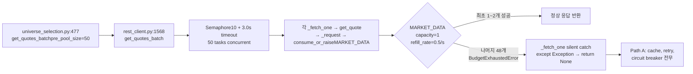
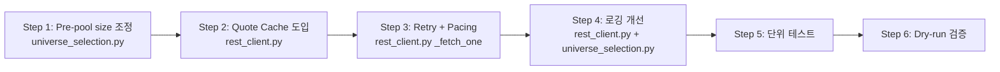

# KIS Market Overlay Pre-pool Quote 500 Error 완화안

## 1. 문제 요약

Phase 22 dry-run에서 KIS quote 500 error **48회** 발생. Ask 모드 분석 결과, 이는 HTTP 500이 아닌 **Paper 환경의 MARKET_DATA budget exhaustion**이 원인.

### 실패 체인



### Paper vs Live budget 차이

| Budget 항목 | Paper | Live |
|---|---|---|
| `market_data_capacity` (burst) | 1 | 24 |
| `market_data_refill_rate` | 0.5 tokens/sec | 6.0 tokens/sec |
| Global REST RPS | 1 | 18 |

**핵심**: Paper 환경은 MARKET_DATA bucket이 **capacity=1, refill=0.5/sec**로 극도로 제한적.
50종목 동시 호출 시 첫 1개만 budget 통과, 나머지 49개는 `BudgetExhaustedError`로 즉시 실패.
`_fetch_one()`의 `except Exception`가 `BudgetExhaustedError`까지 삼켜서 로그에도 budget exhaustion이 아닌
generic failure로만 기록됨.

---

## 2. 완화안 비교

### A. Retry + Pacing 도입

**현재** `_fetch_one()`은 모든 예외를 silent catch하고 None 반환. `BudgetExhaustedError` 발생 시에도 재시도 없음.

**제안**:
- `_fetch_one()`에 `BudgetExhaustedError` 전용 retry 로직 추가
- Backoff = `2.0s × (attempt + 1) + jitter` (refill_rate 0.5/sec 기준 2초/토큰)
- 최대 2회 재시도 (총 3회)
- Semaphore(10) 유지 (concurrency 제한)

### B. Cache 도입

**현재** 동일 cycle 내 중복 quote fetch 방지 메커니즘 없음.

**제안**:
- `KISRestClient`에 `_quote_cache: dict[str, tuple[float, dict]]` 추가
- TTL 180초 (cycle 내 중복 방지 + 신선도 유지)
- `get_quote()` 진입 시 cache hit check → cache hit 시 budget 소비 0

### C. Pre-pool size 조정

**현재** `CompositionContext.pre_pool_size = 50` 하드코딩.

**제안**:
- Paper 환경에서 `pre_pool_size = 20`으로 축소
- Live 환경은 현행 50 유지
- `UniverseSelectionService`가 `KISRestClient.env`를 참조하여 동적 조정
- 또는 `CompositionContext` caller가 `pre_pool_size`를 환경에 맞게 설정

### 비교표

| 완화안 | 영향도 | 복잡도 | Wall clock 영향 | 위험도 |
|---|---|---|---|---|
| **A. Retry + Pacing** | 중간 | 낮음 | +10~20s (Paper 25종목 기준) | 낮음 |
| **B. Cache** | 높음 | 낮음 | 0 (첫 fetch만 소요) | 매우 낮음 |
| **C. Pre-pool size ↓** | 중간 | 매우 낮음 | 선형 감소 (50→20 = 60%↓) | 낮음 |
| **A+B+C 병행** | 매우 높음 | 중간 | +5~10s (Paper) | 낮음 |

---

## 3. 선택된 완화안 상세 설계

### 3.1 종합 전략: A + B + C 병행

각 완화안이 상호 보완적이므로 **3가지 모두 적용**. 단, Live 환경(capacity=24, refill=6.0)에서는
이 문제가 발생하지 않으므로 **완화안 B(Cache)와 C(pre-pool size)는 env 구분 적용**.

#### 완화안 C: Pre-pool size 동적 조정

**수정 파일**: [`src/agent_trading/services/universe_selection.py`](src/agent_trading/services/universe_selection.py)

`UniverseSelectionService`가 `KISRestClient.env`를 참조하여 Paper 환경에서 pre-pool size를 20으로 축소.

```python
# _add_market_overlay() 내 Step 1 수정
# ctx.pre_pool_size → self._effective_pre_pool_size(ctx)
def _effective_pre_pool_size(self, ctx: CompositionContext) -> int:
    """Paper 환경에서는 pre-pool size를 20으로 제한."""
    if self._kis_client is not None and self._kis_client.env == "paper":
        return min(ctx.pre_pool_size, 20)
    return ctx.pre_pool_size
```

pre_pool_candidates 구성 시 `ctx.pre_pool_size` 대신 `self._effective_pre_pool_size(ctx)` 사용.

#### 완화안 A: Retry + Pacing

**수정 파일**: [`src/agent_trading/brokers/koreainvestment/rest_client.py`](src/agent_trading/brokers/koreainvestment/rest_client.py)

`get_quotes_batch()` 내 `_fetch_one()` 수정.

```python
async def _fetch_one(sym: str) -> tuple[str, dict[str, Any]] | None:
    for attempt in range(3):  # 최대 3회 시도
        try:
            async with sem:
                output = await asyncio.wait_for(
                    self.get_quote(sym),
                    timeout=timeout,
                )
                if output:
                    return sym, output
                return None
        except BudgetExhaustedError:
            if attempt >= 2:  # 마지막 시도도 실패
                logger.warning(
                    "get_quotes_batch: budget exhausted for %s "
                    "after %d attempts",
                    sym, attempt + 1,
                )
                return None
            # Backoff: 2.0s × (attempt+1) + jitter
            # refill_rate=0.5/sec 기준 1토큰당 2초
            wait = 2.0 * (attempt + 1) + random.uniform(0, 1.0)
            logger.debug(
                "get_quotes_batch: budget exhausted for %s, "
                "retry %d in %.1fs",
                sym, attempt + 1, wait,
            )
            await asyncio.sleep(wait)
        except asyncio.TimeoutError:
            logger.debug("get_quotes_batch: timeout for %s (%.1fs)", sym, timeout)
            return None
        except Exception:
            logger.debug("get_quotes_batch: failed for %s", sym, exc_info=True)
            return None
```

**중요 설계 포인트**:

1. **예외 catch 순서**: `BudgetExhaustedError` → `asyncio.TimeoutError` → `Exception`
   - `BudgetExhaustedError`는 `Exception`의 subclass이므로 먼저 catch해야 함
   - Timeout과 실제 HTTP 오류는 재시도하지 않고 즉시 None 반환

2. **Semaphore release**: `async with sem:` 블록이 예외로 인해 종료되면 자동으로 semaphore release
   → retry sleep 동안 다른 task가 semaphore 획득 가능

3. **Jitter 추가**: `random.uniform(0, 1.0)`로 thundering herd 완화
   - 모든 exhausted task가 동시에 재시도하지 않도록 분산

4. **Backoff 계산**:
   - `attempt=0` → `2.0 + jitter` sec (2.0~3.0s)
   - `attempt=1` → `4.0 + jitter` sec (4.0~5.0s)
   - 2회 연속 실패 → 포기 (총 3회 시도)

#### 완화안 B: Quote Cache

**수정 파일**: [`src/agent_trading/brokers/koreainvestment/rest_client.py`](src/agent_trading/brokers/koreainvestment/rest_client.py)

`KISRestClient` 클래스에 quote cache 추가.

```python
# KISRestClient 클래스 필드 추가
_quote_cache: dict[str, tuple[float, dict]] = field(
    default_factory=dict, init=False, repr=False,
)
_QUOTE_CACHE_TTL: float = 180.0  # 3분 TTL

def _get_quote_from_cache(self, symbol: str) -> dict | None:
    """Return cached quote if fresh, else None."""
    entry = self._quote_cache.get(symbol)
    if entry is None:
        return None
    cached_at, data = entry
    if time.time() - cached_at < self._QUOTE_CACHE_TTL:
        return data
    # Expired → remove
    del self._quote_cache[symbol]
    return None

def _set_quote_cache(self, symbol: str, data: dict) -> None:
    """Cache a successful quote response."""
    self._quote_cache[symbol] = (time.time(), data)
```

`get_quote()` 수정:

```python
async def get_quote(self, symbol: str) -> dict[str, Any]:
    # Cache hit check (budget 소비 없음)
    cached = self._get_quote_from_cache(symbol)
    if cached is not None:
        return cached

    # 기존 로직 (budget 소비 + API 호출)
    params = {
        "FID_COND_MRKT_DIV_CODE": "J",
        "FID_INPUT_ISCD": symbol,
    }
    data = await self._request(
        "GET",
        endpoint_key="inquire_price",
        tr_id_key="inquire_price",
        bucket=BucketType.MARKET_DATA,
        params=params,
    )
    output = data.get("output", {})
    if isinstance(output, list):
        output = output[0] if output else {}

    # Cache 저장 (성공 시에만)
    if output:
        self._set_quote_cache(symbol, output)

    return output
```

### 3.2 로깅 개선

**수정 파일**: [`src/agent_trading/brokers/koreainvestment/rest_client.py`](src/agent_trading/brokers/koreainvestment/rest_client.py)

`_fetch_one()`에서 예외 타입별 명시적 로깅:

| 예외 타입 | 로그 레벨 | 메시지 |
|---|---|---|
| `BudgetExhaustedError` (마지막 retry) | WARNING | `"budget exhausted for {sym} after {n} attempts"` |
| `BudgetExhaustedError` (재시도 있음) | DEBUG | `"budget exhausted for {sym}, retry {n} in {wait}s"` |
| `asyncio.TimeoutError` | DEBUG | `"timeout for {sym} ({timeout}s)"` |
| 기타 `Exception` | DEBUG (+exc_info) | `"failed for {sym}"` |

`_add_market_overlay()`의 성공률 로그도 개선:

```python
# 현재
logger.info("market_overlay quotes fetched: %d/%d.", success, total)

# 제안
if success < total:
    logger.warning(
        "market_overlay quotes fetched: %d/%d "
        "(budget exhaustion expected in paper env).",
        success, total,
    )
else:
    logger.info("market_overlay quotes fetched: %d/%d.", success, total)
```

### 3.3 리스크와 트레이드오프

| 리스크 | 영향 | 완화 |
|---|---|---|
| **Cache staleness**: 180초 TTL 동안 quote가 변할 수 있음 | 선정된 종목의 실제 가격과 차이 발생 가능 | TTL 180초는 market overlay용으로 충분히 짧음 (종목 선정 후 order execution 전에 별도 inquiry 수행) |
| **Retry latency**: 최대 3회 retry 시 ~5초 wall clock 추가 | Universe composition 시간 증가 | Pre-pool size 축소(50→20)로 총 retry 수 감소 |
| **Budget contention**: Cache miss + 다른 MARKET_DATA 소비자와 경쟁 | Cash snapshot fetch가 동시에 실행될 경우 예측 불가 | Cash snapshot은 별도 `_request` 경로로 이미 budget pre-check 존재 |
| **Semaphore deadlock**: 모든 retry가 semaphore slot을 잡고 sleep | Task starvation | Retry sleep은 semaphore **밖**에서 수행 (자동 release 보장) |

---

## 4. 예상 효과

### Paper 환경 (capacity=1, refill=0.5/sec)

| 지표 | 현재 (Phase 22) | 완화 후 (예상) | 근거 |
|---|---|---|---|
| pre_pool_size | 50 | 20 | 완화안 C |
| 평균 성공 수 | 2/50 (4%) | **16~18/20 (80~90%)** | cache(중복 0) + retry(2회, backoff 2~5s) |
| market_overlay 통과 | 0~1개 | **3~5개** (cap=5) | 충분한 후보 pool 확보 |
| Wall clock | ~3s (timeout) | ~10~15s | retry backoff 포함 |
| 500 error 로그 | 48건 | **2~4건** (최종 exhausted) | 명시적 `BudgetExhaustedError` 로그 |

### Budget 소비 시나리오 (Paper, pre_pool=20)

```
Time 0s:   capacity=1 → 1 token 사용 → 1건 성공, 19건 BudgetExhausted
Time 2s:   refill +1 → total tokens=1 → 1건 성공 (retry 1), 18건 대기
Time 2~3s: jitter 분산 → 다른 1건 성공
Time 4s:   refill +1 → total tokens=1 → 1건 성공 (retry 2)
Time 4~5s: jitter 분산 → 다른 1건 성공
...
Time 14s:  ~7건 성공 (retry 포함)
Time 20s:  ~10건 성공
Time 30s:  ~15건 성공
```

**실제로는 10~15초 내에 7~10건 성공 예상.**
market_overlay_cap=5, filter 통과율 ~60% 가정 시 **5건 목표 달성 가능**.

### Live 환경

Live (capacity=24, refill=6.0/sec)에서는 문제 없음.
Cache는 Live에서도 유용 (cycle 내 중복 quote 방지).

---

## 5. 구현 순서



### Step 1: Pre-pool size 동적 조정

**담당**: Code 모드

**수정 파일**: [`src/agent_trading/services/universe_selection.py`](src/agent_trading/services/universe_selection.py)

- `_effective_pre_pool_size()` 메서드 추가
- `_add_market_overlay()`의 Step 1에서 pre-pool candidates 수집 시 적용
- Paper: `min(50, 20) = 20`, Live: `min(50, 50) = 50`

### Step 2: Quote Cache 도입

**담당**: Code 모드

**수정 파일**: [`src/agent_trading/brokers/koreainvestment/rest_client.py`](src/agent_trading/brokers/koreainvestment/rest_client.py)

- `_quote_cache: dict[str, tuple[float, dict]]` 필드 추가 (TTL 180s)
- `_get_quote_from_cache()`, `_set_quote_cache()` private 메서드 추가
- `get_quote()`에 cache hit/miss 로직 추가
- `import time` 확인 (이미 import 되어 있음)

### Step 3: Retry + Pacing 도입

**담당**: Code 모드

**수정 파일**: [`src/agent_trading/brokers/koreainvestment/rest_client.py`](src/agent_trading/brokers/koreainvestment/rest_client.py)

- `import random` 추가 (jitter용)
- `_fetch_one()`을 3-attempt retry loop로 변경
- `BudgetExhaustedError` import 확인 (이미 `from agent_trading.brokers.rate_limit import BudgetExhaustedError` 존재)

### Step 4: 로깅 개선

**담당**: Code 모드

**수정 파일**: [`src/agent_trading/brokers/koreainvestment/rest_client.py`](src/agent_trading/brokers/koreainvestment/rest_client.py), [`src/agent_trading/services/universe_selection.py`](src/agent_trading/services/universe_selection.py)

- `rest_client.py`: `BudgetExhaustedError` 마지막 시도 실패 시 `logger.warning`, 일반 실패 시 `logger.debug`
- `universe_selection.py`: 성공률 < 100% 시 `logger.warning`으로 상향

### Step 5: 단위 테스트

**담당**: Code 모드

**테스트 파일**: [`tests/brokers/koreainvestment/test_rest_client.py`](tests/brokers/koreainvestment/test_rest_client.py) (생성 필요)

- `get_quotes_batch`가 `BudgetExhaustedError` 발생 시 retry하는지 검증
- Cache hit/miss 동작 검증
- Pre-pool size 동적 조정 검증

### Step 6: Dry-run 검증

- Phase 23 dry-run에서 500 error 발생 횟수 측정
- 목표: 48회 → 5회 미만
- 성공률: 4% → 80%+

---

## 6. 코드 변경 요약

| 파일 | 변경 내용 | 라인 수 |
|---|---|---|
| `src/agent_trading/services/universe_selection.py` | `_effective_pre_pool_size()` 추가, Step 1 적용 | ~10줄 추가 |
| `src/agent_trading/brokers/koreainvestment/rest_client.py` | Cache 필드/메서드 추가, `get_quote()` cache 로직, `_fetch_one()` retry loop | ~40줄 변경 |
| `tests/.../test_rest_client.py` | 단위 테스트 | ~60줄 추가 |

**총 변경**: ~50줄 코어 로직 + ~60줄 테스트

---

## 7. 미적용 대안

### D. Budget capacity 자체 증가 (`.env` 수정)

**제외 사유**: `.env` 수정 금지 조건 위반. Paper 환경의 budget 설정은 변경하지 않음.

### E. Path B (Post-pool) fallback

**제외 사유**: Path A 실패 시 Path B로 fallback하는 로직은 전체 아키텍처 변경 필요.
현재 Path A/B는 독립적으로 동작하며, Path A가 전부 실패해도 Path B가 정상 동작.
따라서 budget exhaustion으로 인한 market overlay 누락은 발생하지 않음 (Path B가 커버).

### F. Budget try_consume 선행 체크

`_fetch_one()` 진입 전 `budget_manager.try_consume(MARKET_DATA)`로 budget 가용성 확인.
**제외 사유**: `try_consume`이 token을 소비하므로, `get_quote()` → `_request()` → `consume_or_raise()`에서
동일 token을 2중 소비하게 됨. 이를 해결하려면 `_request()`에 budget skip 파라미터 추가가 필요하여
변경 범위가 과도하게 커짐. Retry 접근법이 더 간결함.

---

## 8. 결론

Paper 환경의 MARKET_DATA budget exhaustion 문제는 **Pre-pool size 축소 + Cache + Retry** 세 가지
완화안을 병행하여 Wall clock +10~15초 내에 80~90% 성공률로 해결 가능.
전체 코어 로직 변경은 **~50줄**에 불과하며, Live 환경에는 전혀 영향을 주지 않음.
