# KIS REST Strict Global Cap — 2-Tier Token Bucket Enforcement

## 1. 목적

KIS REST API 요청이 per-bucket safety scaling 위에 **전체 REST 상한**(실전 18 RPS, 모의 1 RPS)을
실제로 넘지 않도록 강제한다.

## 2. 현재 상태 분석

### 2.1 현재 budget flow

```
KISRestClient._request()
  └─ self.budget_manager.consume_or_raise(bucket)  # per-bucket only
  └─ circuit breaker
  └─ HTTP request (httpx)
```

[`RateLimitBudgetManager`](src/agent_trading/brokers/rate_limit.py:117)는 5개 per-bucket
(AUTH, ORDER, INQUIRY, MARKET_DATA, RECONCILIATION)을 독립적으로 운영한다.

[`build_kis_budget_manager()`](src/agent_trading/brokers/rate_limit.py:351)는 환경별 RPS를
**safety scaling baseline**으로 사용하지만, **strict global cap은 아니다**:

| 환경 | 총 RPS | Per-bucket 합계 | 비고 |
|------|--------|-----------------|------|
| Paper (1 RPS) | 1 | ~1.217 | auth 0.017 + order 0.1 + inquiry 0.5 + md 0.5 + recon 0.1 |
| Live (18 RPS) | 18 | ~15.72 | scale=1.2 기준, 18 RPS 미달 |
| Live override 30 RPS | 30 | ~26.2 | scale=2.0 기준, 실전 18 RPS **초과 가능** |

### 2.2 문제점

- **env override**로 RPS를 높게 설정하면 per-bucket 합계가 실전 18 RPS를 초과할 수 있음
- 현재는 per-bucket별 safety scaling만 있고, **aggregate total을 강제하는 장치가 없음**
- KIS 공식 notice (2026-04-20) 상 REST는 계좌당 초당 N건으로 제한

## 3. 설계 결정: 2-Tier Token Bucket

### 3.1 구조

```
Request → Tier 1: Global REST Bucket (total RPS)
                    ↓ (통과)
          Tier 2: Per-operation Bucket (auth/order/inquiry/md/recon)
                    ↓ (통과)
          HTTP Request
```

### 3.2 변경 포인트

**단 2개 클래스**: [`RateLimitBudgetManager`](src/agent_trading/brokers/rate_limit.py:117) +
[`build_kis_budget_manager`](src/agent_trading/brokers/rate_limit.py:351)

#### 3.2.1 `BucketType`에 `REST_GLOBAL` 추가

```python
class BucketType(str, Enum):
    AUTH = "auth"
    ORDER = "order"
    INQUIRY = "inquiry"
    RECONCILIATION = "reconciliation"
    MARKET_DATA = "market_data"
    REST_GLOBAL = "global"  # ← 추가
```

#### 3.2.2 `RateLimitBudgetManager`에 global bucket 필드 추가

```python
@dataclass(slots=True)
class RateLimitBudgetManager:
    session_id: UUID
    # --- Existing buckets ---
    order: OperationBucket
    inquiry: OperationBucket
    reconciliation: OperationBucket
    market_data: OperationBucket
    auth: OperationBucket
    # --- New global bucket ---
    global_rest: OperationBucket | None = None  # None = disabled
```

`__init__`에 파라미터 추가:
```python
def __init__(
    self,
    ...,
    global_rest_capacity: int = 0,         # 0 = disabled
    global_rest_refill_rate: float = 0.0,
):
```

`global_rest_capacity <= 0`이면 global bucket 미생성 (`self.global_rest = None`).

#### 3.2.3 `consume_or_raise()` 2-tier enforcement

```python
def consume_or_raise(self, bucket: BucketType, tokens: int = 1) -> None:
    # Tier 1: global REST gate
    if self.global_rest is not None:
        if not self.global_rest.try_consume(tokens):
            raise BudgetExhaustedError(
                bucket="global",
                message=f"Global REST cap exhausted "
                        f"(remaining={self.global_rest.remaining}/{self.global_rest.capacity})",
            )
    # Tier 2: per-operation bucket
    if not self.try_consume(bucket, tokens):
        b = self._bucket(bucket)
        raise BudgetExhaustedError(
            bucket=bucket.value,
            message=(
                f"Bucket '{bucket.value}' exhausted "
                f"(remaining={b.remaining}/{b.capacity})"
            ),
        )
```

`try_consume()`은 변경하지 않음 — reconciliation reserve 등 다른 경로에 영향 없음.

#### 3.2.4 `snapshot()`에 global bucket 추가

```python
def snapshot(self) -> dict[str, Any]:
    result = {
        "session_id": str(self.session_id),
        "order": { ... },
        "inquiry": { ... },
        "reconciliation": { ... },
        "market_data": { ... },
        "auth": { ... },
    }
    if self.global_rest is not None:
        result["global"] = {
            "remaining": self.global_rest.remaining,
            "capacity": self.global_rest.capacity,
            "refill_rate": self.global_rest.refill_rate,
            "utilization": self.global_rest.utilization,
        }
    result["can_accept_new_entries"] = self.can_accept_new_entries
    return result
```

#### 3.2.5 `build_kis_budget_manager()`에 global bucket 생성

Paper env:
```python
return RateLimitBudgetManager(
    ...,
    global_rest_capacity=max(1, int(total * 1)),  # = 1
    global_rest_refill_rate=1.0 * total,            # = 1.0
)
```

Live env:
```python
return RateLimitBudgetManager(
    ...,
    global_rest_capacity=max(1, int(total * 1)),  # = 18 (또는 custom)
    global_rest_refill_rate=1.0 * total,            # = 18.0 (또는 custom)
)
```

`total`은 이미 `max(1, paper_rest_rps)` 또는 `max(1, real_rest_rps)`로 계산된 값.

### 3.3 수정하지 않는 것

| 파일 | 이유 |
|------|------|
| [`rest_client.py`](src/agent_trading/brokers/koreainvestment/rest_client.py) | `_request()`가 이미 `consume_or_raise()` 호출 — 변경 불필요 |
| [`bootstrap.py`](src/agent_trading/runtime/bootstrap.py) | `build_kis_budget_manager()`가 global bucket 포함 → 변경 불필요 |
| [`broker_capacity.py`](src/agent_trading/api/routes/broker_capacity.py) | snapshot()에 global 필드가 자동 포함됨 → 변경 불필요 |
| [`schemas.py`](src/agent_trading/api/schemas.py) | `rest_budget: dict[str, BucketSnapshot]`이 global 필드도 자동 포함 |
| broker submit semantics | 변경 없음 |
| admin UI | 변경 없음 |

### 3.4 `_request_with_fallback()` 영향

[`_request_with_fallback()`](src/agent_trading/brokers/koreainvestment/rest_client.py:1103)은
`_request()` → `consume_or_raise()`를 호출하므로 global bucket 체크가 자동 적용됨.

실패 시나리오:
1. global bucket empty → `BudgetExhaustedError("global")` → caught → reserve reconciliation → retry
2. retry도 global bucket empty → `BudgetExhaustedError("global")` → propagates

이는 올바른 동작 — global cap이 소진되면 reconciliation도 진행할 수 없음.

### 3.5 기존 테스트 영향

| 테스트 | 영향 | 이유 |
|--------|------|------|
| [`test_rate_limit.py`](tests/brokers/test_rate_limit.py) | 영향 없음 | `build_kis_budget_manager()` snapshot에 `"global"` 키만 추가됨 |
| [`test_budget_exhaustion.py`](tests/brokers/test_budget_exhaustion.py) | 영향 없음 | `RateLimitBudgetManager()` 직접 생성 시 global_rest_capacity=0 (disabled) |
| [`test_kis_auth_strict_cap.py`](tests/brokers/test_kis_auth_strict_cap.py) | 영향 없음 | auth mock 기반, budget_manager 없거나 default |
| [`test_broker_capacity.py`](tests/api/test_broker_capacity.py) | snapshot에 global 필드 추가 | mock 기반 — mock_subscription_budget fixture 영향 없음 |

## 4. 변경 파일 목록

### 4.1 [`rate_limit.py`](src/agent_trading/brokers/rate_limit.py)

1. `BucketType`에 `REST_GLOBAL = "global"` 추가
2. `RateLimitBudgetManager.__init__()`에 `global_rest_capacity`, `global_rest_refill_rate` 파라미터 추가
3. `consume_or_raise()`에 Tier 1 global bucket 체크 추가
4. `_bucket()`에 REST_GLOBAL 매핑 추가 (snapshot에서 사용)
5. `snapshot()`에 global bucket state 추가
6. `build_kis_budget_manager()`에서 global bucket 생성

### 4.2 [`test_rate_limit.py`](tests/brokers/test_rate_limit.py)

`TestBuildKisBudgetManager`에 테스트 추가:
- `test_global_bucket_paper_default` — paper env global cap = 1 RPS
- `test_global_bucket_live_default` — live env global cap = 18 RPS
- `test_global_bucket_custom_rps` — custom RPS override 시 global bucket scaling
- `test_global_bucket_exhausted_blocks_operation` — global empty → consume_or_raise() 실패
- `test_global_bucket_operation_bucket_exhausted_independently` — global OK, per-bucket empty → 실패
- `test_global_bucket_disabled_by_default` — `RateLimitBudgetManager()` 직접 생성 시 global None

## 5. Mermaid: 변경 범위

```mermaid
flowchart LR
    subgraph 변경
        A["rate_limit.py<br/>BucketType.REST_GLOBAL"]
        B["rate_limit.py<br/>RateLimitBudgetManager<br/>+ global_rest bucket"]
        C["rate_limit.py<br/>consume_or_raise&#40;&#41;<br/>2-tier enforcement"]
        D["rate_limit.py<br/>build_kis_budget_manager&#40;&#41;<br/>+ global bucket params"]
        E["rate_limit.py<br/>snapshot&#40;&#41;<br/>+ global state"]
    end

    subgraph 변경불필요
        F["rest_client.py<br/>_request&#40;&#41; → consume_or_raise&#40;&#41;<br/>자동 적용"]
        G["bootstrap.py<br/>build_kis_budget_manager&#40;&#41; 호출<br/>자동 적용"]
        H["broker_capacity.py<br/>snapshot&#40;&#41; dict순회<br/>global 자동 포함"]
    end
```



## 6. 검증 항목

1. `tests/brokers/test_rate_limit.py` — 7개 (기존 6 + 신규 1) 통과
2. `tests/brokers/test_budget_exhaustion.py` — 5개 통과 (회귀 없음)
3. `tests/brokers/test_kis_websocket.py` — 46개 통과 (회귀 없음)
4. `tests/brokers/test_kis_adapter_validation.py` — 14개 통과 (회귀 없음)
5. `tests/brokers/` 전체 — 122+ 통과
6. `tests/api/test_broker_capacity.py` — 6개 통과

## 7. `/broker-capacity` inspection 반영

변경 후 snapshot 구조 (paper 예):

```json
{
  "session_id": "...",
  "auth": { "remaining": 1, "capacity": 1, ... },
  "order": { "remaining": 1, "capacity": 1, ... },
  "inquiry": { "remaining": 1, "capacity": 1, ... },
  "market_data": { "remaining": 1, "capacity": 1, ... },
  "reconciliation": { "remaining": 1, "capacity": 1, ... },
  "global": {                         // ← 신규
    "remaining": 1,
    "capacity": 1,
    "refill_rate": 1.0,
    "utilization": 1.0
  },
  "can_accept_new_entries": true
}
```

`broker_capacity.py`는 이미 `rest_budget` dict를 순회하며 `BucketSnapshot`으로 변환하므로,
global 필드가 자동으로 포함된다. `schemas.py` 수정 불필요.

## 8. 문서 정리

- [`plans/kis_capability_followup.md`](plans/kis_capability_followup.md) 후속 #3 → ✅ 완료로 업데이트
- [`plan_docs/detailed_design/10_broker_rate_limit_and_capacity_policy.md`](plan_docs/detailed_design/10_broker_rate_limit_and_capacity_policy.md) §14.6 → 구현 완료 반영

## 9. 남은 후속 작업

**WebSocket 1-session strict enforcement** — KIS WebSocket은 단일 세션(single connection)으로
모든 channel을 처리해야 하며, session 중복 또는 channel 간 간섭을 방지하는 정책이 아직 문서만 있음.
현재 `KISWebSocketClient`는 다중 세션을 막지 않음.
