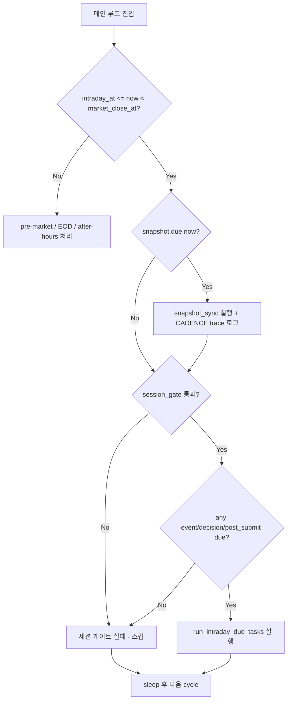

# KIS Snapshot Sync Cadence 리팩토링 — 구현 계획 (v1.0)

## 1. 개요

현재 `_run_intraday_due_tasks()`가 snapshot_sync → event_ingestion → decision_submit_gate → post_submit_sync를 **순차 실행**합니다. `decision_submit_gate`의 장기 timeout(600s)이 snapshot cadence를 붕괴시키는 구조적 위험을 제거합니다.

## 2. 변경 사항 상세

---

### 변경 1: [P0] snapshot due 체크를 메인 루프로 분리

**파일**: [`scripts/run_near_real_ops_scheduler.py`](scripts/run_near_real_ops_scheduler.py)

#### 1-A: `ScheduledTask`에 `last_run_at` 필드 추가 (≈라인 146)

```python
@dataclass(slots=True)
class ScheduledTask:
    """Periodic task state."""
    name: str
    interval_seconds: int
    next_run_at: datetime
    last_run_at: datetime | None = None  # ★ 추가: CADENCE trace용

    def due(self, now: datetime) -> bool:
        return now >= self.next_run_at

    def mark_ran(self, now: datetime) -> None:
        self.last_run_at = now              # ★ 추가
        self.next_run_at = now + timedelta(seconds=self.interval_seconds)
```

#### 1-B: 메인 루프 intraday 블록 분리 (≈라인 1576)

**변경 전:**
```python
if intraday_at <= now < market_close_at:
    if await _session_gate(...):
        await _run_intraday_due_tasks(state, tasks, ...)
```

**변경 후:**
```python
if intraday_at <= now < market_close_at:
    # ★ P0: snapshot은 session_gate와 무관하게 자체 due 체크
    if tasks["snapshot"].due(now):
        await _run_and_record(
            state, "snapshot_sync", _snapshot_command(),
            timeout_seconds=timeout_seconds, env=env,
        )
        tasks["snapshot"].mark_ran(now)

    if await _session_gate(...):
        if any(tasks[k].due(now) for k in ("event", "decision", "post_submit")):
            await _run_intraday_due_tasks(state, tasks, ...)
```

**주요 설계 결정:**
- `session_gate` 실패 시에도 snapshot은 계속 실행됨 → snapshot이 session_gate의 영향을 받지 않도록 의도적 설계
- session_gate 자체는 기존처럼 event/decision/post_submit에만 적용됨
- `any()` 조건으로 스킵 방지: snapshot만 due면 session_gate 통과 불필요

#### 1-C: `_run_intraday_due_tasks()`에서 snapshot 블록 제거 (≈라인 861)

**변경 전:**
```python
if tasks["snapshot"].due(now):
    await _run_and_record(...)
    tasks["snapshot"].mark_ran(now)

if tasks["event"].due(now): ...
if tasks["decision"].due(now): ...
if tasks["post_submit"].due(now): ...
```

**변경 후:**
```python
# ★ snapshot 블록 제거 (메인 루프로 이동)
if tasks["event"].due(now): ...
if tasks["decision"].due(now): ...
if tasks["post_submit"].due(now): ...
```

---

### 변경 2: [P0] CADENCE trace 로깅 추가

**파일**: [`scripts/run_near_real_ops_scheduler.py`](scripts/run_near_real_ops_scheduler.py)

#### 2-A: snapshot 실행 직전 trace 로그 (1-B 코드 내)

```python
if tasks["snapshot"].due(now):
    last_run = tasks["snapshot"].last_run_at or now
    gap = (now - last_run).total_seconds()
    logger.info(
        "CADENCE_TRACE snapshot_sync symbol=ALL "
        "action=start due_at=%s last_run_gap=%.0fs target_interval=%ds drift=%.0fs",
        now.isoformat(), gap, snapshot_interval, gap - snapshot_interval,
    )
    await _run_and_record(...)
    tasks["snapshot"].mark_ran(now)
```

#### 2-B: snapshot 완료 후 trace 로그 (`mark_ran` 직후)

```python
    tasks["snapshot"].mark_ran(now)
    logger.info(
        "CADENCE_TRACE snapshot_sync symbol=ALL "
        "action=complete completed_at=%s next_at=%s",
        now.isoformat(),
        tasks["snapshot"].next_run_at.isoformat(),
    )
```

#### 2-C: decision_submit_gate에도 CADENCE trace 적용

```python
if tasks["decision"].due(now):
    last_run = tasks["decision"].last_run_at or now
    gap = (now - last_run).total_seconds()
    logger.info(
        "CADENCE_TRACE decision_submit_gate symbol=ALL "
        "action=start due_at=%s last_run_gap=%.0fs target_interval=%ds",
        now.isoformat(), gap, decision_interval,
    )
    # ... 기존 decision 로직 ...
    tasks["decision"].mark_ran(now)
    logger.info(
        "CADENCE_TRACE decision_submit_gate symbol=ALL "
        "action=complete completed_at=%s",
        now.isoformat(),
    )
```

---

### 변경 3: [P1] `_DECISION_TIMEOUT` 600s → 300s 축소

**파일**: [`scripts/run_near_real_ops_scheduler.py`](scripts/run_near_real_ops_scheduler.py), 라인 923

```python
_DECISION_TIMEOUT = 300  # 600 → 300
# 내부 PER_AGENT_HARD_TIMEOUT=300s와 일치
# 실제 운영: 177~206초면 완료, 14 symbols × ~110s 평균
```

주석 업데이트:
```python
# decision_submit_gate timeout. Subprocess 내부에
# PER_AGENT_HARD_TIMEOUT=300s가 이미 존재하므로, scheduler-level
# timeout을 300s로 통일. 실제 운영 기준 177~206초면 완료되며,
# HP sell 활성화 시 모니터링 필요.
_DECISION_TIMEOUT = 300
```

---

### 변경 4: [P2] `fetch_positions` 파라미터 전달 기반 마련

#### 4-A: `sync_all_accounts()`에 `fetch_positions` 파라미터 추가

**파일**: [`src/agent_trading/services/snapshot_sync.py`](src/agent_trading/services/snapshot_sync.py), ≈라인 355

```python
async def sync_all_accounts(
    ...,
    *,
    after_hours: bool = False,
    fetch_positions: bool = True,        # ★ 추가
) -> BatchSyncResult:
```

`sync_account_snapshots()` 호출 시 전달:
```python
result = await sync_account_snapshots(
    ...,
    after_hours=after_hours,
    fetch_positions=fetch_positions,    # ★ 전달
)
```

#### 4-B: `sync_account_snapshots()`에 `fetch_positions` 파라미터 추가

```python
async def sync_account_snapshots(
    ...,
    *,
    after_hours: bool = False,
    fetch_positions: bool = True,        # ★ 추가
) -> SyncResult:
```

`fetch_provider.fetch_snapshot()` 호출 시 전달:
```python
fetched = await fetch_provider.fetch_snapshot(
    account_id, instrument_repo,
    after_hours=after_hours,
    fetch_positions=fetch_positions,    # ★ 전달
)
```

(참고: `SnapshotFetchProvider.fetch_snapshot()`의 `fetch_positions` 파라미터는 별도 PR에서 구현)
(참고: `run_snapshot_sync_loop.py`의 `_run_one_cycle()`에 `--fetch-positions` argparse는 이번 PR에서만 준비)

#### 4-C: `_run_one_cycle()`에 `fetch_positions` 파라미터 전달 준비

**파일**: [`scripts/run_snapshot_sync_loop.py`](scripts/run_snapshot_sync_loop.py), ≈라인 178

```python
async def _run_one_cycle(
    settings: AppSettings,
    broker: str,
    after_hours: bool = False,
    fetch_positions: bool = True,        # ★ 추가 (기본 True로 기존 동작 유지)
) -> None:
```

`sync_all_accounts()` 호출 시 전달:
```python
batch = await sync_all_accounts(
    ...,
    after_hours=after_hours,
    fetch_positions=fetch_positions,    # ★ 전달
)
```

#### 4-D: `--fetch-positions` argparse 추가

**파일**: [`scripts/run_snapshot_sync_loop.py`](scripts/run_snapshot_sync_loop.py), ≈라인 313

```python
parser.add_argument(
    "--fetch-positions",
    action="store_true",
    default=True,
    help="Fetch positions in addition to cash balance (default: True).",
)
```

---

### 변경 5: [P0] 테스트 추가

**파일**: [`tests/scripts/test_run_near_real_ops_scheduler.py`](tests/scripts/test_run_near_real_ops_scheduler.py)

#### 5-A: `ScheduledTask` 테스트

```python
class TestScheduledTask:
    def test_due_when_now_before_next_run(self):
        """now < next_run_at → False"""
        now = datetime(2026, 5, 15, 9, 0, 0, tzinfo=KST)
        task = ScheduledTask("test", 300, now + timedelta(minutes=5))
        assert task.due(now) is False

    def test_due_when_now_at_next_run(self):
        """now >= next_run_at → True"""
        now = datetime(2026, 5, 15, 9, 0, 0, tzinfo=KST)
        task = ScheduledTask("test", 300, now)
        assert task.due(now) is True

    def test_mark_ran_updates_next_run_and_last_run(self):
        """mark_ran() updates next_run_at and last_run_at"""
        now = datetime(2026, 5, 15, 9, 0, 0, tzinfo=KST)
        task = ScheduledTask("test", 300, now)
        task.mark_ran(now)
        assert task.last_run_at == now
        assert task.next_run_at == now + timedelta(seconds=300)
```

#### 5-B: `_build_tasks` 테스트 추가

```python
class TestBuildTasks:
    def test_build_tasks_creates_all_four(self):
        """4개 task가 모두 생성되는지 확인"""
        now = datetime(2026, 5, 15, 9, 0, 0, tzinfo=KST)
        tasks = _build_tasks(now, snapshot_interval=300, event_interval=300,
                             decision_interval=300, post_submit_interval=300)
        assert set(tasks.keys()) == {"snapshot", "event", "decision", "post_submit"}
```

#### 5-C: CADENCE trace 로깅 테스트 (`caplog`)

```python
class TestCadenceTraceLogging:
    @pytest.mark.asyncio
    async def test_snapshot_cadence_trace_on_start(self, caplog):
        """snapshot 실행 시 CADENCE_TRACE 로그가 찍히는지 검증"""
        caplog.set_level(logging.INFO)
        now = datetime(2026, 5, 15, 9, 5, 0, tzinfo=KST)
        task = ScheduledTask("snapshot", 300, now)
        
        # 메인 루프 로직 시뮬레이션
        if task.due(now):
            last_run = task.last_run_at or now
            gap = (now - last_run).total_seconds()
            logger.info(
                "CADENCE_TRACE snapshot_sync symbol=ALL "
                "action=start due_at=%s last_run_gap=%.0fs target_interval=%ds drift=%.0fs",
                now.isoformat(), gap, 300, gap - 300,
            )
            task.mark_ran(now)
            logger.info(
                "CADENCE_TRACE snapshot_sync symbol=ALL "
                "action=complete completed_at=%s next_at=%s",
                now.isoformat(), task.next_run_at.isoformat(),
            )
        
        assert "CADENCE_TRACE" in caplog.text
        assert "snapshot_sync" in caplog.text
        assert "action=start" in caplog.text
        assert "action=complete" in caplog.text
```

#### 5-D: snapshot 분리 회귀 테스트

기존 `TestCommandBuilders.test_snapshot_command_uses_python3()`는 유지.
`_snapshot_command()` 변경 없음.

---

## 3. 구현 순서

```
Step 1: scripts/run_near_real_ops_scheduler.py
        ├── ScheduledTask에 last_run_at 필드 추가
        ├── 메인 루프 intraday 블록: snapshot 분리
        ├── _run_intraday_due_tasks: snapshot 블록 제거
        ├── CADENCE trace 로깅 추가
        └── _DECISION_TIMEOUT 600→300

Step 2: src/agent_trading/services/snapshot_sync.py
        ├── sync_all_accounts에 fetch_positions 파라미터 추가
        └── sync_account_snapshots에 fetch_positions 파라미터 추가

Step 3: scripts/run_snapshot_sync_loop.py
        ├── _run_one_cycle에 fetch_positions 파라미터 추가
        └── argparse에 --fetch-positions 추가

Step 4: tests/scripts/test_run_near_real_ops_scheduler.py
        ├── TestScheduledTask 추가
        ├── TestBuildTasks 추가
        ├── TestCadenceTraceLogging 추가
        └── 기존 테스트 회귀 검증

Step 5: pytest 실행 및 검증
        └── python -m pytest tests/scripts/test_run_near_real_ops_scheduler.py -v
```

## 4. 위험 및 고려사항

### 위험 1: snapshot 분리 시 snapshot과 decision_submit_gate 동시 실행 가능성

- `decision_orchestrator.py`의 `assemble_and_submit()`에서 `snapshot_sync_runs.get_sync_health_summary()`를 **읽기만** 함 (쓰기 아님).
- snapshot sync는 별도 subprocess(Postgres DB)로 실행되므로 DB-level 동시성은 MVCC로 안전함.
- snapshot sync 결과를 decision에서 바로 사용해야 하는 경우가 없으므로 race condition 없음.

**결론**: 별도 Lock 불필요.

### 위험 2: `_DECISION_TIMEOUT` 300s — HP sell이 300s 초과 가능성

실제 운영: HP sell 미포함 시 177~206초. HP sell 활성화 시 모니터링 필요.
`PER_AGENT_HARD_TIMEOUT=300s`가 subprocess 내부에 이미 존재하므로 scheduler-level과 subprocess-level timeout이 동일해짐.

**완화 방안**: 배포 후 첫 3일간 `CADENCE_TRACE` 로그 모니터링. HP sell timeout 발생 시 420s로 조정 검토.

### 위험 3: `_run_and_record` 호출 위치 변경

- 기존: `_run_intraday_due_tasks` 내부 → `state.command_results`에 append
- 변경: snapshot은 메인 루프에서 직접 `_run_and_record` 호출
- `state.command_results`는 단순 append-only list이므로 순서만 달라질 뿐 안전함

### 위험 4: `any()` 조건 — 세 task가 모두 not due일 경우 `_run_intraday_due_tasks` 스킵

- 정상 동작: event/decision/post_submit 중 하나라도 due면 실행
- 아무 task도 due가 아니면 session_gate 통과 후 즉시 리턴 (기존 동작과 동일)

---

## 5. 수정 파일 목록

| 파일 | 변경 유형 | 영향 범위 |
|------|----------|----------|
| `scripts/run_near_real_ops_scheduler.py` | 수정 | P0: snapshot 분리 + CADENCE trace + timeout |
| `src/agent_trading/services/snapshot_sync.py` | 수정 | P2: fetch_positions 파라미터 |
| `scripts/run_snapshot_sync_loop.py` | 수정 | P2: fetch_positions 파라미터 |
| `tests/scripts/test_run_near_real_ops_scheduler.py` | 수정 | P0: 테스트 추가 |

## 6. Mermaid 다이어그램



**변경 전**: snapshot → event → decision(600s) → post_submit → snapshot 지연
**변경 후**: snapshot(독립) ⋮ session_gate → {event, decision(300s), post_submit} → snapshot(5분 간격 유지)
