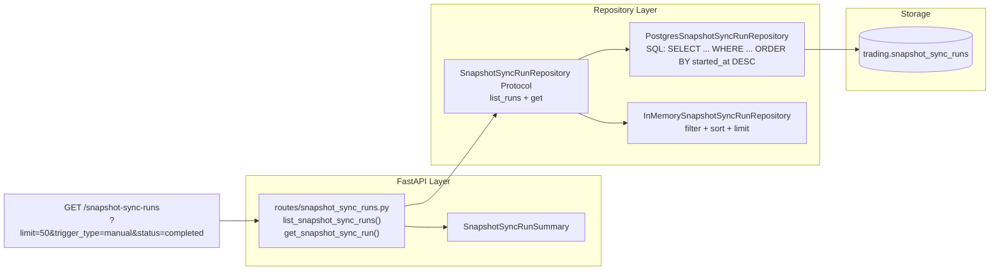
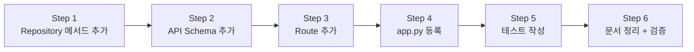

# Snapshot Sync Run Inspection API

## 작업 목표

`GET /snapshot-sync-runs` read-only 조회 경로 추가. `SnapshotSyncRunEntity`로 저장된 실행 이력을 API로 조회 가능하게 만든다.

## 현재 상태

- `SnapshotSyncRunEntity` — domain entity 존재 ✅
- `trading.snapshot_sync_runs` — DB 테이블 존재 ✅
- `SnapshotSyncRunRepository` — `add()`만 구현, `list_runs()` / `get()` 없음 ❌
- `PostgresSnapshotSyncRunRepository` — `add()`만 구현 ❌
- `InMemorySnapshotSyncRunRepository` — `add()`만 구현 ❌
- `build_in_memory_repositories()` / `build_postgres_repositories()` — 이미 `snapshot_sync_runs` 포함 ✅
- `tests/api/conftest.py` — `seeded_repos`가 `build_in_memory_repositories()` 사용하므로 추가 변경 불필요 ✅
- `deps.py` — `get_repos` 정상 작동 ✅

## 아키텍처



## 변경 사항

### 변경할 파일 (7개)

| # | 파일 | 변경 내용 | 영향 범위 |
|---|------|-----------|-----------|
| 1 | `contracts.py` | `SnapshotSyncRunRepository` Protocol에 `list_runs()` + `get()` 추가 | Repository 계약 확장 |
| 2 | `postgres/snapshot_sync_runs.py` | Postgres 구현에 `list_runs()` + `get()` SQL 추가 | PostgreSQL 쿼리 |
| 3 | `memory.py` | InMemory 구현에 `list_runs()` + `get()` 추가 | InMemory 테스트 |
| 4 | `schemas.py` | `SnapshotSyncRunSummary` Pydantic model 추가 | API 응답 형식 |
| 5 | `routes/snapshot_sync_runs.py` | 새 파일: `GET /snapshot-sync-runs` + `GET /snapshot-sync-runs/{run_id}` | 새 API 엔드포인트 |
| 6 | `app.py` | Phase 4 라우터로 새 snapshot_sync_runs_router 등록 | FastAPI 앱 |
| 7 | `tests/api/test_snapshot_sync_runs.py` | 새 파일: API 테스트 | 테스트 커버리지 |

### 변경하지 않을 파일

- `entities.py` — 불필요 (이미 존재)
- `container.py` — 불필요 (이미 존재)
- `bootstrap.py` / `postgres/bootstrap.py` — 불필요 (이미 포함)
- `deps.py` — 불필요 (이미 `get_repos` 정상 작동)
- `tests/api/conftest.py` — 불필요 (`seeded_repos`가 `build_in_memory_repositories()` 사용)

## 상세 설계

### Step 1: Repository 조회 메서드 추가

#### `contracts.py` — Protocol

```python
class SnapshotSyncRunRepository(Protocol):
    async def add(self, run: SnapshotSyncRunEntity) -> SnapshotSyncRunEntity: ...

    async def list_runs(
        self,
        limit: int = 50,
        trigger_type: str | None = None,
        status: str | None = None,
    ) -> Sequence[SnapshotSyncRunEntity]:
        """List sync runs, newest first. Optional filter by trigger_type or status."""
        ...

    async def get(self, run_id: UUID) -> SnapshotSyncRunEntity | None:
        """Get a single sync run by ID."""
        ...
```

#### `postgres/snapshot_sync_runs.py` — Postgres 구현

동적 WHERE 절 + 파라미터 바인딩:

```python
async def list_runs(
    self,
    limit: int = 50,
    trigger_type: str | None = None,
    status: str | None = None,
) -> Sequence[SnapshotSyncRunEntity]:
    conditions: list[str] = []
    params: list[object] = []
    idx = 1

    if trigger_type is not None:
        conditions.append(f"trigger_type = ${idx}")
        params.append(trigger_type)
        idx += 1
    if status is not None:
        conditions.append(f"status = ${idx}")
        params.append(status)
        idx += 1

    where_clause = " WHERE " + " AND ".join(conditions) if conditions else ""
    params.append(limit)

    rows = await self._tx.connection.fetch(
        f"SELECT * FROM trading.snapshot_sync_runs{where_clause} ORDER BY started_at DESC LIMIT ${idx}",
        *params,
    )
    return tuple(row_to_entity(row, SnapshotSyncRunEntity) for row in rows)

async def get(self, run_id: UUID) -> SnapshotSyncRunEntity | None:
    row = await self._tx.connection.fetchrow(
        "SELECT * FROM trading.snapshot_sync_runs WHERE snapshot_sync_run_id = $1",
        run_id,
    )
    return row_to_entity(row, SnapshotSyncRunEntity) if row else None
```

#### `memory.py` — InMemory 구현

```python
async def list_runs(
    self,
    limit: int = 50,
    trigger_type: str | None = None,
    status: str | None = None,
) -> Sequence[SnapshotSyncRunEntity]:
    items = list(self._items.values())
    if trigger_type is not None:
        items = [i for i in items if i.trigger_type == trigger_type]
    if status is not None:
        items = [i for i in items if i.status == status]
    items.sort(key=lambda e: e.started_at, reverse=True)
    return tuple(items[:limit])

async def get(self, run_id: UUID) -> SnapshotSyncRunEntity | None:
    return self._items.get(run_id)
```

### Step 2: API Schema 추가 (`schemas.py`)

`ReconciliationRunSummary` 패턴을 따라 `SnapshotSyncRunSummary` 추가:

```python
class SnapshotSyncRunSummary(BaseModel):
    """``GET /snapshot-sync-runs`` — snapshot sync run summary."""

    snapshot_sync_run_id: str
    trigger_type: str
    scope: str
    dry_run: bool
    total_accounts: int
    succeeded_accounts: int
    partial_accounts: int
    failed_accounts: int
    skipped_accounts: int
    positions_synced_total: int
    positions_skipped_total: int
    cash_synced_count: int
    error_count: int
    status: str
    started_at: datetime
    completed_at: datetime | None = None
    env_filter: str | None = None
    status_filter: str | None = None
    summary_json: dict[str, object] | None = None
```

### Step 3: Route 추가 (`routes/snapshot_sync_runs.py`)

`reconciliation.py` 패턴을 따라 작성:

```python
router = APIRouter(prefix="/snapshot-sync-runs", tags=["snapshot-sync"])

@router.get("", response_model=list[SnapshotSyncRunSummary])
async def list_snapshot_sync_runs(
    limit: int = Query(50, ge=1, le=200),
    trigger_type: str | None = Query(None),
    status: str | None = Query(None),
    repos: RepositoryContainer = Depends(get_repos),
) -> list[SnapshotSyncRunSummary]:
    """List KIS snapshot sync runs, newest first."""
    runs = await repos.snapshot_sync_runs.list_runs(
        limit=limit, trigger_type=trigger_type, status=status
    )
    return [_to_summary(r) for r in runs]

@router.get("/{run_id}", response_model=SnapshotSyncRunSummary)
async def get_snapshot_sync_run(
    run_id: str,
    repos: RepositoryContainer = Depends(get_repos),
) -> SnapshotSyncRunSummary:
    """Get a single snapshot sync run by ID."""
    try:
        uid = UUID(run_id)
    except ValueError as exc:
        raise HTTPException(status_code=400, detail=f"Invalid UUID: {run_id}") from exc
    run = await repos.snapshot_sync_runs.get(uid)
    if run is None:
        raise HTTPException(status_code=404, detail=f"Snapshot sync run not found: {run_id}")
    return _to_summary(run)
```

### Step 4: app.py 라우터 등록

```python
# Phase 4 — Snapshot Sync Run inspection
from agent_trading.api.routes.snapshot_sync_runs import router as snapshot_sync_runs_router
protected_routers.append(snapshot_sync_runs_router)
```

### Step 5: 테스트 (`tests/api/test_snapshot_sync_runs.py`)

```python
class TestListSnapshotSyncRuns:
    # 빈 상태 → 빈 리스트
    # 단일 run 추가 후 목록 조회 → 1개 항목
    # 복수 runs 추가 후 목록 조회 → started_at DESC 정렬
    # trigger_type 필터
    # status 필터
    # limit 파라미터

class TestGetSnapshotSyncRun:
    # 존재하는 ID → 상세 조회
    # 존재하지 않는 ID → 404
    # 잘못된 UUID 형식 → 400

class TestAuth:
    # 인증 필요 엔드포인트 확인
```

## Todo List (실행 순서)



## 변경 금지 확인

- [x] Admin UI 변경 금지 — UI 파일 수정 없음
- [x] Broker submit semantics 변경 금지 — broker 계층 수정 없음
- [x] Hard guardrail / reconciliation 경계 변경 금지 — 해당 계층 수정 없음
- [x] 기존 snapshot sync 실행 로직 변경 금지 — sync CLI / scheduler 진입점 수정 없음
- [x] 기존 API 엔드포인트 변경 금지 — 기존 라우터/스키마 수정 없음 (schemas.py는 새 model 추가만)

## 위험 및 고려사항

1. **Postgres 동적 SQL**: `asyncpg`의 `fetch`는 `*params` 언패킹을 지원. `list_runs()`에서 조건절이 없을 때 `SELECT * ... ORDER BY ... LIMIT $1` 정상 작동 확인 필요.
2. **InMemory 정렬**: `list_runs()`에서 정렬 후 `tuple(items[:limit])` 반환. limit이 전체 개수보다 크면 모든 항목 반환.
3. **UUID 유효성**: `get_snapshot_sync_run()`에서 잘못된 UUID 형식 → 400 반환. 존재하지 않는 ID → 404 반환.
4. **테스트 seed data**: `tests/api/conftest.py`의 `seeded_repos`에 snapshot_sync_runs seed data가 없으므로 테스트 내에서 직접 `repos.snapshot_sync_runs.add()` 호출 필요.
