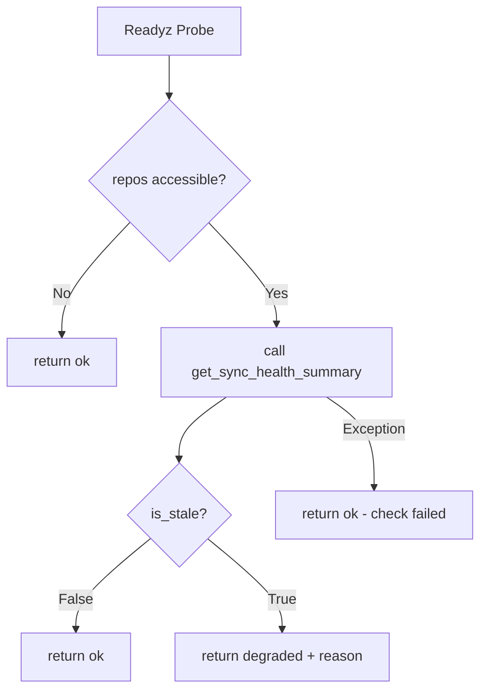

# Snapshot Sync Freshness → Health/Readiness 신호 연결

## 1. 정책 결정

### 선택: Stale → `degraded` (warning), Not `not_ready`

| 조건 | `/health` status | `/health/readyz` status | 비고 |
|------|------------------|------------------------|------|
| Fresh sync (`is_stale=False`) | `ok` | `ok` | 정상 |
| Stale sync (`is_stale=True`) | `ok` + warning fields | `degraded` | 스냅샷 데이터가 오래됨 |
| No sync history ever | `ok` + warning fields | `degraded` | 아직 한 번도 동기화되지 않음 |
| DB unreachable | `ok` (DB: disconnected) | `not_ready` (503) | 기존 로직 유지 |

**근거**:
- snapshot sync가 stale이어도 서버 자체는 요청을 처리할 수 있으므로 `not_ready`는 과함
- `degraded`로 운영자에게 신호를 보내되, 트래픽 라우팅은 유지 (K8s readiness probe가 200 반환)
- `consecutive_failures`가 높아도 `degraded`를 유지 — 별도 `not_ready` escalation은 추후

### readyz HTTP status code 정책
- `ok` → 200
- `degraded` → 200 (서비스는 동작 중이나 상태가 좋지 않음)
- `not_ready` → 503 (기존 DB unreachable)

---

## 2. 변경 파일

| # | 파일 | 변경 내용 |
|---|------|----------|
| 1 | `src/agent_trading/api/schemas.py` | `HealthResponse`에 snapshot sync 필드 4개 추가 (optional) |
| 2 | `src/agent_trading/api/routes/health.py` | `/health`에 snapshot sync 정보 포함; `/health/readyz`에 `degraded` 로직 추가 |
| 3 | `tests/api/test_health.py` | snapshot sync 관련 테스트 4개 추가 |
| 4 | `plans/[BACKLOG] backlog.md` | 승격 기록 추가 |

---

## 3. 상세 설계

### 3.1 HealthResponse 스키마 확장

```python
class HealthResponse(BaseModel):
    """``GET /health`` — minimal server status."""

    status: str = "ok"
    version: str
    timestamp: datetime
    database: str
    runtime_mode: str

    # ── Snapshot Sync Freshness (optional, added when repos accessible) ──────
    snapshot_sync_detail: str | None = None
    """One of: ``"ok"``, ``"stale"``, ``"no_history"``, or ``None`` (unavailable)."""

    snapshot_sync_stale: bool | None = None
    """``True`` when the most recent successful sync exceeds the stale threshold."""

    snapshot_sync_last_successful_run_at: datetime | None = None
    """``started_at`` of the most recent successful (``completed``) sync run."""

    snapshot_sync_consecutive_failures: int | None = None
    """Number of consecutive ``status == 'failed'`` runs (reverse chronological)."""
```

**변경 방침**: 기존 5개 필드는 그대로 유지, 새 필드는 전부 `None` 가능 → 기존 consumer에 전혀 영향을 주지 않는 additive 변경.

### 3.2 `/health` 라우트 변경

```python
@router.get("/health", response_model=HealthResponse)
async def health(request: Request) -> HealthResponse:
    runtime_mode = getattr(request.app.state, "runtime_mode", "in_memory")
    database_status = runtime_mode

    if runtime_mode == "postgres":
        from agent_trading.db.connection import health_check
        db_ok = await health_check()
        database_status = "connected" if db_ok else "disconnected"

    # Snapshot sync health summary — only when repos are on app.state
    snapshot_sync_detail = None
    snapshot_sync_stale = None
    snapshot_sync_last_successful_run_at = None
    snapshot_sync_consecutive_failures = None

    repos = getattr(request.app.state, "repos", None)
    if repos is not None and hasattr(repos, "snapshot_sync_runs"):
        try:
            from agent_trading.config.settings import AppSettings
            settings = AppSettings()
            health_summary = await repos.snapshot_sync_runs.get_sync_health_summary(
                stale_threshold_seconds=settings.kis_snapshot_stale_threshold_seconds,
            )
            snapshot_sync_stale = health_summary.is_stale
            snapshot_sync_last_successful_run_at = health_summary.last_successful_run_at
            snapshot_sync_consecutive_failures = health_summary.consecutive_failures
            if health_summary.last_successful_run_at is None:
                snapshot_sync_detail = "no_history"
            elif health_summary.is_stale:
                snapshot_sync_detail = "stale"
            else:
                snapshot_sync_detail = "ok"
        except Exception:
            snapshot_sync_detail = "unavailable"

    return HealthResponse(
        status="ok",
        version=_version,
        timestamp=datetime.now(timezone.utc),
        database=database_status,
        runtime_mode=runtime_mode,
        snapshot_sync_detail=snapshot_sync_detail,
        snapshot_sync_stale=snapshot_sync_stale,
        snapshot_sync_last_successful_run_at=snapshot_sync_last_successful_run_at,
        snapshot_sync_consecutive_failures=snapshot_sync_consecutive_failures,
    )
```

**설계 이유**:
- `request.app.state.repos`는 in-memory 모드에서만 존재. postgres 모드에서는 repos가 app.state에 저장되지 않음.
- postgres 모드에서는 `get_repos` dependency를 추가하지 않음으로써 기존의 lightweight health probe 정책 유지
- `try/except`로 repository 호출 실패에 안전하게 대응

### 3.3 `/health/readyz` 라우트 변경

```python
@router.get("/health/readyz")
async def readyz(request: Request) -> JSONResponse:
    runtime_mode = getattr(request.app.state, "runtime_mode", "in_memory")

    # 1. DB check (existing)
    if runtime_mode == "postgres":
        from agent_trading.db.connection import health_check
        db_ok = await health_check()
        if not db_ok:
            return JSONResponse(
                {"status": "not_ready", "reason": "database unreachable"},
                status_code=503,
            )

    # 2. Snapshot sync freshness check (when repos accessible)
    repos = getattr(request.app.state, "repos", None)
    if repos is not None and hasattr(repos, "snapshot_sync_runs"):
        try:
            from agent_trading.config.settings import AppSettings
            settings = AppSettings()
            health_summary = await repos.snapshot_sync_runs.get_sync_health_summary(
                stale_threshold_seconds=settings.kis_snapshot_stale_threshold_seconds,
            )
            if health_summary.is_stale:
                return JSONResponse({
                    "status": "degraded",
                    "reason": "snapshot_sync_stale",
                    "snapshot_sync_last_successful_run_at": (
                        health_summary.last_successful_run_at.isoformat()
                        if health_summary.last_successful_run_at else None
                    ),
                    "snapshot_sync_consecutive_failures": health_summary.consecutive_failures,
                })
        except Exception:
            # Don't fail readiness on snapshot sync check error
            pass

    return JSONResponse({"status": "ok"})
```

**설계 이유**:
- `is_stale=True` → `degraded` (200)
- `is_stale=False` or unavailable → `ok` (200)
- Snapshot sync check 실패해도 readiness를 fail시키지 않음 → 오히려 check 자체가 깨져도 서비스는 정상으로 간주
- Postgres 모드에서는 repos에 접근할 수 없으므로 snapshot sync check 생략

### 3.4 상태 전이 다이어그램



### 3.5 `/health` 응답 예시

**Fresh sync**:
```json
{
  "status": "ok",
  "version": "0.1.0",
  "timestamp": "2026-05-08T22:00:00Z",
  "database": "in_memory",
  "runtime_mode": "in_memory",
  "snapshot_sync_detail": "ok",
  "snapshot_sync_stale": false,
  "snapshot_sync_last_successful_run_at": "2026-05-08T21:50:00Z",
  "snapshot_sync_consecutive_failures": 0
}
```

**Stale sync**:
```json
{
  "status": "ok",
  "version": "0.1.0",
  "timestamp": "2026-05-08T22:00:00Z",
  "database": "in_memory",
  "runtime_mode": "in_memory",
  "snapshot_sync_detail": "stale",
  "snapshot_sync_stale": true,
  "snapshot_sync_last_successful_run_at": "2026-05-08T18:00:00Z",
  "snapshot_sync_consecutive_failures": 3
}
```

**No history**:
```json
{
  "status": "ok",
  "version": "0.1.0",
  "timestamp": "2026-05-08T22:00:00Z",
  "database": "in_memory",
  "runtime_mode": "in_memory",
  "snapshot_sync_detail": "no_history",
  "snapshot_sync_stale": true,
  "snapshot_sync_last_successful_run_at": null,
  "snapshot_sync_consecutive_failures": 0
}
```

---

## 4. 테스트 계획

`tests/api/test_health.py`에 다음 테스트 추가 (기존 4개 테스트는 전혀 변경하지 않음):

| # | 테스트 | 시나리오 | 기대 |
|---|--------|---------|------|
| 1 | `test_health_includes_snapshot_sync_fields` | `/health`에 snapshot sync 필드 포함 여부 | `snapshot_sync_detail` 필드 존재 |
| 2 | `test_readyz_healthy_sync` | fresh sync 상태에서 readyz | `status: "ok"` |
| 3 | `test_readyz_stale_sync` | stale sync 상태에서 readyz | `status: "degraded"`, `reason: "snapshot_sync_stale"` |
| 4 | `test_readyz_no_history` | sync 기록 없음 | `status: "degraded"`, `reason: "snapshot_sync_stale"` |

테스트는 `create_app(repos=repos, auth_enabled=False)`로 repos를 직접 주입하여 snapshot sync runs 데이터를 제어.

---

## 5. 운영 관점

운영자는 이제 health endpoint 하나로 다음을 즉시 판단할 수 있다:

1. **서버가 살아있는가?** → `status: "ok"` (항상)
2. **DB가 연결되었는가?** → `database: "connected"` or `"disconnected"`
3. **스냅샷 동기화가 최신인가?** → `snapshot_sync_detail: "ok"` or `"stale"` or `"no_history"`
4. **Readyz probe가 degraded인가?** → readiness endpoint가 명시적으로 `"degraded"` 반환

즉, `/health`만 봐도 snapshot sync가 정상인지, 오래되었는지, 한 번도 실행되지 않았는지 알 수 있다.
