# KIS WebSocket 41건 Strict Enforcement

## 1. 목적

KIS WebSocket subscription 등록 상한 **41건**을 실제로 강제한다.
42번째 등록은 명시적으로 실패하며, `GET /broker-capacity` inspection에도
정확한 `max_subscriptions=41`이 표시된다.

## 2. 문제 분석

### 2.1 현재 상태

| 위치 | 값 | 설명 |
|------|-----|------|
| [`SubscriptionBudget` 기본값](src/agent_trading/brokers/base.py:67) | `max_subscriptions=100` | KIS 41-cap 미반영 |
| [`KoreaInvestmentAdapter.__init__`](src/agent_trading/brokers/koreainvestment/adapter.py:81) | `subscription_budget or SubscriptionBudget()` | 기본 max=100 사용 |
| [`bootstrap.py _build_kis_adapter`](src/agent_trading/runtime/bootstrap.py:56-59) | `subscription_budget` 미전달 | adapter가 기본값 사용 |
| [`_ensure_ws_connected`](src/agent_trading/brokers/koreainvestment/adapter.py:433-439) | `subscription_budget=self._subscription_budget` 전달 | WS client가 adapter의 budget 사용 |
| [`KISWebSocketClient.subscribe`](src/agent_trading/brokers/koreainvestment/websocket_client.py:212-220) | budget check 후 등록 | enforcement는 budget이 결정 |

### 2.2 Subscription Budget 흐름

```
bootstrap.py
  └─ _build_kis_adapter() ──┐  (subscription_budget 미전달)
                             ▼
KoreaInvestmentAdapter.__init__()
  └─ self._subscription_budget = subscription_budget or SubscriptionBudget()
                                                                    └── max=100 (기본값)
                             │
                _ensure_ws_connected()
                  └─ KISWebSocketClient(subscription_budget=self._subscription_budget)
                             │
                    subscribe(channel, tr_key, critical=False)
                      └─ self._budget.subscribe_critical() / subscribe_optional()
                           └─ max_subscriptions=100 기준 체크
```

### 2.3 SubscriptionBudget enforce 로직 (base.py)

- [`subscribe_critical()`](src/agent_trading/brokers/base.py:85-103): `current_critical < critical_limit` 체크, total >= max 시 optional eviction 시도
- [`subscribe_optional()`](src/agent_trading/brokers/base.py:105-119): `current_optional < optional_limit` 체크, total >= max 시 `False`
- 이미 `max_subscriptions` 기반 enforce가 구현되어 있음 — 값만 41로 변경하면 됨

## 3. 설계 결정

### 3.1 변경 방식

**가장 최소 변경**: `KoreaInvestmentAdapter.__init__`에서 `SubscriptionBudget` 생성 시 `max_subscriptions=41` 전달

```python
# 변경 전 (adapter.py:81)
self._subscription_budget = subscription_budget or SubscriptionBudget()

# 변경 후
self._subscription_budget = subscription_budget or SubscriptionBudget(max_subscriptions=41)
```

### 3.2 선택 이유

| 후보 | 설명 | 평가 |
|------|------|------|
| **① adapter 기본값 변경** | `SubscriptionBudget(max_subscriptions=41)` | ✅ 최소 변경, 한 곳만 수정 |
| ② bootstrap에서 전달 | bootstrap에서 budget 생성 후 adapter에 주입 | ❌ bootstrap에 WS budget 로직 추가 필요 |
| ③ websocket_client에서 강제 | subscribe() 내부에서 41 체크 추가 | ❌ 중복 enforcement, SubscriptionBudget 무력화 |

### 3.3 영향을 받는 값

`SubscriptionBudget(max_subscriptions=41)` 생성 시 나머지 필드는 기본값 유지:

| 필드 | 기본값 | 변경 후 | 설명 |
|------|--------|---------|------|
| `max_subscriptions` | 100 | **41** | KIS 공식 cap |
| `critical_limit` | 20 | 20 (유지) | 주문체결통보 최대 20계정 |
| `optional_limit` | 80 | 80 (유지) | max=41이 먼저 적용되므로 실질적 의미 없음 |

`optional_limit=80`은 `max_subscriptions=41`보다 크지만,
[`subscribe_optional()`](src/agent_trading/brokers/base.py:112-116)은 `total_used >= max_subscriptions`를 먼저 체크하므로
실제로는 `max_subscriptions=41`이 항상 우선 적용된다.

### 3.4 42번째 등록 시 동작

| 시나리오 | 결과 |
|----------|------|
| optional 41개 → 42번째 optional | `subscribe_optional()` → `False` |
| critical 20개 + optional 21개 → 42번째 critical | `subscribe_critical()` → eviction 불가 → `False` |
| critical 20개 + optional 20개 (total=40) → critical 1개 | `subscribe_critical()` → total=41, optional evict → 성공 (여전히 total=41) |
| unsubscribe 후 재시도 | budget release → `subscribe_*()` → `True` |

### 3.5 Inspection 정합성

[`broker_capacity.py`](src/agent_trading/api/routes/broker_capacity.py:77-88)는
`adapter._subscription_budget.snapshot()`을 직접 호출하므로,
`max_subscriptions=41`로 생성된 budget이 그대로 반영된다.

```json
{
  "websocket": {
    "max_subscriptions": 41,
    "critical_limit": 20,
    "optional_limit": 80,
    "current_critical": 0,
    "current_optional": 0,
    "total_used": 0,
    "remaining": 41
  }
}
```

## 4. 변경 파일 목록

### 4.1 adapter.py (1줄 변경)

**파일**: [`src/agent_trading/brokers/koreainvestment/adapter.py`](src/agent_trading/brokers/koreainvestment/adapter.py:81)

```python
# 변경 전
self._subscription_budget = subscription_budget or SubscriptionBudget()

# 변경 후
self._subscription_budget = subscription_budget or SubscriptionBudget(max_subscriptions=41)
```

### 4.2 base.py (docstring 업데이트)

**파일**: [`src/agent_trading/brokers/base.py`](src/agent_trading/brokers/base.py:30-36)

현재 docstring에 "dedicated KIS-capped wrapper is a documented follow-up item" 문구를
KIS adapter가 41-cap을 적용하고 있음을 반영하도록 업데이트.

### 4.3 test_kis_adapter_validation.py (테스트 추가)

**파일**: [`tests/brokers/test_kis_adapter_validation.py`](tests/brokers/test_kis_adapter_validation.py)

`TestKisAdapterSubscriptionBudget` 클래스 추가:
- `test_default_budget_max_41` — adapter 생성 시 budget.max_subscriptions == 41
- `test_explicit_budget_not_overridden` — 명시적 budget 전달 시 override되지 않음

### 4.4 test_kis_websocket.py (테스트 추가)

**파일**: [`tests/brokers/test_kis_websocket.py`](tests/brokers/test_kis_websocket.py)

`TestSubscriptionBudget41Cap` 클래스 추가 (SubscriptionBudget 단위 테스트):
- `test_41_subscriptions_succeed` — 41개 optional subscribe → 모두 True
- `test_42nd_subscription_rejected` — 42번째 → False
- `test_critical_41_with_eviction` — critical 20 + optional 21 → eviction 동작 확인
- `test_unsubscribe_clears_room` — unsubscribe 후 재시도 가능
- `test_snapshot_shows_41` — snapshot().max_subscriptions == 41

## 5. 회귀 검증 항목

| 테스트 파일 | 테스트 수 | 영향 |
|------------|-----------|------|
| `tests/brokers/test_kis_websocket.py` | 기존 5개 클래스 | SubscriptionBudget 기본값 변경 없음 → 영향 없음 |
| `tests/brokers/test_kis_adapter_validation.py` | 기존 테스트 | adapter fixture가 SubscriptionBudget() 기본값 사용 → 영향 없음 |
| `tests/api/test_broker_capacity.py` | 6개 | mock 사용 → 영향 없음 |
| `tests/api/conftest.py` mock fixtures | mock_subscription_budget | mock이라 실제 budget 생성 안 함 → 영향 없음 |

## 6. 제약 조건 확인

| 제약 조건 | 상태 |
|-----------|------|
| Broker submit semantics 변경 금지 | ✅ 변경 없음 |
| Admin UI 변경 금지 | ✅ 변경 없음 |
| WebSocket eviction policy 대수술 금지 | ✅ 기존 eviction policy 그대로 사용 |
| Global REST cap 구현 동시 진행 금지 | ✅ REST cap 관련 변경 없음 |
| Critical/optional 구분 유지 | ✅ 그대로 유지됨 |
| `GET /broker-capacity` inspection 정합성 | ✅ snapshot()이 자동 반영 |
| 기존 websocket 테스트 회귀 없음 | ✅ 기본값 자체를 변경하는 것이 아님 |

## 7. Mermaid: 변경 범위

```mermaid
flowchart LR
    subgraph 현재
        A1["adapter.py:81<br/>SubscriptionBudget&#40;&#41;<br/>max=100"]
        B1["base.py docstring<br/>follow-up 미구현"]
    end

    subgraph 변경후
        A2["adapter.py:81<br/>SubscriptionBudget&#40;max_subscriptions=41&#41;<br/>max=41 ✅"]
        B2["base.py docstring<br/>41-cap 적용됨 ✅"]
    end

    subgraph 영향없음
        C["bootstrap.py<br/>변경 없음"]
        D["websocket_client.py<br/>변경 없음"]
        E["broker_capacity.py<br/>변경 없음"]
        F["schemas.py<br/>변경 없음"]
    end
```



## 8. 구현 순서

1. [`adapter.py`](src/agent_trading/brokers/koreainvestment/adapter.py:81) — 1줄 수정
2. [`base.py`](src/agent_trading/brokers/base.py:30-36) — docstring 업데이트
3. [`test_kis_adapter_validation.py`](tests/brokers/test_kis_adapter_validation.py) — adapter 단위 테스트 추가
4. [`test_kis_websocket.py`](tests/brokers/test_kis_websocket.py) — 41-cap 단위 테스트 추가
5. 테스트 실행 및 검증
