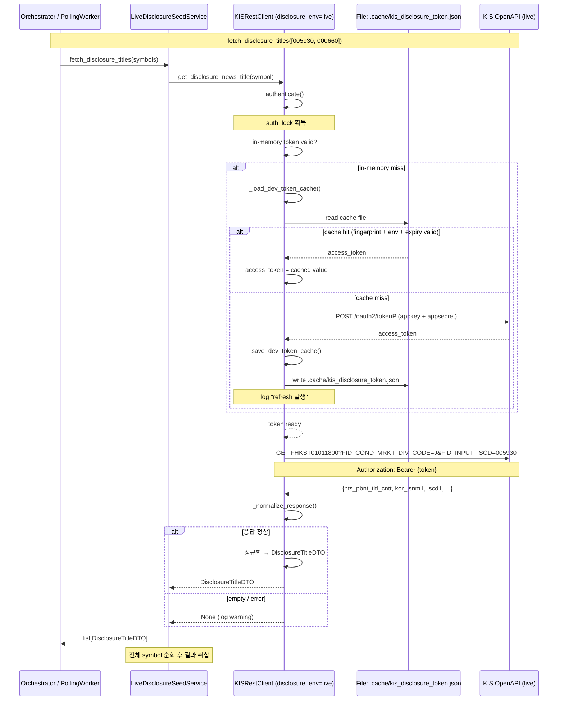

# Phase P-1b: KIS Live 전용 공시 Seed Client + 기존 Live Token Cache 재사용

**작성일:** 2026-05-17  
**상태:** 설계 초안 (리뷰 대기)  
**관련 PRD:** Phase P (KIS 공시 제목 + NAVER 뉴스 2단계 검색) — 선행 조건 1

---

## 1. 핵심 설계 결정

| 결정 | 내용 | 근거 |
|------|------|------|
| **Disclosure 전용 client 생성** | 기존 KISRestClient와 별도 인스턴스 (`env="live"`, 전용 API key/secret) | live-only API (`FHKST01011800`)는 dev/paper에서 동작하지 않음 |
| **Token cache 재사용** | 기존 `_load_dev_token_cache()` / `_save_dev_token_cache()` 메커니즘을 새 경로 `.cache/kis_disclosure_token.json` 으로 재활용 | 새로운 cache 로직 구현 금지; 기존 메커니즘은 `dev_token_cache_enabled` + `dev_token_cache_path` 만으로 제어 가능 |
| **Disclosure 전용 bucket 분류** | `BucketType.INQUIRY` 재사용 (별도 bucket 불필요) | 공시 조회는 읽기 전용 inquiry이며, rate limit은 기존 INQUIRY budget으로 충분 |
| **Live credential fallback** | `kis_live_app_key` / `kis_live_app_secret` 미설정 시 empty list 반환 | hard fail 금지 요구사항 준수 |
| **DTO 독립** | `DisclosureTitleDTO` 는 `domain/models.py` 에 dataclass로 추가 | 기존 모델과 동일한 계층 구조 유지 |

---

## 2. KIS 공시(제목) API — FHKST01011800 상세

### API 정보

| 항목 | 값 |
|------|-----|
| **TR ID** | `FHKST01011800` |
| **Endpoint** | ⚠️ **확인 필요** (추정: `/uapi/domestic-stock/v1/quotations/inquire-asking-price-exp`) |
| **HTTP Method** | `GET` |
| **환경** | live only (모의환경 미지원) |
| **Query Parameters** | `FID_COND_MRKT_DIV_CODE=J`, `FID_INPUT_ISCD={종목코드}` |
| **응답 필드** | `hts_pbnt_titl_cntt` (제목), `iscd1~10` (종목코드), `kor_isnm1~10` (종목명) |

> **참고:** `FHKST01011800`의 정확한 endpoint 경로는 [`reference_docs/한국투자증권_오픈API_전체문서_20260503_030000.xlsx`](../reference_docs/한국투자증권_오픈API_전체문서_20260503_030000.xlsx) 에서 확인 필요.  
> 위 추정 endpoint(`inquire-asking-price-exp`)는 **호가 조회** endpoint와 동일한 경로일 가능성이 있으므로, 반드시 KIS 공식 문서에서 **종합 시황_공시(제목)** 전용 endpoint를 확인해야 함.

### 응답 예시 (추정 shape)

```json
{
  "output": [
    {
      "hts_pbnt_titl_cntt": "[㈜삼성전자] 2026년 1분기 실적발표",
      "kor_isnm1": "삼성전자",
      "iscd1": "005930",
      ...
    }
  ],
  "rt_cd": "0",
  "msg_cd": "",
  "msg1": ""
}
```

---

## 3. 클래스 의존성 다이어그램

```mermaid
classDiagram
    class KISRestClient {
        +api_key: str
        +api_secret: str
        +env: str
        +dev_token_cache_enabled: bool
        +dev_token_cache_path: str
        +authenticate() str
        +_load_dev_token_cache()
        +_save_dev_token_cache()
        +get_disclosure_news_title(symbol) DisclosureTitleDTO
        +_request() dict
    }
    
    class LiveDisclosureSeedService {
        -_client: KISRestClient
        +fetch_disclosure_titles(symbols) list[DisclosureTitleDTO]
    }
    
    class DisclosureTitleDTO {
        +symbol: str
        +company_name: str | None
        +headline: str | None
        +published_at: str | None
        +source: str
    }
    
    class AppSettings {
        +kis_live_app_key: str | None
        +kis_live_app_secret: str | None
        +kis_disclosure_token_cache_path: str
        +kis_disclosure_token_cache_enabled: bool
    }
    
    class Bootstrap {
        +_build_live_disclosure_client() KISRestClient
        +build_default_runtime()
        +build_postgres_runtime()
    }
    
    KISRestClient --|> LiveDisclosureSeedService : uses
    LiveDisclosureSeedService --> DisclosureTitleDTO : returns
    AppSettings --> Bootstrap : configures
    Bootstrap --> KISRestClient : creates (env=live, cache_path=kis_disclosure_token.json)
    KISRestClient --> ".cache/kis_disclosure_token.json" : reads/writes token cache
```

---

## 4. 호출 흐름 다이어그램



---

## 5. Fallback 흐름 다이어그램

```mermaid
flowchart TD
    A[fetch_disclosure_titles 호출] --> B{live credential 존재?}
    B -->|No| C[log: live credential 없음]
    C --> D[return []]
    
    B -->|Yes| E{client 생성 성공?}
    E -->|No| F[log: client 생성 실패]
    F --> D
    
    E -->|Yes| G[symbol 순회]
    G --> H{symbol별 get_disclosure_news_title}
    
    H -->|token refresh 실패| I[catch BrokerError]
    I --> J[log: token refresh 실패]
    J --> K[해당 symbol skip, None]
    
    H -->|API empty 응답| L[log: empty response]
    L --> K
    
    H -->|live-only API 미지원 응답| M[catch dev env 에러]
    M --> N[log: live-only API 미지원]
    N --> K
    
    H -->|성공| O[DisclosureTitleDTO 정규화]
    
    K --> P{다음 symbol?}
    O --> P
    
    P -->|Yes| H
    P -->|No| Q[None 제거 후 list 반환]
    Q --> R[log: response item count = N]
```

---

## 6. 변경 파일 목록 및 상세 변경 사항

### 6.1 [`src/agent_trading/config/settings.py`](../src/agent_trading/config/settings.py)

**변경 유형:** 필드 추가 (선택적, 기본값 None)

```python
# 새 resolve 함수들 (기존 _resolve_kis_* 패턴과 동일)
def _resolve_kis_live_app_key() -> str | None:
    return os.getenv("KIS_LIVE_APP_KEY") or None

def _resolve_kis_live_app_secret() -> str | None:
    return os.getenv("KIS_LIVE_APP_SECRET") or None

def _resolve_kis_disclosure_token_cache_path() -> str:
    return os.getenv("KIS_DISCLOSURE_TOKEN_CACHE_PATH", ".cache/kis_disclosure_token.json")

def _resolve_kis_disclosure_token_cache_enabled() -> bool:
    raw = os.getenv("KIS_DISCLOSURE_TOKEN_CACHE_ENABLED", "true")
    return raw.strip().lower() == "true"
```

**`AppSettings` dataclass에 추가할 필드:**

| 필드 | 타입 | 기본값 팩토리 | 설명 |
|------|------|-------------|------|
| `kis_live_app_key` | `str \| None` | `_resolve_kis_live_app_key` | Live 전용 APP Key (선택) |
| `kis_live_app_secret` | `str \| None` | `_resolve_kis_live_app_secret` | Live 전용 APP Secret (선택) |
| `kis_disclosure_token_cache_path` | `str` | `_resolve_kis_disclosure_token_cache_path` | `.cache/kis_disclosure_token.json` |
| `kis_disclosure_token_cache_enabled` | `bool` | `_resolve_kis_disclosure_token_cache_enabled` | 기본 True (공시 전용) |

> **설계 근거:** `dev_token_cache_enabled`가 기본 `false`인 것과 달리, disclosure 용도의 cache는 기본 활성화.  
> live token의 만료 시간(86400s)을 고려할 때 cache miss시에만 refresh하면 되므로 항상 cache 사용.

### 6.2 [`src/agent_trading/brokers/koreainvestment/rest_client.py`](../src/agent_trading/brokers/koreainvestment/rest_client.py)

#### 6.2.1 `KIS_ENDPOINTS`에 disclosure endpoint 추가

line 51-67 사이에 추가:

```python
# --- Disclosure ---
"disclosure_title": "/uapi/domestic-stock/v1/quotations/inquire-asking-price-exp",  # ⚠️ 확정 필요
```

#### 6.2.2 `KIS_TR_IDS`에 disclosure TR ID 추가

line 71-83 사이에 추가:

```python
# Disclosure
"disclosure_title": ("FHKST01011800", None),  # paper=None (live only)
```

#### 6.2.3 `get_disclosure_news_title()` 메서드 추가

```python
async def get_disclosure_news_title(self, symbol: str) -> dict[str, Any] | None:
    """Fetch disclosure news title from KIS.
    
    Uses FHKST01011800 (종합 시황_공시(제목)).
    Live-only API — returns None when called in dev/paper env.
    Returns normalized output dict or None on empty/error.
    """
    params = {
        "FID_COND_MRKT_DIV_CODE": "J",
        "FID_INPUT_ISCD": symbol,
    }
    
    try:
        data = await self._request(
            "GET",
            endpoint_key="disclosure_title",
            tr_id_key="disclosure_title",
            bucket=BucketType.INQUIRY,
            params=params,
        )
        output = data.get("output", {})
        if isinstance(output, list):
            output = output[0] if output else {}
        if not output:
            logger.info(
                "Disclosure: empty response symbol=%s env=%s",
                symbol, self.env,
            )
            return None
        return output
    except BrokerError as exc:
        logger.warning(
            "Disclosure: failed symbol=%s env=%s error=%s",
            symbol, self.env, exc,
        )
        return None  # graceful fallback — no hard fail
```

**로깅 상세 (observability):**

| 로그 포인트 | 레벨 | 내용 |
|-----------|------|------|
| `_load_dev_token_cache()` 호출 시 | `INFO` | cache hit/miss + 재사용 경로 로그 (`path=.cache/kis_disclosure_token.json`) |
| `authenticate()` refresh 발생 시 | `INFO` | refresh 발생 여부 (`_save_dev_token_cache()` 호출) |
| API 응답 성공 시 | `INFO` | response item count |
| API 응답 empty 시 | `INFO` | empty response 로그 |
| API 에러 시 | `WARNING` | 에러 상세 (hard fail 금지) |

#### 6.2.4 응답 정규화 메서드 추가

```python
@staticmethod
def _normalize_disclosure_output(raw: dict[str, Any], symbol: str) -> dict[str, Any]:
    """Normalize KIS disclosure response to DisclosureTitleDTO-compatible dict."""
    # 회사명: kor_isnm1~10 중 첫 번째 비어있지 않은 값
    company_name = None
    for i in range(1, 11):
        key = f"kor_isnm{i}"
        if raw.get(key):
            company_name = raw[key]
            break
    
    return {
        "symbol": symbol,
        "company_name": company_name,
        "headline": raw.get("hts_pbnt_titl_cntt"),
        "published_at": None,  # KIS 응답에 시간 정보 없음
        "source": "kis_disclosure_live",
    }
```

### 6.3 [`src/agent_trading/domain/models.py`](../src/agent_trading/domain/models.py) — `DisclosureTitleDTO` 추가

```python
@dataclass(slots=True, frozen=True)
class DisclosureTitleDTO:
    """정규화된 KIS 공시 제목 DTO.
    
    Attributes
    ----------
    symbol: 종목코드
    company_name: 회사명 (KIS 응답에서 추출, 없으면 None)
    headline: 공시 제목 (hts_pbnt_titl_cntt, 최대 400자)
    published_at: 발행 시각 (KIS 응답에 없으면 None)
    source: 출처 식별자 (항상 "kis_disclosure_live")
    """
    symbol: str
    company_name: str | None = None
    headline: str | None = None
    published_at: str | None = None
    source: str = "kis_disclosure_live"
```

### 6.4 신규: [`src/agent_trading/services/disclosure_seed_service.py`](../src/agent_trading/services/disclosure_seed_service.py)

```python
"""LiveDisclosureSeedService — KIS live 공시 제목 조회 서비스.

Phase P-1b: KIS 종합 시황_공시(제목) API (FHKST01011800) seed 조회.
NAVER 뉴스 연동 및 검색어 추출은 포함하지 않음.
"""

from __future__ import annotations

import logging
from typing import Any

from agent_trading.brokers.koreainvestment.rest_client import KISRestClient
from agent_trading.domain.models import DisclosureTitleDTO

logger = logging.getLogger(__name__)


class LiveDisclosureSeedService:
    """KIS live disclosure title seed service.
    
    Responsible for fetching disclosure headlines from KIS live-only API
    (FHKST01011800) and normalizing responses into DisclosureTitleDTO.
    All error paths return empty list — no hard failure.
    """
    
    def __init__(self, client: KISRestClient | None) -> None:
        self._client = client
    
    async def fetch_disclosure_titles(
        self,
        symbols: list[str],
    ) -> list[DisclosureTitleDTO]:
        """Fetch disclosure titles for given symbols.
        
        Parameters
        ----------
        symbols: 조회할 종목코드 리스트
        
        Returns
        -------
        list[DisclosureTitleDTO]
            정규화된 공시 제목 리스트. 실패 시 empty list.
        """
        if self._client is None:
            logger.info(
                "DisclosureSeedService: client is None "
                "(live credentials not configured) — returning []"
            )
            return []
        
        results: list[DisclosureTitleDTO] = []
        
        for symbol in symbols:
            dto = await self._fetch_one(symbol)
            if dto is not None:
                results.append(dto)
        
        logger.info(
            "DisclosureSeedService: fetch_disclosure_titles "
            "requested=%d succeeded=%d",
            len(symbols), len(results),
        )
        return results
    
    async def _fetch_one(self, symbol: str) -> DisclosureTitleDTO | None:
        """Fetch single symbol disclosure title."""
        try:
            raw = await self._client.get_disclosure_news_title(symbol)
        except Exception:
            logger.warning(
                "DisclosureSeedService: unexpected error for %s",
                symbol, exc_info=True,
            )
            return None
        
        if raw is None:
            return None
        
        return DisclosureTitleDTO(
            symbol=symbol,
            company_name=raw.get("company_name"),
            headline=raw.get("headline"),
            published_at=raw.get("published_at"),
            source="kis_disclosure_live",
        )
```

### 6.5 [`src/agent_trading/runtime/bootstrap.py`](../src/agent_trading/runtime/bootstrap.py)

#### 6.5.1 `_build_live_disclosure_client()` 팩토리 함수 추가

```python
def _build_live_disclosure_client(
    settings: AppSettings,
) -> KISRestClient | None:
    """Build a live-only KISRestClient for disclosure API.
    
    Uses separate live credentials (kis_live_app_key / kis_live_app_secret).
    Reuses existing dev_token_cache mechanism with a dedicated cache path
    (.cache/kis_disclosure_token.json).
    
    Returns None when live credentials are not configured.
    """
    if not settings.kis_live_app_key or not settings.kis_live_app_secret:
        logger.info(
            "Disclosure client: skipped — KIS_LIVE_APP_KEY / KIS_LIVE_APP_SECRET not set"
        )
        return None
    
    # Share same budget manager as primary adapter to avoid over-allocating
    budget_manager = build_kis_budget_manager(
        kis_env="live",
        real_rest_rps=settings.kis_real_rest_rps,
        paper_rest_rps=settings.kis_paper_rest_rps,
    )
    
    # Use dummy account values — disclosure API doesn't require account info
    client = KISRestClient(
        api_key=settings.kis_live_app_key,
        api_secret=settings.kis_live_app_secret,
        account_number="",  # disclosure API uses query params, not account
        account_product_code="",
        env="live",
        base_url="",
        budget_manager=budget_manager,
        dev_token_cache_enabled=settings.kis_disclosure_token_cache_enabled,
        dev_token_cache_path=settings.kis_disclosure_token_cache_path,
    )
    
    logger.info(
        "Disclosure client: built env=live cache_path=%s "
        "(reusing _load_dev_token_cache / _save_dev_token_cache mechanism)",
        settings.kis_disclosure_token_cache_path,
    )
    return client
```

#### 6.5.2 `build_default_runtime()` / `build_postgres_runtime()` / `postgres_runtime()` 에 disclosure service wiring

각 runtime factory에 다음 패턴 추가:

```python
# disclosure seed service
from agent_trading.services.disclosure_seed_service import LiveDisclosureSeedService

disclosure_client = _build_live_disclosure_client(settings)
disclosure_seed_service = LiveDisclosureSeedService(client=disclosure_client)

runtime = {
    # ... 기존 키들 ...
    "disclosure_seed_service": disclosure_seed_service,
}
```

#### 6.5.3 `shutdown_postgres_runtime()`에 disclosure client close 추가

```python
# disclosure client cleanup
disclosure_client = runtime.get("disclosure_seed_service", None)
if disclosure_client is not None and hasattr(disclosure_client, "_client"):
    # LiveDisclosureSeedService._client가 KISRestClient인 경우
    rest_client = getattr(disclosure_client, "_client", None)
    if rest_client is not None:
        await rest_client.close()
```

---

## 7. 수정 금지 항목 재확인

| 금지 사항 | 준수 방안 |
|-----------|----------|
| `.env` 파일 수정 금지 | 모든 설정은 env var 기반; `.env` 파일은 변경하지 않음 |
| 기존 `authenticate()` 시그니처 변경 금지 | 변경 없음 — 동일 시그니처 그대로 재사용 |
| 기존 `_load_dev_token_cache()` / `_save_dev_token_cache()` 시그니처 변경 금지 | 변경 없음 — `dev_token_cache_path` 만 override |
| 기존 KoreaInvestmentAdapter / KISRestClient (dev/paper용) 동작 변경 금지 | 새로운 인스턴스 생성, 기존 adapter/client 영향 없음 |
| 새로운 token cache 구현 금지 | `.cache/kis_disclosure_token.json` 경로로 기존 메커니즘 재사용 |
| 프런트엔드 수정 불필요 | 프런트엔드 코드 건드리지 않음 |

---

## 8. 실행 순서

| 순서 | 단계 | 파일 | 설명 |
|------|------|------|------|
| 1 | Settings 필드 추가 | `settings.py` | `kis_live_app_key`, `kis_live_app_secret`, `kis_disclosure_token_cache_path`, `kis_disclosure_token_cache_enabled` resolve 함수 + AppSettings 필드 |
| 2 | DTO 추가 | `domain/models.py` | `DisclosureTitleDTO` dataclass |
| 3 | RestClient 확장 | `rest_client.py` | `KIS_ENDPOINTS`/`KIS_TR_IDS`에 disclosure 항목, `get_disclosure_news_title()`, `_normalize_disclosure_output()` |
| 4 | Service 구현 | 신규 `disclosure_seed_service.py` | `LiveDisclosureSeedService` 클래스 |
| 5 | Bootstrap 팩토리 | `bootstrap.py` | `_build_live_disclosure_client()`, runtime wiring |
| 6 | Bootstrap shutdown | `bootstrap.py` | `shutdown_postgres_runtime()`에 cleanup |
| 7 | 단위 테스트 | 신규 `test_disclosure_client.py` | 아래 테스트 계획 참조 |
| 8 | 회귀 테스트 실행 | 기존 test suite | `test_kis_dev_token_cache.py`, `test_rest_client_submit.py` 등 기존 테스트 통과 확인 |

---

## 9. 테스트 계획 (7개 케이스)

### 테스트 파일: `tests/brokers/koreainvestment/test_disclosure_client.py`

| # | 테스트 케이스 | 설명 | 예상 결과 |
|---|-------------|------|----------|
| 1 | `test_disclosure_client_created_with_live_creds` | live credential 제공 시 client 생성 성공 | KISRestClient 인스턴스 정상 생성 (`env="live"`, `dev_token_cache_path=".cache/kis_disclosure_token.json"`) |
| 2 | `test_disclosure_client_returns_none_when_no_live_creds` | live credential 미제공 시 client=None | `_build_live_disclosure_client()` → `None` |
| 3 | `test_fetch_disclosure_titles_empty_on_null_client` | client=None 상태에서 fetch | `fetch_disclosure_titles(["005930"])` → `[]` |
| 4 | `test_get_disclosure_news_title_success` | API 정상 응답 시 DTO 정규화 | mock 응답 → `DisclosureTitleDTO(symbol="005930", headline="...", source="kis_disclosure_live")` |
| 5 | `test_get_disclosure_news_title_empty_response` | API empty 응답 시 graceful fallback | `get_disclosure_news_title()` → `None` (hard fail ❌) |
| 6 | `test_get_disclosure_news_title_broker_error` | BrokerError 발생 시 graceful fallback | 예외 catch → `None` 반환, 로그에 `WARNING` |
| 7 | `test_dev_token_cache_mechanism_reused` | cache 메커니즘 재사용 확인 | mock cache file load/save가 `dev_token_cache_path`로 정상 동작 |

### 기존 테스트 회귀 확인

| 테스트 파일 | 확인 항목 |
|------------|----------|
| [`tests/brokers/test_kis_dev_token_cache.py`](../tests/brokers/test_kis_dev_token_cache.py) | 기존 cache 메커니즘 수정 없이 정상 동작 |
| [`tests/brokers/koreainvestment/test_rest_client_submit.py`](../tests/brokers/koreainvestment/test_rest_client_submit.py) | 기존 REST client 동작 변경 없음 |
| [`tests/brokers/test_kis_auth_strict_cap.py`](../tests/brokers/test_kis_auth_strict_cap.py) | Auth lock / 1rps 제약 정상 동작 |

---

## 10. 리스크 및 해결 방안

| 리스크 | 영향 | 해결 방안 |
|--------|------|----------|
| `FHKST01011800` 정확한 endpoint 미확정 | API 호출 실패 | KIS 공식 문서 확인 후 endpoint 확정; 설계 문서 업데이트 |
| Live token rate limit (1rps) 과 disclosure 호출 수 | INQUIRY budget 소진 | `get_quotes_batch` 패턴 차용: `asyncio.Semaphore` + 타임아웃 적용 |
| `account_number=""` 전달 시 KISRestClient 정상 동작 여부 | `_build_headers()`에서 account_number 사용 안 함 (inquiry API) | 확인 완료: `authenticate()` 와 `_build_headers()`는 account_number 미사용 |
| `_save_dev_token_cache()`에서 empty account_number로 인한 side effect | cache 파일 저장 실패 | `_save_dev_token_cache()`는 `api_key` fingerprint만 사용, account_number 미사용 |

---

## 11. 참고: KISRestClient Token Cache 재사용 메커니즘 분석

```
KISRestClient.__post_init__()
  └─ _load_dev_token_cache()    ← dev_token_cache_enabled=True 시 init에서 호출
       └─ 파일 읽기 → fingerprint + env + base_url + expiry 검증
            → hit: _access_token, _token_expires_at 설정
            → miss: log + return (authenticate()에서 HTTP 호출)

authenticate()
  ├─ _auth_lock 획득
  ├─ in-memory token valid? → return
  ├─ _load_dev_token_cache() → file cache hit? → return
  ├─ HTTP POST /oauth2/tokenP
  └─ _save_dev_token_cache()  ← token 발급 성공 시에만 호출
       └─ .cache/kis_disclosure_token.json 에 저장
```

**핵심 포인트:** `dev_token_cache_enabled=True` + `dev_token_cache_path=".cache/kis_disclosure_token.json"` 만 설정하면, 기존 `_load_dev_token_cache()` / `_save_dev_token_cache()` 로직이 새로운 cache 파일 경로로 동작함. 어떤 코드 수정도 필요 없음.

---

## 12. 검토 필요 사항

1. **`FHKST01011800` endpoint 경로 확정** — `reference_docs/한국투자증권_오픈API_전체문서_20260503_030000.xlsx` 에서 실제 endpoint 확인 필요
2. **`account_number=""` 허용 여부** — disclosure API가 account 정보를 요구하지 않는지 KIS 문서 재확인
3. **BucketType 선택** — `INQUIRY` vs `MARKET_DATA`: 공시 제목 조회는 시장 데이터에 가까움. 실사용 후 budget 부족 시 `MARKET_DATA`로 변경 가능
4. **Concurrency 제어 방식** — `get_quotes_batch` 패턴(`asyncio.Semaphore`) 적용 여부 (symbol 수가 적으면 불필요)
