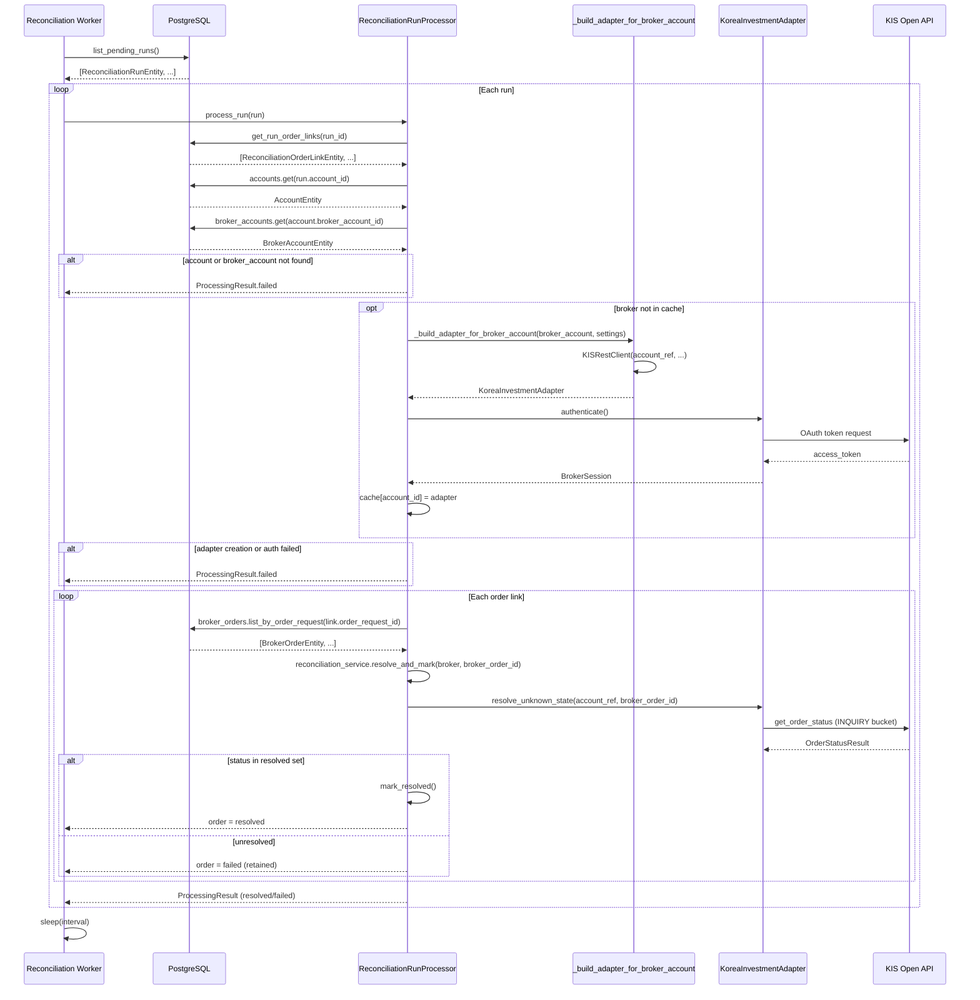
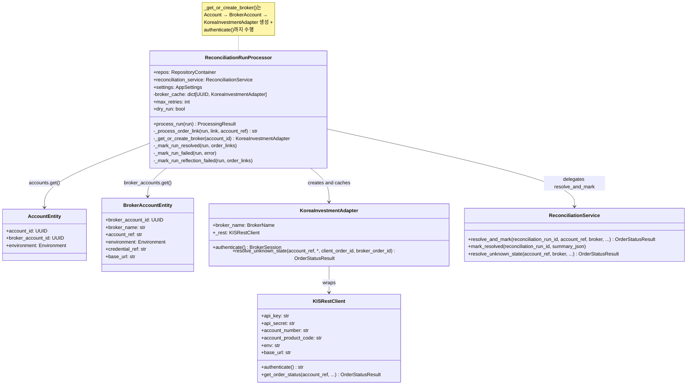

# Reconciliation Worker — KIS BrokerAdapter 통합 설계

**작성일**: 2026-05-16  
**작성자**: Roo (Architect)  
**상태**: 초안  

---

## 목차

1. [현재 상태 분석](#1-현재-상태-분석)
2. [BrokerAdapter 생성 방식 설계](#2-brokeradapter-생성-방식-설계)
3. [Account 단위 인증 재사용](#3-account-단위-인증-재사용)
4. [resolve_unknown_state 호출 설계](#4-resolve_unknown_state-호출-설계)
5. [Graceful Failure](#5-graceful-failure)
6. [Docker env 확인](#6-docker-env-확인)
7. [변경 대상 파일 목록](#7-변경-대상-파일-목록)
8. [테스트 계획](#8-테스트-계획)
9. [Sequence Diagram](#9-sequence-diagram)
10. [클래스/데이터 흐름](#10-클래스데이터-흐름)

---

## 1. 현재 상태 분석

### 1.1 `_get_broker()` 현재 구현

[`ReconciliationRunProcessor._get_broker()`](src/agent_trading/services/reconciliation_worker.py:228)는 현재 **placeholder** 수준:

```python
def _get_broker(self, account_id: UUID) -> object:
    return self.broker_cache.get(account_id)
```

- `broker_cache`는 `dict[UUID, object]`로 선언만 되어 있고 (`field(default_factory=dict)`), 아무것도 주입/저장하지 않음
- 항상 `None` 반환 → `resolve_and_mark()`로 전달되지만, `resolve_and_mark()`는 `broker`가 `None`이어도 `resolve_unknown_state()` 호출 시 `AttributeError` 발생
- 현재 테스트에서는 `patch.object(service, "resolve_and_mark", ...)`로 mock 처리하여 우회

### 1.2 필요한 BrokerAdapter 생성 인자

[`KoreaInvestmentAdapter`](src/agent_trading/brokers/koreainvestment/adapter.py:69) 생성 시그니처:

```python
def __init__(
    self,
    rest_client: KISRestClient,  # 필수
    mode: str = "paper",         # paper/live
    subscription_budget: SubscriptionBudget | None = None,  # WebSocket용, worker 불필요
    ws_url: str = "",            # WebSocket용, worker 불필요
)
```

[`KISRestClient`](src/agent_trading/brokers/koreainvestment/rest_client.py:220) 생성 시그니처:

```python
api_key: str                     # KIS_APP_KEY / KIS_API_KEY
api_secret: str                  # KIS_APP_SECRET / KIS_API_SECRET
account_number: str              # KIS_ACCOUNT_NO / KIS_ACCOUNT_NUMBER → from broker_account.account_ref
account_product_code: str        # KIS_ACCOUNT_PRODUCT_CODE (기본 "01")
env: str = "paper"               # "paper" | "live"  → from broker_account.environment
base_url: str = ""               # KIS_BASE_URL → from broker_account.base_url or settings
budget_manager: RateLimitBudgetManager | None = None  # 선택
dev_token_cache_enabled: bool = False
dev_token_cache_path: str = ".cache/kis_token.json"
```

**핵심 인자 매핑**:

| KISRestClient 인자 | 출처 | 비고 |
|---|---|---|
| `api_key` | [`AppSettings.kis_api_key`](src/agent_trading/config/settings.py:243) | 전역 설정. `credential_ref` 무관하게 동일 |
| `api_secret` | [`AppSettings.kis_api_secret`](src/agent_trading/config/settings.py:244) | 전역 설정 |
| `account_number` | [`BrokerAccountEntity.account_ref`](src/agent_trading/domain/entities.py:37) | **계정별 상이** — KIS 계좌번호 |
| `account_product_code` | [`AppSettings.kis_account_product_code`](src/agent_trading/config/settings.py:246) | 전역 설정 (기본 "01") |
| `env` | [`BrokerAccountEntity.environment`](src/agent_trading/domain/entities.py:38) | PAPER → "paper", LIVE → "live" |
| `base_url` | [`BrokerAccountEntity.base_url`](src/agent_trading/domain/entities.py:40) or `AppSettings.kis_base_url` | 계정별 override 가능 |

### 1.3 account → broker_account → broker credential 조회 경로

현재 [`process_run()`](src/agent_trading/services/reconciliation_worker.py:90-101)은 이미 account/broker_account 조회를 수행 중:

```
run.account_id → repos.accounts.get() → AccountEntity
                                         └─ broker_account_id
                                              → repos.broker_accounts.get() → BrokerAccountEntity
                                                                               ├─ broker_name: str ("koreainvestment")
                                                                               ├─ account_ref: str (KIS 계좌번호)
                                                                               ├─ environment: Environment (PAPER/LIVE)
                                                                               ├─ credential_ref: str (어느 credential set?)
                                                                               ├─ base_url: str | None
                                                                               └─ status: str
```

**중요**: `credential_ref` 필드가 존재하지만 (`"KIS_PAPER"`, `"KIS_LIVE"` 등), **현재 시스템은 모든 KIS credential을 전역 `AppSettings`에서 읽음**. 즉 `credential_ref`는 메타데이터로만 존재하고 실제 credential resolution에는 사용되지 않음. 이 설계에서도 동일한 방식 유지.

---

## 2. BrokerAdapter 생성 방식 설계

### 옵션 분석

#### 옵션 A: SnapshotFetchProvider 재사용 ❌

[`SnapshotFetchProvider`](src/agent_trading/brokers/snapshot_factory.py)는 snapshot sync 목적으로 설계됨:
- 반환하는 `SnapshotSyncComponents`는 `SnapshotFetchProvider` 타입 (position/cash balance 전용)
- `SnapshotFetchProvider`는 `resolve_unknown_state()` 메서드가 없음
- BrokerAdapter 생성이 아니라 snapshot 전용 provider 생성

**결론**: 부적합. Worker는 `BrokerAdapter`가 필요하고 `SnapshotFetchProvider`는 다른 프로토콜.

#### 옵션 B: 독립 BrokerAdapter Factory ✅ (권장)

Worker 전용 간단한 팩토리 함수를 [`reconciliation_worker.py`](src/agent_trading/services/reconciliation_worker.py)에 추가:

```python
def build_reconciliation_broker_adapter(
    broker_account: BrokerAccountEntity,
    settings: AppSettings,
) -> KoreaInvestmentAdapter:
    """Worker 전용 BrokerAdapter를 생성합니다.
    
    SnapshotFactory와 달리 WebSocket/SubscriptionBudget 없이 
    reconciliation inquiry에 최적화된 adapter를 생성합니다.
    """
    from agent_trading.brokers.koreainvestment.rest_client import KISRestClient
    from agent_trading.brokers.koreainvestment.adapter import KoreaInvestmentAdapter
    from agent_trading.brokers.rate_limit import build_kis_budget_manager
    
    budget_manager = build_kis_budget_manager(
        kis_env=settings.kis_env,
        real_rest_rps=settings.kis_real_rest_rps,
        paper_rest_rps=settings.kis_paper_rest_rps,
    )
    
    rest_client = KISRestClient(
        api_key=settings.kis_api_key,
        api_secret=settings.kis_api_secret,
        account_number=broker_account.account_ref,
        account_product_code=settings.kis_account_product_code,
        env=broker_account.environment.value,  # "paper" | "live"
        base_url=broker_account.base_url or settings.kis_base_url,
        budget_manager=budget_manager,
        dev_token_cache_enabled=settings.kis_dev_token_cache_enabled,
        dev_token_cache_path=settings.kis_dev_token_cache_path,
    )
    
    return KoreaInvestmentAdapter(
        rest_client=rest_client,
        mode=broker_account.environment.value,
        # Worker는 WebSocket 불필요 → subscription_budget/ws_url 생략
    )
```

**장점**:
- 검증된 `KISRestClient` + `KoreaInvestmentAdapter` 재사용
- Worker에 특화 — WebSocket/SubscriptionBudget 없이 가벼움
- 기존 `build_kis_budget_manager` 재사용
- `broker_account.account_ref`를 `account_number`로 직접 매핑 (계정별 adapter)

**단점**:
- 팩토리 함수 위치 결정 필요

#### 옵션 C: BrokerAdapter 직접 생성 ❌

각 `_process_order_link()`에서 직접 `KISRestClient` + `KoreaInvestmentAdapter` 인스턴스화:
- 계정별 adapter 생성 로직이 `_process_order_link()`에 분산
- 인증 캐싱 어려움
- 테스트 어려움

**결론**: 부적합.

### 2.1 권장: 옵션 B — 구현 세부

**팩토리 위치**: [`src/agent_trading/services/reconciliation_worker.py`](src/agent_trading/services/reconciliation_worker.py) 내 독립 함수

**팩토리 시그니처**:

```python
def _build_adapter_for_broker_account(
    broker_account: BrokerAccountEntity,
    settings: AppSettings,
) -> KoreaInvestmentAdapter:
```

**`ReconciliationRunProcessor` 변경사항**:
1. 생성자에 `settings: AppSettings` 필드 추가
2. `broker_cache` 타입 변경: `dict[UUID, KoreaInvestmentAdapter]`
3. `_get_broker()` → `_get_or_create_broker()`로 변경

```python
@dataclass
class ReconciliationRunProcessor:
    repos: RepositoryContainer
    reconciliation_service: ReconciliationService
    settings: AppSettings  # NEW
    broker_cache: dict[UUID, KoreaInvestmentAdapter] = field(default_factory=dict)  # 타입 변경
    max_retries: int = 3
    dry_run: bool = False
    
    async def _get_or_create_broker(
        self, 
        account_id: UUID,
    ) -> KoreaInvestmentAdapter | None:
        """Get cached broker adapter or create new one for the account."""
        # Check cache first
        cached = self.broker_cache.get(account_id)
        if cached is not None:
            return cached
        
        # Look up account → broker_account
        account = await self.repos.accounts.get(account_id)
        if account is None:
            logger.error("Account not found for broker creation: %s", account_id)
            return None
        
        broker_account = await self.repos.broker_accounts.get(account.broker_account_id)
        if broker_account is None:
            logger.error("Broker account not found: %s", account.broker_account_id)
            return None
        
        # Validate broker type
        if broker_account.broker_name != "koreainvestment":
            logger.warning(
                "Unsupported broker for reconciliation: %s", broker_account.broker_name
            )
            return None
        
        try:
            adapter = _build_adapter_for_broker_account(
                broker_account, self.settings,
            )
            await adapter.authenticate()
            self.broker_cache[account_id] = adapter
            return adapter
        except Exception as exc:
            logger.error(
                "Failed to create/authenticate broker adapter "
                "for account_id=%s: %s", account_id, exc,
            )
            return None
```

---

## 3. Account 단위 인증 재사용

### 3.1 캐시 설계

```
broker_cache: dict[UUID, KoreaInvestmentAdapter]
            key: account_id (UUID)
            value: 인증된 KoreaInvestmentAdapter 인스턴스
```

**수명주기**:
- Worker의 단일 `process_run()` 호출 내에서 유지됨
- 동일 cycle 내 여러 run이 같은 account를 처리하면 adapter 재사용
- cycle 종료 시 cache는 GC 대상 (별도 cleanup 불필요)

**제약**: 각 cycle마다 새 `ReconciliationRunProcessor`가 생성되므로 (`_run_one_cycle()` 내에서 생성), cache는 cycle 간 공유되지 않음. 이는 의도적 설계 — 각 cycle이 독립적.

### 3.2 인증 실패 처리

```python
# _get_or_create_broker() 내부
try:
    adapter = _build_adapter_for_broker_account(broker_account, self.settings)
    await adapter.authenticate()  # KIS OAuth token 발급
    self.broker_cache[account_id] = adapter
    return adapter
except Exception as exc:
    logger.error("Failed to create/authenticate broker adapter: %s", exc)
    return None  # → _process_order_link에서 "failed" 처리
```

### 3.3 캐시 만료 정책

**선택사항**으로, 캐시 만료를 위해 타임스탬프 추적 가능:

```python
@dataclass
class CachedAdapter:
    adapter: KoreaInvestmentAdapter
    created_at: datetime
```

그러나 cycle 단위 수명이므로 **만료 정책 불필요** (단순화). cycle 내에서는 adapter가 만료되지 않음.

---

## 4. resolve_unknown_state() 호출 설계

### 4.1 호출 흐름

```
ReconciliationRunProcessor._process_order_link()
  │
  ├─ broker = await self._get_or_create_broker(run.account_id)
  │    (실패 시 → "failed" 반환)
  │
  └─ await self.reconciliation_service.resolve_and_mark(
         reconciliation_run_id=run.reconciliation_run_id,
         account_ref=account_ref,           # broker_account.account_ref
         broker=broker,                     # KoreaInvestmentAdapter 인스턴스
         client_order_id=None,
         broker_order_id=bo.broker_native_order_id,
     )
       │
       ├─ await broker.resolve_unknown_state(account_ref, broker_order_id=...)
       │    → KISRestClient.get_order_status() 호출 (INQUIRY bucket)
       │    → OrderStatusResult 반환
       │
       └─ 상태 확인:
            ├─ resolved (FILLED/CANCELLED/REJECTED/EXPIRED/ACKNOWLEDGED)
            │    → mark_resolved() + (optional) transition_to_authoritative()
            │    → ProcessingResult "resolved"
            │
            ├─ RECONCILE_REQUIRED (unresolved)
            │    → run은 "reconcile_required" 유지
            │    → ProcessingResult "failed"
            │
            └─ 그 외 (exception 등)
                 → "failed" 반환
```

### 4.2 resolve_and_mark()의 broker=None 처리

현재 `resolve_and_mark()`는 `broker`가 `None`일 때 `resolve_unknown_state()` 호출 시 `AttributeError` 발생.  
변경 후에는 `_get_or_create_broker()`가 실패 시 `None` 반환 → **호출 전에 가드**:

```python
# _process_order_link() 내부
broker = await self._get_or_create_broker(run.account_id)
if broker is None:
    return "failed"  # skip, run은 retained
```

### 4.3 입력/출력

**입력**:
- `account_ref`: `BrokerAccountEntity.account_ref` (KIS 계좌번호)
- `broker_order_id`: `BrokerOrderEntity.broker_native_order_id` (KIS 주문번호)
- `client_order_id`: `None` (broker_native_order_id만으로 충분)

**출력**: `OrderStatusResult` (from `BrokerAdapter.resolve_unknown_state()`)
- `.status`: `OrderStatus` (FILLED, CANCELLED, REJECTED, ACKNOWLEDGED, RECONCILE_REQUIRED 등)
- `.remaining_quantity`: 잔여 수량
- `.last_updated_at`: 브로커 마지막 업데이트 시간

---

## 5. Graceful Failure

| 실패 지점 | 영향 | 처리 |
|---|---|---|
| `repos.accounts.get()` 실패 | 해당 run | `"failed"` 반환, run retained |
| `repos.broker_accounts.get()` 실패 | 해당 run | `"failed"` 반환, run retained |
| `_build_adapter_for_broker_account()` 실패 | 해당 run | error log + `"failed"` 반환 |
| `adapter.authenticate()` 실패 | 해당 account의 모든 run | error log + `"failed"` 반환 |
| `resolve_and_mark()` 내 `resolve_unknown_state()` 실패 | 해당 order | error log + `"failed"` 반환 |
| `mark_resolved()` 실패 | 해당 run | error log (run은 이미 resolved로 마크 시도) |
| `transition_to_authoritative()` 실패 | 해당 order | `"reflection_failed"` 상태로 전이 (기존 Plan 35 동작) |
| cycle 전체 예외 | 전체 cycle | cycle 수준 try/except에서 캐치, 다음 cycle 계속 |

**Worker loop는 항상 계속 실행** — 단일 run/order 실패가 전체 worker를 중단시키지 않음.

---

## 6. Docker env 확인

### 6.1 reconciliation-worker 서비스 env 구성

[`docker-compose.yml`](docker-compose.yml:354-394)에 reconciliation-worker 서비스의 env 정의 확인 결과:

**KIS env — 모두 설정됨** ✅
| 변수 | 상태 | 출처 |
|---|---|---|
| `KIS_ENV` | ✅ `${KIS_ENV:-paper}` | paper 기본값 |
| `KIS_APP_KEY` | ✅ `${KIS_APP_KEY:-}` | .env 또는 Kubernetes Secret |
| `KIS_APP_SECRET` | ✅ `${KIS_APP_SECRET:-}` | .env 또는 Kubernetes Secret |
| `KIS_ACCOUNT_NO` | ✅ `${KIS_ACCOUNT_NO:-}` | .env 또는 Kubernetes Secret |
| `KIS_ACCOUNT_PRODUCT_CODE` | ✅ `${KIS_ACCOUNT_PRODUCT_CODE:-01}` | 기본 "01" |
| `KIS_BASE_URL` | ✅ `${KIS_BASE_URL:-}` | .env |
| `KIS_WS_URL` | ✅ `${KIS_WS_URL:-}` | Worker는 WebSocket 불필요 |
| `KIS_PAPER_REST_RPS` | ✅ `${KIS_PAPER_REST_RPS:-1}` | rate limit (canonical=1) |
| `KIS_API_KEY` | ✅ fallback (legacy) |
| `KIS_API_SECRET` | ✅ fallback (legacy) |
| `KIS_ACCOUNT_NUMBER` | ✅ fallback (legacy) |
| `KIS_DEV_TOKEN_CACHE_ENABLED` | ✅ `true` | dev token cache |
| `KIS_DEV_TOKEN_CACHE_PATH` | ✅ `.cache/kis_token.json` |

**Worker 특화 env — 모두 설정됨** ✅
| 변수 | 상태 |
|---|---|
| `RECONCILIATION_WORKER_INTERVAL_SECONDS` | ✅ `${RECONCILIATION_WORKER_INTERVAL_SECONDS:-30}` |
| `RECONCILIATION_WORKER_BATCH_SIZE` | ✅ `${RECONCILIATION_WORKER_BATCH_SIZE:-10}` |

**결론**: Docker env 변경 불필요. 모든 KIS credential이 이미 전달됨.

### 6.2 `AppSettings` 로딩

`run_reconciliation_worker.py`는 현재 `settings = AppSettings()`를 사용하지 않음.  
`_run_one_cycle()`과 `_run_loop()`는 `AppSettings` 없이 DB connection만 생성.

**변경 필요**: `_run_loop()`에서 `settings = AppSettings()` 생성 후 processor에 전달.

```python
# _run_loop() 내부
from agent_trading.config.settings import AppSettings

settings = AppSettings()
# ...
processor = ReconciliationRunProcessor(
    repos=repos,
    reconciliation_service=reconciliation_service,
    settings=settings,  # NEW
    dry_run=dry_run,
)
```

---

## 7. 변경 대상 파일 목록

### 7.1 주요 변경

| 파일 | 변경 내용 | 영향 범위 |
|---|---|---|
| [`src/agent_trading/services/reconciliation_worker.py`](src/agent_trading/services/reconciliation_worker.py) | 1. `ReconciliationRunProcessor`에 `settings: AppSettings` 필드 추가<br>2. `_build_adapter_for_broker_account()` 팩토리 함수 추가<br>3. `_get_broker()` → `_get_or_create_broker()`로 대체<br>4. `broker_cache` 타입 변경 (`dict[UUID, object]` → `dict[UUID, KoreaInvestmentAdapter]`)<br>5. `_process_order_link()`에서 broker None 가드 추가 | 핵심 |
| [`scripts/run_reconciliation_worker.py`](scripts/run_reconciliation_worker.py) | 1. `AppSettings` import 추가<br>2. `_run_one_cycle()` / `_run_loop()`에서 `settings` 생성 및 processor에 전달 | 종속 변경 |

### 7.2 테스트 파일

| 파일 | 변경 내용 |
|---|---|
| [`tests/services/test_reconciliation_worker.py`](tests/services/test_reconciliation_worker.py) | 1. 새로운 테스트 추가 (아래 테스트 계획 참조)<br>2. 기존 테스트에 `settings` fixture 추가 |

### 7.3 변경 불필요

| 파일 | 이유 |
|---|---|
| [`docker-compose.yml`](docker-compose.yml) | 모든 KIS env 이미 설정됨 |
| [`src/agent_trading/config/settings.py`](src/agent_trading/config/settings.py) | 변경 불필요 |
| [`src/agent_trading/brokers/snapshot_factory.py`](src/agent_trading/brokers/snapshot_factory.py) | Worker 전용 팩토리이므로 수정 불필요 |
| [`src/agent_trading/services/reconciliation_service.py`](src/agent_trading/services/reconciliation_service.py) | `resolve_and_mark()`는 이미 `BrokerAdapter` 받도록 설계됨 |
| [`src/agent_trading/brokers/base.py`](src/agent_trading/brokers/base.py) | 변경 불필요 |
| [`src/agent_trading/brokers/koreainvestment/adapter.py`](src/agent_trading/brokers/koreainvestment/adapter.py) | 변경 불필요 |

---

## 8. 테스트 계획

### 8.1 새로운 테스트 (추가 필요)

| # | 테스트명 | 설명 | 검증 포인트 |
|---|---|---|---|
| T1 | `test_build_adapter_for_broker_account` | 팩토리 함수가 `KoreaInvestmentAdapter`를 정상 생성 | adapter 타입, rest_client.account_number == broker_account.account_ref |
| T2 | `test_get_or_create_broker_creates_new` | `_get_or_create_broker()`가 새 adapter 생성 후 캐시 | cache에 저장, authenticate 호출 |
| T3 | `test_get_or_create_broker_reuses_cached` | 동일 account_id 재요청 시 캐시 재사용 | authenticate 1회만 호출 |
| T4 | `test_get_or_create_broker_account_not_found` | account 미존재 시 None 반환 | error log, "failed" |
| T5 | `test_get_or_create_broker_unsupported_broker` | koreainvestment 외 broker는 None | error log, skip |
| T6 | `test_get_or_create_broker_auth_failure` | authenticate 실패 시 None | error log, "failed" |
| T7 | `test_resolve_unknown_state_resolved` | `resolve_and_mark()`가 resolved 상태 반환 → run resolved | run status == "resolved" |
| T8 | `test_resolve_unknown_state_unresolved` | broker가 RECONCILE_REQUIRED 반환 → run retained | run status == "started" 유지 |
| T9 | `test_truth_unavailable_keeps_reconcile_required` | broker API unavailable → run "failed" | error log, run status == "started" or "failed" |
| T10 | `test_worker_loop_continues_on_failure` | 일부 run 실패해도 loop 계속 실행 | ProcessingResult 수집, 다음 run 처리 |
| T11 | `test_inquiry_budget_exhaustion_graceful` | budget exhaustion 시 OrderStatusResult.RECONCILE_REQUIRED | run retained, error log |

### 8.2 기존 테스트 회귀 방지

변경 전 모든 기존 테스트 (`test_reconciliation_worker.py` 949라인)는 `settings` fixture 추가로 인한 최소 변경만 필요:

```python
@pytest.fixture
def worker(repos, service, settings) -> ReconciliationRunProcessor:
    return ReconciliationRunProcessor(
        repos=repos,
        reconciliation_service=service,
        settings=settings,
        dry_run=False,
    )

@pytest.fixture
def settings() -> AppSettings:
    from agent_trading.config.settings import AppSettings
    return AppSettings()
```

---

## 9. Sequence Diagram



---

## 10. 클래스/데이터 흐름



---

## 부록: 제약 사항 검토

| 제약 | 설계 대응 |
|---|---|
| `python3` 사용 | 기존 Python 3.12+ 코드베이스 활용 |
| `/bin/bash` 기준 | Docker entrypoint에 영향 없음 |
| `.env` 직접 수정 금지 | env는 docker-compose.yml로만 전달 |
| 프런트엔드 작업 금지 | 변경 범위에서 제외됨 |
| paper 전용 auto-resolve 정책은 범위 밖 | 설계 범위에서 제외됨 |
| 임의 terminal 처리 금지 | `execute_command` 사용 제한 — CLI 스크립트만 사용 |
| truth-driven convergence 원칙 유지 | broker inquiry → resolved 상태 전이로 보장 |
