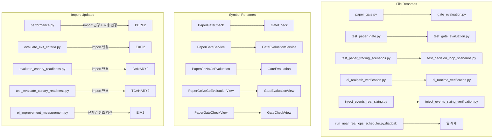

# 환경-틴티드 파일명 → 환경-중립 이름 rename 계획

> **목적**: Python source / test / script 파일에서 "paper", "near_real" 환경-틴티드(environment-tinted) 이름을 역할-기반(role-based) 이름으로 변경한다.
>
> **적용 범위**: 5개 파일 rename + 1개 파일 삭제 + 심볼 rename 5개.
>
> **제외**: plans/ 문서 갱신은 이번 턴 제외.

---

## 1. Rename 매핑 요약

### 1.1 파일 Rename

| # | 현재 경로 | 대상 경로 | 비고 |
|---|-----------|-----------|------|
| 1 | `src/agent_trading/services/paper_gate.py` | `src/agent_trading/services/gate_evaluation.py` | `GateEvaluationService`로 클래스명 변경 |
| 2 | `tests/services/test_paper_gate.py` | `tests/services/test_gate_evaluation.py` | #1 대응 테스트 |
| 3 | `tests/services/test_paper_trading_scenarios.py` | `tests/services/test_decision_loop_scenarios.py` | "paper trading" → "decision loop" |
| 4 | `scripts/ei_realpath_verification.py` | `scripts/ei_runtime_verification.py` | "realpath" → "runtime" |
| 5 | `scripts/inject_events_real_sizing.py` | `scripts/inject_events_sizing_verification.py` | 역할 명확화 |
| 6 | `scripts/run_near_real_ops_scheduler.py.diagbak` | **삭제** | `run_ops_scheduler.py`로 이전 완료된 legacy 백업 |

### 1.2 심볼 Rename (gate_evaluation.py)

| 현재 심볼 | 대상 심볼 | 종류 |
|-----------|-----------|------|
| `PaperGateCheck` | `GateCheck` | dataclass |
| `PaperGateService` | `GateEvaluationService` | class |
| `PaperGoNoGoEvaluation` | `GateEvaluation` | dataclass |
| `PaperGoNoGoEvaluationView` | `GateEvaluationView` | Pydantic model (schemas.py) |
| `PaperGateCheckView` | `GateCheckView` | Pydantic model (schemas.py) |

### 1.3 유지 항목 (이번 턴 변경 없음)

| 항목 | 사유 |
|------|------|
| API route `GET /performance/paper-go-no-go` | endpoint명 변경은 Admin UI 영향, 별도 검토 필요 |
| `compute_reason_code_summary()` 함수명 | 환경 중립적, rename 불필요 |
| `GateStatus` enum | 환경 중립적 (PASS/WARN/FAIL) |
| `OverallStatus` enum | 환경 중립적 (GO/HOLD/NO_GO) |
| `paper_gate_*` 설정 키 (settings.py) | env var backward compat 유지 |
| `plans/` 문서 대량 갱신 | 이번 턴 범위 제외 |

---

## 2. 영향 분석

### 2.1 Module Import 변경 (gate_evaluation.py)

| 파일 | 현재 import | 변경 후 import |
|------|------------|---------------|
| `src/agent_trading/api/routes/performance.py` | `from agent_trading.services.paper_gate import PaperGateService` | `from agent_trading.services.gate_evaluation import GateEvaluationService` |
| `scripts/evaluate_exit_criteria.py` | `from agent_trading.services.paper_gate import GateStatus` | `from agent_trading.services.gate_evaluation import GateStatus` |
| `scripts/evaluate_canary_readiness.py` | `from agent_trading.services.paper_gate import GateStatus` | `from agent_trading.services.gate_evaluation import GateStatus` |
| `tests/services/test_gate_evaluation.py` (구 test_paper_gate.py) | `from agent_trading.services.paper_gate import (...)` | `from agent_trading.services.gate_evaluation import (...)` |
| `tests/scripts/test_evaluate_canary_readiness.py` | `from agent_trading.services.paper_gate import compute_reason_code_summary` | `from agent_trading.services.gate_evaluation import compute_reason_code_summary` |

### 2.2 심볼 사용 변경 (performance.py)

```python
# 변경 전
from agent_trading.services.paper_gate import PaperGateService
...
service = PaperGateService(repos=repos, settings=settings)
...
return PaperGoNoGoEvaluationView.model_validate(evaluation)

# 변경 후
from agent_trading.services.gate_evaluation import GateEvaluationService
...
service = GateEvaluationService(repos=repos, settings=settings)
...
return GateEvaluationView.model_validate(evaluation)
```

### 2.3 심볼 사용 변경 (schemas.py)

```python
# 변경 전
class PaperGateCheckView(BaseModel): ...
class PaperGoNoGoEvaluationView(BaseModel): ...

# 변경 후
class GateCheckView(BaseModel): ...
class GateEvaluationView(BaseModel): ...
```

### 2.4 심볼 사용 변경 (gate_evaluation.py 내부)

| 심볼 | 변경 전 | 변경 후 | 파일 내 사용 위치 |
|------|---------|---------|-----------------|
| `PaperGateCheck` | `class PaperGateCheck:` | `class GateCheck:` | dataclass 정의 + evaluate() return type hint + 각 _check_* 메서드 return type |
| `PaperGateService` | `class PaperGateService:` | `class GateEvaluationService:` | class 정의 + evaluate() docstring |
| `PaperGoNoGoEvaluation` | `class PaperGoNoGoEvaluation:` | `class GateEvaluation:` | dataclass 정의 + evaluate() return type + evaluate() return문 |
| `PaperGoNoGoEvaluation` 참조 | `-> PaperGoNoGoEvaluation` | `-> GateEvaluation` | evaluate() 메서드 시그니처 |

### 2.5 Test file 변경 (test_gate_evaluation.py, 구 test_paper_gate.py)

- 모든 `PaperGateService(` → `GateEvaluationService(`
- 모든 `PaperGateCheck` → `GateCheck`
- 모든 `PaperGoNoGoEvaluation` → `GateEvaluation`
- `from agent_trading.services.paper_gate import (...)` → `from agent_trading.services.gate_evaluation import (...)`

### 2.6 Script rename — ei_runtime_verification.py

- docstring 내 `python -m scripts.ei_realpath_verification` → `python -m scripts.ei_runtime_verification`
- `ei_improvement_measurement.py` line 422: `"코드 레벨 검증(ei_realpath_verification.py)으로 대체 완료"` → `"코드 레벨 검증(ei_runtime_verification.py)으로 대체 완료"`

### 2.7 Script rename — inject_events_sizing_verification.py

- docstring 내 `Inject 4 bullish seeded_news events for 005930 to force BUY decision` → 유지 (파일명만 변경)
- `scripts/kis_paper_rps1_smoke_test_strategy_2026-05-25.md` plan에서 참조하나, **plans 갱신 제외**이므로 skip

### 2.8 .diagbak 삭제

- `scripts/run_near_real_ops_scheduler.py.diagbak` (1675 lines) — 단순 삭제
- `run_near_real_ops_scheduler.py`는 이미 `run_ops_scheduler.py`로 이전 완료
- `.diagbak` extension으로 git이 추적 중일 가능성 있음

---

## 3. 실행 계획 (SubTask)

### SubTask 1: paper_gate.py → gate_evaluation.py + 심볼 rename

**변경 파일**:
- `src/agent_trading/services/paper_gate.py` → mv → `src/agent_trading/services/gate_evaluation.py`
- `src/agent_trading/services/gate_evaluation.py` 내부 심볼 rename 3개

**세부 변경**:
1. `mv src/agent_trading/services/paper_gate.py src/agent_trading/services/gate_evaluation.py`
2. `PaperGateCheck` → `GateCheck` (9개 occurrences: class 정의 + evaluate 시그니처 + 각 _check_* 메서드)
3. `PaperGateService` → `GateEvaluationService` (4개: class 정의 + evaluate 시그니처 + evaluate docstring)
4. `PaperGoNoGoEvaluation` → `GateEvaluation` (4개: class 정의 + evaluate return type + evaluate docstring + evaluate return문)

### SubTask 2: schemas.py 심볼 rename

**변경 파일**: `src/agent_trading/api/schemas.py`

**세부 변경**:
1. `PaperGateCheckView` → `GateCheckView` (class 정의)
2. `PaperGoNoGoEvaluationView` → `GateEvaluationView` (class 정의 + docstring)

### SubTask 3: performance.py import + 심볼 rename

**변경 파일**: `src/agent_trading/api/routes/performance.py`

**세부 변경**:
1. import: `from agent_trading.services.paper_gate import PaperGateService` → `from agent_trading.services.gate_evaluation import GateEvaluationService`
2. `PaperGoNoGoEvaluationView` → `GateEvaluationView` (import + response_model + return type + model_validate)
3. `PaperGateService(` → `GateEvaluationService(`
4. `PaperGoNoGoEvaluationView.model_validate(` → `GateEvaluationView.model_validate(`

### SubTask 4: test_paper_gate.py → test_gate_evaluation.py + 심볼 rename

**변경 파일**: `tests/services/test_paper_gate.py` → mv + content changes

**세부 변경**:
1. `mv tests/services/test_paper_gate.py tests/services/test_gate_evaluation.py`
2. import: `from agent_trading.services.paper_gate` → `from agent_trading.services.gate_evaluation`
3. `PaperGateService(` → `GateEvaluationService(` (~14건)
4. `PaperGateCheck` → `GateCheck` (~5건: type hint, _assert_check signature, docstring)
5. `PaperGoNoGoEvaluation` → `GateEvaluation` (docstring/conftest comment)

### SubTask 5: evaluate_exit_criteria.py + evaluate_canary_readiness.py import 갱신

**변경 파일**:
- `scripts/evaluate_exit_criteria.py`
- `scripts/evaluate_canary_readiness.py`

**세부 변경**:
- `from agent_trading.services.paper_gate import GateStatus` → `from agent_trading.services.gate_evaluation import GateStatus`

### SubTask 6: test_evaluate_canary_readiness.py import 갱신

**변경 파일**: `tests/scripts/test_evaluate_canary_readiness.py`

**세부 변경**:
- `from agent_trading.services.paper_gate import compute_reason_code_summary` → `from agent_trading.services.gate_evaluation import compute_reason_code_summary`

### SubTask 7: test_paper_trading_scenarios.py → test_decision_loop_scenarios.py

**변경 파일**: `tests/services/test_paper_trading_scenarios.py` → mv

**세부 변경**:
1. `mv tests/services/test_paper_trading_scenarios.py tests/services/test_decision_loop_scenarios.py`
2. docstring 내 `Paper Trading Loop E2E 검증` → `Decision Loop E2E 검증` (내부 텍스트는 선택)

### SubTask 8: ei_realpath_verification.py → ei_runtime_verification.py

**변경 파일**:
- `scripts/ei_realpath_verification.py` → mv + docstring 갱신
- `scripts/ei_improvement_measurement.py` — 문자열 참조 갱신

**세부 변경**:
1. `mv scripts/ei_realpath_verification.py scripts/ei_runtime_verification.py`
2. `scripts/ei_runtime_verification.py` docstring: `ei_realpath_verification` → `ei_runtime_verification`
3. `scripts/ei_improvement_measurement.py` line 422: 문자열 참조 갱신

### SubTask 9: inject_events_real_sizing.py → inject_events_sizing_verification.py

**변경 파일**: `scripts/inject_events_real_sizing.py` → mv

**세부 변경**:
1. `mv scripts/inject_events_real_sizing.py scripts/inject_events_sizing_verification.py`
2. docstring 갱신 (optional)

### SubTask 10: .diagbak 삭제

**변경 파일**: `scripts/run_near_real_ops_scheduler.py.diagbak` — 삭제

### SubTask 11: pytest 검증

```bash
cd /workspace/agent_trading && python3 -m pytest tests/ -x -q --tb=short 2>&1 | tail -30
```

### SubTask 12: `rg` 재검증

```bash
cd /workspace/agent_trading && rg --files | rg 'near_real|paper|live|real'
```

예상 결과:
- `paper_gate_*` env 키 참조 (settings.py) — 허용 (유지)
- `paper-go-no-go` API route — 허용 (유지)
- `paper/` 관련 design docs — 허용 (plans 갱신 제외)
- rename된 파일명이 신규 경로로 반영되어야 함

---

## 4. 완료 기준

1. ✅ 6개 파일 rename 완료 (paper_gate.py, test_paper_gate.py, test_paper_trading_scenarios.py, ei_realpath_verification.py, inject_events_real_sizing.py, .diagbak)
2. ✅ 5개 심볼 rename 완료 (PaperGateCheck→GateCheck, PaperGateService→GateEvaluationService, PaperGoNoGoEvaluation→GateEvaluation, PaperGoNoGoEvaluationView→GateEvaluationView, PaperGateCheckView→GateCheckView)
3. ✅ 모든 import 경로 갱신 완료 (5개 파일)
4. ✅ pytest 전 구간 통과
5. ✅ `rg --files | rg 'near_real|paper|live|real'` 결과 확인

---

## 5. 변경 흐름도



---

## 6. 주의사항

1. **실행 순서**: SubTask 1 (gate_evaluation.py 생성) 완료 후 SubTask 2~6을 실행해야 import chain이 깨지지 않음.
   - 즉, `paper_gate.py` rename이 SubTask 2~6보다 **먼저** 실행되어야 함.
   - `test_paper_gate.py` rename도 SubTask 2~6보다 먼저일 필요는 없으나, SubTask 1 완료 후가 안전.

2. **.pyc 캐시**: `mv` 후 `__pycache__` 디렉토리에 이전 `.pyc` 파일이 남을 수 있음. `find . -type d -name __pycache__ -exec rm -rf {} + 2>/dev/null` 실행 권장.

3. **pytest discovery**: `test_paper_trading_scenarios.py` → `test_decision_loop_scenarios.py` rename 시 pytest가 새 파일명으로 자동 발견.

4. **scripts/ 모듈 참조**: `python -m scripts.ei_runtime_verification` 방식으로 실행 시 module path가 변경되므로, 사용 중인 entrypoint/subprocess 경로 확인 필요.
