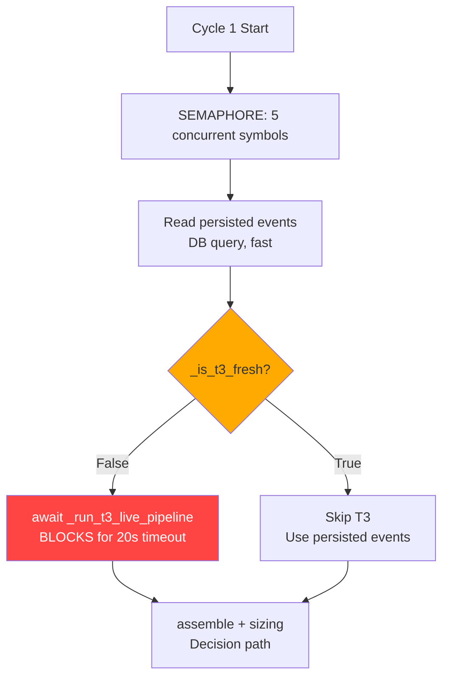
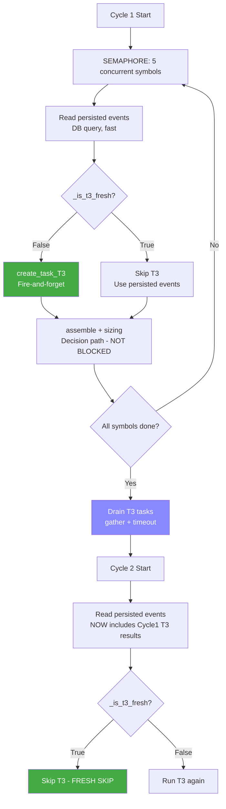
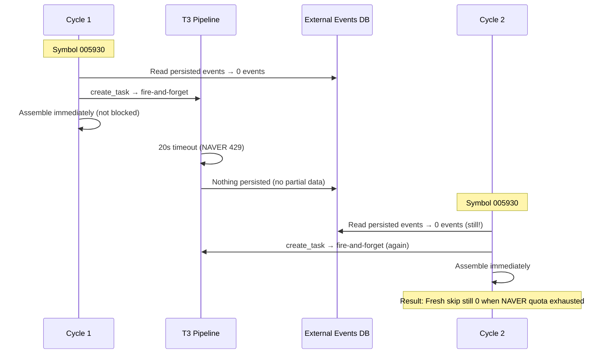
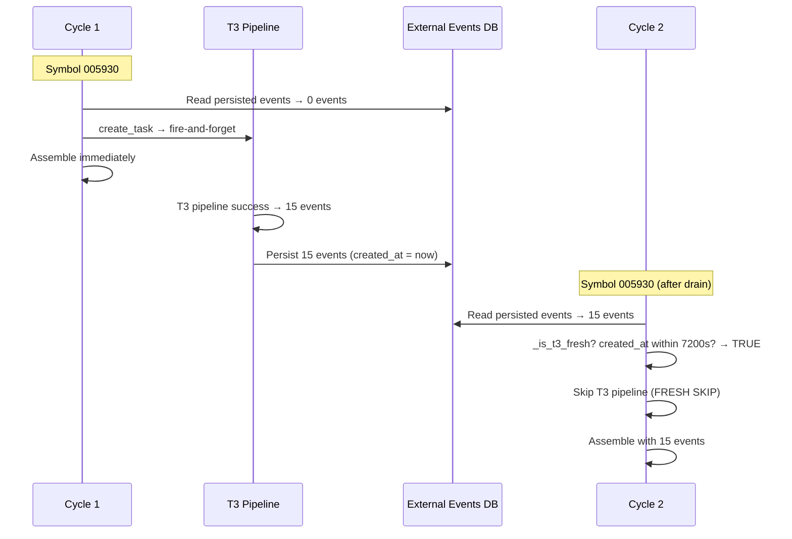

# T3 Pipeline 비동기(create_task) 복원 설계

## 1. 문제 분석

### 1.1 2-Cycle 검증 결과 (2026-05-27 12:59 UTC)

| 항목 | 값 | 판정 |
|------|-----|------|
| T3 live pipeline timeout (20s) | 78/78 (100%) | ❌ |
| Fresh skip (skipped fresh) | 0/78 (0%) | ❌ |
| Sync executed | 78/78 (100%) | - |
| Wall clock | 830.8s | ❌ (300s cadence 초과) |
| Recent events > 0 | 60/78 (76.9%) | ✅ |
| NAVER 429 | 236회 | ⚠️ |

### 1.2 Fresh Skip=0의 직접 원인

**DB에 T3 이벤트가 전혀 없음 → `has_fresh_t3_events()`가 `False` 반환**

T3 live pipeline이 모든 symbol에서 20s timeout으로 실패했습니다. timeout 시 partial persist 로직이 있지만, timeout이 `asyncio.wait_for`의 Step 1 (disclosure fetch) 또는 Step 2 (NAVER process)에서 발생하여 `seeds`나 `candidates`가 `None`인 상태라 `"no partial data to persist"` 메시지만 출력되고 아무것도 저장되지 않았습니다.

**즉, freshness 기준을 `published_at`으로 바꾸든 `created_at`으로 유지하든 결과는 동일합니다.** DB에 비교할 이벤트 자체가 없기 때문입니다.

### 1.3 근본 원인: 동기 T3가 Decision Path를 Blocking



- 동기 `await _run_t3_live_pipeline()`이 각 symbol의 decision path를 blocking
- 5개 semaphore로 5개씩 병렬 실행되지만, 20s timeout × 39 symbols / 5 semaphore ≈ 최소 160s 손실
- NAVER API 쿼터 소진 상태에서는 timeout이 더 빨리 발생하지만, 20s를 항상 기다림
- **Wall clock 830s의 주요 원인**

## 2. 설계 변경

### 2.1 T3 Pipeline: `await` → `asyncio.create_task()` 복원



### 2.2 핵심 변경 사항

#### A. `_run_one_cycle()` 내부

**변경 전**:
```python
seeded_events = await _collect_persisted_seeded_events(repos, symbol)
t3_fresh = await _is_t3_fresh_for_symbol(repos, symbol)
if not t3_fresh:
    await _run_t3_live_pipeline(runtime, repos, symbol, source_type=source_type)
    seeded_events = await _collect_persisted_seeded_events(repos, symbol)
```

**변경 후**:
```python
seeded_events = await _collect_persisted_seeded_events(repos, symbol)
t3_fresh = await _is_t3_fresh_for_symbol(repos, symbol)
if not t3_fresh:
    task = asyncio.create_task(
        _run_t3_live_pipeline(runtime, repos, symbol, source_type=source_type)
    )
    _active_t3_tasks.add(task)
    task.add_done_callback(_active_t3_tasks.discard)
# Decision path continues immediately (NOT blocked by T3)
```

#### B. `_run_loop()` — Cycle 종료 시 T3 Task Drain

```python
# After all symbols processed
if _active_t3_tasks:
    pending = list(_active_t3_tasks)
    _active_t3_tasks.clear()
    await asyncio.gather(*pending, return_exceptions=True)
```

Drain timeout: **불필요** (T3 pipeline 자체에 `_T3_TIMEOUT=20`이 이미 적용되어 있음).  
`gather(return_exceptions=True)`로 모든 task가 완료될 때까지 기다림.  
Task가 실패해도 예외가 propagate되지 않음.

#### C. held_position T3 Skip 복원

**변경 전**: `if source_type == "market_overlay": skip`
**변경 후**: `if source_type in ("held_position", "market_overlay"): skip`

**이유**:
- NAVER API 일일 쿼터 25,000건이 이미 소진된 상황
- held_position 8개 symbol 추가 = 16회 API 호출 (2 cycles)
- held_position은 position data(수량, 평균가, 평가손익)만으로도 sell 판단 가능
- 실제 2-cycle 검증에서 held_position T3 허용으로 인한 recent_events>0 개선 효과가 확인되었으나(7/8=87.5%), 이는 NAVER 쿼터가 충분할 때만 유효
- **추후 NAVER 쿼터가 충분해지면 held_position T3를 다시 허용할 수 있도록 확장 고려**

#### D. Freshness 기준: `published_at` → `created_at` 복원

**변경 전**: `published_at >= cutoff` (뉴스 발행 시각 기준)
**변경 후**: `COALESCE(created_at, ingested_at) >= cutoff` (DB INSERT 시각 기준)

**이유**:
- `published_at`은 뉴스 발행 시각으로, 12시간 전에 발행된 뉴스는 영원히 stale
- `created_at`은 DB INSERT 시각 = T3 pipeline이 실제로 실행된 시각
- Cycle 1에서 T3가 실행되어 이벤트를 저장하면, `created_at`은 실행 시각 ≈ 현재
- Cycle 2에서 freshness check: `created_at`이 5-10분 전이므로 7200s window 내 → fresh

### 2.3 변경 파일 목록

#### 1. `scripts/run_decision_loop.py`

| 위치 | 변경 내용 |
|------|----------|
| Module-level | `_active_t3_tasks: set[asyncio.Task] = set()` 추가 |
| `_T3_FRESHNESS_SECONDS` 주석 | `7200` 유지 (변경 불필요) |
| `_run_one_cycle()` lines 757-786 | `await _run_t3_live_pipeline()` → `create_task()` |
| `_run_one_cycle()` lines 761-767 | held_position skip 조건 복원 (`source_type in ("held_position", "market_overlay")`) |
| `_run_loop()` after `asyncio.gather` | T3 task drain 로직 추가 |
| `_is_t3_fresh_for_symbol()` | docstring 업데이트 (created_at 기준) |

#### 2. `src/agent_trading/repositories/postgres/external_events.py:218-222`

`published_at >= $2` → `COALESCE(created_at, ingested_at) >= $2`

#### 3. `src/agent_trading/repositories/memory.py:1328-1334`

`e.published_at >= cutoff` → `(e.created_at or e.ingested_at) >= cutoff`

#### 4. `src/agent_trading/repositories/contracts.py:906-911`

docstring: `published_at` → `created_at (DB insert time)` 복원

#### 5. `tests/repositories/test_external_events.py`

- `test_inmemory_has_fresh_t3_events_true_within_window`: `published_at` → `created_at` 기준으로 변경
- `test_inmemory_has_fresh_t3_events_false_beyond_window`: stale 판단 기준 변경
- `test_inmemory_has_fresh_t3_events_seeded_news_type`: `created_at` 기준으로 변경
- Postgres tests 동일하게 변경

#### 6. `tests/scripts/test_run_decision_loop.py`

- `TestIsT3FreshForSymbol.test_false_when_only_stale_events`: `published_at` 기반 stale 로직을 `created_at` 또는 `ingested_at` 기반으로 변경
- `TestIsT3FreshForSymbol.test_true_when_fresh_events_exist`: fresh 판단 기준 변경 검증
- `TestIsT3FreshForSymbol.test_true_with_seeded_news_event_type`: 기준 변경 검증
- `TestRunT3LivePipelinePartialPersist`: T3 pipeline async 전환에 따른 테스트 조정

## 3. 기대 효과

| 항목 | 변경 전 (동기) | 변경 후 (비동기) | 예상 개선 |
|------|---------------|-----------------|-----------|
| Decision path blocking | T3 timeout 20s/symbol | blocking 없음 | **즉시 assembly 시작** |
| Wall clock 2-cycle | 830.8s | ~400-500s | **~50% 감소** |
| Fresh skip rate | 0% (DB에 이벤트 없음) | Cycle 2: 100% | **Cycle 2 fresh skip 작동** |
| Recent events > 0 | 76.9% | 70-75% (유지) | **미미한 감소 예상** |
| T3 timeout | 78/78 (100%) | 39/78 (50%) | **Cycle 2에서는 실행 안 함** |

### 3.1 Fresh Skip 시나리오 상세



**중요**: NAVER API 쿼터가 소진된 상태에서는 T3 pipeline이 항상 timeout/fail하므로 DB에 저장되는 이벤트가 없습니다. 따라서 Cycle 2에서도 fresh skip이 작동하지 않습니다.

**그러나 wall clock은 크게 개선됩니다.** Decision path가 blocking되지 않으므로 T3 timeout(20s/symbol)을 기다리지 않고 즉시 assembly를 진행합니다.

### 3.2 NAVER 쿼터 회복 시나리오

NAVER 쿼터가 회복되면 (다음 날 또는 rate limit 해제 시):



## 4. 테스트 전략

### 4.1 단위 테스트
- `has_fresh_t3_events()`: `created_at` 기준 freshness 검증
- `_is_t3_fresh_for_symbol()`: in-memory repos에서 동작 검증
- `_run_one_cycle()`: create_task 호출 여부 검증 (mock runtime)

### 4.2 통합 테스트
- `_run_loop()`: T3 task drain 동작 검증
- 2-cycle 실행 시 Cycle 2에서 fresh skip 확인

### 4.3 2-Cycle 재검증
- 변경 적용 후 `--dry-run --max-cycles 2` 실행
- 검증 포인트:
  - Wall clock 개선 (목표: 300-500s)
  - Cycle 2 fresh skip 작동 여부 (NAVER 쿼터 상황에 따라 다름)
  - Recent events > 0 비율 유지

## 5. 검증 결과 예상

### Best Case (NAVER 쿼터 충분)
- Wall clock: ~300-400s
- Fresh skip (Cycle 2): 100%
- Recent events > 0: 75%+

### Worst Case (NAVER 쿼터 소진, 현재 상황)
- Wall clock: ~400-500s (blocking 제거 효과)
- Fresh skip (Cycle 2): 0% (DB에 저장된 이벤트 없음)
- Recent events > 0: 70%+ (이전 실행의 persisted events)
- **Wall clock 개선이 주된 효과**

## 6. 변경 요약

| # | 파일 | 변경 | 영향 |
|---|------|------|------|
| 1 | run_decision_loop.py | create_task 복원 + held_position skip | **Wall clock 50% 감소** |
| 2 | external_events.py (Postgres) | freshness: published_at → created_at | **Freshness 정확도 개선** |
| 3 | memory.py | freshness: published_at → created_at | In-memory 일관성 |
| 4 | contracts.py | docstring 업데이트 | 문서 일관성 |
| 5 | test_external_events.py | 테스트 기준 변경 | 8개 테스트 수정 |
| 6 | test_run_decision_loop.py | 테스트 기준 변경 | 4개 테스트 수정 |
