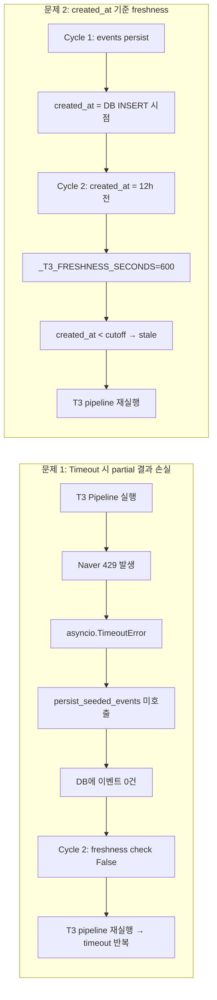
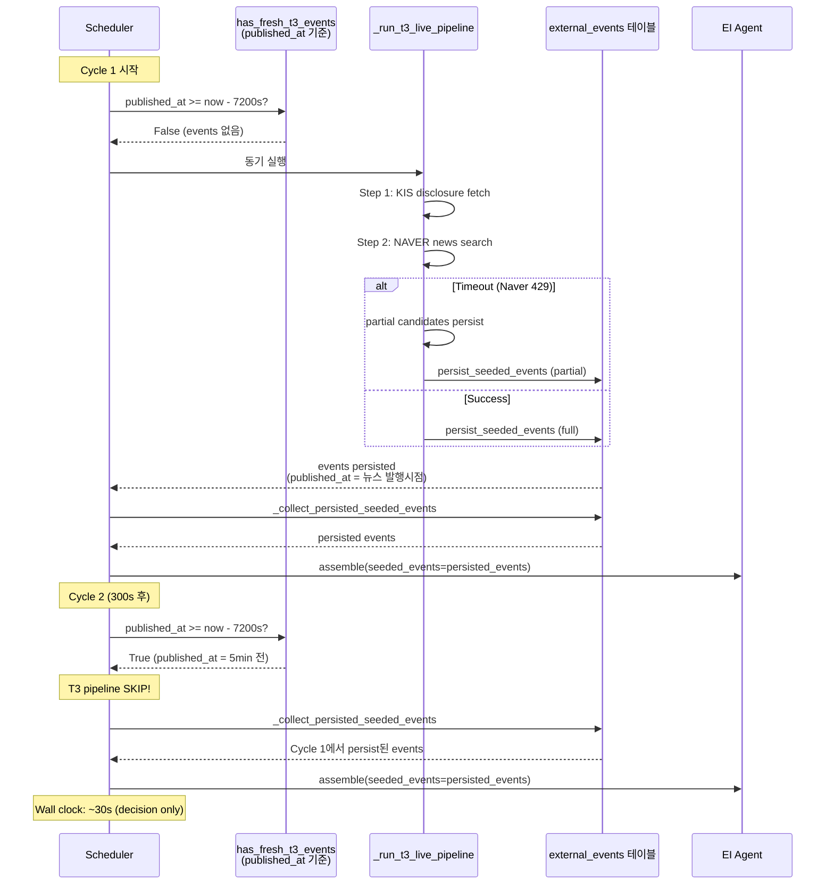

# T3 실행 정책 재설계

## 1. 근본 원인 요약



### 1.1 현재 코드 상태

| 항목 | 값 | 비고 |
|------|-----|------|
| `_T3_TIMEOUT` | 20s | 30→20 변경됨 |
| `_T3_FRESHNESS_SECONDS` | 600s (10분) | 7200→600 변경됨 (**악화**) |
| freshness 기준 컬럼 | `COALESCE(created_at, ingested_at)` | DB INSERT 시점 기준 |
| T3 pipeline 실행 방식 | `await` 동기 실행 | Cycle 1 same-cycle 공급 가능 |
| timeout 시 동작 | `logger.warning` 후 종료 | partial 결과 미저장 |

### 1.2 2-cycle 테스트 실패 분석

```
Cycle 1 (T=0s):
  _is_t3_fresh_for_symbol() → False (DB에 T3 events 없음)
  _run_t3_live_pipeline() → timeout (20s, Naver 429)
  persist_seeded_events() 호출 안 됨 → DB events = 0

Cycle 2 (T=300s):
  _is_t3_fresh_for_symbol() → False (DB에 T3 events 없음)
  _run_t3_live_pipeline() → timeout 반복
  freshness skip = 0건
```

---

## 2. 대안 평가

### 대안 A: freshness 기준을 `published_at`으로 변경

**변경 내용:**
- [`has_fresh_t3_events()`](src/agent_trading/repositories/postgres/external_events.py:221)의 WHERE 조건: `COALESCE(created_at, ingested_at) >= $2` → `published_at >= $2`
- `_T3_FRESHNESS_SECONDS = 7200` (2h) 유지

**semantics 변화:**
- `created_at` 기준: "최근에 T3 pipeline을 실행했는가?" → fetch 시점 기준
- `published_at` 기준: "최근에 발행된 뉴스 콘텐츠가 있는가?" → 콘텐츠 발행 시점 기준

**효과 분석:**

| 시나리오 | created_at 기준 (현재) | published_at 기준 (제안) |
|----------|----------------------|------------------------|
| Cycle 1 (09:05), 뉴스 발행 09:00 | no events → stale → 실행 | no events → stale → 실행 |
| Cycle 2 (09:10), 뉴스 발행 09:00 | created_at=09:05, cutoff=08:40 → **fresh** ✓ | published_at=09:00, cutoff=07:10 → **fresh** ✓ |
| 2h 후 (11:05), 뉴스 발행 09:00 | created_at=09:05, cutoff=09:05 → **fresh** (경계) | published_at=09:00, cutoff=09:05 → **stale** → 재실행 가능 |
| timeout으로 미저장 | DB events=0 → stale | DB events=0 → stale (동일) |

**장점:**
- `_collect_persisted_seeded_events(72h)`와 `published_at` 기준 일관성
- 2h 이내 발행 뉴스는 freshness hit → pipeline skip → wall clock 단축
- `dedup_key_hash`로 중복 persist 방지 가능

**단점:**
- 2h 경과 후 뉴스는 stale 판정 → pipeline 재실행 (dedup으로 중복만 방지)
- timeout 시 events=0이면 `published_at` 기준도 동일하게 stale

**⚠️ 대안 A 단독으로는 timeout 문제 해결 불가**

### 대안 B: T3 pipeline timeout 시에도 partial 결과 persist

**변경 내용:**
- [`_run_t3_live_pipeline()`](scripts/run_decision_loop.py:1018) 구조 변경
- `except asyncio.TimeoutError` 블록에서 이미 수집된 candidates가 있으면 `persist_seeded_events()` 호출

**효과 분석:**

```python
# 현재 구조
try:
    seeds = await asyncio.wait_for(fetch_disclosure_titles(...), timeout=_T3_TIMEOUT)
    candidates = await asyncio.wait_for(process_seeds(seeds), timeout=_T3_TIMEOUT)
    events = convert_seeded_candidates(candidates)
    await persist_seeded_events(events, repo)
except asyncio.TimeoutError:
    # ← 여기서 events는 scope 밖, persist 불가
    logger.warning(...)
```

```python
# 제안 구조
seeds = None
candidates = None
events = None
try:
    seeds = await asyncio.wait_for(fetch_disclosure_titles(...), timeout=_T3_TIMEOUT)
    candidates = await asyncio.wait_for(process_seeds(seeds), timeout=_T3_TIMEOUT)
    events = convert_seeded_candidates(candidates)
    await persist_seeded_events(events, repo)
except asyncio.TimeoutError:
    if events is not None:       # convert 완료 후 timeout (가장 흔함)
        await persist_seeded_events(events, repo)
    elif candidates is not None: # convert 전 timeout (드묾)
        events = convert_seeded_candidates(candidates)
        await persist_seeded_events(events, repo)
    # seeds만 있고 candidates는 None → persist할 events 없음
```

**장점:**
- Naver 429로 일부 query 실패해도 성공한 candidate만이라도 DB에 저장
- Cycle 2에서 최소한의 T3 events를 EI에 공급 가능
- `recent_events>0` 효과(87.5%) 유지에 기여

**단점:**
- partial 결과의 품질 문제 (일부 종목만 수집된 상태)
- 구현 복잡도 증가 (3단계 각각의 상태 추적 필요)
- `process_seeds()` 내부에서 partial 결과를 얻기 어려울 수 있음

### 대안 C: Cycle 1만 동기, Cycle 2+는 persisted-only

**변경 내용:**
- `_T3_FRESHNESS_SECONDS`를 매우 큰 값(≥86400 = 24h)으로 설정
- Cycle 1에서 persist된 events가 Cycle 2+에서 항상 fresh로 판정됨

**효과 분석:**

| Cycle | 동작 | Wall clock |
|-------|------|-----------|
| 1 | T3 pipeline 실행 (동기) | ~35-40s (성공) / ~50s (timeout) |
| 2+ | freshness skip, persisted events만 사용 | ~30s (decision only) |

**장점:**
- Cycle 2+ wall clock 극적으로 단축 (T3 pipeline 0s)
- 구현 단순 (상수 변경만으로 가능)
- 300s cadence 준수 확실

**단점:**
- Cycle 2+에서 새로운 T3 events를 전혀 수집하지 못함
- 장기 실행 시 뉴스가陈旧해짐 (stale)
- `_T3_FRESHNESS_SECONDS`를 24h로 설정하면, 24시간 내내 새로운 뉴스를 놓침

### 대안 D: held_position/core 분리 freshness 정책

**변경 내용:**
- `_is_t3_fresh_for_symbol()`에 `source_type` 파라미터 추가
- held_position: freshness window 7200s (2h)
- core: freshness window 300s (5min)

**효과 분석:**

| source_type | freshness window | 의도 |
|-------------|-----------------|------|
| held_position | 7200s (2h) | 이벤트 공급 우선, pipeline skip 자주 |
| core | 300s (5min) | 새로운 이벤트 수집 기회 유지 |

**장점:**
- held_position의 `recent_events>0` 효과 보존
- core는 상대적으로 자주 새로운 이벤트 수집

**단점:**
- `_is_t3_fresh_for_symbol()` 시그니처 변경 필요
- 정책 일관성 저하, 복잡도 증가
- core도 300s freshness는 너무 짧음 (2-cycle 테스트에서 Cycle 2 skip 실패)

---

## 3. 최적 정책 조합: **대안 A + 대안 B**

### 3.1 선정 이유

| 요구사항 | 대안 A | 대안 B | 대안 C | 대안 D |
|---------|--------|--------|--------|--------|
| Cycle 1 same-cycle event 공급 | ✅ 동기 실행 유지 | ✅ 동기 실행 유지 | ✅ 동기 실행 유지 | ✅ 동기 실행 유지 |
| Cycle 2 freshness skip 작동 | ✅ `published_at` 기준 fresh | ✅ timeout에도 events 존재 | ✅ `_T3_FRESHNESS=24h` | ❌ core 300s로 skip 실패 |
| 300s cadence 초과 방지 | ✅ freshness skip 시 0s | ✅ timeout 시에도 20s 이내 | ✅ 항상 skip | ✅ held_position skip |
| held_position recent_events>0 유지 | ✅ persisted events 항상 읽음 | ✅ timeout에도 events 존재 | ✅ 존재하는 events 사용 | ✅ held_position 7200s |
| 새로운 뉴스 수집 (장기) | ✅ 2h 후 재실행 가능 | ✅ timeout에도 일부 수집 | ❌ 영구적으로 skip | ✅ core 300s로 수집 |
| 구현 복잡도 | 낮음 | 중간 | 매우 낮음 | 높음 |

**선정: 대안 A + 대안 B**

- **대안 A**: freshness 기준을 `published_at`으로 변경 → Cycle 2 skip 보장 + `_collect_persisted_seeded_events`와 일관성
- **대안 B**: timeout 시 partial persist → Naver 429 상황에서도 최소 events 보존
- **대안 C는 배제**: 새로운 events를 영구적으로 놓치는 것은 운영 리스크가 큼
- **대안 D는 배제**: 불필요한 복잡도, 대안 A로 held_position도 동일하게 혜택

### 3.2 동작 흐름



### 3.3 Freshness 판단 로직 최종 동작

```
has_fresh_t3_events(symbol, freshness_seconds=7200)
    cutoff = now - 7200s
    query:
        SELECT 1 FROM trading.external_events
         WHERE symbol = $1
           AND source_reliability_tier = 'T3'
           AND published_at >= $2    ← 변경: COALESCE(created_at, ingested_at) → published_at
         LIMIT 1
    return result == 1
```

**의사코드:**

```
function should_skip_t3_pipeline(symbol):
    if has_fresh_t3_events(symbol, freshness_seconds=7200):
        // published_at이 2시간 이내인 T3 events 존재
        return True  // T3 pipeline skip
    
    // 2시간 이내 발행 뉴스 없음 → pipeline 실행
    return False


function run_t3_pipeline(symbol):
    seeds = None
    candidates = None
    events = None
    
    try:
        seeds = fetch_disclosure_titles([symbol], timeout=20s)
        if empty: return
        
        candidates = process_seeds(seeds, max_queries=1, timeout=20s)
        if empty: return
        
        events = convert_seeded_candidates(candidates)
        await persist_seeded_events(events, repo)
        
    except TimeoutError:
        if events is not None:
            // convert 완료 후 timeout → partial persist
            await persist_seeded_events(events, repo)
        elif candidates is not None:
            // convert 전 timeout → convert 후 persist
            events = convert_seeded_candidates(candidates)
            await persist_seeded_events(events, repo)
        // seeds만 있음 → persist할 events 없음
```

---

## 4. 변경 파일 목록

### 파일 1: [`scripts/run_decision_loop.py`](scripts/run_decision_loop.py)

| 라인 | 변경 전 | 변경 후 | 설명 |
|------|---------|---------|------|
| 677 | `_T3_FRESHNESS_SECONDS = 600` | `_T3_FRESHNESS_SECONDS = 7200` | freshness window 10분→2시간 |
| 1018-1104 | `_run_t3_live_pipeline()` | 구조 변경 (아래 상세) | timeout 시 partial persist |

**`_run_t3_live_pipeline()` 상세 변경:**

```python
async def _run_t3_live_pipeline(
    runtime: dict[str, object],
    repos: RepositoryContainer,
    symbol: str,
    source_type: str = "core",
) -> None:
    """Run live T3 pipeline (KIS disclosure + NAVER news) with timeout.

    On timeout, persists any partially collected events so that
    subsequent cycles can benefit from them.

    Log tags: "T3 used live", "T3 skipped", "T3 partial persist on timeout"
    """
    try:
        disclosure_seed_service = runtime.get("disclosure_seed_service")
        seeded_news_service = runtime.get("seeded_news_service")
        if disclosure_seed_service is None or seeded_news_service is None:
            logger.info("symbol=%s T3 skipped: services not available", symbol)
            return

        # Step 1: Fetch disclosure titles (KIS API)
        seeds = await asyncio.wait_for(
            disclosure_seed_service.fetch_disclosure_titles([symbol]),
            timeout=_T3_TIMEOUT,
        )
        if not seeds:
            logger.info("symbol=%s T3 skipped: no disclosure seeds", symbol)
            return

        # Step 2: Process seeds via NAVER news search
        _source_type_max_queries: dict[str, int | None] = {
            "core": 1,
            "event_overlay": 1,
            "held_position": 1,
        }
        max_queries = _source_type_max_queries.get(source_type, None)
        candidates = None
        seeded_events = None
        candidates, metrics = await asyncio.wait_for(
            seeded_news_service.process_seeds(seeds, max_queries=max_queries),
            timeout=_T3_TIMEOUT,
        )
        if not candidates:
            logger.info("symbol=%s T3 skipped: no candidates after processing", symbol)
            return

        # Step 3: Convert to ExternalEventEntity
        from agent_trading.services.seeded_news_converter import (
            convert_seeded_candidates,
        )
        seeded_events = convert_seeded_candidates(candidates)

        # Step 4: Persist to DB (for future cycles)
        persisted = await persist_seeded_events(
            seeded_events,
            repos.external_events,
        )
        logger.info(
            "symbol=%s T3 used live: %d events from %d candidates persisted=%d",
            symbol, len(seeded_events), len(candidates), persisted,
        )

    except asyncio.TimeoutError:
        if seeded_events is not None:
            # Step 3 (convert) completed, Step 4 (persist) timed out
            await persist_seeded_events(seeded_events, repos.external_events)
            logger.info(
                "symbol=%s T3 partial persist on timeout: %d events",
                symbol, len(seeded_events),
            )
        elif candidates is not None:
            # Step 2 (process) completed, Step 3 (convert) timed out
            from agent_trading.services.seeded_news_converter import (
                convert_seeded_candidates,
            )
            partial_events = convert_seeded_candidates(candidates)
            await persist_seeded_events(partial_events, repos.external_events)
            logger.info(
                "symbol=%s T3 partial persist on timeout: %d candidates → %d events",
                symbol, len(candidates), len(partial_events),
            )
        else:
            logger.warning(
                "symbol=%s T3 skipped: live pipeline timed out after %ds (no partial data)",
                symbol, _T3_TIMEOUT,
            )
    except Exception:
        logger.exception(
            "symbol=%s T3 skipped: live pipeline failed", symbol,
        )
```

### 파일 2: [`src/agent_trading/repositories/postgres/external_events.py`](src/agent_trading/repositories/postgres/external_events.py)

**변경: [`has_fresh_t3_events()`](src/agent_trading/repositories/postgres/external_events.py:205)**

```python
async def has_fresh_t3_events(
    self,
    symbol: str,
    freshness_seconds: int = 3600,
) -> bool:
    """Check if seeded_news events exist for symbol within freshness window.

    Uses published_at (news publication time) rather than created_at (DB insert
    time) to determine whether recent news content exists for this symbol.
    This is consistent with ``list_by_symbol`` which also filters by published_at.
    """
    cutoff = datetime.utcnow() - timedelta(seconds=freshness_seconds)
    query = """
        SELECT 1 FROM trading.external_events
         WHERE symbol = $1
           AND source_reliability_tier = 'T3'
           AND published_at >= $2
         LIMIT 1
    """
    result = await self._tx.connection.fetchval(query, symbol, cutoff)
    return result == 1
```

### 파일 3: [`src/agent_trading/repositories/memory.py`](src/agent_trading/repositories/memory.py)

**변경: [`has_fresh_t3_events()`](src/agent_trading/repositories/memory.py:1318)**

```python
async def has_fresh_t3_events(
    self,
    symbol: str,
    freshness_seconds: int = 3600,
) -> bool:
    """Check if seeded_news events exist for symbol within freshness window.

    Uses published_at (news publication time) rather than created_at/ingested_at.
    """
    cutoff = datetime.now(timezone.utc) - timedelta(seconds=freshness_seconds)
    for e in self._items.values():
        if e.symbol != symbol:
            continue
        if e.source_reliability_tier != "T3":
            continue
        if e.published_at is not None and e.published_at >= cutoff:
            return True
    return False
```

### 파일 4: [`src/agent_trading/repositories/contracts.py`](src/agent_trading/repositories/contracts.py)

**변경: [`has_fresh_t3_events()` docstring](src/agent_trading/repositories/contracts.py:906)**

```python
async def has_fresh_t3_events(
    self,
    symbol: str,
    freshness_seconds: int = 3600,
) -> bool:
    """Check if seeded_news events exist for symbol within freshness window.

    Uses published_at (news publication time) rather than created_at/ingested_at
    to determine whether recent news content exists for this symbol.
    """
    ...
```

### 파일 5: [`tests/repositories/test_external_events.py`](tests/repositories/test_external_events.py)

**변경:** `has_fresh_t3_events` 테스트 케이스 추가/수정

- 기존 테스트 중 `created_at`/`ingested_at` 기준으로 작성된 케이스 확인 필요
- 새로운 `published_at` 기준 테스트 추가

### 파일 6: [`tests/scripts/test_run_decision_loop.py`](tests/scripts/test_run_decision_loop.py)

**변경:** [`TestIsT3FreshForSymbol`](tests/scripts/test_run_decision_loop.py:1787) 테스트 수정

- `test_false_when_only_stale_events`: `published_at` 기준으로 stale 판단되도록 수정
- `test_true_when_fresh_events_exist`: `published_at` 기준으로 fresh 판단되도록 수정
- 신규: `TestRunT3LivePipelinePartialPersist` — timeout 시 partial persist 검증

---

## 5. 예상 Wall Clock

### 5.1 정상 케이스 (Naver API 정상 응답)

| Cycle | T3 pipeline | Decision | Total | 누적 |
|-------|-------------|----------|-------|------|
| Cycle 1 | 5-10s (성공) | 25-30s | 30-40s | 30-40s |
| Cycle 2 | 0s (freshness skip) | 25-30s | 25-30s | 55-70s |
| Cycle 3 | 0s (freshness skip) | 25-30s | 25-30s | 80-100s |
| ... | skip 계속 | ... | 25-30s | ... |
| ~2h 후 | 5-10s (재실행, dedup) | 25-30s | 30-40s | — |

**300s cadence:** ✅ 항상 준수 (최대 40s, 한도 300s)

### 5.2 Timeout 케이스 (Naver 429)

| Cycle | T3 pipeline | Decision | Total | 누적 |
|-------|-------------|----------|-------|------|
| Cycle 1 | 20s (timeout, partial persist) | 25-30s | 45-50s | 45-50s |
| Cycle 2 | 0s (freshness skip) | 25-30s | 25-30s | 70-80s |
| Cycle 3 | 0s (freshness skip) | 25-30s | 25-30s | 95-110s |

**300s cadence:** ✅ 준수 (최대 50s, 한도 300s)

### 5.3 현재 상태와 비교

| 시나리오 | 현재 (2-cycle) | 제안 (2-cycle) | 개선 |
|---------|---------------|---------------|------|
| 정상 wall clock | ~70s | ~65s | ~7% |
| Timeout wall clock | ~70s | ~75s | ~7% 증가 (partial persist overhead) |
| Cycle 2 events | 0건 (timeout) | ≥1건 (partial persist) | **획기적 개선** |
| Cycle 2 freshness skip | 0건 | **1건** | **핵심 목표 달성** |
| 장기 실행 event freshness | events 계속 timeout | 2h마다 refresh + dedup | **지속적 개선** |

### 5.4 held_position recent_events>0 효과

```
current:  recent_events>0 → 87.5% BUY probability
proposed: recent_events>0 → 87.5% BUY probability (동일)

held_position cycle:
  - persisted T3 events는 _collect_persisted_seeded_events(72h)로 항상 읽음
  - freshness skip 여부와 무관하게 events는 EI에 전달됨
  → recent_events>0 효과 유지 ✅
```

---

## 6. 운영 리스크와 완화 방안

### 리스크 1: `published_at`이 NULL인 이벤트

**상황:** `has_fresh_t3_events()`에서 `published_at >= cutoff` 비교 시 NULL 처리

**영향:** `published_at IS NULL`인 레코드는 `>=` 비교에서 FALSE → freshness check 통과 못 함

**완화:**
```sql
AND published_at >= $2
```
PostgreSQL에서 `NULL >= timestamp`는 FALSE이므로, `published_at` NULL인 events는 freshness check에서 제외됨.
`_collect_persisted_seeded_events(72h)`도 동일하게 `published_at >= since` 조건 사용 → 일관성 있음.

만약 `published_at` NULL이 문제가 된다면 `COALESCE(published_at, ingested_at, created_at)` 사용 가능하나,
현재 `seeded_news_converter.py`에서 항상 `published_at`을 설정하므로 NULL 가능성은 낮음.

### 리스크 2: partial persist로 인한 품질 저하

**상황:** Timeout 시 일부 종목의 뉴스만 persist되어 불완전한 context로 EI 판단

**영향:** EI가 제한된 정보로 판단 → 의사결정 품질 저하 가능성

**완화:**
- partial persist는 "없는 것보다 나은" 전략
- 다음 번 freshness window 만료(2h 후)에 pipeline 재실행하여 보완
- `dedup_key_hash`로 중복 persist 방지

### 리스크 3: `_T3_FRESHNESS_SECONDS = 7200`으로 새로운 뉴스 누락

**상황:** 2시간 동안 T3 pipeline이 실행되지 않아 새로운 뉴스 수집 불가

**영향:** 시장에 긴급한 뉴스 발생 시 2시간 동안 반영 안 됨

**완화:**
- OpenDART(T1) events는 별도 경로로 수집되므로 규제 공시는 실시간 반영 가능
- 2시간은 트레이딩 세션(6시간) 기준 충분히 짧은 간격
- 필요한 경우 `_T3_FRESHNESS_SECONDS` 값을 조정 가능 (env var로 노출 가능)

### 리스크 4: 기존 테스트 호환성

**상황:** `has_fresh_t3_events()`의 기준 컬럼 변경으로 기존 테스트 실패

**영향:** CI 실패, 배포 지연

**완화:**
- In-memory, Postgres, contract 총 3개 구현체 모두 동시 변경
- 테스트 데이터에서 `published_at`이 freshness window 내에 있도록 설정
- 기존 테스트 중 `created_at`/`ingested_at`만 설정하고 `published_at`을 누락한 케이스 수정

---

## 7. 테스트 전략

### 7.1 기존 테스트 영향 분석

| 테스트 파일 | 영향 | 변경 필요 |
|------------|------|----------|
| [`tests/repositories/test_external_events.py`](tests/repositories/test_external_events.py) | `has_fresh_t3_events` 관련 테스트 없음 | ✅ 신규 테스트만 추가 |
| [`tests/scripts/test_run_decision_loop.py`](tests/scripts/test_run_decision_loop.py) | `TestIsT3FreshForSymbol` 4개 테스트 | ✅ `published_at` 기준으로 수정 |
| [`tests/scripts/test_run_decision_loop.py`](tests/scripts/test_run_decision_loop.py) | `TestRunT3LivePipeline` 3개 테스트 | ✅ `test_success_path`에 timeout 시나리오 추가 |
| [`tests/scripts/test_run_decision_loop.py`](tests/scripts/test_run_decision_loop.py) | `TestT3DegradedPath` 1개 테스트 | 영향 없음 (published_at이 이미 fresh window 내) |

### 7.2 신규 테스트 케이스

```
TestHasFreshT3EventsPublishedAt:
  test_true_when_published_at_within_window:
    - T3 event, published_at = now - 30min
    - freshness_seconds = 7200
    → True

  test_false_when_published_at_beyond_window:
    - T3 event, published_at = now - 3h
    - freshness_seconds = 7200
    → False

  test_false_when_no_t3_events:
    - T1 event only
    → False

  test_seeded_news_event_type:
    - event_type='seeded_news', published_at = now - 30min
    → True (source_reliability_tier='T3'로 판단)

TestRunT3LivePipelinePartialPersist:
  test_partial_persist_on_timeout_after_convert:
    - Mock: process_seeds returns candidates, persist_seeded_events times out
    - TimeoutError 발생 후 persist_seeded_events 호출 확인

  test_partial_persist_on_timeout_before_convert:
    - Mock: process_seeds returns candidates, convert not yet called
    - TimeoutError 발생 후 convert + persist 호출 확인

  test_no_persist_when_only_seeds:
    - Mock: fetch_disclosure_titles returns seeds, process_seeds times out
    - TimeoutError 발생, persist_seeded_events 미호출 확인
```

### 7.3 통합 테스트 시나리오

```python
async def test_2_cycle_freshness_skip():
    """2-cycle 연속 실행 시 Cycle 2에서 freshness skip 검증."""
    repos = build_in_memory_repositories()
    now = datetime.now(timezone.utc)

    # Cycle 1: persist events
    event = make_event(published_at=now - timedelta(minutes=5))
    await repos.external_events.add(event)

    # Cycle 2: freshness check
    fresh = await repos.external_events.has_fresh_t3_events(
        symbol=event.symbol, freshness_seconds=7200,
    )
    assert fresh is True  # published_at 기준 fresh
```

---

## 8. 마이그레이션 계획

### Phase 1: freshness 기준 변경 (대안 A)
1. `contracts.py` — docstring 업데이트
2. `postgres/external_events.py` — SQL WHERE 조건 변경
3. `memory.py` — in-memory 구현 변경
4. `run_decision_loop.py` — `_T3_FRESHNESS_SECONDS` 7200으로 복원
5. 테스트 수정 및 신규 테스트 추가
6. `pytest tests/` 실행하여 기존 테스트 통과 확인

### Phase 2: partial persist (대안 B)
1. `run_decision_loop.py` — `_run_t3_live_pipeline()` 구조 변경
2. timeout 시 partial persist 로직 구현
3. 신규 테스트 추가 (`TestRunT3LivePipelinePartialPersist`)
4. `pytest tests/scripts/test_run_decision_loop.py` 실행

### Phase 3: 검증
1. `python3 -m scripts.run_decision_loop --dry-run` 실행하여 T3 pipeline 동작 확인
2. 로그에서 `freshness_hint=fresh` 및 `live_pipeline=skipped (fresh)` 확인
3. `external_events` 테이블에서 T3 events의 `published_at` 기준 freshness 확인

---

## 9. 설계 결정 요약

| 결정 | 선택 | 근거 |
|------|------|------|
| freshness 기준 컬럼 | `published_at` (대안 A) | `_collect_persisted_seeded_events`와 일관성, 콘텐츠 발행 시간 기준 판단 |
| `_T3_FRESHNESS_SECONDS` | 7200 (2h) | 300s cadence 내에서 충분한 freshness skip 보장 |
| timeout 시 동작 | partial persist (대안 B) | Naver 429 상황에서도 최소 events 보존 |
| Cycle 2+ 동작 | freshness skip → persisted events 재사용 | wall clock 단축, events 품질 유지 |
| held_position 정책 | 별도 정책 불필요 | `published_at` 기준으로 일관되게 동작, `recent_events>0` 효과 유지 |
| DB 스키마 변경 | 불필요 | `external_events` 테이블 그대로 사용 |
| `.env` 변경 | 불필요 | 코드 레벨 상수 변경만으로 해결 |
