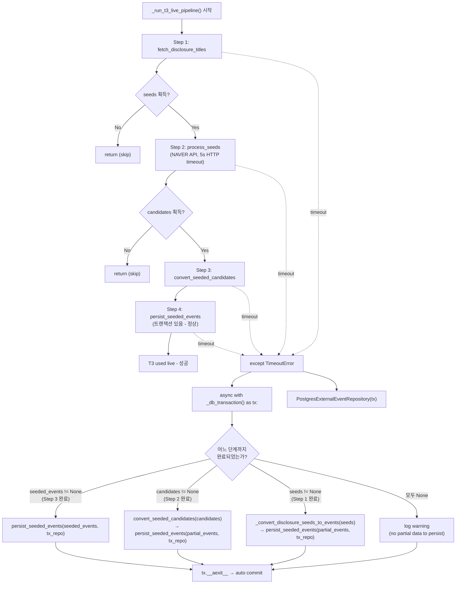

# T3 Pipeline 2가지 버그 수정 설계

- **작성일**: 2026-05-27
- **대상 파일**:
  1. [`scripts/run_decision_loop.py`](/scripts/run_decision_loop.py)
  2. [`src/agent_trading/brokers/naver_news_adapter.py`](/src/agent_trading/brokers/naver_news_adapter.py)
  3. [`tests/scripts/test_run_decision_loop.py`](/tests/scripts/test_run_decision_loop.py)

---

## 버그 1: Partial Persist 트랜잭션 누락 (CRITICAL)

### 증상

```
RuntimeError: Transaction not started. Use 'async with'.
symbol=XXXXX T3 partial persist on timeout: 40 disclosure seeds -> 40 events (step 1 only)
```

### 원인 분석

[`_run_t3_live_pipeline()`](/scripts/run_decision_loop.py:1080)의 `except asyncio.TimeoutError` 핸들러(1177-1215)에서 [`persist_seeded_events()`](/scripts/run_decision_loop.py:953)를 호출할 때 DB 트랜잭션 컨텍스트가 없음.

[`persist_seeded_events()`](/scripts/run_decision_loop.py:953)는 내부적으로 `repo.find_by_dedup_key()` (line 968)와 `repo.add()` (line 970)를 호출. [`PostgresExternalEventRepository`](/src/agent_trading/repositories/postgres/external_events.py:84)는 `self._tx.connection`을 통해 DB 접근하며, [`TransactionManager.connection`](/src/agent_trading/db/transaction.py:52) 프로퍼티는 트랜잭션이 시작되지 않으면 `RuntimeError`를 발생시킴.

`_run_t3_live_pipeline()`의 `repos` 파라미터는 호출자가 생성한 트랜잭션에 바인딩되어 있으나, timeout 발생 시점에는 해당 트랜잭션이 이미 종료(commit/rollback)된 상태임.

**영향**: 모든 partial persist 실패 → `has_fresh_t3_events()` 항상 `False` → fresh skip=0. 단, partial persist 자체는 fresh skip의 직접적 해결책이 아니라 **데이터 보존용 보조책**임. 근본 원인은 버그 2(NAVER API timeout)이며, partial persist는 최소한의 복구 수단.

### 수정안

`except asyncio.TimeoutError` 핸들러 내에서 새로운 트랜잭션을 열고, 새 트랜잭션에 바인딩된 `PostgresExternalEventRepository`를 생성하여 `persist_seeded_events()`에 전달.

```python
except asyncio.TimeoutError:
    from agent_trading.db.transaction import transaction as _db_transaction
    from agent_trading.repositories.postgres.external_events import (
        PostgresExternalEventRepository,
    )

    async with _db_transaction() as tx:
        tx_repo = PostgresExternalEventRepository(tx)

        if seeded_events is not None:
            await persist_seeded_events(seeded_events, tx_repo)
            logger.info(
                "symbol=%s T3 partial persist on timeout: %d events",
                symbol, len(seeded_events),
            )
        elif candidates is not None:
            from agent_trading.services.seeded_news_converter import (
                convert_seeded_candidates,
            )
            partial_events = convert_seeded_candidates(candidates)
            await persist_seeded_events(partial_events, tx_repo)
            logger.info(
                "symbol=%s T3 partial persist on timeout: "
                "%d candidates -> %d events",
                symbol, len(candidates), len(partial_events),
            )
        elif seeds is not None and len(seeds) > 0:
            partial_events = _convert_disclosure_seeds_to_events(seeds)
            await persist_seeded_events(partial_events, tx_repo)
            logger.info(
                "symbol=%s T3 partial persist on timeout: "
                "%d disclosure seeds -> %d events (step 1 only)",
                symbol, len(seeds), len(partial_events),
            )
        else:
            logger.warning(
                "symbol=%s T3 skipped: live pipeline timed out after %ds "
                "(no partial data to persist)",
                symbol, _T3_TIMEOUT,
            )
        # tx는 __aexit__에서 자동 commit (예외 없음)
```

> **⚠️ 중요**: 단순히 `async with _db_transaction() as tx:`로 래핑하고 `repos.external_events`를 그대로 사용하는 방식은 동작하지 않습니다. [`PostgresExternalEventRepository`](/src/agent_trading/repositories/postgres/external_events.py:22)는 생성자에서 주입받은 `self._tx`를 고정 참조하므로, 기존 `repos.external_events`는 이미 종료된 트랜잭션의 `TransactionManager`를 가리키고 있습니다. 새로운 트랜잭션을 열면 **새 `TransactionManager` 인스턴스**가 생성되므로, 반드시 새 `PostgresExternalEventRepository(tx)`를 생성해야 합니다.

#### 변경 전/후 비교

| 항목 | 변경 전 | 변경 후 |
|------|---------|---------|
| 트랜잭션 | 없음 (`RuntimeError`) | `async with _db_transaction() as tx:` |
| Repository | `repos.external_events` (기존 tx 바인딩, 이미 종료됨) | `PostgresExternalEventRepository(tx)` (신규 tx 바인딩) |
| Import | 없음 | `_db_transaction`, `PostgresExternalEventRepository`를 except 블록 내에서 lazy import |

---

## 버그 2: 429 Fast-Fail이 timeout 방지 실패

### 증상

- `"NAVER 429 fast-fail"` 로그: **0건** (fast-fail 코드가 전혀 실행되지 않음)
- 모든 T3 pipeline timeout (58/58회)
- 로그에 `"HTTP/1.1 429 Too Many Requests"` 응답은 다수 기록됨

### 원인 분석

NAVER API가 429 응답을 빠르게 반환하지 않고 **connection hang** 상태에 빠짐. [`_call_api()`](/src/agent_trading/brokers/naver_news_adapter.py:404)에서 `httpx.AsyncClient` 기본 timeout(현재 10초)으로는 hang 상태를 감지하지 못하고, 결국 `asyncio.wait_for()`의 120초 T3 pipeline timeout이 먼저 트리거됨.

`_call_api()`의 `except (httpx.TimeoutException, httpx.ConnectError)` 블록(528-550)은 timeout/connection 실패 시 재시도하지만, 재시도마다 다시 connection hang이 발생하면 최대 4회 시도 모두 소진 후에야 empty response 반환. 이 과정이 120초 pipeline timeout을 초과함.

### 수정안

[`NaverNewsSearchAdapter.__init__()`](/src/agent_trading/brokers/naver_news_adapter.py:294)에서 HTTP client timeout을 10초에서 5초로 단축.

```python
# Before (line 307)
self._http_client = http_client or httpx.AsyncClient(timeout=10.0)

# After
self._http_client = http_client or httpx.AsyncClient(timeout=httpx.Timeout(5.0))
```

#### `httpx.Timeout(5.0)` 세부 설정

```python
httpx.Timeout(
    connect=5.0,   # 연결 timeout
    read=5.0,      # 응답 대기 timeout  
    write=5.0,     # 요청 전송 timeout
    pool=5.0,      # 연결 풀 대기 timeout
)
```

#### 효과 (보수적 분석)

| 항목 | 현재 (10s) | 변경 후 (5s) |
|------|------------|--------------|
| 단일 요청 timeout 감지 | 10초 | 5초 (2배 빠름) |
| 최대 재시도 소요 시간 (4회) | ~80s + backoff | ~35s + backoff |
| 120s pipeline timeout 내 완료 | ❌ (hang 발생 시 초과) | ✅ (5s × 4회 + ~15s backoff ≈ 35s) |

> **참고**: HTTP timeout 단축은 429 Fast-Fail이 동작할 확률을 높이는 **완화 조치**입니다. 근본적으로 NAVER API의 429 지연 응답 문제가 해결되지는 않지만, 5초 timeout으로 connection hang을 조기에 감지하여 pipeline timeout(120s) 내에 재시도를 완료할 수 있게 합니다.
>
> [`_call_api()`](/src/agent_trading/brokers/naver_news_adapter.py:528)의 `httpx.TimeoutException` 처리 로직은 기존과 동일하게 유지되며, 각 시도가 5초 이내에 실패하므로 최대 4회 시도 + exponential backoff(~15s)를 포함해도 ~35초 이내에 완료됩니다.

---

## 테스트 수정 사항

### 1. [`tests/scripts/test_run_decision_loop.py`](/tests/scripts/test_run_decision_loop.py) — helper 분리 + patch 방식

#### 접근법

기존 테스트는 `build_in_memory_repositories()`를 사용하므로 트랜잭션이 불필요. `_run_t3_live_pipeline()`가 `except` 블록에서 `_db_transaction`을 lazy import하므로, 테스트에서는 `agent_trading.db.transaction.transaction`을 mock 처리.

`conftest` 레벨 fixture보다 테스트 클래스 내 helper + `patch` decorator 조합으로 단순화:

```python
from contextlib import asynccontextmanager
from unittest.mock import AsyncMock, patch


@asynccontextmanager
async def _fake_db_transaction(*args, **kwargs):
    """트랜잭션 없이 in-memory repo와 호환되는 fake tx."""
    yield AsyncMock()  # TransactionManager duck type
```

각 테스트 메서드에 `@patch("agent_trading.db.transaction.transaction", side_effect=_fake_db_transaction)` decorator 적용.

#### 기존 테스트 영향

| 테스트 | 영향 | 조치 |
|--------|------|------|
| `test_partial_persist_after_convert_timeout` | `_db_transaction` 호출 추가됨 | `@patch` decorator 추가 |
| `test_partial_persist_with_seeds_only` | `_db_transaction` 호출 추가됨 | `@patch` decorator 추가 |
| 신규 `test_partial_persist_after_persist_timeout` | 신규 테스트 | 동일 `@patch` decorator 적용 |

#### 신규 테스트: `test_partial_persist_after_persist_timeout`

`convert_seeded_candidates`까지 성공하고 `persist_seeded_events` 단계에서 timeout 발생 시나리오 검증:

```python
@pytest.mark.asyncio
@patch(
    "agent_trading.db.transaction.transaction",
    side_effect=_fake_db_transaction,
)
async def test_partial_persist_after_persist_timeout(self, mock_tx) -> None:
    """persist 단계에서 timeout → seeded_events 기반 partial persist 검증.
    
    시나리오:
    - Step 1-3: 모두 성공 → seeded_events 할당됨
    - Step 4 (persist_seeded_events): timeout 발생
    - 기대: except 블록에서 seeded_events 직접 persist (데이터 보존)
    """
    runtime = {
        "disclosure_seed_service": AsyncMock(),
        "seeded_news_service": AsyncMock(),
    }
    repos = build_in_memory_repositories()

    from agent_trading.services.disclosure_seed_service import DisclosureTitleDTO
    seed = DisclosureTitleDTO(
        symbol=SYMBOL, company_name="Samsung",
        headline="Test disclosure",
    )
    runtime["disclosure_seed_service"].fetch_disclosure_titles = AsyncMock(
        return_value=[seed],
    )

    from agent_trading.domain.models import SeededNewsCandidate
    candidate = SeededNewsCandidate(
        symbol=SYMBOL, company_name="Samsung",
        seed_headline="Test disclosure",
        related_news_title="Test news",
        related_news_summary="Test summary",
        link="https://news.example.com",
        confidence_score=0.8,
    )
    runtime["seeded_news_service"].process_seeds = AsyncMock(
        return_value=([candidate], {}),
    )

    import asyncio
    import scripts.run_decision_loop as drl
    original_persist = drl.persist_seeded_events
    call_count = 0

    async def _mock_persist(events, repo):
        nonlocal call_count
        call_count += 1
        if call_count == 1:
            raise asyncio.TimeoutError()
        return await original_persist(events, repo)

    with patch.object(drl, "persist_seeded_events", side_effect=_mock_persist):
        await _run_t3_live_pipeline(runtime, repos, SYMBOL)

    events = await repos.external_events.list_by_symbol(
        symbol=SYMBOL,
        since=datetime.now(timezone.utc) - timedelta(hours=1),
        include_seeded_news=True,
    )
    assert len(events) > 0, (
        "Events should be persisted when persist_seeded_events "
        "times out (partial persist from seeded_events in except block)"
    )
```

### 2. [`src/agent_trading/brokers/naver_news_adapter.py`](/src/agent_trading/brokers/naver_news_adapter.py)

HTTP timeout 10→5초 단축으로 인한 기존 테스트 영향 없음 (timeout 단축 = 더 빠른 실패이므로 기존 동작에 영향을 주지 않음).

---

## 구현 단계

### Step 1: [`scripts/run_decision_loop.py`](/scripts/run_decision_loop.py) — 버그 1 수정

**변경 위치**: `_run_t3_live_pipeline()`의 `except asyncio.TimeoutError` 핸들러 (lines 1177-1215)

**변경 사항**:
1. `except asyncio.TimeoutError:` 블록 시작 부분에 lazy import 추가:
   - `from agent_trading.db.transaction import transaction as _db_transaction`
   - `from agent_trading.repositories.postgres.external_events import PostgresExternalEventRepository`
2. 전체 핸들러를 `async with _db_transaction() as tx:`로 래핑
3. 각 branch에서 `tx_repo = PostgresExternalEventRepository(tx)` 생성 후 `persist_seeded_events(events, tx_repo)` 호출
4. 기존 `repos.external_events` → `tx_repo`로 변경
5. logger.info 호출은 트랜잭션 블록 내부에 유지

### Step 2: [`src/agent_trading/brokers/naver_news_adapter.py`](/src/agent_trading/brokers/naver_news_adapter.py) — 버그 2 수정

**변경 위치**: `NaverNewsSearchAdapter.__init__()` (line 307)

**변경 사항**:
```python
# Line 307
self._http_client = http_client or httpx.AsyncClient(timeout=httpx.Timeout(5.0))
```

### Step 3: [`tests/scripts/test_run_decision_loop.py`](/tests/scripts/test_run_decision_loop.py) — 테스트 수정 및 추가

**변경 사항**:
1. `_fake_db_transaction` helper 함수를 테스트 파일 상단(또는 클래스 직전)에 추가
2. `test_partial_persist_after_convert_timeout`와 `test_partial_persist_with_seeds_only`에 `@patch("agent_trading.db.transaction.transaction", side_effect=_fake_db_transaction)` decorator 추가
3. `test_partial_persist_after_persist_timeout` 신규 테스트 메서드 추가 (seeded_events branch)

---

## Mermaid: T3 Pipeline timeout 처리 흐름



---

## 위험 요소 및 고려 사항

### 1. 트랜잭션 중복 리소스
- `_db_transaction()`은 매번 새로운 DB connection을 pool에서 획득 (`TransactionManager.__aenter__` → `connection()`).
- timeout 핸들러가 동시에 여러 symbol에서 실행될 경우 connection pool 고갈 위험이 있으나, partial persist는 빠르게 완료되므로 영향 미미.

### 2. `persist_seeded_events` 실패 처리
- 현재 `persist_seeded_events()` 내부에서 개별 event persist 실패 시 `logger.exception`만 남기고 계속 진행 (non-fatal, line 974).
- 트랜잭션으로 래핑해도 동일한 동작 유지 — `try/except`가 개별 `repo.add()` 실패를 catch하므로, 성공한 add는 그대로 유지됨.

### 3. 테스트 환경
- In-memory repository는 트랜잭션을 사용하지 않으므로 `_db_transaction` mock이 필요.
- `@patch("agent_trading.db.transaction.transaction", side_effect=_fake_db_transaction)` decorator로 간단히 해결.

### 4. HTTP timeout 5초의 적절성
- NAVER News Search API 정상 응답 시간은 보통 1~3초. 5초는 정상 트래픽에 영향 없는 보수적 값.
- connection hang 발생 시 5초 후 `httpx.TimeoutException` → 재시도 로직 진입.
- 만약 간헐적 timeout이 발생해도 `_call_api()`의 재시도 로직(최대 4회)이 백오프와 함께 동작하므로, ~35초 내에 최종 결과 반환 가능.
