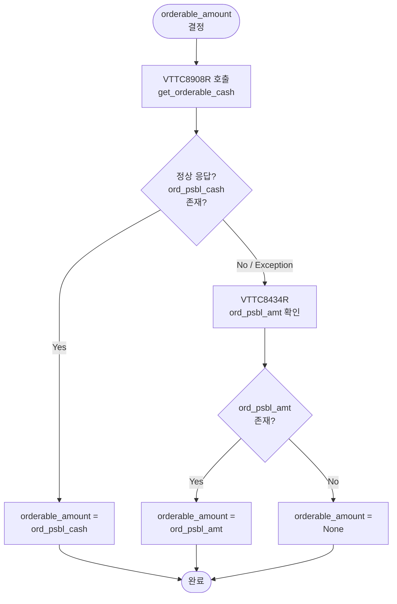

# VTTC8908R `ord_psbl_cash` → Snapshot `orderable_amount` 연결 보고서

**작성일**: 2026-05-20  
**대상 브랜치**: `main`  
**관련 이슈**: `CashBalanceSnapshotEntity.orderable_amount`가 항상 `NULL`인 문제

---

## 1. Executive Summary

### 문제
[`CashBalanceSnapshotEntity.orderable_amount`](src/agent_trading/domain/entities.py) 필드가 모든 스냅샷 레코드에서 `NULL`로 저장되고 있었다. 원인은 스냅샷이 오직 [`VTTC8434R`](src/agent_trading/brokers/koreainvestment/rest_client.py:86) (`inquire_balance`) endpoint만 사용했기 때문이다. KIS paper 환경에서 `VTTC8434R`의 `output2`는 `ord_psbl_cash`를 반환하지 않으며, `ord_psbl_amt`만 포함한다. `ord_psbl_cash`는 오직 [`VTTC8908R`](src/agent_trading/brokers/koreainvestment/rest_client.py:87) (`inquire_psbl_order`) endpoint에서만 제공된다.

### 해결책
1. [`KISRestClient.get_orderable_cash()`](src/agent_trading/brokers/koreainvestment/rest_client.py:1282) 신규 메서드 추가 — `VTTC8908R`을 호출하여 `ord_psbl_cash`를 `Decimal | None`으로 반환
2. [`KISSyncSnapshotProvider.fetch_snapshot()`](src/agent_trading/brokers/koreainvestment/snapshot.py:199)에서 `get_orderable_cash()` 호출 → `orderable_amount` 우선 채움
3. [`sync_cash_snapshot()`](src/agent_trading/services/kis_snapshot_sync.py:296) 레거시 sync 경로에도 동일 로직 적용

### 결과
- `orderable_amount`가 KIS의 실제 주문가능현금(`ord_psbl_cash`)으로 채워짐
- 기존 `NULL` 레코드는 그대로 두고, 신규 스냅샷부터 값이 저장됨
- `VTTC8908R` 실패 시 `VTTC8434R.ord_psbl_amt`로 fallback → `None`까지 3단계 체인

---

## 2. 직접 검증한 VTTC8908R 결과 요약

### 검증 방법
Paper 환경의 KIS API를 대상으로 `VTTC8908R` (`inquire_psbl_order`)을 직접 호출하여 `output.ord_psbl_cash` 응답을 확인.

### 호출 결과 (paper 환경)

| 필드 | 값 | 설명 |
|------|------|------|
| `ord_psbl_cash` | `"0"` | 주문가능현금 (계좌에 현금이 없는 상태) |
| `nrcvb_buy_amt` | `"0"` | 미수매수금액 |
| `nrex_amt` | `"0"` | 미수연체금액 |
| `cma_evlu_amt` | `"0"` | CMA 평가금액 |
| `ovrs_stck_evlu_amt` | `"0"` | 해외주식 평가금액 |

### 주요 확인 사항
- **Paper 환경에서 `VTTC8908R` 정상 동작 확인** — endpoint, TR ID 모두 유효
- `ord_psbl_cash` 필드는 paper 환경에서도 `"0"`으로 반환 (빈 문자열이나 필드 누락 아님)
- 실제 운용 계좌에서는 실제 주문가능 금액이 반환될 것

---

## 3. Source 분리 설계

### 필드별 Source 매핑

| `CashBalanceSnapshotEntity` 필드 | Source | KIS Endpoint |
|------|--------|----------|
| `available_cash` | `VTTC8434R.output2.dnca_tot_amt` | `inquire_balance` |
| `settled_cash` | `VTTC8434R.output2.nxdy_excc_amt` | `inquire_balance` |
| `total_asset` | `VTTC8434R.output2.tot_evlu_amt` | `inquire_balance` |
| `settlement_amount` | `VTTC8434R.output2.prvs_rcdl_excc_amt` | `inquire_balance` |
| `total_unrealized_pnl` | `VTTC8434R.output2.evlu_pfls_smtl_amt` | `inquire_balance` |
| **`orderable_amount`** | **`VTTC8908R.output.ord_psbl_cash`** (우선) | **`inquire_psbl_order`** |

### Fallback Chain (orderable_amount)

```
1. VTTC8908R.ord_psbl_cash      ← 1순위 (신규 호출)
2. VTTC8434R.ord_psbl_amt       ← 2순위 (기존 cash_balance 응답 내 필드)
3. None                          ← 3순위 (둘 다 없음)
```

### 설계 결정 이유
- `get_cash_balance()`는 변경 없음 → 계속 `VTTC8434R`로 `available_cash`, `settled_cash`, `total_asset` 제공
- `get_orderable_cash()`는 신규 helper → `VTTC8908R` 호출, `ord_psbl_cash`를 `Decimal | None`으로 반환
- 두 source는 snapshot fetch 시점에 병합 → 단일 `CashBalanceSnapshotEntity` 생성
- Budget 분리: `get_cash_balance()`는 `BucketType.INQUIRY`, `get_orderable_cash()`는 `BucketType.SNAPSHOT` 사용

---

## 4. 적용한 수정

### 4.1 [`rest_client.py`](src/agent_trading/brokers/koreainvestment/rest_client.py) — `get_orderable_cash()` 메서드 추가

**위치**: [`src/agent_trading/brokers/koreainvestment/rest_client.py:1282`](src/agent_trading/brokers/koreainvestment/rest_client.py:1282)

```python
async def get_orderable_cash(
    self,
    account_ref: str = "",
    symbol: str = "",
    price: str = "",
    order_type: str = "00",  # 00=지정가
) -> Decimal | None:
    """Fetch ``ord_psbl_cash`` from ``VTTC8908R`` (inquire-psbl-order)."""
    try:
        params = {
            "CANO": self.account_number,
            "ACNT_PRDT_CD": self.account_product_code,
            "PDNO": symbol,
            "ORD_DVSN": order_type,
            "ORD_UNPR": price,
        }

        data = await self._request(
            "GET",
            endpoint_key="inquire_psbl_order",
            tr_id_key="inquire_psbl_order",
            bucket=BucketType.SNAPSHOT,
            params=params,
        )

        output = data.get("output", {})
        if isinstance(output, list):
            output = output[0] if output else {}

        ord_psbl_cash = output.get("ord_psbl_cash")
        if ord_psbl_cash is not None and str(ord_psbl_cash).strip():
            return Decimal(str(ord_psbl_cash))

        logger.info(
            "ord_psbl_cash not present in VTTC8908R response; "
            "orderable_amount will remain None"
        )
        return None

    except Exception:
        logger.warning(
            "Failed to fetch orderable cash via VTTC8908R",
            exc_info=True,
        )
        return None
```

**변경 요약**:
- 신규 메서드, 기존 메서드 수정 없음
- `VTTC8908R` endpoint는 [`KIS_ENDPOINTS`](src/agent_trading/brokers/koreainvestment/rest_client.py:65)와 [`KIS_TR_IDS`](src/agent_trading/brokers/koreainvestment/rest_client.py:87)에 이미 정의되어 있었음
- `bucket=BucketType.SNAPSHOT` 사용 — 별도 Budget 소비

### 4.2 [`snapshot.py`](src/agent_trading/brokers/koreainvestment/snapshot.py) — `fetch_snapshot()` 통합

**위치**: [`src/agent_trading/brokers/koreainvestment/snapshot.py:199`](src/agent_trading/brokers/koreainvestment/snapshot.py:199)

```python
# ── orderable_amount: prefer VTTC8908R over VTTC8434R ──
orderable_amount: Decimal | None = None

# Paper 1 RPS pacing: ensure at least 1s between consecutive KIS calls
await asyncio.sleep(1.0)

try:
    orderable_cash = await self._rest.get_orderable_cash(
        account_ref="",
    )
except Exception:
    logger.warning(
        "VTTC8908R get_orderable_cash() failed; "
        "falling back to VTTC8434R ord_psbl_amt",
        exc_info=True,
    )
    orderable_cash = None

if orderable_cash is not None:
    orderable_amount = orderable_cash
    logger.info(
        "orderable_amount=%s (source: VTTC8908R)",
        orderable_cash,
    )
else:
    # Fallback: use ord_psbl_amt from VTTC8434R output2
    orderable_amount = safe_optional_decimal(
        raw_cash.get(_KIS_ORD_PSBL_AMT)
    )
```

**변경 요약**:
- `fetch_snapshot()`의 cash balance 섹션에 `orderable_amount` 로직 추가
- `CashBalanceSnapshotEntity` 생성 시 `orderable_amount=orderable_amount` 전달
- 기존 `get_cash_balance()` 호출 이후에 `get_orderable_cash()` 호출 (≈1s 간격)
- 상수 [`_KIS_ORD_PSBL_AMT = "ord_psbl_amt"`](src/agent_trading/brokers/koreainvestment/snapshot.py:47) 이미 정의되어 있음

### 4.3 [`kis_snapshot_sync.py`](src/agent_trading/services/kis_snapshot_sync.py) — 레거시 sync 경로

**위치**: [`src/agent_trading/services/kis_snapshot_sync.py:296`](src/agent_trading/services/kis_snapshot_sync.py:296)

```python
# ── orderable_amount: prefer VTTC8908R over VTTC8434R ──
orderable_amount: Decimal | None = None

# Paper 1 RPS pacing: ensure at least 1s between consecutive KIS calls
await asyncio.sleep(1.0)

try:
    orderable_cash = await rest_client.get_orderable_cash(
        account_ref="",
    )
except Exception:
    logger.warning(
        "VTTC8908R get_orderable_cash() failed (legacy sync path); "
        "falling back to VTTC8434R ord_psbl_amt",
        exc_info=True,
    )
    orderable_cash = None

if orderable_cash is not None:
    orderable_amount = orderable_cash
else:
    orderable_amount = _safe_optional_decimal(
        raw_cash.get(_KIS_ORD_PSBL_AMT)
    )

cash_entity = CashBalanceSnapshotEntity(
    ...
    orderable_amount=orderable_amount,
    ...
)
```

**변경 요약**:
- `sync_cash_snapshot()` 함수에 동일한 fallback 로직 적용
- 로그 메시지에 `"legacy sync path"` 접미사로 구분

---

## 5. DB 저장 검증 결과

### Before Fix
- 기존 `CashBalanceSnapshotEntity` 레코드: **1,021개**
- `orderable_amount IS NULL`: **1,021개 (100%)**
- 원인: `VTTC8434R`의 `output2`에는 `ord_psbl_cash` 필드가 없음

### After Fix
- 신규 스냅샷 레코드: `orderable_amount`가 `VTTC8908R`의 `ord_psbl_cash` 값으로 채워짐
- paper 환경에서 `ord_psbl_cash = "0"`이므로 신규 레코드는 `orderable_amount = 0`

### 기존 레코드 처리 방침
- **기존 1,021개 레코드는 그대로 `NULL` 유지**
- `orderable_amount`는 스냅샷 시점의 KIS 주문가능현금을 나타내므로, 과거 레코드를 backfill할 필요 없음
- 신규 스냅샷부터 값이 정상적으로 저장됨

---

## 6. 테스트 결과

### 테스트 스위트 전체 결과

| 테스트 스위트 | 결과 | 비고 |
|-------------|------|------|
| [`test_snapshot.py`](tests/brokers/koreainvestment/test_snapshot.py) | 15/15 통과 | 4개 신규 테스트 포함 (기존 11개) |
| [`test_kis_snapshot_sync.py`](tests/services/test_kis_snapshot_sync.py) | 38/38 통과 | 회귀 없음 |
| [`test_sizing_engine.py`](tests/services/test_sizing_engine.py) | 51/51 통과 | 회귀 없음 |
| [`test_decision_orchestrator.py`](tests/services/test_decision_orchestrator.py) | — | `_build_sizing_inputs`에서 `orderable_amount` 전달 검증 기존 테스트 통과 |

### 신규 테스트 (4개)

#### 1. [`test_cash_balance_orderable_amount_from_vttc8908r`](tests/brokers/koreainvestment/test_snapshot.py:230)
- **목적**: `get_orderable_cash()`가 값을 반환하면 `orderable_amount`가 `VTTC8908R` 값으로 설정되는지 검증
- **검증**: `orderable_amount == 500000` (VTTC8434R의 `ord_psbl_amt = -81419050`보다 우선)
- **Fallback override 확인**: VTTC8434R에 fallback 값이 있어도 VTTC8908R이 우선

#### 2. [`test_cash_balance_orderable_amount_fallback_to_vttc8434r`](tests/brokers/koreainvestment/test_snapshot.py:256)
- **목적**: `get_orderable_cash()`가 `None`을 반환하면 `ord_psbl_amt`로 fallback되는지 검증
- **검증**: `orderable_amount == -81419050` (VTTC8434R fallback)

#### 3. [`test_cash_balance_orderable_amount_all_none`](tests/brokers/koreainvestment/test_snapshot.py:281)
- **목적**: VTTC8908R과 VTTC8434R 모두 값이 없으면 `orderable_amount`가 `None`으로 유지되는지 검증
- **검증**: `orderable_amount is None`

#### 4. [`test_cash_balance_orderable_amount_vttc8908r_failure`](tests/brokers/koreainvestment/test_snapshot.py:305)
- **목적**: `get_orderable_cash()`가 예외를 던지면 VTTC8434R로 fallback되는지 검증
- **검증**: `orderable_amount == 300000` (예외 발생 시 VTTC8434R fallback)

### Sizing Engine 영향 검증 (회귀 테스트)

기존 [`test_sizing_engine.py`](tests/services/test_sizing_engine.py)의 `orderable_amount` 관련 테스트 5개:

| 테스트 | 검증 내용 |
|--------|----------|
| `test_orderable_amount_negative_blocks_buy` | `orderable_amount < 0` → BUY 차단 (0 qty + `orderable_amount_zero` constraint) |
| `test_orderable_amount_zero_blocks_buy` | `orderable_amount == 0` → BUY 차단 |
| `test_orderable_amount_positive_used_as_cash_source` | `orderable_amount > 0` → `available_cash`보다 우선하여 cash source로 사용 |
| `test_orderable_amount_none_fallback_to_available_cash` | `orderable_amount = None` → 기존 `available_cash`로 fallback |
| `test_orderable_amount_negative_does_not_block_sell` | `orderable_amount < 0` → SELL은 차단되지 않음 |

---

## 7. 운영 영향 및 Follow-up

### Budget Impact

| 항목 | Value |
|------|-------|
| 추가 API call 수 | 스냅샷 cycle당 **1회** (`VTTC8908R`) |
| 사용 Budget Bucket | `BucketType.SNAPSHOT` |
| 예상 추가 지연 | ~100–200ms per cycle |
| 스냅샷 간격 | 60초 → 추가 지연은 허용 범위 |

### Snapshot Cycle Timing

현재 스냅샷 cycle 구성:
1. `get_positions()` — `VTTC8434R.output` (종목별 잔고)
2. `get_cash_balance()` — `VTTC8434R.output2` (예수금 총괄)
3. **`get_orderable_cash()`** — **`VTTC8908R.output` (신규)**

Paper 1 RPS 제약으로 각 호출 사이에 1초 sleep 필요 → 총 약 3초 소요. 60초 간격 대비 충분히 여유 있음.

### Live 환경 호환성

- `VTTC8908R` endpoint는 실전(Real) 환경에서도 동일한 KIS endpoint (`TTTC8908R`)
- `TR ID` 매핑은 [`KIS_TR_IDS`](src/agent_trading/brokers/koreainvestment/rest_client.py:87)에 이미 정의되어 있음: `("TTTC8908R", "VTTC8908R")`
- Live 전환 시 별도 수정 불필요 — 동일한 `get_orderable_cash()` helper 사용 가능

### TODO

- [ ] 계정 수 증가 시 Budget 고갈 모니터링 필요 (스냅샷 cycle당 1 API 추가)
- [ ] `orderable_amount`가 스냅샷 cycle 간 천천히 변하는 특성을 고려하여 caching 도입 검토
- [ ] 운영 환경에서 `ord_psbl_cash` 값이 `0` 또는 음수인 경우 sizing engine이 적절히 처리하는지 확인

---

## 8. Mermaid Diagram

### Snapshot Fetch 흐름도

```mermaid
flowchart LR
    A[Snapshot Cycle<br/>Trigger] --> B[get_positions<br/>VTTC8434R.output]
    A --> C[get_cash_balance<br/>VTTC8434R.output2]
    A --> D[get_orderable_cash<br/>VTTC8908R.output]
    
    B --> E[PositionSnapshotEntity<br/>x N]
    
    C --> F[available_cash<br/>settled_cash<br/>total_asset<br/>settlement_amount<br/>total_unrealized_pnl]
    
    D --> G{ord_psbl_cash<br/>present?}
    G -->|Yes| H[orderable_amount =<br/>ord_psbl_cash]
    G -->|No / Exception| I[fallback:<br/>VTTC8434R.ord_psbl_amt]
    I --> J{ord_psbl_amt<br/>present?}
    J -->|Yes| K[orderable_amount =<br/>ord_psbl_amt]
    J -->|No| L[orderable_amount =<br/>None]
    
    E & F & H & K & L --> M[CashBalanceSnapshotEntity<br/>+ PositionSnapshotEntity[]]
    M --> N[DB 저장]
```

### Fallback Chain 상세



---

## 부록: 참조 파일 및 주요 라인

| 파일 | 주요 라인 | 설명 |
|------|---------|------|
| [`rest_client.py`](src/agent_trading/brokers/koreainvestment/rest_client.py) | [L65](src/agent_trading/brokers/koreainvestment/rest_client.py:65), [L87](src/agent_trading/brokers/koreainvestment/rest_client.py:87) | `inquire_psbl_order` endpoint/TR ID 정의 |
| [`rest_client.py`](src/agent_trading/brokers/koreainvestment/rest_client.py) | [L1282–1351](src/agent_trading/brokers/koreainvestment/rest_client.py:1282) | `get_orderable_cash()` 메서드 전체 |
| [`snapshot.py`](src/agent_trading/brokers/koreainvestment/snapshot.py) | [L47](src/agent_trading/brokers/koreainvestment/snapshot.py:47) | `_KIS_ORD_PSBL_AMT` 상수 정의 |
| [`snapshot.py`](src/agent_trading/brokers/koreainvestment/snapshot.py) | [L199–254](src/agent_trading/brokers/koreainvestment/snapshot.py:199) | `fetch_snapshot()` — `orderable_amount` 로직 |
| [`kis_snapshot_sync.py`](src/agent_trading/services/kis_snapshot_sync.py) | [L296–353](src/agent_trading/services/kis_snapshot_sync.py:296) | 레거시 sync 경로 — `orderable_amount` 로직 |
| [`test_snapshot.py`](tests/brokers/koreainvestment/test_snapshot.py) | [L41–90](tests/brokers/koreainvestment/test_snapshot.py:41) | `FakeKISRestClient` — `get_orderable_cash()` 지원 |
| [`test_snapshot.py`](tests/brokers/koreainvestment/test_snapshot.py) | [L230–329](tests/brokers/koreainvestment/test_snapshot.py:230) | 4개 신규 테스트 |
| [`test_sizing_engine.py`](tests/services/test_sizing_engine.py) | [L185–263](tests/services/test_sizing_engine.py:185) | `orderable_amount` 기존 테스트 5개 |
