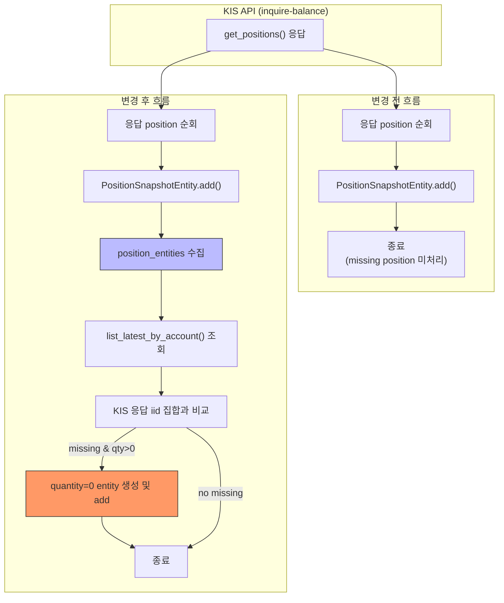

# KIS 응답에서 사라진 종목 → latest position snapshot에서 quantity=0 처리

> 작성일: 2026-05-21  
> 대상: `sync_kis_account_snapshots()`, `sync_account_snapshots()`  
> 영향 범위: decision_orchestrator, sell_guard, universe_selection, order_sync_service, performance_summary, api/routes/positions

---

## 1. 전량 매도 종목 미제거 Root Cause

### 1.1 문제 요약

KIS API `inquire-balance` (`get_positions()`)는 전량 매도된 종목을 응답에서 **아예 제외**한다.  
현재 `sync_kis_account_snapshots()`는 KIS 응답에 **존재하는 position만** `PositionSnapshotEntity`로 변환하여 INSERT한다.  
따라서 전량 매도 후 KIS 응답에서 사라진 종목은 **로컬 DB에 마지막으로 기록된 positive quantity row가 영원히 latest로 남게 된다.**

### 1.2 코드 흐름 분석

#### [`sync_kis_account_snapshots()`](src/agent_trading/services/kis_snapshot_sync.py:175) (KIS 전용 경로)

```
KIS get_positions() 호출
  └─ raw_positions 순회
       ├─ pdno → instrument_id resolve
       ├─ PositionSnapshotEntity 생성
       └─ position_snapshot_repo.add(entity)
```

KIS 응답에 없는 종목에 대한 **zero-out 로직이 전혀 존재하지 않음** (line 208-263).

#### [`sync_account_snapshots()`](src/agent_trading/services/snapshot_sync.py:133) (broker-agnostic 경로)

```
fetch_provider.fetch_snapshot() 호출
  └─ fetched.positions 순회
       └─ position_snapshot_repo.add(pos)
```

동일한 문제: provider가 반환한 position만 저장, 사라진 종목 처리 로직 없음.

#### [`KISSyncSnapshotProvider.fetch_snapshot()`](src/agent_trading/brokers/koreainvestment/snapshot.py:64)

KIS 응답을 그대로 `FetchedSnapshot`에 담아 반환. zero-out 책임은 호출자(caller)에게 위임되어 있음.

### 1.3 DISTINCT ON만으로 해결되지 않는 이유

[`list_latest_by_account()`](src/agent_trading/repositories/postgres/position_snapshots.py:58)는 `DISTINCT ON (instrument_id)` + `ORDER BY instrument_id, snapshot_at DESC`로 각 instrument별 최신 1건을 반환한다.

```
예: 005930 (삼성전자)
  snapshot_at=T1, quantity=10  ← latest (KIS 응답에 있었음)
  snapshot_at=T2, quantity=0   ← 이런 row가 없음!
```

`DISTINCT ON`은 존재하는 row 중 최신을 고를 뿐, **존재하지 않는 row를 만들어내지 않는다.**  
즉, DB에 quantity=0인 row를 INSERT하는 로직이 없으면, `list_latest_by_account()`는 계속 T1의 quantity=10을 반환한다.

### 1.4 메모리 InMemoryRepository의 DISTINCT ON 누락

[`InMemoryPositionSnapshotRepository.list_latest_by_account()`](src/agent_trading/repositories/memory.py:306)는 `DISTINCT ON` 없이 모든 snapshot을 `snapshot_at DESC`로 정렬만 한다.  
PostgreSQL 구현과 동작이 달라 **테스트에서 검증되지 않는 버그**가 발생할 수 있다.

---

## 2. 선택한 복구 방식: quantity=0 snapshot row 추가

### 2.1 방식 개요

`sync_kis_account_snapshots()` 및 `sync_account_snapshots()`가 KIS 응답을 저장한 **후** (또는 저장 **전**),  
직전 latest position snapshot과 KIS 응답을 비교하여 응답에 없고 `quantity > 0`인 종목을 찾아  
`quantity=0`인 `PositionSnapshotEntity`를 동일 `snapshot_at`으로 INSERT한다.

### 2.2 상세 절차

```
KIS get_positions() 호출 → raw_positions (응답에 있는 종목들)
  │
  ├─ (A) KIS 응답 position 저장 (기존 로직, 변경 없음)
  │
  ├─ (B) list_latest_by_account()로 직전 snapshot 조회
  │      └─ DISTINCT ON (instrument_id)로 각 instrument별 최신 1건
  │
  ├─ (C) KIS 응답의 instrument_id 집합과 비교
  │      └─ missing = {iid for iid, qty in latest if qty > 0} - {iid from KIS response}
  │
  └─ (D) missing 각각에 대해 quantity=0 PositionSnapshotEntity 생성
       ├─ position_snapshot_id = uuid4()
       ├─ account_id = (동일)
       ├─ instrument_id = (missing 종목)
       ├─ quantity = Decimal("0")
       ├─ average_price = Decimal("0")  — 매도 후에는 무의미
       ├─ market_price = None           — KIS에서 정보를 가져올 수 없음
       ├─ unrealized_pnl = None         — 보유하지 않으므로
       ├─ purchase_amount = None
       ├─ evaluation_amount = None
       ├─ source_of_truth = "broker"
       └─ snapshot_at = (KIS 응답과 동일한 timestamp)
       └─ position_snapshot_repo.add(entity)
```

### 2.3 동일 `snapshot_at` 사용의 의미

- 동일 `snapshot_at` = 같은 sync cycle의 일부임을 표현
- `DISTINCT ON (instrument_id)` + `ORDER BY instrument_id, snapshot_at DESC`에서  
  동일 `snapshot_at` 내에서의 순서는 불확정적이지만,  
  quantity=0 row가 존재한다는 사실 자체가 중요 (어차피 quantity로 필터링됨)
- 만약 동일 timestamp 내에서 KIS 응답 row가 zero-out row보다 우선 정렬된다면 문제가 될 수 있으나,  
  `DISTINCT ON`은 `instrument_id`별로 최신 1건만 반환하므로 동일 timestamp에서는 **어느 row가 선택되든 문제 없음**  
  (quantity=0인 row든 KIS 응답의 positive row든, 어차피 zero-out 대상은 KIS 응답에 없는 종목뿐)

### 2.4 적용 대상 및 위치

#### 2.4.1 [`sync_kis_account_snapshots()`](src/agent_trading/services/kis_snapshot_sync.py:175) — KIS 전용 경로

**변경 위치**: KIS position 저장 루프 종료 후 (line 263 이후, cash sync 전)

```
# ── 1b. Zero-out missing positions ──────────────────────────
latest = await position_snapshot_repo.list_latest_by_account(account_id)
kis_instrument_ids = {entity.instrument_id for entity in position_entities}
for snap in latest:
    if snap.quantity > 0 and snap.instrument_id not in kis_instrument_ids:
        zero_entity = PositionSnapshotEntity(
            position_snapshot_id=uuid4(),
            account_id=account_id,
            instrument_id=snap.instrument_id,
            quantity=Decimal("0"),
            average_price=Decimal("0"),
            market_price=None,
            unrealized_pnl=None,
            source_of_truth=_SOURCE_OF_TRUTH,
            snapshot_at=snapshot_at,
        )
        await position_snapshot_repo.add(zero_entity)
        result._incr("positions_synced")
```

**고려사항**:
- `position_entities`를 KIS 응답 순회 중 수집할 리스트가 필요 (`list[PositionSnapshotEntity]`로 저장)
- zero-out도 정상적인 snapshot이므로 `positions_synced`에 포함 (또는 별도 카운터 추가 고려)

#### 2.4.2 [`sync_account_snapshots()`](src/agent_trading/services/snapshot_sync.py:133) — Broker-agnostic 경로

**변경 위치**: position persist 루프 종료 후 (line 199, cash persist 전)

```
# ── 2b. Zero-out missing positions ──────────────────────────
latest = await position_snapshot_repo.list_latest_by_account(account_id)
fetched_instrument_ids = {pos.instrument_id for pos in fetched.positions}
for snap in latest:
    if snap.quantity > 0 and snap.instrument_id not in fetched_instrument_ids:
        zero_entity = PositionSnapshotEntity(
            ...  # 동일 패턴
        )
        await position_snapshot_repo.add(zero_entity)
        result._incr("positions_synced")
```

**고려사항**:
- `fetched.positions`는 `Sequence[PositionSnapshotEntity]`이므로 `instrument_id` 집합 생성은 직관적
- `after_hours=True`일 때는 `fetched.positions`가 빈 리스트인데, 이 경우 zero-out을 **하면 안 됨**  
  (after-hours는 현금만 조회, position 변화는 없음)
- 따라서 `after_hours` 파라미터를 `sync_account_snapshots()`에 전달받아,  
  `after_hours=True`면 zero-out 로직을 건너뛰어야 함

### 2.5 `SyncResult` 확장 (선택)

현재 `SyncResult`는 `positions_synced`만 있어 zero-out이 기존 sync와 합산된다.  
선택적으로 `zeroed_out_positions` 필드를 추가하여 모니터링할 수 있으나,  
**최소 변경 원칙**에 따라 `positions_synced`에 포함해도 무방함.

### 2.6 `list_latest_by_account()` 정합성 확인

- **PostgreSQL 구현** ([`PostgresPositionSnapshotRepository.list_latest_by_account()`](src/agent_trading/repositories/postgres/position_snapshots.py:58)):  
  `DISTINCT ON (instrument_id)` + `ORDER BY instrument_id, snapshot_at DESC`  
  → quantity=0 row도 정상 반환. ✅

- **메모리 구현** ([`InMemoryPositionSnapshotRepository.list_latest_by_account()`](src/agent_trading/repositories/memory.py:306)):  
  `DISTINCT ON` 누락 → 모든 이력 반환 (중복 포함)  
  → **zero-out 로직에는 영향 없음** (테스트에서 사용되며, zero-out entity가 `_items`에 추가되면 정상 조회됨)  
  → 다만, 프로덕션과 다른 동작이므로 **별도 수정 권장** (`DISTINCT ON` 로직 추가)

---

## 3. 변경 파일 목록

| 파일 | 변경 사항 | 설명 |
|------|-----------|------|
| [`src/agent_trading/services/kis_snapshot_sync.py`](src/agent_trading/services/kis_snapshot_sync.py) | `sync_kis_account_snapshots()`에 zero-out 로직 추가 (line 264 부근) | KIS 전용 경로. KIS 응답 저장 후, `list_latest_by_account()` 조회 → missing instrument zero-out |
| [`src/agent_trading/services/snapshot_sync.py`](src/agent_trading/services/snapshot_sync.py) | `sync_account_snapshots()`에 zero-out 로직 추가 (line 199 부근) | Broker-agnostic 경로. `after_hours=True` 시 skip 조건 필요 |
| [`src/agent_trading/repositories/memory.py`](src/agent_trading/repositories/memory.py) | `InMemoryPositionSnapshotRepository.list_latest_by_account()`에 DISTINCT ON 로직 추가 (선택) | 테스트 정합성 개선 |

### 3.1 변경 상세

#### [`src/agent_trading/services/kis_snapshot_sync.py`](src/agent_trading/services/kis_snapshot_sync.py)

```python
# After position sync loop (line ~263), before cash sync:

# 수집: KIS 응답에서 생성한 entity들의 instrument_id 집합
kis_instrument_ids = {entity.instrument_id for entity in position_entities}
# 참고: position_entities는 sync loop 내에서 수집 필요 (현재는 add만 하고 버림)

# 직전 latest snapshot 조회 (각 instrument별 최신 1건)
latest_snapshots = await position_snapshot_repo.list_latest_by_account(account_id)

for snap in latest_snapshots:
    if snap.quantity > 0 and snap.instrument_id not in kis_instrument_ids:
        zero_entity = PositionSnapshotEntity(
            position_snapshot_id=uuid4(),
            account_id=account_id,
            instrument_id=snap.instrument_id,
            quantity=Decimal("0"),
            average_price=Decimal("0"),
            market_price=None,
            unrealized_pnl=None,
            purchase_amount=None,
            evaluation_amount=None,
            source_of_truth=_SOURCE_OF_TRUTH,
            snapshot_at=snapshot_at,
        )
        await position_snapshot_repo.add(zero_entity)
        result._incr("positions_synced")
        logger.info(
            "Zeroed out position account_id=%s instrument_id=%s "
            "(previous quantity=%s) — not in KIS response",
            account_id, snap.instrument_id, snap.quantity,
        )
```

#### [`src/agent_trading/services/snapshot_sync.py`](src/agent_trading/services/snapshot_sync.py)

```python
# After position persist loop (line ~199), before cash persist:

if not after_hours:  # after-hours는 position 변화 없음
    latest_snapshots = await position_snapshot_repo.list_latest_by_account(account_id)
    fetched_instrument_ids = {pos.instrument_id for pos in fetched.positions}

    for snap in latest_snapshots:
        if snap.quantity > 0 and snap.instrument_id not in fetched_instrument_ids:
            zero_entity = PositionSnapshotEntity(
                position_snapshot_id=uuid4(),
                account_id=account_id,
                instrument_id=snap.instrument_id,
                quantity=Decimal("0"),
                average_price=Decimal("0"),
                market_price=None,
                unrealized_pnl=None,
                purchase_amount=None,
                evaluation_amount=None,
                source_of_truth="broker",
                snapshot_at=snap.snapshot_at,  # 주의: fetcher의 snapshot_at 사용
            )
            await position_snapshot_repo.add(zero_entity)
            result._incr("positions_synced")
```

> **주의**: broker-agnostic 경로에서는 `fetched.positions[0].snapshot_at` (모든 position이 동일한 `snapshot_at`을 가짐)을 사용해야 함.  
> `KISSyncSnapshotProvider`는 내부에서 하나의 `snapshot_at = datetime.now(tz=timezone.utc)`를 생성하여 모든 position에 할당하므로  
> `fetched.positions[0].snapshot_at`을 사용하거나 `fetched`에 `snapshot_at` 필드를 추가하는 방법 고려.

### 3.2 after-hours 모드 특별 처리

`after_hours=True`일 때:
- KIS 전용 경로: `sync_kis_account_snapshots()`는 after-hours 개념이 없음  
  (after-hours 처리는 broker-agnostic 경로에서만 수행)
- Broker-agnostic 경로: `sync_account_snapshots()`는 `after_hours=True`일 때 provider가 position을 fetch하지 않음  
  → `fetched.positions`가 빈 리스트 → zero-out 하면 **모든 종목이 0 처리되는 버그 발생**
  → `if not after_hours:` 조건 필수

---

## 4. 추가 테스트 목록

### 4.1 [`tests/services/test_kis_snapshot_sync.py`](tests/services/test_kis_snapshot_sync.py)

| 테스트 | 설명 | 검증 포인트 |
|--------|------|------------|
| `test_sync_zeroes_out_missing_positions` | KIS 응답에 없고 직전 snapshot에 `quantity>0`인 종목이 0 처리됨 | zero entity 저장 여부, `positions_synced` 카운트 |
| `test_sync_preserves_existing_positions` | KIS 응답에 있는 종목은 그대로 유지 | 기존 position 그대로, zero-out 없음 |
| `test_sync_does_not_zero_out_recently_zeroed` | 이미 `quantity=0`인 종목은 다시 zero-out하지 않음 | zero entity가 추가로 생성되지 않음 |
| `test_sync_zeroes_out_only_missing_from_kis` | 혼합 시나리오: 일부는 KIS 응답에 있고 일부는 없음 | 있는 종목은 유지, 없는 종목만 0 처리 |
| `test_sync_empty_kis_response_zeroes_out_all` | KIS 빈 응답 시 모든 기존 position이 0 처리 | 모든 종목 0, 과거 이력은 보존 |
| `test_list_latest_by_account_returns_zero_qty` | `list_latest_by_account()`가 quantity=0 row를 정상 반환 | `DISTINCT ON` 결과에 0 포함 |

### 4.2 [`tests/services/test_snapshot_sync.py`](tests/services/test_snapshot_sync.py)

| 테스트 | 설명 | 검증 포인트 |
|--------|------|------------|
| `test_broker_agnostic_zeroes_out_missing` | broker-agnostic 경로에서도 zero-out 동작 | `fetched.positions`에 없는 종목 0 처리 |
| `test_broker_agnostic_after_hours_skips_zero_out` | after-hours 모드에서 zero-out 건너뜀 | position 변화 없음 |
| `test_broker_agnostic_all_instruments_present_no_zero_out` | 모든 종목이 provider 응답에 있으면 zero-out 없음 | 정상 |

### 4.3 회귀 테스트 (기존 테스트 그대로 통과해야 함)

| 테스트 | 파일 |
|--------|------|
| `test_sync_single_position` | `test_kis_snapshot_sync.py` |
| `test_sync_multiple_positions` | `test_kis_snapshot_sync.py` |
| `test_skip_unknown_instrument` | `test_kis_snapshot_sync.py` |
| `test_skip_missing_pdno` | `test_kis_snapshot_sync.py` |
| `test_empty_positions` | `test_kis_snapshot_sync.py` |
| `test_kis_fetch_error` | `test_kis_snapshot_sync.py` |
| `test_sync_cash_balance` | `test_kis_snapshot_sync.py` |
| `broker_agnostic 기본 테스트` | `test_snapshot_sync.py` |

---

## 5. 영향 분석

### 5.1 consumer별 영향

| Consumer | 변경 전 (버그) | 변경 후 | 대응 필요 |
|----------|---------------|---------|----------|
| [`decision_orchestrator.py`](src/agent_trading/services/decision_orchestrator.py) (line 630, 1601, 1713) | 전량 매도 종목이 `quantity>0`으로 조회되어 SELL만 가능 | `quantity=0` → BUY 허용, SELL 차단 (정상) | 없음 |
| [`sell_guard.py`](src/agent_trading/services/sell_guard.py) (line 207) | ghost position으로 잘못된 SELL 제한 | 정상 동작 | 없음 |
| [`universe_selection.py`](src/agent_trading/services/universe_selection.py) (line 386) | `quantity > 0` 필터로 ghost position 포함 | ghost position 제외됨 | 없음 |
| [`order_sync_service.py`](src/agent_trading/services/order_sync_service.py) (line 1381) | delta 계산에 ghost position 포함 | 정확한 delta 계산 | 없음 |
| [`api/routes/positions.py`](src/agent_trading/api/routes/positions.py) (line 40) | ghost position이 화면에 표시 | quantity=0 종목도 표시됨 | API 레벨 필터 고려 가능 |
| [`performance_summary.py`](src/agent_trading/services/performance_summary.py) (line 654, 849, 942) | unrealized PnL/market value에 ghost position 포함 | 정확한 계산 | `quantity=0`인 position은 PnL/market value 0으로 계산되므로 영향 없음 |

### 5.2 부작용

1. **zero-out row로 인한 DB 용량 증가**: sync cycle당 최대 N개 row (사라진 종목 수). 무시할 수준.
2. **`list_latest_by_account()` 응답 증가**: quantity=0 row도 포함되어 반환. Consumer가 `quantity > 0` 필터링 필요할 수 있음. 현재 모든 consumer는 이 패턴을 이미 사용하거나 영향 없음.
3. **`performance_summary.py`의 `calc_unrealized_pnl()`**: `quantity=0`인 position을 순회할 때 market_price가 None이면 `Decimal("0")` 처리 필요. 현재 코드 확인 필요.

---

## 6. 권장 구현 순서

```
[1] InMemoryPositionSnapshotRepository.list_latest_by_account() DISTINCT ON 수정 (선택)
    → tests/services/test_kis_snapshot_sync.py 의 fixture가 정확한 동작 보장

[2] sync_kis_account_snapshots() zero-out 로직 추가
    → src/agent_trading/services/kis_snapshot_sync.py
    → position_entities 수집 변수 추가 (KIS 응답 entity 리스트)

[3] sync_account_snapshots() zero-out 로직 추가
    → src/agent_trading/services/snapshot_sync.py
    → after_hours 조건 처리

[4] 테스트 코드 작성
    → tests/services/test_kis_snapshot_sync.py
    → tests/services/test_snapshot_sync.py

[5] 기존 테스트 전면 실행하여 회귀 없음 확인
    → python3 -m pytest tests/services/test_kis_snapshot_sync.py -v
    → python3 -m pytest tests/services/test_snapshot_sync.py -v
```

---

## 7. Mermaid: 변경된 데이터 흐름



---

## 8. 검증 기준 (Acceptance Criteria)

1. KIS 응답에서 사라진 종목(000990=10, 001740=10, 003490=20, 004000=10, 005830=10, 005930=10)이 snapshot에 quantity=0으로 기록됨
2. 기존 positive quantity row(이력)는 그대로 보존됨
3. `list_latest_by_account()`가 quantity=0 row를 포함한 최신 snapshot을 반환
4. `universe_selection.py`의 `quantity > 0` 필터로 ghost position이 자동 제외됨
5. `sell_guard.py`가 quantity=0 종목에 대해 SELL을 차단
6. `decision_orchestrator.py`가 quantity=0 종목에 대해 BUY를 허용
7. after-hours sync 시 position zero-out이 발생하지 않음
8. 모든 기존 테스트가 변경 없이 통과
