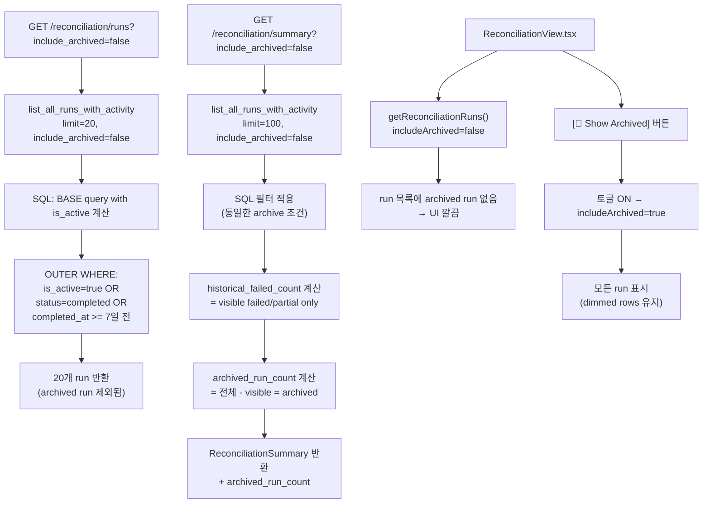

# 오래된 Historical Failed Reconciliation Run Archive/Hide 정책

> **목적**: 수백 건의 오래된 `historical failed` reconciliation run이 UI 노이즈를 유발하는 문제 해결
> **날짜**: 2026-05-25
> **관련 PRD**: Session 15 — Active Issues Only toggle + dimmed rows → 이제 archive/hide 정책으로 한 단계 더 개선

---

## 1. Archive 정책 정의 (Q1)

### 기준

| 항목 | 값 |
|------|-----|
| **Archive 조건** | `is_active = false` AND `status IN ('failed', 'partial')` AND `completed_at < (now() AT TIME ZONE 'UTC' - INTERVAL '7 days')` |
| **적용 대상** | 모든 계정 공통 (계정별 차등 정책 불필요) |
| **데이터 변경** | 스키마 변경 없음 — 쿼리 레벨에서 동적 필터링 |
| **정리 주기** | 실시간 — 매 요청마다 쿼리 조건으로 적용 |

> **선정 이유**: 7일이 지난 failed/partial run은 실질적으로 조치가 이루어지지 않은 것이므로, 더 이상 대시보드에서 노출할 필요가 없음. 계정별로 기준을 다르게 할 비즈니스 요구사항은 현재 없음.

### "Archived"의 의미

- 데이터베이스 row는 **삭제되지 않음**
- 단지 API 응답에서 **기본적으로 제외**됨
- `include_archived=true` 파라미터로 조회 가능

---

## 2. API 변경 설계 (Q2, Q3, Q4)

### 2.1 `GET /reconciliation/runs` — `include_archived` 파라미터 추가

**현재**:
```
GET /reconciliation/runs?account_id=...&limit=20&active_only=false
```

**변경 후**:
```
GET /reconciliation/runs?account_id=...&limit=20&active_only=false&include_archived=false
```

| 파라미터 | 타입 | 기본값 | 설명 |
|----------|------|--------|------|
| `include_archived` | `bool` | `false` | `true`면 7일 이상 지난 historical failed/partial run도 포함 |

**변경 파일**:
- [`src/agent_trading/api/routes/reconciliation.py:41-46`](../src/agent_trading/api/routes/reconciliation.py:41) — `Query(False, ...)` 추가
- [`src/agent_trading/repositories/postgres/reconciliation.py:339-343`](../src/agent_trading/repositories/postgres/reconciliation.py:339) — `include_archived` 파라미터 추가 + SQL 조건

### 2.2 `GET /reconciliation/summary` — `include_archived` 파라미터 추가 + `archived_run_count` 필드

**현재**:
```
GET /reconciliation/summary  →  { active_issue_count, historical_failed_count, ... }
```

**변경 후**:
```
GET /reconciliation/summary?include_archived=false
→  { active_issue_count, historical_failed_count, archived_run_count, ... }
```

| 새 필드 | 타입 | 설명 |
|---------|------|------|
| `archived_run_count` | `int` | Archive 조건에 해당하는 (보이지 않게 된) run 개수 |

**변경 파일**:
- [`src/agent_trading/api/schemas.py:270-283`](../src/agent_trading/api/schemas.py:270) — `archived_run_count: int = 0` 필드 추가
- [`src/agent_trading/api/routes/reconciliation.py:135-214`](../src/agent_trading/api/routes/reconciliation.py:135) — summary 로직 변경

### 2.3 `GET /reconciliation/summary` — `historical_failed_count` 계산 방식 (Q4)

**현재 동작**:
```python
elif summary.status in ("failed", "partial"):
    historical_failed_count += 1
```
→ `list_all_runs_with_activity(limit=100)`의 결과 중 `is_active=False` + `status in (failed, partial)` 모두 카운트

**변경 후 동작**:
```python
# include_archived=False (기본값):
#   list_all_runs_with_activity(limit=100, include_archived=False) 호출
#   → SQL에서 archive 조건 run이 이미 제외됨
#   → historical_failed_count = visible non-archived failed/partial runs

# include_archived=True인 경우에만:
#   archived_run_count를 따로 계산하거나 SQL COUNT로 별도 조회
```

> **핵심**: `historical_failed_count`는 앞으로 **visible (non-archived) historical failed run만** 카운트한다.
> `archived_run_count`가 별도로 제공되므로, 전체 historical failed run 수는 `historical_failed_count + archived_run_count`로 계산 가능하다.

---

## 3. Backend 변경 상세

### 3.1 Repository: [`list_all_runs_with_activity()`](../src/agent_trading/repositories/postgres/reconciliation.py:339)

```python
async def list_all_runs_with_activity(
    self,
    limit: int = 50,
    active_only: bool = False,
    include_archived: bool = False,          # ← NEW
) -> list[dict[str, Any]]:
```

SQL 변경:

```sql
SELECT
    r.reconciliation_run_id,
    r.account_id,
    r.trigger_type,
    r.status,
    r.started_at,
    r.completed_at,
    r.mismatch_count,
    r.created_at,
    (r.status = 'started') OR (
        r.status IN ('failed', 'partial')
        AND EXISTS (
            SELECT 1 FROM trading.reconciliation_order_links l
            JOIN trading.order_requests o
              ON o.order_request_id = l.order_request_id
            WHERE l.reconciliation_run_id = r.reconciliation_run_id
            AND o.status NOT IN ('filled', 'cancelled', 'rejected', 'expired')
        )
    ) AS is_active
FROM trading.reconciliation_runs r
ORDER BY r.started_at DESC
LIMIT $1
```

→ `include_archived=False`일 때 OUTER WHERE 절 추가:

```sql
SELECT * FROM ({base_query}) sub
WHERE sub.is_active = true
   OR sub.status IN ('started', 'completed')
   OR sub.completed_at >= (NOW() AT TIME ZONE 'UTC' - INTERVAL '7 days')
```

> **SQL 로직 설명**:
> - `is_active = true` → 항상 표시 (진행 중이거나 조치 필요한 run)
> - `status = 'started'` → 진행 중인 run (is_active가 true이지만 보험)
> - `status = 'completed'` → 완료된 run (항상 표시)
> - `completed_at >= 7일 전` → 7일 이내의 failed/partial run은 표시
> - 그 외 → **archived** (7일 이상 지난 failed/partial run)

**`active_only=True`와 `include_archived=False`의 조합**:
```sql
-- active_only=True, include_archived=False:
SELECT * FROM ({base}) sub
WHERE sub.is_active = true
  -- (include_archived=False 조건은 active_only 조건에 이미 포함됨)
```

### 3.2 Route: [`get_reconciliation_summary()`](../src/agent_trading/api/routes/reconciliation.py:135)

```python
@router.get("/summary", response_model=ReconciliationSummary)
async def get_reconciliation_summary(
    repos: RepositoryContainer = Depends(get_repos),
    include_archived: bool = Query(False),
) -> ReconciliationSummary:
    runs_data = await repos.reconciliations.list_all_runs_with_activity(
        limit=100, include_archived=include_archived
    )
    # ... 기존 로직 동일 ...
    
    # archived_run_count 계산을 위해 include_archived=False일 때만 추가 쿼리
    archived_run_count = 0
    if not include_archived:
        all_runs = await repos.reconciliations.list_all_runs_with_activity(
            limit=100, include_archived=True
        )
        archived_run_count = sum(
            1 for r in all_runs
            if not r.get("is_active", False)
            and r.get("status") in ("failed", "partial")
        ) - historical_failed_count  # visible historical failed 제외
    
    return ReconciliationSummary(
        ...
        archived_run_count=archived_run_count,
    )
```

> **참고**: `archived_run_count` 계산 최적화를 위해 COUNT-only SQL을 따로 만들 수 있으나, 현재는 단순함을 위해 `include_archived=True`로 한 번 더 fetch하는 방식을 제안. 만약 성능 문제가 발생하면 별도 COUNT 쿼리로 최적화.

### 3.3 Schema: [`ReconciliationSummary`](../src/agent_trading/api/schemas.py:270)

```python
class ReconciliationSummary(BaseModel):
    active_locks_count: int = 0
    incomplete_recon_count: int = 0
    recent_active_locks: list[BlockingLockStatus] = []
    recent_incomplete_runs: list[ReconciliationRunSummary] = []
    generated_at: datetime
    active_issue_count: int = 0
    historical_failed_count: int = 0
    archived_run_count: int = 0              # ← NEW
    recent_active_issues: list[ReconciliationRunSummary] = []
```

### 3.4 Per-account: [`list_runs_by_account()`](../src/agent_trading/repositories/postgres/reconciliation.py:94)

현재 이 메서드는 `list_all_runs_with_activity()`와 별개로 단순 SELECT를 수행하며 `is_active` 필드를 반환하지 않음.

**변경**: 이 메서드는 account-scoped view에서 사용되므로, archive 정책을 여기에도 적용할지 결정해야 함.

> **결정**: `list_runs_by_account()`는 단순 run 조회용이며 이미 LIMIT으로 제한됨. 여기에 archive 정책을 적용하면 기존 동작이 변경되므로, 현재 단계에서는 **변경하지 않음**. 필요시 추후 별도 PR에서 적용.

---

## 4. Frontend 변경 상세

### 4.1 TypeScript 타입: [`types/api.ts`](../admin_ui/src/types/api.ts:107)

```typescript
export interface ReconciliationSummary {
  active_locks_count: number;
  incomplete_recon_count: number;
  recent_active_locks: BlockingLockStatus[];
  recent_incomplete_runs: ReconciliationRunSummary[];
  generated_at: string;
  activeIssueCount: number;
  historicalFailedCount: number;
  archivedRunCount: number;              // ← NEW
  recentActiveIssues: ReconciliationRunSummary[];
}
```

### 4.2 API 클라이언트: [`client.ts`](../admin_ui/src/api/client.ts:129)

```typescript
export async function getReconciliationRuns(
  accountId?: string,
  includeArchived = false,           // ← NEW parameter
): Promise<ReconciliationRunSummary[]> {
  const params = new URLSearchParams();
  if (accountId) params.set("account_id", accountId);
  if (includeArchived) params.set("include_archived", "true");
  // ...
}

export async function getReconciliationSummary(
  includeArchived = false,           // ← NEW parameter
): Promise<ReconciliationSummary> {
  const params = includeArchived ? "?include_archived=true" : "";
  // ...
}
```

### 4.3 ReconciliationView: "Show Archived" 토글 (Q5)

**현재 UI** (`ReconciliationView.tsx`):
- "Active Issues Only" 토글 버튼 (서버는 `active_only` 파라미터 사용)
- Filter pills: 전체 / started / failed / partial / completed
- `filteredRuns` useMemo로 프론트에서 추가 필터링

**변경**:

1. **"Show Archived" 토글 버튼 추가** — "Active Issues Only" 버튼 옆에 배치
   - 기본값: `showArchived = false`
   - 활성화 시: `include_archived=true`로 API 재요청
   - 비활성화 시: `include_archived=false` (기본값)으로 API 재요청

2. **UI 동작**:
   - `showArchived = false` (기본): 7일 이상 지난 historical failed/partial run이 아예 목록에 나타나지 않음
   - `showArchived = true`: 모든 run 표시 (현재와 동일)
   - Filter pills와 `activeOnly` 토글과 **독립적으로 동작** (서로 다른 차원의 필터)

3. **UX 흐름**:
   ```
   [🏁 Active Issues Only] [📁 Show Archived Runs]  [전체] [started] [failed] [partial] [completed]
   ────────────────────────────────────────────────────────────────────────────────────────────────
   (기본: archived run 숨김 → UI 깔끔)
   (Show Archived 켜면: 모든 run 표시, dimmed rows 유지)
   ```

### 4.4 ReconciliationView: `historicalFailedCount` 표시

현재 `summaryCard`에서 `historicalFailedCount`를 계산:

```typescript
const historicalFailedCount = runs.filter(
  (r) => !r.isActive && r.status !== "completed"
).length;
```

이 값은 `include_archived=false`일 때 API 응답 자체에 archived run이 포함되지 않으므로, 자연스럽게 **visible historical failed만 카운트**됨.

`include_archived=true`일 때는 `archivedRunCount`가 API 응답에 포함되므로 UI에서 다음과 같이 표시 가능:

```
⚠️ 총 {historicalFailedCount}건의 historical failed run 중
   {archivedRunCount}건은 7일 이상 경과로 archived되었습니다.
```

### 4.5 Dashboard: OperationsDashboardView (Q6)

**현재** (`OperationsDashboardView.tsx:1029-1037`):
```tsx
{d.historicalFailedCount > 0 ? (
  <span className="text-amber-600">
    ⚠️ 총 {d.historicalFailedCount}건
  </span>
) : (
  <span className="text-green-600">✅ 문제 없음</span>
)}
```

**변경**: `include_archived=false`가 기본값이므로, Dashboard의 `getReconciliationSummary()` 호출도 기본값을 사용하게 됨. 따라서:

- `historicalFailedCount` = **visible (non-archived) failed/partial runs**만 카운트
- Dashboard는 더 이상 수백 건의 오래된 failed run을 표시하지 않음
- `archivedRunCount`가 0보다 크면 툴팁이나 작은 메모로 표시 가능 (선택 사항)

> **Dashboard 변경 최소화**: 기본 동작만으로도 desired effect를 얻을 수 있음. `archivedRunCount`를 StatusCard에 표시하는 것은 선택적 개선 사항.

---

## 5. 알림 영향 분석 (Q7)

### [`alerts.ts`](../admin_ui/src/lib/alerts.ts:162) 분석

| 알림 규칙 | 조건 | Archive 영향 |
|-----------|------|-------------|
| `ALT-RECON-002` (긴급) | `activeIssueCount > 0` | **영향 없음** — active run 기준이므로 archive와 무관 |
| `ALT-RECON-001` (주의) | `active_locks_count > 0` | **영향 없음** — lock 기준이므로 archive와 무관 |

**결론**: Archive 정책으로 인한 알림 규칙 변경은 **전혀 필요하지 않음**.

> 추가 고려: `historicalFailedCount` 기반 알림은 현재 존재하지 않으며, 앞으로도 추가할 필요 없음. `historicalFailedCount`는 정보성 지표일 뿐, 알림 트리거로 사용하기에는 부적절함 (오래된 failed run은 이미 해결되었거나 더 이상 관련 없는 경우가 대부분).

---

## 6. 테스트 계획

### 6.1 Backend 테스트

#### Repository 테스트 (`tests/api/test_inspection.py`)

| 테스트 | 설명 |
|--------|------|
| `test_list_reconciliation_runs_default_excludes_archived` | 기본 `include_archived=false`에서 7일 이상 된 failed/partial run이 제외되는지 검증 |
| `test_list_reconciliation_runs_include_archived` | `include_archived=true`에서 모든 run이 반환되는지 검증 |
| `test_reconciliation_summary_archived_run_count` | Summary 응답에 `archived_run_count` 필드가 포함되고 값이 정확한지 검증 |
| `test_reconciliation_summary_historical_failed_count_excludes_archived` | `include_archived=false`에서 `historical_failed_count`가 archived run을 제외하는지 검증 |

**테스트 데이터 구성 예시**:

| Run | Status | completed_at | is_active | 예상 결과 (include_archived=false) |
|-----|--------|-------------|-----------|-----------------------------------|
| A | completed | 14일 전 | false | 표시됨 (completed는 항상 표시) |
| B | failed | 14일 전 | false | **제외됨** (archived) |
| C | failed | 3일 전 | false | 표시됨 (7일 이내) |
| D | failed | 14일 전 | true | 표시됨 (active) |
| E | partial | 10일 전 | false | **제외됨** (archived) |

#### Postgres 통합 테스트 (`tests/api/test_postgres_inspection.py`)

| 테스트 | 설명 |
|--------|------|
| `test_reconciliation_runs_archived_filter_pg` | 실제 Postgres에서 archive 필터가 정상 동작하는지 검증 |

### 6.2 Frontend 테스트

#### [`reconciliation.test.tsx`](../admin_ui/src/__tests__/reconciliation.test.tsx) — 신규 테스트 케이스

| 테스트 | 설명 |
|--------|------|
| `shows Show Archived toggle button` | "Show Archived" 버튼이 렌더링되는지 확인 |
| `hides archived runs by default` | 기본값에서 archived run이 표시되지 않는지 확인 |
| `shows archived runs when toggled` | 토글 활성화 시 archived run이 표시되는지 확인 |
| `archivedRunCount appears in summary` | `archivedRunCount` 필드가 UI에 전달되는지 확인 |

**기존 테스트 영향**: 기존 테스트는 `mockReconciliationRuns` fixture를 사용하며, 현재 fixture에는 오래된 failed run이 없으므로 기존 테스트에 영향 없음.

### 6.3 Dashboard 테스트 (`dashboard.test.tsx`)

| 테스트 | 설명 |
|--------|------|
| `historicalFailedCount excludes archived` | Dashboard가 `include_archived=false` 기본값을 사용하는지 확인 |
| `archivedRunCount displayed when present` | (선택) `archivedRunCount`가 0보다 클 때 표시되는지 확인 |

---

## 7. 변경 파일 요약

| # | 파일 | 변경 유형 | 설명 |
|---|------|-----------|------|
| 1 | [`src/agent_trading/repositories/postgres/reconciliation.py`](../src/agent_trading/repositories/postgres/reconciliation.py:339) | 수정 | `list_all_runs_with_activity()`에 `include_archived` 파라미터 + SQL archive 필터 조건 추가 |
| 2 | [`src/agent_trading/api/schemas.py`](../src/agent_trading/api/schemas.py:270) | 수정 | `ReconciliationSummary`에 `archived_run_count` 필드 추가 |
| 3 | [`src/agent_trading/api/routes/reconciliation.py`](../src/agent_trading/api/routes/reconciliation.py:40) | 수정 | `list_reconciliation_runs()`에 `include_archived` Query parameter 추가 |
| 4 | [`src/agent_trading/api/routes/reconciliation.py`](../src/agent_trading/api/routes/reconciliation.py:135) | 수정 | `get_reconciliation_summary()`에 `include_archived` 파라미터 + `archived_run_count` 계산 로직 추가 |
| 5 | [`admin_ui/src/types/api.ts`](../admin_ui/src/types/api.ts:107) | 수정 | `ReconciliationSummary`에 `archivedRunCount` 필드 추가 |
| 6 | [`admin_ui/src/api/client.ts`](../admin_ui/src/api/client.ts:129) | 수정 | `getReconciliationRuns()`와 `getReconciliationSummary()`에 `includeArchived` 파라미터 추가 |
| 7 | [`admin_ui/src/components/ReconciliationView.tsx`](../admin_ui/src/components/ReconciliationView.tsx:59) | 수정 | "Show Archived" 토글 버튼 추가, API 호출 시 `includeArchived` 상태 반영 |
| 8 | [`admin_ui/src/__tests__/reconciliation.test.tsx`](../admin_ui/src/__tests__/reconciliation.test.tsx:661) | 수정 | "Show Archived" 토글 관련 테스트 케이스 추가 |
| 9 | [`tests/api/test_inspection.py`](../tests/api/test_inspection.py:267) | 수정 | Archive 필터 관련 테스트 케이스 추가 |

**변경 불필요 파일**:
- [`admin_ui/src/lib/alerts.ts`](../admin_ui/src/lib/alerts.ts:162) — 알림 규칙 변경 없음
- [`admin_ui/src/components/OperationsDashboardView.tsx`](../admin_ui/src/components/OperationsDashboardView.tsx:824) — 기본 동작으로 충분 (선택적 `archivedRunCount` 표시는 추후)
- [`admin_ui/src/__tests__/test-utils/fixtures.ts`](../admin_ui/src/__tests__/test-utils/fixtures.ts:86) — 기존 fixture로 충분

---

## 8. Mermaid: Archive 정책 데이터 흐름



---

## 9. 구현 순서 (권장)

| 단계 | 작업 | 담당 영역 | 의존성 |
|------|------|-----------|--------|
| 1 | Repository: `list_all_runs_with_activity()`에 SQL archive 필터 추가 | Backend | 없음 |
| 2 | Schema: `ReconciliationSummary`에 `archived_run_count` 필드 추가 | Backend | 1 |
| 3 | Route: `list_reconciliation_runs()`, `get_reconciliation_summary()`에 `include_archived` 파라미터 추가 | Backend | 1, 2 |
| 4 | API types: `ReconciliationSummary`에 `archivedRunCount` 필드 추가 | Frontend | 2 |
| 5 | API client: `getReconciliationRuns()`, `getReconciliationSummary()`에 `includeArchived` 파라미터 추가 | Frontend | 3 |
| 6 | ReconciliationView: "Show Archived" 토글 버튼 + 상태 연동 | Frontend | 4, 5 |
| 7 | Backend tests: archive 필터 및 `archived_run_count` 테스트 추가 | Backend | 3 |
| 8 | Frontend tests: "Show Archived" 토글 관련 테스트 추가 | Frontend | 6 |
| 9 | (선택) Dashboard: `archivedRunCount` 표시 | Frontend | 5 |

---

## 10. FAQ / 고려사항

**Q: `list_runs_by_account()`는 왜 변경하지 않나요?**
A: 이 메서드는 account-scoped 단순 조회용이며 이미 LIMIT으로 자연스럽게 오래된 run이 제외됩니다. archive 정책을 적용하면 기존 동작을 변경하므로, 필요한 경우 별도 PR에서 처리합니다.

**Q: completed_at이 NULL인 failed run은 어떻게 처리하나요?**
A: `completed_at IS NULL`인 failed/partial run은 archive 조건(`completed_at < 7일 전`)에 해당하지 않으므로 항상 표시됩니다. 이는 정상 동작입니다 — 완료 시각이 없는 run은 아직 처리 중일 가능성이 있습니다.

**Q: 동시에 `active_only=true`와 `include_archived=false`를 사용하면?**
A: `active_only=true`가 우선합니다. `is_active=true`인 run만 반환되며, archive 조건은 `is_active=false`인 row에만 적용되므로 실제로는 `active_only=true`가 `include_archived`를 무효화합니다.

**Q: 프론트엔드 `filteredRuns`에서 추가 필터링이 필요한가요?**
A: 아니요. 서버에서 이미 archive 필터가 적용된 결과를 반환하므로, 프론트에서 별도 필터링은 필요하지 않습니다. "Show Archived" 토글은 단순히 `includeArchived` 파라미터를 변경하여 API를 재요청합니다.
