# BUDGET_EXHAUSTED → RECONCILE_REQUIRED 경로 Inventory 분석

> 분석일: 2026-05-26
> 분석자: Architect mode
> 컨텍스트: E2E 테스트 결과 broker에 도달하지 못한 BUY 주문이 `BUDGET_EXHAUSTED` 이유로 `RECONCILE_REQUIRED` 상태로 전이되어 downstream에서 영구히 해소 불가능한 stuck 주문 발생

---

## 1. 상태 전이 개요

```mermaid
flowchart TD
    PENDING_SUBMIT -->|submit_order_to_broker| KISAdapter

    subgraph KISAdapter.submit_order
        direction TB
        BUDGET_CHECK["budget_manager.consume_or_raise&#40;ORDER&#41;"]
        BUDGET_CHECK -->|BudgetExhaustedError| HP_SELL{"_is_held_position_sell?"}
        HP_SELL -->|Yes| RESERVE["reserve lane 재시도&#40;_held_position_sell=True&#41;"]
        RESERVE -->|BudgetExhaustedError| FALLTHROUGH
        HP_SELL -->|No| FALLTHROUGH
        FALLTHROUGH["SubmitOrderResult&#40;
            accepted=False,
            broker_order_id=None,
            broker_status=RECONCILE_REQUIRED,
            raw_code='BUDGET_EXHAUSTED',
            requires_reconciliation=True
        &#41;"]
    end

    KISAdapter -->|SubmitOrderResult| OrderManager

    subgraph OrderManager.submit_order_to_broker
        direction TB
        CHECK_RECONCILE{"result.uncertain or<br>result.requires_reconciliation?"}
        CHECK_RECONCILE -->|Yes| TRIGGER_RECON["reconciliation_service.trigger&#40;&#41;"]
        TRIGGER_RECON --> TRANSITION_RR["transition_to&#40;RECONCILE_REQUIRED&#41;"]
        CHECK_RECONCILE -->|No, result.accepted| CREATE_BROKER["BrokerOrderEntity 생성<br>broker_native_order_id=result.broker_order_id"]
        CREATE_BROKER --> TRANSITION_SUB["transition_to&#40;SUBMITTED&#41;"]
    end

    TRANSITION_RR --> ORDER_RR["Order.status = RECONCILE_REQUIRED<br>BrokerOrderEntity = ❌ 생성 안 됨"]

    ORDER_RR -->|broker_orders=0| SYNC_RR

    subgraph OrderSyncService._sync_reconcile_required_orders
        direction TB
        LIST_RR["list&#40;statuses=[RECONCILE_REQUIRED]&#41;"]
        LIST_RR --> FOR_EACH["각 order 순회"]
        FOR_EACH --> CHECK_BROKER_ORDERS["broker_orders.list_by_order_request&#40;&#41;"]
        CHECK_BROKER_ORDERS -->|broker_orders=0| SKIP["continue ❌ SKIP"]
        CHECK_BROKER_ORDERS -->|broker_orders>=1| TRANSITION_AUTH["transition_to_authoritative&#40;&#41;"]
    end

    SKIP --> STUCK["영구히 stuck! 🚫"]

    ORDER_RR -->|after-hours only| EOD_CLEANUP["expire_eod_orphan_orders&#40;&#41;
        broker_orders=0 조건 통과
        → EXPIRED 전이 가능"]

    EOD_CLEANUP -->|age_threshold=1h| EXPIRED
```



---

## 2. 상세 코드 경로 분석

### 2.1 KISAdapter.submit_order() — BUDGET_EXHAUSTED → RECONCILE_REQUIRED 변환

**파일**: [`src/agent_trading/brokers/koreainvestment/adapter.py`](../../src/agent_trading/brokers/koreainvestment/adapter.py)

#### 정상 경로 (라인 249-251)
```python
try:
    result = await self._rest.submit_order(request)  # BucketType.ORDER 소비
```

#### BudgetExhaustedError catch (라인 252-286)
- `KISRestClient._request()` → `_request_with_budget_check()` → `budget_manager.consume_or_raise(BucketType.ORDER)`에서 `BudgetExhaustedError` raise
- Held-position sell special lane (라인 254-271):
  - `_is_held_position_sell(request)` → `request.side == SELL` AND `metadata.source_type == "held_position"`
  - Reserve lane으로 `self._rest.submit_order(request, _held_position_sell=True)` 재시도
  - Reserve 성공 시 `_normalize_submit_result(result)` 반환 → 정상 SUBMITTED
  - Reserve도 소진 시 fall through
- **일반 BUY 최종 결과** (라인 274-286):
  ```python
  SubmitOrderResult(
      accepted=False,           # ← 중요: False
      broker_order_id=None,     # ← 중요: None
      broker_status=OrderStatus.RECONCILE_REQUIRED,
      raw_code="BUDGET_EXHAUSTED",
      normalized_status=OrderStatus.RECONCILE_REQUIRED,
      uncertain=False,
      requires_reconciliation=True,  # ← 중요: True
  )
  ```

#### _normalize_submit_result() (라인 337-376)
- `result.broker_status == OrderStatus.RECONCILE_REQUIRED` → `requires_reconciliation = True`
- `result.broker_order_id is None and result.accepted` → `uncertain = True` (여기서는 `accepted=False`이므로 uncertain=False)

### 2.2 KISRestClient.submit_order() — Budget check 진입점

**파일**: [`src/agent_trading/brokers/koreainvestment/rest_client.py`](../../src/agent_trading/brokers/koreainvestment/rest_client.py)

#### 라인 869-927
```python
async def submit_order(self, request, _held_position_sell=False):
    data = await self._request(
        "POST", endpoint_key="order_cash", ...,
        bucket=BucketType.ORDER,
        held_position_sell=_held_position_sell,
    )
```

#### _request() → _request_with_budget_check() (라인 800-806)
```python
if self.budget_manager is not None:
    self.budget_manager.consume_or_raise(
        bucket, held_position_sell=held_position_sell,
    )
```

#### Rate Limit Budget (rate_limit.py)
- Paper 환경: ORDER bucket capacity=3, refill_rate=0.1 (10초에 1토큰)
- Held-position sell reserve: capacity=1 (기본값)
- BudgetExhaustedError가 `RuntimeError`를 상속하므로, adapter.py의 `except BudgetExhaustedError`에서 catch됨

### 2.3 OrderManager.submit_order_to_broker() — RECONCILE_REQUIRED 전이 & BrokerOrderEntity 미생성

**파일**: [`src/agent_trading/services/order_manager.py`](../../src/agent_trading/services/order_manager.py)

#### 결과 처리 분기 (라인 461-519)
```python
if result.uncertain or result.requires_reconciliation:  # ← 이 조건 통과!
    # reconciliation trigger
    await self.reconciliation_service.trigger(...)
    # RECONCILE_REQUIRED로 전이
    return await self.transition_to(order, OrderStatus.RECONCILE_REQUIRED, ...)
    # ❌ BrokerOrderEntity 생성 안 함!

if result.accepted:  # ← BUDGET_EXHAUSTED는 accepted=False이므로 통과 못 함
    broker_order = BrokerOrderEntity(...)  # 생성됨
    return await self.transition_to(order, OrderStatus.SUBMITTED, ...)

# Explicit rejection
return await self.transition_to(order, OrderStatus.REJECTED, ...)
```

**핵심**: `result.requires_reconciliation=True` && `result.accepted=False`인 경우, `transition_to(RECONCILE_REQUIRED)`만 수행하고 **`BrokerOrderEntity`를 생성하지 않는다**.

### 2.4 ExecutionService.run_execution_pipeline() — Phase 5 결과 매핑

**파일**: [`src/agent_trading/services/execution_service.py`](../../src/agent_trading/services/execution_service.py)

#### Phase 5 submit 결과 (라인 1160-1303)
```python
submitted_order = await order_manager.submit_order_to_broker(...)
# submitted_order.status == OrderStatus.RECONCILE_REQUIRED
```

#### Phase 5.5 post-submit sync (라인 1227-1266)
```python
if (submitted_order.status == OrderStatus.SUBMITTED and self._sync_service is not None):
    # RECONCILE_REQUIRED는 여기 진입 못 함!
```
→ RECONCILE_REQUIRED 상태에서는 Phase 5.5 sync가 **실행되지 않음**

#### 상태 매핑 (라인 1269-1303)
```python
if final_status == OrderStatus.RECONCILE_REQUIRED:
    result_status = "RECONCILE_REQUIRED"
...
await self._finalize_attempt(attempt_id, "reconcile_required" if ... else ...)
return SubmitResult.build(
    is_submitted=False,
    is_skipped=True,  # ← skipped로 처리
    status="RECONCILE_REQUIRED",
    submit_response=submitted_order,
)
```

### 2.5 DecisionOrchestratorService.assemble_and_submit() — SubmitResult 전달

**파일**: [`src/agent_trading/services/decision_orchestrator.py`](../../src/agent_trading/services/decision_orchestrator.py)

#### 라인 796-818
```python
# Phase 1: Decision pipeline
intent, trade_decision_id, pipeline_result = await self._run_decision_pipeline(...)
if pipeline_result is not None:
    return pipeline_result

# Phase 1.5-5.5: Execution pipeline
return await self._execution_service.run_execution_pipeline(...)
```

→ `SubmitResult(status="RECONCILE_REQUIRED")`를 그대로 반환. 별도의 후처리 없음.

### 2.6 OrderSyncService._sync_reconcile_required_orders() — broker_orders=0 skip 문제

**파일**: [`src/agent_trading/services/order_sync_service.py`](../../src/agent_trading/services/order_sync_service.py)

#### 라인 798-886 — reconcile_required 주문 해소 루프
```python
reconcile_orders = await self.repos.orders.list(
    OrderQuery(statuses=[OrderStatus.RECONCILE_REQUIRED], limit=limit),
)

for order in reconcile_orders:
    broker_orders = await self.repos.broker_orders.list_by_order_request(
        order.order_request_id,
    )
    if not broker_orders:  # ← BUDGET_EXHAUSTED 경로는 broker_orders=0
        continue            # ← 영원히 skip됨!!
    
    for bo in broker_orders:
        result = await self.transition_to_authoritative(account_ref, broker, order, bo, ...)
```

**영구 stuck 발생 지점**: `BUDGET_EXHAUSTED`로 `RECONCILE_REQUIRED`가 된 주문은 `broker_orders=0`이므로 이 루틴에서 **완전히 skip**된다.

### 2.7 OrderSyncService.transition_to_authoritative() — broker_native_order_id=NULL 처리

**파일**: [`src/agent_trading/services/order_sync_service.py`](../../src/agent_trading/services/order_sync_service.py)

만약 broker_orders가 있었다면(다른 경로로 생성된 경우), 다음과 같이 처리:

#### 라인 933-941 — broker truth inquiry
```python
status_result = await broker.resolve_unknown_state(
    account_ref,
    broker_order_id=broker_order.broker_native_order_id,  # NULL이면??
    symbol=symbol,
)
```

#### 라인 942-1101 — resolve_unknown_state 실패 시
- SELL: `_infer_sell_order_fill_via_position()` 시도 (position-delta 기반 복구)
- Intraday: EXPIRED fallback 금지 → RECONCILE_REQUIRED 유지
- After-hours + young order protection → RECONCILE_REQUIRED 유지
- After-hours + 조건 충족 → EXPIRED fallback

#### 라인 1113-1122 — broker truth 확인 시
```python
if status_result.status != OrderStatus.RECONCILE_REQUIRED:
    updated_order = await self._try_transition(order, status_result.status)
```

#### 라인 1294-1525 — Stuck timeout (2시간) → EXPIRED fallback
- Intraday: 금지
- After-hours: 
  - SELL: KIS truth fallback → position-delta 확인 → 없으면 EXPIRED
  - BUY: fill events 확인 → 없으면 EXPIRED

#### 라인 1527-1605 — Broker has no record → EXPIRED fallback
- Intraday: 금지
- After-hours: young order protection 후 EXPIRED

### 2.8 EOD orphan cleanup (expire_eod_orphan_orders) — 유일한 해소 경로

**파일**: [`src/agent_trading/services/order_sync_service.py`](../../src/agent_trading/services/order_sync_service.py)

#### 라인 2100-2245 — EOD orphan cleanup
```python
async def expire_eod_orphan_orders(self, age_threshold=timedelta(hours=1)):
```

- broker_orders=0 조건 (라인 2266-2270):
  ```python
  broker_orders = await self.repos.broker_orders.list_by_order_request(...)
  if len(broker_orders) > 0:
      return False  # broker_orders가 있으면 skip
  ```
- `submitted_at IS NULL` 조건 (라인 2262): BUDGET_EXHAUSTED 경로는 submitted_at=NULL이므로 통과
- `created_at < cutoff` 조건: 1시간 이상 경과해야 함
- `PostSubmitSyncRunner.run_sync_cycle()`에서 **after-hours에만** 실행 (라인 2630)

즉, `BUDGET_EXHAUSTED`로 stuck된 주문이 EXPIRED로 해소되려면:
1. After-hours(15:30 KST~)까지 기다려야 함
2. 생성 후 1시간 이상 경과해야 함
3. EOD orphan cleanup에서 `RECONCILE_REQUIRED → EXPIRED` 전이

---

## 3. Held-position SELL Reserve Lane vs 일반 BUY 경로 차이

### Held-position SELL (adapter.py 라인 254-271)

```
KISAdapter.submit_order()
  └─ BudgetExhaustedError 발생
      └─ _is_held_position_sell(request) == True
          ├─ Reserve lane 재시도 (성공) → _normalize_submit_result() → SUBMITTED ✓
          └─ Reserve lane 재시도 (실패) → 일반 BUY와 동일한 SubmitOrderResult 반환 ✗
```

### 일반 BUY (adapter.py 라인 274-286)

```
KISAdapter.submit_order()
  └─ BudgetExhaustedError 발생
      └─ 바로 SubmitOrderResult(requires_reconciliation=True) 반환 ✗
```

### 차이점 요약

| 항목 | 일반 BUY | Held-position SELL |
|------|---------|-------------------|
| Budget 소진 시 | 즉시 RECONCILE_REQUIRED | Reserve lane 1회 재시도 |
| Reserve 성공 시 | N/A | 정상 SUBMITTED 가능 |
| Reserve 실패 시 | N/A | BUY와 동일 (RECONCILE_REQUIRED) |
| broker_order_id | None | None (reserve 실패 시) |
| broker_orders 생성 | ❌ 안 됨 | ❌ 안 됨 |

**결론**: Reserve lane은 held-position SELL에만 추가적인 기회를 줄 뿐, reserve도 소진된 경우 일반 BUY와 완전히 동일한 stuck 상태가 된다.

---

## 4. 문제 요약 및 수정 후보 지점

### 4.1 핵심 문제: broker_orders=0 → reconciliation skip

BUDGET_EXHAUSTED → RECONCILE_REQUIRED 경로에서:
1. `OrderManager.submit_order_to_broker()` (라인 462-483): `reconciliation_service.trigger()`를 호출하지만, trigger가 실제 reconciliation 실행을 보장하지 않음 (trigger_type="requires_reconciliation"으로 호출)
2. `_sync_reconcile_required_orders()` (라인 844-852): broker_orders=0이면 **skip** → downstream 처리 불가
3. `expire_eod_orphan_orders()`만이 유일한 해소 경로지만, **after-hours에만** 실행됨
4. Phase 5.5 post-submit sync는 SUBMITTED 상태에서만 실행 (라인 1228)

### 4.2 수정 후보 지점 (Fix Candidates)

#### Candidate A: OrderManager.submit_order_to_broker() — BUDGET_EXHAUSTED 시 Dummy BrokerOrderEntity 생성
- **위치**: [`src/agent_trading/services/order_manager.py`](../../src/agent_trading/services/order_manager.py) 라인 462-483
- **아이디어**: `result.requires_reconciliation=True`이고 `result.accepted=False`인 경우, `broker_native_order_id=None`으로 `BrokerOrderEntity`를 생성
- **효과**: `_sync_reconcile_required_orders()`가 broker_orders를 찾을 수 있게 되어, `transition_to_authoritative()` 진입 가능
- **위험도**: 낮음. `broker_native_order_id=NULL`이므로 `resolve_unknown_state()`는 실패하지만, position-delta inference 또는 EXPIRED fallback 경로로 진입 가능

#### Candidate B: _sync_reconcile_required_orders() — broker_orders=0 fallback
- **위치**: [`src/agent_trading/services/order_sync_service.py`](../../src/agent_trading/services/order_sync_service.py) 라인 844-852
- **아이디어**: broker_orders=0인 RECONCILE_REQUIRED 주문을 위해 별도의 fallback 경로 추가 (예: `transition_to_authoritative()`를 `broker_order=None`으로 호출)
- **효과**: broker_orders 생성 없이도 reconciliation 시도 가능
- **위험도**: 중간. `resolve_unknown_state()` 호출에 `broker_order_id` 필요

#### Candidate C: Phase 5.5 sync를 RECONCILE_REQUIRED에도 적용
- **위치**: [`src/agent_trading/services/execution_service.py`](../../src/agent_trading/services/execution_service.py) 라인 1227-1266
- **아이디어**: RECONCILE_REQUIRED 상태에서도 Phase 5.5 post-submit sync 실행
- **효과**: 제출 직후에 reconciliation 시도
- **위험도**: 낮음. 단, `broker_order_id=NULL`이므로 sync_order_post_submit()이 `BrokerOrder not found` 에러 반환

#### Candidate D: BUDGET_EXHAUSTED를 REJECTED로 직접 전이
- **위치**: [`src/agent_trading/brokers/koreainvestment/adapter.py`](../../src/agent_trading/brokers/koreainvestment/adapter.py) 라인 274-286
- **아이디어**: BUDGET_EXHAUSTED를 RECONCILE_REQUIRED 대신 REJECTED로 반환
- **효과**: terminal 상태로 바로 전이되어 stuck 발생 안 함
- **위험도**: 높음. Budget exhaustion은 일시적(temporary) 상태이며, REJECTED는 terminal 상태여서 재시도 불가

#### Candidate E: EOD orphan cleanup threshold 단축
- **위치**: [`src/agent_trading/services/order_sync_service.py`](../../src/agent_trading/services/order_sync_service.py) 라인 2100
- **아이디어**: `expire_eod_orphan_orders()`의 `age_threshold`를 1시간에서 더 짧게 조정, 또는 intraday에도 실행
- **효과**: stuck 시간 단축
- **위험도**: 중간. Intraday 실행 시 정상 주문까지 잘못 expired될 위험

### 4.3 권장 수정 방향

**Priority 1 — Candidate A (추천)**: `OrderManager.submit_order_to_broker()`에서 `requires_reconciliation=True && accepted=False`인 경우, `broker_native_order_id=None`으로 `BrokerOrderEntity`를 생성. 이렇게 하면:

1. `_sync_reconcile_required_orders()`가 해당 주문을 발견
2. `transition_to_authoritative()` 진입 → `resolve_unknown_state()` 호출
3. `broker_native_order_id=NULL`이므로 resolve 실패
4. SELL인 경우 position-delta inference 시도 (BUY는 불가)
5. Intraday: EXPIRED fallback 금지 → RECONCILE_REQUIRED 유지
6. After-hours: EXPIRED fallback 실행

**Priority 2 — Candidate B**: `_sync_reconcile_required_orders()`에 broker_orders=0 fallback 추가. Candidate A와 병행 적용.

**Priority 3 — Candidate E**: EOD orphan cleanup threshold 최적화.

---

## 5. 파일별 코드 라인 요약

| 파일 | 라인 | 내용 |
|------|------|------|
| [`adapter.py`](../../src/agent_trading/brokers/koreainvestment/adapter.py) | 213-288 | `submit_order()` — BudgetExhaustedError → SubmitOrderResult 변환 |
| [`adapter.py`](../../src/agent_trading/brokers/koreainvestment/adapter.py) | 250-286 | Held-position sell reserve lane + fallback |
| [`adapter.py`](../../src/agent_trading/brokers/koreainvestment/adapter.py) | 290-301 | `_is_held_position_sell()` — source_type + side 판단 |
| [`adapter.py`](../../src/agent_trading/brokers/koreainvestment/adapter.py) | 337-376 | `_normalize_submit_result()` — requires_reconciliation 플래그 설정 |
| [`rest_client.py`](../../src/agent_trading/brokers/koreainvestment/rest_client.py) | 800-806 | `_request_with_budget_check()` — budget consumption |
| [`rest_client.py`](../../src/agent_trading/brokers/koreainvestment/rest_client.py) | 869-927 | `submit_order()` — ORDER bucket 소비 |
| [`rate_limit.py`](../../src/agent_trading/brokers/rate_limit.py) | 107-118 | `BudgetExhaustedError` 정의 |
| [`rate_limit.py`](../../src/agent_trading/brokers/rate_limit.py) | 253-379 | `consume_or_raise()` — held_position_sell reserve lane |
| [`rate_limit.py`](../../src/agent_trading/brokers/rate_limit.py) | 498-606 | `build_kis_budget_manager()` — Paper/Live budget profiles |
| [`order_manager.py`](../../src/agent_trading/services/order_manager.py) | 364-519 | `submit_order_to_broker()` — RECONCILE_REQUIRED 전이 + BrokerOrderEntity 미생성 |
| [`order_manager.py`](../../src/agent_trading/services/order_manager.py) | 462-483 | **❌ 핵심**: `requires_reconciliation=True` 경로에서 BrokerOrderEntity 생성 안 함 |
| [`execution_service.py`](../../src/agent_trading/services/execution_service.py) | 1160-1303 | Phase 5 submit 결과 처리 |
| [`execution_service.py`](../../src/agent_trading/services/execution_service.py) | 1227-1266 | Phase 5.5: SUBMITTED 전용 post-submit sync |
| [`execution_service.py`](../../src/agent_trading/services/execution_service.py) | 1269-1303 | RECONCILE_REQUIRED → SubmitResult 매핑 |
| [`order_sync_service.py`](../../src/agent_trading/services/order_sync_service.py) | 32-38 | `_SYNCABLE_STATUSES` — RECONCILE_REQUIRED 포함 |
| [`order_sync_service.py`](../../src/agent_trading/services/order_sync_service.py) | 798-886 | `_sync_reconcile_required_orders()` — **❌ broker_orders=0 skip** |
| [`order_sync_service.py`](../../src/agent_trading/services/order_sync_service.py) | 844-852 | **❌ 핵심**: broker_orders 없으면 continue → 영구 stuck |
| [`order_sync_service.py`](../../src/agent_trading/services/order_sync_service.py) | 888-1605 | `transition_to_authoritative()` — broker truth inquiry + fallback |
| [`order_sync_service.py`](../../src/agent_trading/services/order_sync_service.py) | 2100-2245 | `expire_eod_orphan_orders()` — 유일한 broker_orders=0 해소 경로 |
| [`order_sync_service.py`](../../src/agent_trading/services/order_sync_service.py) | 2630 | EOD orphan cleanup: after-hours에만 실행 |
| [`decision_orchestrator.py`](../../src/agent_trading/services/decision_orchestrator.py) | 732-818 | `assemble_and_submit()` — SubmitResult 그대로 전달 |
| [`common_types.py`](../../src/agent_trading/services/common_types.py) | 186-244 | `SubmitResult` 정의 |

---

## 6. Mermaid 상태 전이 다이어그램

```mermaid
stateDiagram-v2
    [*] --> PENDING_SUBMIT: Phase 4b transition
    
    PENDING_SUBMIT --> SUBMITTED: 정상 제출 (broker_order_id 있음)
    PENDING_SUBMIT --> RECONCILE_REQUIRED: BUDGET_EXHAUSTED (broker_order_id=NULL)
    PENDING_SUBMIT --> REJECTED: Broker 명시적 거절
    
    state RECONCILE_REQUIRED {
        [*] --> WAITING_SYNC: _sync_reconcile_required_orders
        WAITING_SYNC --> broker_orders_EMPTY: broker_orders=0 → SKIP
        WAITING_SYNC --> broker_orders_EXISTS: broker_orders>=1
        broker_orders_EXISTS --> BROKER_TRUTH: transition_to_authoritative
        BROKER_TRUTH --> ACKNOWLEDGED: broker truth 확인됨
        BROKER_TRUTH --> FILLED: broker truth 확인됨
        BROKER_TRUTH --> PARTIALLY_FILLED: broker truth 확인됨
        BROKER_TRUTH --> RECONCILE_REQUIRED: 계속 미확인
        
        WAITING_SYNC --> STUCK_LOOP: 영구 반복
    }
    
    RECONCILE_REQUIRED --> EXPIRED: after-hours EOD orphan cleanup (broker_orders==0)
    RECONCILE_REQUIRED --> EXPIRED: after-hours stuck timeout 2h
    RECONCILE_REQUIRED --> FILLED: position-delta inference (SELL only)
    RECONCILE_REQUIRED --> PARTIALLY_FILLED: position-delta inference (SELL only)
    
    SUBMITTED --> ACKNOWLEDGED: broker 확인
    SUBMITTED --> FILLED: broker 확인
    SUBMITTED --> REJECTED: broker 확인
    SUBMITTED --> CANCELLED: broker 확인
    
    note right of RECONCILE_REQUIRED
        ❌ BUDGET_EXHAUSTED 경로:
        broker_orders=0 + broker_native_order_id=NULL
        → _sync_reconcile_required_orders()에서 skip
        → after-hours EOD cleanup 전까지 stuck
    end note
    
    note right of broker_orders_EMPTY
        유일한 해소 경로:
        expire_eod_orphan_orders()
        (after-hours only, 1h+ threshold)
    end note
```
