# BUDGET_EXHAUSTED → RECONCILE_REQUIRED 상태 전이 수정 설계

> 설계일: 2026-05-26
> 상태: 설계 완료 / 구현 전

---

## 문제 요약

E2E 테스트 결과, broker에 도달하지 못한 BUY 주문이 `BUDGET_EXHAUSTED` 이유로 `RECONCILE_REQUIRED` 상태로 전이되어 downstream(post-submit sync, reconciliation)에서 영구히 해소 불가능한 stuck 주문이 발생함.

### 근본 원인

[`KISAdapter.submit_order()`](src/agent_trading/brokers/koreainvestment/adapter.py:273-286)가 `BudgetExhaustedError` catch 시 `requires_reconciliation=True`인 `SubmitOrderResult`를 반환함.

[`OrderManager.submit_order_to_broker()`](src/agent_trading/services/order_manager.py:462-483)가 `result.requires_reconciliation=True`를 감지하여 `RECONCILE_REQUIRED`로 전이하지만, broker에 실제로 주문이 도달하지 않았으므로 `BrokerOrderEntity`를 생성하지 않음.

[`OrderSyncService._sync_reconcile_required_orders()`](src/agent_trading/services/order_sync_service.py:844-852)가 `broker_orders=0` 조건으로 skip하여 영구 미해소.

---

## 설계 결정 (Q1-Q4 답변)

### Q1: BUDGET_EXHAUSTED의 target 상태는?

**답변: [`REJECTED`](src/agent_trading/domain/enums.py:53)**

| 항목 | 값 | 근거 |
|------|-----|------|
| 상태 | `REJECTED` | terminal 상태, sync/reconciliation 대상 아님 |
| [`_ALLOWED_TRANSITIONS`](src/agent_trading/services/order_manager.py:68-73) | `PENDING_SUBMIT → REJECTED` ✅ | 이미 허용됨 |
| [`_TERMINAL_STATES`](src/agent_trading/services/order_manager.py:119-126) | `REJECTED ∈ TERMINAL` ✅ | terminal |
| [`_SYNCABLE_STATUSES`](src/agent_trading/services/order_sync_service.py:32-39) | `REJECTED ∉ SYNCABLE` ✅ | sync 대상 아님 |

**선정 이유**:
1. Budget exhaustion은 **local pre-submit validation failure** — broker truth가 존재하지 않음
2. `REJECTED`는 broker에 도달하지 않은 주문의 적절한 terminal 상태
3. `_sync_reconcile_required_orders()`가 처리하지 않으므로 stuck 발생 불가
4. `order_manager.py`의 마지막 `REJECTED` 전이 (line 510-519)가 이미 구현되어 있어 **변경 불필요**
5. Budget이 refill되면 다음 decision cycle에서 새로운 order 생성 → 재시도 가능

### Q2: BUY와 held-position SELL reserve lane 구분 방법?

**답변: reserve lane은 유지하고, reserve도 실패 시 동일하게 REJECTED**

[`KISAdapter.submit_order()`](src/agent_trading/brokers/koreainvestment/adapter.py:252-286)의 현재 로직:

```
BudgetExhaustedError 발생
  ├─ _is_held_position_sell() == True
  │   ├─ Reserve lane 재시도 → 성공 → SUBMITTED (변경 없음) ✅
  │   └─ Reserve lane 재시도 → 실패 → fall through → REJECTED (변경) ⚡
  └─ _is_held_position_sell() == False (BUY 등)
      └─ fall through → REJECTED (변경) ⚡
```

**held-position SELL reserve lane 보호**: reserve lane retry 로직(line 254-271)은 **전혀 변경하지 않음**. reserve lane이 성공하면 정상 `SUBMITTED` 경로를 그대로 탄다. reserve도 실패한 경우에만(즉, held-position SELL이 reserve 토큰까지 소진한 경우) `REJECTED`로 전이된다.

### Q3: execution pipeline에서 결과 처리?

**[`OrderManager.submit_order_to_broker()`](src/agent_trading/services/order_manager.py:461-519) — 변경 없음**:

| 분기 | 현재 동작 | 변경 후 | 영향 |
|------|-----------|---------|------|
| `requires_reconciliation=True` | RECONCILE_REQUIRED | **진입 안 함** (requires_reconciliation=False) | 영향 없음 |
| `accepted=True` | SUBMITTED | 동일 | 영향 없음 |
| `accepted=False` (fallthrough) | REJECTED (line 510-519) | **동일 — 이 경로로 진입** | ✅ 이미 구현됨 |

**[`ExecutionService.run_execution_pipeline()`](src/agent_trading/services/execution_service.py:1227-1303) — 변경 없음**:

| 영역 | 현재 동작 | 변경 후 | 영향 |
|------|-----------|---------|------|
| Phase 5.5 (line 1227-1266) | SUBMITTED only | 동일 (REJECTED는 진입 안 함) | ✅ |
| Status mapping (line 1268-1278) | REJECTED → "REJECTED" | 동일 | ✅ |
| Attempt finalize (line 1279-1288) | REJECTED → "failed" | 동일 | ✅ |
| `is_skipped` (line 1300) | `is_skipped=True` for REJECTED | 동일 | ✅ |

**execution_attempts / audit_log**: `transition_to()`가 `reason_code="BUDGET_EXHAUSTED"`와 `reason_message`를 그대로 기록하므로 추적 가능.

### Q4: 기존 reconcile_required 해소 로직과 충돌?

**충돌 없음**. `REJECTED`는:
- `_TERMINAL_STATES`에 포함 → sync/reconciliation 대상에서 완전히 제외
- `_SYNCABLE_STATUSES`에 미포함 → `sync` 루틴이 이 주문을 절대 조회하지 않음
- `_sync_reconcile_required_orders()`가 `RECONCILE_REQUIRED`만 조회하므로 영향 없음
- `expire_eod_orphan_orders()`도 마찬가지로 영향 없음

기존 reconciliation/sync 로직을 **단 한 줄도 수정할 필요 없음**.

---

## 변경할 상태 전이 규칙

### AS-IS (현재)

```
PENDING_SUBMIT
  ├─ Broker 정상 수락     → SUBMITTED ✅
  ├─ BudgetExhaustedError → RECONCILE_REQUIRED ❌ (stuck 발생)
  └─ Broker 명시적 거절   → REJECTED ✅
```

### TO-BE (변경 후)

```
PENDING_SUBMIT
  ├─ Broker 정상 수락     → SUBMITTED ✅
  ├─ BudgetExhaustedError → REJECTED ✅ (terminal, stuck 없음)
  └─ Broker 명시적 거절   → REJECTED ✅
```

변경 전이 다이어그램:

```mermaid
stateDiagram-v2
    [*] --> PENDING_SUBMIT

    PENDING_SUBMIT --> SUBMITTED: broker accepted
    PENDING_SUBMIT --> REJECTED: BudgetExhaustedError ← FIX
    PENDING_SUBMIT --> REJECTED: broker explicit rejection
    PENDING_SUBMIT --> RECONCILE_REQUIRED: uncertain result
    PENDING_SUBMIT --> RECONCILE_REQUIRED: blocking lock

    state RECONCILE_REQUIRED {
        [*] --> SYNC: _sync_reconcile_required_orders
        SYNC --> broker_orders_EXISTS: broker_orders >= 1
        broker_orders_EXISTS --> BROKER_TRUTH: transition_to_authoritative
        BROKER_TRUTH --> ACKNOWLEDGED
        BROKER_TRUTH --> CANCELLED
        BROKER_TRUTH --> REJECTED
        BROKER_TRUTH --> EXPIRED
        BROKER_TRUTH --> RECONCILE_REQUIRED: unresolved
    end

    RECONCILE_REQUIRED --> EXPIRED: after-hours EOD cleanup
    RECONCILE_REQUIRED --> EXPIRED: stuck timeout 2h

    SUBMITTED --> ACKNOWLEDGED
    SUBMITTED --> RECONCILE_REQUIRED

    note right of REJECTED
        Terminal state.
        BUDGET_EXHAUSTED는 이제 REJECTED로 전이되며,
        sync/reconciliation 대상에서 제외됨.
        다음 decision cycle에서 새로운 order 생성 가능.
    end note
```

---

## 수정할 파일 목록

### File 1: [`src/agent_trading/brokers/koreainvestment/adapter.py`](src/agent_trading/brokers/koreainvestment/adapter.py)

**변경 위치**: 라인 273-286 (`BudgetExhaustedError` catch → `SubmitOrderResult` 반환)

**변경 내용**: `SubmitOrderResult` 생성자의 `requires_reconciliation`을 `True` → `False`로, `broker_status`와 `normalized_status`를 `RECONCILE_REQUIRED` → `REJECTED`로 변경.

```diff
 # Budget exhausted — return a requires_reconciliation result.
 return SubmitOrderResult(
     accepted=False,
     broker_name=self.broker_name,
     client_order_id=request.client_order_id,
     broker_order_id=None,
-    broker_status=OrderStatus.RECONCILE_REQUIRED,
+    broker_status=OrderStatus.REJECTED,
     ack_timestamp=None,
     raw_code="BUDGET_EXHAUSTED",
     raw_message="Order budget exhausted — cannot submit.",
-    normalized_status=OrderStatus.RECONCILE_REQUIRED,
+    normalized_status=OrderStatus.REJECTED,
     uncertain=False,
-    requires_reconciliation=True,
+    requires_reconciliation=False,
 )
```

**영향 범위**: 이 `SubmitOrderResult`는 `OrderManager.submit_order_to_broker()`로 전달되어:
- `result.uncertain or result.requires_reconciliation` → **False** (변경 후) → `RECONCILE_REQUIRED` 분기 진입 안 함
- `result.accepted` → **False** (변경 없음) → `REJECTED` 분기로 fallthrough
- `return await self.transition_to(order, OrderStatus.REJECTED, reason_code="BUDGET_EXHAUSTED", ...)` 호출

### File 2: 변경 불필요

| 파일 | 변경 필요 여부 | 이유 |
|------|---------------|------|
| [`order_manager.py`](src/agent_trading/services/order_manager.py) | ❌ 불필요 | REJECTED 전이 경로(line 510-519) 이미 구현됨 |
| [`execution_service.py`](src/agent_trading/services/execution_service.py) | ❌ 불필요 | REJECTED 상태 매핑(line 1274-1275) 이미 존재 |
| [`order_sync_service.py`](src/agent_trading/services/order_sync_service.py) | ❌ 불필요 | BUDGET_EXHAUSTED가 더 이상 RECONCILE_REQUIRED로 오지 않음 |
| [`enums.py`](src/agent_trading/domain/enums.py) | ❌ 불필요 | REJECTED enum 이미 존재 |
| [`common_types.py`](src/agent_trading/services/common_types.py) | ❌ 불필요 | SubmitResult에 변경 사항 없음 |

---

## 변경 후 상태 다이어그램

```mermaid
flowchart TD
    PENDING_SUBMIT -->|submit_order_to_broker| KISAdapter

    subgraph KISAdapter.submit_order
        direction TB
        VALIDATION[pre-validation]
        VALIDATION -->|validation error| REJECTED_RESULT["SubmitOrderResult&#40;
            accepted=False, requires_reconciliation=False,
            broker_status=REJECTED, raw_code=VALIDATION_ERROR&#41;"]
        VALIDATION -->|pass| BUDGET_CHECK["budget_manager.consume_or_raise&#40;ORDER&#41;"]
        BUDGET_CHECK -->|BudgetExhaustedError| HP_SELL{"_is_held_position_sell?"}
        HP_SELL -->|Yes| RESERVE["reserve lane 재시도&#40;_held_position_sell=True&#41;"]
        RESERVE -->|성공| NORMALIZE["_normalize_submit_result&#40;&#41; → SUBMITTED"]
        RESERVE -->|BudgetExhaustedError| FALLTHROUGH
        HP_SELL -->|No| FALLTHROUGH
        FALLTHROUGH["SubmitOrderResult&#40;
            accepted=False, requires_reconciliation=False, ← FIX
            broker_status=REJECTED, ← FIX
            raw_code=BUDGET_EXHAUSTED&#41;"]
        BUDGET_CHECK -->|성공| REST["REST submit_order"]
        REST --> NORMALIZE
    end

    KISAdapter -->|SubmitOrderResult| OrderManager

    subgraph OrderManager.submit_order_to_broker
        direction TB
        CHECK_UNCERTAIN{"result.uncertain or<br>result.requires_reconciliation?"}
        CHECK_UNCERTAIN -->|Yes, requires_reconciliation=True| TRIGGER_RECON["RECONCILE_REQUIRED 전이"]
        CHECK_UNCERTAIN -->|No, accepted=True| CREATE_BROKER["BrokerOrderEntity 생성 → SUBMITTED"]
        CHECK_UNCERTAIN -->|No, accepted=False| REJECTED_PATH["REJECTED 전이 ← BUDGET_EXHAUSTED 진입"]
    end

    REJECTED_PATH --> ORDER_REJECTED["Order.status = REJECTED
        reason_code = BUDGET_EXHAUSTED
        BrokerOrderEntity = 생성 안 함"]

    ORDER_REJECTED --> TERMINAL["Terminal state
        Sync/Reconciliation 대상 아님
        다음 cycle에서 새 주문 생성"]

    style FALLTHROUGH fill:#c6efce,stroke:#2e7d32
    style REJECTED_PATH fill:#c6efce,stroke:#2e7d32
    style ORDER_REJECTED fill:#c6efce,stroke:#2e7d32
    style TERMINAL fill:#c6efce,stroke:#2e7d32
```



---

## Held-position SELL reserve lane 보호 방법

**핵심 원칙**: reserve lane retry 로직은 전혀 수정하지 않음.

| 단계 | 현재 동작 | 변경 후 | 보호 상태 |
|------|-----------|---------|-----------|
| 1. `submit_order()` 호출 | ORDER bucket consume | 동일 | ✅ |
| 2. BudgetExhaustedError | catch | 동일 | ✅ |
| 3. `_is_held_position_sell()` | True → reserve lane | 동일 | ✅ |
| 4. Reserve lane 성공 | 정상 SUBMITTED | 동일 | ✅ |
| 5. Reserve lane 실패 | RECONCILE_REQUIRED | **REJECTED** (변경) | ⚠️ reserve 소진 시 어쩔 수 없음 |
| 6. 일반 BUY BudgetExhaustedError | RECONCILE_REQUIRED | **REJECTED** (변경) | ⚠️ 정상 |

held-position SELL의 reserve lane retry는 step 3-4에서 동작이 완전히 보존된다. reserve 토큰까지 소진된 경우는 더 이상 시도할 budget이 없으므로 `REJECTED`가 적절하다.

**held-position SELL의 재시도 메커니즘**: `REJECTED`는 terminal 상태이지만, decision orchestrator가 다음 cycle에서 동일한 held position을 다시 감지하여 새로운 SELL 주문을 생성한다. Budget이 refill되어 있으면(0.1 tokens/sec, 약 10초에 1토큰) 정상 제출된다.

---

## 테스트 전략

### 1. 신규 테스트

| 테스트 | 위치 | 설명 | 검증 포인트 |
|--------|------|------|------------|
| `test_budget_exhausted_buy_returns_rejected` | `tests/brokers/test_budget_exhaustion.py` | BUY 주문에서 BudgetExhaustedError 발생 시 REJECTED 반환 확인 | `accepted=False`, `requires_reconciliation=False`, `broker_status=REJECTED` |
| `test_budget_exhausted_sell_returns_rejected` | same | SELL 주문(held-position 아님)에서 BudgetExhaustedError → REJECTED | 동일 |
| `test_held_position_sell_reserve_success_still_submitted` | same | held-position SELL reserve lane 성공 시 SUBMITTED 유지 확인 | regression: reserve lane 보호 |
| `test_held_position_sell_reserve_exhausted_returns_rejected` | same | held-position SELL reserve도 소진 시 REJECTED 반환 확인 | `accepted=False`, `requires_reconciliation=False` |
| `test_order_manager_budget_exhausted_rejected_transition` | `tests/repositories/test_orders.py` 또는 `tests/integration/` | OrderManager가 REJECTED로 전이하는지 확인 | `order.status == REJECTED`, `reason_code == "BUDGET_EXHAUSTED"` |
| `test_execution_pipeline_budget_exhausted_not_stuck` | `tests/integration/` | execution pipeline 완료 후 주문이 stuck되지 않음 확인 | `SubmitResult.status == "REJECTED"`, DB에 RECONCILE_REQUIRED 주문 없음 |

### 2. 수정할 기존 테스트

| 기존 테스트 | 수정 내용 |
|------------|-----------|
| `test_budget_exhaustion.py` 내 BudgetExhausted → RECONCILE_REQUIRED 기대하는 테스트 | 기대값을 REJECTED로 변경 |
| reconciliation 관련 E2E 테스트에서 BUDGET_EXHAUSTED stuck 시나리오 | 해당 시나리오 제거 또는 REJECTED로 변경 |

### 3. 검증되지 않은 시나리오 (리스크)

| 시나리오 | 리스크 | 대응 |
|----------|--------|------|
| `_validate_order_request()` validation error와 동일한 REJECTED 상태 | 두 경우 모두 REJECTED지만, `reason_code`로 구분 가능 | `audit_log`에서 `reason_code` 확인 |
| Decision loop가 REJECTED 주문을 재시도하지 않음 | 의도된 동작. 새로운 decision cycle에서 새로운 주문 생성 | 별도 처리 불필요 |
| Held-position SELL이 REJECTED되어 held position이 해소되지 않음 | 다음 cycle에서 재시도. intraday 중 budget refill 가능 | 모니터링 강화 |

---

## 운영 영향 평가

### 기존 stuck 주문 처리 방안

**백필 스크립트**([`scripts/backfill_reconcile_required_orders.py`](scripts/backfill_reconcile_required_orders.py) 참조 또는 신규 스크립트):

```python
# 의사 코드
async def backfill_stuck_budget_exhausted_orders():
    """기존 BUDGET_EXHAUSTED + RECONCILE_REQUIRED + broker_orders=0 주문을 REJECTED로 전이"""
    orders = await repos.orders.list(
        OrderQuery(statuses=[RECONCILE_REQUIRED], limit=1000),
    )
    for order in orders:
        if order.status_reason_code != "BUDGET_EXHAUSTED":
            continue
        broker_orders = await repos.broker_orders.list_by_order_request(
            order.order_request_id,
        )
        if broker_orders:
            continue
        # broker_orders=0 && reason_code=BUDGET_EXHAUSTED → REJECTED
        await order_manager.transition_to(
            order, OrderStatus.REJECTED,
            reason_code="BUDGET_EXHAUSTED_BACKFILL",
            reason_message="Backfill: budget exhausted order never reached broker",
        )
```

**백필 스크립트 상세**:
- **파일**: [`scripts/backfill_reconcile_required_orders.py`](scripts/backfill_reconcile_required_orders.py) (기존 스크립트 활용 또는 수정)
- **조건**:
  - `status = RECONCILE_REQUIRED`
  - `status_reason_code = 'BUDGET_EXHAUSTED'`
  - `broker_orders = 0` (broker_orders 테이블에 해당 order_request_id 없음)
- **동작**: 위 조건을 만족하는 주문을 `REJECTED`로 전이
- **Audit**: `reason_code='BUDGET_EXHAUSTED_BACKFILL'`로 기록하여 구분 가능
- **안전장치**: `broker_orders > 0`인 경우 skip (정상 reconciliation 경로로 해소)
- **실행 시점**: fix 배포 직후 1회 실행

### 리스크 매트릭스

| 리스크 | 영향 | 확률 | 완화 방안 |
|--------|------|------|-----------|
| REJECTED 주문이 budget refill 후에도 재시도 안 됨 | 중간 (기회 손실) | 낮음 | Decision loop가 다음 cycle에서 새로운 주문 생성 |
| 백필 스크립트가 잘못된 주문을 REJECTED로 전이 | 낮음 (REJECTED는 안전) | 매우 낮음 | broker_orders=0 조건으로 1차 필터링 |
| held-position SELL이 REJECTED되어 포지션 미해소 | 중간 | 낮음 | 다음 cycle에서 budget refill 후 재시도 |
| validation error와 BUDGET_EXHAUSTED 모두 REJECTED로 구분 불가 | 낮음 | 낮음 | `reason_code`로 구분 가능 |

### 모니터링

| 메트릭 | 방법 |
|--------|------|
| BUDGET_EXHAUSTED reason_code로 REJECTED된 주문 수 | `audit_log` 쿼리: `action='order.transition' AND after_json->>'reason_code'='BUDGET_EXHAUSTED'` |
| RECONCILE_REQUIRED 주문 중 BUDGET_EXHAUSTED 비율 | 변경 후 0이어야 정상 |
| Held-position SELL REJECTED 비율 | decision_orchestrator 로그 모니터링 |

---

## 구현 순서

| 순서 | 작업 | 파일 | 예상 영향 |
|------|------|------|-----------|
| 1 | `SubmitOrderResult` 파라미터 변경 | [`adapter.py:273-286`](src/agent_trading/brokers/koreainvestment/adapter.py) | 4개 필드 변경 |
| 2 | 기존 테스트 기대값 수정 | [`tests/brokers/test_budget_exhaustion.py`](tests/brokers/test_budget_exhaustion.py) | RECONCILE_REQUIRED → REJECTED |
| 3 | 신규 테스트 추가 | same + integration | 위 테스트 전략 참조 |
| 4 | 백필 스크립트 작성/수정 | [`scripts/backfill_reconcile_required_orders.py`](scripts/backfill_reconcile_required_orders.py) | 기존 stuck 주문 처리 |
| 5 | E2E 테스트 실행 | `tests/integration/test_long_path_e2e.py` | 회귀 검증 |

---

## 부록: 변경 전후 코드 비교

### AS-IS (adapter.py 라인 273-286)

```python
# Budget exhausted — return a requires_reconciliation result.
return SubmitOrderResult(
    accepted=False,
    broker_name=self.broker_name,
    client_order_id=request.client_order_id,
    broker_order_id=None,
    broker_status=OrderStatus.RECONCILE_REQUIRED,   # ← 문제
    ack_timestamp=None,
    raw_code="BUDGET_EXHAUSTED",
    raw_message="Order budget exhausted — cannot submit.",
    normalized_status=OrderStatus.RECONCILE_REQUIRED, # ← 문제
    uncertain=False,
    requires_reconciliation=True,                     # ← 문제
)
```

### TO-BE (adapter.py 라인 273-286, 변경 후)

```python
# Budget exhausted — return a rejected result.
return SubmitOrderResult(
    accepted=False,
    broker_name=self.broker_name,
    client_order_id=request.client_order_id,
    broker_order_id=None,
    broker_status=OrderStatus.REJECTED,               # ← 수정
    ack_timestamp=None,
    raw_code="BUDGET_EXHAUSTED",
    raw_message="Order budget exhausted — cannot submit.",
    normalized_status=OrderStatus.REJECTED,           # ← 수정
    uncertain=False,
    requires_reconciliation=False,                    # ← 수정
)
```

### TO-BE (OrderManager.submit_order_to_broker 라인 461-519, 변경 없음)

```python
# --- Step 3: Handle result ---
if result.uncertain or result.requires_reconciliation:
    # ← BUDGET_EXHAUSTED는 requires_reconciliation=False이므로 진입 안 함
    ...

if result.accepted:
    # ← BUDGET_EXHAUSTED는 accepted=False이므로 진입 안 함
    ...

# Order was explicitly rejected by broker.
# ← BUDGET_EXHAUSTED는 여기로 진입!
return await self.transition_to(
    order,
    OrderStatus.REJECTED,
    reason_code=result.raw_code or "REJECTED",  # raw_code="BUDGET_EXHAUSTED"
    reason_message=result.raw_message or "Broker rejected the order",
    ...
)
```
