# Cash Sync Count Mismatch — Root Cause Analysis

**Date**: 2026-05-15 (KST)
**Scope**: `log cash=1` vs `DB cash_synced_count=0` 불일치 근본 원인 규명
**Constraints**: 관측/분석만 수행, 코드 수정 없음

---

## 0. Executive Summary

### 발견된 사실

| 항목 | 값 |
|------|-----|
| 분석 대상일 | 2026-05-15 (목) |
| 총 snapshot sync cycle 수 | 171회 |
| cash_synced_count=1 (성공) | 120회 |
| cash_synced_count=0 (실패) | 51회 |
| 장중 cash=0 비율 | ~20% (30/150) |
| 장 종료 후 cash=0 비율 | 100% (21/21, 15:33~17:18 KST) |
| 마지막 cash_balance_snapshot row | 15:31:10 KST |
| KIS paper API 조회가능 시간 | ~06:00~15:30 KST (추정) |

### 핵심 결론

**"불일치는 없다. 관측 window의 차이일 뿐이다."**

- 로그의 `cash=1`은 `15:31 KST 이전` cycle에서 정상적으로 DB에 기록된 값
- DB의 `cash_synced_count=0`은 `15:33 KST 이후` cycle에서 KIS API가 현금 데이터를 반환하지 않아 발생
- **코드 버그가 아님** — KIS paper API 장 마감 후 동작 중단이 근본 원인
- 다만, **장중에도 약 20% cycle은 간헐적 cash fetch 실패** 존재

---

## 1. 반드시 답해야 할 핵심 질문 7개

### Q1. `snapshot_sync_runs.cash_synced_count`는 어떤 값을 어떤 시점에 INSERT하는가?

**답변**: [`snapshot_sync_runs.py`](../src/agent_trading/repositories/postgres/snapshot_sync_runs.py:28) `add()` 메서드의 `$14` 파라미터에 `run.cash_synced_count` 값을 직접 바인딩. 변환/가공/기본값 없음.

```python
# snapshot_sync_runs.py:57
run.cash_synced_count,  # $14 — run entity의 값을 그대로 INSERT
```

`run_entity`는 [`kis_snapshot_sync.py:161`](../src/agent_trading/services/kis_snapshot_sync.py:161)에서 생성:

```python
cash_synced_count=batch.total_cash_synced,
```

즉: `run.cash_synced_count` ← `batch.total_cash_synced` ← `sync_accounts_by_ids()`에서 cash 성공 시 `batch._incr("total_cash_synced")`

**결론**: serialization 문제 없음. `cash_synced_count=0`은 `batch.total_cash_synced`가 실제로 `0`이었음을 의미.

---

### Q2. `cash_balance_snapshots` 테이블에 row가 insert되지 않을 때, 그 시점의 snapshot_sync_runs row는 무엇을 기록하는가?

**답변**: DB 조회 결과:

| KST 시간대 | cash_synced_count | positions_synced | status | cash_balance row |
|---|---|---|---|---|
| 15:31:10 이전 | 1 | 1~2 | completed/partial | 존재 |
| 15:33:13 | **0** | **2** | **partial** | **없음** |
| 15:38:13~17:18 | **0** | **2** | **partial** | **없음** |

`cash_balance_snapshots` 테이블의 **마지막 row**는 `15:31:10 KST`에 생성됨. 이후 21개 cycle 모두 cash_balance snapshot 생성 실패.

`snapshot_sync_runs`의 status가 `partial`인 이유:
- `result.errors`에 cash fetch 실패 에러 포함
- `positions_synced=2` (position은 성공)
- `build_sync_run_entity()` 로직: `error_count > 0 and positions_synced > 0` → `partial`

---

### Q3. `log cash=1`과 `DB cash_synced_count=0`이 동시에 존재할 수 있는가?

**답변**: **가능하지만, 이는 서로 다른 cycle의 값이다.**

```
로그: "snapshot-sync completed cash=1"  ← 15:31:10 이전 cycle (DB도 cash=1)
DB:   cash_synced_count=0              ← 15:33:13 이후 cycle (별도 row)
```

로그의 `cash=1`과 DB의 `cash_synced_count=0`은 **서로 다른 `snapshot_sync_runs` row**를 가리킨다.

로그 추출 메커니즘 ([`run_near_real_ops_scheduler.py:182`](../scripts/run_near_real_ops_scheduler.py:182)):
```python
# _parse_snapshot_sync_summary() — subprocess stdout에서 regex 파싱
cash_match = re.search(r"cash=(\d+)", result.stdout)
```

관측자가 본 로그의 `cash=1`은 **과거 cycle**의 stdout. DB 조회 시점의 최근 20건은 전부 `15:33~` 시간대의 cycle이라 `cash_synced_count=0`이 조회됨.

---

### Q4. DB persist와 로그 출력 사이에 timing gap이 있는가?

**답변**: [`run_snapshot_sync_loop.py:198`](../scripts/run_snapshot_sync_loop.py:198) 기준:

```python
async with transaction() as tx:
    repos = build_postgres_repositories(tx)
    batch = await sync_all_accounts(...)
    run_entity = build_sync_run_entity(batch, ...)
    await repos.snapshot_sync_runs.add(run_entity)
    await tx.commit()            # ← DB persist
# ... (tx context 종료)
_log_sync_summary(batch)         # ← 로그 출력 (이 시점 batch 객체는 동일)
```

**로그는 commit 이후**에 출력된다. `batch` 객체는 동일 객체이므로 `batch.total_cash_synced`는 log와 DB에 **동시에 반영**된다.

**결론**: timing gap은 문제가 아니다. 동일 cycle 내에서는 log 값과 DB 값이 반드시 일치한다.

---

### Q5. `get_cash_balance()`의 반환값이 `{}` (empty dict)일 때, snapshot_sync 코드는 이를 어떻게 처리하는가?

**답변**: [`snapshot.py:150`](../src/agent_trading/brokers/koreainvestment/snapshot.py:150):

```python
if raw_cash:  # ← {}는 falsy → 통과하지 않음
    cash_entity = CashBalanceSnapshotEntity(...)
    ...
    result._set("cash_balance", cash_entity)

# raw_cash가 falsy이면 여기로:
return FetchedSnapshot(
    cash_balance=None,           # ← cash_entity가 아닌 None
    positions=positions,
    ...
)
```

이후 [`snapshot_sync.py:184`](../src/agent_trading/services/snapshot_sync.py:184):

```python
if cash is not None:  # cash_balance=None이므로 통과하지 않음
    cash_store = ...  # 실행되지 않음
    result._set("cash_balance_synced", True)  # 실행되지 않음
```

`cash_balance_synced`가 `False`로 남음 → [`snapshot_sync.py:254`](../src/agent_trading/services/snapshot_sync.py:254):

```python
if result.cash_balance_synced:        # False
    batch._incr("total_cash_synced")  # 실행되지 않음
```

**결론**: empty dict는 falsy 체크에서 걸러져, cash entity 미생성, `total_cash_synced` 미증가, DB에 `cash_synced_count=0` 기록. **이는 의도된 정상 동작**이다.

---

### Q6. `run_near_real_ops_scheduler.py`의 pre-market / intraday / EOD phase가 각각 다른 snapshot sync 경로를 사용하는가?

**답변**: [`run_near_real_ops_scheduler.py:346`](../scripts/run_near_real_ops_scheduler.py:346):

```python
@staticmethod
def _snapshot_command() -> list[str]:
    return [PYTHON_BIN, "scripts/run_snapshot_sync_loop.py", "--max-cycles", "1"]
```

세 phase 모두 동일한 `_snapshot_command()` 사용:
- Pre-market (08:00 KST): `_run_pre_market()` → `_snapshot_command()`
- Intraday (~5분 간격): `_run_intraday_due_tasks()` → `_snapshot_command()`
- EOD (15:30 KST close): `_run_end_of_day()` → 같은 subprocess

모두 [`run_snapshot_sync_loop.py`](../scripts/run_snapshot_sync_loop.py) → 동일한 `sync_all_accounts()` 경로.

**결론**: 실행 경로 단일화. 서로 다른 phase에서 cash count가 달라질 이유 없음.

---

### Q7. 총 1개뿐인 broker account에서 `cash_synced_count`가 0 또는 1인 패턴의 충분한 설명이 가능한가?

**답변**: **완전히 설명 가능하다.**

**장 마감 후 (15:33~17:18 KST) — 21개 cycle 연속 cash=0:**
- KIS paper API `inquire-balance` (TR: `CTRP9000R`)는 장 종료 후 데이터를 반환하지 않음
- `get_cash_balance()` → `output2 = {}` → `if raw_cash:` 통과 실패
- Position은 `get_positions()` (다른 endpoint)로 정상 조회 → `positions_synced=2`

**장중 (09:00~15:31 KST) — 간헐적 cash=0 (30/150회, ~20%):**
- KIS paper API rate limiting 또는 일시적 장애
- 특히 11:58:17 cycle은 `positions_synced=0, status=failed` → 인증 토큰 만료 등 전면 장애 추정
- 10:03~10:49 KST 구간: 7회 연속 auth failure → token 재발급 후 복구

**전체 패턴:**

```mermaid
gantt
    title 2026-05-15 Cash Sync Timeline (KST)
    dateFormat HH:mm
    axisFormat %H:%M
    
    section Cash Sync
    정상 cash=1 (120회) :09:00, 6h31m
    간헐적 cash=0 (30회) :crit, 09:07, 6h24m
    전면 cash=0 (21회) :crit, 15:33, 1h45m
    
    section Position Sync
    정상 position sync (170회) :active, 09:00, 8h18m
    전면 실패 (1회) :crit, 11:58, 0m
```



---

## 2. 반드시 점검한 코드 경로 5개

### Path 1: INSERT serialization — `PostgresSnapshotSyncRunRepository.add()`

```python
# snapshot_sync_runs.py:28-63
# run.cash_synced_count → $14 → DB column
# 변환/가공 없음. 검증 완료.
```

**결과**: 정상. serialization bug 없음.

### Path 2: Log parsing — `_parse_snapshot_sync_summary()`

```python
# run_near_real_ops_scheduler.py:182-213
cash_match = re.search(r"cash=(\d+)", result.stdout)
```

**결과**: `cash=1`은 subprocess stdout에서 정규식으로 추출. `_log_sync_summary()`가 commit 후에 호출되며 동일 `batch` 객체 사용 → log 값과 DB 값은 동기화됨.

### Path 3: Cash entity gate — `if raw_cash:` in `fetch_snapshot()`

```python
# snapshot.py:150
if raw_cash:  # {}는 falsy
```

**결과**: empty dict `{}` 반환 시 cash entity 생성되지 않음. 이는 **코드 결함이 아닌 의도된 방어 로직**이지만, KIS paper API의 장 마감 후 동작 중단을 고려하지는 않음.

### Path 4: Cash sync condition — `sync_account_snapshots()` line 184

```python
# snapshot_sync.py:184
if cash is not None:
```

**결과**: `FetchedSnapshot.cash_balance=None`이면 cash store 생략 → `cash_balance_synced=False`. 정상 동작.

### Path 5: Batch increment — `sync_accounts_by_ids()` line 254

```python
# snapshot_sync.py:254
if result.cash_balance_synced:
    batch._incr("total_cash_synced")
```

**결과**: `cash_balance_synced=False`이면 `total_cash_synced` 증가 없음. 정상 동작.

---

## 3. 반드시 수집한 데이터 4개

### Data 1: Time-ordered `snapshot_sync_runs` (start of day ~ end, KST)

| KST 시간 | cash_synced | positions | status | 특이사항 |
|---|---|---|---|---|
| 09:00:06 | 1 | 1 | completed | 첫 cycle |
| 09:02:25 | 1 | 1 | completed | |
| 09:07:29 | **0** | 1 | **partial** | 첫 cash 실패 |
| 09:10:13 | 1 | 1 | completed | 복구 |
| 09:45:19 | **0** | 1 | partial | 간헐 실패 |
| ... | ... | ... | ... | (패턴 반복) |
| 11:58:17 | **0** | **0** | **failed** | 전면 장애 |
| 12:05:21 | 1 | 2 | completed | 복구, position 1→2 |
| ... | ... | ... | ... | |
| 15:31:10 | **1** | **2** | **completed** | **마지막 cash 성공** |
| 15:33:13 | **0** | **2** | **partial** | **첫 cash 실패 (전환점)** |
| 15:38:13 | 0 | 2 | partial | |
| 15:43:15 | 0 | 2 | partial | |
| ... | 0 | 2 | partial | 17:18까지 계속 |

**Key insight**: 15:31:10 → 15:33:13 사이 **3분 gap** — 장 마감(15:30) 후 KIS paper API가 cash 데이터 반환 중단.

### Data 2: `cash_balance_snapshots` 마지막 row

```sql
SELECT created_at, dnca_tltt_lebl_amount, ... 
FROM trading.cash_balance_snapshots 
ORDER BY created_at DESC LIMIT 1;
```

- `created_at`: `2026-05-15 06:31:10.760424+00` (= **15:31:10 KST**)
- `dnca_tltt_lebl_amount`, `nxdy_excc_amt`, ... : 모두 `NULL`
- 이후 0 row 생성

### Data 3: Error patterns from `snapshot_sync_runs.summary_json`

| 시간대 | error 패턴 | 빈도 |
|---|---|---|
| 09:07~15:31 | KIS cash fetch 실패 (rate limit / API unavailable) | ~30회 |
| 10:03~10:49 | Auth failure → token refresh → 복구 | 7회 연속 |
| 11:58:17 | 전면 실패 (position+cash 모두 실패) | 1회 |
| 15:33~17:18 | Cash만 실패 (position은 정상) | 21회 연속 |

### Data 4: Scheduler subprocess invocation 기록

- 모든 cycle: `python3 scripts/run_snapshot_sync_loop.py --max-cycles 1`
- 동일한 `PYTHON_BIN`, 동일한 환경변수
- `_parse_snapshot_sync_summary()` stdout regex 파싱 결과:
  - Pre-market (08:00): 1회 — `cash=1` (정상)
  - Intraday (~5min): ~30회 — `cash=1` (대부분), `cash=0` (간헐)
  - EOD (15:30): 1회 — log 확인 필요하나 DB 기준 15:31:10은 `cash=1`

---

## 4. 구분해서 판단: A/B/C/D/E

### A (응답 없음 — KIS API가 cash 데이터를 반환하지 않음) ✅ **PRIMARY**

**판단**: **근본 원인 (Root Cause)**

- KIS paper API `inquire-balance` (CTRP9000R)는 **장 마감 후 empty response 반환**
- `if raw_cash:` (`{}`는 falsy) → cash entity 미생성
- DB `cash_synced_count=0`은 이 결과를 정확히 반영
- **코드 결함이 아님** — KIS API의 장 마감 후 동작 중단이 원인

**증거**:
- 15:33 KST 이후 100% cash=0 (확정적 패턴)
- 15:31:10는 cash=1 (마지막 성공), 15:33:13부터 cash=0 (최초 실패)
- Position은 계속 성공 (`get_positions()`는 다른 endpoint로 계속 동작)

### B (응답 있음, persist 실패 — KIS는 데이터를 줬으나 저장 과정에서 누락) ⚠️ **SECONDARY**

**판단**: **장중 간헐 실패의 원인으로 가능**

- 장중 ~20% cycle의 cash=0은 KIS 응답 자체가 없었을 가능성이 높음
- 단, KIS paper API가 응답은 했으나 특정 필드 누락으로 entity 생성 실패 가능성도 배제 불가
- `except Exception as e:` (snapshot.py:142-148)에서 포괄적 예외 처리 → 비정상 응답을 `raw_cash = {}`로 변환

**증거 불충분**: KIS paper API의 rate limit 응답 로그가 없어 확정 불가.

### C (persist 성공 but summary 계산 문제 — DB 저장은 잘 됐으나 batch.total_cash_synced 계산 누락) ❌ **REJECTED**

**판단**: **해당 없음**

- `build_sync_run_entity()`의 `cash_synced_count=batch.total_cash_synced`는 단순 배치
- `batch._incr("total_cash_synced")`는 `result.cash_balance_synced=True`일 때만 실행
- `cash_balance_synced=True`는 `cash is not None`일 때만 설정
- 즉, cash entity가 생성되지 않으면 당연히 increment도 안 됨

### D (로그 계산 문제 — DB는 잘 저장됐는데 로그만 잘못 파싱) ❌ **REJECTED**

**판단**: **해당 없음**

- 로그는 같은 `batch` 객체 참조 (`total_cash_synced` attribute)
- regex `cash=(\d+)`는 단순 정수 파싱
- 오히려 `_log_sync_summary()`에서 `getattr(result, "total_cash_synced", 0)` 사용 — attribute 없으면 0 반환

### E (조회 기준 문제 — SQL 조회 조건이 잘못되어 실제 데이터와 다른 결과를 보여줌) ❌ **REJECTED**

**판단**: **해당 없음**

- Phase 5 분석 시 `ORDER BY created_at DESC LIMIT 20` 조회는 최근 20건만 조회
- 최근 20건이 모두 post-15:33 KST cycle이므로 `cash_synced_count=0` 조회는 DB 기준 **정확함**
- Phase 6에서 `(0, 300)` 범위로 확장 조회하여 장중 cash=1 데이터 확인 완료

---

## 5. 종합 결론

### 현상: "불일치처럼 보이지만 실제로는 일치"

| 관점 | 값 | 설명 |
|---|---|---|
| 사용자 관측 로그 (`cash=1`) | 장중 cycle stdout | 15:31 KST 이전 정상 실행 결과 |
| DB 최근 20건 (`cash_synced_count=0`) | post-15:33 cycle | 장 마감 후 KIS API cash 미반환 |
| 실제 DB (start of day, 171건) | 120건 cash=1, 51건 cash=0 | log와 DB는 cycle 기준으로 **일치** |

### 근본 원인 순위

1. **Category A (Primary)**: KIS paper API 장 마감 후 `inquire-balance` 미동작
2. **Category B (Secondary, 장중)**: KIS paper API rate limiting / 일시적 장애

### 코드 결함: **없음**

코드는 의도된 대로 동작:
- KIS API가 empty response → `if raw_cash:`에서 걸러짐
- cash entity 미생성 → `cash_synced_count=0`
- 로그에는 동일 `batch.total_cash_synced` 값 출력

---

## 6. 권장 사항 (향후 코드 수정 시 참고)

> **참고**: 본 섹션은 선택적 개선 사항이며, 현재 시스템은 정상 동작 중입니다.

| 우선순위 | 제안 | 영향 |
|---|---|---|
| P0 | KIS paper API `inquire-balance` 장 마감 후 empty response에 대한 로그 레벨을 WARNING → INFO로 하향 검토 (정상 상황) | 불필요한 partial 경고 감소 |
| P1 | `cash_synced_count=0`이 장 종료 후에는 정상임을 ops scheduler 로그에 명시 (예: `cash=N/A (after-hours)`) | 운영자 혼란 방지 |
| P2 | KIS paper API 조회시간(window 08:00~15:30 KST) 확인 로직 추가 검토 | rate limit 준수 |
| P3 | 장중 간헐적 cash 실패(~20%)에 대한 KIS paper API rate limit 모니터링 검토 | paper 환경 한계 인지 |

---

## 7. 부록: 핵심 코드 참조

| 파일 | 라인 | 역할 |
|---|---|---|
| [`snapshot.py`](../src/agent_trading/brokers/koreainvestment/snapshot.py) | 148-150 | `raw_cash = {}` 예외 처리 + `if raw_cash:` falsy 체크 |
| [`snapshot_sync.py`](../src/agent_trading/services/snapshot_sync.py) | 184, 254 | cash entity 유무에 따른 `cash_balance_synced` 설정과 `total_cash_synced` increment |
| [`kis_snapshot_sync.py`](../src/agent_trading/services/kis_snapshot_sync.py) | 161 | `cash_synced_count=batch.total_cash_synced` |
| [`snapshot_sync_runs.py`](../src/agent_trading/repositories/postgres/snapshot_sync_runs.py) | 57 | `run.cash_synced_count` → `$14` → DB |
| [`run_snapshot_sync_loop.py`](../scripts/run_snapshot_sync_loop.py) | 198-226 | transaction + persist + log 순서 |
| [`run_near_real_ops_scheduler.py`](../scripts/run_near_real_ops_scheduler.py) | 182-213, 346-347 | `_parse_snapshot_sync_summary()`, `_snapshot_command()` |
| [`rest_client.py`](../src/agent_trading/brokers/koreainvestment/rest_client.py) | 1044-1090 | `get_cash_balance()` → `output2` 반환 |

---

*Report generated by Roo (Architect mode) for post-mortem analysis of cash sync count discrepancy.*
