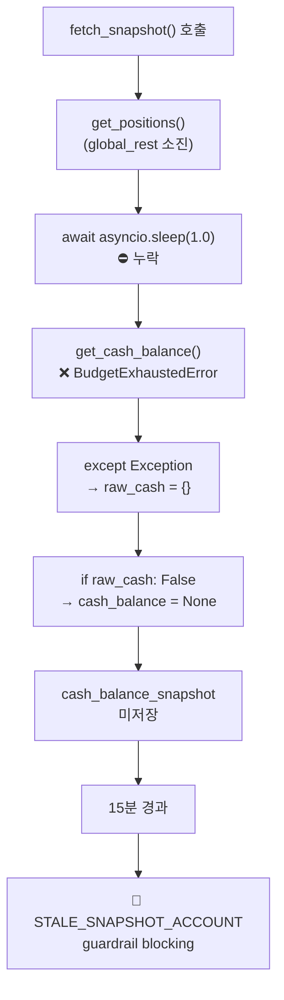
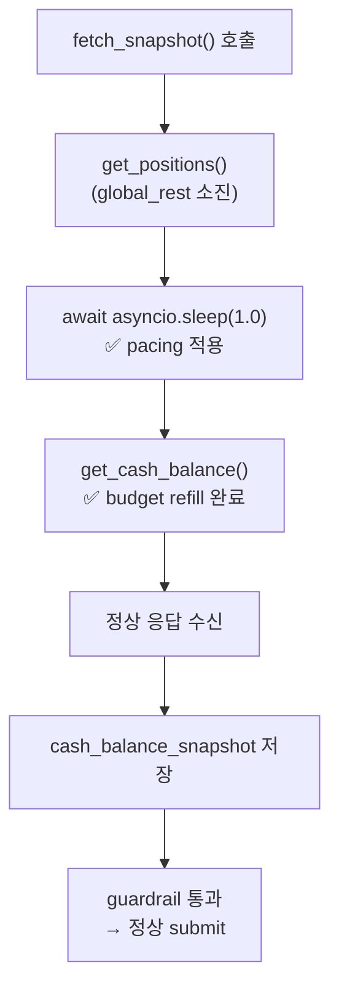

# Cash Sync Failure 및 STALE_SNAPSHOT_ACCOUNT Guardrail 진단 보고서

**작성일**: 2026-05-18  
**상태**: 최종  
**관련 파일**: [`snapshot.py`](../src/agent_trading/brokers/koreainvestment/snapshot.py), [`rate_limit.py`](../src/agent_trading/brokers/rate_limit.py), [`decision_orchestrator.py`](../src/agent_trading/services/decision_orchestrator.py)

---

## 배경

Phase AB에서 uuid7 import 에러를 복구하여 snapshot-sync는 정상 기동했지만, cash sync가 간헐적으로 실패하고 있습니다. 이 보고서는 cash sync failure의 root cause와 `STALE_SNAPSHOT_ACCOUNT` guardrail의 영향을 종합 진단합니다.

---

## 1. Cash Sync Failure Root Cause

**분류: B (rate-limit/pacing 문제) + D (예외가 조용히 삼켜짐)**

### 직접 원인: 신 경로 `fetch_snapshot()`에 paper 1 RPS pacing 누락

이 시스템에는 **두 개의 snapshot sync 코드 경로**가 존재합니다:

| 항목 | 구 경로 (legacy, 미사용) | 신 경로 (현재 사용) |
|------|------------------------|--------------------|
| 파일 | [`kis_snapshot_sync.py`](../src/agent_trading/services/kis_snapshot_sync.py) | [`snapshot.py`](../src/agent_trading/brokers/koreainvestment/snapshot.py) |
| 함수 | `sync_kis_account_snapshots()` | `KISSyncSnapshotProvider.fetch_snapshot()` |
| cash API 전 `asyncio.sleep(1.0)` | **있음** (line 266) | **없음** ❌ |
| 현재 사용 여부 | ❌ 사용 안 함 | ✅ `run_snapshot_sync_loop.py`에서 사용 |

### 실패 메커니즘

1. Paper 환경은 **1 RPS global REST cap** ([`rate_limit.py`](../src/agent_trading/brokers/rate_limit.py:488-489)):
   - `global_rest_capacity=1`, `global_rest_refill_rate=1.0`
2. [`fetch_snapshot()`](../src/agent_trading/brokers/koreainvestment/snapshot.py)에서 `get_positions()` 호출 직후 `get_cash_balance()` 호출
   - 둘 다 `inquire_balance` endpoint → `BucketType.INQUIRY` 소비
3. [`consume_or_raise()`](../src/agent_trading/brokers/rate_limit.py:258-268)의 2-tier enforcement:
   - Tier 1: `global_rest` bucket (capacity=1) — `get_positions()`가 소진
   - Tier 2: `INQUIRY` bucket (capacity=1)
4. `get_positions()`가 global_rest 소진 → 1초 이내 `get_cash_balance()` 호출 시 **Tier 1에서 BudgetExhaustedError**
5. 예외가 [`except Exception`](../src/agent_trading/brokers/koreainvestment/snapshot.py:159-163)에 잡힘 → `raw_cash = {}` → `if raw_cash:`가 False → **cash_balance=None** → **cash snapshot 미저장**

### 구 경로와의 차이

구 경로 [`sync_kis_account_snapshots()`](../src/agent_trading/services/kis_snapshot_sync.py:264-266)는 cash API 호출 전 `await asyncio.sleep(1.0)`으로 명시적 pacing 수행:

```python
# Paper 1 RPS pacing: ensure at least 1s between consecutive KIS calls
await asyncio.sleep(1.0)
```

이 pacing이 신 경로에는 **누락**되어 있습니다.

---

## 2. Timeline

### DB 기반 전체 흐름

| 시간 (UTC)    | 상태       | Pos | Cash | 비고 |
|--------------|------------|-----|------|------|
| 03:08~03:28  | completed  | 10  | 1    | 정상 sync |
| 03:28:45     | completed  | 10  | 1    | 🔵 마지막 정상 cash snapshot |
| 03:32~03:43  | partial    | 11~12 | 0  | 🔴 cash 실패 (3회 연속) |
| 03:44~04:17  | BLOCKED    | -   | -    | 🚫 STALE_SNAPSHOT_ACCOUNT guardrail |
| 04:17~04:19  | completed  | 12  | 1    | ✅ 회복 (budget refill) |

### 핵심 관찰

- **마지막 정상 cash snapshot**: `2026-05-18 03:28:45 UTC` (cash_balance_snapshot_id: `5898b7a8`)
- **cash 실패 구간**: 03:32~03:43 (11분, 3회 연속)
- **position은 정상**: 34건 position_snapshot 저장됨 (cash와 positions의 budget 소비 차이)
- **guardrail 발동**: 03:44 (cash 마지막 저장 후 16분, threshold 15분 초과)
- **회복**: 04:17 (budget이 시간 경과로 refill)

---

## 3. STALE_SNAPSHOT_ACCOUNT Guardrail 분석

### 코드 위치

[`decision_orchestrator.py`](../src/agent_trading/services/decision_orchestrator.py:1246-1316) — `_check_account_snapshot_freshness()`

### 동작 로직

```
1. cash_balance_snapshots.get_latest_by_account()
   → None이면 즉시 is_stale=True
   → 존재하면 age 계산 > 900초(=15분)이면 stale
2. position_snapshots.list_latest_by_account()
   → zero-position 계좌는 position stale=false
   → max age > 900초면 stale
3. is_cash_stale OR is_position_stale → STALE_SNAPSHOT_ACCOUNT blocking
```

### 실제 발동 기록 (DB 확인)

| 시각     | cash snapshot age | 결과 |
|----------|-------------------|------|
| 03:44:43 | ~16분 (threshold 초과) | 🚫 BLOCKED |
| 03:52:05 | ~23분               | 🚫 BLOCKED |
| 03:55:55 | ~27분               | 🚫 BLOCKED |

모든 기록: `is_cash_stale=true`, `is_position_stale=false` — **cash만 stale**.

---

## 4. 영향 범위

### 직접적 영향

1. **모든 submit 차단**: `STALE_SNAPSHOT_ACCOUNT` blocking rule → Phase 4c에서 pipeline 중단
2. **33분간 거래 차단**: 03:44~04:17 UTC
3. **최소 3건 submit SKIPPED**

### Fallback의 한계

[`_build_sizing_inputs()`](../src/agent_trading/services/decision_orchestrator.py:1178-1186)의 NAV fallback:

```
priority 1: risk_limit_snapshot.nav → None (cash sync 실패로 미생성)
priority 2: cash_balance_snapshot.total_asset → None (cash sync 실패로 미생성)
priority 3: None → concentration constraint bypass
```

**문제점**: guardrail이 cash_balance_snapshot 부재를 감지하고 **먼저 차단**하므로, fallback 로직에 **도달하지 않음**. 즉 sizing fallback은 guardrail 통과 후에만 의미가 있음.

---

## 5. 복구 우선순위

### P0 — 즉시: `fetch_snapshot()`에 pacing 추가

[`snapshot.py:155`](../src/agent_trading/brokers/koreainvestment/snapshot.py:155) — `get_cash_balance()` 호출 전 `await asyncio.sleep(1.0)` 추가

### P1 — 단기: 예외 전파 개선

- `except Exception`이 `BudgetExhaustedError`를 포함한 모든 예외를 조용히 삼킴
- `raw_cash = {}` 후 silent skip → 최소한 `logger.error()` 수준 강화

### P2 — 중기: guardrail 복구 신호

- guardrail이 차단만 하는 것이 아니라 복구 트리거(예: snapshot sync 재시도) 발생 고려

---

## 6. 추가 발견

### 발견 1: 구 경로 dead code

[`kis_snapshot_sync.py`](../src/agent_trading/services/kis_snapshot_sync.py)의 `sync_kis_account_snapshots()`는 현재 **어디에서도 호출되지 않음**. Pacing 로직이 포함된 유일한 구현체이므로 reference로 보존 가치 있음.

### 발견 2: 이전 시간대 완전 실패

01:35, 01:43, 02:20 UTC — `positions_synced_total=0`, `cash_synced_count=0` (완전 실패, pacing과 다른 원인으로 추정)

### 발견 3: Phase 전체 연결 관계

```
Phase AA: risk_limit_snapshots 0건 발견 → "cash sync 실패"로 관찰
  → Phase AB: uuid7 import 에러 발견 및 복구 (snapshot-sync 기동 복구)
    → Phase AC: cash sync pacing 누락 발견 (본 보고서)
      → 추후: pacing 수정 → cash sync 정상화 → risk_limit_snapshots 정상 생성
```

---

## 7. 실패 흐름도



### 복구 흐름도 (P0 적용 후)



---

## 참고 사항

- 이 보고서는 [`plans/`](./) 디렉토리에 저장됨
- 모든 코드 식별자, 파일명, 패키지명, API명, CLI 명령어는 영어로 유지
- 한국어로 작성되었으며 기술 용어는 원문 그대로 사용
