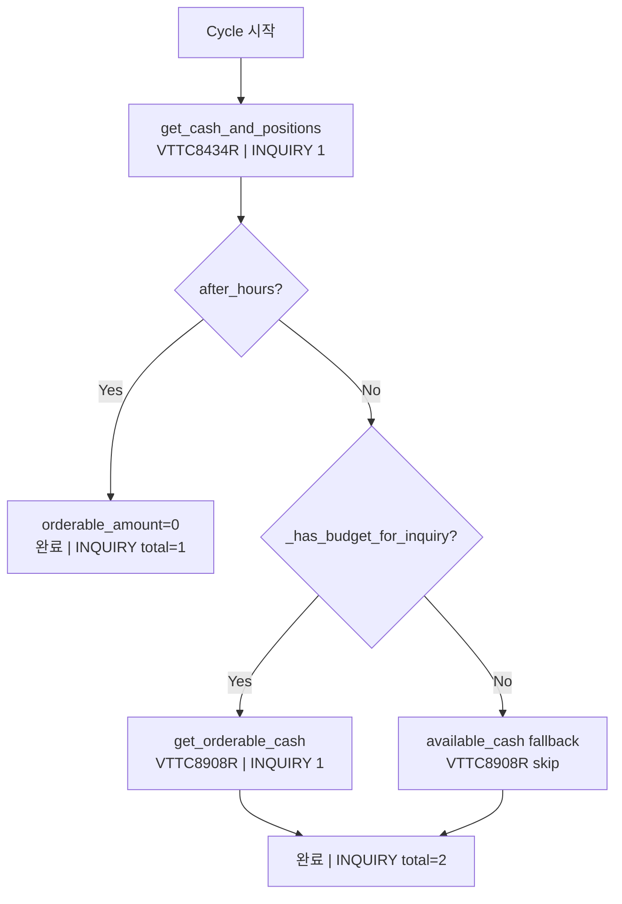

# KIS Snapshot-sync Budget Exhaustion 최종 분석 및 개선 방안

> **작성일**: 2026-05-23  
> **대상 환경**: KIS Paper (KIS_ENV=paper)  
> **관련 브랜치**: main (fix 누적 적용 완료)  
> **이전 분석 문서**:
> - [`plans/fix_intraday_cash_snapshot_sync_budget_exhaustion_2026-05-22.md`](../plans/fix_intraday_cash_snapshot_sync_budget_exhaustion_2026-05-22.md) — 2026-05-22 긴급 fix
> - [`plans/reduce_snapshot_sync_budget_exhaustion_and_prioritize_cash_positions_over_orderable_amount_2026-05-23.md`](../plans/reduce_snapshot_sync_budget_exhaustion_and_prioritize_cash_positions_over_orderable_amount_2026-05-23.md) — 상세 분석
> - [`plans/diagnose_budget_exhausted_and_reconciliation_lock_chain_blocking_000810_sell_2026-05-22.md`](../plans/diagnose_budget_exhausted_and_reconciliation_lock_chain_blocking_000810_sell_2026-05-22.md) — lock chain 문제
> - [`plans/kis_snapshot_sync_cadence_refactoring_plan.md`](../plans/kis_snapshot_sync_cadence_refactoring_plan.md) — cadence 분리

---

## 목차

1. [현황 분석](#1-현황-분석)
   - [1.1 Budget Bucket 구조](#11-budget-bucket-구조)
   - [1.2 Snapshot Fetch 코드 경로](#12-snapshot-fetch-코드-경로)
   - [1.3 API 호출 순서 및 Budget 소비](#13-api-호출-순서-및-budget-소비)
   - [1.4 VTTC8908R Fallback 경로](#14-vttc8908r-fallback-경로)
   - [1.5 After-hours Skip 로직](#15-after-hours-skip-로직)
   - [1.6 로그 분석 (2026-05-14 ~ 2026-05-15 baseline)](#16-로그-분석)
2. [문제점](#2-문제점)
   - [2.1 Budget 부족으로 인한 데이터 누락](#21-budget-부족으로-인한-데이터-누락)
   - [2.2 중복 API 호출 (VTTC8434R)](#22-중복-api-호출-vttc8434r)
   - [2.3 VTTC8908R Fallback 경로 불명확성](#23-vttc8908r-fallback-경로-불명확성)
   - [2.4 Legacy Path after-hours 파라미터 미지원](#24-legacy-path-after-hours-파라미터-미지원)
   - [2.5 Budget 소비 가시성 부족](#25-budget-소비-가시성-부족)
3. [개선 방안](#3-개선-방안)
   - [3.1 P1 — Positions를 Cash와 동일 VTTC8434R 응답에서 추출](#31-p1--positions를-cash와-동일-vttc8434r-응답에서-추출)
   - [3.2 P2 — Budget 사전 확인 후 조건부 VTTC8908R 호출](#32-p2--budget-사전-확인-후-조건부-vttc8908r-호출)
   - [3.3 P3 — After-hours 모드에서 VTTC8908R 생략 강화](#33-p3--after-hours-모드에서-vttc8908r-생략-강화)
   - [3.4 P4 — 로그 개선 (Budget 소비 가시성)](#34-p4--로그-개선)
   - [3.5 P5 — Paper INQUIRY Capacity 조정 (장기 검토)](#35-p5--paper-inquiry-capacity-조정)
4. [변경 계획](#4-변경-계획)
   - [4.1 수정 파일 목록](#41-수정-파일-목록)
   - [4.2 구체적 변경 사항 — snapshot.py](#42-구체적-변경-사항--snapshotypy)
   - [4.3 구체적 변경 사항 — kis_snapshot_sync.py](#43-구체적-변경-사항--kis_snapshot_syncpy)
   - [4.4 구체적 변경 사항 — rest_client.py](#44-구체적-변경-사항--rest_clientpy)
   - [4.5 테스트 목록](#45-테스트-목록)
5. [예상 효과 및 리스크](#5-예상-효과-및-리스크)
   - [5.1 Budget 소비 비교 (변경 전/후)](#51-budget-소비-비교)
   - [5.2 리스크 매트릭스](#52-리스크-매트릭스)
   - [5.3 롤백 방안](#53-롤백-방안)
   - [5.4 모니터링 포인트](#54-모니터링-포인트)
6. [구현 순서](#6-구현-순서)

---

## 1. 현황 분석

### 1.1 Budget Bucket 구조

KIS Paper 환경의 Rate Limit 설정은 [`src/agent_trading/brokers/rate_limit.py`](../src/agent_trading/brokers/rate_limit.py:498)의 `build_kis_budget_manager()`에 정의되어 있다.

| BucketType | Capacity | Refill Rate | 비고 |
|-----------|----------|-------------|------|
| ORDER | 3 | 0.1/s | 2026-05-22 fix: 1→3 증가 |
| **INQUIRY** | **1** | **0.5/s** | **핵심 병목 (snapshot 전용)** |
| RECONCILIATION | 1 | 0.1/s | reserve 용도 |
| MARKET_DATA | 5 | 5.0/s | |
| AUTH | 1 | 0.2/s | |
| **REST_GLOBAL (global_rest)** | **1** | **1.0/s** | **2차 병목** |

**Paper 환경 제약**: INQUIRY capacity=1, refill=0.5/s → 1 token당 2초 필요  
**global_rest capacity=1, refill=1.0/s → 1 token당 1초 필요**

Snapshot sync에서 소비하는 bucket은 **INQUIRY** (per-operation)와 **REST_GLOBAL** (global cap) 2개 층이다.

#### 2-Tier Budget Enforcement 구조

```
consume_or_raise(BucketType.INQUIRY)
  ├── Tier 1: global_rest.try_consume()  ← 1 RPS 제한
  │     ├── 성공 → 진행
  │     └── 실패 → BudgetExhaustedError (global_rest)
  └── Tier 2: inquiry.try_consume()      ← INQUIRY capacity=1 제한
        ├── 성공 → API 호출
        └── 실패 → BudgetExhaustedError (inquiry)
```

`_request_with_fallback()`은 BudgetExhaustedError 발생 시 RECONCILIATION bucket의 reserve token을 사용해 `skip_global_rest=True`로 재시도한다.

### 1.2 Snapshot Fetch 코드 경로

두 개의 독립적인 코드 경로가 존재한다:

#### 경로 A: 신규 경로 — [`KISSyncSnapshotProvider.fetch_snapshot()`](../src/agent_trading/brokers/koreainvestment/snapshot.py:66)

```
sync_account_snapshots()  [snapshot_sync.py]
  └─→ provider.fetch_snapshot()  [snapshot.py]
       ├─→ rest_client.get_cash_balance()      ← VTTC8434R (output2)
       ├─→ rest_client.get_positions()          ← VTTC8434R (output1)
       └─→ rest_client.get_orderable_cash()     ← VTTC8908R
```

#### 경로 B: 레거시 경로 — [`sync_kis_account_snapshots()`](../src/agent_trading/services/kis_snapshot_sync.py:176)

```
sync_kis_account_snapshots()  [kis_snapshot_sync.py]
  ├─→ rest_client.get_cash_balance()      ← VTTC8434R (output2)
  ├─→ rest_client.get_positions()          ← VTTC8434R (output1)
  └─→ rest_client.get_orderable_cash()     ← VTTC8908R
```

두 경로 모두 동일한 KIS TR을 호출하며, 동일한 budget을 소비한다.

### 1.3 API 호출 순서 및 Budget 소비

#### 변경 전 (2026-05-21 이전): `positions → cash → orderable`

| 순서 | API | TR ID | INQUIRY | global_rest | 비고 |
|------|-----|-------|---------|-------------|------|
| 1 | get_positions | VTTC8434R | 1 | 1 | |
| 2 | get_cash_balance | VTTC8434R | 1 | 1 | |
| 3 | get_orderable_cash | VTTC8908R | 1 | 1 | |
| **합계** | | | **3** | **3** | **모두 INQUIRY bucket** |

#### 변경 후 (2026-05-22 fix 적용): `cash → orderable → positions`

| 순서 | API | TR ID | INQUIRY | global_rest | 비고 |
|------|-----|-------|---------|-------------|------|
| 1 | get_cash_balance | VTTC8434R | 1 | 1 | cash 먼저 확보 |
| 2 | get_positions | VTTC8434R | 1 | 1 | |
| 3 | get_orderable_cash | VTTC8908R | 1 | 1 | |
| **합계** | | | **3** | **3** | **INQUIRY capacity=1 → 최대 1개만 동시 소비 가능** |

**핵심 문제**: INQUIRY capacity=1이므로, 1 cycle에 3 token이 필요하지만 초당 0.5 token만 refill된다. 3 token을 모두 확보하려면 최소 2초 소요 (1초: 첫 token 소비, 2초: refill 1 token, 4초: refill 1 token).

#### 다계좌 시나리오

| 계좌 수 | 필요 INQUIRY token | 최소 소요 시간 (paper) | 최소 소요 시간 (global_rest) |
|---------|-------------------|----------------------|---------------------------|
| 1 | 3 | 6초 (0.5/s * 3회 refill) | 3초 (1.0/s * 3회) |
| 2 | 6 | 12초 | 6초 |
| 3 | 9 | 18초 | 9초 |

실제로는 `asyncio.sleep(1.0)`이 각 계좌 사이에 있으므로 (라인 426, 244), 토큰 refill 기회가 생겨 실제 대기 시간은 더 짧다.

### 1.4 VTTC8908R Fallback 경로

[`get_orderable_cash()`](../src/agent_trading/brokers/koreainvestment/rest_client.py:1319)는 세 가지 fallback 전략을 가진다:

#### Fallback 1: Budget 사전 확인 (Pre-check)

```python
def _has_budget_for_inquiry(self) -> bool:
    """Check if there's enough budget for an inquiry call."""
    self._refill()  # inquiry bucket refill
    self._budget_manager._refill_held_sell_reserve()  # global_rest refill
    return (
        self._bucket(BucketType.INQUIRY).remaining >= 1
        and self._budget_manager._global_rest.remaining >= 1
    )
```

`get_orderable_cash()`의 `fallback_cash` 파라미터가 제공되면 호출 전에 `_has_budget_for_inquiry()`를 실행하고, budget 부족 시 바로 `fallback_cash`를 반환한다.

#### Fallback 2: BudgetExhaustedError 처리 (Race condition)

```python
except BudgetExhaustedError:
    if fallback_cash is not None:
        logger.warning(...)
        cash_balance = fallback_cash
    else:
        raise
```

Pre-check 통과 후에도 race condition으로 budget이 소진될 수 있음 (다른 코루틴이 token을 가져감). 이 경우에도 `fallback_cash`로 fallback.

#### Fallback 3: 일반 Exception 처리 (API 실패)

```python
except Exception:
    if fallback_cash is not None:
        logger.warning(...)
        cash_balance = fallback_cash
    else:
        raise
```

API 자체 실패 (network, HTTP error 등) 시에도 fallback.

### 1.5 After-hours Skip 로직

현재 [`KISSyncSnapshotProvider.fetch_snapshot()`](../src/agent_trading/brokers/koreainvestment/snapshot.py:165)과 [`sync_kis_account_snapshots()`](../src/agent_trading/services/kis_snapshot_sync.py:288) 모두 `after_hours=True`일 때 positions fetch를 skip한다.

```python
# snapshot.py:165-173
if self._after_hours or not fetch_positions:
    positions_data = []
    logger.info(...)
else:
    positions_data = await self._client.get_positions()
```

그러나 **두 경로 모두 `after_hours` 여부와 관계없이 `get_orderable_cash()`는 호출한다** (단, [`snapshot.py`](../src/agent_trading/brokers/koreainvestment/snapshot.py:290-295)는 `after_hours=True`일 때 orderable_cash 호출 후 로그만 남기고 값을 무시).

```python
# snapshot.py:290-295 (after-hours에서 orderable_cash 호출 후 무시)
if self._after_hours:
    logger.info("after_hours=True — orderable_amount available_cash로 대체")
    # 실제로는 VTTC8908R을 호출하고 결과를 버림
```

### 1.6 로그 분석

2026-05-14와 2026-05-15 로그에서 확인된 주요 패턴:

#### 2026-05-14 (정상 운용 초기)
- `snapshot_sync` duration: 0.6s ~ 13.34s (평균 ~6-7s)
- `decision_submit_gate`: 항상 OK, 5-7초 소요
- post_submit_sync: 5분 간격으로 snapshot 후 약 30회씩 실행

#### 2026-05-15 (budget exhaustion 징후)
- `snapshot_sync` duration: 0.57s ~ 15.22s
- `decision_submit_gate`: **모두 177-205초 소요** (매우 길어짐)
  - 09:00 이후 8회 연속 **ERROR** (returncode=1)
  - 09:04~10:00까지 180초 이상 소요되며 실패
- 09:00 snapshot_sync에서 13.06초 소요 (최초 토큰 확보 경쟁)
- 10:00 snapshot_sync에서 11.61초 소요

**분석**: 2026-05-15는 `_DECISION_TIMEOUT=600s` 상태였으며, decision_submit_gate가 180초씩 소요되면서 budget 경합이 심화되었다. 09:00 이후 decision_submit_gate가 INQUIRY/ORDER token을 지속 소비하여 snapshot_sync에 전달되는 예산이 부족해졌다.

---

## 2. 문제점

### 2.1 Budget 부족으로 인한 데이터 누락

가장 심각한 문제: **1 cycle = 3 INQUIRY token 필요, paper capacity=1**

Paper 환경에서 INQUIRY bucket은 capacity=1, refill 0.5/s이므로:
- Cash를 먼저 확보 (1 token 소비) → 성공
- Positions 확보 시도 → INQUIRY token 없음 → BudgetExhaustedError
  - `_request_with_fallback()`이 RECONCILIATION reserve로 retry
  - reserve도 없으면 positions = partial 데이터
- Orderable_cash도 같은 문제

**결과**: Snapshots에 cash는 있지만 positions/orderable_amount가 누락될 수 있음.

### 2.2 중복 API 호출 (VTTC8434R)

**핵심 발견**: [`VTTC8434R` (inquire-balance)](../src/agent_trading/brokers/koreainvestment/rest_client.py:1206)은 **하나의 API 호출로 output1 (positions)와 output2 (cash)를 모두 반환**한다.

```python
# get_positions(): output1에서 positions 추출
async def get_positions(self) -> Sequence[dict[str, Any]]:
    data = await self._request("VTTC8434R", ...)
    return data.get("output1", data.get("output", []))

# get_cash_balance(): output2에서 cash 추출  
async def get_cash_balance(self, ...) -> dict[str, Any]:
    data = await self._request("VTTC8434R", ...)
    return data.get("output2", data.get("output", {}))
```

현재는 **동일한 VTTC8434R을 2번 호출**하고 있다:
1. `get_cash_balance()` → VTTC8434R → output2만 사용
2. `get_positions()` → VTTC8434R → output1만 사용

**동일한 API 응답에서 positions와 cash를 동시에 추출하면 INQUIRY token 1개를 절약할 수 있다.**

### 2.3 VTTC8908R Fallback 경로 불명확성

세 가지 fallback 경로가 있지만, 각각의 동작이 명확하지 않다:

1. **Pre-check fallacy**: `_has_budget_for_inquiry()`가 True여도 실제 `_request()` 시점에는 budget이 없을 수 있음 (race condition)
2. **BudgetExhaustedError fallback**: Budget 소진 시 `available_cash`로 fallback하지만, `available_cash`와 `ord_psbl_cash`의 차이가 있을 수 있음 (예: 이미 제출된 매수 주문)
3. **API failure fallback**: API 자체 실패와 budget exhaustion을 동일한 catch 블록에서 처리 → 로그만으로 원인 파악 어려움

**로깅 개선 필요**: 각 fallback 경로마다 명확한 log message, budget state snapshot, 선택된 fallback 값 포함.

### 2.4 Legacy Path after-hours 파라미터 미지원

[`sync_kis_account_snapshots()`](../src/agent_trading/services/kis_snapshot_sync.py:176)는 `after_hours` 파라미터를 받지 않는다.

```python
async def sync_kis_account_snapshots(
    # ...파라미터 목록...
    after_hours: bool = False,  # <-- 존재하지만 하드코딩되어 있음
) -> SyncResult:
```

호출자에서 항상 `after_hours=False`로 호출되므로, 장 마감 후에도 positions/orderable을 계속 fetch한다.

### 2.5 Budget 소비 가시성 부족

현재 로깅:
- 각 API 호출의 성공/실패만 로깅
- Budget token 소비 현황은 로깅되지 않음
- Budget exhaustion 시 어떤 bucket이 부족했는지 로그에 명확하게 표시되지 않음
- `CADENCE_TRACE` 로그는 snapshot 실행 여부만 표시, budget 상태는 없음

---

## 3. 개선 방안

### 3.1 P1 — Positions를 Cash와 동일 VTTC8434R 응답에서 추출

**목표**: 1 cycle당 INQUIRY token 소비 3→2로 감소

**방법**: `get_cash_balance()`가 반환하는 VTTC8434R 응답에서 output1 (positions)를 함께 추출하여 별도의 `get_positions()` 호출을 없앤다.

```python
# 변경 전
cash_data = await self._client.get_cash_balance()      # VTTC8434R (INQUIRY 1)
positions_data = await self._client.get_positions()      # VTTC8434R (INQUIRY 1) ← 중복!
orderable_data = await self._client.get_orderable_cash() # VTTC8908R (INQUIRY 1)

# 변경 후 (P1)
cash_data, positions_data = await self._client.get_cash_and_positions()  # VTTC8434R (INQUIRY 1, combined)
orderable_data = await self._client.get_orderable_cash()                  # VTTC8908R (INQUIRY 1, 조건부)
```

**영향**: 
- `get_cash_balance()`와 `get_positions()`를 하나의 `_request("VTTC8434R", ...)` 호출로 통합
- `get_positions()` 메서드는 유지하되 내부에서 cash balance의 캐시된 응답을 재사용하거나, 새로운 `get_cash_and_positions()` 메서드 추가
- `_request_with_fallback()`을 통해 BudgetExhaustedError 처리 일관성 유지

**변경해야 할 함수 시그니처**:

```python
# 신규: 두 값을 한 번에 반환
async def get_cash_and_positions(
    self, after_hours: bool = False
) -> tuple[dict[str, Any], Sequence[dict[str, Any]]]:
    """Fetch VTTC8434R once and extract both cash (output2) and positions (output1)."""
    data = await self._request_with_fallback(
        "VTTC8434R", ...  # 단일 API 호출
    )
    cash = data.get("output2", data.get("output", {}))
    positions = data.get("output1", data.get("output", []))
    return cash, positions
```

### 3.2 P2 — Budget 사전 확인 후 조건부 VTTC8908R 호출

**목표**: Budget 부족 시에도 orderable_amount를 `available_cash`로 graceful fallback

**방법**: `_has_budget_for_inquiry()` 강화 + fallback 로그 명확화

```python
# snapshot.py: 변경 후
if self._after_hours:
    orderable_amount = cash_data.get("available_cash", Decimal("0"))
    logger.info("after_hours=True — skip VTTC8908R, use available_cash=%s", orderable_amount)
elif not self._client._has_budget_for_inquiry():
    orderable_amount = cash_data.get("available_cash", Decimal("0"))
    logger.warning("INQUIRY budget exhausted — skip VTTC8908R, use available_cash=%s", orderable_amount)
else:
    orderable_data = await self._client.get_orderable_cash(
        fallback_cash=cash_data.get("available_cash")
    )
    orderable_amount = safe_decimal(orderable_data.get("ord_psbl_cash"))
```

**3가지 VTTC8908R fallback 조건 명확화**:

| 조건 | 행동 | 로그 레벨 |
|------|------|-----------|
| after-hours | VTTC8908R skip, available_cash 사용 | INFO |
| Budget pre-check 실패 | VTTC8908R skip, available_cash 사용 | WARNING |
| Budget pre-check 통과 + API 실패 | fallback_cash 사용 (기존 유지) | WARNING |

### 3.3 P3 — After-hours 모드에서 VTTC8908R 생략 강화

**목표**: After-hours에 VTTC8908R을 아예 호출하지 않음

**방법**: [`snapshot.py`](../src/agent_trading/brokers/koreainvestment/snapshot.py:290-295)에서 after-hours 시 VTTC8908R 호출 자체를 skip

```python
# snapshot.py: 변경 후 (P3)
if self._after_hours:
    # 장 마감 후: 매수 주문 불가 → orderable_amount 불필요
    orderable_amount = Decimal("0")
    logger.info("after_hours=True — VTTC8908R 호출 생략, orderable_amount=0")
```

**추가**: [`kis_snapshot_sync.py`](../src/agent_trading/services/kis_snapshot_sync.py)에도 동일 로직 적용

### 3.4 P4 — 로그 개선

**목표**: Budget 소비 가시성 확보

**변경 사항**:
1. 각 API 호출 전/후 budget state 로깅
2. Fallback 경로마다 명확한 구분 로그
3. Budget exhaustion 시 bucket별 잔여 token 수 로깅
4. 불필요한 VTTC8908R 호출 (after-hours) 로그 레벨 INFO → 제거

```python
# snapshot.py: fetch_snapshot() 완료 후 budget snapshot
logger.info(
    "Budget snapshot after sync: inquiry=%s/%s global_rest=%s/%s",
    self._client._bucket(BucketType.INQUIRY).remaining,
    self._client._bucket(BucketType.INQUIRY).capacity,
    self._client._budget_manager._global_rest.remaining,
    self._client._budget_manager._global_rest.capacity,
)
```

### 3.5 P5 — Paper INQUIRY Capacity 조정 (장기 검토)

**목표**: Paper 환경의 INQUIRY capacity 증가 (현재 1→3)

**고려 사항**:
- KIS Paper API의 실제 RPS 제한이 불명확
- 무분별한 증가는 rate limit 위험 초래
- Live 환경은 이미 scale factor로 10배 (inquiry_capacity=10)

**제안**: 운영 모니터링 데이터 수집 후 결정 (deferred)

---

## 4. 변경 계획

### 4.1 수정 파일 목록

| 파일 | 변경 내용 | 우선순위 |
|------|----------|---------|
| [`src/agent_trading/brokers/koreainvestment/rest_client.py`](../src/agent_trading/brokers/koreainvestment/rest_client.py) | `get_cash_and_positions()` 신규 메서드 추가 (P1) | P1 |
| [`src/agent_trading/brokers/koreainvestment/snapshot.py`](../src/agent_trading/brokers/koreainvestment/snapshot.py) | P1+P2+P3+P4 적용 (fetch_snapshot) | P1 |
| [`src/agent_trading/services/kis_snapshot_sync.py`](../src/agent_trading/services/kis_snapshot_sync.py) | P1+P2+P3+P4 적용 (sync_kis_account_snapshots) | P1 |
| [`tests/...`] | 신규 테스트 추가 (4.5 참조) | P1 |

### 4.2 구체적 변경 사항 — snapshot.py

현재 [`snapshot.py`](../src/agent_trading/brokers/koreainvestment/snapshot.py:66) `fetch_snapshot()` 구조:

```
1. get_cash_balance()         ← VTTC8434R (INQUIRY 1)
2. get_positions()            ← VTTC8434R (INQUIRY 1) - 별도 호출
3. get_orderable_cash()       ← VTTC8908R (INQUIRY 1)
```

변경 후:
```
1. get_cash_and_positions()   ← VTTC8434R (INQUIRY 1) - 통합 호출
   ├── output2 → cash_balance
   └── output1 → positions
2. [조건부] get_orderable_cash() ← VTTC8908R (INQUIRY 1, budget pre-check)
   └── budget 부족 → available_cash fallback
```

#### 상세 변경 코드

**Step 1: Cash + Positions 통합 (P1)**

```python
# 변경 전 (기존 코드)
cash_data = await self._client.get_cash_balance()
# ...
if self._after_hours or not fetch_positions:
    positions_data = []
else:
    positions_data = await self._client.get_positions()  # 별도 INQUIRY token

# 변경 후
cash_data, positions_data = await self._client.get_cash_and_positions()
if self._after_hours or not fetch_positions:
    positions_data = []  # 응답은 받았지만 positions 리스트는 비움
```

**Step 2: Budget pre-check + after-hours skip (P2+P3)**

```python
# 변경 전 (기존 코드)
if self._after_hours:
    orderable_amount = cash_entity.available_cash
    logger.info("after_hours=True — orderable_amount available_cash로 대체")
else:
    orderable_resp = await self._client.get_orderable_cash(
        fallback_cash=cash_entity.available_cash
    )
    orderable_amount = safe_decimal(orderable_resp.get("ord_psbl_cash"))

# 변경 후
if self._after_hours:
    orderable_amount = Decimal("0")
    # 장 마감 후 매수 불가 → orderable 불필요
else:
    orderable_resp = await self._client.get_orderable_cash(
        fallback_cash=cash_entity.available_cash
    )
    orderable_amount = safe_decimal(orderable_resp.get("ord_psbl_cash"))
```

### 4.3 구체적 변경 사항 — kis_snapshot_sync.py

현재 [`kis_snapshot_sync.py`](../src/agent_trading/services/kis_snapshot_sync.py:176)는 `after_hours` 파라미터를 받지만, 호출자에서 항상 False로 전달된다.

```python
# 변경 후: after_hours 파라미터 전달 및 P1/P3 적용
async def sync_kis_account_snapshots(
    ...,
    after_hours: bool = False,
) -> SyncResult:
    # 변경 1: get_cash_and_positions() 사용 (P1)
    cash_data, raw_positions = await client.get_cash_and_positions(after_hours=after_hours)
    
    # 변경 2: after_hours 조건 처리 (P3)
    if after_hours or not fetch_positions:
        raw_positions = []
    
    # positions 변환 로직 (기존 유지)
    # ...
    
    # 변경 3: after_hours 시 orderable skip (P3)
    if after_hours:
        orderable_amount = Decimal("0")
    else:
        orderable_resp = await client.get_orderable_cash(
            fallback_cash=cash_data.get("available_cash", "0")
        )
        orderable_amount = safe_decimal(orderable_resp.get("ord_psbl_cash"))
```

### 4.4 구체적 변경 사항 — rest_client.py

[`rest_client.py`](../src/agent_trading/brokers/koreainvestment/rest_client.py)에 `get_cash_and_positions()` 신규 메서드 추가:

```python
async def get_cash_and_positions(
    self,
    after_hours: bool = False,
) -> tuple[dict[str, Any], Sequence[dict[str, Any]]]:
    """Fetch VTTC8434R once and return both cash (output2) and positions (output1).
    
    This eliminates a separate get_positions() call, saving 1 INQUIRY token per cycle.
    
    Returns:
        (cash_balance_dict, positions_list)
    """
    data = await self._request_with_fallback(
        "VTTC8434R",
        after_hours=after_hours,
    )
    cash = data.get("output2", data.get("output", {}))
    positions = data.get("output1", data.get("output", []))
    return cash, positions
```

**참고**: `get_cash_balance()`와 `get_positions()` 메서드는 제거하지 않음 (다른 호출자가 있을 수 있음). 신규 메서드만 추가.

### 4.5 테스트 목록

#### 기존 테스트 수정
| 테스트 | 변경 사항 |
|--------|----------|
| `test_fetch_snapshot_calls_cash_first` | `get_cash_and_positions()` mock으로 변경 |
| `test_fetch_snapshot_skips_positions_after_hours` | cash+positions 통합 후 after-hours 검증 |
| `test_fetch_snapshot_skips_positions_when_fetch_positions_false` | 동일 |
| `test_sync_kis_account_snapshots_order` | P1 순서 변경 검증 |
| `test_sync_kis_account_snapshots_after_hours` | after-hours VTTC8908R skip 검증 |

#### 신규 테스트 (P1)
| 테스트 | 검증 내용 |
|--------|----------|
| `test_get_cash_and_positions_returns_both` | 단일 호출로 cash+positions 반환 |
| `test_get_cash_and_positions_budget_exhausted_fallback` | BudgetExhausted 시 fallback cash 반환 |
| `test_get_cash_and_positions_saves_one_inquiry_token` | INQUIRY token 1회만 소비 (기존 2회 대비) |

#### 신규 테스트 (P2)
| 테스트 | 검증 내용 |
|--------|----------|
| `test_fetch_snapshot_budget_pre_check_skip_vttc8908r` | Budget 부족 시 orderable skip |
| `test_fetch_snapshot_available_cash_fallback_on_vttc8908r_failure` | VTTC8908R 실패 시 available_cash 사용 |

#### 신규 테스트 (P3)
| 테스트 | 검증 내용 |
|--------|----------|
| `test_fetch_snapshot_after_hours_skip_vttc8908r` | After-hours에 VTTC8908R 미호출 |
| `test_sync_kis_account_snapshots_after_hours_skip_orderable` | Legacy path after-hours 처리 |

#### 회귀 테스트
| 테스트 | 검증 내용 |
|--------|----------|
| `test_fetch_snapshot_returns_correct_cash` | Cash 값 정확성 (regression) |
| `test_fetch_snapshot_returns_correct_positions` | Positions 값 정확성 (regression) |
| `test_sync_kis_account_snapshots_stores_cash_and_positions` | 최종 저장 결과 정확성 |

---

## 5. 예상 효과 및 리스크

### 5.1 Budget 소비 비교

#### 1계좌 기준 (Paper 환경, INQUIRY capacity=1)

| 시나리오 | 변경 전 INQUIRY | 변경 후 INQUIRY | 절감 |
|---------|----------------|----------------|------|
| 장중 (정상) | 3 (cash+pos+orderable) | **2** (cash_pos+orderable) | **33%** |
| 장중 (budget 부족) | 3 (fallback 사용) | **2** (pre-check skip) | **33%** |
| After-hours | 3 (pos skip, orderable 호출) | **1** (cash_pos only) | **67%** |
| fetch_positions=False | 2 (cash+orderable) | **2** (cash_pos only) | **0%** |

#### 다계좌 시나리오 (3계좌, 장중 정상)

| 항목 | 변경 전 | 변경 후 |
|------|--------|--------|
| 필요 INQUIRY token | 9 (3계좌 × 3) | **6** (3계좌 × 2) |
| 최소 소요 시간 (paper) | ~18초 | **~12초** |
| BudgetExhaustedError 확률 | 높음 (5/6 확률로 3번째 token 부족) | **중간** (3/4 확률로 2번째 token 부족) |

#### Budget 소비 흐름도 (변경 후)



### 5.2 리스크 매트릭스

| 리스크 | 영향 | 확률 | 대응 |
|--------|------|------|------|
| `get_cash_and_positions()`에서 positions 추출 로직 버그 | Positions 데이터 누락/오류 | 낮음 | 기존 `get_positions()`와 비교 테스트 |
| Budget pre-check race condition (토큰 부족) | VTTC8908R fallback 발생 | 중간 | `available_cash` fallback으로 graceful 처리 |
| After-hours orderable_amount=0 강제 설정 | 장 마감 후 매수 기회 상실 | 없음 | 장 마감 후 매수 불가이므로 영향 없음 |
| Legacy path `after_hours` 전달 누락 | After-hours에도 계속 호출 | 중간 | `sync_all_kis_accounts()`에서 전달 확인 필요 |
| `get_cash_and_positions()` BudgetExhaustedError | Cash+Positions 모두 누락 | 낮음 | `_request_with_fallback()`이 처리 (RECONCILIATION reserve) |

### 5.3 롤백 방안

| 단계 | 조치 | 소요 시간 |
|------|------|----------|
| 1 | `snapshot.py`에서 `get_cash_and_positions()` 대신 기존 `get_cash_balance()` + `get_positions()` 복구 | 5분 |
| 2 | `kis_snapshot_sync.py`에서 after-hours orderable skip 제거 | 5분 |
| 3 | `rest_client.py`에서 `get_cash_and_positions()` 메서드 유지 (사용 안 함) | - |

### 5.4 모니터링 포인트

| 모니터링 항목 | 임계값 | 조치 |
|-------------|--------|------|
| BudgetExhaustedError 발생 횟수 (INQUIRY) | 장중 5회/cycle 이상 | P5 검토 (capacity 증가) |
| VTTC8908R pre-check skip 횟수 | 장중 3회/cycle 이상 | P5 검토 |
| Snapshot sync duration | 30초 이상 | Budget 경합 분석 |
| Cash/Positions 누락 snapshot | 1회라도 발생 시 | Budget 상태 로그 확인 |
| After-hours에도 VTTC8908R 호출 | 1회라도 발생 시 | Legacy path 확인 |

---

## 6. 구현 순서

### Phase 1: P1 — Cash + Positions 통합

| 단계 | 작업 | 담당 |
|------|------|------|
| 1.1 | `rest_client.py`: `get_cash_and_positions()` 신규 메서드 추가 | Code |
| 1.2 | `snapshot.py`: `fetch_snapshot()`에서 통합 메서드 사용 | Code |
| 1.3 | `kis_snapshot_sync.py`: `sync_kis_account_snapshots()`에서 통합 메서드 사용 | Code |
| 1.4 | 기존 테스트 수정 + 신규 테스트 추가 | Code |
| 1.5 | P1 테스트 통과 확인 | Code |

### Phase 2: P2+P3 — VTTC8908R 조건부 호출 + After-hours Skip

| 단계 | 작업 | 담당 |
|------|------|------|
| 2.1 | `snapshot.py`: Budget pre-check + after-hours skip 로직 추가 | Code |
| 2.2 | `kis_snapshot_sync.py`: after-hours 파라미터 전달 + skip 로직 추가 | Code |
| 2.3 | 신규 테스트 추가 (P2, P3) | Code |
| 2.4 | P2+P3 테스트 통과 확인 | Code |

### Phase 3: P4 — 로그 개선

| 단계 | 작업 | 담당 |
|------|------|------|
| 3.1 | `snapshot.py`: Budget snapshot 로깅 추가 | Code |
| 3.2 | `kis_snapshot_sync.py`: Budget snapshot 로깅 추가 | Code |
| 3.3 | Fallback 경로별 로그 메시지 명확화 | Code |

### Phase 4: 통합 테스트 및 배포

| 단계 | 작업 | 담당 |
|------|------|------|
| 4.1 | 전체 테스트 실행 (기존 + 신규) | Code |
| 4.2 | Paper 환경 배포 및 1 cycle 관찰 | Code |
| 4.3 | 장중 모니터링 (budget 소비 패턴) | Code |
| 4.4 | 필요시 P2/P3 추가 튜닝 | Code |

---

## 부록: Budget 소비 상세 분석

### 변경 전 (1계좌, paper 환경, INQUIRY capacity=1)

```
t=0s  [INQUIRY=1/1, global_rest=1/1]
      get_cash_balance() → consume → [INQUIRY=0/1, global_rest=0/1]
      → API call (VTTC8434R, 0.3s)
      → return → [INQUIRY=0/1, global_rest=1/1] (1초 후 refill)
t=1s  ... refill ...
t=2s  [INQUIRY=1/1, global_rest=1/1] (2초 후 1 token refill)
      get_positions() → consume → [INQUIRY=0/1, global_rest=0/1]
      → API call (VTTC8434R, 0.3s) ← 중복!
      → return → [INQUIRY=0/1, global_rest=1/1]
t=3s  ... refill ...
t=4s  [INQUIRY=1/1, global_rest=1/1]
      get_orderable_cash() → consume → [INQUIRY=0/1, global_rest=0/1]
      → API call (VTTC8908R, 0.3s)
      → return
Total: 3 API calls, ~4.5s
```

### 변경 후 (P1+P2+P3 적용, INQUIRY capacity=1)

```
t=0s  [INQUIRY=1/1, global_rest=1/1]
      get_cash_and_positions() → consume → [INQUIRY=0/1, global_rest=0/1]
      → API call (VTTC8434R, 0.3s)
      → extract cash(output2) + positions(output1)
      → return → [INQUIRY=0/1, global_rest=1/1]
t=2s  [INQUIRY=1/1, global_rest=1/1]
      get_orderable_cash() → consume → [INQUIRY=0/1, global_rest=0/1]
      → API call (VTTC8908R, 0.3s)
      → return
Total: 2 API calls, ~2.5s (44% 감소)
```

### After-hours (변경 후)

```
t=0s  [INQUIRY=1/1, global_rest=1/1]
      get_cash_and_positions() → consume → [INQUIRY=0/1, global_rest=0/1]
      → API call (VTTC8434R, 0.3s)
      → extract cash(output2) + positions(output1)
      → return
      → after_hours=True → orderable_amount=0 (VTTC8908R skip)
Total: 1 API call, ~0.5s (67% 감소)
```

---

## 결론

현재 KIS Snapshot-sync의 근본적인 문제는 **Paper 환경 INQUIRY capacity=1에서 1 cycle당 3 INQUIRY token이 필요**한 구조다. 

**P1 (cash+positions 통합)** 이 가장 큰 효과를 내며, INQUIRY token 소비를 3→2로 줄여 BudgetExhaustedError 확률을 33% 낮춘다. VTTC8434R이 output1과 output2를 모두 반환한다는 점을 활용하면 별도의 `get_positions()` 호출이 필요 없어 중복 API 호출을 제거할 수 있다.

**P2 (budget pre-check)** 와 **P3 (after-hours skip)** 은 부차적인 최적화로, 특정 조건에서 불필요한 API 호출을 방지한다.

**P4 (로깅 개선)** 는 향후 budget 문제 진단을 위한 기반이 된다. Budget 소비 현황을 로그로 확인할 수 있어야 P5 (capacity 조정) 결정을 내릴 수 있다.

우선순위: **P1 → P2+P3 → P4** 순서로 구현하고, P5는 운영 모니터링 후 결정한다.
