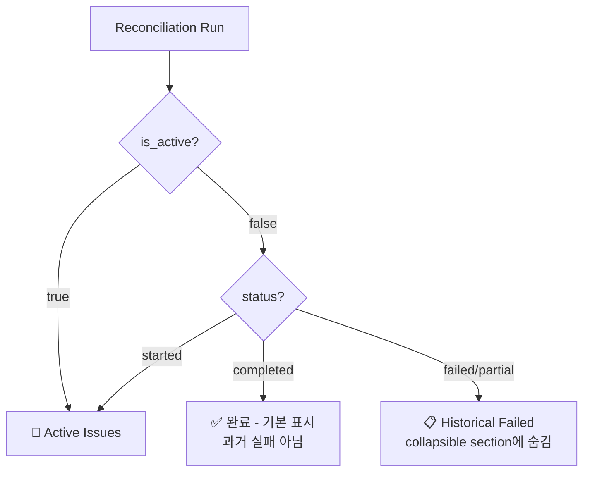
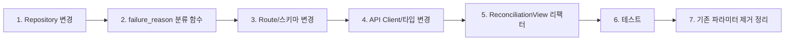

# Historical Failed Reconciliation Run 기본 숨김 + Reason 기반 상세 정책 설계

## 1. 정책 정의

### 1.1 핵심 원칙

| 원칙 | 설명 |
|------|------|
| **기본 화면: Active Issues Only** | `is_active=true`인 run만 기본 노출. 운영자가 즉시 조치해야 할 항목만 보여준다. |
| **Historical Failed: 완전 숨김** | `is_active=false` + `status IN ('failed','partial')` run은 기본 화면에서 보이지 않음. |
| **Collapsible Section** | 하단에 "📋 과거 실패 이력 (N건)" 섹션으로만 접근 가능. 펼치면 reason 기반 상세 테이블 표시. |
| **Reason 기반 분류** | `summary_json.error`를 primary source로 label 분류. linked order/lock 상태를 함께 표시. |
| **시간 기준 제거** | 기존 7일 archive 조건을 폐기하고, 순수하게 `is_active` 상태 기준으로만 필터링. |

### 1.2 상태별 가시성 매트릭스



### 1.3 failure_reason 분류 체계

`summary_json.error`를 primary source로 사용. 백엔드에서 아래 로직으로 label 매핑:

| 우선순위 | 조건 | failure_reason label | 비고 |
|---------|------|---------------------|------|
| 1 | `summary_json.error`에 "broker" 포함 | `"broker 오류: {error}"` | broker adapter/인증 실패 |
| 2 | 연관 lock 존재 (order_blocking_locks) | `"Lock 충돌"` | reconciliation lock이 해제되지 않음 |
| 3 | `summary_json.error` 존재 | `"{error 첫 100자}"` | 일반 오류 (내용 그대로) |
| 4 | linked order 모두 terminal | `"연결 주문 정리 완료 (기록용)"` | 기록만 남은 케이스 |
| 5 | 위 조건 미해당 | `"기타"` | 분류 불가 |

> **참고:** historical failed run은 `is_active=false`이므로 non-terminal order가 존재할 수 없다. 따라서 "미해결 주문 연계" 케이스는 active issue에서만 발생.

---

## 2. API 변경 설계

### 2.1 GET /reconciliation/runs

**현재:**
```python
active_only: bool = Query(False)
include_archived: bool = Query(False)
```

**변경 후:**
```python
include_historical: bool = Query(False, description="If true, include historical failed/partial runs (is_active=false)")
```

| 파라미터 | 기본값 | 효과 |
|---------|--------|------|
| (생략) | - | `active_only=true`와 동일: active run만 반환 |
| `include_historical=true` | - | 모든 run 반환 (active + historical failed + completed) |

> `active_only` 파라미터는 유지 (하위 호환성)하지만 UI에서는 `include_historical`로 대체.

### 2.2 ReconciliationRunSummary 스키마

**현재:**
```python
class ReconciliationRunSummary(BaseModel):
    reconciliation_run_id: str
    account_id: str
    trigger_type: str
    status: str
    started_at: datetime
    completed_at: datetime | None = None
    mismatch_count: int = 0
    is_active: bool = False
```

**변경 후:**
```python
class ReconciliationRunSummary(BaseModel):
    reconciliation_run_id: str
    account_id: str
    trigger_type: str
    status: str
    started_at: datetime
    completed_at: datetime | None = None
    mismatch_count: int = 0
    is_active: bool = False
    failure_reason: str | None = None   # NEW: 분류된 실패 사유 label
    summary_error: str | None = None    # NEW: summary_json.error 원문
    order_count: int = 0                # NEW: linked order 수
```

### 2.3 ReconciliationSummary 스키마

**변경:**
```python
class ReconciliationSummary(BaseModel):
    active_locks_count: int
    incomplete_recon_count: int
    recent_active_locks: list[BlockingLockStatus]
    recent_incomplete_runs: list[ReconciliationRunSummary]
    generated_at: datetime
    active_issue_count: int = 0
    historical_failed_count: int = 0
    # archived_run_count 필드 제거 (시간 기준 폐기)
    recent_active_issues: list[ReconciliationRunSummary] = Field(default_factory=list)
```

> `archived_run_count` 제거. `historical_failed_count`는 유지 (Dashboard 참고용).

### 2.4 GET /reconciliation/summary

**변경:**
```python
async def get_reconciliation_summary(
    include_historical: bool = Query(False, description="If true, include historical failed runs in count"),
    repos: RepositoryContainer = Depends(get_repos),
) -> ReconciliationSummary:
```

- `include_archived` → `include_historical`로 rename
- `archived_run_count` 제거 (더 이상 시간 기준 archive가 없음)
- `historical_failed_count`는 `is_active=false + status IN ('failed','partial')` 기준으로 계산

---

## 3. Backend 변경사항

### 3.1 Repository: list_all_runs_with_activity()

**`src/agent_trading/repositories/postgres/reconciliation.py`**

```python
async def list_all_runs_with_activity(
    self,
    limit: int = 50,
    active_only: bool = True,        # 기본값 True로 변경 (기존 False)
    include_historical: bool = False,  # include_archived → rename
) -> list[dict[str, Any]]:
    """
    Reconciliation run 목록을 order activity 정보와 함께 조회.
    
    active_only=True (기본값): is_active=true인 run만 반환.
    include_historical=True: historical failed/partial run도 포함.
    """
    base_query = """
        SELECT
            r.reconciliation_run_id,
            r.account_id,
            r.trigger_type,
            r.status,
            r.started_at,
            r.completed_at,
            r.mismatch_count,
            r.created_at,
            r.summary_json,  -- NEW: summary_json 포함
            (r.status = 'started') OR (
                r.status IN ('failed', 'partial')
                AND EXISTS (
                    SELECT 1 FROM trading.reconciliation_order_links l
                    JOIN trading.order_requests o
                      ON o.order_request_id = l.order_request_id
                    WHERE l.reconciliation_run_id = r.reconciliation_run_id
                    AND o.status NOT IN ('filled', 'cancelled', 'rejected', 'expired')
                )
            ) AS is_active
        FROM trading.reconciliation_runs r
        ORDER BY r.started_at DESC
        LIMIT $1
    """
    params: list[object] = [limit]
    
    if active_only and not include_historical:
        # 기본: active issue만
        query = f"""
            SELECT * FROM ({base_query}) sub
            WHERE sub.is_active = true
        """
    elif include_historical and not active_only:
        # 모든 run (active + historical + completed)
        query = base_query
    else:
        query = base_query
    
    rows = await self._tx.connection.fetch(query, *params)
    return [dict(row) for row in rows]
```

### 3.2 failure_reason 분류 함수

**`src/agent_trading/api/routes/reconciliation.py`** (신규 유틸 함수)

```python
async def _classify_failure_reason(
    row: dict[str, Any],
    repos: RepositoryContainer,
) -> str | None:
    """summary_json.error + linked order/lock 상태 기반 failure_reason 분류."""
    
    if row["status"] in ("completed", "started"):
        return None
    
    summary_json = row.get("summary_json") or {}
    error = summary_json.get("error") if isinstance(summary_json, dict) else None
    
    if error:
        error_str = str(error)
        # broker 관련 오류
        if "broker" in error_str.lower():
            return f"broker 오류: {error_str[:80]}"
        # 그 외 error는 첫 100자
        return error_str[:100]
    
    # lock 존재 여부 확인
    run_id = row["reconciliation_run_id"]
    locks = await repos.reconciliations.list_all_active_locks_for_run(run_id)  # 신규 메서드
    if locks:
        return "Lock 충돌"
    
    # linked order가 모두 terminal인 경우
    return "연결 주문 정리 완료 (기록용)"
```

### 3.3 lock 조회 메서드 추가

**`src/agent_trading/repositories/postgres/reconciliation.py`** (신규)

```python
async def list_all_active_locks_for_run(
    self, reconciliation_run_id: UUID
) -> Sequence[BlockingLockEntity]:
    """특정 reconciliation run에 의해 생성된 active lock 조회."""
    rows = await self._tx.connection.fetch(
        """
        SELECT lock_id, account_id, strategy_id, symbol, side,
               reason, locked_by_run_id, locked_at, expires_at
        FROM trading.order_blocking_locks
        WHERE locked_by_run_id = $1
          AND expires_at > NOW()
        ORDER BY locked_at DESC
        """,
        reconciliation_run_id,
    )
    return [_row_to_blocking_lock(r) for r in rows]
```

### 3.4 Route: list_reconciliation_runs()

**`src/agent_trading/api/routes/reconciliation.py`**

```python
@router.get("/runs", response_model=list[ReconciliationRunSummary])
async def list_reconciliation_runs(
    account_id: str | None = Query(None),
    limit: int = Query(20, ge=1, le=100),
    active_only: bool = Query(True, description="If true, return only active runs"),
    include_historical: bool = Query(False, description="If true, include historical failed/partial runs"),
    repos: RepositoryContainer = Depends(get_repos),
) -> list[ReconciliationRunSummary]:
    if account_id:
        uid = UUID(account_id)
        runs = await repos.reconciliations.list_runs_by_account(uid, limit=limit)
        # account-scoped는 상태 관계없이 반환 (기존 유지)
        return [...]
    else:
        rows = await repos.reconciliations.list_all_runs_with_activity(
            limit=limit,
            active_only=active_only,
            include_historical=include_historical,
        )
        results = []
        for r in rows:
            summary_json = r.get("summary_json") or {}
            error = summary_json.get("error") if isinstance(summary_json, dict) else None
            
            run_summary = ReconciliationRunSummary(
                reconciliation_run_id=str(r["reconciliation_run_id"]),
                account_id=str(r["account_id"]),
                trigger_type=r["trigger_type"],
                status=r["status"],
                started_at=r["started_at"],
                completed_at=r.get("completed_at"),
                mismatch_count=r.get("mismatch_count", 0),
                is_active=r.get("is_active", False),
                summary_error=str(error) if error else None,
            )
            # historical failed run에만 failure_reason 추가
            if not run_summary.is_active and run_summary.status in ("failed", "partial"):
                run_summary.failure_reason = await _classify_failure_reason(r, repos)
            
            results.append(run_summary)
        
        return results
```

### 3.5 Route: get_reconciliation_summary()

```python
@router.get("/summary", response_model=ReconciliationSummary)
async def get_reconciliation_summary(
    include_historical: bool = Query(False),
    repos: RepositoryContainer = Depends(get_repos),
) -> ReconciliationSummary:
    runs_data = await repos.reconciliations.list_all_runs_with_activity(
        limit=100,
        active_only=False,
        include_historical=include_historical,
    )
    # ... (기존 로직 유지, archived_run_count 계산 제거)
```

---

## 4. Frontend 변경사항

### 4.1 API Client 변경

**`admin_ui/src/api/client.ts`**

```typescript
export async function getReconciliationRuns(
  accountId?: string,
  includeHistorical?: boolean,
): Promise<ReconciliationRunSummary[]> {
  const params = new URLSearchParams();
  if (accountId) params.set("account_id", accountId);
  if (includeHistorical) params.set("include_historical", "true");
  // 기본이 active_only=true 이므로 별도 파라미터 불필요
  const qs = params.toString();
  return request<ReconciliationRunSummary[]>(
    `/reconciliation/runs${qs ? `?${qs}` : ""}`
  );
}

export async function getReconciliationSummary(
  includeHistorical?: boolean,
): Promise<ReconciliationSummary> {
  const params = new URLSearchParams();
  if (includeHistorical) params.set("include_historical", "true");
  const qs = params.toString();
  return request<ReconciliationSummary>(
    `/reconciliation/summary${qs ? `?${qs}` : ""}`
  );
}
```

### 4.2 타입 정의 변경

**`admin_ui/src/types/api.ts`**

```typescript
export interface ReconciliationRunSummary {
  reconciliation_run_id: string;
  account_id: string;
  trigger_type: string;
  status: string;
  started_at: string;
  completed_at: string | null;
  mismatch_count: number;
  isActive: boolean;
  failure_reason?: string | null;   // NEW
  summary_error?: string | null;     // NEW
  order_count?: number;              // NEW
}

export interface ReconciliationSummary {
  active_locks_count: number;
  incomplete_recon_count: number;
  recent_active_locks: BlockingLockStatus[];
  recent_incomplete_runs: ReconciliationRunSummary[];
  generated_at: string;
  activeIssueCount: number;
  historicalFailedCount: number;
  recentActiveIssues: ReconciliationRunSummary[];
  // archivedRunCount 제거
}
```

### 4.3 ReconciliationView UI 구조

```mermaid
flowchart TD
    A[ReconciliationView] --> B[🔴 Active Issues 섹션]
    A --> C[🔒 Active Locks 섹션]
    A --> D[📋 Historical Failed 섹션\ncollapsible]
    A --> E[📋 Reconcile Required 섹션]
    
    B --> B1[Active Run 테이블\nisActive=true만]
    B --> B2[상세 패널\nfailure_reason + summary_error]
    
    D --> D1{펼침?}
    D1 -->|No| D2[배지: M건]
    D1 -->|Yes| D3[Reason 기반 테이블]
    D3 --> D4[status_badge | completed_at\n| failure_reason | linked_orders]
    D3 --> D5[선택 시 상세 패널\nsummary_json.error 전문\norder 목록 + lock 정보]
```

### 4.4 ReconciliationView.tsx 변경 계획

**제거할 요소:**
- `activeOnly` state + toggle 버튼 (더 이상 필요 없음 — 기본이 active only)
- `showArchived` state + toggle 버튼 (time-based archive 폐기)
- `archivedRunCount` state + badge
- `getReconciliationSummary(showArchived)` → `getReconciliationSummary()`로 단순화
- `runStatusFilter` (RUN_STATUSES 필터) — 유지는 하지만 기본값을 active로

**변경할 요소:**
- `loadRuns()`: `getReconciliationRuns(undefined, false)` → 기본적으로 active only
- `filteredRuns` derived data: `activeOnly` 필터 제거, `includeHistorical`로 대체
- `getStatusBadge()`: "📋 과거 이력" → "📋 기록" (historical failed 전용)

**신규 요소:**

#### 4.4.1 Historical Failed Section (collapsible)

```tsx
const [showHistoricalFailed, setShowHistoricalFailed] = useState(false);
const [selectedHistoricalRun, setSelectedHistoricalRun] = useState<ReconciliationRunSummary | null>(null);

// Historical failed runs (별도 API 호출)
const [historicalFailedRuns, setHistoricalFailedRuns] = useState<ReconciliationRunSummary[]>([]);

// Historical runs 로드
useEffect(() => {
  // showHistoricalFailed가 true일 때만 fetch
  if (!showHistoricalFailed) return;
  let cancelled = false;
  (async () => {
    const runs = await getReconciliationRuns(undefined, true);
    if (!cancelled) {
      setHistoricalFailedRuns(runs.filter(r => !r.isActive && r.status !== 'completed'));
    }
  })();
  return () => { cancelled = true; };
}, [showHistoricalFailed]);
```

#### 4.4.2 Historical Failed Columns

```typescript
const historicalColumns: Column<ReconciliationRunSummary>[] = [
  {
    key: "status",
    header: "상태",
    render: (r) => <StatusBadge status={r.status} />,
  },
  {
    key: "completed_at",
    header: "완료 시각",
    render: (r) => r.completed_at ? formatKstDateTime(r.completed_at) : "—",
  },
  {
    key: "failure_reason",
    header: "실패 사유",
    render: (r) => (
      <span className="text-sm text-[#64748b] max-w-[300px] truncate block" title={r.failure_reason ?? ''}>
        {r.failure_reason ?? "—"}
      </span>
    ),
  },
  {
    key: "mismatch_count",
    header: "불일치",
    render: (r) => r.mismatch_count,
  },
  {
    key: "reconciliation_run_id",
    header: "",
    render: (r) => (
      <button
        onClick={() => setSelectedHistoricalRun(
          selectedHistoricalRun?.reconciliation_run_id === r.reconciliation_run_id ? null : r,
        )}
        className="text-xs text-[#3b82f6] hover:text-[#2563eb] font-medium"
      >
        상세 보기
      </button>
    ),
  },
];
```

#### 4.4.3 Historical Detail Panel

```tsx
// Historical run 상세 패널 (기존 run detail panel과 유사, 추가 정보 포함)
{selectedHistoricalRun && (
  <div className="col-span-5 space-y-4">
    <div className="bg-white rounded-xl border border-[#e2e8f0] p-5">
      {/* 기본 정보 */}
      <dl className="space-y-3">
        <div className="flex justify-between">
          <dt className="text-sm text-[#64748b]">Run ID</dt>
          <dd className="text-sm font-mono">{selectedHistoricalRun.reconciliation_run_id}</dd>
        </div>
        <div className="flex justify-between">
          <dt className="text-sm text-[#64748b]">상태</dt>
          <dd><StatusBadge status={selectedHistoricalRun.status} /></dd>
        </div>
        <div className="flex justify-between">
          <dt className="text-sm text-[#64748b]">실패 사유</dt>
          <dd className="text-sm text-[#0f172a] font-medium">{selectedHistoricalRun.failure_reason ?? "—"}</dd>
        </div>
        <div className="flex justify-between">
          <dt className="text-sm text-[#64748b]">완료 시각</dt>
          <dd className="text-sm">{selectedHistoricalRun.completed_at ? formatKstDateTime(selectedHistoricalRun.completed_at) : "—"}</dd>
        </div>
      </dl>
      
      {/* 상세 오류 메시지 */}
      {selectedHistoricalRun.summary_error && (
        <div className="mt-4 pt-4 border-t border-[#e2e8f0]">
          <h4 className="text-xs font-medium text-[#64748b] mb-1">상세 오류 메시지</h4>
          <pre className="text-xs text-[#991b1b] bg-[#fef2f2] p-2 rounded whitespace-pre-wrap">
            {selectedHistoricalRun.summary_error}
          </pre>
        </div>
      )}
      
      {/* 기록용 안내 */}
      <div className="mt-4 pt-4 border-t border-[#e2e8f0] flex items-start gap-2">
        <span className="text-sm text-gray-400">📋</span>
        <span className="text-sm text-gray-400">
          이 run의 연결 주문은 모두 정리되었습니다. 감사 이력으로만 참고하세요.
        </span>
      </div>
    </div>
  </div>
)}
```

#### 4.4.4 UI 레이아웃 구조 (변경 후)

```tsx
return (
  <div className="p-6 space-y-6">
    {/* Page Header */}
    <h1>정합성 점검</h1>
    
    {/* Loading / Error */}
    
    {/* ── 1. Active Issues Section ── */}
    {recentActiveIssues.length > 0 ? (
      <div>
        <h2>⚠️ 조치 필요한 정합성 문제 (N건)</h2>
        <table>...</table>
      </div>
    ) : (
      <div className="bg-green-50 border border-green-200 rounded p-3 mb-4">
        ✅ 현재 해결되지 않은 정합성 문제가 없습니다.
        {historicalFailedCount > 0 && (
          <p>과거 실패 이력 {historicalFailedCount}건은 아래에서 확인할 수 있습니다.</p>
        )}
      </div>
    )}
    
    {/* ── 2. Active Locks Section ── */}
    <div>
      <h2>활성 잠금</h2>
      ...
    </div>
    
    {/* ── 3. Historical Failed Section (collapsible) ── */}
    <div>
      <button onClick={() => setShowHistoricalFailed(!showHistoricalFailed)}>
        {showHistoricalFailed ? '▼' : '▶'} 
        📋 과거 실패 이력 ({historicalFailedCount}건)
      </button>
      
      {showHistoricalFailed && (
        <div>
          <table>
            <thead>
              <tr>
                <th>상태</th>
                <th>완료 시각</th>
                <th>실패 사유</th>
                <th>불일치</th>
                <th></th>
              </tr>
            </thead>
            <tbody>
              {historicalFailedRuns.map(run => (
                <tr key={run.reconciliation_run_id}>
                  <td><StatusBadge status={run.status} /></td>
                  <td>{run.completed_at ? formatKstDateTime(run.completed_at) : "—"}</td>
                  <td title={run.failure_reason ?? ''}>
                    {run.failure_reason ?? "—"}
                  </td>
                  <td>{run.mismatch_count}</td>
                  <td>
                    <button onClick={() => setSelectedHistoricalRun(...)}>
                      상세 보기
                    </button>
                  </td>
                </tr>
              ))}
            </tbody>
          </table>
          
          {/* Historical Run Detail Panel */}
          {selectedHistoricalRun && <HistoricalRunDetailPanel run={selectedHistoricalRun} />}
        </div>
      )}
    </div>
    
    {/* ── 4. Reconcile Required Section ── */}
    <div>
      <h2>조정 필요 주문</h2>
      ...
    </div>
  </div>
);
```

---

## 5. Dashboard/Alerts 영향 분석

### 5.1 Dashboard (OperationsDashboardView.tsx)

**변경 불필요** (현재 구조 그대로 유지):

| 항목 | 현재 | 변경 후 | 영향 |
|------|------|---------|------|
| `reconSummary.historicalFailedCount` | 유지 | 유지 | 없음. Dashboard는 이 값을 StatusCard 참고용으로 사용. |
| `reconSummary.activeIssueCount` | 유지 | 유지 | Alert 트리거용. 변경 없음. |
| `StatusCard` 정합성 메시지 | `🟡 조치 필요 N건` / `✅ 정합성 양호` | 동일 | 불필요. 이미 `activeIssueCount` 기준으로 표시. |
| `archivedRunCount` | Dashboard에서 사용 안 함 | 제거 | 영향 없음. |

### 5.2 Alerts (OperationsAlertsView.tsx)

**변경 불필요:**

| Alert ID | 기준 | 영향 |
|----------|------|------|
| ALT-RECON-001 (`reconcile_required`) | `reconcile_required` order count | 영향 없음 |
| ALT-RECON-002 (`activeIssueCount`) | `reconSummary.activeIssueCount` | 영향 없음 |
| ALT-RECON-003 (기타) | `active_locks_count` 등 | 영향 없음 |

> Historical failed count는 Alert 조건에 사용되지 않으므로, Dashboard StatusCard 메시지에서만 "참고" 수준으로 표시됨.

---

## 6. 테스트 계획

### 6.1 단위 테스트

#### Backend

| 테스트 | 대상 | 검증 내용 |
|--------|------|----------|
| `test_classify_failure_reason_broker_error` | `_classify_failure_reason()` | broker 키워드 포함 시 "broker 오류:" label 반환 |
| `test_classify_failure_reason_generic_error` | `_classify_failure_reason()` | 일반 error message truncate (100자) |
| `test_classify_failure_reason_no_error` | `_classify_failure_reason()` | error 없을 때 None 반환 |
| `test_list_all_runs_with_activity_default_active_only` | `list_all_runs_with_activity()` | 기본 `active_only=True`에서 active run만 반환 |
| `test_list_all_runs_with_historical` | `list_all_runs_with_activity()` | `include_historical=True`에서 historical 포함 |
| `test_list_runs_with_summary_json` | `list_all_runs_with_activity()` | `summary_json` 필드 포함 여부 |
| `test_get_reconciliation_summary_no_archived` | `get_reconciliation_summary()` | `archived_run_count` 제거 확인 |

#### Frontend

| 테스트 | 컴포넌트 | 검증 내용 |
|--------|---------|----------|
| `renders active issues only by default` | ReconciliationView | 기본 로드 시 `include_historical=false` 호출 |
| `shows historical section when expanded` | ReconciliationView | collapsible section 토글 동작 |
| `displays failure_reason in historical table` | ReconciliationView | historical run row에 reason 표시 |
| `shows summary_error in detail panel` | ReconciliationView | 상세 패널에 error 원문 표시 |
| `no archived toggle shown` | ReconciliationView | 기존 `showArchived` 토글 제거 확인 |

### 6.2 통합 테스트

| 시나리오 | 절차 | 기대 결과 |
|---------|------|----------|
| Active issue만 있는 경우 | API 호출 (기본값) | `is_active=true` run만 반환 |
| Historical failed 포함 | `?include_historical=true` | 모든 run 반환 + `failure_reason` 필드 포함 |
| Summary with historical | `GET /reconciliation/summary` | `historicalFailedCount` 정확, `archivedRunCount` 없음 |

### 6.3 마이그레이션 검증

- 기존 DB에 `summary_json.error`가 없는 historical failed run 존재 가능
- → `failure_reason`이 None인 경우 UI에서 "사유 없음"으로 표시
- → 분류 로직에서 lock 존재 여부 확인 후 "Lock 충돌" 또는 "기타"로 fallback

---

## 7. 실행 순서 (Implementation Order)



| 단계 | 파일 | 변경 내용 |
|------|------|----------|
| 1 | `repositories/postgres/reconciliation.py` | `list_all_runs_with_activity()`: `summary_json` 포함, 기본 `active_only=True`, `include_archived`→`include_historical` |
| 2 | `api/routes/reconciliation.py` | `_classify_failure_reason()` 함수 추가 |
| 3 | `api/routes/reconciliation.py` | Route 파라미터 변경 (`include_archived`→`include_historical`), 응답에 `failure_reason`/`summary_error` 추가 |
| 4 | `api/schemas.py` | `ReconciliationRunSummary`에 `failure_reason`, `summary_error` 필드 추가. `ReconciliationSummary`에서 `archived_run_count` 제거 |
| 5 | `api/client.ts` | `getReconciliationRuns()`, `getReconciliationSummary()` 파라미터 변경 |
| 6 | `types/api.ts` | 타입 인터페이스 업데이트 |
| 7 | `ReconciliationView.tsx` | UI 리팩터: active only 기본, collapsible historical 섹션, reason 테이블 |
| 8 | 테스트 파일 | 단위/통합 테스트 업데이트 |

---

## 8. 위험도 및 주의사항

| 리스크 | 설명 | 대응 |
|--------|------|------|
| **기존 `include_archived` 사용처** | 현재 API를 호출하는 다른 코드에서 `include_archived` 사용 가능 | 하위 호환 유지 (파라미터 rename, 기존 파라미터는 Deprecated 처리) |
| **`summary_json.error` 부재** | 오래된 run은 `summary_json`이 null일 수 있음 | 분류 로직에서 None-safe 처리 |
| **lock 조회 성능** | `_classify_failure_reason()`에서 각 run마다 lock 조회 필요 | N+1 쿼리 방지를 위해 batch 조회 고려 (post-optimization) |
| **Dashboard backward compat** | `archivedRunCount` 제거 시 Dashboard에서 참조하는 부분 확인 | Dashboard에서는 이미 사용 안 함 (검증 완료) |
