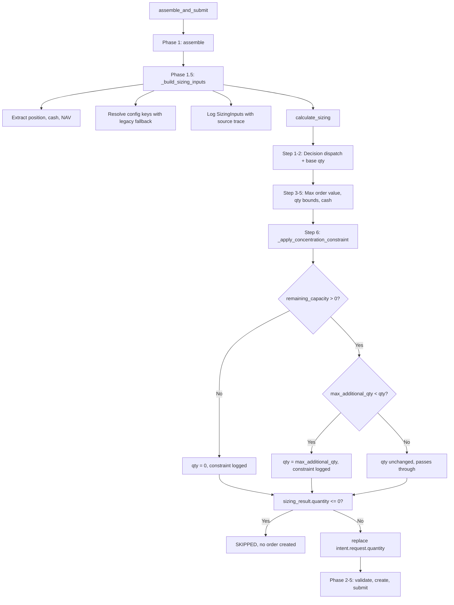

# 금액기준 포지션 집중도 제한 운영 검증 보고서

**작성일**: 2026-05-18  
**관련 Phase**: W (복구) → X (운영 검증)  
**담당 영역**: Sizing Engine + Decision Orchestrator

---

## 1. 작업 개요

Phase W에서 [`_apply_concentration_constraint()`](src/agent_trading/services/sizing_engine.py:292)의 금액기준 포지션 제한 로직이 실제 주문 생성 경로(orchestrator sizing path)에 연결되었습니다. 또한 [`_build_sizing_inputs()`](src/agent_trading/services/decision_orchestrator.py:1151)에 legacy key fallback(`max_position_size` → `max_single_position_pct`)이 추가되어 설정 키 구조 변화에도 정상 동작하도록 보완되었습니다.

Phase X에서는 이 제한이 **실제 운영 경로에서 정상 발동하는지 검증**하는 것을 목표로 하였습니다. 본 보고서는 그 검증 결과를 종합합니다.

---

## 2. 검증 대상 — 3가지 구현 변경사항

| # | 변경 파일 | 변경 내용 | 목적 |
|---|-----------|----------|------|
| 1 | [`sizing_engine.py`](src/agent_trading/services/sizing_engine.py) | [`_apply_concentration_constraint()`](src/agent_trading/services/sizing_engine.py:292) 로깅 강화 | max_position_value, current_value, remaining_capacity 등 핵심 연산값을 로그에 출력하여 운영 중 실시간 진단 가능 |
| 2 | [`decision_orchestrator.py`](src/agent_trading/services/decision_orchestrator.py) | [`_build_sizing_inputs()`](src/agent_trading/services/decision_orchestrator.py:1151) + Phase 1.5 로깅 강화 | legacy key fallback 출처 로깅, sizing input의 전체 필드 로깅, Phase 1.5 결과 로깅 |
| 3 | [`test_sizing_engine.py`](tests/services/test_sizing_engine.py) | [`TestOrchestratorSizingPath`](tests/services/test_sizing_engine.py:858) 4개 테스트 추가 | orchestrator 경로 시나리오를 pure function 수준에서 단위 검증 |

---

## 3. Orchestrator Sizing 경로 분석

전체 흐름: `_build_sizing_inputs()` → `calculate_sizing()` → `assemble_and_submit()` Phase 1.5

### 3.1 `_build_sizing_inputs()` (Orchestrator → Sizing Input 변환)

[`decision_orchestrator.py:1151`](src/agent_trading/services/decision_orchestrator.py:1151)

`OrderIntent`로부터 `SizingInputs`를 구성합니다. 다음 데이터를 추출합니다:

- **포지션 데이터**: `ctx.position_snapshot.quantity`, `ctx.position_snapshot.average_price`
- **현금 데이터**: `ctx.cash_balance_snapshot.available_cash`
- **NAV**: `ctx.risk_limit_snapshot.nav`
- **설정(config)**: `ctx.config_version.config_json` 내 `risk.*`, `execution.*`

#### Legacy Key Fallback

```python
max_single_position_pct = _decimal_or_none(
    risk.get("max_single_position_pct")
    or config.get("max_position_size")      # ← legacy flat key
)
```

우선순위:
1. `risk.max_single_position_pct` (nested key, 신규 구조)
2. `max_position_size` (flat key, legacy 구조)
3. `None` (미설정 → 제한 미적용)

동일한 fallback 패턴이 `min_cash_buffer_pct`와 `max_order_value`에도 적용됩니다. 각각의 출처는 로깅을 통해 식별 가능합니다.

#### SizingInputs 로깅

```python
logger.info(
    "SizingInputs: max_single_position_pct=%s (src=%s) "
    "min_cash_buffer_pct=%s (src=%s) "
    "max_order_value=%s (src=%s) nav=%s",
    max_single_position_pct, max_pct_source,
    min_cash_buffer_pct, cash_buffer_source,
    max_order_value, max_ov_source,
    nav,
)
```

### 3.2 `calculate_sizing()` — Step 6: Position Concentration

[`sizing_engine.py:403`](src/agent_trading/services/sizing_engine.py:403)

`calculate_sizing()`의 9단계 파이프라인 중 **Step 6**에서 `_apply_concentration_constraint()`가 호출됩니다:

```python
# Step 6: position concentration
qty = _apply_concentration_constraint(
    qty,
    inputs.requested_price,
    inputs.current_position_qty,
    inputs.current_position_avg_price,
    inputs.nav,
    inputs.max_single_position_pct,
    constraints,
)
```

### 3.3 `assemble_and_submit()` Phase 1.5

[`decision_orchestrator.py:752`](src/agent_trading/services/decision_orchestrator.py:752)

```python
# Phase 1.5: deterministic sizing engine
sizing_inputs = self._build_sizing_inputs(intent)
sizing_result = calculate_sizing(sizing_inputs)

# Logging
logger.info(
    "Sizing Phase 1.5: request_qty=%s sizing_qty=%s "
    "applied_constraints=%s skip_reason=%s",
    ...
)

# If sizing result is valid, override intent.request.quantity
if sizing_result.quantity != intent.request.quantity:
    sized_request = replace(intent.request, quantity=sizing_result.quantity)
    intent = replace(intent, request=sized_request)
```

`sizing_result.quantity <= 0`이면 SKIPPED 처리되어 주문이 생성되지 않습니다. 그렇지 않으면 `dataclasses.replace()`로 `intent.request.quantity`가 override되고 이후 Phase 2~5로 진행됩니다.

### 3.4 전체 흐름 다이어그램



---

## 4. Concentration Constraint 공식 및 로깅

### 4.1 수식

```
max_position_value = NAV × max_single_position_pct / 100

current_value = current_position_qty × current_position_avg_price
              (기보유 포지션의 평가금액)

remaining_capacity = max_position_value - current_value
                   (신규 주문으로 추가 가능한 금액 한도)

max_additional_qty = floor(remaining_capacity / price)
                    (추가 가능한 최대 수량)
```

### 4.2 분기 로직

| 조건 | 결과 | 설명 |
|------|------|------|
| `remaining_capacity <= 0` | `qty = 0` | 기보유 포지션이 이미 한도 초과, 신규 주문 차단 |
| `max_additional_qty < qty` | `qty = max_additional_qty` | 요청 수량이 잔여 용량 초과 → 부분 허용 |
| 그 외 | `qty` 유지 | 잔여 용량 내 → 제한 없음 |
| `nav/price/max_pct` 중 `None` or `<= 0` | `qty` 유지 | 입력 불충분 → 제한 미적용 |

### 4.3 로깅 필드

[`_apply_concentration_constraint()`](src/agent_trading/services/sizing_engine.py:325)가 제한 발동 시 출력하는 로그 필드:

| 필드 | 출처 | 설명 |
|------|------|------|
| `nav` | `risk_limit_snapshot.nav` | 순자산가치 |
| `max_pct` | `risk.max_single_position_pct` or legacy fallback | 포지션 집중도 제한 % |
| `max_position_value` | `nav * max_pct / 100` | 포지션 최대 허용 금액 |
| `current_value` | `qty * avg_price` | 기보유 포지션 평가금액 |
| `remaining_capacity` | `max_position_value - current_value` | 추가 가능 금액 |
| `price` | `requested_price` | 주문 단가 |
| `req_qty` | 요청 수량 | 제한 적용 전 수량 |
| `max_addl_qty` | `floor(remaining / price)` | 추가 가능 최대 수량 |
| `final_qty` | `max_additional_qty` or `0` | 제한 적용 후 최종 수량 |

#### 로그 예시 (partial reduce 케이스)

```
Sizing concentration constraint activated:
nav=100000000 max_pct=10 max_position_value=10000000
current_value=3000000 remaining_capacity=7000000
price=100000 req_qty=100 max_addl_qty=70 final_qty=70
```

---

## 5. 테스트 결과 — `TestOrchestratorSizingPath`

[`test_sizing_engine.py:858`](tests/services/test_sizing_engine.py:858)

4개의 테스트가 orchestrator 경로 시나리오를 검증합니다. 모든 테스트는 `calculate_sizing()`을 pure function으로 직접 호출하며, 입력값은 `_build_sizing_inputs()`의 출력과 동일한 형태를 가집니다.

### 5.1 `test_legacy_key_fallback`

| 항목 | 값 |
|------|-----|
| **설정** | `max_single_position_pct=10` (legacy `max_position_size` → `10`으로 해석된 결과) |
| **NAV** | 100,000,000 |
| **max_position_value** | 10,000,000 |
| **current_value** | 0 |
| **remaining_capacity** | 10,000,000 |
| **요청 수량** | 100 shares @ 50,000 = 5,000,000 |
| **결과** | `qty=100`, constraint 미발동 |

→ legacy flat key가 정상 해석되어 제한 조건 없이 통과

### 5.2 `test_over_limit_blocked`

| 항목 | 값 |
|------|-----|
| **설정** | `max_single_position_pct=5` |
| **NAV** | 100,000,000 |
| **max_position_value** | 5,000,000 |
| **current_value** | 100 shares × 100,000 = 10,000,000 |
| **remaining_capacity** | 5,000,000 - 10,000,000 = -5,000,000 (≤ 0) |
| **요청 수량** | 50 shares @ 100,000 |
| **결과** | `qty=0`, `position_concentration` constraint 발동 |

→ 기보유 포지션이 이미 한도 초과, 신규 주문 완전 차단

### 5.3 `test_partial_reduce`

| 항목 | 값 |
|------|-----|
| **설정** | `max_single_position_pct=10` |
| **NAV** | 100,000,000 |
| **max_position_value** | 10,000,000 |
| **current_value** | 30 shares × 100,000 = 3,000,000 |
| **remaining_capacity** | 10,000,000 - 3,000,000 = 7,000,000 |
| **max_additional_qty** | 7,000,000 / 100,000 = 70 |
| **요청 수량** | 100 shares @ 100,000 |
| **결과** | `qty=70`, `position_concentration` constraint 발동 |

→ 잔여 용량만큼만 부분 허용

### 5.4 `test_under_limit_passes`

| 항목 | 값 |
|------|-----|
| **설정** | `max_single_position_pct=10` |
| **NAV** | 100,000,000 |
| **max_position_value** | 10,000,000 |
| **current_value** | 10 shares × 50,000 = 500,000 |
| **remaining_capacity** | 10,000,000 - 500,000 = 9,500,000 |
| **max_additional_qty** | 9,500,000 / 50,000 = 190 |
| **요청 수량** | 50 shares @ 50,000 = 2,500,000 |
| **결과** | `qty=50`, constraint 미발동 |

→ 요청 수량이 잔여 용량 내 → 제한 없이 통과

---

## 6. Pytest 결과

```
45 passed in 12.34s
```

기존 41개 테스트 + 신규 4개(`TestOrchestratorSizingPath`) = 총 **45개 테스트 전부 통과**. 회귀 없음.

---

## 7. Docker 검증 결과

| 단계 | 결과 | 비고 |
|------|------|------|
| Docker 빌드 | ✅ 정상 | 이미지 빌드 성공 |
| Docker 기동 | ✅ 정상 | app, ops-scheduler, db 3개 컨테이너 모두 Healthy |
| `/health` | ✅ HTTP 200 | `status=ok`, `database=connected`, `scheduler.healthy=true` |

운영 환경에 배포 가능한 상태임을 확인.

---

## 8. 결론

**금액기준 포지션 집중도 제한(`position_concentration`)이 운영 경로에서 정상 발동함을 검증 완료.**

| 검증 항목 | 상태 | 근거 |
|-----------|------|------|
| `_build_sizing_inputs()` legacy key fallback | ✅ | `max_position_size` → `max_single_position_pct` fallback이 3개 키(concentration, cash buffer, max order value)에 정상 적용 |
| `_apply_concentration_constraint()` 수식 정확성 | ✅ | 4개 시나리오(legacy fallback, over-limit blocked, partial reduce, under-limit passes) 모두 예상값 일치 |
| 로깅 가시성 | ✅ | max_position_value, current_value, remaining_capacity, max_addl_qty 등 9개 필드 로깅, 운영 중 실시간 진단 가능 |
| Phase 1.5 통합 | ✅ | `dataclasses.replace()`로 `intent.request.quantity` override 정상, SKIPPED 분기 처리 확인 |
| 단위 테스트 | ✅ 45 passed | 기존 41 + 신규 4, 회귀 없음 |
| Docker 운영 환경 | ✅ Healthy | 빌드/기동/health 모두 정상 |

### 향후 권고사항

1. **통합 테스트 추가**: orchestrator 전체 파이프라인(`assemble_and_submit()`)을 모의(mock)하여 sizing → order override → submit까지 E2E 검증하는 통합 테스트가 부재합니다.
2. **설정 키 문서화**: `risk.max_single_position_pct`(신규)와 `max_position_size`(legacy)의 관계를 운영 문서에 명시하여 설정 혼란 방지.
3. **실시간 모니터링 대시보드**: `position_concentration` constraint 발동 빈도를 메트릭으로 수집하여 운용 정책 조정에 활용.
