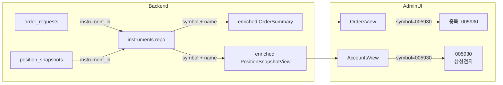

# Position-Order Lineage Visibility 개선 — 실행 계획

## 목적

Admin UI에서 포지션과 주문이 사람 눈에 연결되도록 API/UI 가시성을 개선한다.
데이터 모델 변경 없이 **additive change**만으로 처리한다.

---

## 변경 파일 목록 (총 6개)

| # | 파일 | 변경 유형 | 설명 |
|---|------|----------|------|
| 1 | `src/agent_trading/api/routes/orders.py` | 수정 | `_order_to_summary()` → async enrich로 symbol 채움 |
| 2 | `src/agent_trading/api/schemas.py` | 수정 | `PositionSnapshotView`에 `symbol`, `instrument_name` 필드 추가 |
| 3 | `src/agent_trading/api/routes/positions.py` | 수정 | `list_positions()` enrich 로직 추가 |
| 4 | `admin_ui/src/types/api.ts` | 수정 | `PositionSnapshotView` TS 타입에 `symbol`, `instrument_name` 추가 |
| 5 | `admin_ui/src/components/AccountsView.tsx` | 수정 | 포지션 `종목` 컬럼을 UUID → symbol/name으로 변경 |
| 6 | `tests/api/test_inspection.py` | 수정 | 기존 테스트에 symbol/name assertion 추가 |

---

## Step 1: Orders API — symbol enrich (orders.py)

### 현재 문제
```python
def _order_to_summary(order: object) -> OrderSummary:
    return OrderSummary(
        ...
        symbol=None,  # resolves from instrument_id (skipped for now)
        ...
    )
```

sync 함수라 `repos`에 접근 불가 → 항상 `symbol=None`.

### 해결 방법

기존 `_order_to_summary()`는 **보존** (sync pure 변환).  
새로운 async 함수 `_enrich_orders(orders, repos)`를 추가하여 `list_orders()`에서 호출.

```python
async def _enrich_orders(
    orders: Sequence[object],
    repos: RepositoryContainer,
) -> list[OrderSummary]:
    """Convert orders to summaries and enrich with symbol from instruments repo."""
    summaries = [_order_to_summary(o) for o in orders]
    for s in summaries:
        # instrument_id는 OrderDetail에만 있음 → order entity에서 직접 조회 필요
        pass  # 실제 구현은 아래 참조
```

**구현 상세**:
- `list_orders()`에서 `repos`를 이미 가지고 있음 (`Depends(get_repos)`)
- `_order_to_summary()` 호출 후, 각 order의 `instrument_id`로 `repos.instruments.get()` 호출
- 결과에서 `symbol`을 `OrderSummary.symbol`에 설정

**문제점**: `_order_to_summary()`는 `order` entity의 `instrument_id`를 사용하지 않음 (`OrderSummary`에 `instrument_id` 필드 없음).  
→ `OrderSummary`에 `instrument_id`를 추가하지 않고, enrich 과정에서 order entity 자체를 통째로 전달받아야 함.

**더 나은 접근**: 기존 `_order_to_summary()`는 유지하고, `list_orders()`에서 enrich하는 별도 async 함수 사용:

```python
async def _enrich_order_summary(
    order: object,
    repos: RepositoryContainer,
) -> OrderSummary:
    summary = _order_to_summary(order)
    instrument_id = getattr(order, 'instrument_id', None)
    if instrument_id is not None:
        inst = await repos.instruments.get(instrument_id)
        if inst is not None:
            summary.symbol = inst.symbol
    return summary
```

그리고 `list_orders()`에서:
```python
orders = await repos.orders.list(query)
return [await _enrich_order_summary(o, repos) for o in orders]
```

**N+1 주의**: orders가 많을 경우 각각 `repos.instruments.get()`을 호출하게 됨.  
현재 `limit=100`이므로 최대 100번의 lookup. In-memory fixture 테스트에서는 문제 없음.  
Postgres에서도 단일 PK lookup이라 부하 미미.  

### OrderDetail에도 반영
- `_order_to_detail()`은 `_order_to_summary()`를 호출하므로 자동으로 symbol이 채워짐

---

## Step 2: PositionSnapshotView — symbol/instrument_name 필드 추가 (schemas.py)

```python
class PositionSnapshotView(BaseModel):
    """``GET /positions`` — point-in-time position snapshot."""
    ...
    # ── New additive fields ──
    symbol: str | None = None
    """Ticker symbol resolved from instrument_id (e.g. ``005930``)."""
    
    instrument_name: str | None = None
    """Human-readable instrument name (e.g. ``삼성전자``)."""
```

**변경 사항**: 기존 필드는 그대로, 새로운 optional 필드 2개만 추가.

---

## Step 3: Positions API — list_positions() enrich (positions.py)

```python
@router.get("/positions", response_model=list[PositionSnapshotView])
async def list_positions(
    account_id: str = Query(...),
    repos: RepositoryContainer = Depends(get_repos),
) -> list[PositionSnapshotView]:
    ...
    snapshots = await repos.position_snapshots.list_latest_by_account(aid)
    
    result = []
    for s in snapshots:
        view = PositionSnapshotView.model_validate(s)
        inst = await repos.instruments.get(s.instrument_id)
        if inst is not None:
            view.symbol = inst.symbol
            view.instrument_name = inst.name
        result.append(view)
    
    return result
```

**변경 사항**: `model_validate()` 후 instrument lookup → symbol/name 설정.

---

## Step 4: Admin UI 타입 업데이트 (api.ts)

```typescript
export interface PositionSnapshotView {
  position_snapshot_id: string;
  account_id: string;
  instrument_id: string;
  quantity: number;
  average_price: number;
  market_price: number;
  unrealized_pnl: number | null;
  source_of_truth: string;
  snapshot_at: string;
  // ── New additive fields ──
  symbol: string | null;
  instrument_name: string | null;
}
```

---

## Step 5: AccountsView — positionColumns symbol 표시 (AccountsView.tsx)

### 현재
```tsx
{
  key: "instrument_id",
  header: "종목",
  render: (r) => (
    <span title={r.instrument_id} className="text-xs font-mono">
      {truncateUuid(r.instrument_id)}
    </span>
  ),
},
```

### 변경 후
```tsx
{
  key: "symbol",
  header: "종목",
  render: (r) => (
    <div>
      <div className="text-sm font-medium text-[#0f172a]">
        {r.symbol ?? truncateUuid(r.instrument_id)}
      </div>
      {r.instrument_name && (
        <div className="text-xs text-[#64748b]">{r.instrument_name}</div>
      )}
    </div>
  ),
},
```

**변경 사항**:
- 1행: symbol (예: `005930`)
- 2행: instrument_name (예: `삼성전자`)
- fallback: symbol/name 모두 없으면 truncated UUID 유지

---

## Step 6: 테스트 업데이트 (test_inspection.py)

### test_list_orders
```python
def test_list_orders(self, client: TestClient) -> None:
    ...
    first = data[0]
    assert first["side"] == "buy"
    assert first["symbol"] is not None  # NEW: symbol should be enriched
    assert first["symbol"] == "005930"  # Expected from seed data
```

### test_list_positions
```python
def test_list_positions(self, client: TestClient) -> None:
    ...
    pos = data[0]
    assert pos["account_id"] == known_acct_id
    assert pos["symbol"] is not None       # NEW
    assert pos["instrument_name"] is not None  # NEW
    assert pos["quantity"] == 100.0
```

---

## 남은 리스크 1개

### N+1 query — orders 목록에서 instrument lookup

`list_orders()`에서 각 order마다 `repos.instruments.get()`을 호출하면 N+1 발생.

- 현재: `limit=100`이므로 최대 100회 lookup
- Postgres PK lookup은 매우 빠름 (< 1ms)
- In-memory fixture 테스트에서는 dict lookup이므로 영향 없음
- 향후 orders 목록이 1000+가 될 경우 batch lookup(`get_by_ids()`) 도입 고려

**완화**: 현재 limit이 100이므로 허용. 별도 최적화 불필요.

---

## 다음 직접 액션 1개

### Code 모드 전환 후 위 6개 파일 순차 수정

1. `schemas.py` — 필드 추가 (가장 먼저, 의존성 없음)
2. `orders.py` — async enrich helper 추가
3. `positions.py` — enrich 로직 추가
4. `api.ts` — TS 타입 추가
5. `AccountsView.tsx` — 컬럼 렌더링 변경
6. `test_inspection.py` — assertion 추가

---

## 다이어그램: 데이터 흐름



---

*생성: 2026-05-13 14:00 KST | 승인 후 Code 모드 전환*
