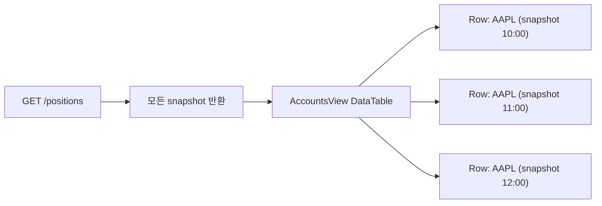
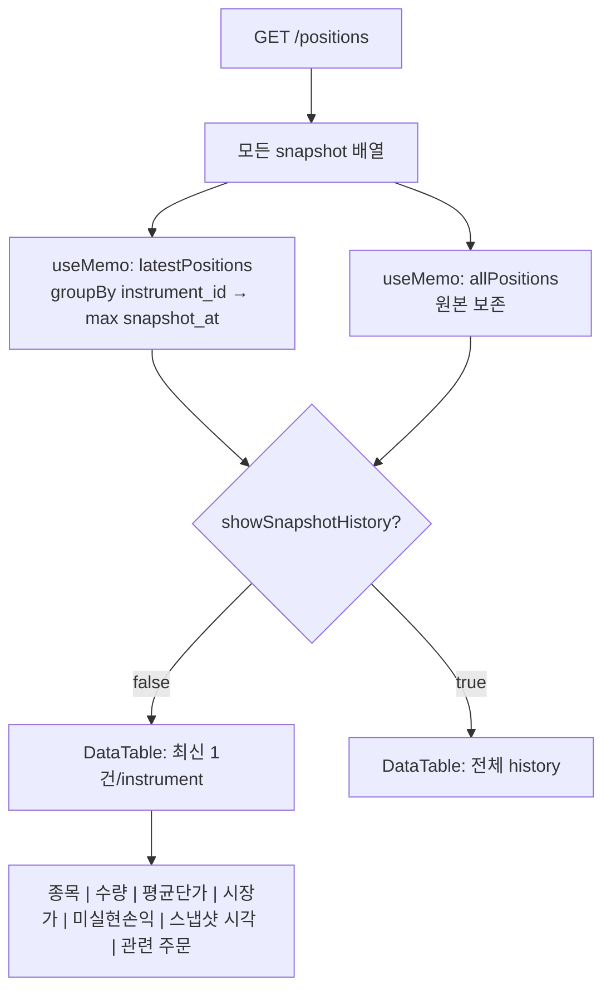
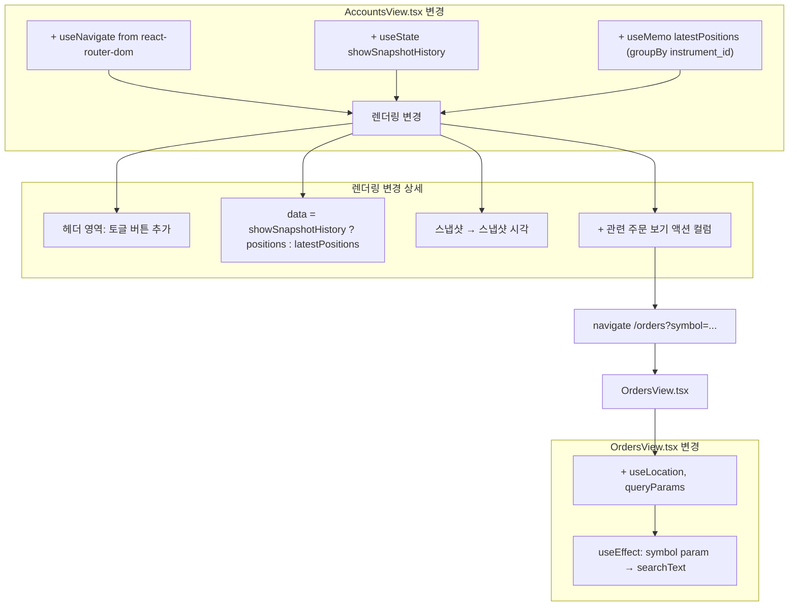

# Accounts 포지션 화면 Snapshot History 혼동 해소 — 구현 계획

## 목적

Accounts 화면에서 동일 `instrument_id`에 대해 여러 snapshot이 개별 행으로 표시되어
하나의 포지션이 여러 개 존재하는 것처럼 보이는 UX 혼동을 해소한다.

---

## 문제 정의

### 현재 상태



- `/positions` API는 동일 `instrument_id`에 대해 여러 시점의 snapshot을 모두 반환
- `AccountsView.tsx`는 이를 그대로 DataTable에 전달하여 각 snapshot이 개별 행으로 렌더링
- 운영자가 동일 종목이 여러 번 표시되어 혼동함

### 근본 원인

- 포지션 데이터는 snapshot 기반으로, sync loop가 실행될 때마다 새 snapshot이 추가됨
- 백엔드에서 의도적으로 `list_latest_by_account`를 사용하지 않고 모든 snapshot 반환
- UI에서 전혀 가공하지 않고 snapshot 전체를 그대로 테이블에 출력

---

## 해결 방안

### 설계 원칙

1. **백엔드 변경 없음** — `/positions` API는 그대로 두고 프런트에서만 처리
2. **기존 데이터 보존** — snapshot history는 숨기지 않고 보조 view로 유지
3. **최소 변경** — `AccountsView.tsx`만 수정 (OrdersView.tsx는 drill-down용 symbol 파라미터만 추가)
4. **점진적 개선** — v1은 frontend dedup, 추후 필요시 백엔드 전환 가능

### 데이터 흐름 (After)



---

## 상세 구현

### Goal 1: instrument별 최신 snapshot 1건만 표시 (기본)

`AccountsView.tsx`에 다음 `useMemo` 추가:

```typescript
// ── Snapshot dedup: instrument별 최신 snapshot 1건 ──
const latestPositions = useMemo(() => {
  const map = new Map<string, PositionSnapshotView>();
  for (const pos of positions) {
    const existing = map.get(pos.instrument_id);
    if (!existing || pos.snapshot_at > existing.snapshot_at) {
      map.set(pos.instrument_id, pos);
    }
  }
  return Array.from(map.values());
}, [positions]);
```

- **groupBy key**: `instrument_id` (UUID, 절대 중복 없음)
- **최신 기준**: `snapshot_at` (ISO 8601 string, lexicographic compare 가능)
- **반환형**: `PositionSnapshotView[]` (기존 DataTable과 동일한 타입, interface 변경 불필요)

### Goal 2: "스냅샷 이력 보기" 토글

```typescript
const [showSnapshotHistory, setShowSnapshotHistory] = useState(false);
```

UI 위치: 포지션 테이블 헤더 영역 (line 595-612, `"브로커 스냅샷 — 포지션"` 우측)

```tsx
<div className="flex items-center justify-between">
  <h4 className="text-sm font-medium text-[#0f172a]">
    브로커 스냅샷 — 포지션
  </h4>
  <div className="flex items-center gap-3">
    {positions.length > latestPositions.length && (
      <button
        onClick={() => setShowSnapshotHistory((v) => !v)}
        className="text-xs text-[#3b82f6] hover:text-[#2563eb] font-medium transition-colors"
      >
        {showSnapshotHistory ? "최신 포지션만 보기" : `스냅샷 이력 보기 ${positions.length}건`}
      </button>
    )}
    {positions.length > 0 && (
      <span className="text-xs text-[#94a3b8]">
        스냅샷: {formatSnapshotTime(positions[0].snapshot_at)}
      </span>
    )}
  </div>
</div>
```

- 토글은 `positions.length > latestPositions.length` (즉, history가 존재할 때)만 표시
- 기본값: `false` (최신 포지션만 표시)
- 토글 ON: `data={positions}` (전체 history)
- 토글 OFF: `data={latestPositions}` (dedup된 최신)

### Goal 3: 포지션 시각 라벨링

`"스냅샷"` 컬럼 헤더를 `"스냅샷 시각"`으로 변경 (line 291)

```typescript
{ key: "snapshot_at", header: "스냅샷 시각" },
```

- 주문 화면(`OrdersView.tsx`)의 `"생성일"` 헤더와 구분되어 각각의 의미가 명확해짐
- `formatSnapshotTime` 함수는 이미 시각 + 경과시간을 표시하므로 내용 변경 불필요

### Goal 4: "관련 주문 보기" drill-down

#### 4a. AccountsView에 액션 컬럼 추가

```typescript
{
  key: "actions",
  header: "",
  render: (r) => (
    <button
      onClick={(e) => {
        e.stopPropagation();
        navigate(`/orders?symbol=${encodeURIComponent(r.symbol ?? "")}`);
      }}
      className="text-xs text-[#3b82f6] hover:text-[#2563eb] font-medium transition-colors"
    >
      관련 주문 보기 →
    </button>
  ),
},
```

- 컬럼 헤더는 공백 (아이콘 + 텍스트로 충분)
- `stopPropagation`으로 행 선택 이벤트와 충돌 방지
- `navigate`는 `useNavigate()` 훅 사용 (react-router-dom)

#### 4b. OrdersView에 symbol query param 지원

`OrdersView.tsx`에서 URL query param `symbol`을 읽어 `searchText` 초기값 설정:

```typescript
// ── Read initial symbol from URL query params ──
const location = useLocation();
const queryParams = useMemo(() => new URLSearchParams(location.search), [location.search]);

// On mount, if symbol param exists, set searchText
useEffect(() => {
  const symbolParam = queryParams.get("symbol");
  if (symbolParam) {
    setSearchText(symbolParam);
  }
}, []); // empty deps = mount only
```

- `useLocation()` 필요 (react-router-dom에서 import)
- URL: `#/orders?symbol=005930` 형태로 접근
- OrdersView의 기존 `searchText` 상태와 연결되어 필터 자동 적용

---

## 변경 파일 목록

| 파일 | 변경 유형 | 설명 |
|------|-----------|------|
| `admin_ui/src/components/AccountsView.tsx` | 수정 | dedup 로직, 토글, 라벨링, drill-down |
| `admin_ui/src/components/OrdersView.tsx` | 수정 | URL query param `symbol` 지원 |
| `admin_ui/src/__tests__/accounts.test.tsx` | 수정 | dedup/토글 테스트 케이스 추가 |

**변경 없음**:
- `src/agent_trading/api/schemas.py` — 백엔드 변경 불필요
- `src/agent_trading/api/routes/positions.py` — 변경 불필요
- `admin_ui/src/types/api.ts` — 타입 변경 불필요
- `admin_ui/src/api/client.ts` — API 함수 변경 불필요
- `admin_ui/src/__tests__/test-utils/fixtures.ts` — fixture 변경 불필요

---

## 테스트 계획

### accounts.test.tsx — 기존 테스트 수정

현재 `mockPositions`는 1건만 존재하여 dedup 테스트에 부적합.
다음 변경 필요:

1. `"스냅샷"` → `"스냅샷 시각"` 참조 업데이트 (screen.getByText 등)
2. 스냅샷 시각 라벨 확인 (formatSnapshotTime 출력)

### accounts.test.tsx — 신규 테스트 케이스

**테스트 1: "shows only latest snapshot per instrument by default"**

```typescript
it("shows only latest snapshot per instrument by default", async () => {
  const multiSnapshots = [
    { /* instrument_id: i1, snapshot_at: 10:00 */ },
    { /* instrument_id: i1, snapshot_at: 11:00 (latest) */ },
    { /* instrument_id: i2, snapshot_at: 10:00 */ },
  ];
  vi.spyOn(api, "getPositions").mockResolvedValue(multiSnapshots);
  render(<AccountsView />);
  // ... click account
  // expect 2 rows (i1 latest + i2)
  // expect latest snapshot_at for i1
});
```

**테스트 2: "shows toggle button when snapshot history exists"**

```typescript
it("shows toggle button when snapshot history exists", async () => {
  const multiSnapshots = [
    { /* instrument_id: i1, snapshot_at: 10:00 */ },
    { /* instrument_id: i1, snapshot_at: 11:00 */ },
  ];
  vi.spyOn(api, "getPositions").mockResolvedValue(multiSnapshots);
  render(<AccountsView />);
  // expect "스냅샷 이력 보기 2건" button visible
});
```

**테스트 3: "toggle shows all snapshots when activated"**

```typescript
it("toggle shows all snapshots when activated", async () => {
  // click toggle
  // expect all snapshots visible
});
```

**테스트 4: "hides toggle when no history exists"**

```typescript
it("hides toggle when no history exists", async () => {
  // single snapshot per instrument
  // expect no toggle button
});
```

---

## Mermaid: 컴포넌트 변경 다이어그램



---

## 실행 순서

| 단계 | 설명 | 파일 |
|------|------|------|
| 1 | `AccountsView.tsx`에 `showSnapshotHistory` state + `latestPositions` useMemo 추가 | `AccountsView.tsx` |
| 2 | 토글 버튼 UI 구현 (positions 헤더 영역) | `AccountsView.tsx` |
| 3 | `"스냅샷"` → `"스냅샷 시각"` 컬럼 헤더 변경 | `AccountsView.tsx` |
| 4 | "관련 주문 보기" 액션 컬럼 + `useNavigate` 추가 | `AccountsView.tsx` |
| 5 | `OrdersView.tsx`에 `symbol` query param 지원 추가 | `OrdersView.tsx` |
| 6 | `accounts.test.tsx` 업데이트 (컬럼명 + dedup/토글 테스트) | `accounts.test.tsx` |
| 7 | `npm run build` 확인 | — |
| 8 | `npm test` 실행 | — |

---

## 제약 조건 점검

| 조건 | 상태 | 근거 |
|------|------|------|
| `.env` 계열 파일 수정 금지 | ✅ 해당 없음 | 프런트 전용 변경 |
| KIS_ENV=paper를 live로 취급 | ✅ 영향 없음 | 백엔드 변경 없음 |
| broker submit semantics 변경 금지 | ✅ 해당 없음 |
| production 코드 변경 최소 범위 | ✅ 2개 파일만 수정 |
| snapshot history 숨기지 않음 | ✅ 보조 view로 보존 |

---

## 롤백 계획

문제 발생 시 다음 순서로 롤백:

1. `git checkout -- admin_ui/src/components/AccountsView.tsx`
2. `git checkout -- admin_ui/src/components/OrdersView.tsx`
3. `git checkout -- admin_ui/src/__tests__/accounts.test.tsx`
4. `npm run build && npm test`

모든 변경은 프런트 전용이므로 API/백엔드 영향 없음.
