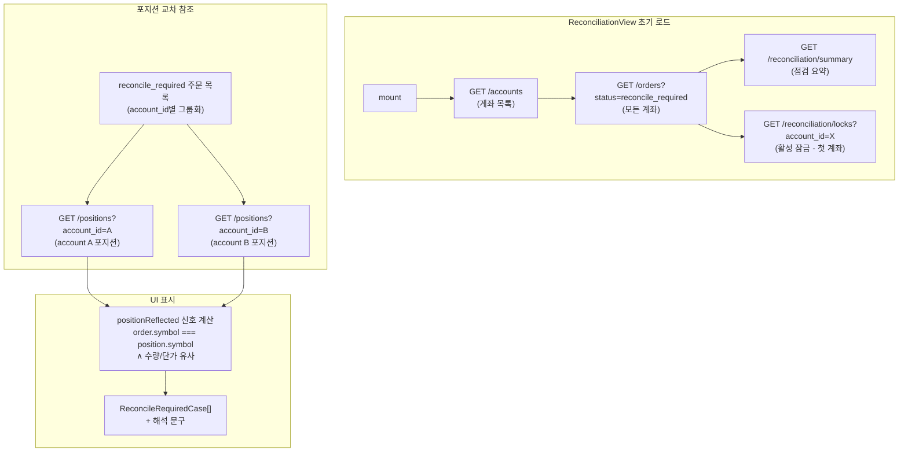
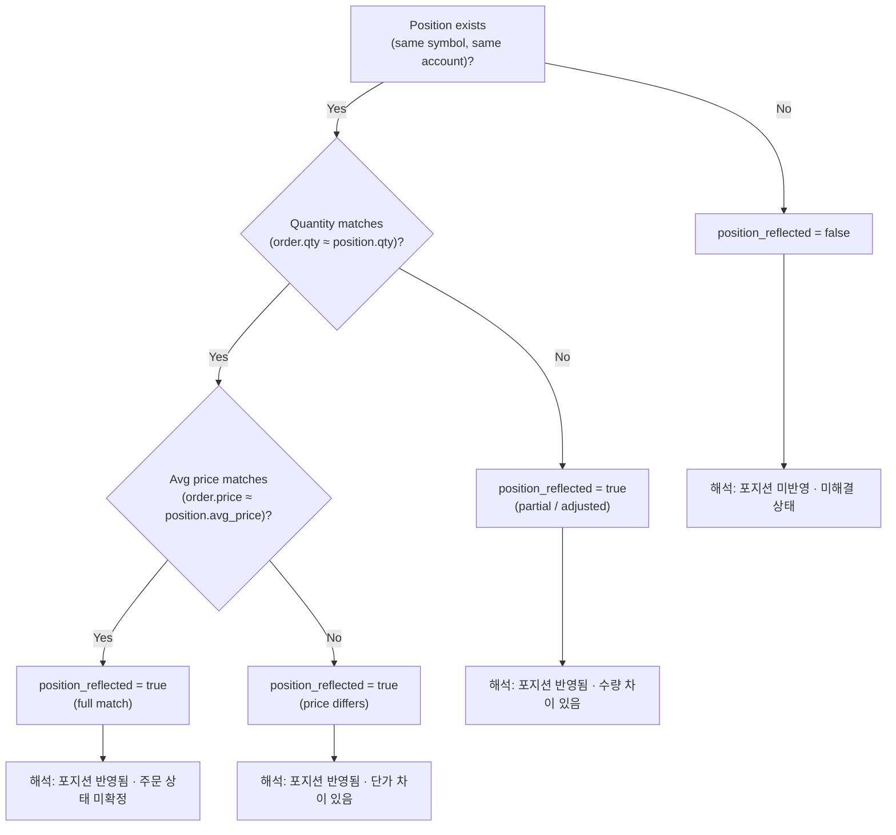
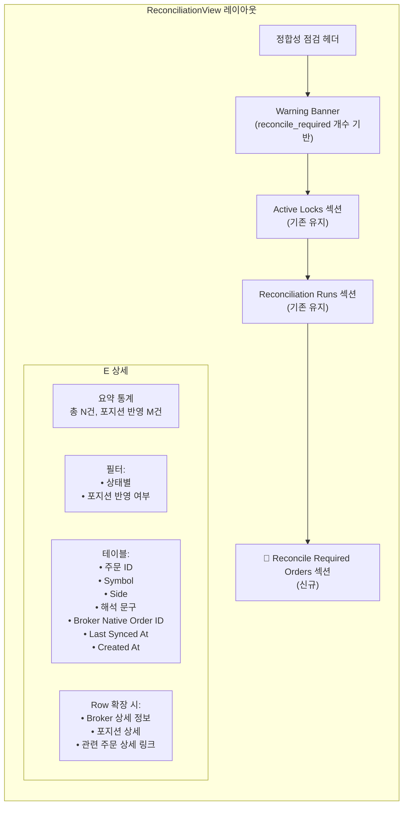
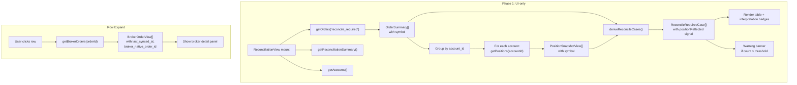
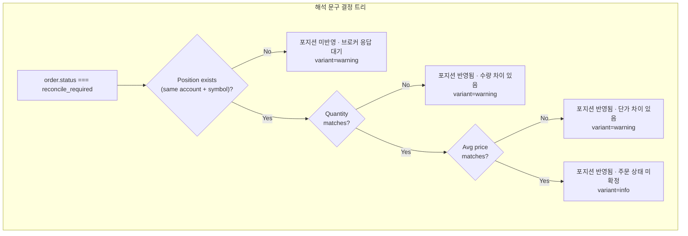

# `reconcile_required` 정합성 점검 화면 보강 — 설계 문서

> **리뷰 상태**: ✅ 승인 완료 (2026-05-13)
> **리뷰 피드백 반영**:
> - `deriveReconcileRequiredCases()`를 pure helper 함수로 분리
> - `getBrokerOrders(orderId)`는 병렬 `Promise.all()` 호출
> - 주문 수 제한: 최근 N건 (기본 100건, limit 파라미터로 조정)
> - position matching: `account_id + instrument_id` 우선, `symbol` fallback
> - 단가 비교: tolerance `<= 1 KRW` (exact equality 지양)
> - 수량 비교: `position.quantity >= order.requested_quantity` 별도 판단 가능, 단 문구는 "반영됨" 수준 유지
> - `success` variant 사용 금지 (broker-confirmed fill 오해 방지)
> - Summary card: `reconcile_required` 개수 + `positionReflected=true` 개수 표시

> **이전 설계** (단순 라벨 개선) → **범위 확장**: Reconciliation 화면에서 `reconcile_required` + 포지션 반영 케이스 운영 가시성 강화

## 목차

1. [현황 분석](#1-현황-분석)
2. [문제 정의](#2-문제-정의)
3. [제약 조건](#3-제약-조건)
4. [접근법 평가: UI-only vs API additive](#4-접근법-평가-ui-only-vs-api-additive)
5. [Phase 1 설계 — UI-only](#5-phase-1-설계--ui-only)
6. [변경 파일 목록](#6-변경-파일-목록)
7. [변경 상세](#7-변경-상세)
8. [테스트 계획](#8-테스트-계획)
9. [리스크](#9-리스크)
10. [Mermaid: 데이터 흐름](#10-mermaid-데이터-흐름)

---

## 1. 현황 분석

### 1.1 데이터 가용성

| 데이터 | API 엔드포인트 | 필터 가능 | Symbol 해석 | 비고 |
|--------|---------------|-----------|-------------|------|
| `reconcile_required` 주문 목록 | [`GET /orders?status=reconcile_required`](src/agent_trading/api/routes/orders.py:88) | ✅ `status` | ✅ `_enrich_order_summary`에서 해석됨 | account_id optional |
| 계좌 목록 | [`GET /accounts`](admin_ui/src/api/client.ts:158) | ❌ | N/A | account_id 확보용 |
| 포지션 스냅샷 | [`GET /positions?account_id=X`](src/agent_trading/api/routes/positions.py:18) | account_id 필수 | ✅ `symbol`, `instrument_name` 모두 해석됨 | |
| 브로커 주문 | [`GET /orders/{id}/broker-orders`](src/agent_trading/api/routes/orders.py:166) | order_request_id | N/A | `broker_status`, `broker_native_order_id`, `last_synced_at` 있음 |

### 1.2 현재 ReconciliationView 상태

[`ReconciliationView.tsx`](admin_ui/src/components/ReconciliationView.tsx)는 현재 **데이터를 전혀 로드하지 않음**:

```typescript
// line 40-50 — 명시적 empty state
useEffect(() => {
    setRuns([]);
    setLocks([]);
    setLoading(false);
}, []);
```

코멘트: _"Backend /reconciliation endpoints require an account_id, which we cannot derive..."_

하지만 현재 [`OrderSummary`](admin_ui/src/types/api.ts:12)에는 `account_id`가 있고, [`GET /accounts`](admin_ui/src/api/client.ts:158)도 존재한다. 즉, **이 empty state는 해결 가능**하다.

### 1.3 Admin UI 타입 정합성 문제

#### [`BrokerOrderView`](admin_ui/src/types/api.ts:48) (프런트)

```typescript
export interface BrokerOrderView {
  broker_order_id: string;
  order_request_id: string;
  broker_id: string;          // ← backend: broker_name
  native_order_id: string | null;  // ← backend: broker_native_order_id
  status: string;             // ← backend: broker_status
  submitted_at: string | null;
  // ❌ last_synced_at 없음
}
```

#### [`BrokerOrderView`](src/agent_trading/api/schemas.py:384) (백엔드)

```python
class BrokerOrderView(BaseModel):
    broker_order_id: UUID
    order_request_id: UUID
    broker_name: str           # ← 프런트: broker_id
    broker_status: str         # ← 프런트: status
    broker_native_order_id: str | None  # ← 프런트: native_order_id
    last_synced_at: datetime | None     # ← 프런트: ❌
    request_payload_uri: str | None
    response_payload_uri: str | None
    created_at: datetime
    updated_at: datetime | None
```

**문제**: Admin UI 타입이 백엔드 스키마와 필드명/필드가 불일치. `last_synced_at`이 프런트 타입에 없음.

### 1.4 Post-Submit Sync 보고서와의关联

[`post_submit_sync_e2e_report.md`](plans/post_submit_sync_e2e_report.md)에 따르면:
- Paper 환경에서 5건의 주문이 모두 `reconcile_required`로 수렴
- 각 주문에 `broker_native_order_id` (ODNO) 발급됨
- `last_synced_at`이 5건 모두 갱신됨
- `order_state_events` 50건 기록됨
- Paper mock 한계: `inquire-daily-ccld`가 `output: []` 반환하여 FILLED로 수렴 불가

[`position_order_lineage_visibility_gap_analysis.md`](plans/position_order_lineage_visibility_gap_analysis.md)에 따르면:
- 실제 사례: `reconcile_required` 주문과 포지션(005930, 10주, 267000원)이 정합
- 문제는 데이터 부재가 아니라 **UI 가시성 부재**

---

## 2. 문제 정의

### 2.1 현재 문제

1. **ReconciliationView가 데이터를 전혀 보여주지 않음** — 빈 화면
2. **`reconcile_required` 주문이 OrdersView에서만 보임** — 정합성 맥락에서 볼 수 없음
3. **포지션 반영 여부를 알 수 없음** — 운영자가 별도로 `/positions`를 호출해야 함
4. **브로커 상태 정보 부족** — `last_synced_at`, `broker_status` 등이 UI에서 누락
5. **해석 문구 없음** — `"조정 필요"`만 표시, 왜 이 상태인지 설명 부재

### 2.2 개선 방향

1. ReconciliationView에서 `reconcile_required` 주문을 별도 섹션으로 표시
2. 포지션 데이터를 교차 참조하여 "포지션 반영 여부" derived signal 계산
3. 브로커 주문 정보 (`broker_status`, `broker_native_order_id`, `last_synced_at`) 표시
4. 해석 문구 추가 (포지션 반영 여부에 따라 조건부)
5. 필터/드릴다운 보강
6. 경고 규칙 (개수 기반 warning banner)

---

## 3. 제약 조건

1. **백엔드 상태 enum 변경 금지** — `OrderStatus.RECONCILE_REQUIRED` 그대로 유지
2. **production 로직 변경 금지** — submit/sync core logic 건드리지 않음
3. **broker submit semantics 변경 금지**
4. **`.env` 파일 수정 금지**
5. **테스트 데이터 보정을 이번 작업에 섞지 않음**
6. **`reconcile_required`를 자동으로 `filled`로 바꾸지 않음**
7. **broker-confirmed fill과 inferred fill을 혼동시키는 문구 금지**
8. **Python 실행 명령은 `python3`** (`python` 사용 금지)
9. **Admin UI 중심 개선 우선**, inspection API 보강은 additive only

---

## 4. 접근법 평가: UI-only vs API additive

| 기준 | UI-only 1차 | API additive 2차 |
|------|------------|-----------------|
| 변경 범위 | Admin UI만 (4-5개 파일) | Admin UI + Backend (7-8개 파일) |
| 구현 속도 | ⚡ 빠름 (1-2시간) | 🐢 느림 (3-4시간) |
| 데이터 정확도 | 🟡 실시간 N+1 호출 필요 | ✅ 한 번의 조인 쿼리 |
| 운영성 | 🟡 페이지 로드 시 여러 API 호출 | ✅ 단일 API 호출 |
| 브로커 정보 | 🟡 `last_synced_at` 타입 정합 필요 | ✅ 백엔드에서 직접 조인 |
| 확장성 | 🟡 추후 API 이전 가능 | ✅ 바로 사용 가능 |

### 결정: **Phase 1 = UI-only, Phase 2 = API additive (필요 시)**

**선택 이유**:
- 현재 요구사항은 **운영 가시성**이 우선 — UI-only로도 충분히 해결 가능
- `GET /orders?status=reconcile_required` + `GET /positions?account_id=X` 조합으로 프런트에서 derived signal 계산 가능
- `GET /orders/{id}/broker-orders`는 lazy-load (row 확장 시)로 해결
- Phase 2는 Phase 1 완료 후 운영 피드백 기반으로 결정

---

## 5. Phase 1 설계 — UI-only

### 5.1 전체 구조



### 5.2 데이터 흐름 상세

```
1. GET /accounts          → AccountSummary[]   (account_id 목록)
2. GET /orders?status=reconcile_required
                          → OrderSummary[]     (symbol 해석됨 ✅)
3. GET /reconciliation/summary
                          → ReconciliationSummary (전체 요약)
4. GET /reconciliation/locks?account_id=<첫 계좌>
                          → BlockingLockStatus[]
5. account_id별로 positions fetch:
   for each unique account_id in orders:
     GET /positions?account_id=<id>
                          → PositionSnapshotView[]  (symbol 해석됨 ✅)
6. Frontend cross-reference:
   for each order:
     find matching position by symbol
     compare quantity/average_price → positionReflected signal
```

### 5.3 `ReconcileRequiredCase` 데이터 구조 (프런트 only)

```typescript
interface ReconcileRequiredCase {
  // OrderSummary fields
  order_request_id: string;
  symbol: string | null;
  side: string;
  order_type: string;
  status: string;              // "reconcile_required"
  requested_quantity: number;
  requested_price: number | null;
  created_at: string | null;
  
  // Broker info (lazy-loaded on expand)
  broker_status: string | null;
  broker_native_order_id: string | null;
  broker_last_synced_at: string | null;
  
  // Position cross-reference (derived)
  position_exists: boolean;
  position_quantity: number | null;
  position_avg_price: number | null;
  position_reflected: boolean;  // derived signal
  
  // Interpretive text
  interpretation: string;
  interpretation_variant: "warning" | "info" | "success";
}
```

### 5.4 포지션 반영 여부 계산 규칙



**중요**: `position_reflected = true`는 **"브로커가 체결을 확정했다"는 의미가 아니다**. 단지 **포지션 스냅샷에 해당 종목/계좌의 데이터가 존재한다**는 뜻. 이 차이를 UI에서 명확히 구분해야 함.

### 5.5 해석 문구 규칙

| 조건 | 문구 | variant | 설명 |
|------|------|---------|------|
| 포지션 없음 | `포지션 미반영 · 브로커 응답 대기` | `warning` | 브로커 inquiry 필요 |
| 포지션 있음 + 수량/단가 일치 | `포지션 반영됨 · 주문 상태 미확정` | `info` | 정합성 확인만 남음 |
| 포지션 있음 + 수량 차이 | `포지션 반영됨 · 수량 차이 있음` | `warning` | 부분 체결 가능성 |
| 포지션 있음 + 단가 차이 | `포지션 반영됨 · 단가 차이 있음` | `warning` | 재검토 필요 |
| 브로커 정보 없음 | `브로커 확정 응답 없음 · 정합성 확인 필요` | `warning` | sync 전 |

### 5.6 UI 레이아웃



### 5.7 Broker 정보 로딩 전략

Broker 정보 (`broker_status`, `broker_native_order_id`, `last_synced_at`)는 **lazy-load**:

1. **초기 로드**: `GET /orders?status=reconcile_required` → OrderSummary[] (symbol 포함)
2. **Row hover/expand 시**: `GET /orders/{id}/broker-orders` → BrokerOrderView[]
3. **캐싱**: 한 번 로드한 broker 정보는 메모리에 캐싱 (중복 호출 방지)

이를 위해 [`BrokerOrderView`](admin_ui/src/types/api.ts:48) 타입을 백엔드 스키마에 맞게 수정 필요 (`last_synced_at` 추가, `broker_status`로 필드명 정합).

### 5.8 경고 규칙

```typescript
// Warning banner 조건
const warningLevel = reconcileCases.length > 10 ? "error" 
                   : reconcileCases.length > 5 ? "warning" 
                   : "info";

// 포지션 반영 케이스 경고
const positionReflectedCount = reconcileCases.filter(c => c.position_reflected).length;
if (positionReflectedCount > 3) {
  // "포지션 반영된 reconcile_required 케이스가 많습니다"
}
```

---

## 6. 변경 파일 목록

### Phase 1 (UI-only)

| # | 파일 | 변경 유형 | 설명 |
|---|------|-----------|------|
| 1 | [`admin_ui/src/types/api.ts`](admin_ui/src/types/api.ts) | 수정 | `BrokerOrderView` 타입 정합 (`last_synced_at`, `broker_status`, `native_order_id` 필드명/필드 정리) |
| 2 | [`admin_ui/src/api/client.ts`](admin_ui/src/api/client.ts) | 수정 | `getOrders()`에 status filter 파라미터 추가 |
| 3 | [`admin_ui/src/components/ReconciliationView.tsx`](admin_ui/src/components/ReconciliationView.tsx) | **대폭 수정** | `reconcile_required` 주문 섹션 추가, 포지션 교차 참조, 해석 문구, 필터, 드릴다운 |
| 4 | [`admin_ui/src/__tests__/test-utils/fixtures.ts`](admin_ui/src/__tests__/test-utils/fixtures.ts) | 수정 | `reconcile_required` 주문 + 브로커 주문 + 포지션 fixture 추가 |
| 5 | [`admin_ui/src/__tests__/reconciliation.test.tsx`](admin_ui/src/__tests__/reconciliation.test.tsx) | **신규** (또는 기존 수정) | ReconciliationView 테스트 추가 |

### 변경되지 않는 파일

| 파일 | 이유 |
|------|------|
| `src/agent_trading/domain/enums.py` | 백엔드 상태값 — 변경 금지 |
| `src/agent_trading/api/enum_metadata.py` | 백엔드 메타데이터 — UI 계층에서 오버라이드 |
| `src/agent_trading/api/schemas.py` | 이번 Phase에서는 불필요 |
| `src/agent_trading/api/routes/orders.py` | 이미 symbol 해석됨 — 변경 불필요 |
| `src/agent_trading/api/routes/reconciliation.py` | 이번 Phase에서는 불필요 |
| `src/agent_trading/services/reconciliation_service.py` | production 로직 — 변경 금지 |
| `src/agent_trading/brokers/koreainvestment/rest_client.py` | production 로직 — 변경 금지 |
| `admin_ui/src/components/common/StatusBadge.tsx` | variant 유지 — 변경 불필요 |

---

## 7. 변경 상세

### 7.1 api.ts — BrokerOrderView 타입 정합

[`admin_ui/src/types/api.ts:48`](admin_ui/src/types/api.ts:48)

```typescript
// 변경 전
export interface BrokerOrderView {
  broker_order_id: string;
  order_request_id: string;
  broker_id: string;
  native_order_id: string | null;
  status: string;
  submitted_at: string | null;
}

// 변경 후
export interface BrokerOrderView {
  broker_order_id: string;
  order_request_id: string;
  broker_name: string;
  broker_status: string;
  broker_native_order_id: string | null;
  last_synced_at: string | null;
  created_at: string;
  updated_at: string | null;
}
```

> **영향도**: `BrokerOrderView`를 사용하는 모든 컴포넌트에서 필드명 변경 필요. 현재 사용처: [`OrderDetail.tsx`](admin_ui/src/components/OrderDetail.tsx) (broker-orders DataTable).

### 7.2 client.ts — getOrders에 status filter 추가

[`admin_ui/src/api/client.ts:102`](admin_ui/src/api/client.ts:102)

```typescript
// 변경 전
export async function getOrders(): Promise<OrderSummary[]> {
  return request<OrderSummary[]>("/orders");
}

// 변경 후
export async function getOrders(status?: string): Promise<OrderSummary[]> {
  const query = status ? `?status=${encodeURIComponent(status)}` : "";
  return request<OrderSummary[]>(`/orders${query}`);
}
```

### 7.3 ReconciliationView.tsx — 대폭 수정

**변경 1**: 초기 로드 로직 수정 (현재 empty state → 실제 데이터 로드)

```typescript
// 변경 전
useEffect(() => {
    setRuns([]);
    setLocks([]);
    setLoading(false);
}, []);

// 변경 후
useEffect(() => {
    setLoading(true);
    Promise.all([
      getOrders("reconcile_required"),
      getReconciliationSummary(),
      getAccounts(),
    ])
      .then(([reconcileOrders, summary, accounts]) => {
        setReconcileOrders(reconcileOrders);
        setReconSummary(summary);
        setAccounts(accounts);
        
        // Fetch positions for each unique account
        const accountIds = [...new Set(reconcileOrders.map(o => o.account_id))];
        return Promise.all(
          accountIds.map(accId => getPositions(accId).then(positions => ({ accId, positions })))
        );
      })
      .then((accountPositions) => {
        const posMap: Record<string, PositionSnapshotView[]> = {};
        accountPositions.forEach(({ accId, positions }) => {
          posMap[accId] = positions;
        });
        setAccountPositions(posMap);
        
        // Derive positionReflected signals
        const cases = deriveReconcileCases(reconcileOrders, posMap);
        setReconcileCases(cases);
      })
      .catch((err) => setError(err.message))
      .finally(() => setLoading(false));
}, []);
```

**변경 2**: 포지션 반영 여부 derived signal 함수

```typescript
function derivePositionReflected(
  order: OrderSummary, 
  positions: PositionSnapshotView[]
): { reflected: boolean; matchedPosition: PositionSnapshotView | null } {
  const match = positions.find(p => p.symbol === order.symbol);
  if (!match) return { reflected: false, matchedPosition: null };
  
  // Position exists → reflected = true (regardless of qty/price match)
  // But we also compute match quality for interpretive text
  return { reflected: true, matchedPosition: match };
}

function deriveInterpretation(
  order: OrderSummary,
  positionReflected: boolean,
  matchedPosition: PositionSnapshotView | null
): { text: string; variant: "warning" | "info" | "success" } {
  if (!positionReflected || !matchedPosition) {
    return { 
      text: "포지션 미반영 · 브로커 응답 대기", 
      variant: "warning" 
    };
  }
  
  const qtyMatch = Math.abs(matchedPosition.quantity - order.requested_quantity) < 0.01;
  const priceMatch = order.requested_price === null || 
    Math.abs((matchedPosition.average_price ?? 0) - order.requested_price) / order.requested_price < 0.01;
  
  if (qtyMatch && priceMatch) {
    return { 
      text: "포지션 반영됨 · 주문 상태 미확정", 
      variant: "info" 
    };
  }
  if (!qtyMatch) {
    return { 
      text: "포지션 반영됨 · 수량 차이 있음", 
      variant: "warning" 
    };
  }
  return { 
    text: "포지션 반영됨 · 단가 차이 있음", 
    variant: "warning" 
  };
}
```

**변경 3**: ReconcileRequiredCases 테이블 컬럼

```typescript
const caseColumns: Column<ReconcileRequiredCase>[] = [
  { key: "symbol", header: "종목", render: (c) => c.symbol ?? "—" },
  { key: "side", header: "매매", render: (c) => c.side === "buy" ? "매수" : "매도" },
  { key: "order_request_id", header: "주문 ID", render: (c) => (
    <code className="text-xs">{c.order_request_id.slice(0, 8)}…</code>
  )},
  { key: "requested_quantity", header: "수량" },
  { key: "created_at", header: "생성일", render: (c) => c.created_at ? new Date(c.created_at).toLocaleDateString() : "—" },
  { 
    key: "interpretation", 
    header: "해석", 
    render: (c) => (
      <StatusBadge variant={c.interpretation_variant === "info" ? "info" : "warning"}>
        {c.interpretation}
      </StatusBadge>
    )
  },
];
```

**변경 4**: Broker 정보 lazy-load (row expand)

```typescript
// Row click → expand detail
const [expandedOrderId, setExpandedOrderId] = useState<string | null>(null);
const [brokerOrdersMap, setBrokerOrdersMap] = useState<Record<string, BrokerOrderView[]>>({});

function handleRowClick(caseItem: ReconcileRequiredCase) {
  if (expandedOrderId === caseItem.order_request_id) {
    setExpandedOrderId(null);
    return;
  }
  setExpandedOrderId(caseItem.order_request_id);
  
  // Lazy-load broker info
  if (!brokerOrdersMap[caseItem.order_request_id]) {
    getBrokerOrders(caseItem.order_request_id).then((bos) => {
      setBrokerOrdersMap(prev => ({ ...prev, [caseItem.order_request_id]: bos }));
    });
  }
}
```

**변경 5**: Warning banner 추가

```typescript
// reconcile_required 개수 기반 경고
const bannerVariant = reconcileCases.length > 10 ? "error" 
  : reconcileCases.length > 0 ? "warning" : undefined;

// 포지션 반영 케이스 경고
const positionReflectedCount = reconcileCases.filter(c => c.position_reflected).length;
```

### 7.4 fixtures.ts — 테스트 데이터 추가

```typescript
// reconcile_required 주문 (포지션 있음)
export const mockReconcileRequiredWithPosition: OrderSummary = {
  order_request_id: "aaaaaaaa-bbbb-cccc-dddd-eeeeeeee0003",
  client_order_id: "client-ref-003",
  account_id: "aaaaaaaa-bbbb-cccc-dddd-eeeeeeee00a1",
  side: "buy",
  order_type: "market",
  status: "reconcile_required",
  requested_quantity: 10,
  requested_price: 267000,
  symbol: "005930",
  correlation_id: "corr-003",
  trade_decision_id: null,
  created_at: "2026-05-05T00:02:00Z",
  updated_at: "2026-05-05T00:02:30Z",
  version: 1,
};

// reconcile_required 주문 (포지션 없음)
export const mockReconcileRequiredNoPosition: OrderSummary = {
  ...mockReconcileRequiredWithPosition,
  order_request_id: "aaaaaaaa-bbbb-cccc-dddd-eeeeeeee0004",
  symbol: "000660",  // SK하이닉스 — position 없음
  requested_quantity: 5,
  created_at: "2026-05-05T00:03:00Z",
};

// BrokerOrderView fixture
export const mockBrokerOrderForReconcile: BrokerOrderView = {
  broker_order_id: "ebb4113a-a34b-4cca-8602-7d9902ed6d00",
  order_request_id: "aaaaaaaa-bbbb-cccc-dddd-eeeeeeee0003",
  broker_name: "KOREA_INVESTMENT",
  broker_status: "reconcile_required",
  broker_native_order_id: "0000011317",
  last_synced_at: "2026-05-12T04:15:23Z",
  created_at: "2026-05-05T00:02:00Z",
  updated_at: "2026-05-12T04:15:23Z",
};

// Position fixture (005930, 10주, 267000원)
export const mockPositionForReconcile: PositionSnapshotView = {
  position_snapshot_id: "...",
  account_id: "...",
  instrument_id: "...",
  symbol: "005930",
  instrument_name: "삼성전자",
  quantity: 10,
  average_price: 267000,
  // ... other fields
};
```

### 7.5 reconciliation.test.tsx — 테스트 케이스

| # | 테스트 | 검증 내용 |
|---|--------|-----------|
| 1 | `reconcile_required` 주문 목록 로드 | ReconciliationView가 reconcile_required 주문을 표시 |
| 2 | 포지션 반영 케이스 해석 문구 | 포지션 있는 주문 → `"포지션 반영됨 · 주문 상태 미확정"` |
| 3 | 포지션 미반영 케이스 해석 문구 | 포지션 없는 주문 → `"포지션 미반영 · 브로커 응답 대기"` |
| 4 | Broker 정보 lazy-load | Row 확장 시 broker_native_order_id 표시 |
| 5 | Warning banner | reconcile_required > 0건 시 warning banner 표시 |
| 6 | 포지션 반영 필터 | "포지션 반영 케이스만 보기" 필터 동작 |

---

## 8. 테스트 계획

### 8.1 단위 테스트

| # | 테스트 | 파일 | 검증 |
|---|--------|------|------|
| 1 | `derivePositionReflected()` — 포지션 있음 | utils 테스트 | `position_reflected = true` |
| 2 | `derivePositionReflected()` — 포지션 없음 | utils 테스트 | `position_reflected = false` |
| 3 | `deriveInterpretation()` — 완전 일치 | utils 테스트 | `"포지션 반영됨 · 주문 상태 미확정"` |
| 4 | `deriveInterpretation()` — 수량 차이 | utils 테스트 | `"포지션 반영됨 · 수량 차이 있음"` |
| 5 | `deriveInterpretation()` — 포지션 없음 | utils 테스트 | `"포지션 미반영 · 브로커 응답 대기"` |

### 8.2 통합 테스트

| # | 테스트 | 파일 | 검증 |
|---|--------|------|------|
| 6 | ReconciliationView reconcile_required 섹션 렌더링 | `reconciliation.test.tsx` | 테이블 + 해석 문구 표시 |
| 7 | Broker 정보 lazy-load | `reconciliation.test.tsx` | Row 확장 시 broker info 표시 |
| 8 | Warning banner 표시 | `reconciliation.test.tsx` | 조건부 banner 렌더링 |
| 9 | 필터 동작 | `reconciliation.test.tsx` | 포지션 반영 여부 필터 |
| 10 | 기존 ReconciliationView 기능 회귀 없음 | `reconciliation.test.tsx` | runs, locks 섹션 정상 |

### 8.3 빌드/타입 검증

- `npx tsc --noEmit` — TypeScript 타입 정합성
- `npx vitest run` — 전체 테스트 통과
- `tsc -b && vite build` — 프로덕션 빌드 통과

---

## 9. 리스크

### 9.1 남은 리스크 1개

**리스크: `BrokerOrderView` 타입 변경으로 인한 OrderDetail.tsx 영향**

`BrokerOrderView` 타입을 백엔드 스키마에 맞게 수정하면 (`broker_id` → `broker_name`, `native_order_id` → `broker_native_order_id`, `status` → `broker_status`, `last_synced_at` 추가), 이 타입을 사용하는 [`OrderDetail.tsx`](admin_ui/src/components/OrderDetail.tsx)의 broker-orders DataTable 컬럼 정의도 함께 수정해야 한다.

```typescript
// OrderDetail.tsx — brokerOrdersColumns에 영향
// 변경 전
{ key: "status", header: "브로커 상태" }
// 변경 후  
{ key: "broker_status", header: "브로커 상태" }
```

**영향**: 중간 (OrderDetail.tsx의 broker-orders 테이블 컬럼 키 변경 필요)
**완화 방안**: 변경 범위에 OrderDetail.tsx broker-orders 컬럼 수정 포함.

### 9.2 추가 고려사항

- **Phase 2 (API additive) 필요성**: UI-only 방식이 여러 API 호출로 인해 성능 이슈가 발생하거나, 데이터 정합성이 중요한 경우에만 검토
- **`getReconciliationLocks`에 account_id 필요**: 현재 `ReconciliationView`가 locks를 로드하지 못하는 문제 — accounts에서 첫 번째 계좌 ID를 사용하거나, 계좌 선택 UI 추가 고려
- **실시간 업데이트**: 현재는 페이지 새로고침 필요. WebSocket/polling은 범위 외

---

## 10. Mermaid: 데이터 흐름





---

## 11. 실행 단계

| 단계 | 작업 | 담당 |
|------|------|------|
| 1 | `api.ts` — `BrokerOrderView` 타입 정합 | Code |
| 2 | `client.ts` — `getOrders()` status filter 파라미터 | Code |
| 3 | `fixtures.ts` — `reconcile_required` 테스트 데이터 추가 | Code |
| 4 | `ReconciliationView.tsx` — major rewrite (데이터 로드 + 교차 참조 + 해석 문구 + 필터) | Code |
| 5 | `OrderDetail.tsx` — broker-orders 컬럼 키 정합 (타입 변경 영향) | Code |
| 6 | `reconciliation.test.tsx` — 테스트 케이스 추가 (6개) | Code |
| 7 | `npx tsc --noEmit` — 타입 정합성 확인 | Code |
| 8 | `npx vitest run` — 전체 테스트 통과 확인 | Code |
| 9 | `tsc -b && vite build` — 프로덕션 빌드 통과 | Code |
