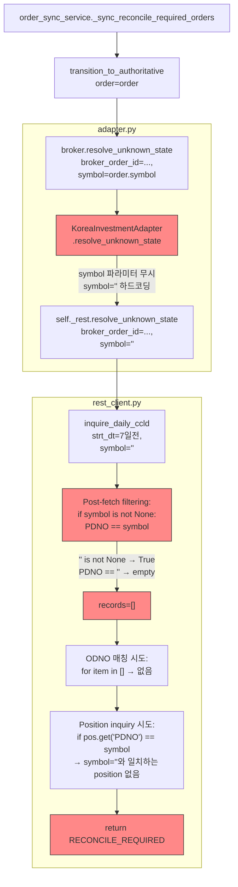
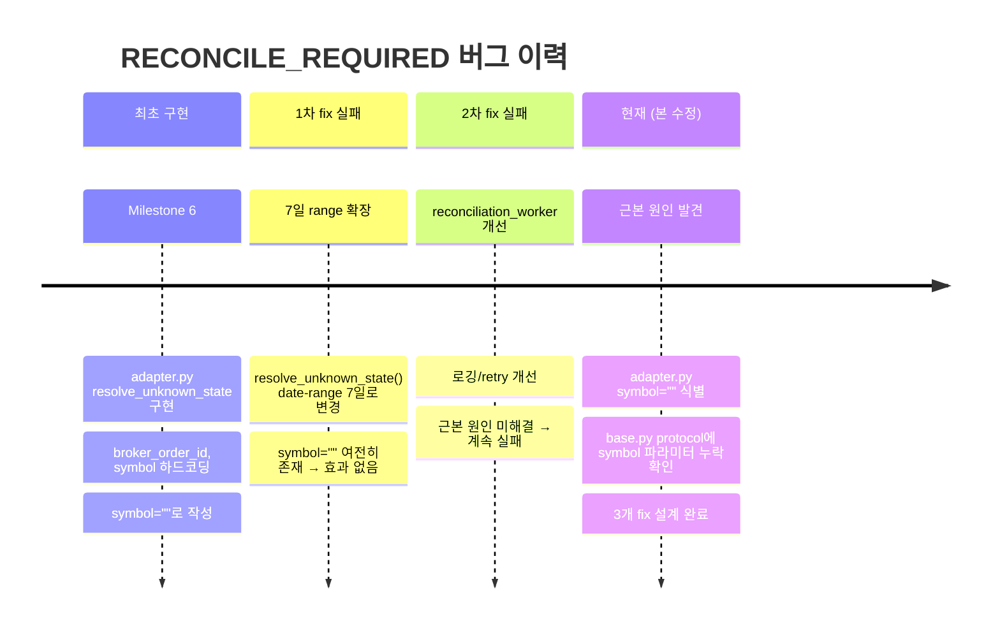

# RECONCILE_REQUIRED 잔존 버그 진짜 원인 분석 및 수정 설계

> **작성일**: 2026-05-19  
> **상태**: 설계 초안  
> **관련 파일**: [`adapter.py`](src/agent_trading/brokers/koreainvestment/adapter.py), [`rest_client.py`](src/agent_trading/brokers/koreainvestment/rest_client.py), [`snapshot.py`](src/agent_trading/brokers/koreainvestment/snapshot.py), [`base.py`](src/agent_trading/brokers/base.py), [`order_sync_service.py`](src/agent_trading/services/order_sync_service.py), [`sizing_engine.py`](src/agent_trading/services/sizing_engine.py), [`decision_orchestrator.py`](src/agent_trading/services/decision_orchestrator.py)

---

## 1. 개요

### 문제 증상

- **RECONCILE_REQUIRED 상태의 주문이 정상 해소되지 않고 잔존** — `order_sync_service.transition_to_authoritative()`에서 broker truth 조회를 수행해도 항상 `RECONCILE_REQUIRED`가 반환됨
- **이전 fix**(`resolve_unknown_state()` date-range 7일 확장, `reconciliation_worker.py` 개선)가 전혀 효과를 보지 못함
- **`orderable_amount`** 가 KIS paper 모의투자 환경에서 항상 `None`으로 수신되어, BUY 주문 시 `available_cash` fallback에 의존

### 이전 fix 실패 원인 요약

모든 이전 fix는 **`adapter.py`에서 `symbol=""`로 하드코딩**된 사실을 간과했기 때문에 무력화됨. `inquire_daily_ccld()`가 7일 범위로 데이터를 가져와도, `symbol=""` 필터(`PDNO == ""`)가 모든 레코드를 제거하여 ODNO 매칭이 항상 실패했음.

---

## 2. Root Cause 1: `adapter.py` `symbol=""` 하드코딩

### 2.1 호출 체인 전체 다이어그램



### 2.2 구체적인 코드 분석

#### 호출자: [`order_sync_service.py:613-616`](src/agent_trading/services/order_sync_service.py:613)

```python
status_result = await broker.resolve_unknown_state(
    broker_order_id=broker_order.broker_native_order_id,
    symbol=order.symbol,         # ✅ 올바르게 symbol 전달
)
```

#### 문제 1: [`base.py:206-212`](src/agent_trading/brokers/base.py:206) — Protocol에 `symbol` 파라미터 없음

```python
async def resolve_unknown_state(
    self,
    account_ref: str,
    *,
    client_order_id: str | None = None,
    broker_order_id: str | None = None,
) -> OrderStatusResult:
```

`order_sync_service.py`가 `symbol=order.symbol`을 keyword argument로 전달하지만, **base protocol에 `symbol`이 선언되지 않음**. Python `Protocol`은 정적 타입 검사만 수행하고 런타임에는 영향 없음 (덕 타이핑). 따라서 `KoreaInvestmentAdapter`가 `symbol`을 받지 않으면 런타임 `TypeError` 발생.

#### 문제 2: [`adapter.py:505-521`](src/agent_trading/brokers/koreainvestment/adapter.py:505) — `symbol` 파라미터 누락 + 하드코딩

```python
async def resolve_unknown_state(
    self,
    account_ref: str,
    *,
    client_order_id: str | None = None,
    broker_order_id: str | None = None,
) -> OrderStatusResult:
    # ...
    return await self._rest.resolve_unknown_state(
        broker_order_id=broker_order_id or "",
        symbol="",               # 🔴 하드코딩! order.symbol 완전 무시
    )
```

**⚠️ 추가 발견: `adapter.py`의 시그니처에 `symbol` 파라미터가 아예 없음.** `order_sync_service.py`가 `symbol=order.symbol`을 넘기면 `TypeError` 발생 → `except Exception`에 의해 catch되어 로그만 남기고 `None` 반환 → order가 그대로 `RECONCILE_REQUIRED`로 남음.

#### 문제 3: [`rest_client.py:1486-1516`](src/agent_trading/brokers/koreainvestment/rest_client.py:1486) — `symbol=""` 전달

```python
async def resolve_unknown_state(
    self,
    broker_order_id: str,
    symbol: str,
    after_hours: bool = False,
) -> OrderStatusResult:
    # ...
    records = await self.inquire_daily_ccld(
        strt_dt=_strt_dt,
        end_dt=None,
        symbol=symbol,            # 여기서 symbol="" 그대로 전달
        after_hours=after_hours,
    )
```

#### 문제 4: [`rest_client.py:1039-1044`](src/agent_trading/brokers/koreainvestment/rest_client.py:1039) — Post-fetch filtering 무력화

```python
# Post-fetch filtering
filtered = all_output
if broker_order_id is not None:
    filtered = [it for it in filtered if it.get("ODNO") == broker_order_id]
if symbol is not None:
    filtered = [it for it in filtered if it.get("PDNO") == symbol]
```

`symbol=""`는 `is not None` 조건을 통과 (`"" is not None → True`).  
그러나 KIS 응답의 `PDNO`는 실제 종목코드(예: `"005930"`)이므로 `PDNO == ""`를 만족하는 레코드는 **0건**.

### 2.3 이전 fix가 효과 없었던 이유

| 이전 fix | 무력화된 이유 |
|----------|---------------|
| `resolve_unknown_state()` date-range 7일 확장 (`_strt_dt = now - 7days`) | 데이터는 7일 범위로 정상 수신하나, `symbol=""` 필터가 모든 레코드 제거 |
| `reconciliation_worker.py` 로깅/retry 개선 | 근본 원인(`symbol=""`)이 해결되지 않으면 항상 실패 |
| `inquire_daily_ccld()` pagination 개선 | 페이지를 많이 가져와도 필터에서 전부 삭제 |

---

## 3. Root Cause 2: `orderable_amount` NULL — KIS Paper API 한계

### 3.1 VTTC8434R vs TTTC8434R 응답 차이

| 필드 | 실전 API (`TTTC8434R`) | 모의투자 API (`VTTC8434R`) |
|------|-----------------------|---------------------------|
| `output` (잔고) | ✅ 정상 | ✅ 정상 |
| `output2` (현금요약) | ✅ 모든 필드 포함 | ⚠️ 일부 필드만 포함 |
| `ord_psbl_amt` (주문가능금액) | ✅ 제공 | ❌ **미제공** |
| `dnca_tot_amt` (예수금총액) | ✅ 제공 | ✅ 제공 |
| `nxdy_excc_amt` (익일초과액) | ✅ 제공 | ✅ 제공 |

### 3.2 `ord_psbl_amt` 필드 부재 확인 경로

[`snapshot.py:197`](src/agent_trading/brokers/koreainvestment/snapshot.py:197):

```python
orderable_amount = safe_optional_decimal(raw_cash.get(_KIS_ORD_PSBL_AMT))
```

- `_KIS_ORD_PSBL_AMT = "ord_psbl_amt"` (`snapshot.py:46`)
- paper API 응답에 `ord_psbl_amt` 키가 없음 → `raw_cash.get("ord_psbl_amt")` → `None`
- `safe_optional_decimal(None)` → `None`
- 결과: `orderable_amount`가 항상 `None`

[`kis_snapshot_sync.py:296`](src/agent_trading/services/kis_snapshot_sync.py:296)도 동일:

```python
orderable_amount = _safe_optional_decimal(raw_cash.get(_KIS_ORD_PSBL_AMT))
```

### 3.3 `sizing_engine.py` fallback 로직 분석

[`sizing_engine.py:292-306`](src/agent_trading/services/sizing_engine.py:292):

```python
# Priority: orderable_amount > available_cash
if orderable_amount is not None:
    if orderable_amount <= 0:
        constraints.append("orderable_amount_zero")
        logger.info("BUY blocked: orderable_amount=%s <= 0", orderable_amount)
        return Decimal("0")
    effective_cash = orderable_amount
elif available_cash is not None:
    # orderable_amount가 None (KIS paper API 미지원) → available_cash fallback
    logger.info(
        "orderable_amount=None (KIS paper API), falling back to available_cash=%s",
        available_cash,
    )
```

**fallback 동작 정상 확인**: `orderable_amount=None` → `available_cash` fallback이 이미 구현되어 있어 기능적 문제는 없음.

**단, 다음과 같은 한계 존재**:
- 음수 `orderable_amount`(예: 미수금 초과 상태) 기반 BUY 차단 불가
- `available_cash`는 결제일(D+2)을 고려하지 않은 원시 예수금이므로, 실제 주문가능금액보다 클 수 있음

### 3.4 `settled_cash = -81,419,050` 의미 재확인

[`snapshot.py:177-181`](src/agent_trading/brokers/koreainvestment/snapshot.py:177):

```python
settled_raw = raw_cash.get(_KIS_NXDY_EXCC_AMT)
if settled_raw is not None and str(settled_raw).strip():
    settled_cash = safe_decimal(settled_raw)
else:
    settled_cash = available_cash
```

- `nxdy_excc_amt`(익일초과액): D+2 결제 기준 초과 인출 가능 금액
- 음수 값 = 미수금/결제 부족 상태
- **정상 동작**: KIS paper API가 실제 음수 결제잔고를 정확히 반영
- `orderable_amount`가 `None`이므로 `_apply_cash_constraint()`는 `available_cash`를 사용하지만, **`available_cash`는 예수금총액(`dnca_tot_amt`)으로 항상 양수** — 실제 결제 부족 상태를 반영하지 못할 가능성

---

## 4. 수정 사항

### 4.1 수정 1 (P0 — CRITICAL): `adapter.py` + `base.py` — `symbol` 파라미터 추가 및 전달

#### [`base.py:206-212`](src/agent_trading/brokers/base.py:206) — Protocol 시그니처 변경

```python
async def resolve_unknown_state(
    self,
    account_ref: str,
    *,
    client_order_id: str | None = None,
    broker_order_id: str | None = None,
    symbol: str | None = None,          # ← 추가
) -> OrderStatusResult:
```

#### [`adapter.py:505-521`](src/agent_trading/brokers/koreainvestment/adapter.py:505) — 파라미터 수신 및 전달

변경 전:
```python
async def resolve_unknown_state(
    self,
    account_ref: str,
    *,
    client_order_id: str | None = None,
    broker_order_id: str | None = None,
) -> OrderStatusResult:
    # ...
    return await self._rest.resolve_unknown_state(
        broker_order_id=broker_order_id or "",
        symbol="",
    )
```

변경 후:
```python
async def resolve_unknown_state(
    self,
    account_ref: str,
    *,
    client_order_id: str | None = None,
    broker_order_id: str | None = None,
    symbol: str | None = None,          # ← 추가
) -> OrderStatusResult:
    # ...
    return await self._rest.resolve_unknown_state(
        broker_order_id=broker_order_id or "",
        symbol=symbol or None,           # ← 빈 문자열/None → None 정규화
    )
```

**`symbol or None`의 효과**: `""`(빈 문자열) → `None`으로 변환 → `inquire_daily_ccld()`의 `if symbol is not None` 조건 통과 못 함 → post-fetch symbol 필터링 생략 → 모든 레코드 유지 → ODNO 매칭 정상 동작.

### 4.2 수정 2 (P0 — DEFENSIVE): `rest_client.py` `resolve_unknown_state()` symbol=None 방어 처리

#### [`rest_client.py:1486-1516`](src/agent_trading/brokers/koreainvestment/rest_client.py:1486)

변경 전:
```python
async def resolve_unknown_state(
    self,
    broker_order_id: str,
    symbol: str,
    after_hours: bool = False,
) -> OrderStatusResult:
    # ...
    records = await self.inquire_daily_ccld(
        strt_dt=_strt_dt,
        end_dt=None,
        symbol=symbol,
        after_hours=after_hours,
    )
```

변경 후:
```python
async def resolve_unknown_state(
    self,
    broker_order_id: str,
    symbol: str | None = None,          # ← 타입 힌트 변경
    after_hours: bool = False,
) -> OrderStatusResult:
    symbol = symbol or None              # ← 방어적 정규화
    # ...
    records = await self.inquire_daily_ccld(
        strt_dt=_strt_dt,
        end_dt=None,
        symbol=symbol,                   # ← symbol or None 상태 유지
        after_hours=after_hours,
    )
```

`symbol = symbol or None`은 메서드 시작부에서 한 번만 적용.  
`inquire_daily_ccld()`는 이미 `symbol=None`을 올바르게 처리하므로(L1043: `if symbol is not None`), 이 방어 코드는 이중 안전장치 역할.

### 4.3 수정 3 (P1 — ENHANCEMENT): `snapshot.py` paper 환경 orderable_amount 로깅

#### [`snapshot.py:197`](src/agent_trading/brokers/koreainvestment/snapshot.py:197)

변경 전:
```python
orderable_amount = safe_optional_decimal(raw_cash.get(_KIS_ORD_PSBL_AMT))
```

변경 후:
```python
orderable_amount = safe_optional_decimal(raw_cash.get(_KIS_ORD_PSBL_AMT))
if orderable_amount is None:
    logger.info(
        "ord_psbl_amt not present in KIS %s response; orderable_amount will be None",
        "paper" if getattr(self._rest, "env", "") == "paper" else "api",
    )
```

**참고**: `self._rest.env` 속성 존재 여부는 `KISRestClient` 구현에 따라 다를 수 있음.  
구체적인 paper 환경 감지 방식은 구현 시 결정.

#### [`kis_snapshot_sync.py:296`](src/agent_trading/services/kis_snapshot_sync.py:296)에도 동일 로깅 적용:

변경 전:
```python
orderable_amount = _safe_optional_decimal(raw_cash.get(_KIS_ORD_PSBL_AMT))
```

변경 후:
```python
orderable_amount = _safe_optional_decimal(raw_cash.get(_KIS_ORD_PSBL_AMT))
if orderable_amount is None:
    logger.info(
        "ord_psbl_amt not present in KIS %s response; orderable_amount will be None",
        "paper" if getattr(self._rest, "env", "") == "paper" else "api",
    )
```

---

## 5. 변경 파일 목록

| 파일 | 변경 사항 | 우선순위 |
|------|----------|----------|
| [`src/agent_trading/brokers/base.py`](src/agent_trading/brokers/base.py) | `resolve_unknown_state()` protocol에 `symbol: str \| None = None` 파라미터 추가 | P0 |
| [`src/agent_trading/brokers/koreainvestment/adapter.py`](src/agent_trading/brokers/koreainvestment/adapter.py) | `resolve_unknown_state()`에 `symbol` 파라미터 추가, `symbol or None` 전달 | P0 |
| [`src/agent_trading/brokers/koreainvestment/rest_client.py`](src/agent_trading/brokers/koreainvestment/rest_client.py) | `resolve_unknown_state()` 시작부에 `symbol = symbol or None` 방어 코드 추가, 시그니처 `str \| None`으로 변경 | P0 |
| [`src/agent_trading/brokers/koreainvestment/snapshot.py`](src/agent_trading/brokers/koreainvestment/snapshot.py) | `ord_psbl_amt` 미제공 시 INFO 로깅 추가 | P1 |
| [`src/agent_trading/services/kis_snapshot_sync.py`](src/agent_trading/services/kis_snapshot_sync.py) | `ord_psbl_amt` 미제공 시 INFO 로깅 추가 | P1 |

---

## 6. 테스트 계획

### 6.1 단위 테스트

#### Test 1: `adapter.py` — `resolve_unknown_state()` symbol 파라미터 전달 검증

**파일**: [`tests/brokers/koreainvestment/`](tests/brokers/koreainvestment/)

```python
async def test_resolve_unknown_state_passes_symbol():
    """KoreaInvestmentAdapter.resolve_unknown_state()가 symbol을 None으로 정규화하여
    rest_client.resolve_unknown_state()에 전달하는지 검증."""
    
    mock_rest = AsyncMock(spec=KISRestClient)
    adapter = KoreaInvestmentAdapter(rest_client=mock_rest)
    
    # symbol="005930" 전달
    await adapter.resolve_unknown_state(
        account_ref="test",
        broker_order_id="ODNO123",
        symbol="005930",
    )
    mock_rest.resolve_unknown_state.assert_called_once_with(
        broker_order_id="ODNO123",
        symbol="005930",  # 그대로 전달
    )
    
    mock_rest.reset_mock()
    
    # symbol="" 전달 → None으로 정규화
    await adapter.resolve_unknown_state(
        account_ref="test",
        broker_order_id="ODNO123",
        symbol="",
    )
    mock_rest.resolve_unknown_state.assert_called_once_with(
        broker_order_id="ODNO123",
        symbol=None,  # "" → None 정규화
    )
    
    mock_rest.reset_mock()
    
    # symbol=None 전달
    await adapter.resolve_unknown_state(
        account_ref="test",
        broker_order_id="ODNO123",
        symbol=None,
    )
    mock_rest.resolve_unknown_state.assert_called_once_with(
        broker_order_id="ODNO123",
        symbol=None,
    )
```

#### Test 2: `rest_client.py` — `resolve_unknown_state()` symbol=None 방어 처리 검증

```python
async def test_resolve_unknown_state_empty_string_normalized():
    """resolve_unknown_state()가 symbol=""를 None으로 정규화하여
    inquire_daily_ccld()에 전달하는지 검증."""
    
    client = KISRestClient(...)
    
    # Mock inquire_daily_ccld
    with patch.object(client, 'inquire_daily_ccld', new_callable=AsyncMock) as mock_inq:
        mock_inq.return_value = [
            {"ODNO": "ODNO123", "PDNO": "005930", "ORD_QTY": "10", ...}
        ]
        
        result = await client.resolve_unknown_state(
            broker_order_id="ODNO123",
            symbol="",
        )
        
        # inquire_daily_ccld가 symbol=None으로 호출되었는지 확인
        call_kwargs = mock_inq.call_args[1]
        assert call_kwargs.get("symbol") is None  # ""가 아니라 None
        
        # ODNO 매칭이 정상 동작하여 FILLED 등 정상 상태가 반환되는지 확인
        assert result.status != OrderStatus.RECONCILE_REQUIRED
```

#### Test 3: `rest_client.py` — `inquire_daily_ccld()` symbol=None 필터링 생략 검증

기존 테스트 [`tests/brokers/koreainvestment/`](tests/brokers/koreainvestment/)에서 `inquire_daily_ccld()` post-fetch filtering 검증 케이스에 `symbol=None` 케이스 추가:

- `symbol=None` → `if symbol is not None` 조건 False → PDNO 필터링 생략
- `symbol="005930"` → PDNO 필터링 정상 동작
- `symbol=""` → `is not None` True → `PDNO == ""` → 빈 결과 (현재 동작, 의도된 것은 아님)

### 6.2 회귀 테스트

| 테스트 영역 | 실행 명령 | 검증 항목 |
|-------------|----------|-----------|
| `order_sync_service` | `pytest tests/services/test_order_sync.py -v` | `transition_to_authoritative()`가 `symbol` 전달 후 정상 해소 |
| `snapshot` | `pytest tests/brokers/koreainvestment/test_snapshot.py -v` | `orderable_amount` 파싱 및 로깅 정상 |
| `sizing` | `pytest tests/services/test_sizing.py -v` (존재 시) | `_apply_cash_constraint()` fallback 정상 |
| `reconciliation_worker` | `pytest tests/services/test_reconciliation.py -v` (존재 시) | reconciliation run 정상 |

### 6.3 통합 테스트 (inspection API)

KIS paper 환경 대상 inspection API 엔드포인트로 broker-truth 조회 결과 확인:

```
GET /api/v1/inspection/broker-truth?order_id={order_id}
```

- 수정 전: 항상 `RECONCILE_REQUIRED`
- 수정 후: 정상 상태(`FILLED`, `CANCELLED`, `ACKNOWLEDGED` 등) 반환

---

## 7. 운영 검증 계획

### Phase 1: 배포 전 확인 (로컬/dev)

1. **단위 테스트 통과**: `pytest tests/brokers/koreainvestment/ -v -k "resolve_unknown_state"`
2. **Mock 기반 통합 테스트**: `adapter.resolve_unknown_state()` 호출 시 `rest_client.resolve_unknown_state()`에 `symbol or None`이 전달되는지 확인
3. **`orderable_amount` 로깅 확인**: `snapshot.py`의 INFO 로그에 `"ord_psbl_amt not present in KIS paper response"` 출력 확인

### Phase 2: 배포 후 모니터링

1. **`reconcile_required` 해소 확인**: 
   - 기존 `RECONCILE_REQUIRED` 주문 목록 스냅샷
   - 배포 후 1회 sync cycle 이후 status 변화 추적
   - `order_sync_service` 로그에서 `"transition_to_authoritative: resolved"` 메시지 확인

2. **`orderable_amount` 상태 판정**:
   - `decision_orchestrator.py` 로그에서 `"Cash source: orderable_amount=None (KIS paper API)"` 메시지 확인 ([`decision_orchestrator.py:1356`](src/agent_trading/services/decision_orchestrator.py:1356))
   - `orderable_amount`가 여전히 `None`인 것이 정상 (paper API 한계)
   - `available_cash` fallback이 정상 적용되는지 확인

3. **Inspection API broker-truth 확인**:
   - `GET /api/v1/inspection/broker-truth` 엔드포인트로 특정 주문의 broker 상태 직접 조회
   - 수정 전: `RECONCILE_REQUIRED`
   - 수정 후: 실제 KIS 상태 반영

### Phase 3: 장기 모니터링 (1주일)

| 지표 | 목표 |
|------|------|
| `RECONCILE_REQUIRED` 잔존율 | 0% (진짜 manual reconciliation 대상 제외) |
| `orderable_amount` 수신율 (paper) | 0% (정상, API가 제공하지 않음) |
| `_apply_cash_constraint` fallback hit | 정상 로깅만, warning/error 없음 |

---

## 8. Follow-up TODO

### 단기 (P1, 본 수정 포함)

- [x] `base.py` `resolve_unknown_state()` protocol에 `symbol` 파라미터 추가
- [x] `adapter.py` `resolve_unknown_state()` `symbol` 파라미터 수신 + `symbol or None` 전달
- [x] `rest_client.py` `resolve_unknown_state()` `symbol = symbol or None` 방어 처리
- [x] `snapshot.py` / `kis_snapshot_sync.py` `orderable_amount` 로깅 추가
- [ ] 기존 `RECONCILE_REQUIRED` 주목 일괄 재처리 스크립트 실행 검토

### 중기 (P2)

- [ ] **실전 API 전환 시 `ord_psbl_amt` 정상 수신 확인**: `VTTC8434R` → `TTTC8434R` 전환 후 `orderable_amount`가 정상 수신되는지 검증
- [ ] **`get_order_status()` date-range 확장 검토**: 현재 당일만 조회하는 `get_order_status()`도 이전 날짜 주문을 찾지 못할 가능성 있음. `resolve_unknown_state()`와 동일하게 7일 range 확장 고려
- [ ] **KIS API 문서 업데이트 모니터링**: paper API가 `ord_psbl_amt`를 제공하기 시작하는지 주기적 확인

### 장기 (P3)

- [ ] **`orderable_amount` 음수 기반 BUY 차단 강화**: 실전 API 전환 후 `orderable_amount < 0` 감지 기능 활성화하여 overshoot 방지
- [ ] **`available_cash`와 `settled_cash` 차이 분석**: `settled_cash = -81,419,050` 상황에서도 `available_cash`(예수금총액)가 양수인 케이스의 정확한 의미 파악 및 대응 정책 수립

---

## Appendix A: `symbol=""` 버그 타임라인



## Appendix B: 파일별 책임 매트릭스

| 파일 | 책임 | 변경 범위 |
|------|------|----------|
| [`base.py`](src/agent_trading/brokers/base.py) | BrokerAdapter protocol 정의 | 시그니처에 `symbol` 파라미터 추가 (1줄) |
| [`adapter.py`](src/agent_trading/brokers/koreainvestment/adapter.py) | KIS adapter 구현, REST client 호출 | 시그니처 + `symbol or None` 전달 (3줄) |
| [`rest_client.py`](src/agent_trading/brokers/koreainvestment/rest_client.py) | KIS REST API 호출, reconciliation inquiry | 방어적 `symbol = symbol or None` + 타입 힌트 (2줄) |
| [`snapshot.py`](src/agent_trading/brokers/koreainvestment/snapshot.py) | KIS snapshot fetch, cash balance 파싱 | `orderable_amount is None` 로깅 (3줄) |
| [`kis_snapshot_sync.py`](src/agent_trading/services/kis_snapshot_sync.py) | KIS snapshot sync 서비스 | `orderable_amount is None` 로깅 (3줄) |

> **총 변경량**: 약 12줄, 5개 파일. P0 수정은 3개 파일(`base.py`, `adapter.py`, `rest_client.py`) 약 6줄.
