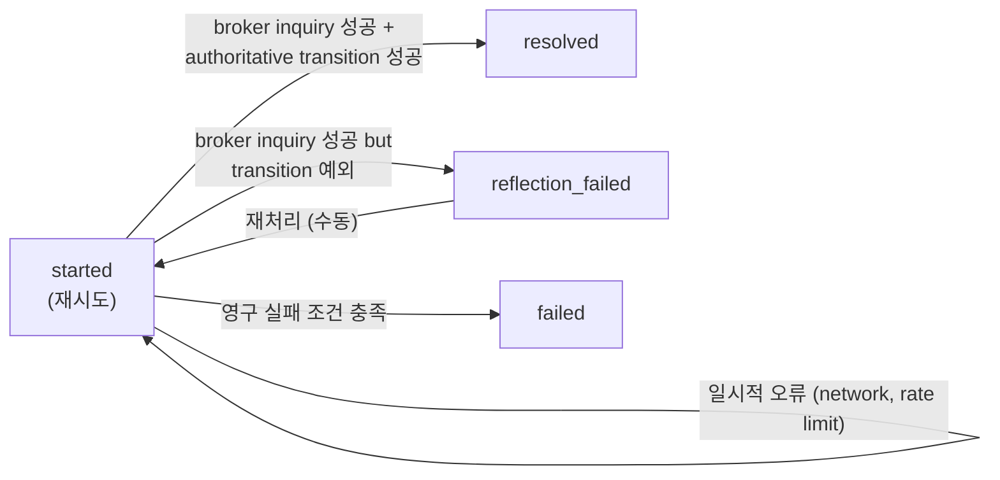
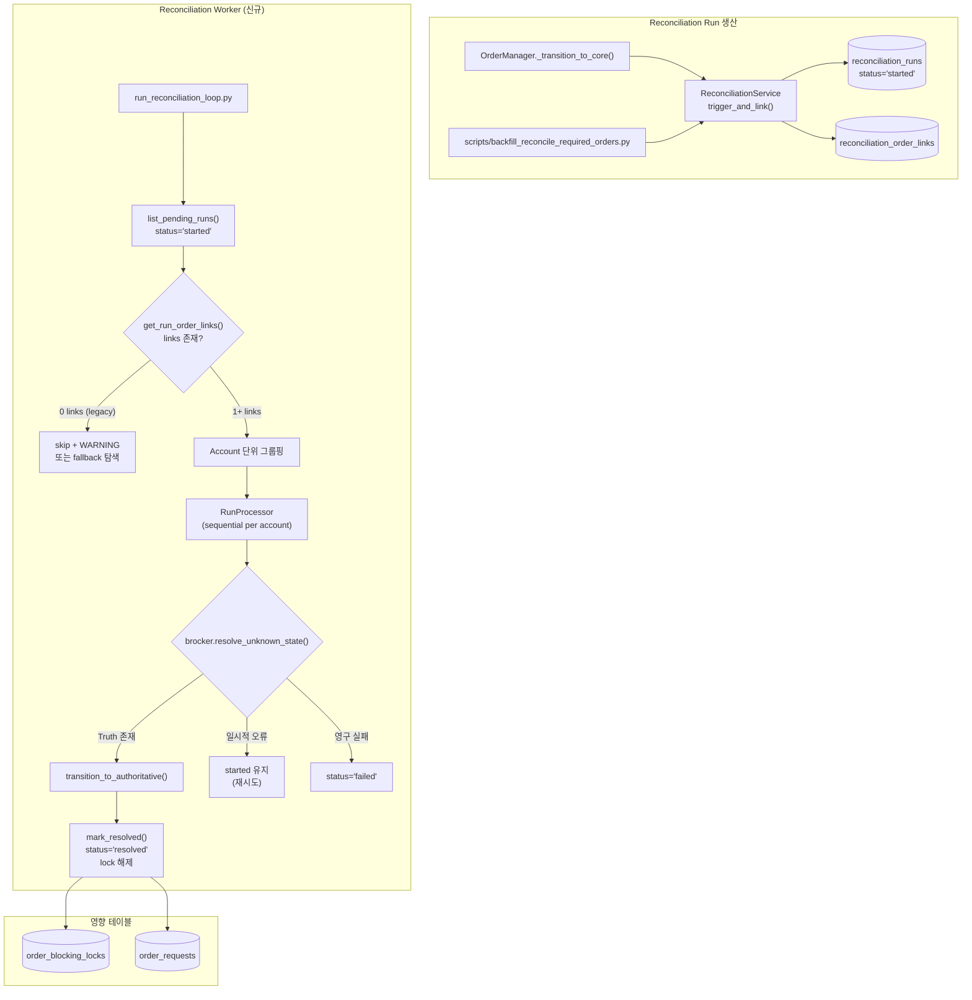

# Reconciliation Worker Architecture

**Date:** 2026-05-16  
**Author:** Architect Mode  
**Status:** v2 — 4 contracts defined (membership / trigger_type / status semantics / repository read path)  

---

## 1. 기존 문제 요약

### 1.1 Reconciliation Run 생산-소비 불균형

현재 시스템에서 reconciliation run의 생산(produce) 경로는 2개 존재하지만, **소비(consume)하는 worker가 전혀 없다**.

**생산 경로:**
1. [`OrderManager._transition_to_core()`](src/agent_trading/services/order_manager.py:680) — 주문이 `RECONCILE_REQUIRED`로 전이될 때 `ReconciliationService.trigger()` 자동 호출 (auto-trigger, Phase 18)
2. [`scripts/backfill_reconcile_required_orders.py`](scripts/backfill_reconcile_required_orders.py) — 기존 stuck 주문에 대해 수동/스케줄 방식으로 trigger 호출 (Phase 19)

**소비 경로:** ❌ 없음

생성된 run은 `status='started'` 상태로 [`reconciliation_runs`](db/migrations/0001_initial_schema.sql:365) 테이블에 영원히 체류한다.

### 1.2 PostSubmitSyncRunner와의 경계

[`PostSubmitSyncRunner`](src/agent_trading/services/order_sync_service.py:543)는 주문 단위 sync를 수행하지만 **reconciliation run을 소비하지는 않는다**.

| 구분 | PostSubmitSyncRunner | Reconciliation Worker (필요) |
|------|---------------------|------------------------------|
| 조회 대상 | `_ACTIVE_SYNC_STATUSES`의 주문 | `status='started'`인 reconciliation run |
| Broker truth 조회 | `sync_order_post_submit()` (일반 inquiry) | `resolve_unknown_state()` (reconciliation 전용) |
| 상태 전이 | 일반 상태 전이 (submit → acknowledged → filled) | `transition_to_authoritative()` (강제 반영) |
| Lock 해제 | ❌ 안 함 | ✅ `mark_resolved()`에서 `release_blocking_lock()` 수행 |
| 용도 | 정상 주문 상태 추적 | 복구 목적 강제 상태 반영 |

**중복 조회는 허용됨.** Worker가 먼저 처리하여 주문을 `FILLED`로 변경하면, 다음 PostSubmitSyncRunner cycle에서 해당 주문은 더 이상 `RECONCILE_REQUIRED`가 아니므로 자연스럽게 건너뛴다. Authoritative transition은 **worker만** 수행한다.

### 1.3 Blocking Lock 누적

Reconciliation run이 생성될 때 [`acquire_blocking_lock()`](src/agent_trading/services/reconciliation_service.py:117)이 호출되어 `order_blocking_locks`에 30분 TTL의 lock이 생성된다. Worker가 없으면:
- Run이 `resolved`로 전이되지 않음 → `release_blocking_lock()`이 호출되지 않음
- Lock이 TTL 만료로 자동 해제되지만, run은 계속 `started` 상태로 남음
- 동일 계정/종목에 대해 `trigger()`가 중복 호출되지 않음 (idempotency by `get_active_run()`) → 처리 기회 자체가 사라짐

---

## 2. 계약 1: Run → Order 연결 계약 (Membership Contract)

### 2.1 현재 문제

**현재 생산 경로는 `trigger()`만 호출하고 `attach_order_mismatch()`를 호출하지 않는다.**

- [`OrderManager._transition_to_core()`](src/agent_trading/services/order_manager.py:680)의 auto-trigger: `trigger()`만 호출, order link 생성 안 함
- [`scripts/backfill_reconcile_required_orders.py`](scripts/backfill_reconcile_required_orders.py): `trigger()`만 호출, order link 생성 안 함

결과적으로 `reconciliation_runs` 테이블에는 `status='started'` run이 존재하지만 `reconciliation_order_links`에는 연결된 주문이 없다.

### 2.2 해결: Trigger+Link 통합 메서드

**결정: `trigger()` 직후 `attach_order_mismatch()`를 호출하는 편의 메서드 `trigger_and_link()`를 [`ReconciliationService`](src/agent_trading/services/reconciliation_service.py)에 추가한다.**

```python
async def trigger_and_link(
    self,
    account_id: UUID,
    trigger_type: str,
    order_request_id: UUID,
    *,
    strategy_id: UUID | None = None,
    symbol: str | None = None,
    side: str | None = None,
) -> ReconciliationRunEntity:
    """Create a reconciliation run AND link it to an order in one call.

    이 메서드는 다음을 원자적으로 수행한다:
    1. trigger() — run 생성 + blocking lock
    2. attach_order_mismatch() — order link 기록 (mismatch_type='pending_inquiry')

    이로써 reconciliation run은 생성 시점에 반드시 최소 1개 이상의
    order link를 가지게 된다.
    """
    run = await self.trigger(
        account_id=account_id,
        trigger_type=trigger_type,
        strategy_id=strategy_id,
        symbol=symbol,
        side=side,
    )

    await self.attach_order_mismatch(
        reconciliation_run_id=run.reconciliation_run_id,
        order_request_id=order_request_id,
        mismatch_type="pending_inquiry",
        details={
            "trigger_type": trigger_type,
            "linked_at": datetime.now(timezone.utc).isoformat(),
        },
    )

    return run
```

### 2.3 생산 경로 수정 계획

| 경로 | 변경 전 | 변경 후 |
|------|---------|---------|
| [`OrderManager._transition_to_core()`](src/agent_trading/services/order_manager.py:680) | `reconciliation_service.trigger(...)` | `reconciliation_service.trigger_and_link(..., order_request_id=after.order_request_id)` |
| [`scripts/backfill_reconcile_required_orders.py`](scripts/backfill_reconcile_required_orders.py) | `recon_service.trigger(...)` | `recon_service.trigger_and_link(..., order_request_id=order.order_request_id, symbol=symbol, side=side)` |

### 2.4 Legacy Run 처리 정책

이미 존재하는 link 없는 `started` run (예: `f7cf6333-...`)은 **legacy backfill gap**으로 간주한다.

**Worker의 처리 정책:**
1. `list_pending_runs()`로 조회된 run에 대해 `get_run_order_links(run_id)` 호출
2. Link가 0개인 경우:
   - **기본 정책: skip + WARNING 로그** — "started run without order links, skipping (run_id=...)"
   - **Fallback 정책 (선택):** run의 `account_id` 기준으로 `RECONCILE_REQUIRED` 상태 주문을 재탐색하여 fallback link 생성 후 처리
   - Fallback은 초기 migration 기간에만 활성화하고, 정상화 후 제거

### 2.5 Worker의 Run 소비 전제

- Worker는 "연결 없는 started run"을 정상 케이스로 가정하면 안 된다.
- **정상 run은 반드시 최소 1개 이상의 order link를 가져야 한다.**
- Link가 없는 run은 위 2.4 정책에 따라 처리한다.

---

## 3. 계약 2: trigger_type 값 정합화

### 3.1 현황 분석

| 소스 | 사용하는 trigger_type | DB CHECK 허용 여부 |
|------|---------------------|--------------------|
| [`OrderManager._transition_to_core()`](src/agent_trading/services/order_manager.py:690) | `reconcile_required_transition` | ❌ 허용되지 않음 |
| [`scripts/backfill_reconcile_required_orders.py`](scripts/backfill_reconcile_required_orders.py:51) | `requires_reconciliation` | ✅ 허용 |
| [`ReconciliationService.trigger()`](src/agent_trading/services/reconciliation_service.py) | 호출자가 결정 | — |

**DB CHECK 제약 ([`0008`](db/migrations/0008_update_reconciliation_trigger_types.sql:29)):**

```sql
CHECK (trigger_type IN (
    'schedule', 'submit_timeout', 'ws_disconnect', 'manual', 'eod',
    'uncertain_result', 'requires_reconciliation'
))
```

### 3.2 Canonical 값 결정

**결정: 모든 생산 경로에서 `requires_reconciliation`으로 통일한다.**

| 경로 | 현재 값 | Canonical 값 |
|------|---------|-------------|
| Auto-trigger (`OrderManager`) | `reconcile_required_transition` | → `requires_reconciliation` |
| Backfill script | `requires_reconciliation` | → `requires_reconciliation` (변경 불필요) |
| 수동 trigger (향후 CLI) | — | → `manual` |

**이유:**
- DB CHECK 제약을 추가 migration 없이 준수 가능
- `backfill_reconcile_required_orders.py`가 이미 `requires_reconciliation`을 사용하므로 일관성 있음
- `reconcile_required_transition`은 과거 `_transition_to_core()` 로컬 값이었으나, CHECK 제약에 포함되어 있지 않아 `INSERT` 시 `CHECK` 위반으로 실패할 수 있음

### 3.3 추가 Canonical 값 제안 (향후)

| trigger_type | 용도 |
|-------------|------|
| `manual` | 운영자가 수동으로 trigger (이미 DB CHECK에 포함됨) |
| `scheduled` | 주기적/예약 reconciliation (현재 `schedule`과 동일, alias) |
| `reconcile_required_transition` | DB CHECK에 추가 검토 (호환성) |

**단기적으로는 DB migration 없이 `requires_reconciliation`만 사용한다.**

---

## 4. 계약 3: Run Status Semantics

### 4.1 Status 값 정의

현재 DB CHECK 제약 (`0008`)에 정의된 status 값과 Worker 동작을 명확히 매핑한다.

| Status | 의미 | 전이 조건 | Worker 동작 |
|--------|------|-----------|------------|
| `started` | 처리 중 / 재시도 대상 | 신규 생성 시 | Worker가 pick하여 처리 시작 |
| `resolved` | Broker truth 확인 + 상태 반영 완료 + lock 해제 | `mark_resolved()` 성공 | Worker가 최종 목표로 함 |
| `reflection_failed` | Broker truth는 얻었지만 internal authoritative transition 실패 | `transition_to_authoritative()` 예외 | 재시도 가능 (수동 판단 필요) |
| `failed` | 영구 실패 — 더 이상 재시도하지 않음 | 정의된 조건 충족 시 | Worker가 명시적으로 설정 |
| `completed` | 사용하지 않음 (레거시) | — | Worker는 이 값을 생성하지 않음 |
| `halted` | 사용하지 않음 (레거시) | — | Worker는 이 값을 생성하지 않음 |

### 4.2 Worker의 Status 전이 규칙



### 4.3 구체적 조건

**`resolved`로 전이:**
- `resolve_unknown_state()`가 terminal/known-good status 반환
- `transition_to_authoritative()` 성공
- `mark_resolved()`로 run 닫힘 + lock 해제

**`reflection_failed`로 전이:**
- `resolve_unknown_state()`는 성공 (broker truth 획득)
- 그러나 `transition_to_authoritative()`에서 optimistic locking 충돌 또는 기타 예외
- 이 경우 **lock은 유지됨** (수동 개입 필요)

**`failed`로 전이 (영구 실패):**
- Broker가 주문 자체를 모른다고 응답 (order not found at broker) — 단, `started` 유지 후 재시도할지 `failed`로 닫을지는 상세 설계 필요
- 재시도 횟수 초과 (3회) 후에도 broker truth 획득 불가
- Run에 연결된 주문이 없고 (legacy case), fallback으로도 주문을 찾을 수 없음

**`started` 유지 (재시도 대상):**
- 일시적 오류: network timeout, rate limit (429), temporary broker error (5xx)
- Broker truth가 "아직 미확정" 상태 (예: `IN_PROGRESS`, `PENDING`)
- **권장 방향:** transient failure → `started` 유지, definitive irrecoverable → `failed`

---

## 5. 계약 4: Repository Read Path 요구사항

### 5.1 신규 메서드

Worker 동작에 필요한 repository 메서드를 명시적으로 정의한다.

```python
class ReconciliationRepository(Protocol):
    """ReconciliationRepository에 추가할 메서드 시그니처."""

    async def list_pending_runs(
        self,
        limit: int = 20,
        *,
        account_id: UUID | None = None,
        run_id: UUID | None = None,
    ) -> Sequence[ReconciliationRunEntity]:
        """status='started'인 run을 조회한다.

        Parameters
        ----------
        limit : int
            최대 조회 건수.
        account_id : UUID | None
            특정 account로 필터링 (None = 전체).
        run_id : UUID | None
            특정 run ID로 필터링 (None = 전체).

        Returns
        -------
        Sequence[ReconciliationRunEntity]
            started_at ASC 정렬 (FIFO).
        """
        ...

    async def get_run_order_links(
        self,
        reconciliation_run_id: UUID,
    ) -> Sequence[ReconciliationOrderLinkEntity]:
        """Run에 연결된 order link 목록을 조회한다.

        Returns
        -------
        Sequence[ReconciliationOrderLinkEntity]
            (reconciliation_run_id, order_request_id, mismatch_type, details_json, created_at)
        """
        ...

    async def list_run_position_links(
        self,
        reconciliation_run_id: UUID,
    ) -> Sequence[ReconciliationPositionLinkEntity]:
        """Run에 연결된 position link 목록을 조회한다.

        (참고) Position link는 현재 생산 경로에서 생성되지 않으므로
        Worker의 초기 버전에서는 사용하지 않는다. 향후 position-level
        reconciliation을 위해 인터페이스만 정의한다.
        """
        ...
```

### 5.2 구현 범위

| 구현체 | `list_pending_runs` | `get_run_order_links` | `list_run_position_links` |
|--------|--------------------|-----------------------|---------------------------|
| [`PostgresReconciliationRepository`](src/agent_trading/repositories/postgres/reconciliation.py) | ✅ 필수 | ✅ 필수 | ✅ 옵션 (인터페이스만) |
| [`InMemoryReconciliationRepository`](src/agent_trading/repositories/memory.py) | ✅ 필수 | ✅ 필수 | ✅ 옵션 |
| [`ReconciliationRepository` contract](src/agent_trading/repositories/contracts.py) | ✅ 시그니처 추가 | ✅ 시그니처 추가 | ✅ 시그니처 추가 |

### 5.3 예상 SQL

```sql
-- list_pending_runs
SELECT * FROM trading.reconciliation_runs
WHERE status = 'started'
  AND ($2::uuid IS NULL OR account_id = $2)
  AND ($3::uuid IS NULL OR reconciliation_run_id = $3)
ORDER BY started_at ASC
LIMIT $1;

-- get_run_order_links
SELECT * FROM trading.reconciliation_order_links
WHERE reconciliation_run_id = $1
ORDER BY created_at ASC;
```

### 5.4 ReconciliationOrderLinkEntity (신규 Entity 필요)

```python
@dataclass(slots=True, frozen=True)
class ReconciliationOrderLinkEntity:
    reconciliation_run_id: UUID
    order_request_id: UUID
    mismatch_type: str
    details_json: dict[str, object] = field(default_factory=dict)
    created_at: datetime | None = None
```

---

## 6. Worker 설계 (계약 반영)

### 6.1 Overall Architecture



### 6.2 Loop 구조

기존 [`run_snapshot_sync_loop.py`](scripts/run_snapshot_sync_loop.py) 패턴을 따라간다.

```python
# scripts/run_reconciliation_loop.py

async def _run_one_cycle(...):
    """1회 실행: status='started' run들을 조회하고 순차 처리."""
    1. DB 연결 + Repository 구축
    2. ReconciliationService 인스턴스 생성
    3. Broker adapter 인증 (account 단위로 lazy)
    4. list_pending_runs(limit=count)로 pending run 조회
    5. 각 run에 대해:
       a. get_run_order_links()로 order link 조회
       b. link 없으면 skip + WARNING (또는 fallback)
       c. link 있으면 broker inquiry → 상태 반영
    6. Summary 로깅

async def _run_loop(...):
    """무한 루프: interval 만큼 sleep하며 반복."""
    while not shutdown:
        await _run_one_cycle(...)
        await asyncio.wait_for(shutdown_event.wait(), timeout=interval)
```

**기본 interval:** 30초 (blocking lock TTL 30분 내 해소 필요)

### 6.3 Run 소비 기준

**조회:** [`list_pending_runs()`](#51-신규-메서드) 호출

```sql
SELECT * FROM trading.reconciliation_runs
WHERE status = 'started'
ORDER BY started_at ASC
LIMIT :count
```

- `status = 'started'` — 아직 처리되지 않은 run
- `started_at ASC` — FIFO
- `LIMIT :count` — 한 cycle에 처리할 최대 run 수
- CLI `--account-id` / `--run-id`로 필터링 가능

### 6.4 처리 단위: Account 단위

**결정:** Account 단위 그룹핑 후 sequential 처리

**이유:**
1. [`acquire_blocking_lock()`](src/agent_trading/services/reconciliation_service.py:117)이 `(account_id, ...)` 조합으로 lock 생성
2. 동일 account의 run들은 같은 broker credential 사용 → 인증 재사용 가능
3. [`get_active_run()`](src/agent_trading/services/reconciliation_service.py:278)이 account 단위로 중복 조회

### 6.5 Broker Truth 조회 방식

**기존 [`resolve_unknown_state()`](src/agent_trading/services/reconciliation_service.py:344) 재사용:**

```python
result = await broker.resolve_unknown_state(
    account_ref,
    client_order_id=client_order_id,
    broker_order_id=broker_order_id,
)
```

**Run과 연결된 주문 조회:** [`get_run_order_links()`](#51-신규-메서드)로 `order_request_id` 목록 획득 → 각 `order_request_id` → `BrokerOrder` → `broker_order_id` / `client_order_id` 추출

### 6.6 상태 전이 로직

#### Truth 존재 시

[`resolve_and_mark()`](src/agent_trading/services/reconciliation_service.py:389)를 사용하여:
1. `resolve_unknown_state()` → broker truth 획득
2. `transition_to_authoritative()` → 주문 상태 강제 반영
3. `mark_resolved()` → run 닫힘 + lock 해제

#### Truth 부재 / 오류 시

| 상황 | 처리 | Status |
|------|------|--------|
| Network timeout | 재시도 (최대 3회, exponential backoff) | `started` 유지 |
| Rate limit (429) | 재시도 (최대 3회) | `started` 유지 |
| Broker 5xx | 재시도 (최대 3회) | `started` 유지 |
| Order not found | `failed`로 전이 | `failed` |
| Broker unknown status | 재시도 | `started` 유지 |
| 재시도 소진 | `failed`로 전이 | `failed` |

### 6.7 중복 소비 방지 (Idempotency)

| 계층 | 메커니즘 |
|------|---------|
| SQL 쿼리 | `WHERE status = 'started'` — 이미 처리된 run은 조회되지 않음 |
| `update_run_status()` | 단순 UPDATE, 이미 `resolved`면 영향 없음 |
| `transition_to_authoritative()` | Optimistic locking (`expected_version`)으로 중복 전이 방지 |
| `mark_resolved()` | 상태 중복 변경 허용하나 lock release는 `locked_by_run_id`로 범위 제한 |

### 6.8 ReconciliationRunProcessor 상세

```python
@dataclass
class ReconciliationRunProcessor:
    repos: RepositoryContainer
    reconciliation_service: ReconciliationService
    order_manager: OrderManager
    broker_cache: dict[UUID, BrokerAdapter]  # account_id → adapter

    async def process_run(self, run: ReconciliationRunEntity) -> ProcessResult:
        """단일 reconciliation run 처리."""

        # ── 1. Order link 조회 ──
        order_links = await self.repos.reconciliations.get_run_order_links(
            run.reconciliation_run_id
        )

        if not order_links:
            # Legacy: link 없는 started run
            logger.warning(
                "started run without order links, skipping. run_id=%s account_id=%s",
                run.reconciliation_run_id, run.account_id,
            )
            return ProcessResult(status="skipped_no_links", orders_processed=0)

        # ── 2. Account → broker adapter ──
        account = await self.repos.accounts.get(run.account_id)
        broker_account = await self.repos.broker_accounts.get(account.broker_account_id)
        broker = self.broker_cache.get(account.account_id)
        if broker is None:
            broker = await self._build_broker_adapter(broker_account)
            self.broker_cache[account.account_id] = broker

        # ── 3. 각 order link에 대해 broker inquiry ──
        all_succeeded = True
        for link in order_links:
            broker_orders = await self.repos.broker_orders.list_by_order_request(
                link.order_request_id
            )
            for bo in broker_orders:
                try:
                    await self.reconciliation_service.resolve_and_mark(
                        reconciliation_run_id=run.reconciliation_run_id,
                        account_ref=broker_account.account_ref,
                        broker=broker,
                        client_order_id=bo.client_order_id,
                        broker_order_id=bo.broker_order_id,
                        order_manager=self.order_manager,
                    )
                except Exception as exc:
                    all_succeeded = False
                    logger.error("resolve_and_mark failed: run=%s order=%s error=%s",
                                 run.reconciliation_run_id, bo.broker_order_id, exc)

        if all_succeeded:
            return ProcessResult(status="resolved", orders_processed=len(order_links))
        else:
            return ProcessResult(status="partial", orders_processed=len(order_links))
```

---

## 7. 변경 대상 파일 목록

### 7.1 신규 파일

| 파일 | 설명 |
|------|------|
| [`scripts/run_reconciliation_loop.py`](scripts/run_reconciliation_loop.py) | Worker loop 스크립트 |
| [`src/agent_trading/domain/entities.py`](src/agent_trading/domain/entities.py) | `ReconciliationOrderLinkEntity` dataclass 추가 (5.4 참조) |

### 7.2 기존 파일 변경

| 파일 | 변경 내용 | 우선순위 |
|------|----------|---------|
| [`src/agent_trading/services/reconciliation_service.py`](src/agent_trading/services/reconciliation_service.py) | `trigger_and_link()` 편의 메서드 추가 (계약 1) | **P0** |
| [`src/agent_trading/repositories/postgres/reconciliation.py`](src/agent_trading/repositories/postgres/reconciliation.py) | `list_pending_runs()`, `get_run_order_links()`, `list_run_position_links()` 추가 (계약 4) | **P0** |
| [`src/agent_trading/repositories/contracts.py`](src/agent_trading/repositories/contracts.py) | `ReconciliationRepository` protocol에 위 메서드 시그니처 추가 | **P0** |
| [`src/agent_trading/repositories/memory.py`](src/agent_trading/repositories/memory.py) | In-memory 구현 추가 | **P0** |
| [`src/agent_trading/services/order_manager.py`](src/agent_trading/services/order_manager.py) | `_transition_to_core()`의 auto-trigger를 `trigger()` → `trigger_and_link()`로 변경 (계약 1) | **P1** |
| [`scripts/backfill_reconcile_required_orders.py`](scripts/backfill_reconcile_required_orders.py) | `trigger()` → `trigger_and_link()`로 변경 + trigger_type `requires_reconciliation` 유지 (계약 1, 2) | **P1** |
| [`docker-compose.yml`](docker-compose.yml) | `reconciliation-worker` 서비스 추가 | **P2** |

### 7.3 변경 불필요 파일

| 파일 | 이유 |
|------|------|
| [`pyproject.toml`](pyproject.toml) | 새 스크립트 경로 자동 인식 |
| [`Dockerfile`](Dockerfile) | `scripts/` 디렉토리 마운트로 충분 |

---

## 8. Docker Service 구성

### 8.1 docker-compose.yml 추가

```yaml
# ---- Reconciliation Worker -----------------------------------------------
# Dedicated worker that consumes reconciliation_runs with status='started'.
# Inquires broker for truth and reflects authoritative state onto orders.
reconciliation-worker:
  build:
    context: .
    dockerfile: Dockerfile
  image: agent_trading-app:latest
  container_name: agent_trading-reconciliation-worker
  command:
    - python3
    - /app/scripts/run_reconciliation_loop.py
  restart: unless-stopped
  depends_on:
    db:
      condition: service_healthy
  environment: &reconciliation_worker_env
    TZ: "Asia/Seoul"
    PYTHONPATH: "/app/src:/app/scripts"
    # DB
    DATABASE_URL: "postgresql://${DATABASE_USER:-trading}:${DATABASE_PASSWORD:-trading}@db:5432/${DATABASE_NAME:-trading}"
    DATABASE_HOST: "db"
    DATABASE_PORT: "5432"
    DATABASE_NAME: "${DATABASE_NAME:-trading}"
    DATABASE_USER: "${DATABASE_USER:-trading}"
    DATABASE_PASSWORD: "${DATABASE_PASSWORD:-trading}"
    DATABASE_SCHEMA: "${DATABASE_SCHEMA:-trading}"
    # KIS credentials
    KIS_ENV: "${KIS_ENV:-paper}"
    KIS_APP_KEY: "${KIS_APP_KEY:-}"
    KIS_APP_SECRET: "${KIS_APP_SECRET:-}"
    KIS_ACCOUNT_NO: "${KIS_ACCOUNT_NO:-}"
    KIS_ACCOUNT_PRODUCT_CODE: "${KIS_ACCOUNT_PRODUCT_CODE:-01}"
    KIS_BASE_URL: "${KIS_BASE_URL:-}"
    KIS_WS_URL: "${KIS_WS_URL:-}"
    KIS_PAPER_REST_RPS: "${KIS_PAPER_REST_RPS:-1}"
    KIS_DEV_TOKEN_CACHE_ENABLED: "${KIS_DEV_TOKEN_CACHE_ENABLED:-true}"
    KIS_DEV_TOKEN_CACHE_PATH: "${KIS_DEV_TOKEN_CACHE_PATH:-.cache/kis_token.json}"
    # Worker specific
    RECONCILIATION_WORKER_INTERVAL_SECONDS: "${RECONCILIATION_WORKER_INTERVAL_SECONDS:-30}"
    RECONCILIATION_WORKER_BATCH_SIZE: "${RECONCILIATION_WORKER_BATCH_SIZE:-10}"
  volumes:
    - ./scripts:/app/scripts
    - ./src:/app/src
    - ./.cache:/app/.cache
```

### 8.2 환경 변수

| 변수 | 기본값 | 설명 |
|------|--------|------|
| `RECONCILIATION_WORKER_INTERVAL_SECONDS` | `30` | Worker loop interval (초) |
| `RECONCILIATION_WORKER_BATCH_SIZE` | `10` | 한 cycle에 처리할 최대 run 수 |
| `RECONCILIATION_WORKER_MAX_RETRIES` | `3` | Broker inquiry 재시도 횟수 |

### 8.3 기존 서비스와 역할 분리

| 서비스 | 주 역할 | Reconciliation worker와의 관계 |
|--------|---------|-------------------------------|
| [`snapshot-sync`](docker-compose.yml:189) | Position/cash snapshot 최신성 유지 | 독립적 |
| [`ops-scheduler`](docker-compose.yml:247) | 운영 스케줄링 | 독립적 |
| [`PostSubmitSyncRunner`](src/agent_trading/services/order_sync_service.py:543) | 주문 상태 수렴 | 중복 조회 허용, worker가 authoritative transition 담당 |
| [`reconciliation-worker`](#81-docker-composeyml-추가) | Reconciliaiton run 소비 + broker truth 반영 | 신규 |

---

## 9. CLI 옵션

```
usage: run_reconciliation_loop.py [-h] [--once] [--count COUNT]
                                   [--account-id ACCOUNT_ID]
                                   [--run-id RUN_ID] [--dry-run]
                                   [--interval INTERVAL] [--verbose]

Reconciliation Worker — consumes reconciliation_runs with status='started'.

options:
  -h, --help            show this help message and exit
  --once                1회 실행 후 종료 (--count 1과 동일)
  --count COUNT         최대 실행 횟수 (0 = infinite, 기본: 0)
  --account-id UUID     특정 account의 run만 처리
  --run-id UUID         특정 reconciliation run만 처리
  --dry-run             실제 상태 전이 없이 대상만 로깅
  --interval SECONDS    Loop interval (기본: 30)
                        환경변수: RECONCILIATION_WORKER_INTERVAL_SECONDS
  --verbose, -v         상세 로그 출력
```

**사용 예시:**
```bash
# 1회 실행 (수동 디버깅)
python3 scripts/run_reconciliation_loop.py --once

# 특정 계정만 처리
python3 scripts/run_reconciliation_loop.py --once --account-id <uuid>

# 특정 run만 처리 (수동 재처리)
python3 scripts/run_reconciliation_loop.py --once --run-id <uuid>

# Dry-run (변경 없이 대상 확인)
python3 scripts/run_reconciliation_loop.py --once --dry-run

# 데몬 모드 (30초 간격)
python3 scripts/run_reconciliation_loop.py

# 10초 간격, 5회 실행
python3 scripts/run_reconciliation_loop.py --interval 10 --count 5
```

---

## 10. 테스트 계획 (7종 이상)

### 10.1 단위 테스트 (Unit Tests)

| # | 테스트명 | 설명 |
|---|---------|------|
| 1 | `test_trigger_and_link_creates_run_and_link` | `trigger_and_link()`가 run 생성 + order link를 올바르게 기록하는지 검증 |
| 2 | `test_pending_runs_query` | `list_pending_runs()`가 `status='started'`만 반환하는지 검증 (account_id, run_id 필터 포함) |
| 3 | `test_get_run_order_links` | `get_run_order_links()`가 올바른 link 목록을 반환하는지 검증 |
| 4 | `test_run_processor_resolved` | Link 존재 + broker truth 존재 시 `resolve_and_mark()`가 호출되고 run이 `resolved`로 변경되는지 검증 |
| 5 | `test_run_processor_no_links` | Link 없는 run이 skip + WARNING 처리되는지 검증 (legacy fallback 정책) |
| 6 | `test_run_processor_broker_error_transient` | Broker inquiry 일시적 오류 시 `started` 유지되는지 검증 |
| 7 | `test_run_processor_broker_error_permanent` | 영구 실패 시 `failed`로 전이되는지 검증 |
| 8 | `test_idempotency_already_resolved` | 이미 `resolved`된 run이 다시 처리되지 않는지 검증 |
| 9 | `test_dry_run_no_side_effects` | `--dry-run` 모드에서 DB 변경이 발생하지 않는지 검증 |

### 10.2 통합 테스트 (Integration Tests)

| # | 테스트명 | 설명 |
|---|---------|------|
| 10 | `test_worker_one_cycle_full` | 실제 DB + Mock broker로 1 cycle: trigger_and_link → worker 실행 → resolved 확인 |
| 11 | `test_trigger_type_canonical` | `trigger_and_link()`가 `requires_reconciliation`을 사용하는지 검증 |

### 10.3 스크립트 테스트

| # | 테스트명 | 설명 |
|---|---------|------|
| 12 | `test_cli_arguments` | 모든 CLI 옵션(`--once`, `--account-id`, `--run-id` 등)이 올바르게 파싱되는지 검증 |

---

## 11. 구현 순서 (실행 계획 — 우선순위 재정렬)

### Phase 0: Contract First (P0)

| 순서 | 작업 | 파일 | 이유 |
|------|------|------|------|
| 0.1 | `ReconciliationOrderLinkEntity` dataclass 추가 | [`entities.py`](src/agent_trading/domain/entities.py) | Repository 인터페이스의 반환 타입 |
| 0.2 | `trigger_and_link()` 편의 메서드 추가 | [`reconciliation_service.py`](src/agent_trading/services/reconciliation_service.py) | **Run → Order 연결 계약** — worker가 link를 읽으려면 먼저 link가 생성되어야 함 |
| 0.3 | `trigger_type` 값 정합화: `_transition_to_core()`에서 `'reconcile_required_transition'` → `'requires_reconciliation'` | [`order_manager.py`](src/agent_trading/services/order_manager.py) | **Canonical 값 통일** |
| 0.4 | `trigger()` → `trigger_and_link()`로 변경 | [`order_manager.py`](src/agent_trading/services/order_manager.py) | 생산 경로에서 link 생성 보장 |
| 0.5 | `trigger()` → `trigger_and_link()`로 변경 | [`backfill_reconcile_required_orders.py`](scripts/backfill_reconcile_required_orders.py) | 생산 경로에서 link 생성 보장 |

### Phase 1: Repository Read Path (P0)

| 순서 | 작업 | 파일 |
|------|------|------|
| 1.1 | Contract에 `list_pending_runs()`, `get_run_order_links()`, `list_run_position_links()` 시그니처 추가 | [`contracts.py`](src/agent_trading/repositories/contracts.py) |
| 1.2 | Postgres 구현 | [`postgres/reconciliation.py`](src/agent_trading/repositories/postgres/reconciliation.py) |
| 1.3 | In-memory 구현 | [`memory.py`](src/agent_trading/repositories/memory.py) |

### Phase 2: Worker Core Logic (P1)

| 순서 | 작업 | 파일 |
|------|------|------|
| 2.1 | `ReconciliationRunProcessor` 클래스 생성 | [`src/agent_trading/services/reconciliation_worker.py`](src/agent_trading/services/reconciliation_worker.py) |
| 2.2 | 단위 테스트 9종 작성 | [`tests/services/test_reconciliation_worker.py`](tests/services/test_reconciliation_worker.py) |

### Phase 3: Script + Integration (P2)

| 순서 | 작업 | 파일 |
|------|------|------|
| 3.1 | `scripts/run_reconciliation_loop.py` 생성 | [`scripts/run_reconciliation_loop.py`](scripts/run_reconciliation_loop.py) |
| 3.2 | 통합 테스트 + 스크립트 테스트 작성 | [`tests/scripts/test_run_reconciliation_loop.py`](tests/scripts/test_run_reconciliation_loop.py) |

### Phase 4: Docker (P3)

| 순서 | 작업 | 파일 |
|------|------|------|
| 4.1 | `docker-compose.yml`에 `reconciliation-worker` 서비스 추가 | [`docker-compose.yml`](docker-compose.yml) |

---

## 12. 설계 결정 근거 요약

| 결정 | 선택 | 대안 | 근거 |
|------|------|------|------|
| Run → Order 연결 | `trigger_and_link()` 통합 메서드 | 생산 경로에서 각자 `attach_order_mismatch()` 호출 | 실수 방지, 단일 진입점 보장 |
| Canonical trigger_type | `requires_reconciliation` | `reconcile_required_transition` (DB CHECK 위반) | 추가 migration 불필요, backfill script와 일관성 |
| Transient error 처리 | `started` 유지 + 재시도 | 즉시 `failed` | 일시적 장애에서 복구 가능성 보존 |
| 영구 실패 처리 | `failed`로 전이 | 계속 `started` 유지 | 무한 재시도 방지, 모니터링 명확 |
| 처리 단위 | Account 단위 sequential | Run 단위 병렬 | Broker 인증 재사용, lock 일관성 |
| Interval | 30초 | 5초 / 60초 | Lock TTL(30분) 내 처리 필요 + 불필요한 부하 회피 |
| Broker inquiry | `resolve_unknown_state()` 재사용 | 별도 구현 | 기존 Milestone 7 코드 완성도 높음 |
| 상태 전이 | `resolve_and_mark()` 사용 | 수동 단계별 호출 | `transition_to_authoritative()` + `mark_resolved()` 통합 제공 |
| Legacy run 처리 | skip + WARNING (기본) / fallback (선택) | 강제 failed 처리 | 데이터 정합성 위험 최소화 |
| 구현 순서 | Contract → Repository → Worker → Script → Docker | Worker 먼저 | **Worker는 link가 있어야 동작하므로 link 생성 계약이 선행되어야 함** |

---

## 부록: 계약 요약 체크리스트

```
[ ] 계약 1: 모든 reconciliation run은 생성 시 최소 1개의 order link를 가진다
    → trigger_and_link() 사용으로 보장
    → Legacy run은 skip + WARNING

[ ] 계약 2: trigger_type은 'requires_reconciliation'으로 통일
    → _transition_to_core() auto-trigger 수정 필요
    → backfill script는 이미 준수

[ ] 계약 3: Run status semantics
    → started: 처리 중 / 재시도 대상
    → resolved: 성공적 완료
    → reflection_failed: broker truth 확인했으나 transition 실패
    → failed: 영구 실패 (재시도 불가)

[ ] 계약 4: Repository read path
    → list_pending_runs(limit, account_id, run_id)
    → get_run_order_links(reconciliation_run_id)
    → list_run_position_links(reconciliation_run_id) — 인터페이스만
    → Postgres / In-memory / Contract 모두 확장
```
