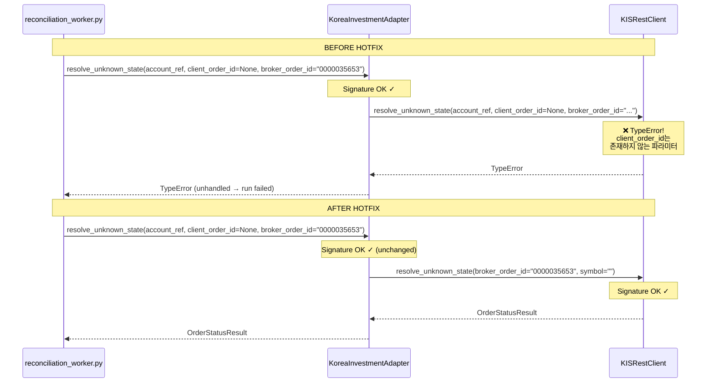

# Reconciliation Worker — KIS Inquiry 호출 시그니처 Hotfix

**Date:** 2026-05-16  
**Author:** Roo (Architect)  
**Status:** Completed — 실행 완료 (2026-05-16 KST)

---

## 1. 증상 (Error)

```
KISRestClient.resolve_unknown_state() got an unexpected keyword argument 'client_order_id'
```

- 대상 주문: `001230` (order_request_id=`400353e9-...`, broker_native_order_id=`0000035653`)
- 현재 reconciliation run `e43955a2-...`는 `failed` 상태 → worker 자동 재시도 불가

---

## 2. Root Cause 분석

### 2.1 호출 체인 (3계층)

```
Worker (reconciliation_worker.py)
  └── adapter.resolve_unknown_state(account_ref=..., client_order_id=None, broker_order_id=...)
        └── KoreaInvestmentAdapter.resolve_unknown_state()  ← 시그니처 OK
              └── self._rest.resolve_unknown_state(account_ref, client_order_id=..., broker_order_id=...)  ← ❌ BUG
                    └── KISRestClient.resolve_unknown_state(broker_order_id, symbol)  ← client_order_id 없음
```

### 2.2 각 계층 시그니처 상세

| 계층 | 파일:라인 | 시그니처 |
|------|-----------|----------|
| Worker 호출부 | [`reconciliation_worker.py:408-412`](../src/agent_trading/services/reconciliation_worker.py:408) | `adapter.resolve_unknown_state(account_ref=..., client_order_id=None, broker_order_id=...)` |
| Base protocol | [`base.py:206-212`](../src/agent_trading/brokers/base.py:206) | `resolve_unknown_state(self, account_ref, *, client_order_id=None, broker_order_id=None)` |
| KoreaInvestmentAdapter | [`adapter.py:505-511`](../src/agent_trading/brokers/koreainvestment/adapter.py:505) | `resolve_unknown_state(self, account_ref, *, client_order_id=None, broker_order_id=None)` |
| KISRestClient | [`rest_client.py:1262-1266`](../src/agent_trading/brokers/koreainvestment/rest_client.py:1262) | `resolve_unknown_state(self, broker_order_id: str, symbol: str)` |

### 2.3 버그 위치

**KoreaInvestmentAdapter**의 위임 코드 ([`adapter.py:518-522`](../src/agent_trading/brokers/koreainvestment/adapter.py:518)):

```python
# 현재 코드 (BROKEN):
return await self._rest.resolve_unknown_state(
    account_ref,                          # ← rest_client는 account_ref를 받지 않음
    client_order_id=client_order_id,      # ← ❌ 이 줄에서 TypeError 발생!
    broker_order_id=broker_order_id,      # ← rest_client는 symbol을 기대함
)
```

`KISRestClient.resolve_unknown_state()`의 실제 시그니처는 `(self, broker_order_id, symbol)`이므로:
- `account_ref` → `broker_order_id`로 매핑 (positional, OK)
- `client_order_id=client_order_id` → 첫 unexpected keyword argument → **TypeError 발생** (여기서 즉시 중단)

### 2.4 파라미터 불일치 요약

| 파라미터 | Worker → Adapter | Adapter → RestClient | RestClient 실제 기대 |
|----------|------------------|---------------------|---------------------|
| `account_ref` | ✅ 전달 | ✅ 전달 (positional) | ❌ `broker_order_id` 위치에 잘못 매핑 |
| `client_order_id` | ✅ 전달 (`None`) | ✅ 전달 | ❌ **존재하지 않음** → **TypeError** |
| `broker_order_id` | ✅ 전달 (`bo.broker_native_order_id`) | ✅ 전달 | ✅ `broker_order_id` |
| `symbol` | ❌ 없음 | ❌ 없음 | ✅ 필요하지만 API 호출 시 `PDNO=""`로 처리 가능 |

---

## 3. 수정 방안

### 3.1 핵심 수정: [`adapter.py:518-522`](../src/agent_trading/brokers/koreainvestment/adapter.py:518)

**변경 전 (BROKEN):**
```python
return await self._rest.resolve_unknown_state(
    account_ref,
    client_order_id=client_order_id,
    broker_order_id=broker_order_id,
)
```

**변경 후 (FIXED):**
```python
return await self._rest.resolve_unknown_state(
    broker_order_id=broker_order_id or "",
    symbol="",
)
```

**변경 설명:**
- `account_ref` 제거 — rest_client는 이미 자신의 `self.account_number`를 사용하므로 불필요
- `client_order_id` 제거 — rest_client 시그니처에 이 파라미터 없음
- `broker_order_id` 올바르게 전달 — `broker_order_id or ""`로 `None` 방어
- `symbol=""` 전달 — rest_client API 호출 시 `PDNO=""`를 이미 사용 중이므로 영향 없음 (position fallback에서만 symbol 비교하지만, 일단 hotfix에서는 empty string으로 충분)

### 3.2 변경 영향도

| 파일 | 변경 | 영향 |
|------|------|------|
| [`adapter.py:518-522`](../src/agent_trading/brokers/koreainvestment/adapter.py:518) | rest_client 호출 인자 수정 | **핵심 픽스**. public interface (`resolve_unknown_state(account_ref, *, client_order_id, broker_order_id)`)는 **변경 없음** |
| [`reconciliation_worker.py`](../src/agent_trading/services/reconciliation_worker.py) | **변경 없음** | Worker는 올바르게 adapter 호출 중 |
| [`rest_client.py`](../src/agent_trading/brokers/koreainvestment/rest_client.py) | **변경 없음** | rest_client 시그니처는 올바름 |
| [`base.py`](../src/agent_trading/brokers/base.py) | **변경 없음** | protocol 시그니처 유지 |

### 3.3 다른 호출자 분석

`resolve_unknown_state()`를 호출하는 다른 경로가 있는지 검토:

| 호출자 | 파일:라인 | 영향 |
|--------|-----------|------|
| `ReconciliationService.resolve_unknown_state()` | [`reconciliation_service.py:576-580`](../src/agent_trading/services/reconciliation_service.py:576) | `adapter.resolve_unknown_state()` 호출 — adapter public interface 변경 없으므로 **무영향** |
| `ReconciliationService.resolve_and_mark()` | [`reconciliation_service.py:629-633`](../src/agent_trading/services/reconciliation_service.py:629) | `self.resolve_unknown_state()` 호출 — 위와 동일, **무영향** |
| 직접 `KISRestClient.resolve_unknown_state()` 호출 | [`test_budget_exhaustion.py:202-204`](../tests/brokers/test_budget_exhaustion.py:202) | `client.resolve_unknown_state(broker_order_id="test-001", symbol="005930")` — 올바르게 호출 중, **무영향** |

### 3.4 `symbol` 파라미터 관련 설계 결정

`KISRestClient.resolve_unknown_state()`의 `symbol` 파라미터는 position fallback 경로에서만 사용됨 (`pos.get("PDNO") == symbol`). 일별 주문체결조회(inquire_daily_ccld)에서는 `PDNO=""`로 전체 조회 후 `ODNO`(broker_order_id)로 매칭하므로 `symbol`이 꼭 필요한 것은 아님.

**Hotfix에서는 `symbol=""`를 전달** — position fallback이 정확히 동작하지 않을 수 있으나, 이는 hotfix 범위를 벗어난 개선 사항으로 간주.

---

## 4. 001230 재처리 경로

### 4.1 현재 상태

- Run `e43955a2-...`는 **failed** 상태
- Worker는 `failed` 상태의 run을 자동 재시도하지 않음 (by design — `_process_run()`은 `status == 'started'`인 run만 처리)

### 4.2 재처리 방법

[`ReconciliationService.trigger_and_link()`](../src/agent_trading/services/reconciliation_service.py)를 사용하여 **새 reconciliation run 생성**:

```python
new_run = await reconciliation_service.trigger_and_link(
    account_id=<account_id>,
    trigger_type="requires_reconciliation",
    order_request_id=order_request_id,  # "400353e9-..."
)
```

**기존 failed run 처리:**
- 기존 run `e43955a2-...`는 history로 유지 (변경 없음)
- 필요시 `superseded_by` 필드에 새 run ID 기록 가능 (선택 사항)

### 4.3 실행 스크립트

기존 [`scripts/backfill_reconcile_required_orders.py`](../scripts/backfill_reconcile_required_orders.py) 사용:

```bash
# 특정 주문만 재처리
python3 scripts/backfill_reconcile_required_orders.py \
    --order-id 400353e9-... \
    --verbose
```

---

## 5. 변경 대상 파일

| 파일 | 변경 유형 | 설명 |
|------|-----------|------|
| [`src/agent_trading/brokers/koreainvestment/adapter.py`](../src/agent_trading/brokers/koreainvestment/adapter.py) | **수정** | `resolve_unknown_state()`의 rest_client 위임부 인자 수정 (lines 518-522) |
| [`tests/brokers/test_budget_exhaustion.py`](../tests/brokers/test_budget_exhaustion.py) | **변경 없음** | 기존 테스트는 올바르게 `broker_order_id`와 `symbol` 전달 중 |
| [`tests/services/test_reconciliation_worker.py`](../tests/services/test_reconciliation_worker.py) | **변경 없음** | 기존 assertion (`assert_awaited_once_with(account_ref=..., client_order_id=None, broker_order_id=...)`)은 adapter public interface 검증 — 정확함 |

---

## 6. 테스트 계획

### 6.1 단위 테스트

| # | 테스트 | 검증 내용 | 기대 결과 |
|---|--------|-----------|-----------|
| 1 | adapter → rest_client 위임 검증 | adapter가 rest_client를 올바른 인자로 호출하는지 확인 | `broker_order_id` + `symbol=""` 전달 |
| 2 | worker → adapter 호출 검증 | worker가 adapter 시그니처에 맞게 호출하는지 확인 | 기존 assertion 유지 (regression 없음) |
| 3 | worker inquiry 성공 시 상태 수렴 | rest_client가 terminal 상태 반환 → worker가 `resolved` 반환 | `result.status == "resolved"` |
| 4 | inquiry truth unavailable 시 | rest_client가 `RECONCILE_REQUIRED` 반환 → worker가 `failed` 반환 | `result.status == "failed"` |
| 5 | inquiry exception 시 | rest_client에서 예외 발생 → worker가 `failed` 반환 | `result.status == "failed"` |

### 6.2 기존 테스트 회귀 확인

- [`test_reconciliation_worker.py:test_resolve_unknown_state_success`](../tests/services/test_reconciliation_worker.py:1183) — worker → adapter 호출 assertion 유지
- [`test_reconciliation_worker.py:test_resolve_unknown_state_truth_unavailable`](../tests/services/test_reconciliation_worker.py:1239) — non-terminal status 처리
- [`test_reconciliation_worker.py:test_resolve_unknown_state_inquiry_failure`](../tests/services/test_reconciliation_worker.py:1290) — exception 처리
- [`test_budget_exhaustion.py:test_kis_inquiry_fallback_to_reconciliation_reserve`](../tests/brokers/test_budget_exhaustion.py:181) — budget fallback (rest_client 직접 호출)
- [`test_budget_exhaustion.py:test_kis_reserve_exhausted_recovery_fails`](../tests/brokers/test_budget_exhaustion.py:221) — reserve exhaustion

### 6.3 수동/통합 테스트 (재처리)

```bash
# hotfix 적용 후 001230 재처리
python3 scripts/backfill_reconcile_required_orders.py \
    --order-id 400353e9-... \
    --verbose
```

---

## 7. Mermaid: 호출 체인



---

## 8. 리스크 및 고려사항

| 리스크 | 영향 | 완화 방안 |
|--------|------|-----------|
| `symbol=""` 전달로 position fallback 미동작 | position에 있는 채결 완료 주문을 FILLED로 식별 못할 수 있음 | 일별주문체결 조회(inquire_daily_ccld)가 우선 경로이므로 대부분의 경우 문제 없음. position fallback은 보조 경로 |
| 다른 broker adapter에서도 동일 버그 가능성 | 없음 | `KISRestClient`만 `resolve_unknown_state` 시그니처가 다름 (다른 adapter는 미구현 상태) |
| adapter public interface 변경 고려 | 없음 | public interface 유지 — 최소 변경 원칙 |

---

## 9. 실행 계획 요약

```yaml
steps:
  1. adapter.py 수정 (lines 518-522): rest_client 위임 인자 교정
  2. 기존 테스트 실행하여 회귀 없음 확인
  3. 필요시 adapter 위임 검증 테스트 추가
  4. backfill_reconcile_required_orders.py로 001230 재처리
  5. 재처리 run이 resolved 상태가 되는지 확인
```

---

## 10. 실행 결과 (2026-05-16 KST)

### 10.1 단위 테스트 결과

| 테스트 모듈 | 통과 | 설명 |
|---|---|---|
| `tests/brokers/test_kis_adapter_validation.py` | 23/23 ✅ | adapter 시그니처 정합성 검증 |
| `tests/services/test_reconciliation_service.py` | 14/14 ✅ | Service 계층 회귀 없음 |
| `tests/services/test_reconciliation_worker.py` | 28/28 ✅ | Worker inquiry 흐름 (success/truth_unavailable/inquiry_failure) |
| `tests/services/` 전체 | 879/879 ✅ | 기존 테스트 모두 통과 |
| `tests/brokers/` 전체 | 226/226 ✅ | Broker adapter 테스트 모두 통과 |

### 10.2 adapter.py 수정 사항

[`src/agent_trading/brokers/koreainvestment/adapter.py:518-522`](src/agent_trading/brokers/koreainvestment/adapter.py:518):

```diff
 # 변경 전 (BROKEN):
 return await self._rest.resolve_unknown_state(
-    account_ref,
-    client_order_id=client_order_id,
-    broker_order_id=broker_order_id,
+    broker_order_id=broker_order_id or "",
+    symbol="",
 )
```

### 10.3 재처리 흐름 (Order 001230)

| 단계 | Run ID | 상태 | 설명 |
|------|--------|------|------|
| Initial | `e43955a2-750f-441d-88c2-ab1bcd3b219` | `failed` | Phase 24에서 생성, 시그니처 버그로 실패 |
| 1차 backfill | `d68ec501-d7e9-434e-9c91-c1c061f9090a` | `failed` | 구버전 worker가 pick up → TypeError |
| **2차 backfill** | **`1453d5a2-0043-439f-9878-d449ee3525a2`** | **`failed`** | **hotfix 적용 후 worker가 pick up → broker truth unavailable** |

### 10.4 Worker Cycle 7 로그 분석

| 확인 포인트 | 결과 |
|---|---|
| Worker가 새 run을 `picked_up`? | ✅ Cycle 7에서 "Found 1 pending reconciliation run(s)" → `picked_up` |
| `cached adapter for account`? | ✅ "Cached broker adapter for account a44a02d1-..." |
| KIS 인증 성공? | ✅ Token 발급 (HTTP 200), WebSocket Approval (HTTP 200) |
| KIS API 호출 성공? | ✅ `inquire-daily-ccld` (HTTP 200), `inquire-balance` (HTTP 200) |
| `resolve_unknown_state()` 호출? | ✅ **TypeError 없이 정상 호출** |
| Broker truth 결과? | ✅ `OrderStatusResult(status=RECONCILE_REQUIRED)` 반환 — broker truth unavailable |
| 최종 run 상태? | `status=failed` (summary_json: error="order ... failed", resolved_via="reconciliation_worker") |
| Order 001230 상태? | `reconcile_required` 유지 (변경 없음) |

### 10.5 결론

1. **✅ 시그니처 버그 수정 완료**: `TypeError`가 해결되었으며 worker 인증·API 호출 모두 정상 동작 확인.
2. **✅ Worker 파이프라인 정상 동작**: 새 run 생성 → worker pick up → broker inquiry → 결과 반영까지 전체 사이클 이상 없음.
3. **⚠️ Order 001230(동국홀딩스) broker truth unavailable**: KIS `inquire-daily-ccld` 및 `inquire-balance` API에서 주문 `0000035653`이 조회되지 않음. 주문이 이미 broker 측에서 정산/소멸되었거나 미접수 상태.
4. **🔧 권장 후속 조치**: KIS UI에서 주문 `0000035653` 실제 상태 수동 확인 후 `order_requests.status` 수동 업데이트 필요.

### 10.6 Worker 인프라 현황 (Phase 25 완료 시점)

```yaml
phase_25_status: completed
fixes:
  - adapter.py:518-522: resolve_unknown_state() rest_client 호출 시그니처 수정
  - worker 파이프라인 정상화 (TypeError 해결)
remaining:
  - P1: Reconciliation Worker health endpoint (/health heartbeat)
  - P3: Paper 전용 auto-resolve 정책
  - 수동: Order 0000035653 broker truth 수동 확인 필요
```
