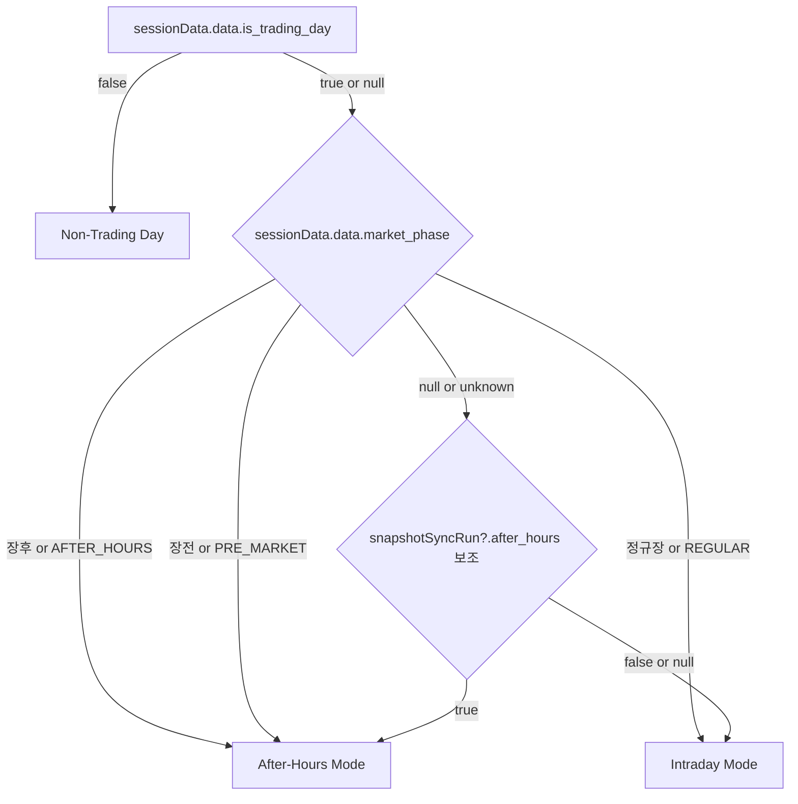
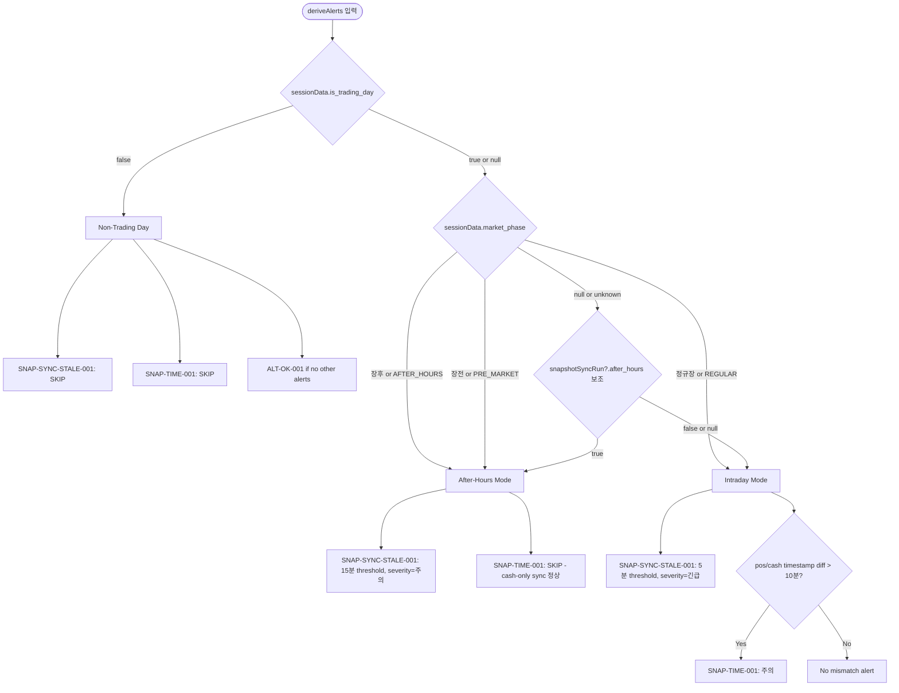

# Snapshot Alert Runtime Policy Refinement

**Date:** 2026-05-16  
**Author:** Architect  
**Status:** Draft / Ready for Review  

---

## 1. 현재 두 경고의 직접 원인 분석

### 1.1 SNAP-SYNC-STALE-001 (스냅샷 동기화 지연)

| 항목 | 내용 |
|------|------|
| **Rule ID** | `SNAP-SYNC-STALE-001` |
| **현재 level** | `긴급` |
| **로직** | `isStale(completed_at, 5)` — `completed_at`이 5분 이상 지나면 경고 |
| **소스** | [`alerts.ts:216-229`](../admin_ui/src/lib/alerts.ts:216) |

**직접 원인 분석:**

1. **비영업일 (주말/공휴일)**: 스케줄러가 실행되지 않으므로 `snapshot_sync_runs` 테이블에 새 row가 추가되지 않음. 마지막 영업일의 `completed_at`이 며칠 전이므로 항상 `isStale()`이 `true`를 반환 → **false positive 지속 발생**
2. **장후 after-hours**: after-hours 모드에서도 5분 간격으로 cash-only sync가 실행되므로 `completed_at`은 5분 이내로 갱신됨 → 지연 경고는 정상적으로 발생하지 않음 단, 스케줄러가 after-hours snapshot sync를 수행하지 않는 설정이라면(예: `--after-hours` 없이 snapshot-sync-loop만 standalone으로 실행) stale 가능
3. **스케줄러 비정상 종료**: 진짜 지연 케이스 — 스케줄러가 죽거나 DB 연결이 끊기면 `completed_at`이 갱신되지 않아 경고 발생. **이 케이스는 유지해야 함**

**핵심 문제**: `isStale()` 함수가 세션 상태(`is_trading_day`, `after_hours`)를 전혀 고려하지 않음. 비영업일에는 영원히 경고가 해제되지 않음.

### 1.2 SNAP-TIME-001 (현금/포지션 스냅샷 시각 불일치)

| 항목 | 내용 |
|------|------|
| **Rule ID** | `SNAP-TIME-001` |
| **현재 level** | `주의` |
| **로직** | `posTime - cashTime` > 10분 → 경고, `after_hours === true` 면제 |
| **소스** | [`alerts.ts:231-252`](../admin_ui/src/lib/alerts.ts:231) |

**직접 원인 분석:**

1. **장후 after-hours cash-only sync**: 
   - [`koreainvestment/snapshot.py:92-94`](../src/agent_trading/brokers/koreainvestment/snapshot.py:92)에서 `after_hours=True`면 position fetch를 **skip**함
   - cash는 5분 간격으로 계속 갱신되지만 position `snapshot_at`은 마지막 intraday sync 시각에 고정됨
   - 장후 시간이 지날수록 position-cash timestamp 차이가 **점점 더 커짐** (1시간, 2시간, ...)
   - 현재 `after_hours` 면제 조건: `input.snapshotSyncRun?.after_hours === true`
   - **문제**: `snapshotSyncRun`은 최신 1건만 가져옴. 만약 마지막 실행 이후 몇 시간이 지나서 최신 run이 after-hours run이 아니라 intraday run이라면? → 면제 조건이 false → 경고 발생
   
2. **비영업일**: 
   - position과 cash 모두 업데이트 안 됨
   - 둘 다 같은 시점에 마지막 업데이트되었으므로 diff가 10분 미만일 가능성 높음
   - 하지만 position은 `snapshot_at`이 intraday 시각, cash는 after-hours 마지막 run 시각이라면? (전날 영업일에서 after-hours까지 sync된 경우) → diff가 커짐

3. **`after_hours` 면제 조건의 취약성**:
   - `input.snapshotSyncRun?.after_hours`는 최신 1건의 run만 확인
   - if 최신 run이 `after_hours=false` (예: 다음날 pre-market run) → position이 업데이트되어 diff가 다시 작아짐 → 일시적으로 해결되지만, after-hours 모드로 다시 진입하면 동일 문제 재발
   - if snapshotSyncRun이 null이면 → 면제 조건이 false → 항상 경고 (비영업일에도)

---

## 2. 장중 / 장후 / 비영업일별 정책

### 2.1 세션 상태 판단 로직

현재 [`AlertRuleInput`](../admin_ui/src/lib/alerts.ts:21)이 제공하는 정보:

| 필드 | 출처 | 용도 |
|------|------|------|
| `sessionData` | `GET /market-sessions/latest` | `is_trading_day`, `market_phase`, `source` |
| `schedulerHealth` | `GET /health → scheduler` | `is_trading_day`, `healthy`, `last_heartbeat_at` |
| `snapshotSyncRun` | `GET /snapshot-sync-runs?limit=1` | `after_hours`, `status`, `completed_at` |

**세션 상태 결정 (변경됨):**

판정 우선순위:
1. **1순위**: `sessionData.data.is_trading_day` (boolean) — 현재 시점의 실시간 세션 상태 반영
2. **2순위**: `sessionData.data.market_phase` (string, e.g. `"정규장"` / `"장후"` / `"장전"`) — after-hours 여부 확인
3. **3순위 (보조)**: `snapshotSyncRun.after_hours` (boolean) — run 단위 속성, 신뢰도 낮음

**변경 이유**: `snapshotSyncRun.after_hours`는 run 단위 속성이라 늦게 남겨지거나 이전 run 기준일 수 있어 신뢰도가 낮음. `sessionData`는 현재 시점의 실시간 세션 상태를 반영하므로 더 안전함.



**보조 판정 설명**: `market_phase`가 null이거나 알 수 없는 값인 경우에만 `snapshotSyncRun.after_hours`를 fallback으로 사용. 이는 `snapshotSyncRun`이 이전 run 기준일 가능성을 고려하여 우선순위를 낮춘 설계.

### 2.2 SNAP-SYNC-STALE-001 정책

| 세션 | 동작 | Threshold | 설명 |
|------|------|-----------|------|
| **Intraday** | 경고 유지 (`긴급`) | 5분 (현행 유지) | 스케줄러가 5분마다 sync → 5분이 적절 |
| **After-hours** | 경고 유지 but severity `주의` | 15분 | cash-only sync도 5분 간격이나, KIS after-hours API 응답 지연 가능성 고려 |
| **Non-Trading Day** | 경고 생성 안 함 | N/A | 스케줄러가 실행되지 않음. snapshotSyncRun의 `completed_at`은 정상 과거 시각 |
| **snapshotSyncRun 없음** | SNAP-SYNC-003b에서 이미 처리 | N/A | 변경 없음 |

**의사결정 근거:**
- 비영업일에 경고를 생성하지 않는 이유: 스케줄러가 비영업일을 인지하고 idle 상태로 진입함 ([`run_near_real_ops_scheduler.py:1243-1259`](../scripts/run_near_real_ops_scheduler.py:1243)). 따라서 sync가 안 되는 것은 정상.
- After-hours 15분 threshold: KIS after-hours API(`AFHR_FLPR_YN=Y`)는 장중보다 응답이 느릴 수 있음. 5분으로 유지하면 false positive 가능성.

### 2.3 SNAP-TIME-001 정책

| 세션 | 동작 | Threshold | 설명 |
|------|------|-----------|------|
| **Intraday** | 경고 유지 (`주의`) | 10분 (현행 유지) | position + cash 모두 sync되어야 함 |
| **After-hours** | 경고 생성 안 함 | N/A | position이 의도적으로 업데이트되지 않음. cash-only sync는 정상 |
| **Non-Trading Day** | 경고 생성 안 함 | N/A | 둘 다 업데이트 안 됨 |
| **snapshotSyncRun 없음** | 경고 생성 안 함 | N/A | sync가 한 번도 없으면 비교 자체가 무의미 |

**After-hours 면제 조건 개선:**
- 현재: `input.snapshotSyncRun?.after_hours === true` (최신 1건만 확인)
- 개선: `input.snapshotSyncRun?.after_hours === true` **OR** `input.schedulerHealth?.is_trading_day === true` AND `input.sessionData?.data?.market_phase === 'AFTER_HOURS'`
- 또는 더 간단하게: `snapshotSyncRun?.after_hours === true`로 충분한지 검증 필요

**검증**: after-hours 모드가 되면 스케줄러가 `--after-hours` 플래그로 snapshot sync를 실행하고, DB에 `after_hours=true`로 저장. 따라서 최신 run의 `after_hours`가 곧 현재 세션 상태를 반영함. 단, 스케줄러가 EOD 이후 한동안 실행되지 않은 경우(예: after-hours window 종료) 최신 run이 after-hours가 아닐 수 있음.

**개선된 after-hours 면제 조건**:
```
isAfterHours = snapshotSyncRun?.after_hours === true 
  || (scheduler?.is_trading_day === true && latestCashSnapshotAt이 15분 이내)
```
- 이유: after-hours cash-only sync가 정상 동작 중이라면 cash timestamp가 최신이어야 함

---

## 3. 규칙 수정 내용

### 3.1 프런트엔드 [`alerts.ts`](../admin_ui/src/lib/alerts.ts) 변경

#### 변경 1: 헬퍼 함수 추출 (신규)

`isTradingDay` 편의 필드를 인터페이스에 추가하는 대신, **헬퍼 함수**를 추출하여 일관된 세션 판정 로직을 제공:

```typescript
// 헬퍼: isNonTradingDay — sessionData 우선
function isNonTradingDay(input: AlertRuleInput): boolean {
  // 1순위: sessionData.is_trading_day
  if (input.sessionData?.data?.is_trading_day === false) return true;
  if (input.sessionData?.data?.is_trading_day === true) return false;
  // fallback: schedulerHealth
  return input.schedulerHealth?.is_trading_day === false;
}

// 헬퍼: isAfterHours — market_phase 우선, snapshotSyncRun.after_hours는 보조
function isAfterHours(input: AlertRuleInput): boolean {
  // 2순위: sessionData.market_phase
  const phase = input.sessionData?.data?.market_phase;
  if (phase === "장후" || phase === "AFTER_HOURS") return true;
  if (phase === "정규장" || phase === "REGULAR") return false;
  // 3순위 (보조): snapshotSyncRun.after_hours
  return input.snapshotSyncRun?.after_hours === true;
}
```

**변경 이유**: `sessionData.data.is_trading_day`를 1순위, `market_phase`를 2순위로 사용하며, `schedulerHealth.is_trading_day`는 `sessionData`가 null일 때만 fallback으로 사용.

#### 변경 2: `SNAP-SYNC-STALE-001` 수정

`isNonTradingDay()` / `isAfterHours()` 헬퍼는 변경 1에 정의. 여기서는 이 헬퍼를 사용하는 alert 로직만 변경:

```typescript
// SNAP-SYNC-STALE-001: 스냅샷 동기화 지연 (세션 인지)
if (!input.snapshotSyncError && input.snapshotSyncRun) {
  const nonTradingDay = isNonTradingDay(input);
  const afterHours = isAfterHours(input);
  
  // 비영업일: alert 스킵 (스케줄러가 실행되지 않음)
  if (nonTradingDay) {
    // 비영업일에는 이 alert를 생성하지 않음
  } else if (afterHours) {
    // After-hours: 15분 threshold, severity=주의
    if (isStale(input.snapshotSyncRun.completed_at, 15)) {
      alerts.push({
        id: "SNAP-SYNC-STALE-001",
        level: "주의",
        title: "스냅샷 동기화 지연 (After-Hours)",
        description: `장후 현금 동기화 지연. 마지막 동기화: ${formatKstDateTime(input.snapshotSyncRun.completed_at)}`,
        time: now,
        status: "OPEN",
      });
    }
  } else {
    // Intraday: 5분 threshold, severity=긴급 (현행 유지)
    if (isStale(input.snapshotSyncRun.completed_at, 5)) {
      alerts.push({
        id: "SNAP-SYNC-STALE-001",
        level: "긴급",
        title: "스냅샷 동기화 지연",
        description: !input.snapshotSyncRun.completed_at
          ? "최근 스냅샷 동기화가 완료되지 않았습니다."
          : `마지막 동기화: ${formatKstDateTime(input.snapshotSyncRun.completed_at)}`,
        time: now,
        status: "OPEN",
      });
    }
  }
}
```

#### 변경 3: `SNAP-TIME-001` 수정

**세션 판정 헬퍼 로직 변경** (SNAP-SYNC-STALE-001과 동일한 헬퍼 사용):
- `isTradingDay` → `isNonTradingDay()` 헬퍼로 대체 (sessionData 1순위)
- `isAfterHours` → `isAfterHours()` 헬퍼로 대체 (market_phase 2순위, snapshotSyncRun.after_hours 3순위)

```typescript
// SNAP-TIME-001: 현금/포지션 스냅샷 시각 불일치 (세션 인지)
if (input.latestPositionSnapshotAt && input.latestCashSnapshotAt) {
  const nonTradingDay = isNonTradingDay(input);
  const afterHours = isAfterHours(input);
  
  // 비영업일 또는 after-hours: alert 스킵
  if (nonTradingDay || afterHours) {
    // 비영업일: position/cash 모두 업데이트 안 됨 → 비교 무의미
    // after-hours: position이 의도적으로 업데이트 안 됨 → 정상
  } else {
    const posTime = new Date(input.latestPositionSnapshotAt).getTime();
    const cashTime = new Date(input.latestCashSnapshotAt).getTime();
    const diffMs = Math.abs(posTime - cashTime);
    if (diffMs > 10 * 60 * 1000) {
      const diffMin = Math.round(diffMs / 60000);
      alerts.push({
        id: "SNAP-TIME-001",
        level: "주의",
        title: "현금/포지션 스냅샷 시각 불일치",
        description: `포지션 스냅샷과 현금 스냅샷의 갱신 시각이 ${diffMin}분 차이납니다. 데이터 정합성을 확인하세요.`,
        time: now,
        status: "OPEN",
      });
    }
  }
}
```

#### 변경 4: 설명 문구 개선

| Rule ID | 현재 설명 | 개선 설명 |
|---------|-----------|-----------|
| SNAP-SYNC-STALE-001 | `마지막 동기화: {time}` | (Intraday) `마지막 동기화: {time}` (After-hours) `장후 현금 동기화 지연. 마지막 동기화: {time}` |
| SNAP-TIME-001 | `포지션 스냅샷과 현금 스냅샷의 갱신 시각이 {n}분 차이납니다. 데이터 정합성을 확인하세요.` | (Intraday, 현행 유지) `포지션/현금 스냅샷 갱신 시각이 {n}분 차이납니다. KIS 잔고조회 상태를 확인하세요.` |

### 3.2 백엔드 API 변경

**현재**: [`GET /market-sessions/latest`](../src/agent_trading/api/routes/sessions.py)가 제공하는 [`SchedulerStatusResponse`](../src/agent_trading/api/schemas.py:802)와 [`/health`의 `scheduler`](../src/agent_trading/api/routes/health.py:74)가 각각 세션 상태 정보를 제공함.

**변경 필요 없음** — 현재 API로도 충분한 정보를 얻을 수 있음 (판정 우선순위 순):

| 우선순위 | API 필드 | 용도 |
|----------|----------|------|
| 1순위 | `sessionData.data.is_trading_day` | 거래일 여부 |
| 2순위 | `sessionData.data.market_phase` | 장운영 phase (정규장/장후/장전) |
| 3순위 (보조) | `snapshotSyncRun.after_hours` | after-hours 모드 여부 (fallback) |

#### 대안: 최근 성공 run 기준

`completed_at`만 보면 실패한 run이나 부분 run이 섞였을 때 해석이 흔들릴 수 있음.

**제안:** `snapshotSyncRun.success === true`인 run의 `completed_at`만 stale 계산 대상으로 삼는 것이 더 정확함. 즉, 가장 최근에 **성공적으로 완료된** run의 시각을 기준으로 지연 여부를 판단.

**현재 구조 제약:**
- [`AlertRuleInput`](../admin_ui/src/lib/alerts.ts:21) 인터페이스는 단일 `snapshotSyncRun`만 전달받음
- 이 대안을 적용하려면 **백엔드 API 변경**이 필요:
  1. `SnapshotSyncRunHealthSummary`에 `last_successful_completed_at` 필드 추가
  2. 또는 `OperationsAlertsView.tsx`에서 여러 run을 fetch하여 필터링

**현재 턴에서는 현 구조 유지**, 이 항목은 문서末尾의 "향후 개선사항 (TODO)"에 기록함.

---

## 4. 설명 문구 개선 방안

### 4.1 SNAP-SYNC-STALE-001 문구

**Intraday (현행 유지)**:
- 제목: `스냅샷 동기화 지연`
- 설명: `마지막 동기화: {time}. 스케줄러 상태를 확인하세요.`

**After-hours**:
- 제목: `스냅샷 동기화 지연 (After-Hours)`
- 설명: `장후 현금 동기화가 {time} 이후 갱신되지 않았습니다. after-hours 스케줄러를 확인하세요.`

### 4.2 SNAP-TIME-001 문구

**Intraday**:
- 제목: `현금/포지션 스냅샷 시각 불일치` (현행 유지)
- 설명: `포지션 스냅샷({posTime})과 현금 스냅샷({cashTime})의 갱신 시각이 {n}분 차이납니다. KIS 잔고조회 연결 상태를 확인하세요.`

---

## 5. 테스트 계획

### 5.1 단위 테스트 (alerts.ts)

`deriveAlerts()`는 순수 함수이므로 단위 테스트가 용이함.

| TC | 시나리오 | 기대 결과 |
|----|----------|-----------|
| TC-1 | Intraday, completed_at 3분 전 | SNAP-SYNC-STALE-001 없음 |
| TC-2 | Intraday, completed_at 10분 전 | SNAP-SYNC-STALE-001 (긴급) |
| TC-3 | After-hours, completed_at 10분 전 | SNAP-SYNC-STALE-001 없음 (15분 threshold) |
| TC-4 | After-hours, completed_at 20분 전 | SNAP-SYNC-STALE-001 (주의) |
| TC-5 | Non-trading day, completed_at 1일 전 | SNAP-SYNC-STALE-001 없음 |
| TC-6 | Intraday, pos/cash diff 3분 | SNAP-TIME-001 없음 |
| TC-7 | Intraday, pos/cash diff 15분 | SNAP-TIME-001 (주의) |
| TC-8 | After-hours, pos/cash diff 60분 | SNAP-TIME-001 없음 (after-hours 면제) |
| TC-9 | Non-trading day, pos/cash diff 30분 | SNAP-TIME-001 없음 |
| TC-10 | snapshotSyncRun null, is_trading_day=true | SNAP-SYNC-003b (긴급) — 변경 없음 |
| TC-11 | snapshotSyncRun null, is_trading_day=false | SNAP-SYNC-003b (긴급) — **논의 필요**: 비영업일에 sync history 없으면 정상일 수 있음 |
| TC-12 | sessionData.market_phase="장후", snapshotSyncRun.after_hours=false, completed_at 20분 전 | SNAP-SYNC-STALE-001 (주의) — market_phase 우선 |
| TC-13 | sessionData.market_phase="정규장", snapshotSyncRun.after_hours=true, completed_at 20분 전 | SNAP-SYNC-STALE-001 (긴급) — market_phase가 정규장이므로 after_hours 무시 |
| TC-14 | sessionData.is_trading_day=false, schedulerHealth.is_trading_day=true | SNAP-SYNC-STALE-001 없음 — sessionData 우선 |
| TC-15 | sessionData=null, schedulerHealth.is_trading_day=true, market_phase=null, snapshotSyncRun.after_hours=true, completed_at 20분 전 | SNAP-SYNC-STALE-001 (주의) — sessionData null이면 fallback |
| TC-16 | sessionData.market_phase="장전", completed_at 20분 전 | SNAP-SYNC-STALE-001 (주의) — 장전도 after-hours로 간주 |

### 5.2 통합 테스트 계획

1. Docker 컨테이너 재빌드 후 `/health` 호출 → scheduler 정보 확인
2. `GET /snapshot-sync-runs?limit=1` → 최신 run의 `after_hours`, `completed_at` 확인
3. `GET /market-sessions/latest` → `is_trading_day`, `market_phase` 확인
4. 프런트엔드 운영 경고 화면 로드 → 경고 리스트 검증

---

## 6. 남은 Follow-up

### 6.1 즉시 구현

| # | 작업 | 파일 | 우선순위 |
|---|------|------|----------|
| 1 | SNAP-SYNC-STALE-001 수정 (비영업일 skip + after-hours 15min threshold) | [`alerts.ts`](../admin_ui/src/lib/alerts.ts) | P0 |
| 2 | SNAP-TIME-001 수정 (비영업일 skip) | [`alerts.ts`](../admin_ui/src/lib/alerts.ts) | P0 |
| 3 | 설명 문구 개선 | [`alerts.ts`](../admin_ui/src/lib/alerts.ts) | P1 |
| 4 | `npm run build` 확인 | admin_ui | P0 |

### 6.2 향후 과제

| # | 과제 | 설명 | 우선순위 |
|---|------|------|----------|
| 1 | **SNAP-SYNC-STALE-001 stale threshold 설정화** | 현재 하드코딩 5분. 환경변수 또는 API에서 threshold를 받아오도록 개선 | P2 |
| 2 | **`after_hours` 플래그 fallback** | snapshotSyncRun이 null일 때 scheduler 상태만으로 after-hours 감지 | P2 |
| 3 | **market_phase 기반 alert 조건 추가** | `sessionData.data.market_phase`가 `AFTER_HOURS`면 after-hours로 간주 (backup) | P2 |
| 4 | **비영업일 SNAP-SYNC-003b 처리** | 비영업일에 snapshotSyncRun이 null이면 정상. SNAP-SYNC-003b를 비영업일에는 skip? 현재는 긴급으로 뜸 | P3 |
| 5 | **스냅샷 동기화 지연 운영 메트릭 수집** | stale 발생 시점, 지속 시간, 해소 시간을 DB에 기록 | P3 |

### 6.3 논의 필요 사항

1. **SNAP-SYNC-003b (snapshot history 없음)를 비영업일에도 생성할까?**
   - 현재: 항상 `긴급`으로 생성
   - 제안: `is_trading_day === false`면 생성하지 않음. 신규 시스템에서 첫 기동 전 비영업일에는 정상이므로
   - 단점: 첫 영업일에도 history가 없으면 경고가 안 뜰 수 있음 → SNAP-SYNC-STALE-001이 대신 감지

2. **After-hours cash-only sync가 중단된 경우 감지 방법**
   - 현재: SNAP-SYNC-STALE-001이 15분 threshold로 감지
   - 대안: cash timestamp만 별도로 추적하여 전용 alert 생성

---

## 부록: 관련 소스 코드 참조

| 파일 | 주요 내용 |
|------|-----------|
| [`admin_ui/src/lib/alerts.ts`](../admin_ui/src/lib/alerts.ts) | **수정 대상** — 현재 alert rule 구현 |
| [`admin_ui/src/types/api.ts`](../admin_ui/src/types/api.ts) | TypeScript 타입 정의 (변경 불필요) |
| [`admin_ui/src/components/OperationsAlertsView.tsx`](../admin_ui/src/components/OperationsAlertsView.tsx) | alert data fetching (변경 불필요) |
| [`src/agent_trading/services/kis_snapshot_sync.py`](../src/agent_trading/services/kis_snapshot_sync.py) | snapshot sync run entity 생성, after_hours 플래그 |
| [`src/agent_trading/brokers/koreainvestment/snapshot.py`](../src/agent_trading/brokers/koreainvestment/snapshot.py) | after-hours mode에서 position fetch skip |
| [`src/agent_trading/services/snapshot_sync.py`](../src/agent_trading/services/snapshot_sync.py) | broker-agnostic sync runner, after_hours 전파 |
| [`src/agent_trading/services/market_session.py`](../src/agent_trading/services/market_session.py) | 세션 상태 판단 (trading day, market phase) |
| [`scripts/run_near_real_ops_scheduler.py`](../scripts/run_near_real_ops_scheduler.py) | 스케줄러: after-hours 모드 전환, 비영업일 idle |
| [`scripts/run_snapshot_sync_loop.py`](../scripts/run_snapshot_sync_loop.py) | snapshot sync loop: `--after-hours` 플래그 |

---

## 부록: Mermaid — 세션별 Alert 동작 흐름 (변경됨)



---

### 향후 개선사항 (TODO)

#### TODO-1: SNAP-SYNC-STALE-001 — 최근 성공 run 기준

**문제**: `completed_at`만 보면 실패한 run이나 부분 run이 섞였을 때 해석이 흔들릴 수 있음.

**제안**: `snapshotSyncRun.success === true`인 run의 `completed_at`만 stale 계산 대상으로 삼는 것이 더 정확함. 즉, 가장 최근에 **성공적으로 완료된** run의 시각을 기준으로 지연 여부를 판단.

**필요한 변경사항**:
1. [`SnapshotSyncRunHealthSummary`](../admin_ui/src/types/api.ts)에 `last_successful_completed_at: string | null` 필드 추가
2. 백엔드 [`GET /snapshot-sync-runs`](../src/agent_trading/api/routes/snapshot_sync_runs.py)가 success=true인 run 중 가장 최근 `completed_at`을 함께 반환
3. 또는 프런트엔드 [`OperationsAlertsView.tsx`](../admin_ui/src/components/OperationsAlertsView.tsx)에서 여러 run을 fetch하여 직접 필터링

**현재 턴에서는 현 구조 유지** — 위 변경사항은 별도 이슈로 추적.

#### TODO-2: Section 6.2 항목 중 일부는 이미 반영됨

| 이전 항목 | 현재 상태 |
|-----------|----------|
| `after_hours` 플래그 fallback (P2) | 문서 변경으로 `sessionData.market_phase`가 2순위, `snapshotSyncRun.after_hours`가 3순위 보조로 변경됨 |
| market_phase 기반 alert 조건 추가 (P2) | 위와 동일 — market_phase가 2순위 판정 기준으로 격상됨 |

#### TODO-3: SNAP-SYNC-003b 비영업일 처리 검토

- 현재: `is_trading_day`와 관계없이 항상 `긴급` 생성
- 검토 필요: `sessionData.is_trading_day === false`면 SNAP-SYNC-003b도 skip
- 단, 첫 영업일에도 history가 없으면 SNAP-SYNC-STALE-001이 대신 감지 가능한지 확인 필요
