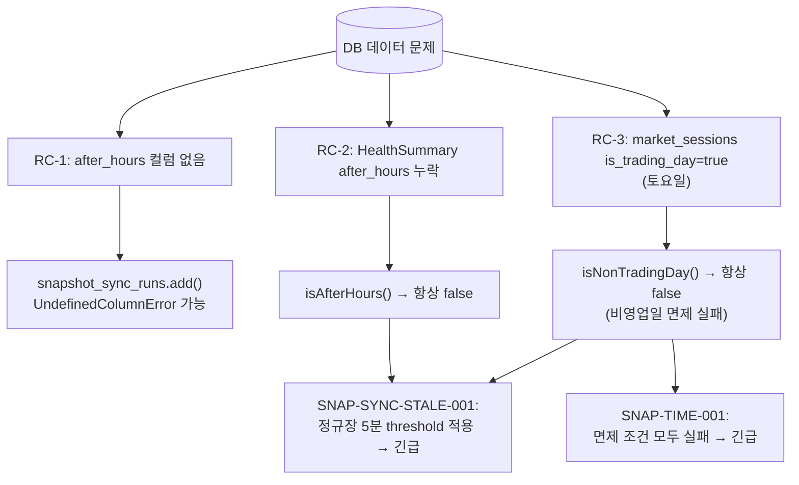

# Snapshot Alert 세션 정합성 Hotfix

**작성일**: 2026-05-16  
**상태**: 설계 완료 (Code 모드 구현 대기)  
**우선순위**: P0 (긴급 — 운영 alert false positive 발생 중)  

---

## 1. Root Cause (원인 분석)

### RC-1: Migration `0016_add_after_hours_to_snapshot_sync_runs.sql` 미적용

| 항목 | 내용 |
|------|------|
| 증상 | [`snapshot_sync_runs`](../../db/migrations/0016_add_after_hours_to_snapshot_sync_runs.sql:1) 테이블에 `after_hours` 컬럼이 없음 |
| 원인 | Migration 파일은 존재하지만, Docker startup 시 자동 실행되는 migration 진입점이 없음 |
| 상세 | - [`run.py:92-119`](../../src/agent_trading/db/migrations/run.py:92)의 `run_all_migrations()`는 `sorted(directory.glob("*.sql"))`로 모든 SQL 파일을 실행하도록 구현되어 있음<br>- 그러나 [`docker-compose.yml:102`](../../docker-compose.yml:102)의 `app` 서비스는 `command: ["tail", "-f", "/dev/null"]`로 migration을 호출하지 않음<br>- [`api` 서비스](../../docker-compose.yml:169-176)의 `command`도 직접 `uvicorn` 실행만 수행<br>- 따라서 수동(`make docker-migrate`) 실행以外에는 반영되지 않음 |
| 영향 | [`PostgresSnapshotSyncRunRepository.add()`](../../src/agent_trading/repositories/postgres/snapshot_sync_runs.py:38)가 `after_hours`를 INSERT하려고 시도 → DB에 컬럼이 없어 `UndefinedColumnError` 발생 가능 |

```sql
-- db/migrations/0016_add_after_hours_to_snapshot_sync_runs.sql
ALTER TABLE trading.snapshot_sync_runs
  ADD COLUMN after_hours BOOLEAN NOT NULL DEFAULT false;
```

---

### RC-2: `SnapshotSyncRunHealthSummary`에 `after_hours` 필드 누락

**2개 레이어에서 누락 확인**

#### Layer 1 — Contracts (Python dataclass)

[`contracts.py:42-67`](../../src/agent_trading/repositories/contracts.py:42)의 `SnapshotSyncHealthSummary` dataclass에는 `after_hours` 필드가 **없음**:

```python
@dataclass(slots=True, frozen=True)
class SnapshotSyncHealthSummary:
    last_run_started_at: datetime | None
    last_run_completed_at: datetime | None
    last_status: str | None
    last_successful_run_at: datetime | None
    consecutive_failures: int
    is_stale: bool
    stale_threshold_seconds: int
    # ❌ after_hours 필드 누락
```

해당 dataclass를 생성하는 [`get_sync_health_summary()`](../../src/agent_trading/repositories/postgres/snapshot_sync_runs.py:155-163)의 return문도 `after_hours` 없이 구성되어 있음:

```python
return SnapshotSyncHealthSummary(
    last_run_started_at=last.started_at,
    last_run_completed_at=last.completed_at,
    last_status=last.status,
    last_successful_run_at=last_successful_at,
    consecutive_failures=consecutive_failures,
    is_stale=is_stale,
    stale_threshold_seconds=stale_threshold_seconds,
    # ❌ after_hours 누락
)
```

#### Layer 2 — Pydantic Schema (API response model)

[`schemas.py:216-238`](../../src/agent_trading/api/schemas.py:216)의 `SnapshotSyncRunHealthSummary` Pydantic model에도 `after_hours` 필드가 **없음**:

```python
class SnapshotSyncRunHealthSummary(BaseModel):
    last_run_started_at: datetime | None = None
    last_run_completed_at: datetime | None = None
    last_status: str | None = None
    last_successful_run_at: datetime | None = None
    consecutive_failures: int = 0
    is_stale: bool = True
    stale_threshold_seconds: int = 900
    # ❌ after_hours 필드 누락
```

해당 model을 생성하는 [`route handler`](../../src/agent_trading/api/routes/snapshot_sync_runs.py:97-105)도 `after_hours`를 전달하지 않음.

#### Layer 3 — Frontend TypeScript type

[`api.ts:308-316`](../../admin_ui/src/types/api.ts:308)의 `SnapshotSyncRunHealthSummary` 인터페이스에도 `after_hours` 필드가 **없음**:

```typescript
export interface SnapshotSyncRunHealthSummary {
  last_run_started_at: string | null;
  last_run_completed_at: string | null;
  last_status: string | null;
  last_successful_run_at: string | null;
  consecutive_failures: number;
  is_stale: boolean;
  stale_threshold_seconds: number;
  // ❌ after_hours 필드 누락
}
```

**참고**: [`SnapshotSyncRunSummary`](../../src/agent_trading/api/schemas.py:209) (개별 run response)에는 `after_hours: bool = False`가 **이미 존재**함. 누락된 것은 오직 **health summary** 타입뿐.

#### 영향 — alert rule `isAfterHours()` 실패

[`alerts.ts:76-85`](../../admin_ui/src/lib/alerts.ts:76)의 `isAfterHours()`는 2순위 fallback으로 `snapshotSyncRun.after_hours`를 참조:

```typescript
function isAfterHours(input: AlertRuleInput): boolean {
  if (input.sessionData?.data?.market_phase !== undefined && ...) {
    // 1순위: market_phase 문자열 판정
    return phase.includes("장후") || phase.includes("after") || phase.includes("after-hours");
  }
  if (input.snapshotSyncRun?.after_hours !== undefined) {
    // 2순위: snapshotSyncRun.after_hours boolean 판정
    return input.snapshotSyncRun.after_hours === true;
  }
  return false;
}
```

1순위(`market_phase`)가 실패하고, 2순위(`after_hours` boolean)도 health summary에 필드가 없어 항상 `undefined` → `false` 반환.

---

### RC-3: `market_sessions` 데이터 오염

| 항목 | 내용 |
|------|------|
| 증상 | `run_date=2026-05-16` (토요일) row가 `is_trading_day=true, market_phase=None`으로 저장됨 |
| 원인 | 정확한 원인은 파악되지 않았으나, scheduler가 비영업일에도 session provider를 정상 호출하지 못하고 persist한 것으로 추정 |
| 상세 | [`_persist_session_state()`](src/agent_trading/services/run_near_real_ops_scheduler.py:866-935)는 scheduler 실행 중에만 호출되므로, scheduler가 비정상 종료되면 DB가 업데이트되지 않음<br><br>[`FallbackSessionProvider`](../../src/agent_trading/services/market_session.py:251-259)는 주말(`weekday >= 5`)에 `is_trading_day=False`를 올바르게 반환하도록 구현되어 있으나, scheduler를 통해 persist되지 않음 |

#### 영향 — alert rule `isNonTradingDay()` 실패 연쇄

1. `isNonTradingDay()` → DB `is_trading_day=true` → `false` 반환 → 비영업일 면제 실패
2. `isAfterHours()` → DB `market_phase=None` → 1순위 실패, health summary에 `after_hours` 없음 → 2순위 실패 → `false` 반환
3. **SNAP-SYNC-STALE-001**: 정규장 5분 threshold 적용 → **긴급** false positive
4. **SNAP-TIME-001**: 면제 조건 모두 실패 → **긴급** false positive

---

### RC-4: Alert false positive 연쇄 (요약)



---

## 2. 수정 사항

### Fix-A: Migration 실행 (P0)

**수동 실행 명령어**:
```bash
docker compose exec app python -m agent_trading.db.migrations.run
```

이미 존재하는 [`0016_add_after_hours_to_snapshot_sync_runs.sql`](../../db/migrations/0016_add_after_hours_to_snapshot_sync_runs.sql:1)을 DB에 적용. Migration runner(`run.py`)는 `DuplicateColumnError`를 graceful하게 처리하므로, 중복 실행에도 안전함.

---

### Fix-B: `SnapshotSyncRunHealthSummary`에 `after_hours` 필드 추가 (P0)

#### B-1: [`contracts.py:42`](../../src/agent_trading/repositories/contracts.py:42) — Dataclass 수정

`SnapshotSyncHealthSummary`에 `after_hours: bool` 필드 추가:

```python
@dataclass(slots=True, frozen=True)
class SnapshotSyncHealthSummary:
    last_run_started_at: datetime | None
    last_run_completed_at: datetime | None
    last_status: str | None
    last_successful_run_at: datetime | None
    consecutive_failures: int
    is_stale: bool
    stale_threshold_seconds: int
    after_hours: bool = False     # ← 추가 (기본값 false로 backward-compatible)
```

#### B-2: [`postgres/snapshot_sync_runs.py:155`](../../src/agent_trading/repositories/postgres/snapshot_sync_runs.py:155) — Repository 수정

`get_sync_health_summary()`의 return문에 `after_hours` 전달. `last` entity에는 이미 `after_hours` 속성이 있으므로 읽어서 전달:

```python
return SnapshotSyncHealthSummary(
    last_run_started_at=last.started_at,
    last_run_completed_at=last.completed_at,
    last_status=last.status,
    last_successful_run_at=last_successful_at,
    consecutive_failures=consecutive_failures,
    is_stale=is_stale,
    stale_threshold_seconds=stale_threshold_seconds,
    after_hours=last.after_hours,  # ← 추가
)
```

#### B-3: [`schemas.py:216`](../../src/agent_trading/api/schemas.py:216) — Pydantic model 수정

```python
class SnapshotSyncRunHealthSummary(BaseModel):
    last_run_started_at: datetime | None = None
    last_run_completed_at: datetime | None = None
    last_status: str | None = None
    last_successful_run_at: datetime | None = None
    consecutive_failures: int = 0
    is_stale: bool = True
    stale_threshold_seconds: int = 900
    after_hours: bool = False  # ← 추가
```

#### B-4: [`snapshot_sync_runs.py:97`](../../src/agent_trading/api/routes/snapshot_sync_runs.py:97) — Route handler 수정

`GET /snapshot-sync-runs/summary` 핸들러에 `after_hours` 전달:

```python
return SnapshotSyncRunHealthSummary(
    last_run_started_at=summary.last_run_started_at,
    last_run_completed_at=summary.last_run_completed_at,
    last_status=summary.last_status,
    last_successful_run_at=summary.last_successful_run_at,
    consecutive_failures=summary.consecutive_failures,
    is_stale=summary.is_stale,
    stale_threshold_seconds=summary.stale_threshold_seconds,
    after_hours=summary.after_hours,  # ← 추가
)
```

#### B-5: [`admin_ui/src/types/api.ts:308`](../../admin_ui/src/types/api.ts:308) — TypeScript interface 수정

```typescript
export interface SnapshotSyncRunHealthSummary {
  last_run_started_at: string | null;
  last_run_completed_at: string | null;
  last_status: string | null;
  last_successful_run_at: string | null;
  consecutive_failures: number;
  is_stale: boolean;
  stale_threshold_seconds: number;
  after_hours: boolean;  // ← 추가
}
```

**영향도**:
- `contracts.py` 변경 → postgres repository의 mapper에서 `last.after_hours` 읽도록 수정 필요 (B-2)
- `schemas.py` 변경 → API response에 `after_hours` 자동 포함
- `route` 변경 → Pydantic model에 `after_hours` 전달
- `api.ts` 변경 → TypeScript 타입 정합성

---

### Fix-C: `market_sessions` 데이터 정정 (P0)

Docker PostgreSQL에서 직접 SQL 실행:

```sql
UPDATE trading.market_sessions
SET is_trading_day = false, market_phase = 'after-hours',
    reason = 'hotfix: 2026-05-16 is Saturday (non-trading day)',
    checked_at = NOW()
WHERE run_date = '2026-05-16';
```

또는 scheduler 재시작으로 자동 정정 유도. 단, scheduler가 정상 동작하지 않을 수 있으므로 SQL 직접 실행이 더 확실함.

**실행 명령어**:
```bash
docker compose exec -T db psql -U trading -d trading -c "
UPDATE trading.market_sessions
SET is_trading_day = false, market_phase = 'after-hours',
    reason = 'hotfix: 2026-05-16 is Saturday (non-trading day)',
    checked_at = NOW()
WHERE run_date = '2026-05-16';
"
```

---

### Fix-D: Docker migration 자동화 (P1)

[`docker-compose.yml`](../../docker-compose.yml)의 `api` 서비스 `command`에 migration 실행 명령어를 추가:

```yaml
# Before (line 169-176)
command:
  - uvicorn
  - agent_trading.api.app:create_app_from_env
  - --factory
  - --host
  - "0.0.0.0"
  - --port
  - "8000"

# After
command:
  - sh
  - -c
  - "python -m agent_trading.db.migrations.run && exec uvicorn agent_trading.api.app:create_app_from_env --factory --host 0.0.0.0 --port 8000"
```

**주의사항**:
- `.env` 수정 금지 (환경변수 변경 없이 `docker-compose.yml`만 수정)
- `exec` 사용으로 uvicorn이 PID 1을 상속받아 signal 처리가 정상 동작하도록 보장
- Migration 실패 시 컨테이너가 시작되지 않으므로, `run_migration`의 error handling이 정상인지 확인 필요

---

### Fix-E: Scheduler session persistence 보강 (P2)

`_persist_session_state()`가 scheduler의 모든 상태 천이에서 빠짐없이 호출되도록 보강:

| 천이 유형 | 현재 상태 | 개선 방안 |
|-----------|-----------|-----------|
| Market phase change | 호출됨 | 추가 조치 불필요 |
| Idle 전환 | 일부 누락 가능 | `set_state()` 내에서 호출 |
| `--once` 종료 | 누락 | 종료 직전 호출 |
| 비영업일 early termination | 누락 | `_handle_non_trading_day()` 내 호출 |

이 Fix는 P2로, 즉시 해결이 필요한 사항은 아님. 별도 이슈로 분리 가능.

---

## 3. 수정이 필요 없는 부분

| 컴포넌트 | 파일 | 이유 |
|----------|------|------|
| Alert rules | [`alerts.ts`](../../admin_ui/src/lib/alerts.ts) | 이미 session-aware 로직이 구현되어 있음. DB 데이터만 올바르면 정상 동작 |
| Frontend API types (individual run) | [`types/api.ts:285-306`](../../admin_ui/src/types/api.ts:285) | `SnapshotSyncRunSummary`에 `after_hours: boolean`이 **이미 정의**되어 있음 |
| Backend schemas (individual run) | [`schemas.py:209`](../../src/agent_trading/api/schemas.py:209) | `SnapshotSyncRunSummary`에 `after_hours: bool = False`가 **이미 존재** |
| Session provider 로직 | [`market_session.py`](../../src/agent_trading/services/market_session.py) | `FallbackSessionProvider`는 주말을 올바르게 감지하도록 구현되어 있음. 문제는 persist 레이어 |
| Migration runner | [`run.py`](../../src/agent_trading/db/migrations/run.py) | 이미 `DuplicateColumnError` 등 idempotent 실행 지원. 호출만 추가하면 됨 |

---

## 4. 테스트 계획

| ID | 설명 | 테스트 방법 | 기대 결과 | 비고 |
|----|------|------------|-----------|------|
| **TC-01** | Migration apply 검증 | `docker compose exec app python -m agent_trading.db.migrations.run` 실행 후 `\d trading.snapshot_sync_runs` | `after_hours` 컬럼 추가됨 | idempotent: 재실행해도 에러 없음 |
| **TC-02** | Health summary `after_hours` round-trip | `GET /snapshot-sync-runs/summary` 호출 | Response body에 `after_hours: false` 포함 (기본값) | Unit test + API test |
| **TC-03** | `market_sessions` 데이터 정정 후 session API | `GET /market-sessions/latest` 호출 | `is_trading_day=false`, `market_phase=after-hours` 반환 | Fix-C 실행 후 |
| **TC-04** | 수정된 데이터 기준 alert rule 동작 (비영업일) | Mock session data + mock health summary으로 alert derive | SNAP-SYNC-STALE-001 미발생, SNAP-TIME-001 미발생 | `isNonTradingDay=true` → alert skip |
| **TC-05** | 기존 영업일 alert rule 회귀 없음 | Mock 영업일 session data + stale snapshot | SNAP-SYNC-STALE-001 정상 발생 (level=긴급) | 기존 테스트 통과 확인 |
| **TC-06** | `docker-compose.yml` migration 자동화 | 컨테이너 재빌드 후 재기동, DB 컬럼 존재 확인 | `after_hours` 컬럼이 자동으로 추가됨 | Fix-D 적용 후 |

### 실행 방법

```bash
# TC-01: Migration
docker compose exec app python -m agent_trading.db.migrations.run

# TC-02: API 확인
curl -s http://localhost:8000/snapshot-sync-runs/summary | python -m json.tool

# TC-03: Session API
curl -s http://localhost:8000/market-sessions/latest | python -m json.tool

# TC-04/05: Frontend test
cd admin_ui && npx vitest run src/__tests__/alerts.test.ts
```

---

## 5. 실행 순서

```mermaid
flowchart LR
    S1["Step 1<br/>contracts.py + schemas.py<br/>after_hours 필드 추가"] -->
    S2["Step 2<br/>postgres repository<br/>get_sync_health_summary() 수정"] -->
    S3["Step 3<br/>route handler 수정<br/>after_hours 전달"] -->
    S4["Step 4<br/>frontend api.ts<br/>interface 수정"] -->
    S5["Step 5<br/>docker-compose.yml<br/>migration 자동화"] -->
    S6["Step 6<br/>Docker 재빌드"] -->
    S7["Step 7<br/>Docker 재기동"] -->
    S8["Step 8<br/>Migration 실행 확인"] -->
    S9["Step 9<br/>market_sessions<br/>데이터 정정"] -->
    S10["Step 10<br/>/health 확인"] -->
    S11["Step 11<br/>pytest 실행"] -->
    S12["Step 12<br/>운영 alert 화면 확인"]
```



| 순서 | 작업 | 상세 | 소요 파일 |
|------|------|------|-----------|
| **Step 1** | `contracts.py` + `schemas.py`에 `after_hours` 필드 추가 | B-1, B-3 | [`contracts.py:42`](../../src/agent_trading/repositories/contracts.py:42), [`schemas.py:216`](../../src/agent_trading/api/schemas.py:216) |
| **Step 2** | Postgres repository 수정 | B-2 — `get_sync_health_summary()` return에 `after_hours` 전달 | [`snapshot_sync_runs.py:155`](../../src/agent_trading/repositories/postgres/snapshot_sync_runs.py:155) |
| **Step 3** | Route handler 수정 | B-4 — `GET /summary` 핸들러에 `after_hours` 전달 | [`snapshot_sync_runs.py:97`](../../src/agent_trading/api/routes/snapshot_sync_runs.py:97) |
| **Step 4** | Frontend TypeScript 타입 수정 | B-5 — `SnapshotSyncRunHealthSummary`에 `after_hours` 추가 | [`api.ts:308`](../../admin_ui/src/types/api.ts:308) |
| **Step 5** | `docker-compose.yml` migration 자동화 | Fix-D — `api` 서비스 command 수정 | [`docker-compose.yml:169`](../../docker-compose.yml:169) |
| **Step 6** | Docker 재빌드 | `docker compose build` | - |
| **Step 7** | Docker 재기동 | `docker compose up -d` | - |
| **Step 8** | Migration 실행 확인 | `docker compose exec app python -m agent_trading.db.migrations.run` (TC-01) | - |
| **Step 9** | `market_sessions` 데이터 정정 SQL 실행 | Fix-C (TC-03) | - |
| **Step 10** | `/health` 확인 | API 정상 응답 확인 | - |
| **Step 11** | 관련 pytest 실행 | TC-04, TC-05 확인 | - |
| **Step 12** | 운영 경고 화면에서 false positive 해소 확인 | UI에서 alert 미발생 확인 | - |

---

## 6. 기대 효과

| 시나리오 | 현재 (Before) | 기대 (After) |
|----------|---------------|--------------|
| 비영업일 (토요일, `is_trading_day=false`) | SNAP-SYNC-STALE-001: **긴급** false positive | **미발생** (정상) |
| | SNAP-TIME-001: **긴급** false positive | **미발생** (정상) |
| 장후 after-hours (`after_hours=true`) | mismatch alert: **긴급** false positive | **미발생** (정상, cash-only sync 면제) |
| 정규장 (`is_trading_day=true`, `after_hours=false`) | alert 정상 동작 | **변화 없음** (회귀 없음) |

---

## 7. Follow-up

| ID | 우선순위 | 작업 | 상세 |
|----|----------|------|------|
| **TODO-1** | P2 | `get_sync_health_summary()`에서 `after_hours` 기반 stale threshold 계산 | 현재는 `stale_threshold_seconds`가 고정. after-hours에는 더 긴 threshold 적용 검토 |
| **TODO-2** | P3 | `market_phase` 기반 after-hours 판정으로 완전 전환 | 현재는 `after_hours` boolean + `market_phase` 문자열 이원화. 단일 소스로 통합 |
| **TODO-3** | P3 | Scheduler에 session state staleness 감지 및 자동 복구 메커니즘 추가 | 비정상 종료 시에도 `market_sessions`가 올바르게 업데이트되도록 보장 |

---

## 부록: 수정 파일 요약

| 파일 | 변경 유형 | 변경 사항 |
|------|-----------|-----------|
| [`src/agent_trading/repositories/contracts.py:42`](../../src/agent_trading/repositories/contracts.py:42) | 필드 추가 | `after_hours: bool = False` |
| [`src/agent_trading/repositories/postgres/snapshot_sync_runs.py:155`](../../src/agent_trading/repositories/postgres/snapshot_sync_runs.py:155) | 인자 추가 | `after_hours=last.after_hours` |
| [`src/agent_trading/api/schemas.py:216`](../../src/agent_trading/api/schemas.py:216) | 필드 추가 | `after_hours: bool = False` |
| [`src/agent_trading/api/routes/snapshot_sync_runs.py:97`](../../src/agent_trading/api/routes/snapshot_sync_runs.py:97) | 인자 추가 | `after_hours=summary.after_hours` |
| [`admin_ui/src/types/api.ts:308`](../../admin_ui/src/types/api.ts:308) | 필드 추가 | `after_hours: boolean` |
| [`docker-compose.yml:169`](../../docker-compose.yml:169) | 명령어 변경 | Migration 자동 실행 + uvicorn |

---

*이 문서는 Code 모드 구현의 입력으로 사용됩니다. 모든 변경 사항은 위에 명시된 파일만 수정하며, 그 외 파일은 수정하지 않습니다.*
