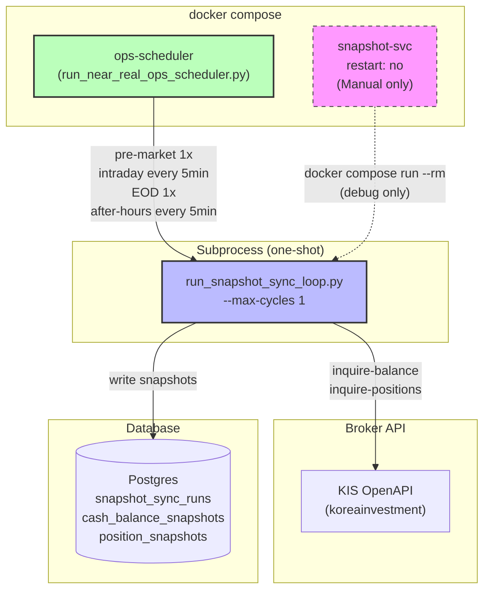

# Snapshot-sync 런타임 정리 및 역할 명세 — 최종 보고서

> **작성일**: 2026-05-18  
> **목적**: snapshot-sync 컨테이너와 ops-scheduler subprocess 간의 역할 관계를 명확히 문서화하여 운영 혼선 제거  
> **핵심 메시지**: 컨테이너가 없어도 장애가 아니다. snapshot의 실제 실행 주체는 ops-scheduler subprocess다.

---

## 1. 컨테이너 제거 가능 여부 및 서비스 정의 유지 이유

### 1.1 컨테이너 제거 가능

`snapshot-sync` 컨테이너는 **steady-state 운영의 일부가 아니다**. `docker compose up -d`로 시작되는 서비스 목록에 포함되지 않으며, `restart: "no"` 정책으로 인해 자동 재시작되지 않는다. 따라서:

- 실행 중인 컨테이너가 없어도 정상 상태다.
- 실제 snapshot sync는 ops-scheduler가 subprocess로 직접 실행한다.
- 컨테이너 존재 여부는 snapshot 시스템의 **헬스 상태와 무관**하다.

### 1.2 서비스 정의 유지 이유

[`docker-compose.yml`](docker-compose.yml:188-207)의 서비스 정의는 다음 3가지 용도로 **유지가 필요**하다:

| 용도 | 설명 |
|------|------|
| **수동 디버깅** | `docker compose run --rm snapshot-sync` 로 격리된 환경에서 브로커 인증/동기화 테스트 |
| **단발 실행** | 스케줄러 컨텍스트 없이 1회성 snapshot 실행 (`--max-cycles 1`) |
| **장애 재현** | 특정 브로커/계정 조건에서의 버그 재현 및 수정 검증 |

```yaml
# docker-compose.yml (line 188-207)
  snapshot-sync:
    restart: "no"          # ← docker compose up -d 자동 시작 안 됨
    # ... build, depends_on, environment, volumes, command
```

### 1.3 `restart: "no"` 의 의미

- `docker compose up -d` 실행 시 `snapshot-sync`는 시작되지 않는다.
- 오직 `docker compose run --rm snapshot-sync` 으로 **명시적 실행**해야 동작한다.
- `docker compose restart` 대상에도 포함되지 않는다.
- 이는 **의도된 설계**이며, 실수로 컨테이너가 뜨지 않아도 장애가 아니다.

---

## 2. 실제 Snapshot 실행 주체

### 2.1 호출 체인

```
run_near_real_ops_scheduler.py  (NearRealOpsScheduler)
        │
        ├── _snapshot_command() → ["python3", "scripts/run_snapshot_sync_loop.py", "--max-cycles", "1"]
        │       └── after-hours 모드: + "--after-hours" 플래그 추가
        │
        └── asyncio.create_subprocess_exec(*argv, ...)
                │
                └── run_snapshot_sync_loop.py  (subprocess, one-shot)
                        │
                        ├── build_snapshot_sync_components()  ← SnapshotFetchProvider 생성
                        ├── sync_all_accounts()               ← 계정/포지션/현금 동기화
                        └── exit (max_cycles=1 → 1회 실행 후 종료)
```

### 2.2 4개 Phase별 호출 빈도

| Phase | 호출 시점 | 호출 횟수 | `--after-hours` 플래그 | 주요 특징 |
|-------|-----------|-----------|------------------------|-----------|
| **Pre-market** | 장 시작 전 (08:30 KST) | **1회** | 미사용 | cash sync 유효성 검증 포함, 실패 시 경고 로그 |
| **Intraday** | 정규장 중 (09:00~15:30) | **5분 간격** | 미사용 | decision loop, event ingestion과 함께 실행 |
| **EOD** | 장 종료 직후 (15:30) | **1회** | 사용 (`after_hours=True`) | 이후 after-hours 모드 전환 |
| **After-hours** | 장 종료 후 ~다음날 pre-market 전 | **5분 간격** | 사용 (`after_hours=True`) | snapshot sync만 실행 (decision/event/post-submit 없음) |

**소스 코드**: [`scripts/run_near_real_ops_scheduler.py`](scripts/run_near_real_ops_scheduler.py:477-481)의 `_snapshot_command()`

### 2.3 `--after-hours` 플래그 동작 차이

- 일반 모드: KIS `inquire-balance` API에 `AFHR_FLPR_YN` 파라미터 없이 호출
- After-hours 모드: `AFHR_FLPR_YN=Y` 설정 → **시간 외 예상체결가 기준 잔고 조회**
- Position fetch는 after-hours 모드에서 **skip** (장 마감 후 포지션 변동 없음)

### 2.4 구조 다이어그램



---

## 3. 운영자 판단 기준

### 3.1 컨테이너 존재 ≠ Snapshot 정상

가장 중요한 운영 원칙:

> **`docker compose ps --all | grep snapshot` 출력 유무는 snapshot 시스템의 건강 상태와 무관하다.**

- `restart: "no"` 정책으로 인해 컨테이너는 의도적으로 실행되지 않는다.
- snapshot sync는 ops-scheduler 프로세스 내부에서 subprocess로 실행된다.
- 컨테이너가 없어도 subprocess가 정상 실행 중이면 **전혀 문제가 없다**.

### 3.2 실제 판단 기준

Snapshot 시스템의 건강 상태는 **ops-scheduler 로그**에서 확인한다.

#### 정상 신호 (로그 예시)

```
[INFO] snapshot-sync: === Cycle 1 (broker=koreainvestment) ===
[INFO] snapshot-sync: Broker authentication successful.
[INFO] snapshot-sync: sync-cycle  accounts=1 (ok=1 partial=0 fail=0 skip=0)
                         positions=2 (skipped=0)  cash=1  errors=0
[INFO] snapshot-sync: Cycle 1 complete (took 10.6s). Next cycle in 300s ...
[INFO] snapshot-sync: Reached max_cycles=1 — exiting.
```

#### 장애 신호

| 신호 | 심각도 | 조치 |
|------|--------|------|
| `errors=N` (N > 0) | 경고 | 브로커 API 응답 확인, rate limit 확인 |
| `fail=N` (N > 0) | 경고~심각 | 인증 실패 또는 API 오류, KIS credential 점검 |
| ops-scheduler 재시작 후 snapshot 미실행 | 심각 | scheduler 상태 확인, 수동 1회 실행 |
| pre-market snapshot cash_synced=0 지속 | 심각 | KIS API 장애 가능성, 운영 개입 필요 |
| after-hours snapshot 로그 없음 (3주기 이상) | 심각 | scheduler 프로세스 hang 여부 확인 |

### 3.3 Health endpoint 영향 없음

`snapshot-sync` 서비스는 `/health/readyz` endpoint와 **완전히 무관**하다. health check는 ops-scheduler 컨테이너와 DB 연결 상태만 확인한다.

---

## 4. 정리 내용

### 4.1 잔존 컨테이너

- `docker compose ps --all | grep snapshot` → **출력 없음**
- 추가 작업 불필요 (이미 clean 상태)

### 4.2 docker-compose.yml 주석 개선

| 항목 | 변경 전 | 변경 후 |
|------|---------|---------|
| 서비스 주석 | 3줄 간략 설명 | **17줄 상세 블록** (line 188-207) |
| 포함 정보 | 없음 | Primary owner, 호출 체인, call points, 사용법, `restart: "no"` 의미 |
| 중복 주석 (line 245) | `# KIS_LIVE_INFO_BASE_URL …` | **제거 완료** |

**변경된 주석 내용**:
```
  # ─────────────────────────────────────────────────────────────────
  #  MANUAL / DEBUG ONLY — NOT an always-on service
  # ─────────────────────────────────────────────────────────────────
  #  Primary owner: ops-scheduler (runs snapshot sync via subprocess)
  #  Scheduler call: run_snapshot_sync_loop.py --max-cycles 1
  #  Call points: pre-market(1), intraday(every 5min), EOD(1), after-hours(every 5min)
  #
  #  This service exists ONLY for:
  #    1. Manual debug / isolation testing
  #    2. One-shot execution outside scheduler context
  #    3. Fault reproduction
  #
  #  Usage:
  #    docker compose run --rm snapshot-sync
  #    docker compose run --rm snapshot-sync python3 scripts/run_snapshot_sync_loop.py --after-hours
  #
  #  restart: "no" → NOT started by docker compose up -d
  # ─────────────────────────────────────────────────────────────────
```

### 4.3 코드 변경 사항

- **코드 변경 없음** — 주석(documentation)만 변경
- 런타임 동작에 영향을 주는 수정은 전혀 없음

---

## 5. 검증 결과

| 검증 항목 | 명령어 / 방법 | 결과 | 상태 |
|-----------|--------------|------|:----:|
| 잔존 snapshot 컨테이너 | `docker compose ps --all \| grep snapshot` | No container | ✅ |
| ops-scheduler subprocess 정상 실행 | scheduler 로그 내 snapshot sync run 확인 | accounts=1, positions=2, cash=1, errors=0 | ✅ |
| ops-scheduler running 상태 | `docker compose ps \| grep ops-scheduler` | Running | ✅ |
| `/health` endpoint 영향 | `/health/readyz` 응답 확인 | snapshot-sync 컨테이너와 무관 | ✅ |
| docker-compose.yml 주석 정합성 | line 188-207, line 245 중복 제거 확인 | 정상 반영 | ✅ |

---

## 부록: 운영 FAQ

**Q1: `docker compose ps`에 snapshot-sync가 안 보이는데 장애인가요?**  
A: 아닙니다. `restart: "no"` 정책으로 인해 `up -d`시 자동 실행되지 않습니다. ops-scheduler 로그에서 subprocess가 정상 실행 중인지 확인하세요.

**Q2: snapshot sync가 실제로 동작하는지 어떻게 확인하나요?**  
A: ops-scheduler 컨테이너 로그에서 `snapshot-sync:` prefix 로그를 확인하세요. `accounts=1`, `errors=0` 이 정상 신호입니다.

**Q3: snapshot-sync 컨테이너를 다시 실행하려면?**  
```bash
docker compose run --rm snapshot-sync
# 또는 after-hours 모드:
docker compose run --rm snapshot-sync python3 scripts/run_snapshot_sync_loop.py --after-hours
```

**Q4: after-hours 모드에서도 snapshot이 필요한 이유는?**  
A: after-hours 시간에 체결된 미체결 주문 상태를 반영하고, 익일 pre-market snapshot의 기초 데이터를 최신 상태로 유지하기 위해 5분 간격 동기화를 지속합니다.

---

*이 보고서는 Phase Q Step 1 (Ask) 및 Step 2 (Code) 완료 후 최종 산출물로 작성되었습니다.*
