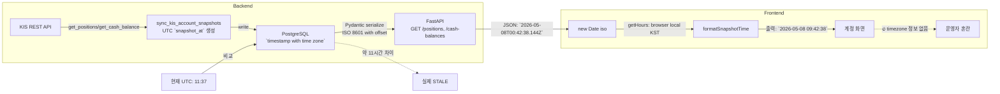
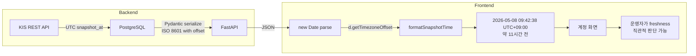

# Snapshot 시각 정합성 수정 — Timezone 명시 + Stale Snapshot 표시

## 문제 진단

### 1. Timezone 누락 (UI 표시)

**현재 상황**:
- Backend는 `snapshot_at = datetime.now(tz=timezone.utc)`로 UTC 시각 저장
- Pydantic 직렬화 시 ISO 8601 with timezone (예: `2026-05-08T00:42:38.144Z`)
- Frontend `formatSnapshotTime()`가 `new Date(iso)` → `d.getHours()` (browser local) 변환 후 **모든 timezone 정보를 제거**

**AccountsView.tsx:37-46** — 문제의 함수:
```typescript
function formatSnapshotTime(iso: string): string {
  const d = new Date(iso);
  // ... getHours() 등은 browser local time(KST) 반환 ...
  return `${y}-${mo}-${dd} ${hh}:${mm}:${ss}`;
  //                          ↑ timezone 정보 완전 누락!
}
```

**영향**: 출력 `2026-05-08 09:42:38`은 올바른 KST 시각이지만, `KST`/`+09:00` 표시가 없어 UTC로 오인 가능

### 2. 실제 Stale Snapshot 존재

**DB 조회 결과** (2026-05-08 11:37 UTC 기준):

| 테이블 | snapshot_at (UTC) | Age |
|--------|-------------------|-----|
| cash_balance_snapshots | `2026-05-08T00:42:38.144Z` | ~10h 55m |
| position_snapshots | *(empty)* | N/A |

- **Cash balance**: 약 11시간 전 데이터 — 실제 stale
- **Position**: snapshot이 **하나도 없음** — KIS sync가 제대로 실행되지 않은 증거
- **원인**: `sync_kis_snapshots.py` CLI는 존재하나, **주기적 스케줄러(cron/airflow 등) 미설치**

### 데이터 흐름 (현재)



---

## 변경 계획

### 변경 파일 목록 (최소 변경 원칙)

| 파일 | 변경 유형 | 설명 |
|------|-----------|------|
| `admin_ui/src/components/AccountsView.tsx` | **수정** | `formatSnapshotTime()`에 timezone 표시 + stale 경과 시간 추가 |
| `admin_ui/src/__tests__/accounts.test.tsx` | **수정** | 변경된 출력 형식에 맞게 테스트 기대값 조정 |

**변경 금지**: Backend (`schemas.py`, `routes/position.py`, `kis_snapshot_sync.py`), `api.ts`

---

### 변경 1: `formatSnapshotTime()` — Timezone 명시

**목표**: 출력 문자열에 timezone 정보 추가. 브라우저 timezone을 자동 감지하여 offset 표시.

```typescript
function formatSnapshotTime(iso: string): string {
  const d = new Date(iso);
  const y = d.getFullYear();
  const mo = String(d.getMonth() + 1).padStart(2, "0");
  const dd = String(d.getDate()).padStart(2, "0");
  const hh = String(d.getHours()).padStart(2, "0");
  const mm = String(d.getMinutes()).padStart(2, "0");
  const ss = String(d.getSeconds()).padStart(2, "0");

  // Timezone offset 계산 (분 → 시간:분 포맷)
  const offsetMin = -d.getTimezoneOffset(); // KST = -540 → +540
  const sign = offsetMin >= 0 ? "+" : "-";
  const tzHours = String(Math.floor(Math.abs(offsetMin) / 60)).padStart(2, "0");
  const tzMins = String(Math.abs(offsetMin) % 60).padStart(2, "0");

  return `${y}-${mo}-${dd} ${hh}:${mm}:${ss} UTC${sign}${tzHours}:${tzMins}`;
  // 예: "2026-05-08 09:42:38 UTC+09:00"
}
```

**동작 예시**:
| Browser TZ | Input ISO | Output |
|------------|-----------|--------|
| Asia/Seoul (KST, UTC+9) | `2026-05-08T00:42:38.144Z` | `2026-05-08 09:42:38 UTC+09:00` |
| UTC | `2026-05-08T00:42:38.144Z` | `2026-05-08 00:42:38 UTC+00:00` |
| America/New_York (EST, UTC-5) | `2026-05-08T00:42:38.144Z` | `2026-05-07 19:42:38 UTC-05:00` |

---

### 변경 2: Snapshot 경과 시간 추가 (Stale 표시)

**목표**: 운영자가 snapshot freshness를 직관적으로 판단할 수 있도록 경과 시간 추가

```typescript
function formatSnapshotTime(iso: string): string {
  const d = new Date(iso);
  // ... timezone 표시 (위 변경 1) ...

  // 경과 시간 계산
  const now = new Date();
  const diffMs = now.getTime() - d.getTime();
  const diffMin = Math.floor(diffMs / 60000);

  let elapsed = "";
  if (diffMin < 1) {
    elapsed = "방금 전";
  } else if (diffMin < 60) {
    elapsed = `${diffMin}분 전`;
  } else if (diffMin < 1440) {
    elapsed = `${Math.floor(diffMin / 60)}시간 ${diffMin % 60}분 전`;
  } else {
    elapsed = `${Math.floor(diffMin / 1440)}일 전`;
  }

  return `${y}-${mo}-${dd} ${hh}:${mm}:${ss} UTC${sign}${tzHours}:${tzMins} (${elapsed})`;
  // 예: "2026-05-08 09:42:38 UTC+09:00 (약 11시간 전)"
}
```

**Stale 시각적 강화** (선택 사항 — 리디자인 제약内):
- 경과 시간이 특정 threshold(예: 1시간)를 넘으면 보조 텍스트 색상 변경
- `<span>` 스타일링: `text-amber-600` (주황색) 등

---

### Mermaid: 변경 후 데이터 흐름



---

### 테스트 영향 분석

**`accounts.test.tsx:198-200`**:
```typescript
// 변경 전 주석: → "스냅샷: 2024-01-01 12:00:00"
// 변경 후: → "스냅샷: 2024-01-01 21:00:00 UTC+09:00 (약 ... 전)"
// 실제 assertion: 갯수만 확인 (screen.getAllByText(/^스냅샷:/).length === 2)
```

- `mockPositions[0].snapshot_at = "2024-01-01T12:00:00Z"` → KST: `21:00:00`
- `mockCashBalance.snapshot_at = "2024-01-01T12:00:00Z"` → KST: `21:00:00`
- 정규식 `/^스냅샷:/`는 여전히 매치 → **테스트 깨지지 않음** ✅
- 단, 주석만 업데이트 필요

---

## 실행 계획 (Todo)

### Step 1: `AccountsView.tsx` 수정
**파일**: `admin_ui/src/components/AccountsView.tsx`
- `formatSnapshotTime()` 함수에 timezone offset 표시 추가
- `d.getTimezoneOffset()`으로 browser TZ offset 계산
- 출력: `yyyy-MM-dd HH:mm:ss UTC+09:00`
- 경과 시간 추가: `(약 X시간 전)`
- Threshold(1시간) 초과 시 stale 시각적 표시 (색상/배지)

### Step 2: `formatSnapshotTime` 유틸 분리 검토
- `formatSnapshotTime`이 복잡해지면 `lib/utils.ts`로 분리 가능
- AccountsView.tsx 내 유지해도 무방 (최소 변경 원칙)

### Step 3: 테스트 업데이트
**파일**: `admin_ui/src/__tests__/accounts.test.tsx`
- Line 198 주석 업데이트: `"스냅샷: 2024-01-01 12:00:00"` → `"스냅샷: 2024-01-01 21:00:00 UTC+09:00"`
- JSDOM 환경에서는 `getTimezoneOffset`이 항상 0을 반환할 수 있음 → UTC 출력 검증

### Step 4: 검증
1. `npm test` 실행 — accounts.test.tsx 포함 전체 테스트 통과 확인
2. 수동 검증: 서버 실행 → Accounts 화면에서 snapshot 시각 확인
3. DB 원문 `snapshot_at`과 UI 표시값 비교
4. stale 표시(경과 시간)가 올바르게 계산되는지 확인

---

## 검증 조건

| 항목 | 조건 | 방법 |
|------|------|------|
| Timezone 표시 | 출력에 `UTC+09:00` 또는 browser offset 포함 | 코드 리뷰 |
| KST 정확성 | DB UTC 원문 +9h = UI KST 시각 일치 | 수동 확인 |
| 경과 시간 | `(약 X시간 전)`이 실제 경과와 일치 | 수동 확인 |
| Stale 시각화 | 1시간 이상 snapshot에 경고 스타일 적용 | 시각 확인 |
| 테스트 통과 | `npm test` 전과 동일한 pass count | CI 실행 |
| 회귀 없음 | 기존 기능(계좌 목록, 상세 패널) 정상 동작 | 수동 확인 |
