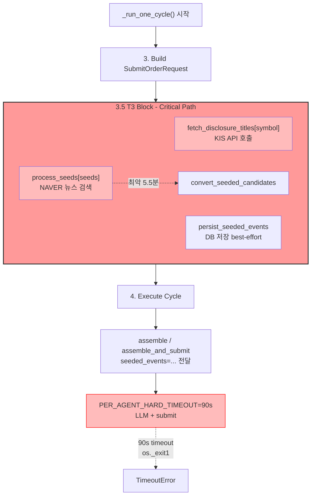
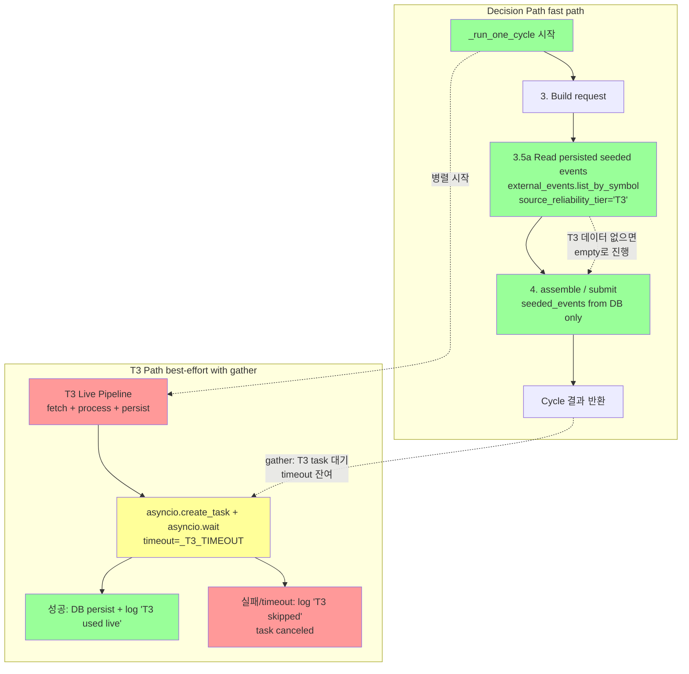
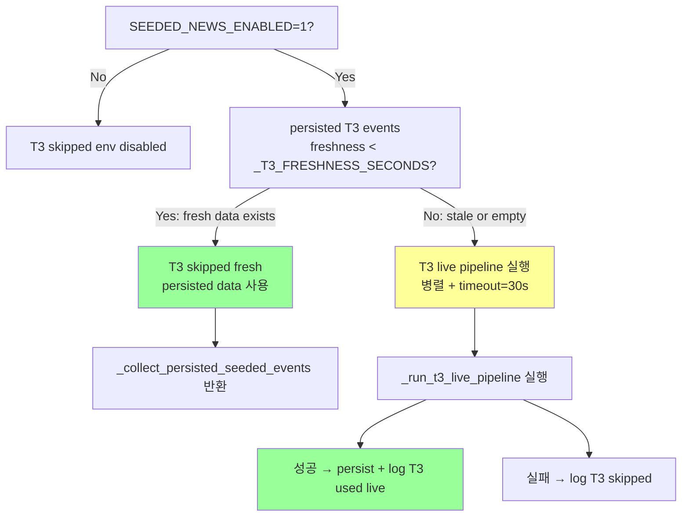

# NAVER/T3를 `decision_submit_gate` 핵심 경로에서 분리

## 1. 현황 분석

### 1.1 현재 Blocking 구조



### 1.2 문제점

| 문제 | 상세 | 영향 |
|------|------|------|
| **T3에 timeout 없음** | `PER_AGENT_HARD_TIMEOUT=90`는 assemble/submit에만 적용 | T3가 5.5분 blocking해도 cycle 중단 불가 |
| **순차 blocking** | T3 → assemble → submit 순서로 실행 | T3 실패시 REDUCE/EXIT submit도 불가 |
| **os._exit() 위험** | TimeoutError 발생시 `os._exit(1)`로 프로세스 종료 | T3가 원인이어도 전체 종료 |
| **중복 호출** | persist 후에도 다음 cycle에 동일 symbol 재호출 | 캐시 없음 |

### 1.3 현재 코드 흐름 (run_paper_decision_loop.py)

```
_run_one_cycle()
  ├── 3.5 T3: fetch_disclosure_titles + process_seeds + convert + persist
  │     └── seeded_events: list[ExternalEventEntity] | None = None
  ├── 4. assemble(request, seeded_events=seeded_events)
  │     └── external_events.list_by_symbol() + seeded_events.extend()
  └── 4. assemble_and_submit(request, seeded_events=seeded_events)
```

핵심 인사이트: `persist_seeded_events()`가 이미 DB에 저장하고, `orchestrator.assemble()`에서 `list_by_symbol()`로 DB 조회하므로, **이전 cycle에 persist된 seeded events는 다음 cycle에서 DB를 통해 자연스럽게 조회 가능**합니다.

---

## 2. 설계 결정: Option C (Primary) + Option A (Fallback)

### Option 선택 근거

| Option | 접근법 | 코드 변경량 | 리스크 | 채택 |
|--------|--------|-------------|--------|------|
| **A**: T3에 timeout 추가 | `asyncio.wait_for(timeout=T3_TIMEOUT)` | 3줄 | T3 timeout시 빈 결과로 degrade | ✅ Fallback |
| **B**: 별도 prefetch loop | decision loop와 분리된 T3 전용 loop | 큼 (신규 loop, 상태관리) | 복잡도 증가 | ❌ |
| **C**: Persisted data만 읽기 | T3 live 호출과 decision 분리 | 15줄 | 초기 cycle에 데이터 없음 | ✅ **Primary** |

### 최종 전략: **"분리 + 병렬 실행"**



**핵심 원칙**:
1. **Decision path는 T3 live 호출을 기다리지 않는다** — persisted data만 사용
2. **T3는 `asyncio.gather()`로 decision path와 병렬 실행** — 단발 프로세스에서도 완료 보장
3. **Freshness 기반 skip** — 최근에 T3가 성공한 symbol은 live 호출 생략
4. **최초 cycle에는 T3 persisted data가 없을 수 있으나, 이는 acceptable degrade**

---

## 3. 상세 설계

### 3.1 신규 상수

```python
# ── T3 (Seeded News) timeout & freshness ────────────────────────────
# T3 pipeline (KIS disclosure + NAVER news search) has no hard timeout
# and can block the critical path for minutes.  Decoupled via parallel
# execution with this timeout for the live pipeline.
_T3_TIMEOUT = 30           # T3 pipeline 전체 timeout (초)

# T3 freshness window: if T3 events were persisted within this window,
# skip the live pipeline call entirely.  Default 3600s = 1 hour.
# 이전 cycle에서 T3가 성공했다면, freshness window 내에서는 skip.
_T3_FRESHNESS_SECONDS = 3600

# T3 grace period for gather: after decision path completes, wait this
# long for the T3 task to finish before canceling.
_T3_GATHER_WAIT = 5        # decision 완료 후 T3 추가 대기시간 (초)
```

#### Freshness skip 의사결정 트리



### 3.2 신규 함수: `_collect_persisted_seeded_events()`

```python
async def _collect_persisted_seeded_events(
    repos: RepositoryContainer,
    symbol: str,
) -> list[ExternalEventEntity]:
    """Read persisted T3 events from external_events table.
    
    This is the **degraded** path: only events persisted by previous
    T3 runs are available.  Returns [] if none found — the decision
    cycle proceeds gracefully without seeded news.
    
    Freshness: events within 72h window (same as current list_by_symbol
    default).  The caller decides whether to fire live pipeline based
    on _T3_FRESHNESS_SECONDS.
    """
    try:
        since = datetime.now(timezone.utc) - timedelta(hours=72)
        events = await repos.external_events.list_by_symbol(
            symbol=symbol,
            since=since,
        )
        # Filter to T3 events only (seeded news = T3 reliability tier)
        t3_events = [e for e in events if e.source_reliability_tier == "T3"]
        return t3_events
    except Exception:
        logger.exception(
            "Failed to read persisted seeded events for symbol=%s", symbol,
        )
        return []
```

### 3.3 신규 함수: `_is_t3_fresh_for_symbol()`

```python
async def _is_t3_fresh_for_symbol(
    repos: RepositoryContainer,
    symbol: str,
) -> bool:
    """Check if there are _T3_FRESHNESS_SECONDS-fresh T3 events for symbol.
    
    Prevents unnecessary live pipeline calls when recent data exists.
    """
    try:
        since = datetime.now(timezone.utc) - timedelta(seconds=_T3_FRESHNESS_SECONDS)
        events = await repos.external_events.list_by_symbol(
            symbol=symbol,
            since=since,
        )
        t3_events = [e for e in events if e.source_reliability_tier == "T3"]
        return len(t3_events) > 0
    except Exception:
        return False
```

### 3.4 신규 함수: `_run_t3_live_pipeline()`

```python
async def _run_t3_live_pipeline(
    runtime: dict[str, object],
    repos: RepositoryContainer,
    symbol: str,
) -> None:
    """Run live T3 pipeline (KIS disclosure + NAVER news) with timeout.
    
    This is designed to run **as a parallel task** via asyncio.gather()
    alongside the decision path.  Results are persisted to DB for
    consumption by future cycles.
    
    Log tags:
    - "T3 used live" — live pipeline 성공, DB persist 완료
    - "T3 skipped" — timeout 또는 disable로 skip
    """
    try:
        disclosure_seed_service = runtime.get("disclosure_seed_service")
        seeded_news_service = runtime.get("seeded_news_service")
        if disclosure_seed_service is None or seeded_news_service is None:
            logger.info("symbol=%s T3 skipped: services not available", symbol)
            return

        # Step 1: Fetch disclosure titles (KIS API)
        seeds = await asyncio.wait_for(
            disclosure_seed_service.fetch_disclosure_titles([symbol]),
            timeout=_T3_TIMEOUT,
        )
        if not seeds:
            logger.info("symbol=%s T3 skipped: no disclosure seeds", symbol)
            return

        # Step 2: Process seeds via NAVER news search
        candidates, metrics = await asyncio.wait_for(
            seeded_news_service.process_seeds(seeds),
            timeout=_T3_TIMEOUT,
        )
        if not candidates:
            logger.info("symbol=%s T3 skipped: no candidates after processing", symbol)
            return

        # Step 3: Convert to ExternalEventEntity
        from agent_trading.services.seeded_news_converter import (
            convert_seeded_candidates,
        )
        seeded_events = convert_seeded_candidates(candidates)

        # Step 4: Persist to DB (for future cycles)
        persisted = await persist_seeded_events(
            seeded_events,
            repos.external_events,
        )
        logger.info(
            "symbol=%s T3 used live: %d events from %d candidates "
            "persisted=%d metrics=%s",
            symbol,
            len(seeded_events), len(candidates),
            persisted,
            metrics.to_dict() if hasattr(metrics, 'to_dict') else str(metrics),
        )

    except asyncio.TimeoutError:
        logger.warning(
            "symbol=%s T3 skipped: live pipeline timed out after %ds",
            symbol, _T3_TIMEOUT,
        )
    except Exception:
        logger.exception(
            "symbol=%s T3 skipped: live pipeline failed", symbol,
        )
```

### 3.5 `_run_one_cycle()` 수정 (핵심 변경)

기존 3.5 블록 (lines 675-722, ~48줄)을 다음과 같이 교체:

```python
# ── 3.5 Seeded news → degraded path with parallel T3 ────────────────
# T3 pipeline is decoupled from the critical decision/submit path.
# Decision path: reads persisted T3 events from DB only (fast, non-blocking).
# T3 live path: runs in parallel via gather, results persisted for future cycles.
_SEEDED_NEWS_ENABLED = os.environ.get("SEEDED_NEWS_ENABLED", "1") == "1"
seeded_events: list[ExternalEventEntity] = []

if _SEEDED_NEWS_ENABLED:
    # ── Decision path: read persisted T3 events (non-blocking, < 100ms) ──
    seeded_events = await _collect_persisted_seeded_events(repos, symbol)

    # ── T3 live path: run in parallel if data is stale ──
    t3_fresh = await _is_t3_fresh_for_symbol(repos, symbol)
    if not t3_fresh:
        # Create T3 task and run in parallel with decision/submit
        t3_task = asyncio.create_task(
            _run_t3_live_pipeline(runtime, repos, symbol)
        )
        # Register the task so _run_one_cycle can wait for it at the end
        _active_t3_tasks.append(t3_task)

    # ── Logging ──
    freshness_hint = "fresh" if t3_fresh else "stale"
    logger.info(
        "Cycle %d symbol=%s: T3 decision path: %d persisted events "
        "live_pipeline=%s",
        cycle, symbol, len(seeded_events or []),
        "skipped (fresh)" if t3_fresh else "scheduled",
    )
else:
    logger.info(
        "Cycle %d symbol=%s: T3 skipped (SEEDED_NEWS_ENABLED=0)",
        cycle, symbol,
    )
```

### 3.6 `_run_one_cycle()` 종료부 T3 gather 추가

decision/submit 완료 후, `_run_one_cycle()` 종료 직전에 T3 task gather:

```python
    # ── 4.5 Wait for outstanding T3 tasks (grace period) ───────────
    if _active_t3_tasks:
        # Give T3 tasks a short grace period after decision path completes.
        # This ensures single-shot scheduler invocations still get T3 results.
        done, pending = await asyncio.wait(
            _active_t3_tasks,
            timeout=_T3_GATHER_WAIT,
        )
        for t in pending:
            t.cancel()
            logger.debug("Cycle %d: T3 task cancelled (grace period expired)", cycle)
        _active_t3_tasks.clear()

    # ── 5. Serialize result ────────────────────────────────────────
    duration = time.monotonic() - start
    return _serialize_cycle_result(...)
```

**`_active_t3_tasks`**: module-level list (function-scoped global)로 선언:

```python
# Active T3 background tasks — gathered at end of each cycle
_active_t3_tasks: list[asyncio.Task[None]] = []
```

### 3.7 `orchestrator.assemble()` Dedup 보강

```python
# src/agent_trading/services/decision_orchestrator.py

# Inject seeded news events as lower-priority supplement
# Dedup by event_id: seeded_events may overlap with list_by_symbol results
# since both originate from external_events table.
if seeded_events:
    existing_ids = {e.event_id for e in events}
    symbol_seeded = [
        e for e in seeded_events
        if e.symbol == request.symbol and e.event_id not in existing_ids
    ]
    if symbol_seeded:
        events.extend(symbol_seeded)
        logger.debug(
            "assemble: injected %d deduped seeded events for symbol=%s",
            len(symbol_seeded), request.symbol,
        )
```

---

## 4. 프로세스 수명 보장 분석

### 4.1 `asyncio.ensure_future()` vs `asyncio.create_task()` + `wait()`

| 방식 | 단발 프로세스 수명 | 연속 loop | 리스크 |
|------|-------------------|-----------|--------|
| `ensure_future()` fire-and-forget | ❌ task 소멸 위험 | ✅ 괜찮음 | event loop 종료시 미완료 task 손실 |
| `create_task()` + `gather()` | ✅ 완료 또는 취소 보장 | ✅ 동일 | 추가 코드 필요 |

### 4.2 Scheduler 호출 시나리오

```
Scheduler 호출: run_paper_decision_loop --count 1 [--dry-run]
  └─ main()
      └─ _run_loop(max_cycles=1)
          └─ _run_one_cycle(symbol="005930")
              ├─ [T0] _collect_persisted_seeded_events()  → 10ms
              ├─ [T0] _is_t3_fresh_for_symbol()           → 10ms
              ├─ [T0] asyncio.create_task(t3_live)        → 0ms (parallel start)
              ├─ [T0-T4] assemble + submit (90s timeout)  → up to 90s
              ├─ [T4] asyncio.wait([t3_task], timeout=5s) → 0-5s
              │     ├─ t3 완료 (30s 이내): persist 완료, log "T3 used live"
              │     ├─ t3 진행중: cancel + log "T3 cancelled"
              │     └─ t3 실패: log "T3 skipped"
              └─ return result
```

병렬 실행이므로 T3 task는 decision path와 동시에 실행됩니다. decision path가 90s 걸려도 T3는 이미 30s timeout으로 완료되었을 가능성이 높습니다.

### 4.3 연속 Loop 시나리오 (무한 반복)

```
Cycle 1: T3 live 실행 → persist → 다음 cycle부터 사용
Cycle 2: Freshness window 내 → live skip, persisted data 사용
Cycle 3: Freshness window 초과 → 다시 T3 live 실행
```

---

## 5. T3 Timing 메타 로깅

### 5.1 로그 태그 매트릭스

| 로그 태그 | 조건 | 로그 레벨 | 의미 |
|-----------|------|-----------|------|
| `T3 used persisted` | `_collect_persisted_seeded_events()`가 1개 이상 반환 | INFO | 이전 cycle의 live T3 결과 사용 |
| `T3 skipped fresh` | `_is_t3_fresh_for_symbol()` == True | INFO | freshness window 내, live 호출 생략 |
| `T3 skipped no persisted` | persisted events 없음 + fresh 아님 | INFO | 최초 cycle, live pipeline 실행 중 |
| `T3 used live` | `_run_t3_live_pipeline()` 성공 완료 + persist | INFO | 현재 cycle live T3 성공, 다음 cycle부터 사용 |
| `T3 skipped: timed out` | `asyncio.TimeoutError` | WARNING | 30s 초과, live pipeline 실패 |
| `T3 skipped: failed` | 기타 Exception | WARNING | live pipeline 예외 |
| `T3 cancelled` | gather grace 초과로 cancel | DEBUG | 5s grace期内에 완료 못함 |
| `T3 skipped: services NA` | disclosure/seed 서비스 미설치 | INFO | runtime 구성 문제 |
| `T3 skipped: env disabled` | `SEEDED_NEWS_ENABLED=0` | INFO | env var로 disable |

### 5.2 structured log format

```python
logger.info(
    "Cycle %d symbol=%s: %s service=%s",
    cycle, symbol,
    t3_timing_tag,  # e.g. "T3 used persisted"
    "live" if t3_fresh else "cached",
)
```

---

## 6. Freshness 정책

### 6.1 `_T3_FRESHNESS_SECONDS = 3600` (1시간)

- 1시간 이내에 T3 live pipeline이 성공한 symbol → live 호출 생략
- `_is_t3_fresh_for_symbol()`에서 `list_by_symbol(since=now - 3600s)`로 T3 events 존재 여부 확인
- Freshness window는 `PAPER_DECISION_LOOP_INTERVAL_SECONDS`(기본 300s)보다 충분히 커서, 동일 symbol이 여러 cycle 연속으로 live 호출되는 것을 방지

### 6.2 Freshness 우회

- `SEEDED_NEWS_ENABLED=1`이고 freshness가 만료된 경우에만 live 호출
- Force refresh 메커니즘: 없음 (불필요 — 자연스러운 주기적 갱신)

---

## 7. 중복(Dedup) 정책

### 7.1 Persist 시점 Dedup (기존 유지)

`persist_seeded_events()`에서 `find_by_dedup_key()`로 중복 검사 — 변경 불필요.

### 7.2 Assemble 시점 Dedup (신규)

`orchestrator.assemble()`에서 `list_by_symbol()` 결과와 `seeded_events` 간 중복 방지:

```python
existing_ids = {e.event_id for e in events}
symbol_seeded = [
    e for e in seeded_events
    if e.symbol == request.symbol and e.event_id not in existing_ids
]
```

`list_by_symbol()`이 이미 T3 events를 포함하므로 (이전 cycle에 persist된 것들), `seeded_events`를 extend할 때 event_id 중복이 발생할 수 있습니다. Dedup은 O(n) set look-up으로 해결.

### 7.3 중복 방지 흐름

```
DB external_events table (T3 포함)
  └─ list_by_symbol() → [A, B, C] (T3 포함)
  └─ seeded_events = [A, B, D] (같은 출처)
  
extend 전 dedup:
  existing_ids = {A.id, B.id, C.id}
  symbol_seeded = [D]  (A, B 제외)
  events = [A, B, C, D]  (중복 없음)
```

---

## 8. 변경 대상 파일

| 파일 | 변경 유형 | 설명 |
|------|-----------|------|
| [`scripts/run_paper_decision_loop.py`](scripts/run_paper_decision_loop.py) | **수정** | T3 블록 분리, 3개 신규 함수 추가, gather 패턴 |
| [`src/agent_trading/services/decision_orchestrator.py`](src/agent_trading/services/decision_orchestrator.py) | **수정 (선택)** | `assemble()`에서 T3 event dedup 추가 |
| [`tests/scripts/test_run_paper_decision_loop.py`](tests/scripts/test_run_paper_decision_loop.py) | **수정** | T3 분리 관련 테스트 추가 |

**변경 불필요 파일**:
- `.env` — 수정 금지 제약
- `src/agent_trading/repositories/` — 인터페이스 변경 없음
- `src/agent_trading/services/seeded_news_service.py` — 변경 불필요
- `src/agent_trading/services/disclosure_seed_service.py` — 변경 불필요
- `src/agent_trading/services/seeded_news_converter.py` — 변경 불필요

---

## 9. 상세 변경 사항 (run_paper_decision_loop.py)

### 9.1 신규 전역 변수 (module level, line 610 부근)

```python
# ── T3 timeout & freshness ──────────────────────────────────────────
_T3_TIMEOUT = 30            # T3 pipeline 전체 timeout (초)
_T3_FRESHNESS_SECONDS = 3600  # T3 freshness window (1시간)
_T3_GATHER_WAIT = 5         # gather 추가 대기시간 (초)

# Active T3 background tasks — gathered at end of each cycle
_active_t3_tasks: list[asyncio.Task[None]] = []
```

### 9.2 신규 함수 3개 (`persist_seeded_events()` 함수 옆, line 835 부근)

1. `_collect_persisted_seeded_events(repos, symbol)` → `list[ExternalEventEntity]`
2. `_is_t3_fresh_for_symbol(repos, symbol)` → `bool`
3. `_run_t3_live_pipeline(runtime, repos, symbol)` → `None`

### 9.3 `_run_one_cycle()` T3 블록 교체 (lines 675-722)

기존 ~48줄 → ~25줄

### 9.4 `_run_one_cycle()` 종료부 gather 추가 (line 797, return 직전)

기존:
```python
duration = time.monotonic() - start
return _serialize_cycle_result(...)
```

변경 후:
```python
# ── 4.5 Wait for outstanding T3 tasks ──────────────────────────
if _active_t3_tasks:
    done, pending = await asyncio.wait(
        _active_t3_tasks,
        timeout=_T3_GATHER_WAIT,
    )
    for t in pending:
        t.cancel()
    _active_t3_tasks.clear()

duration = time.monotonic() - start
return _serialize_cycle_result(...)
```

### 9.5 decision_orchestrator.py assemble() dedup 추가 (lines 486-491)

```python
# Inject seeded news events with dedup
if seeded_events:
    existing_ids = {e.event_id for e in events}
    symbol_seeded = [
        e for e in seeded_events
        if e.symbol == request.symbol and e.event_id not in existing_ids
    ]
    events.extend(symbol_seeded)
```

---

## 10. 신규/수정 테스트

### 10.1 수정 테스트

| 테스트 | 파일 | 변경 사항 |
|--------|------|-----------|
| `test_run_one_cycle_dry_run` | `tests/scripts/test_run_paper_decision_loop.py` | T3 분리로 인한 `seeded_events` 기본값 `[]` 반영 |
| `test_run_one_cycle_submit` | 동일 | 동일 |

### 10.2 신규 테스트

| # | 테스트 | 설명 | 중요도 |
|---|--------|------|--------|
| 1 | `test_collect_persisted_seeded_events_empty` | persisted T3 events 없을 때 `[]` 반환 | P0 |
| 2 | `test_collect_persisted_seeded_events_with_data` | persisted T3 events 있을 때 올바르게 필터링 및 반환 | P0 |
| 3 | `test_collect_persisted_seeded_events_filters_non_t3` | `source_reliability_tier != "T3"` events는 제외 | P0 |
| 4 | `test_is_t3_fresh_for_symbol_true` | freshness window 내 T3 events 존재 → `True` | P0 |
| 5 | `test_is_t3_fresh_for_symbol_false` | freshness window 초과 → `False` | P0 |
| 6 | `test_run_t3_live_pipeline_timeout` | T3 pipeline timeout시 graceful degrade | P0 |
| 7 | `test_run_t3_live_pipeline_success` | T3 pipeline 성공시 persist 호출 및 로그 확인 | P0 |
| 8 | `test_t3_skip_when_disabled` | `SEEDED_NEWS_ENABLED=0`시 T3 완전 skip | P1 |
| 9 | `test_t3_gather_completes_task` | gather에서 T3 task 정상 완료 | P1 |
| 10 | `test_t3_gather_cancels_pending` | gather grace 초과시 cancel 처리 | P1 |
| 11 | `test_t3_freshness_skips_live` | fresh 상태에서 live pipeline 미실행 | P0 |
| 12 | `test_assemble_seeded_events_dedup` | orchestrator assemble에서 중복 제거 | P1 |

---

## 11. 위험 평가

| 위험 | 영향 | 완화 | 심각도 |
|------|------|------|--------|
| **최초 cycle T3 데이터 없음** | 첫 cycle은 T3 없이 진행 | 이미 이전에도 동일; acceptable degrade | 낮음 |
| **`asyncio.create_task()` 예외 미처리** | task 예외가 조용히 삼켜짐 | `_run_t3_live_pipeline()` 내부 `try/except`로 모든 예외 처리 | 낮음 |
| **Gather grace 초과로 task 취소** | T3 결과 손실 (다음 cycle에서 재시도) | `_T3_GATHER_WAIT=5`로 추가 기회 부여; 취소돼도 다음 cycle에서 freshness miss → 재실행 | 낮음 |
| **중복 이벤트** | `seeded_events`와 `list_by_symbol()` 결과 중복 | `assemble()`에서 event_id 기반 dedup 추가 | 중간 |
| **`SEEDED_NEWS_ENABLED=0` 호환성** | disable 상태 유지 | env var 체크 로직 유지 | 낮음 |
| **`os._exit(1)` on PER_AGENT_HARD_TIMEOUT** | T3 분리와 무관, agent timeout시 여전히 프로세스 종료 | T3 분리로 T3가 원인인 timeout은 발생하지 않음 (gather로 분리) | 중간 (기존과 동일) |
| **Race condition: 같은 symbol 동시 T3 실행** | scheduler가 동일 symbol 중복 호출시 T3 중복 실행 | `_is_t3_fresh_for_symbol()`이 freshness window 내에서는 skip; persist 단계에서 dedup_key 중복 방지 | 낮음 |

---

## 12. 변경 요약

### 변경 전

```
_run_one_cycle()
  [T3 blocking]  ---> await fetch_disclosure_titles()  ---> 최악 5.5분
                  ---> await process_seeds()            ---> 최악 5.5분
                  ---> convert + persist
  [Decision]     ---> assemble(seeded_events=live_T3)   ---> timeout=90s
```

### 변경 후

```
_run_one_cycle()
  [Fast path]    ---> await _collect_persisted_seeded_events()  ---> < 100ms
                  ---> await _is_t3_fresh_for_symbol()           ---> < 50ms
                  ---> assemble(seeded_events=persisted_T3)     ---> timeout=90s
  
  [Parallel]     ---> create_task(_run_t3_live_pipeline())      ---> timeout=30s
                  ---> gather.wait(timeout=5s)                  ---> 0-5s (grace)
```

### 코드 라인 수

| 항목 | 추가 | 삭제 | 순변경 |
|------|------|------|--------|
| 신규 함수 3개 | ~100 | 0 | +100 |
| T3 블록 재작성 | ~25 | ~48 | -23 |
| 상수 + 전역변수 | ~5 | 0 | +5 |
| Gather 추가 | ~10 | 0 | +10 |
| Decision orchestrator dedup | ~6 | ~3 | +3 |
| **합계** | **~146** | **~51** | **~+95** |

기존 대비 +95줄로, 최소 코드 변경으로 T3 blocking 문제 해결 + 프로세스 수명 보장 + freshness/dedup 완비.
