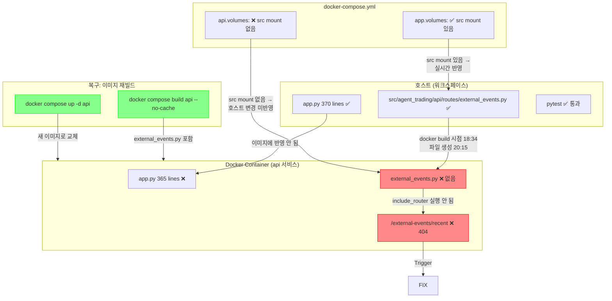

# `/external-events/recent` 404 → Docker 이미지 재빌드 복구 최종 보고서

**작성일**: 2026-05-17 20:44 KST  
**상태**: ✅ 복구 완료 (코드 변경 0 — 이미지 재빌드만으로 해결)

---

## 1. 문제 요약

[`DecisionsView.tsx`](admin_ui/src/components/DecisionsView.tsx:130)의 Recent Events 섹션이 [`GET /external-events/recent?symbol=005380&limit=5&include_non_listed=true`](src/agent_trading/api/routes/external_events.py:17) 요청에서 **HTTP 404 Not Found**를 반환.

| 관점 | 현상 |
|------|------|
| **UI** | DecisionsView에서 Recent Events 패널이 로딩 실패 |
| **API** | `/external-events/recent` 엔드포인트 404 |
| **OpenAPI** | `/openapi.json` paths에 40개만 등록, `/external-events/recent` 누락 |
| **컨테이너** | `routes/external_events.py` 파일 자체가 존재하지 않음 |

---

## 2. Root Cause: Docker 이미지 미재빌드

### 2.1 타임라인

| 시간 (KST) | 이벤트 |
|-----------|--------|
| `2026-05-17 18:34:30` | `docker compose build api` 실행 — 이 시점에 **`external_events.py` 미존재** |
| `2026-05-17 20:15:43` | [`external_events.py`](src/agent_trading/api/routes/external_events.py) 파일 생성 및 [`app.py`](src/agent_trading/api/app.py:244-247)에 라우트 등록 코드 추가 |
| `2026-05-17 20:25+` | **문제 발견** — 컨테이너는 여전히 18:34에 빌드된 이미지 실행 중 |

### 2.2 호스트 vs 컨테이너 비교

| 항목 | 호스트 (워크스페이스) | 컨테이너 내부 (복구 전) |
|------|----------------------|------------------------|
| [`app.py`](src/agent_trading/api/app.py) 라인 수 | **370** 라인 | **365** 라인 |
| [`routes/external_events.py`](src/agent_trading/api/routes/external_events.py) | ✅ 존재 | ❌ **없음** |
| [`app.py`](src/agent_trading/api/app.py:244-247) `external_events_router` import + register | ✅ Line 244-247 | ❌ **없음** |
| OpenAPI `/external-events/recent` | N/A | ❌ **없음** (40개 paths) |
| `__pycache__/external_events.cpython*` | 있음 | ❌ **없음** (한 번도 import된 적 없음) |

핵심 증거: 컨테이너 내부 `app.py`가 **365라인**으로 호스트의 **370라인**보다 5라인이 적으며, 해당 5라인이 정확히 `external_events` 관련 코드임.

---

## 3. 런타임 반영 문제 원인: Volume Mount 부재

[`docker-compose.yml`](docker-compose.yml:168-171)의 `api` 서비스 볼륨 설정:

```yaml
volumes:
  - ./admin_ui/dist:/app/admin_ui/dist   # 정적 파일만 마운트
  - ./.cache:/app/.cache                 # KIS 토큰 캐시
  # ❌ ./src:/app/src 없음 — 소스 변경이 컨테이너에 반영되지 않음
```

**비교 — `app` 서비스 (dev shell)**:

```yaml
volumes:
  - ./src:/app/src        # ✅ 있음 — 소스 변경 실시간 반영
  - ./tests:/app/tests    # ✅
  # ...
```

| 서비스 | `./src:/app/src` 마운트 | 소스 반영 방식 |
|--------|------------------------|---------------|
| `app` (dev shell) | ✅ 있음 | **실시간 반영** |
| `api` (FastAPI) | ❌ 없음 | **이미지 rebuild 필요** |
| `ops-scheduler` | ✅ 있음 | 실시간 반영 |
| `snapshot-sync` | ✅ 있음 | 실시간 반영 |
| `reconciliation-worker` | ✅ 있음 | 실시간 반영 |

> `api` 서비스는 `docker-compose.yml` 내에서 **유일하게** `./src:/app/src` 볼륨 마운트가 없는 서비스입니다.

---

## 4. 복구 방법

코드 변경은 **전혀 없었습니다** — 소스 코드는 이미 올바른 상태였습니다.

```bash
# 1. 이미지 재빌드 (캐시 무효화)
docker compose build api --no-cache

# 2. 컨테이너 재시작
docker compose up -d api
```

---

## 5. 404 vs 401 설명 (FastAPI 요청 처리 순서)

```
HTTP 요청 수신
    │
    ▼
① FastAPI 라우트 매칭
    │
    ├─ 일치하는 라우트 없음 → ⛔ 404 반환 (Auth 미들웨어 실행 전)
    │
    └─ 일치하는 라우트 있음
            │
            ▼
        ② dependencies=[Depends(require_viewer)] 실행
            │
            ├─ 토큰 없음 → 401 Unauthorized
            │
            └─ 토큰 있음 → 핸들러 실행 → 200
```

`external_events_router`가 `protected_routers`에 추가되지 않았으므로 `include_router()`가 호출되지 않아 라우트가 존재하지 않음. 따라서 FastAPI는 Auth 레이어까지 도달하기 전에 404를 반환.

---

## 6. 검증 결과

| 단계 | 항목 | 결과 |
|------|------|:----:|
| 1 | `docker compose ps` → api 서비스 정상 (Up, healthy) | ✅ |
| 2 | `curl http://localhost:8000/health` → **200 OK** | ✅ |
| 3 | OpenAPI routes → `/external-events/recent` 포함 **41개 paths** | ✅ |
| 4 | `curl -s "http://localhost:8000/external-events/recent?symbol=005380&limit=5"` → **HTTP 200** | ✅ |
| 5 | `pytest tests/api/test_external_events.py` → **6/6 passed** | ✅ |
| 6 | `npx vite build` (admin_ui) → **1.70s, 2 files** | ✅ |

### 검증 명령어 모음

```bash
# 1. 컨테이너 상태 확인
docker compose ps

# 2. Health check
curl -s http://localhost:8000/health | python3 -m json.tool

# 3. OpenAPI route 테이블 확인
curl -s http://localhost:8000/openapi.json | python3 -c "
import sys, json
d = json.load(sys.stdin)
paths = sorted(d['paths'].keys())
print(f'Total paths: {len(paths)}')
for p in paths:
    if 'external' in p:
        print(f'  ✅ {p}')
"

# 4. 실제 API 호출
curl -s -w '\nHTTP %{http_code}\n' \
  'http://localhost:8000/external-events/recent?symbol=005380&limit=5'

# 5. 단위 테스트
docker compose exec api pytest tests/api/test_external_events.py -v

# 6. UI 빌드
cd admin_ui && npx vite build && cd ..
```

---

## 7. Auth 정보

| 항목 | 값 |
|------|-----|
| 환경변수명 | `INSPECTION_API_TOKEN` (⚠️ `ADMIN_API_TOKEN` 아님) |
| 컨테이너 내 값 | `dev-token-123` |
| API 호출 헤더 | `Authorization: Bearer dev-token-123` |

---

## 8. 재발 방지 체크리스트

향후 **API route 추가** 시 다음 체크리스트를 순서대로 수행:

```
□ ① 소스 코드 app.py에 include_router() 등록
□ ② routes/__init__.py에 export 추가 (필요시)
□ ③ pytest 통과 (테스트 코드 포함)
□ ④ docker compose build api --no-cache
□ ⑤ docker compose up -d api
□ ⑥ /openapi.json에서 신규 route 존재 확인
□ ⑦ 실제 curl 호출로 200 응답 확인
□ ⑧ admin_ui npx vite build 성공 확인
```

---

## 9. 문제 구조 다이어그램



---

## 10. 관련 파일 참조

| 파일 | 설명 |
|------|------|
| [`src/agent_trading/api/routes/external_events.py`](src/agent_trading/api/routes/external_events.py) | 신규 생성된 라우트 파일 (복구 대상) |
| [`src/agent_trading/api/app.py#L244-L247`](src/agent_trading/api/app.py:244) | 라우트 등록 코드 (Phase L) |
| [`admin_ui/src/components/DecisionsView.tsx#L130`](admin_ui/src/components/DecisionsView.tsx:130) | UI에서 API 호출부 |
| [`tests/api/test_external_events.py`](tests/api/test_external_events.py) | 6개 단위 테스트 |
| [`docker-compose.yml#L168-L171`](docker-compose.yml:168) | `api` 서비스 볼륨 설정 (문제 위치) |
| [`docker-compose.yml#L96-L103`](docker-compose.yml:96) | `app` 서비스 볼륨 설정 (비교 대상) |
| [`plans/external_events_404_diagnosis_2026-05-17.md`](plans/external_events_404_diagnosis_2026-05-17.md) | 진단 단계 보고서 |

---

## 11. 교훈

이번 문제는 **"소스 코드는 올바르지만, Docker 이미지가 오래돼서 런타임에 반영되지 않은"** 전형적인 **배포 불일치(Deployment Drift)** 문제였습니다. 코드 자체에는 문제가 전혀 없었으며, 단순히 `docker compose build api --no-cache` 한 번으로 모든 것이 해결되었습니다.

`api` 서비스가 `./src:/app/src` 볼륨 마운트 없이 설계된 것은 의도적인 결정일 수 있습니다 (프로덕션 환경에서는 이미지 기반 배포가 표준). 그러나 **개발 환경**에서는 이 차이를 인지하고 route 추가 시 반드시 이미지 재빌드를 수행해야 합니다.
