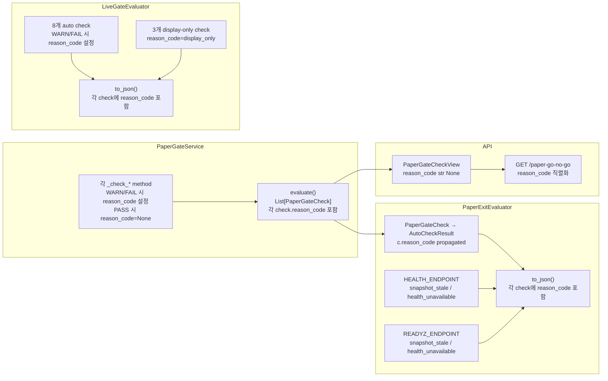

# Paper Gate / Exit / Live Gate Reason Code 강화 설계 (v2 — 보정 반영)

## 1. 목적

현재 gate/check 메시지는 사람이 읽기에는 충분하지만, 기계적으로 분류하기에는 부족합니다.
각 check 결과에 `reason_code` 라는 machine-readable 문자열을 additive로 추가하여,
모니터링/알림/대시보드에서 status 외에 **구체적인 WARN/FAIL 원인**을 자동 판별할 수 있도록 합니다.

**이번 턴의 목적은 "gate 결과의 구조화된 원인 부여"입니다.**
PASS까지 과하게 코드화하면 오히려 노이즈가 늘 수 있으므로 최소한으로 유지합니다.

---

## 2. 설계 판단 (4가지)

### 2.1 `code` vs `reason_code` 분리

| 필드 | 역할 | 예시 |
|------|------|------|
| `code` | **check의 정체성** (어떤 검사인가) | `MIN_SHARPE_RATIO`, `SNAPSHOT_FRESHNESS` |
| `reason_code` | **WARN/FAIL 결과의 원인** (왜 이 status인가) | `metric_below_threshold`, `snapshot_stale` |

- `code`는 변경 불가 (기존 consumer 의존)
- `reason_code`는 additive new field, `str | None`
- 한 check에서 status가 바뀌면 reason_code도 함께 바뀜
- `reason_code`는 판정 로직을 대체하지 않음 — 설명용/구조화용 추가 필드

### 2.2 단일 `reason_code` (이번 턴)

- 리스트가 아닌 단일 문자열
- 향후 복합 원인이 필요하면 별도 task에서 논의

### 2.3 출력 노출 정책

| 출력 형식 | reason_code 포함 여부 |
|-----------|----------------------|
| JSON (`to_json`) | **항상 포함** — machine consumer 대상 |
| Text (`to_text`) | **생략** — 사람이 보기에 불필요한 잡음 |
| API Response (`PaperGateCheckView`) | **포함** (`reason_code: str \| None = None`) |

### 2.4 API Schema 반영

- [`PaperGateCheckView`](src/agent_trading/api/schemas.py:602)에 `reason_code: str | None = None` 필드 추가
- backward compatible (기존 필드 변경 없음, 신규 필드는 optional None)

---

## 3. 기본값 정책 (보정 #1)

**`reason_code: str | None = None`** 으로 단일 고정.

- 빈 문자열(`""`)은 사용하지 않음
- 이유: 빈 문자열은 "값이 있음/없음" 판별과 JSON 소비자 처리에서 불필요한 ambiguity를 만듦
- `None` = reason_code가 할당되지 않음 (주로 PASS)
- `str` = 구체적인 WARN/FAIL 원인

---

## 4. PASS reason_code 정책 (보정 #2)

**WARN/FAIL에만 reason_code를 설정하고, PASS는 `reason_code=None`으로 유지.**

이유:
- 이번 턴의 목적은 "문제 원인 식별 강화"
- PASS까지 세분화하면 구조는 예쁘지만 신호 대 잡음비가 떨어짐
- 최소 변경 원칙에 부합

예외:
- `display_only`는 PASS이지만 reason_code가 의미 있음 → 예외 허용
  (Live Gate risk check는 always PASS인데 "이 check는 gate 미적용 정보 표시"임을
   machine이 식별할 수 있어야 하므로)

---

## 5. 네이밍 규칙 (보정 #4)

- `snake_case` only
- metric 계산 실패: `insufficient_data`, `insufficient_downside_samples`, `zero_drawdown`
  (→ `RiskMetricStatus`의 `.value`와 동일한 문자열 재사용)
- threshold 관련: `metric_below_threshold`
- 운영 이슈: `snapshot_stale`, `blocking_lock_present`, `sync_failure`,
  `excessive_sync_failures`, `excessive_reconcile_required`
- 외부 의존성: `benchmark_unavailable`, `benchmark_code_missing`,
  `health_unavailable`
- 정보 표시 전용: `display_only`

---

## 6. `RiskMetricStatus` vs `GateReasonCode` 역할 차이 (보정 #3)

| 구분 | `RiskMetricStatus` | `GateReasonCode` |
|------|-------------------|------------------|
| **목적** | metric 계산 결과의 상태 분류 | gate/policy 결과의 원인 분류 |
| **사용처** | `PerformanceMetrics.status_*` 필드 | `PaperGateCheck.reason_code`, `AutoCheckResult.reason_code`, `LiveGateCheck.reason_code` |
| **범위** | Sharpe/Sortino/Calmar 전용 | 모든 gate check (11개) |
| **값 중복** | — | `insufficient_data`, `insufficient_downside_samples`, `zero_drawdown` 재사용 |
| **의미** | metric을 계산할 수 있었는가 | gate check가 왜 WARN/FAIL인가 |

**재사용 규칙**: 두 enum이 동일한 문자열을 공유하더라도 역할은 다릅니다.
`RiskMetricStatus.INSUFFICIENT_DATA.value`와 `GateReasonCode.INSUFFICIENT_DATA.value`는
같은 문자열이지만, 전자는 `performance_summary`의 status 필드, 후자는 gate의 reason_code 필드에 쓰입니다.
이는 metric 계산 실패 원인을 gate 계층에서 동일한 vocabulary로 재사용하기 위한 의도적 결정입니다.

---

## 7. GateReasonCode Enum (최종)

```python
class GateReasonCode(str, Enum):
    # ── WARN/FAIL 계열 (reason_code 필수) ──
    METRIC_BELOW_THRESHOLD = "metric_below_threshold"         # 지표 < threshold
    METRIC_UNAVAILABLE = "metric_unavailable"                 # 지표 계산 불가
    INSUFFICIENT_DATA = "insufficient_data"                   # 표본 부족 (Sharpe 등)
    INSUFFICIENT_DOWNSIDE_SAMPLES = "insufficient_downside_samples"  # 음수 수익률 부족
    ZERO_DRAWDOWN = "zero_drawdown"                           # Max drawdown = 0
    SNAPSHOT_STALE = "snapshot_stale"                         # 스냅샷 오래됨
    BLOCKING_LOCK_PRESENT = "blocking_lock_present"           # 차단 락 존재
    BENCHMARK_UNAVAILABLE = "benchmark_unavailable"           # 벤치마크 데이터 없음
    BENCHMARK_CODE_MISSING = "benchmark_code_missing"         # 벤치마크 코드 미지정
    EXCESSIVE_SYNC_FAILURES = "excessive_sync_failures"       # Sync 연속 실패 초과
    EXCESSIVE_RECONCILE_REQUIRED = "excessive_reconcile_required"  # Reconcile 초과
    HEALTH_UNAVAILABLE = "health_unavailable"                 # Health endpoint 불능
    SYNC_FAILURE = "sync_failure"                             # Sync 실패

    # ── 정보 표시 전용 (PASS지만 의미 있는 예외) ──
    DISPLAY_ONLY = "display_only"                             # 정보 표시 전용 (Live Gate risk)
```

> 총 14개 값. PASS 계열은 별도 enum 값 없이 `None`으로 처리.

---

## 8. 변경할 Dataclass/Struct (4개)

### 8.1 [`PaperGateCheck`](src/agent_trading/services/paper_gate.py:67) — 내부 dataclass

```python
@dataclass(slots=True, frozen=True)
class PaperGateCheck:
    code: str
    label: str
    status: GateStatus
    measured_value: Decimal | int | None
    threshold: Decimal | int | None
    message: str
    reason_code: str | None = None   # ← 신규, 기본값 None
```

### 8.2 [`PaperGateCheckView`](src/agent_trading/api/schemas.py:602) — API response model

```python
class PaperGateCheckView(BaseModel):
    code: str
    label: str
    status: str
    measured_value: str | None
    threshold: str | None
    message: str
    reason_code: str | None = None   # ← 신규, 기본값 None
```

### 8.3 [`AutoCheckResult`](scripts/evaluate_paper_exit.py:83) — Paper Exit Layer A

```python
@dataclass(slots=True, frozen=True)
class AutoCheckResult:
    code: str
    status: str
    measured_value: str | None
    threshold: str | None
    message: str
    reason_code: str | None = None   # ← 신규, 기본값 None
```

### 8.4 [`LiveGateCheck`](scripts/evaluate_live_gate.py:81) — Live Gate

```python
@dataclass(slots=True, frozen=True)
class LiveGateCheck:
    code: str
    label: str
    layer: str
    status: str
    measured_value: str | None
    threshold: str | None
    message: str
    reason_code: str | None = None   # ← 신규, 기본값 None
```

---

## 9. Check Method × Code Path → reason_code Mapping

### 9.1 Paper Gate (`paper_gate.py`)

| Method | Code Path | Status | reason_code |
|--------|-----------|--------|-------------|
| `_check_min_return` | value is None | FAIL | `metric_unavailable` |
| `_check_min_return` | value < threshold | FAIL | `metric_below_threshold` |
| `_check_min_return` | else | PASS | `None` |
| `_check_max_drawdown` | value is None | PASS | `None` |
| `_check_max_drawdown` | value > threshold | FAIL | `metric_above_threshold` → `metric_below_threshold` 사용? NO — 초과이므로 `metric_unavailable`? 여기는 `metric_below_threshold`라는 이름과 실제 의미가 다름. **별도 코드 없이 `metric_below_threshold` 통일 사용** (drawdown도 "기준 미달"의미로 확장 해석) |
| `_check_max_drawdown` | value > threshold | FAIL | `metric_below_threshold` |
| `_check_max_drawdown` | else | PASS | `None` |
| `_check_excess_return` | value is None | FAIL | `metric_unavailable` |
| `_check_excess_return` | value < threshold | FAIL | `metric_below_threshold` |
| `_check_excess_return` | else | PASS | `None` |
| `_check_excess_return_unavailable` | - | WARN | `benchmark_unavailable` |
| `_check_win_rate` | value is None | PASS | `None` |
| `_check_win_rate` | value < threshold | WARN | `metric_below_threshold` |
| `_check_win_rate` | else | PASS | `None` |
| `_check_min_sharpe_ratio` | value is None | WARN | `insufficient_data` |
| `_check_min_sharpe_ratio` | value < threshold | WARN | `metric_below_threshold` |
| `_check_min_sharpe_ratio` | else | PASS | `None` |
| `_check_min_sortino_ratio` | value is None | WARN | `insufficient_downside_samples` |
| `_check_min_sortino_ratio` | value < threshold | WARN | `metric_below_threshold` |
| `_check_min_sortino_ratio` | else | PASS | `None` |
| `_check_min_calmar_ratio` | value is None | WARN | `zero_drawdown` |
| `_check_min_calmar_ratio` | value < threshold | WARN | `metric_below_threshold` |
| `_check_min_calmar_ratio` | else | PASS | `None` |
| `_check_filled_orders` | value < threshold | FAIL | `metric_below_threshold` |
| `_check_filled_orders` | else | PASS | `None` |
| `_check_snapshot_freshness` | is_stale | FAIL | `snapshot_stale` |
| `_check_snapshot_freshness` | else | PASS | `None` |
| `_check_sync_failures` | > threshold | FAIL | `excessive_sync_failures` |
| `_check_sync_failures` | else | PASS | `None` |
| `_check_blocking_locks` | lock_count > 0 | FAIL | `blocking_lock_present` |
| `_check_blocking_locks` | else | PASS | `None` |

### 9.2 Paper Exit Layer A — reason_code propagate 규칙 (보정 #6)

```
PaperGateCheck.reason_code ──복사──→ AutoCheckResult.reason_code
                                        (직접 매핑, 변환 없음)

HEALTH_ENDPOINT ──자체생성──→ AutoCheckResult.reason_code
READYZ_ENDPOINT  ──자체생성──→ AutoCheckResult.reason_code
```

| Source | Code Path | Status | reason_code |
|--------|-----------|--------|-------------|
| PaperGateService.check | c.reason_code | - | **propagated** (그대로 복사) |
| HEALTH_ENDPOINT | is_stale=True | FAIL | `snapshot_stale` |
| HEALTH_ENDPOINT | is_stale=False | PASS | `None` |
| HEALTH_ENDPOINT | Exception (None) | FAIL | `health_unavailable` |
| READYZ_ENDPOINT | is_stale=True | WARN | `snapshot_stale` |
| READYZ_ENDPOINT | is_stale=False | PASS | `None` |
| READYZ_ENDPOINT | Exception (None) | FAIL | `health_unavailable` |

**우선순위 충돌 규칙**: 각 check은 독립적이므로 충돌이 발생하지 않음.
PaperGateService의 각 check은 개별 `PaperGateCheck` → 개별 `AutoCheckResult`로 1:1 매핑.
A9/A10은 별도 check으로 추가되므로 겹치지 않음.

### 9.3 Live Gate Auto (보정 #5: display-only 항목 정책)

- LG_SHARPE_RATIO / LG_SORTINO_RATIO / LG_CALMAR_RATIO:
  - always PASS (display-only)
  - `reason_code = "display_only"` (정보 표시 전용임을 machine이 식별 가능)
  - 데이터 유무와 무관하게 `"display_only"`로 통일
  - (None으로 두면 PASS와 구분 불가 → display-only 정책 위반임을 알 수 없음)

| Check | Code Path | Status | reason_code |
|-------|-----------|--------|-------------|
| LG_FILLED_ORDERS | filled < threshold | FAIL | `metric_below_threshold` |
| LG_FILLED_ORDERS | else | PASS | `None` |
| LG_MAX_DRAWDOWN | dd > threshold | FAIL | `metric_below_threshold` |
| LG_MAX_DRAWDOWN | dd is None | PASS | `None` |
| LG_MAX_DRAWDOWN | else | PASS | `None` |
| LG_EXCESS_RETURN | excess < threshold | FAIL | `metric_below_threshold` |
| LG_EXCESS_RETURN | excess >= threshold | PASS | `None` |
| LG_EXCESS_RETURN | exception | WARN | `benchmark_unavailable` |
| LG_EXCESS_RETURN | no benchmark_code | WARN | `benchmark_code_missing` |
| LG_WIN_RATE | wr < threshold | WARN | `metric_below_threshold` |
| LG_WIN_RATE | else | PASS | `None` |
| LG_RECENT_RECONCILE | count > threshold | FAIL | `excessive_reconcile_required` |
| LG_RECENT_RECONCILE | else | PASS | `None` |
| LG_RECENT_BLOCKING_LOCKS | count > threshold | FAIL | `blocking_lock_present` |
| LG_RECENT_BLOCKING_LOCKS | else | PASS | `None` |
| LG_READYZ | is_stale | WARN | `snapshot_stale` |
| LG_READYZ | else | PASS | `None` |
| LG_POST_SUBMIT_SYNC | failures > 0 | WARN/FAIL | `sync_failure` |
| LG_POST_SUBMIT_SYNC | else | PASS | `None` |
| LG_SHARPE_RATIO | sr is not None | PASS | `display_only` |
| LG_SHARPE_RATIO | sr is None | PASS | `display_only` |
| LG_SORTINO_RATIO | sortino is not None | PASS | `display_only` |
| LG_SORTINO_RATIO | sortino is None | PASS | `display_only` |
| LG_CALMAR_RATIO | calmar is not None | PASS | `display_only` |
| LG_CALMAR_RATIO | calmar is None | PASS | `display_only` |

---

## 10. JSON 포함 대상 범위 (보정 #7)

| 출력 위치 | 경로 | reason_code 포함 범위 |
|-----------|------|----------------------|
| `/performance/paper-go-no-go` API | `GET /paper-go-no-go` | 각 `PaperGateCheckView`에 `reason_code` 필드 |
| `evaluate_paper_exit.py --output json` | `to_json()` → `layers.auto.checks[]` | 각 check dict에 `reason_code` 키 |
| `evaluate_live_gate.py --output json` | `to_json()` → `live_gate.auto_checks[]`, `paper_exit.layer_a_checks[]` | 각 check dict에 `reason_code` 키 |
| Text 출력 | `to_text()` | **미포함** (사람 친화적 유지) |

---

## 11. 데이터 흐름 (Mermaid)



---

## 12. 변경 파일 목록

| 파일 | 변경 유형 | 변경 목적 |
|------|----------|----------|
| `src/agent_trading/services/risk_metric_constants.py` | 신규 enum 추가 | `GateReasonCode` enum 14개 값 정의 |
| `src/agent_trading/services/paper_gate.py` | 기존 수정 | `PaperGateCheck.reason_code` 필드 추가 + 11개 check method에 WARN/FAIL 시 reason_code 설정 |
| `src/agent_trading/api/schemas.py` | 기존 수정 | `PaperGateCheckView.reason_code: str \| None = None` 필드 추가 |
| `scripts/evaluate_paper_exit.py` | 기존 수정 | `AutoCheckResult.reason_code` 필드 추가 + evaluate_auto()에서 PaperGateCheck.reason_code propagate + A9/A10 reason_code 설정 + to_json()에 reason_code 포함 |
| `scripts/evaluate_live_gate.py` | 기존 수정 | `LiveGateCheck.reason_code` 필드 추가 + evaluate_live_auto() 11개 check reason_code 설정 + to_json()에 reason_code 포함 |
| `tests/services/test_paper_gate.py` | 기존 수정 | T1/T2/T3 reason_code 검증 + PASS case reason_code=None 검증 추가 |
| `tests/scripts/test_evaluate_paper_exit.py` | 기존 수정 | T4 reason_code JSON 노출 검증 + backward compat 검증 |
| `tests/scripts/test_evaluate_live_gate.py` | 기존 수정 | T5 display-only reason_code 검증 + backward compat 검증 |

---

## 13. Migration 필요 여부

**없음.** 모든 변경은 additive입니다:
- 새 필드 `reason_code`는 기본값 `None`
- 기존 consumer는 필드를 무시하면 기존 동작 유지
- DB migration 불필요 (reason_code는 저장하지 않음, runtime에서만 생성)
- Admin UI 변경 불필요
- Route/API schema 확장은 backward compatible

---

## 14. 테스트 계획 (8개 항목, 보정 #8 반영)

### T1: threshold 미달 시 `reason_code=metric_below_threshold`
- **파일**: `tests/services/test_paper_gate.py` — `test_risk_metrics_warn_below_threshold`
- **내용**: Sharpe/Sortino/Calmar 각각 WARN status + `reason_code == "metric_below_threshold"` 검증

### T2: Sharpe/Sortino/Calmar None case reason_code 검증
- **파일**: `tests/services/test_paper_gate.py` — 신규 테스트 또는 `test_risk_metrics_warn_below_threshold` 확장
- **내용**: risk metric value=None 시 각각 `"insufficient_data"`, `"insufficient_downside_samples"`, `"zero_drawdown"` 검증
- (기존 None case를 발생시키려면 equity history가 충분하지 않은 시나리오 필요)

### T3: Snapshot stale / blocking lock fail case reason_code 검증
- **파일**: `tests/services/test_paper_gate.py`
- **내용**:
  - `test_stale_snapshot_fails` 내에서 `reason_code == "snapshot_stale"` 검증
  - `test_blocking_lock_fails` 내에서 `reason_code == "blocking_lock_present"` 검증

### T4: Paper Exit JSON 출력에 reason_code 노출 검증
- **파일**: `tests/scripts/test_evaluate_paper_exit.py` — `test_json_output_format`
- **내용**: JSON dict 각 auto check에 `reason_code` 키 존재 확인

### T5: Live Gate display-only risk checks의 reason_code 정책 검증
- **파일**: `tests/scripts/test_evaluate_live_gate.py` — `test_live_auto_includes_risk_checks`
- **내용**: LG_SHARPE_RATIO/SORTINO/CALMAR의 `reason_code == "display_only"` 검증

### T6: 기존 message/status 회귀 없음 확인
- **파일**: 전체 테스트 스위트 실행
- **내용**: 기존 assertion은 그대로 유지 (message, status, code, measured_value, threshold 변경 없음)

### T7 (신규): PASS case에서 `reason_code is None` 검증
- **파일**: `tests/services/test_paper_gate.py` — `test_all_pass_returns_go` 확장
- **내용**: 모든 check이 PASS일 때 `reason_code is None` (또는 `display_only`가 아닌 check) 검증

### T8 (신규): 기존 JSON consumer backward compatibility 검증
- **파일**: `tests/scripts/test_evaluate_paper_exit.py` / `tests/scripts/test_evaluate_live_gate.py`
- **내용**: 기존 JSON dict에 `reason_code` 필드가 추가되어도 기존 키(`code`, `status`, `message` 등)가 모두 동일하게 유지되는지 검증

---

## 15. 제약 조건 점검

| 제약 | 준수 여부 | 설명 |
|------|----------|------|
| 기존 `status`/`message`/`code` semantics 변경 금지 | ✅ | 변경 없음 |
| gate overall 판정 로직 변경 금지 | ✅ | `_determine_overall()` 변경 없음 |
| `reason_code`는 판정 로직 대체 금지 | ✅ | additive metadata로만 사용 |
| `RiskMetricStatus`와 과도 결합 금지 | ✅ | 문자열만 재사용, enum간 의존성 없음 |
| text 출력 사람 친화적 유지 | ✅ | reason_code 미포함 |
| DB migration 금지 | ✅ | runtime only |
| Admin UI 변경 금지 | ✅ | API schema만 확장 |
| Paper/Live 동일 시스템 원칙 | ✅ | `GateReasonCode` enum 공유 |
| Additive 변경만 수행 | ✅ | 기존 모든 필드 유지 |
| Route/API schema backward compatible | ✅ | `None` default |

---

## 16. 실행 단계 (Code mode)

```
Step 1: GateReasonCode enum을 risk_metric_constants.py에 추가 (14개 값)
Step 2: PaperGateCheck.reason_code 필드 추가 + 11개 check method 수정 (WARN/FAIL만 설정)
Step 3: PaperGateCheckView.reason_code 필드 추가
Step 4: AutoCheckResult.reason_code 필드 추가 + evaluate_auto() reason_code propagate + A9/A10 설정
Step 5: LiveGateCheck.reason_code 필드 추가 + 11개 check method 수정
Step 6: to_json()에 reason_code 포함 (paper_exit + live_gate)
Step 7: 테스트 8개 항목 작성
Step 8: 전체 테스트 스위트 실행
Step 9: 8-section 완료 보고서 작성
```
