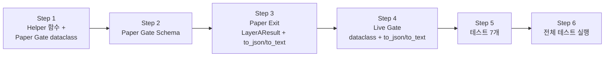

# Paper Gate / Exit / Live Gate reason_code 요약 집계 read-only 강화

## 1. 현재 상태 요약

### 1.1 개별 check 수준: ✅ 완료 (기존 구현)

| 계층 | Dataclass | `reason_code` 필드 | 상태 |
|------|-----------|-------------------|------|
| Paper Gate | [`PaperGateCheck`](src/agent_trading/services/paper_gate.py:69) | `reason_code: str \| None = None` (line 78) | ✅ |
| Paper Gate API | [`PaperGateCheckView`](src/agent_trading/api/schemas.py:602) | `reason_code: str \| None = None` (line 617) | ✅ |
| Paper Exit | [`AutoCheckResult`](scripts/evaluate_paper_exit.py:85) | `reason_code: str \| None = None` (line 93) | ✅ |
| Live Gate | [`LiveGateCheck`](scripts/evaluate_live_gate.py:83) | `reason_code: str \| None = None` (line 93) | ✅ |

`reason_code` 설정 규칙 ([`gate_reason_code_enhancement.md`](plans/gate_reason_code_enhancement.md)):
- WARN/FAIL check: 해당 원인을 나타내는 `GateReasonCode` enum value 할당
- PASS check: `reason_code=None` (정상 통과)
- display-only check (Live Gate Sharpe/Sortino/Calmar): `reason_code="display_only"`, status는 항상 PASS

### 1.2 요약/집계 수준: ❌ 미구현 (이번 작업 범위)

| 계층 | Dataclass / Output | 현재 구조 | 누락된 summary 필드 |
|------|-------------------|-----------|-------------------|
| Paper Gate | [`PaperGoNoGoEvaluation`](src/agent_trading/services/paper_gate.py:82) | checks[], overall_status, summary_reason | reason_code_counts, warn_reason_codes, fail_reason_codes, display_only_count |
| Paper Gate API | [`PaperGoNoGoEvaluationView`](src/agent_trading/api/schemas.py:620) | checks[], overall_status, summary_reason | (동일) |
| Paper Exit | [`LayerAResult`](scripts/evaluate_paper_exit.py:121) | status, checks[], gate_evaluation | (동일) |
| Paper Exit JSON | [`to_json()`](scripts/evaluate_paper_exit.py:630) | check 단위 reason_code만 포함 | summary 블록 없음 |
| Live Gate | [`LiveCanaryReadinessEvaluation`](scripts/evaluate_live_gate.py:96) | checks[], overall_status, summary_reason | (동일) |
| Live Gate JSON | [`to_json()`](scripts/evaluate_live_gate.py:790) | auto_summary(pass/warn/fail count)만 있음 | reason_code aggregation 없음 |
| Text 출력 | 양쪽 스크립트 | reason_code 미포함 | (영향 없음) |

---

## 2. 설계 고정사항 (보정 반영)

### 2.1 Summary Field 기본값

| 필드 | 타입 | 기본값 | 설명 |
|------|------|--------|------|
| `reason_code_counts` | `dict[str, int]` | `field(default_factory=dict)` | non-None reason_code 값별 등장 횟수 |
| `warn_reason_codes` | `list[str]` | `field(default_factory=list)` | WARN check의 unique reason_code 목록 (정렬) |
| `fail_reason_codes` | `list[str]` | `field(default_factory=list)` | FAIL check의 unique reason_code 목록 (정렬) |
| `display_only_count` | `int` | `0` | display_only check 개수 (별도 파생 필드) |

모든 필드는 `field(default_factory=...)` 또는 리터럴 기본값을 가지므로, 기존 생성자 호출 코드를 전혀 수정하지 않아도 동작. 기존 consumer(before this change)는 이 필드를 무시하므로 backward compatible.

### 2.2 `warn_reason_codes` / `fail_reason_codes` 규칙

- **중복 없음 (unique)**: 동일한 `reason_code` 값이 여러 check에서 나타나도 목록에 한 번만 포함
- **정렬됨 (sorted)**: `sorted()` 기준 알파벳 오름차순
- **의미**: 각각 WARN 상태인 check들에서 발생한 원인 코드의 **종류** 목록. 발생 횟수가 아니라 원인 종류가 중요할 때 사용
- 발생 횟수가 필요하면 `reason_code_counts` 참조

### 2.3 `display_only` 포함 정책

- `reason_code_counts`: **`display_only` 포함** — 모든 non-None reason_code 값을 빠짐없이 카운트
- `display_only_count`: **별도 파생 필드** — `reason_code_counts["display_only"]`와 동일한 값. 편의성과 가독성을 위해 별도 필드로 제공
- JSON: `reason_code_counts`에 `"display_only": 3` 형태로 포함 + `display_only_count: 3` 별도 노출
- Text: count만 노출 (코드별 상세 불필요)

### 2.4 Helper 입력 계약

`compute_reason_code_summary()` 함수는 duck-typing을 사용하며, 다음 최소 속성을 가진 객체 시퀀스를 입력으로 받음:

```python
class HasGateCheckFields(Protocol):
    """Minimum required fields for reason_code summary computation."""
    status: str       # "PASS" | "WARN" | "FAIL" (호환 가능하면 OK)
    reason_code: str | None  # None(PASS) 또는 GateReasonCode value
```

실제 전달되는 타입 (모두 위 계약 충족):
- `PaperGateCheck` (paper_gate.py)
- `AutoCheckResult` (evaluate_paper_exit.py)
- `LiveGateCheck` (evaluate_live_gate.py)

### 2.5 Text Summary 포맷

**포맷**: `reason_codes: warn={warn_count}, fail={fail_count}, display_only={display_only_count}`

- `warn_count`: WARN check 중 `reason_code != None`인 check 개수 (display_only 제외)
- `fail_count`: FAIL check 중 `reason_code != None`인 check 개수
- `display_only_count`: `reason_code == "display_only"`인 check 개수
- **모든 0인 경우 출력하지 않음** (all PASS)
- 코드별 상세는 포함하지 않음 — JSON에서 확인 가능

예시:
```
reason_codes: warn=2, fail=1, display_only=3
reason_codes: warn=1
(모두 0이면 출력 없음)
```

### 2.6 Paper Exit Layer A Summary 집계 범위

**Layer A 전체 checks 기준으로 집계** — Paper Gate의 11개 check + A9(HEALTH_ENDPOINT) + A10(READYZ_ENDPOINT) = 최대 13개 checks 전체를 대상으로 산출.

LayerAResult 생성 시점에 `evaluate_auto()`가 `auto_checks` 리스트를 완성한 후 `compute_reason_code_summary(auto_checks)` 호출.

### 2.7 Live Gate Summary Display-Only 취급

| 출력 형식 | display_only 취급 |
|----------|------------------|
| **JSON** (`to_json()`) | `reason_code_counts`에 포함 + `display_only_count` 별도 필드로 완전 노출 |
| **Text** (`to_text()`) | 텍스트 summary 한 줄에 count만 노출 (코드명 생략) — 예: `reason_codes: warn=1, fail=0, display_only=3` |
| **Paper Gate API** | JSON 응답에 포함 — `display_only`는 Paper Gate에는 없지만 Live Gate에는 있으므로, Live Gate JSON에서만 의미 있음 |

---

## 3. Pre-implementation Decisions (5개)

### Decision 1: Aggregation Location — dataclass 계층 vs JSON-only

**선택: Dataclass 계층에 추가 (PaperGoNoGoEvaluation → Pydantic schema로 자동 전파)**

근거:
1. [`PaperGoNoGoEvaluation`](src/agent_trading/services/paper_gate.py:82)은 `from_attributes=True`로 [`PaperGoNoGoEvaluationView`](src/agent_trading/api/schemas.py:620)에 매핑되므로, dataclass에 추가하면 schema도 자동 반영
2. [`LayerAResult.gate_evaluation`](scripts/evaluate_paper_exit.py:126)이 `PaperGoNoGoEvaluation`을 직접 참조하므로, Paper Exit JSON에서도 동일 데이터 사용 가능
3. [`LiveCanaryReadinessEvaluation`](scripts/evaluate_live_gate.py:96)은 별도 dataclass이므로 별도 필드 추가 필요
4. Additive only 원칙 충족 — 기존 필드 수정 없음, 신규 필드만 추가

**적용 대상 dataclass:**
1. [`PaperGoNoGoEvaluation`](src/agent_trading/services/paper_gate.py:82) — 신규 필드 4개 추가
2. [`LiveCanaryReadinessEvaluation`](scripts/evaluate_live_gate.py:96) — 신규 필드 4개 추가

### Decision 2: 집계 대상 범위

| reason_code 값 | `reason_code_counts` 포함? | `display_only_count` 포함? | 비고 |
|---------------|--------------------------|--------------------------|------|
| `None` (PASS) | ❌ 제외 | ❌ | 정상 PASS는 집계 불필요 |
| `"display_only"` | ✅ 포함 (카운트) | ✅ 별도 파생 필드 | display-only check 식별 |
| WARN reason_code (`metric_below_threshold` 등) | ✅ 포함 | ❌ | `warn_reason_codes`에 추가 |
| FAIL reason_code (`snapshot_stale` 등) | ✅ 포함 | ❌ | `fail_reason_codes`에 추가 |

**정책:**
- `reason_code_counts`: 모든 non-None reason_code 값의 등장 횟수 (`display_only` 포함)
- `display_only_count`: `reason_code == "display_only"`인 check 개수 (별도 파생 필드, `reason_code_counts["display_only"]`와 동일)
- `warn_reason_codes`: WARN status check의 unique reason_code 값 목록 (정렬) — display_only 제외
- `fail_reason_codes`: FAIL status check의 unique reason_code 값 목록 (정렬) — display_only 제외

### Decision 3: 정확한 필드 시그니처

```python
# Dataclass 필드 (4개):
reason_code_counts: dict[str, int] = field(default_factory=dict)
warn_reason_codes: list[str] = field(default_factory=list)
fail_reason_codes: list[str] = field(default_factory=list)
display_only_count: int = 0
```

### Decision 4: Shared Helper 위치

**선택: [`paper_gate.py`](src/agent_trading/services/paper_gate.py)에 모듈 레벨 함수로 배치**

근거:
1. `PaperGateCheck`가 이미 이 모듈에 정의되어 있음
2. `evaluate_paper_exit.py`와 `evaluate_live_gate.py`가 이미 `from agent_trading.services.paper_gate import ...`를 수행 중
3. 새로운 import를 최소화 — 이미 paper_gate.py를 import하고 있으므로 추가 import 불필요
4. `risk_metric_constants.py`는 상수 전용 모듈이므로 computation 로직 추가 부적합
5. 새로운 모듈 생성은 오버엔지니어링 — 단일 helper 함수를 위해 파일 신규 생성 불필요

### Decision 5: Text 출력 포함 여부

- **JSON 출력**: `to_json()`에 summary 블록 추가 ✅
- **Paper Gate API**: `PaperGoNoGoEvaluationView`에 신규 필드 추가 ✅
- **Text 출력**: count 중심의 짧은 한 줄 summary (2.5절 포맷 참조)

---

## 4. 상세 설계

### 4.1 Shared Helper: `compute_reason_code_summary()`

파일: [`src/agent_trading/services/paper_gate.py`](src/agent_trading/services/paper_gate.py) (모듈 레벨, `PaperGoNoGoEvaluation` dataclass 직후)

```python
def compute_reason_code_summary(
    checks: Sequence[PaperGateCheck],
) -> dict[str, Any]:
    """Compute reason_code summary aggregation from gate checks.
    
    Pure function — no side effects. Operates on any check-like objects
    that have ``reason_code: str | None`` and ``status: str`` fields
    (PaperGateCheck, AutoCheckResult, LiveGateCheck).
    
    Args:
        checks: Gate check sequence with status and reason_code attributes.
        
    Returns:
        Dictionary with four keys for read-only JSON inclusion:
        - reason_code_counts: dict[str, int] — non-None reason_code별 등장 횟수
        - warn_reason_codes: list[str] — WARN check의 unique reason_code (정렬)
        - fail_reason_codes: list[str] — FAIL check의 unique reason_code (정렬)
        - display_only_count: int — display_only check 개수 (별도 파생)
    """
    reason_code_counts: dict[str, int] = {}
    warn_codes: set[str] = set()
    fail_codes: set[str] = set()
    display_only_count = 0
    
    for c in checks:
        rc = c.reason_code
        if rc is None:
            continue  # PASS checks excluded from summary
        
        reason_code_counts[rc] = reason_code_counts.get(rc, 0) + 1
        
        if rc == GateReasonCode.DISPLAY_ONLY.value:
            display_only_count += 1
        elif c.status == "WARN":
            warn_codes.add(rc)
        elif c.status == "FAIL":
            fail_codes.add(rc)
    
    return {
        "reason_code_counts": reason_code_counts,
        "warn_reason_codes": sorted(warn_codes),
        "fail_reason_codes": sorted(fail_codes),
        "display_only_count": display_only_count,
    }
```

### 4.2 Paper Gate — Dataclass + Service 수정

[`PaperGoNoGoEvaluation`](src/agent_trading/services/paper_gate.py:82)에 4개 필드 추가:

```python
@dataclass(slots=True, frozen=True)
class PaperGoNoGoEvaluation:
    account_id: UUID
    strategy_id: UUID | None
    overall_status: OverallStatus
    checks: Sequence[PaperGateCheck]
    generated_at: datetime
    summary_reason: str
    # --- 신규: reason_code 요약 집계 (read-only additive) ---
    reason_code_counts: dict[str, int] = field(default_factory=dict)
    warn_reason_codes: list[str] = field(default_factory=list)
    fail_reason_codes: list[str] = field(default_factory=list)
    display_only_count: int = 0
```

[`PaperGateService.evaluate()`](src/agent_trading/services/paper_gate.py:124) return 부분:

```python
# After (line ~200):
summary_data = compute_reason_code_summary(checks)
return PaperGoNoGoEvaluation(
    account_id=account_id,
    strategy_id=strategy_id,
    overall_status=overall_status,
    checks=checks,
    generated_at=now,
    summary_reason=summary,
    **summary_data,
)
```

### 4.3 Paper Gate API — Pydantic Schema 수정

[`PaperGoNoGoEvaluationView`](src/agent_trading/api/schemas.py:620)에 4개 필드 추가:

```python
class PaperGoNoGoEvaluationView(BaseModel):
    model_config = ConfigDict(from_attributes=True)
    
    account_id: str
    strategy_id: str | None
    overall_status: str  # GO / HOLD / NO_GO
    checks: list[PaperGateCheckView]
    generated_at: datetime
    summary_reason: str
    # --- 신규: reason_code 요약 집계 (read-only additive) ---
    reason_code_counts: dict[str, int] = {}
    warn_reason_codes: list[str] = []
    fail_reason_codes: list[str] = []
    display_only_count: int = 0
```

`from_attributes=True`이므로 dataclass → Pydantic 자동 매핑. 기본값이 있으므로 기존 API consumer에 영향 없음. Route 코드 수정 불필요.

### 4.4 Paper Exit — LayerAResult + evaluate_auto() + to_json/to_text

[`LayerAResult`](scripts/evaluate_paper_exit.py:121)에 4개 필드 추가:

```python
@dataclass(slots=True, frozen=True)
class LayerAResult:
    """Layer A: 자동 판정 결과."""
    
    status: str  # PASS / WARN / FAIL
    checks: Sequence[AutoCheckResult]
    gate_evaluation: PaperGoNoGoEvaluation | None
    # --- 신규: Layer A 전체 checks 기준 reason_code 요약 ---
    reason_code_counts: dict[str, int] = field(default_factory=dict)
    warn_reason_codes: list[str] = field(default_factory=list)
    fail_reason_codes: list[str] = field(default_factory=list)
    display_only_count: int = 0
```

[`evaluate_auto()`](scripts/evaluate_paper_exit.py:185) return 전:

```python
# After building auto_checks (PaperGate + A9 + A10, ~line 280):
summary_data = compute_reason_code_summary(auto_checks)
return LayerAResult(
    status=auto_status,
    checks=auto_checks,
    gate_evaluation=eval_result,
    **summary_data,
)
```

[`to_json()`](scripts/evaluate_paper_exit.py:630)에 `reason_code_summary` 블록 추가:

```python
# layers.auto 섹션에 추가 (~line 645):
"layers": {
    "auto": {
        "status": auto.status,
        "summary": {
            "total": len(auto.checks),
            "pass": sum(1 for c in auto.checks if c.status == "PASS"),
            "warn": sum(1 for c in auto.checks if c.status == "WARN"),
            "fail": sum(1 for c in auto.checks if c.status == "FAIL"),
        },
        "checks": [...],
        "reason_code_summary": {
            "reason_code_counts": auto.reason_code_counts,
            "warn_reason_codes": auto.warn_reason_codes,
            "fail_reason_codes": auto.fail_reason_codes,
            "display_only_count": auto.display_only_count,
        },
    },
}
```

[`to_text()`](scripts/evaluate_paper_exit.py:545)에 한 줄 summary 추가:

```python
# Summary line before overall status:
_summary_line = _build_reason_code_text_summary(auto)
if _summary_line:
    lines.append(f"  {_summary_line}")
```

```python
@staticmethod
def _build_reason_code_text_summary(
    result: LayerAResult,
) -> str:
    """Build one-line reason_code text summary (counts only, no detail codes)."""
    parts = []
    if result.warn_reason_codes:
        parts.append(f"warn={len(result.warn_reason_codes)}")
    if result.fail_reason_codes:
        parts.append(f"fail={len(result.fail_reason_codes)}")
    if result.display_only_count:
        parts.append(f"display_only={result.display_only_count}")
    if not parts:
        return ""
    return f"reason_codes: {', '.join(parts)}"
```

### 4.5 Live Gate — Dataclass + main() + to_json/to_text

[`LiveCanaryReadinessEvaluation`](scripts/evaluate_live_gate.py:96)에 4개 필드 추가:

```python
@dataclass(slots=True, frozen=True)
class LiveCanaryReadinessEvaluation:
    account_id: UUID
    strategy_id: UUID | None
    overall_status: str
    paper_exit_status: str
    checks: Sequence[LiveGateCheck]
    generated_at: datetime
    summary_reason: str
    # --- 신규: reason_code 요약 집계 (read-only additive) ---
    reason_code_counts: dict[str, int] = field(default_factory=dict)
    warn_reason_codes: list[str] = field(default_factory=list)
    fail_reason_codes: list[str] = field(default_factory=list)
    display_only_count: int = 0
```

[`main()`](scripts/evaluate_live_gate.py:986) 평가 결과 생성 부분:

```python
# After:
all_checks = [*auto_checks, *manual_checks]
summary_data = compute_reason_code_summary(all_checks)
evaluation = LiveCanaryReadinessEvaluation(
    account_id=account_id,
    strategy_id=strategy_id,
    overall_status=overall_status,
    paper_exit_status=paper_exit_status,
    checks=all_checks,
    generated_at=now,
    summary_reason=summary_reason,
    **summary_data,
)
```

[`to_json()`](scripts/evaluate_live_gate.py:790)에 `reason_code_summary` 블록 추가:

```python
# live_gate 섹션에 추가 (~line 830):
"live_gate": {
    "auto_checks": [...],
    "manual_checks": [...],
    "auto_summary": {
        "total": len(auto_checks),
        "pass": ...,
        "warn": ...,
        "fail": ...,
    },
    "manual_summary": {...},
    "reason_code_summary": {
        "reason_code_counts": eval_.reason_code_counts,
        "warn_reason_codes": eval_.warn_reason_codes,
        "fail_reason_codes": eval_.fail_reason_codes,
        "display_only_count": eval_.display_only_count,
    },
}
```

[`to_text()`](scripts/evaluate_live_gate.py:708)에 한 줄 summary 추가 (Paper Exit과 동일한 `_build_reason_code_text_summary` 패턴 사용):

```python
# Summary line before overall status:
if eval_.reason_code_counts:
    parts = []
    if eval_.warn_reason_codes:
        parts.append(f"warn={len(eval_.warn_reason_codes)}")
    if eval_.fail_reason_codes:
        parts.append(f"fail={len(eval_.fail_reason_codes)}")
    if eval_.display_only_count:
        parts.append(f"display_only={eval_.display_only_count}")
    lines.append(f"  reason_codes: {', '.join(parts)}")
```

---

## 5. Mermaid: 데이터 흐름

```mermaid
flowchart TD
    subgraph Helper
        F[compute_reason_code_summary<br/>checks: Sequence] -->|counts + unique sorted codes| G[{reason_code_counts<br/>warn_reason_codes<br/>fail_reason_codes<br/>display_only_count}]
    end

    subgraph PaperGate
        PG[PaperGateService.evaluate] -->|checks| F
        F -->|**summary_data| PE[PaperGoNoGoEvaluation<br/>+ 4 summary fields]
        PE -->|from_attributes| PEV[PaperGoNoGoEvaluationView<br/>+ 4 summary fields]
        PEV -->|GET response| API[/paper-go-no-go API/]
    end

    subgraph PaperExit
        EA[evaluate_auto] -->|auto_checks<br/>PaperGate 11 + A9 + A10| F
        F -->|**summary_data| LAR[LayerAResult<br/>+ 4 summary fields]
        LAR -->|to_json| PEJ[Paper Exit JSON<br/>layers.auto.reason_code_summary]
        LAR -->|to_text| PET[reason_codes: warn=2, fail=1]
    end

    subgraph LiveGate
        LG[main] -->|all_checks<br/>auto + manual| F
        F -->|**summary_data| LCE[LiveCanaryReadinessEvaluation<br/>+ 4 summary fields]
        LCE -->|to_json| LGJ[Live Gate JSON<br/>live_gate.reason_code_summary]
        LCE -->|to_text| LGT[reason_codes: warn=1, display_only=3]
    end

    style F fill:#4a90d9,color:#fff
    style G fill:#4a90d9,color:#fff
```

---

## 6. 변경 파일 목록

| # | 파일 | 변경 내용 | 영향 |
|---|------|----------|------|
| 1 | [`src/agent_trading/services/paper_gate.py`](src/agent_trading/services/paper_gate.py) | `compute_reason_code_summary()` 함수 추가, `PaperGoNoGoEvaluation` 4개 필드 추가, `evaluate()` return에 **summary_data 적용 | 중간 |
| 2 | [`src/agent_trading/api/schemas.py`](src/agent_trading/api/schemas.py) | `PaperGoNoGoEvaluationView` 4개 필드 추가 (기본값 있음) | 낮음 |
| 3 | [`scripts/evaluate_paper_exit.py`](scripts/evaluate_paper_exit.py) | `LayerAResult` 4개 필드 추가, `evaluate_auto()` summary 적용, `to_json()` reason_code_summary 블록, `to_text()` 한 줄 summary + `_build_reason_code_text_summary()` 추가 | 중간 |
| 4 | [`scripts/evaluate_live_gate.py`](scripts/evaluate_live_gate.py) | `LiveCanaryReadinessEvaluation` 4개 필드 추가, `main()` summary 적용, `to_json()` 블록, `to_text()` 한 줄 summary | 중간 |

**변경 불필요 파일:**
- [`src/agent_trading/api/routes/performance.py`](src/agent_trading/api/routes/performance.py) — `from_attributes=True` 자동 매핑
- [`src/agent_trading/services/risk_metric_constants.py`](src/agent_trading/services/risk_metric_constants.py) — 상수 전용
- DB migration, admin UI — 금지 조건

---

## 7. 테스트 계획

### 7.1 신규 테스트

#### [`tests/services/test_paper_gate.py`](tests/services/test_paper_gate.py) — 3개

| # | 테스트명 | 검증 내용 |
|---|---------|----------|
| **T9** | `test_reason_code_summary_all_pass` | 모든 check PASS(PAPER_GATE_MIN_RETURN_PCT=-99 등 env override) → `reason_code_counts` 비어있음, `warn_reason_codes`=[], `fail_reason_codes`=[], `display_only_count`=0 |
| **T10** | `test_reason_code_summary_with_warns` | 일부 WARN 발생 (risk metrics None) → `reason_code_counts`에 insufficient_data/insufficient_downside_samples/zero_drawdown 각 1, `warn_reason_codes`에 3개 code, `display_only_count`=0 |
| **T11** | `test_reason_code_summary_with_fails` | FAIL 포함 (stale snapshot + fresh sync skip) → `fail_reason_codes`에 snapshot_stale 포함, `warn_reason_codes`는 빈 list거나 risk metric WARN 포함 가능 |

#### [`tests/scripts/test_evaluate_paper_exit.py`](tests/scripts/test_evaluate_paper_exit.py) — 2개

| # | 테스트명 | 검증 내용 |
|---|---------|----------|
| **T9** | `test_json_includes_reason_code_summary` | `to_json()` output에 `layers.auto.reason_code_summary` 키 존재, 각 하위 키 타입 검증, 기존 키(code/label/status/message/reason_code) 유지 확인 |
| **T10** | `test_text_includes_reason_code_summary` | `to_text()` output에 `reason_codes:` 포함 여부 (all PASS면 미포함) |

#### [`tests/scripts/test_evaluate_live_gate.py`](tests/scripts/test_evaluate_live_gate.py) — 2개

| # | 테스트명 | 검증 내용 |
|---|---------|----------|
| **T6** | `test_json_includes_reason_code_summary` | `to_json()` output에 `live_gate.reason_code_summary` 키 존재, display-only 3개 check → `display_only_count`=3, `reason_code_counts`에 display_only=3 |
| **T7** | `test_text_includes_reason_code_summary` | `to_text()` output에 `reason_codes:` 포함, `display_only=3` 카운트 노출 확인 |

### 7.2 기존 테스트 영향 없음 증명

| 기존 테스트 | 영향 | 근거 |
|------------|------|------|
| T1-T8 ([`test_paper_gate.py`](tests/services/test_paper_gate.py)) | ✅ 없음 | 신규 필드는 기본값 존재, 기존 assertion 변경 불필요 |
| T1-T8 ([`test_evaluate_paper_exit.py`](tests/scripts/test_evaluate_paper_exit.py)) | ✅ 없음 | `to_json()`에 신규 키만 추가, 기존 키(code/label/status/message/reason_code) 유지 |
| T1-T5 ([`test_evaluate_live_gate.py`](tests/scripts/test_evaluate_live_gate.py)) | ✅ 없음 | 동일 — 신규 키만 추가, 기존 필드 불변 |
| T8 backward compat (양쪽) | ✅ 통과 | "reason_code" in check + "code"/"label"/"status"/"message" in check — 모두 유지 |

---

## 8. 제약 조건 점검

| # | 제약 조건 | 상태 | 근거 |
|---|----------|------|------|
| 1 | 기존 gate 판정 semantics 변경 금지 | ✅ | 신규 필드만 추가, 기존 필드/로직 수정 없음 |
| 2 | 기존 status/message/code/reason_code 의미 변경 금지 | ✅ | 개별 check payload 전혀 수정하지 않음 |
| 3 | Gate overall 판정 로직 변경 금지 | ✅ | overall_status 결정 로직 수정 없음 |
| 4 | Additive only 확장 | ✅ | 모든 변경이 신규 필드 추가, 기본값 있음 |
| 5 | 기존 JSON consumer backward compatibility | ✅ | 신규 키만 추가, 기존 키 제거/변경 없음 |
| 6 | 모든 계층 동일 구조 재사용 | ✅ | `compute_reason_code_summary()` 1개로 4개 위치(PG dataclass, PG schema, PE LayerAResult, LG dataclass) 모두 커버 |
| 7 | reason_code summary는 read-only/additive metadata | ✅ | 판정 로직에서 이 값을 읽거나 참조하지 않음 |
| 8 | DB migration 금지 | ✅ | DB 변경 없음 |
| 9 | admin UI 변경 금지 | ✅ | frontend 변경 없음 |
| 10 | Paper/Live 동일 시스템 원칙 | ✅ | helper 하나로 두 시스템 동시 처리 |

---

## 9. 실행 단계



| 단계 | 내용 | 변경 파일 | 테스트 |
|------|------|----------|--------|
| **Step 1** | `compute_reason_code_summary()` 함수 + `PaperGoNoGoEvaluation` 4개 필드 + `evaluate()` 적용 | [`paper_gate.py`](src/agent_trading/services/paper_gate.py) | - |
| **Step 2** | `PaperGoNoGoEvaluationView` 4개 필드 추가 | [`schemas.py`](src/agent_trading/api/schemas.py) | - |
| **Step 3** | `LayerAResult` 4개 필드 + `evaluate_auto()` + `to_json()` + `to_text()` + `_build_reason_code_text_summary()` | [`evaluate_paper_exit.py`](scripts/evaluate_paper_exit.py) | T9-T10 |
| **Step 4** | `LiveCanaryReadinessEvaluation` 4개 필드 + `main()` + `to_json()` + `to_text()` | [`evaluate_live_gate.py`](scripts/evaluate_live_gate.py) | T6-T7 |
| **Step 5** | 7개 신규 테스트 작성 | 3개 테스트 파일 | T9-T11 + T9-T10 + T6-T7 |
| **Step 6** | 전체 테스트 실행 및 회귀 검증 | - | 전체 |

---

## Appendix: ReasonCode 전수

| `GateReasonCode` enum value | WARN/FAIL | 설명 | display-only 여부 |
|---------------------------|-----------|------|------------------|
| `metric_below_threshold` | WARN | 임계값 미달 | ❌ |
| `insufficient_data` | WARN | 데이터 부족 (Sharpe) | ❌ |
| `insufficient_downside_samples` | WARN | 하방 샘플 부족 (Sortino) | ❌ |
| `zero_variance` | WARN | 분산 0 (Sharpe) | ❌ |
| `zero_drawdown` | WARN | MDD=0 (Calmar) | ❌ |
| `benchmark_unavailable` | WARN | 벤치마크 데이터 없음 | ❌ |
| `benchmark_code_missing` | WARN | 벤치마크 코드 미설정 | ❌ |
| `snapshot_stale` | FAIL | 스냅샷 오래됨 | ❌ |
| `blocking_lock_present` | FAIL | Blocking lock 존재 | ❌ |
| `excessive_reconcile_required` | FAIL | 미조정 주문 과다 | ❌ |
| `sync_failure` | FAIL | 연속 Sync 실패 | ❌ |
| `health_unavailable` | FAIL | Health endpoint 미응답 | ❌ |
| `readyz_degraded` | WARN | Readyz degraded | ❌ |
| `display_only` | PASS (status) | 정보 표시 전용, gate 미적용 | ✅ |
